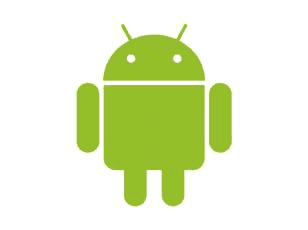

# 简介

Android 是一个基于 Linux 构建的开源操作系统。它支持众多设备，从智能手机到平板电脑再到游戏机（以及大量其他消费类电子产品）。根据国际数据公司的数据，Android 在 2012 年第四季度的全球智能手机市场份额超过 70％，因此该平台的开发有可能覆盖大量移动用户。

图 1：Android 徽标

Android 是 iOS 平台移动应用程序的主要替代品，但与 iOS 不同，Android 项目可以使用 OS X，Windows 或基于 Linux 的计算机轻松创建。而且由于 Android 使用 Java 编程语言，因此来自 C# 背景的开发人员很可能比使用 iOS 的 Objective-C 编程语言更舒服。

_Android 编程简洁 _ 的目标是通过友好，简洁的示例指导您完成 Android 开发的主要方面。您应该完全了解必要的设计模式，框架和 API，以生成精美的 Android 应用程序。如果您想跟随示例代码，可以在此处找到[。](https://bitbucket.org/syncfusiontech/android-programming-succinctly)