# 第 4 章用户界面布局

在每个`Activity`中布置 UI 元素是 Android 应用程序开发的最重要方面之一。它定义了应用程序的外观，如何收集和向用户显示信息，以及它们如何在组成应用程序的各种活动之间导航。

_Android Programming Succinctly_ 的第一章简要介绍了 XML 布局，但本章将更深入地介绍 Android 的内置布局选项。在本章中，我们将学习如何在线性，相对和网格布局中安排 UI 元素，Android 维护者推荐的常见导航模式，我们甚至会简要介绍如何开发能够独立于设备的布局无缝拉伸和收缩到不同的尺寸。

本章将与即将到来的章节密切配合，我们将在其中了解所有单独的 UI 元素。本章的运行示例使用按钮和文本字段来演示不同的布局功能，但请记住，您可以将下一章中讨论的任何 UI 元素替换为相同的效果。

## 加载 Android 项目

您可以从一个全新的 Android 项目中继续本章的示例，但是如果您想查看最终结果，可以加载本书示例代码中包含的 UserInterfaceLayouts 项目。要打开现有项目，请启动 **Eclipse** （使用 ADT 插件），然后在**文件**菜单中选择**导入**。这将打开一个如下图所示的对话框：

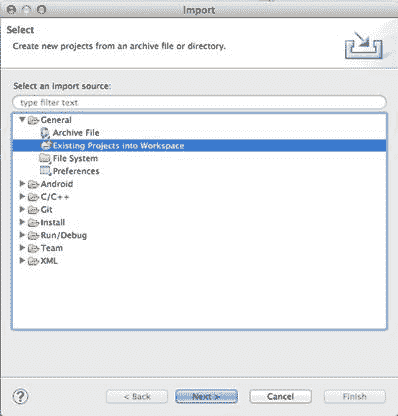

图 20：在 Eclipse 中打开一个项目

打开 **General** 文件夹并选择**现有项目到工作区**，然后单击 **Next。** 在下一个对话框中，单击**浏览...** ，找到本书附带的资源文件夹，然后打开 **UserInterfaceLayouts** 文件夹。单击**完成**后，您应该在 Package Explorer 中看到该项目。

## 加载布局

在第一章中，我们让模板为我们加载 XML 布局文件，但重要的是要了解它是如何工作的。幸运的是，这也是一个相对简单的过程。

编译项目时，Android 会自动从每个 XML 布局文件生成`View`实例。与`String`资源类似，可以通过静态`layout`变量下的特殊`R`类访问它们。例如，如果要访问从名为`activity_main.xml`的文件创建的`View`实例，则可以使用以下命令：

```
R.layout.activity_main

```

要在`Activity`中显示此`View`对象，您所要做的就是调用`setContentView()`方法。空白`Activity`模板的`onCreate()`方法始终包含对`setContentView()`的调用，以将相关视图加载到`Activity`中：

```
@Override
protected void onCreate(Bundle savedInstanceState) {
super.onCreate(savedInstanceState);
setContentView(R.layout.activity_main);
}

```

请注意，您可以将 _ 任何 _ `View`实例传递给`setContentView()`;使用生成的`R.layout.activity_main`对象只是处理基于 XML 的布局的有用约定。如果你需要动态替换`Activity`的内容，在`onCreate()`之外调用`setContentView()`是完全合法的。

## 基本视图属性

在我们开始讨论 Android 的内置布局方案之前，了解如何在特定布局中设置 UI 元素的大小和位置非常重要。接下来的三节将向您展示如何使用各种 XML 属性定义 UI 元素的尺寸，填充和边距。

### 大小

要设置特定 UI 元素的宽度，您需要做的就是在 XML 布局文件中为该元素添加`android:layout_width`属性。同样，`android:layout_height`属性定义元素的高度。这些参数之一的值必须是以下之一：

*   `wrap_content` - 此常量使元素尽可能大，以包含其内容。
*   `match_parent` - 此常量使元素与父元素的宽度和高度匹配。
*   显式尺寸 - 显式尺寸可以用像素（`px`），与密度无关的像素（`dp`），基于首选字体大小（`sp`），英寸（`in`）或毫米（ `mm`）。例如，`android:layout_width="120dp"`将使元素 120 与设备无关的像素变宽。
*   对资源的引用 - 维度资源允许您将可重用的值抽象为资源文件，就像我们在本书第一章中使用`strings.xml`所看到的那样。可以使用`@dimen/resource_id`语法访问维度资源，其中`resource_id`是`dimens.xml`中定义的资源的唯一 ID。

让我们从探索`wrap_content`开始吧。将`activity_main.xml`更改为以下内容并编译项目（我们将在本章后面讨论`LinearLayout`元素）：

```
<LinearLayout xmlns:android="http://schemas.android.com/apk/res/android"
xmlns:tools="http://schemas.android.com/tools"
android:layout_width="match_parent"
android:layout_height="match_parent"
android:orientation="vertical"
tools:context=".MainActivity"
>

<Button
android:layout_width="wrap_content"
android:layout_height="wrap_content"
android:text="Click me!" />

</LinearLayout>

```

您应该在屏幕顶部看到一个按钮，因为我们在两个维度上都使用了`wrap_content`，所以它应该足够大以适合“`Click me!”`文本（带有一些默认填充）。如果更改文本，按钮将展开或缩小以匹配。下图显示了您在 activity_main.xml 中创建的按钮。

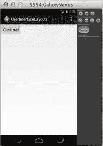

图 21：使用两个维度的 wrap_content 常量的 Button 元素

如果将`android:layout_width`和`android:layout_height`更改为`match_parent`，该按钮将填满整个屏幕，因为这是父`LinearLayout`的大小：

```
<Button
android:layout_width="match_parent"
android:layout_height="match_parent"
android:text="Click me!" />

```

当你运行它时，它应该类似于以下内容：


图 22：使用两个维度的 match_parent 常量的 Button 元素

如果您需要更多地控制 UI 元素的大小，您始终可以使用显式值手动定义它们的宽度和高度，如下所示：

```
<Button
android:layout_width="200dp"
android:layout_height="60dp"
android:text="Click me!" />

```

这使按钮 200 与设备无关的像素宽 60 个与设备无关的像素高，如下图所示：

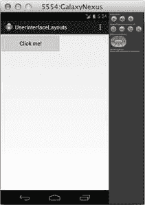

图 23：具有明确宽度和高度的 Button 元素

最后一个选项是为`dimens.xml`添加一个显式维度，并从`activity_main.xml`中引用它。如果您有许多需要共享相同维度的元素，这非常有用。维度资源引用看起来就像字符串资源引用，除了使用`@dimen`而不是`@string`：

```
<Button
android:layout_width="@dimen/button_width"
android:layout_height="@dimen/button_height"
android:text="Click me!" />

```

当然，在编译项目之前，您还必须将这些资源添加到`dimens.xml`：

```
<resources>

<!-- Default screen margins, per the Android Design guidelines. -->
<dimen name="activity_horizontal_margin">16dp</dimen>
<dimen name="activity_vertical_margin">16dp</dimen>
<dimen name="button_width">200dp</dimen>
<dimen name="button_height">60dp</dimen>

</resources>

```

这将与前一个片段具有完全相同的效果，但现在可以在其他布局（或同一布局中的其他元素）中重复使用`button_width`和`button_height`值。

值得注意的是，您可以混合使用不同的宽度和高度值方法。例如，使用`200dp`作为宽度和`wrap_content`作为高度是完全合法的。

### 填充

填充是元素内容与其边界之间的空间。它可以通过以下任何属性来定义，所有这些属性都采用明确的维度（例如，`120dp`）或对资源的引用（例如，`@dimen/button_padding`）：

*   `android:padding` - 为元素的所有边设置一个统一值。
*   `android:paddingTop` - 设置元素上边缘的填充。
*   `android:paddingBottom` - 设置元素下边缘的填充。
*   `android:paddingLeft` - 设置元素左边缘的填充。
*   `android:paddingRight` - 设置元素右边缘的填充。
*   `android:paddingStart` - 设置元素起始边缘的填充。
*   `android:paddingEnd` - 设置元素结束边的填充。

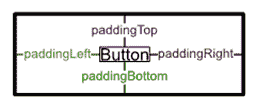

图 24：填充属性

填充可以添加到`View`或`ViewGroup`元素。对于前者，它定义元素内容（例如，按钮的标题文本）与其边界之间的空间，对于后者，它定义了组边缘与其所有子元素之间的空间。例如，以下按钮将在其标题文本周围包含 60 个与设备无关的像素：

```
<Button
android:layout_width="wrap_content"
android:layout_height="wrap_content"
android:padding="60dp"
android:text="Click me!" />

```

这应该导致以下结果：

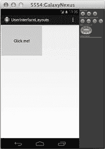

图 25：具有 60dp 填充的按钮

接下来，让我们尝试在包含`ViewGroup`（即`LinearLayout`元素）的顶部和底部添加一些填充，并使按钮与其父级的大小匹配，如下所示：

```
<LinearLayout xmlns:android="http://schemas.android.com/apk/res/android"
xmlns:tools="http://schemas.android.com/tools"
android:layout_width="match_parent"
android:layout_height="match_parent"
android:orientation="vertical"
android:paddingTop="24dp"
android:paddingBottom="24dp"
tools:context=".MainActivity"
>

<Button
android:layout_width="match_parent"
android:layout_height="match_parent"
android:text="Click me!" />

</LinearLayout>

```

这表明在子元素上使用`match_parent`会考虑父元素的填充。请注意以下屏幕截图顶部和底部的`24dp`填充：

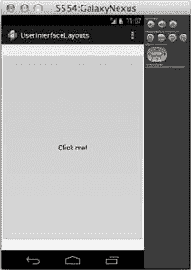

图 26：一个 Button，其宽度和高度为 match_parent，其父 ViewGroup 为 24dp 顶部和底部填充

### 保证金

元素的边距是其边框与周围元素或父元素边缘之间的空间。可以使用`android:layout_margin`元素为任何`View`或`ViewGroup`指定它。并且，与`android:padding`一样，可以使用`android:layout_marginTop`，`android:layout_marginBottom`等单独定义顶部，底部，左侧，右侧，开始和结束边距。

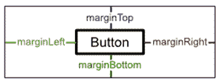

图 27：保证金属性

例如，下面的代码通过在`Button`上定义顶部和底部边距而不是父`LinearLayout`上的顶部和底部边距，创建与上一节中的示例相同的结果：

```
<LinearLayout xmlns:android="http://schemas.android.com/apk/res/android"
xmlns:tools="http://schemas.android.com/tools"
android:layout_width="match_parent"
android:layout_height="match_parent"
android:orientation="vertical"
tools:context=".MainActivity"
>

<Button
android:layout_width="match_parent"
android:layout_height="match_parent"
android:layout_marginTop="24dp"
android:layout_marginBottom="24dp"
android:text="Click me!" />

</LinearLayout>

```

## 常见布局

Android 提供了三种主要的 UI 元素排列方式：线性布局，相对布局和网格布局。前两个方法分别使用名为`LinearLayout`和`RelativeLayout`的类。这些是`ViewGroup`的子类，它们具有内置功能，用于设置子`View`对象的位置和大小。网格布局使得向用户显示一维和二维数据结构变得容易，并且它们比线性或相对布局稍微复杂一些。下图显示了可用的布局元素：

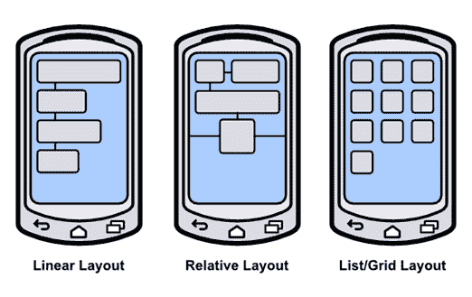

图 28：三种标准 Android 布局

### 线性布局

`LinearLayout`类水平或垂直排列所有包含的 UI 元素。它以与 XML 文件中显示的顺序相同的顺序显示每个元素，使其成为创建由许多元素组成的复杂布局的非常简单的方法。

#### 方向

`LinearLayout`元素需要知道它应该在哪个方向上布置其子元素。这是通过`android:orientation`属性指定的，该属性的值可以是`horizontal`或`vertical`。水平布局将使每个子元素从左到右堆叠（与源 XML 中显示的顺序相同）。例如，尝试将`activity_main.xml`更改为以下内容：

```
<LinearLayout xmlns:android="http://schemas.android.com/apk/res/android"
xmlns:tools="http://schemas.android.com/tools"
android:layout_width="match_parent"
android:layout_height="match_parent"
android:orientation="horizontal"
tools:context=".MainActivity"
>

<Button
android:layout_width="wrap_content"
android:layout_height="wrap_content"
android:text="Click me!" />
<Button
android:layout_width="wrap_content"
android:layout_height="wrap_content"
android:text="Click me!" />
<Button
android:layout_width="wrap_content"
android:layout_height="wrap_content"
android:text="Click me!" />

</LinearLayout>

```

如果您编译项目并在模拟器中运行它，您应该看到一行三个按钮，如下所示：

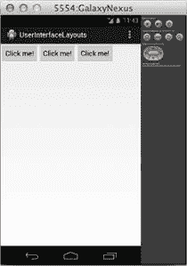

图 29：具有水平方向的 LinearLayout

但是如果你将方向更改为`vertical`，就像这样：

```
<LinearLayout xmlns:android="http://schemas.android.com/apk/res/android"
xmlns:tools="http://schemas.android.com/tools"
android:layout_width="match_parent"
android:layout_height="match_parent"
android:orientation="vertical"
tools:context=".MainActivity"
>
...
</LinearLayout>

```

这三个按钮将显示在一列中：

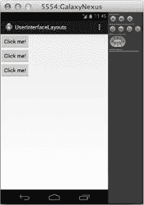

图 30：具有垂直方向的 LinearLayout

#### 重量

您可以使用本章前面讨论的相同`android:layout_width`和`android:layout_height`属性来定义每个子元素的大小，但`LinearLayout`也会启用另一个名为`android:layout_weight`的大小调整选项。元素的权重决定了它相对于兄弟姐妹占用多少空间。例如，如果您希望在父`LinearLayout`的高度上均匀分布三个按钮，则可以使用以下内容：

```
<LinearLayout xmlns:android="http://schemas.android.com/apk/res/android"
xmlns:tools="http://schemas.android.com/tools"
android:layout_width="match_parent"
android:layout_height="match_parent"
android:orientation="vertical"
tools:context=".MainActivity"
>

<Button
android:layout_width="match_parent"
android:layout_height="0dp"
android:layout_weight="1"
android:text="Click me!" />
<Button
android:layout_width="match_parent"
android:layout_height="0dp"
android:layout_weight="1"
android:text="Click me!" />
<Button
android:layout_width="match_parent"
android:layout_height="0dp"
android:layout_weight="1"
android:text="Click me!" />

</LinearLayout>

```

请注意，对于垂直方向，您需要将每个元素的`android:layout_height`属性设置为`0`，以便可以使用指定的权重自动计算。对于水平方向，您需要将`android:layout_width`设置为`0`。运行上面的代码应该给你以下内容：

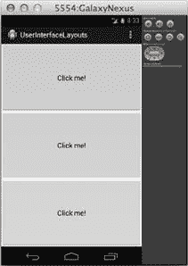

图 31：垂直线性布局中的均匀加权 UI 元素

您可以更改重量比，使按钮占据不同比例的屏幕。例如，将按钮权重更改为 2,1,1 将使第一个按钮占据屏幕的一半，另外两个占据屏幕的四分之一：

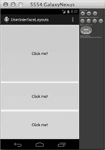

图 32：垂直线性布局中不均匀加权的 UI 元素

为 UI 元素指定权重而不是显式维度是一种灵活的配置布局的方法，因为它允许它们自动缩放以匹配父`ViewGroup`的大小。

### 相对布局

`RelativeLayout`是`LinearLayout`的替代方法，它允许您指定每个元素相对于界面中其他元素的放置位置。与`LinearLayout`不同，`RelativeLayout`的呈现接口中元素的顺序不一定必须与基础 XML 文件匹配。相反，它们的位置是通过指定与另一个元素的关系来定义的（例如，“将按钮放在文本字段的左侧”或“将按钮放在其父元素的底部”）。相对于其他元素定义位置的事实使得这是创建基于屏幕大小扩展和收缩的令人满意的 UI 的非常强大的方式。

#### 相对于父母

在`RelativeLayout`中，UI 元素可以相对于其父元素或相对于其兄弟元素进行定位。在任何一种情况下，您都可以使用 [RelativeLayouts.LayoutParams](http://developer.android.com/reference/android/widget/RelativeLayout.LayoutParams.html) 定义的布局属性之一来定义位置。下面列出了相对于其父元素定位元素的属性，并且所有属性都采用布尔值：

*   `android:layout_alignParentLeft` - 如果是`true`，则将元素的左侧与其父元素的左侧对齐。
*   `android:layout_centerHorizontal` - 如果`true`，则将元素水平居中于其父级。
*   `android:layout_alignParentRight` - 如果`true`，将元素的右侧与其父级的右侧对齐。
*   `android:layout_alignParentTop` - 如果`true`，则将元素的顶部与其父元素的顶部对齐。
*   `android:layout_centerVertical` - 如果`true`，则将元素垂直居中于其父级。
*   `android:layout_alignParentBottom` - 如果`true`，将元素的底部与其父元素的底部对齐。
*   `android:layout_alignParentStart` - 如果是`true`，则将元素的起始边缘与其父元素的起始边缘对齐。
*   `android:layout_alignParentEnd` - 如果是`true`，则将元素的结束边缘与其父元素的结束边缘对齐。
*   `android:layout_centerInParent` - 如果`true`，则在其父级中水平和垂直居中元素。

例如，尝试将`activity_main.xml`更改为以下内容：

```
<RelativeLayout xmlns:android="http://schemas.android.com/apk/res/android"
xmlns:tools="http://schemas.android.com/tools"
android:layout_width="match_parent"
android:layout_height="match_parent"
tools:context=".MainActivity"
>

<Button
android:layout_width="wrap_content"
android:layout_height="wrap_content"
android:layout_alignParentRight="true"
android:layout_alignParentBottom="true"
android:text="Top Button" />
<Button
android:layout_width="wrap_content"
android:layout_height="wrap_content"
android:layout_centerHorizontal="true"
android:layout_centerVertical="true"
android:text="Middle Button" />
<Button
android:layout_width="wrap_content"
android:layout_height="wrap_content"
android:layout_alignParentLeft="true"
android:layout_alignParentTop="true"
android:text="Bottom Button" />

</RelativeLayout>

```

这将产生一个对角线的三个按钮，如下所示：

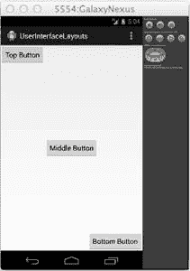

图 33：RelativeLayout，它根据父元素定位元素

请注意，如果更改`activity_main.xml`中 XML 元素的顺序，按钮仍将显示在相同的位置。这与`LinearLayout`的行为不同，后者将每个元素相对于前一个元素放置。另请注意，如果更改按钮尺寸或旋转模拟器（Ctrl + F12），它们仍将显示在相对于屏幕的相应位置。

#### 相对于兄弟姐妹

元素也可以相对于彼此定位。下面列出的属性都指定了与周围元素的图形关系，但它们不需要布尔值，而是需要布局中另一个元素的 ID：

*   `android:layout_above` - 将元素的下边缘定位在具有指定 ID 的元素上方。
*   `android:layout_below` - 将元素的上边缘定位在具有指定 ID 的元素下方。
*   `android:layout_toLeftOf` - 将元素的右边缘定位到具有指定 ID 的元素的左侧。
*   `android:layout_toRightOf` - 将元素的左边缘定位到具有指定 ID 的元素的右侧。
*   `android:layout_alignBaseline` - 将元素的基线与具有指定 ID 的元素的基线对齐。
*   `android:layout_alignTop` - 将元素的上边缘与具有指定 ID 的元素顶部对齐。
*   `android:layout_alignBottom` - 将元素的下边缘与具有指定 ID 的元素的下边缘对齐。
*   `android:layout_alignLeft` - 将元素的左边缘与具有指定 ID 的元素的左边缘对齐。
*   `android:layout_alignRight` - 将元素的右边缘与具有指定 ID 的元素的右边缘对齐。

例如，请考虑以下`RelativeLayout`使用相对于兄弟属性而不是相对于父属性。第二个和第三个按钮相对于第一个按钮定位，第一个和第三个按钮位于默认的左上角。

```
<Button
android:id="@+id/topButton"
android:layout_width="wrap_content"
android:layout_height="wrap_content"
android:text="Top Button" />
<Button
android:id="@+id/middleButton"
android:layout_width="wrap_content"
android:layout_height="wrap_content"
android:layout_below="@id/topButton"
android:layout_toRightOf="@id/topButton"
android:text="Middle Button" />
<Button
android:layout_width="wrap_content"
android:layout_height="wrap_content"
android:layout_below="@id/middleButton"
android:layout_toRightOf="@id/middleButton"
android:text="Bottom Button" />

```

而不是跨越整个屏幕的对角线按钮，此代码将为您提供一个对角线，所有按钮角都接触：

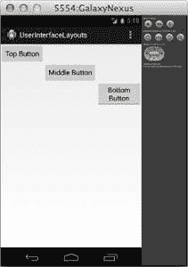

图 34：RelativeLayout，它根据兄弟姐妹定位元素

由于我们通过 ID 引用它们，我们需要为顶部和中间按钮包含`android:id`属性。请记住，从第一章开始，第一次使用 XML 元素 ID 时，需要将其声明为`"@+id/foo"`。此加号通常出现在`android:id`属性中，但它不必 - 它应始终在使用该 ID 的 _ 第一个 _ 属性中找到。在下面的代码片段中，`android:layout_toLeftOf`属性是引用`middleButton`和`bottomButton` ID 的第一个位置，因此它们需要以加号为前缀：

```
<Button
android:layout_width="wrap_content"
android:layout_height="wrap_content"
android:layout_toLeftOf="@+id/middleButton"
android:layout_above="@id/middleButton"
android:text="Top Button" />
<Button
android:id="@id/middleButton"
android:layout_width="wrap_content"
android:layout_height="wrap_content"
android:layout_toLeftOf="@+id/bottomButton"
android:layout_above="@id/bottomButton"
android:text="Middle Button" />
<Button
android:id="@id/bottomButton"
android:layout_width="wrap_content"
android:layout_height="wrap_content"
android:layout_alignParentRight="true"
android:layout_alignParentBottom="true"
android:text="Bottom Button" />

```

使用加号有助于通过确保明确标记新 ID 来减少错误输入 ID 的数量。例如，如果您不小心尝试使用`@id/bottumButton`引用元素，编译器会告诉您没有这样的元素。

上面的 XML 将顶部和中间按钮相对于底部按钮定位，然后将底部按钮放在屏幕的右下角。这为您提供了以下布局：

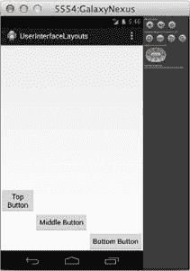

图 35：RelativeLayout，用于定位相对于尚未声明的元素的按钮

另请注意，您可以将 relative-to-sibling 与 relative-to-parent 定位方法相结合。底部按钮相对于其父部件（例如，`android:layout_alignParentRight`）定位，而其他部件相对于兄弟部件（例如，`android:layout_toLeftOf`）定位。

### 列表和网格布局

到目前为止，我们已经学会了如何使用`LinearLayout`和`RelativeLayout`快速创建用户界面;但是，这些接口的内容完全是静态的 - 它们的 UI 元素被硬编码到底层 XML 文件中。当您想使用动态数据创建用户界面时，事情变得更复杂一些。数据驱动的布局需要三个组件：

*   一组数据。
*   [Adapter](http://developer.android.com/reference/android/widget/Adapter.html) 的子类，用于将数据项转换为`View`对象。
*   [AdapterView](http://developer.android.com/reference/android/widget/AdapterView.html) 的子类，用于布置`Adapter`创建的`View`对象。

在开始配置数据驱动布局之前，您需要一些数据才能使用。对于本节，我们的数据集将是一个简单的`String`对象数组，但 Android 还提供了许多内置类，用于从文本文件，数据库或 Web 服务中获取数据。

接下来，您需要`Adapter`将数据转换为`View`对象。例如，内置的 [ArrayAdapter](http://developer.android.com/reference/android/widget/ArrayAdapter.html) 获取一个对象数组，为每个对象创建一个`TextView`，并将其 text 属性设置为数组中每个对象的`toString()`值。然后将这些`TextView`实例发送到`AdapterView`。

`AdapterView`是`ViewGroup`子类，它取代了前面部分中的`LinearLayout`和`RelativeLayout`类。它的工作是安排`Adapter`提供的`View`对象。本节探讨了两个最常见的`AdapterView`子类， [ListView](http://developer.android.com/reference/android/widget/ListView.html) 和 [GridView](http://developer.android.com/reference/android/widget/GridView.html) ，它们分别将这些视图定位到列表或网格中。

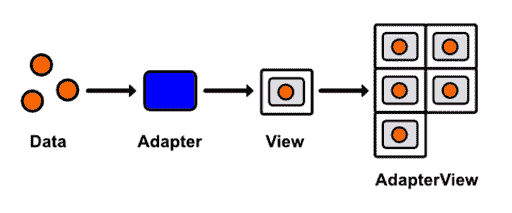

图 36：使用适配器在 GridView 中显示数据集

#### 列出布局

让我们从简单的`ListView`开始运行开始吧。由于我们不再对 UI 元素进行硬编码，因此我们的 XML 布局文件将变得非常简单 - 它只需要一个空的`ListView`元素。将`activity_main.xml`更改为以下内容：

```
<ListView xmlns:android="http://schemas.android.com/apk/res/android"
android:id="@+id/listView"
android:layout_width="wrap_content"
android:layout_height="wrap_content" />

```

这个`ListView`定义了我们的整个 XML 布局 - 它的所有 UI 元素都将动态填充。但是，我们需要包含`android:id`属性，以便我们可以从活动中访问`ListView`实例。

接下来，我们需要更新`MainActivity`类来定义数据集，将该数据集传递给`Adapter`，然后将该适配器传递给我们在`activity_main.xml`中定义的`ListView`。因此，将`MainActivity.java`更改为以下内容：

```
package com.example.userinterfacelayouts;

import android.os.Bundle;
import android.app.Activity;
import android.widget.ListView;
import android.widget.ArrayAdapter;

public class MainActivity extends Activity {

@Override
protected void onCreate(Bundle savedInstanceState) {
super.onCreate(savedInstanceState);
setContentView(R.layout.activity_main);

String[] data = new String[] { "Item 1", "Item 2", "Item 3",
"Item 4" };

ArrayAdapter<String> adapter = new ArrayAdapter<String>(this, android.R.layout.simple_list_item_1, data);
ListView listView = (ListView) findViewById(R.id.listView);
listView.setAdapter(adapter);
}
}

```

首先，我们创建一个`String`数组作为我们的数据集并将其分配给本地`data`变量。然后，我们创建一个`ArrayAdapter`，它从数组中的每个`String`生成一个`TextView`。它的构造函数采用`Activity`上下文，原型`TextView`的 ID 和数据数组。 `android.R.layout.simple_list_item_1`片段是对 Android 方便的内置布局之一的引用。您可以在 [R.layout 文档](http://developer.android.com/reference/android/R.layout.html)中找到完整列表。接下来，我们必须找到我们通过`findViewById()`添加到`activity_main.xml`的`ListView`，然后我们需要将其适配器属性设置为我们刚刚配置的`ArrayAdapter`实例。

您现在应该能够编译项目并看到`data`数组中的四个字符串显示为`TextView`元素列表：

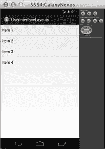

图 37：ListView 生成的动态布局

列表布局使得处理大型数据集变得异常简单，并且您可以使用 _ 任何 _ 视图表示每个项目，这样您就可以显示具有多个属性的对象（例如，所有显示的属性的联系人列表）图像，名称和首选电话号码）。

#### 网格布局

网格布局使用相同的数据/ `Adapter` / `AdapterView`模式作为列表布局，但不使用`ListView`，而是使用 [GridView](http://developer.android.com/reference/android/widget/GridView.html) 类。 `GridView`还定义了一些额外的配置选项，用于定义列数和每个网格项之间的间距，其中大部分包含在下面的代码段中。尝试将`activity_main.xml`更改为：

```
<GridView xmlns:android="http://schemas.android.com/apk/res/android"
android:id="@+id/gridView"
android:layout_width="fill_parent"
android:layout_height="fill_parent"
android:columnWidth="100dp"
android:numColumns="auto_fit"
android:verticalSpacing="5dp"
android:horizontalSpacing="5dp"
android:stretchMode="columnWidth" />

```

我们需要在`MainActivity.java`中进行的唯一更改是更新`GridView`对`GridView`的引用：

```
package com.example.userinterfacelayouts;

import android.os.Bundle;
import android.app.Activity;
import android.widget.GridView;
import android.widget.ArrayAdapter;

public class MainActivity extends Activity {
@Override
protected void onCreate(Bundle savedInstanceState) {
super.onCreate(savedInstanceState);
setContentView(R.layout.activity_main);

String[] data = new String[] { "Item 1", "Item 2", "Item 3",
"Item 4", "Item 5", "Item 6",
"Item 7", "Item 8", "Item 9"};

ArrayAdapter<String> adapter = new ArrayAdapter<String>(this, android.R.layout.simple_list_item_1, data);
GridView gridView = (GridView) findViewById(R.id.gridView);
gridView.setAdapter(adapter);
}
}

```

这将为您提供一个很好的文本字段网格，这些字段是 100 个与设备无关的像素宽，每个像素之间有 5 个与设备无关的像素：

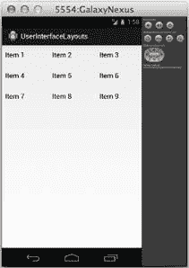

图 38：GridView 生成的动态布局

#### 处理点击事件

当然，您可能希望允许用户与`ListView`或`GridView`中的项目进行交互。但是，由于这些类中的任何一个生成的接口都是动态的，因此当用户单击其中一个列表项时，我们无法使用`android:onClick` XML 属性来调用方法。相反，我们必须在`MainActivity.java`中定义一个通用的回调函数。这可以通过实现 [AdapterView.OnItemClickListener](http://developer.android.com/reference/android/widget/AdapterView.OnItemClickListener.html) 接口来完成，如下所示：

```
package com.example.userinterfacelayouts;

import android.os.Bundle;
import android.app.Activity;
import android.widget.GridView;
import android.widget.ArrayAdapter;

import android.util.Log;
import android.view.View;
import android.widget.TextView;
import android.widget.AdapterView;
import android.widget.AdapterView.OnItemClickListener;

public class MainActivity extends Activity {

private static final String TAG = "MainActivity";

@Override
protected void onCreate(Bundle savedInstanceState) {
super.onCreate(savedInstanceState);
setContentView(R.layout.activity_main);

String[] data = new String[] { "Item 1", "Item 2", "Item 3",
"Item 4", "Item 5", "Item 6",
"Item 7", "Item 8", "Item 9"};

ArrayAdapter<String> adapter = new ArrayAdapter<String>(this, android.R.layout.simple_list_item_1, data);
GridView gridView = (GridView) findViewById(R.id.gridView);
gridView.setAdapter(adapter);

gridView.setOnItemClickListener(new OnItemClickListener() {
public void onItemClick(AdapterView<?> parent, View v,
int position, long id) {
                  TextView selectedView = (TextView) v;
Log.d(TAG, String.format("You clicked: %s",
selectedView.getText()));
}
});
}
}

```

现在，每次单击`GridView`的一个项目时，都会调用`onItemClick()`方法。所有相关参数都作为参数传递给该函数：父`AdapterView`，被点击的`View`项，它在数据集中的位置，以及它的`row` id。上面的回调只是将单击的`View`转换为`TextView`并显示它在 LogCat 中包含的任何文本。

对于`ListView`布局，可以使用完全相同的方式处理单击。

#### 编辑数据集

当您想要更改在运行时显示给用户的数据时，您所要做的就是编辑基础数据集，内置的 [BaseAdapter](http://developer.android.com/reference/android/widget/BaseAdapter.html) 类负责相应地更新用户界面。在本节中，我们将向布局添加一个按钮，以便用户可以向网格添加新项目，然后我们将重新实现`onItemClick()`功能以从列表中删除所选项目。

首先，让我们改变`activity_main.xml`以包含一个按钮。我们将通过将`LinearLayout`作为根 XML 元素并为其提供`Button`和`GridView`来实现此目的：

```
<LinearLayout xmlns:android="http://schemas.android.com/apk/res/android"
xmlns:tools="http://schemas.android.com/tools"
android:layout_width="fill_parent"
android:layout_height="fill_parent"
android:orientation="vertical"
tools:context=".MainActivity" >

<Button
android:layout_width="match_parent"
android:layout_height="80dp"
android:text="Add Item"
android:onClick="addItem"/>

<GridView android:id="@+id/gridView"
android:layout_width="fill_parent"
android:layout_height="fill_parent"
android:columnWidth="100dp"
android:numColumns="auto_fit"
android:verticalSpacing="5dp"
android:horizontalSpacing="5dp"
android:stretchMode="columnWidth" />
</LinearLayout>

```

请注意，将不同的布局方案嵌套在彼此内部是完全合法的（即，将`GridView`放在`LinearLayout`内）。这使得可以轻松创建复杂，动态的用户界面。

接下来，我们需要更改相应的活动来处理 Add Item 按钮点击，并在`GridView`中选择它们时删除它们。这将需要对`MainActivity.java`进行一些更改：

```
package com.example.userinterfacelayouts;

import android.os.Bundle;
import android.app.Activity;
import android.widget.GridView;
import android.widget.ArrayAdapter;

import android.view.View;
import android.widget.AdapterView;
import android.widget.AdapterView.OnItemClickListener;
import java.util.ArrayList;

public class MainActivity extends Activity {

private ArrayList<String> data;
private ArrayAdapter<String> adapter;
private int count;

@Override
protected void onCreate(Bundle savedInstanceState) {
super.onCreate(savedInstanceState);
setContentView(R.layout.activity_main);

this.data = new ArrayList<String>();
this.data.add("Item 1");
this.data.add("Item 2");
this.data.add("Item 3");
this.count = 3;

adapter = new ArrayAdapter<String>(this, android.R.layout.simple_list_item_1, data);
GridView gridView = (GridView) findViewById(R.id.gridView);
gridView.setAdapter(adapter);

gridView.setOnItemClickListener(new OnItemClickListener() {
public void onItemClick(AdapterView<?> parent, View v,
int position, long id) {
data.remove(position);
adapter.notifyDataSetChanged();
}
});
}

public void addItem(View view) {
count++;
String newItem = String.format("Item %d", count);
this.data.add(newItem);
this.adapter.notifyDataSetChanged();
}
}

```

首先，我们必须将表示我们数据集的静态`String[]`数组更改为可变`ArrayList`。这将允许我们添加和删除项目。我们还必须将`data`和`adapter`局部变量更改为实例变量，以便我们可以在`onCreate()`之外访问它们。我们还添加了一个`count`变量来跟踪已创建的项目数。

要从`GridView`中删除项目，我们所要做的就是使用`ArrayList`的`remove()`方法从数据集中删除它，然后调用`adapter.notifyDataSetChanged()`。后一种方法由`BaseAdapter`定义，它告诉`Adapter`它需要同步其相关的`AdapterView`项。只要底层数据集发生变化，就应该调用它。

只要单击“添加项目”按钮，就会调用新的`addItem()`方法。首先，它递增`count`变量，然后使用它为新项目生成标题，将标题添加到数据集，最后调用`notifyDataSetChanged()`刷新`GridView`。

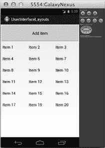

图 39：在数据集中添加和删除项目

您现在应该能够编译项目并更改基础数据集。虽然此示例仅演示了从`GridView`添加和删除项目，但编辑现有项目的方式完全相同。您所要做的就是更改`ArrayList`中的值并调用适配器上的`notifyDataSetChanged()`。

#### 自定义 ListView（和 GridView）项目

到目前为止，我们一直在使用的`R.layout.simple_list_item_1` `TextView`在处理字符串数据时非常方便，但更复杂的数据项通常需要相应的复杂视图。幸运的是，实现自己的`ListView`或`GridView`项目相对容易。在本节中，我们将创建一个显示名称和电话号码的自定义视图。

自定义`ListView`项需要三个组件：一个表示数据的类，一个用于定义每个项的`View`的 XML 布局文件，以及一个用于在视图中显示数据的自定义`Adapter`。这些组件将替换前一个示例中的`String`数据，`android.R.layout.simple_list_item_1` 视图和 `ArrayAdapter` 。我们的目标是这样的结果：

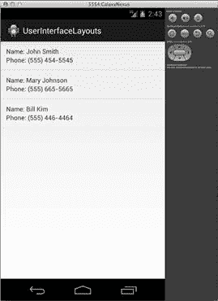

图 40：ListView 包含每个项目的自定义 View 对象

首先，我们需要创建一个新类来表示自定义数据项。我们称之为`DataItem`，它需要存储的是两个叫做`name`和`phoneNumber`的属性。您可以通过按 **Cmd + N** （如果您在 PC 上，则按 Ctrl + N）在 Eclipse 中创建一个新类，然后选择 **Java** ，然后选择**类**。为**名称**字段输入`DataItem`，并将其他所有内容保留为默认值。表单应如下所示：

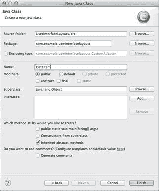

图 41：创建 DataItem 类

单击**完成**后，您应在 Package Explorer 中的`src/com.example.userinterfacelayouts`下找到一个名为`DataItem.java`的新文件。双击该文件以将其打开，并将其更改为以下内容：

```
package com.example.userinterfacelayouts;

public class DataItem {

String name;
String phoneNumber;

public DataItem(String name, String phoneNumber) {
this.name = name;
this.phoneNumber = phoneNumber;
}

}

```

这为每个数据项定义了两个属性，以及一个方便的构造函数。这就是我们表示数据所需的全部内容，因此我们可以继续使用 XML 布局文件来定义与每个数据项关联的`View`对象。

要创建布局 XML 文件，请按 **Cmd + N** （如果在 PC 上，则按 Ctrl + N）并选择 **Android** ，然后选择 **Android XML 布局文件** ]。将`list_item.xml`用于**文件**字段，并将**根元素**保留为默认值（我们将通过编辑 XML 来更改它）。单击**完成**将在`res/layout`文件夹中为您提供一个名为`list_item.xml`的新文件。我们希望每个项目看起来如下所示：

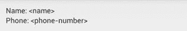

图 42：list_item.xml 创建的视图

我们将使用`RelativeLayout`和四个`TextView`元素来创建此布局。将`list_item.xml`更改为以下内容：

```
<?xml version="1.0" encoding="utf-8"?>
<RelativeLayout xmlns:android="http://schemas.android.com/apk/res/android"
android:layout_width="match_parent"
android:layout_height="match_parent"
android:padding="12dp">

<TextView
android:id="@+id/nameLabel"
android:layout_width="wrap_content"
android:layout_height="wrap_content"
android:text="@string/nameLabel"/>

<TextView
android:id="@+id/nameValue"
android:layout_toRightOf="@id/nameLabel"
android:layout_width="wrap_content"
android:layout_height="wrap_content"/>

<TextView
android:id="@+id/phoneLabel"
android:layout_below="@id/nameLabel"
android:layout_width="wrap_content"
android:layout_height="wrap_content"
android:text="@string/phoneLabel"/>

<TextView
android:id="@+id/phoneValue"
android:layout_below="@id/nameLabel"
android:layout_toRightOf="@id/phoneLabel"
android:layout_width="wrap_content"
android:layout_height="wrap_content"/>

</RelativeLayout>

```

`id/nameValue`和`id/phoneValue`元素将由我们的自定义`Adapter`动态设置，因此它们不需要`android:text`属性，但`id/nameLabel`和`id/phoneLabel`元素是静态标签，因此它们是可以从`strings.xml`填充。将以下两行添加到`strings.xml`：

```
<string name="nameLabel">Name:&#160;</string>
<string name="phoneLabel">Phone:&#160;</string>

```

这里唯一的新部分是`&#160;`实体，它是一个不间断的空间。这是使我们的标签正确显示所必需的。这会处理 XML 布局文件，所以我们剩下的就是自定义`Adapter`将它与`DataItem`类连接起来。

创建另一个名为`CustomAdapter`的新类，并使用`BaseAdapter`作为子类。 [BaseAdapter](http://developer.android.com/reference/android/widget/BaseAdapter.html) 是`Adapter`类的最小实现。它为`Adapter`的内部工作提供了一些基本定义，这使我们可以专注于`CustomAdapter`中的更高级功能。这将是一个更长的类定义，所以让我们分步解决它。

让我们首先将`CustomAdapter.java`更改为以下内容：

```
package com.example.userinterfacelayouts;

import java.util.ArrayList;

import android.view.View;
import android.view.ViewGroup;
import android.view.LayoutInflater;
import android.content.Context;
import android.widget.BaseAdapter;
import android.widget.TextView;

public class CustomAdapter extends BaseAdapter {

ArrayList<DataItem> data;
Context context;
private static LayoutInflater inflater = null;

public CustomAdapter(Context context, ArrayList<DataItem> data) {
this.context = context;
this.data = data;
inflater = (LayoutInflater) context
.getSystemService(Context.LAYOUT_INFLATER_SERVICE);
}

}

```

首先导入我们稍后需要的类。然后，它定义了一些属性。 `data`变量存储支持适配器的数据，该数据只是`DataItem`对象的`ArrayList`。 [Context](http://developer.android.com/reference/android/content/Context.html) 类包含有关全局应用程序环境的信息，我们需要在`context`变量中存储对它的引用。最后，我们需要`LayoutInflater`将 XML 从`list_item.xml`转换为`View`层次结构。没有这个`LayoutInflater`，就不可能找到我们在`list_item.xml`中定义的文本字段。

接下来，我们定义一个构造函数，它将`Context`实例和数据集作为参数。然后，它使用上下文来获取`LayoutInflater`。 `Context`实例的 [getSystemService（）](http://developer.android.com/reference/android/content/Context.html#getSystemService(java.lang.String))方法是执行此操作的规范方法。

现在我们已准备好定义适配器的自定义行为。将以下方法添加到`CustomAdapter.java`：

```
@Override
public int getCount() {
return data.size();
}

@Override
public Object getItem(int position) {
return data.get(position);
}

@Override
public long getItemId(int position) {
return position;
}

@Override
public View getView(int position, View convertView, ViewGroup parent) {
// See if the view needs to be inflated
View view = convertView;
if (view == null) {
view = inflater.inflate(R.layout.list_item, null);
}
// Extract the desired views
TextView nameText = (TextView) view.findViewById(R.id.nameValue);
TextView phoneText = (TextView) view.findViewById(R.id.phoneValue);

// Get the data item
DataItem item = data.get(position);

// Display the data item's properties
nameText.setText(item.name);
phoneText.setText(item.phoneNumber);

return view;
}

```

前三种方法提供了所有`Adapter`子类所需的信息。 `getCount()`和`getItem()`方法必须分别返回适配器表示的项目数和指定位置的项目。这些都只需要从底层`ArrayAdapter`转发信息。 `getItemId()`方法应该返回指定位置的项目的行 ID。在这种情况下，我们可以返回数组中项的位置。

我们`CustomAdapter`类的核心是`getView()`方法，它必须返回一个`View`对象，该对象表示指定位置的数据项。这是`list_view.xml`文件转换为`View`并且其`TextView`用相关`DataItem`的数据填充的地方。

首先，我们需要查看适配器是否正在使用现有视图，该视图将通过`convertView`参数传入。如果不是，我们需要通过**使用我们在构造函数中记录的`LayoutInflater`实例来扩展** XML 布局文件来创建一个新的`View`实例。这将解析 XML，将每个元素转换为其对应的视图对象，并将其添加到视图层次结构中。最后，我们需要找到我们在 XML 文件中定义的`TextView`元素，并使用它们来显示所请求的`DataItem`的`name`和`phoneNumber`属性。下图显示了如何扩展 XML 布局文件以访问包含的视图。

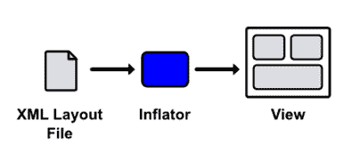

图 43：扩展 XML 布局文件以访问包含的视图

这个过程应该更好地理解`Adapter`的目的：它的`getView()`方法是数据集 _ 适应 _ 在`View`层次结构中显示的地方。返回的`View`实例是父`ListView` / `GridView`显示的实例。

我们设置了自定义`ListView`的三个组件，但我们仍然需要将所有组件放在主要活动中。 `activity_main.xml`所需要的只是`ListView`我们可以在`MainActivity.java`中引用：

```
<LinearLayout xmlns:android="http://schemas.android.com/apk/res/android"
xmlns:tools="http://schemas.android.com/tools"
android:layout_width="fill_parent"
android:layout_height="fill_parent"
android:orientation="horizontal"
tools:context=".MainActivity" >

<ListView
android:id="@+id/listView"
android:layout_width="fill_parent"
android:layout_height="fill_parent" />

</LinearLayout>

```

然后，在`MainActivity.java`中，我们需要创建`DataItem`实例的数据集并将我们的`CustomAdapter`附加到上面的`ListView`：

```
package com.example.userinterfacelayouts;

import android.os.Bundle;
import android.app.Activity;
import android.widget.ListView;
import java.util.ArrayList;

public class MainActivity extends Activity {

private ArrayList<DataItem> data;
private CustomAdapter adapter;

@Override
protected void onCreate(Bundle savedInstanceState) {
super.onCreate(savedInstanceState);
setContentView(R.layout.activity_main);

this.data = new ArrayList<DataItem>();
this.data.add(new DataItem("John Smith", "(555) 454-5545"));
this.data.add(new DataItem("Mary Johnson", "(555) 665-5665"));
this.data.add(new DataItem("Bill Kim", "(555) 446-4464"));

adapter = new CustomAdapter(this, data);
ListView listView = (ListView) findViewById(R.id.listView);
listView.setAdapter(adapter);
}
}

```

您现在应该能够编译应用程序并查看`ListView`中显示为`ListView`中每个项目的自定义`list_item.xml`。虽然这是仅使用`TextView`小部件的简单示例，但很容易扩展此模式以创建具有图像，按钮和其他 UI 小部件的任意复杂的`ListView`或`GridView`项。

要带走的概念是列表/网格，自定义视图，数据对象和适配器之间的交互。它们共同提供了一个可重复使用的模型 - 视图 - 控制器框架，使用户可以轻松地向开发人员显示复杂的数据集。

## 嵌套布局

虽然布局优化是本书范围之外的高级主题，但值得注意的是，过度深入的视图层次结构可能是潜在的性能瓶颈。因此，您应该尝试将视图组保持平坦和宽阔，而不是狭窄和深入。考虑以下布局：

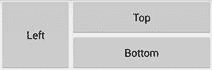

图 44：由三个按钮组成的简单布局

这可以通过两种方式之一创建。首先，让我们看看如何使用两个`LinearLayouts`：一个水平的将左按钮与其他按钮分开，另一个嵌套的`LinearLayout`来渲染顶部和底部按钮。

```
<!-- Don't do this (it's not efficient) -->
<LinearLayout xmlns:android="http://schemas.android.com/apk/res/android"
xmlns:tools="http://schemas.android.com/tools"
android:layout_width="match_parent"
android:layout_height="match_parent"
android:orientation="horizontal"
tools:context=".MainActivity" >
<Button
android:layout_width="0dp"
android:layout_height="120dp"
android:layout_weight="1"
android:text="Left" />
<LinearLayout
android:layout_width="0dp"
android:layout_height="120dp"
android:layout_weight="2"
android:orientation="vertical">
<Button
                android:layout_width="match_parent"
                android:layout_height="0dp"
                android:layout_weight="1"
                android:text="Top" />
<Button
android:layout_width="match_parent"
android:layout_height="0dp"
android:layout_weight="1"
android:text="Bottom" />
</LinearLayout>
</LinearLayout>

```

但是，`LinearLayout`元素包含具有`layout_weight`属性的小部件这一事实意味着它们的维度需要计算两次。不用说，这不是最佳布局。

创建此布局的另一种（和首选）方法是使用单个`RelativeLayout`。这具有将视图层次结构扁平化为单个层的优点，避免了上面所示的嵌套`LinearLayout`的低效率。

```
<!-- Do this instead (it's more efficient) -->
<RelativeLayout xmlns:android="http://schemas.android.com/apk/res/android"
xmlns:tools="http://schemas.android.com/tools"
android:layout_width="match_parent"
android:layout_height="match_parent"
tools:context=".MainActivity" >
<Button
android:id="@+id/leftButton"
android:layout_width="120dp"
android:layout_height="120dp"
android:text="Left" />
<Button
android:id="@+id/topButton"
android:layout_width="match_parent"
android:layout_height="60dp"
android:layout_toRightOf="@id/leftButton"
android:text="Top" />
<Button
android:layout_width="match_parent"
android:layout_height="60dp"
android:layout_toRightOf="@id/leftButton"
android:layout_below="@id/topButton"
android:text="Bottom" />
</RelativeLayout>

```

因此，一般的经验法则是尽可能避免嵌套`LinearLayout`。对于自定义`ListView` / `GridView`项尤其如此，因为视图会多次膨胀，因此任何低效率也会成倍增加。但是，这并不是说你应该 _ 从不 _ 使用`LinearLayout`。它们非常易于配置，并且在不嵌套时非常有效。这使得它们适用于更简单的布局（例如，由连续文本字段组成的表格）。

有关创建高效布局的更多信息，请访问[优化您的 UI](http://developer.android.com/tools/debugging/debugging-ui.html) 。

## 摘要

在本章中，我们探讨了布局 Android 用户界面的标准机制。首先，我们讨论了定义`View`元素的填充和边距的基本属性。然后，我们学习了如何使用内置的`ViewGroup`子类定位元素：`LinearLayout`，`RelativeLayout`，`ListView`和`GridView`。这些类使用最少的编码将 UI 小部件组织成复杂的布局非常容易。

虽然知道如何在屏幕上定位元素很重要，但如果您不知道 _ 哪些 _ 元素可用，那么这些知识将毫无用处。下一章将通过调查最常见的 UI 小部件来充实您对 Android 用户界面框架的理解。