# 第 1 章简介和入门

如今，微控制器无处不在。多年来，与他们合作需要花费大量的知识，这些知识必须在相当长的一段时间内积累起来。使用微控制器也相对昂贵，因此大多数时候它们被各行各业的训练有素的专业人员使用。

在 Arduino 董事会问世的 2​​005 年，这种情况发生了很大变化。 Arduino 背后的整个理念是它为世界各地的业余爱好者提供了一种相对便宜的手段来构建他们的电子项目。关于 Arduino 和一般的微控制器，可以说很多，但这是一本简洁的书，所以我们会保持简短和重点。请记住，那里有很多种 Arduino 板。您可以在 Arduino 网站[上查找](http://arduino.cc/en/Main/Products)。

描述每个组件都超出了本书的范围。本书中的所有示例都将使用 Arduino Uno 板制作。有关 Arduino Uno 板的更多详细信息，请参阅 Arduino 网站上的[此页](http://arduino.cc/en/Main/ArduinoBoardUno)。该板最适合初学者，因为它相对便宜，不需要任何焊接或特殊电源来帮助您入门。基本上，您只需要一个 Arduino Uno 板，USB 线和一台电脑。

|  | 注意：你必须获得一个 Arduino Uno 板才能跟随。 |

当我们开始使用电子元件时，我会在需要的每个部分的开头给您一个零件清单。将通过草图和表格来描述示例，该表格示出了组件应如何布线。在最后一节，我们将讨论网络。在该部分中，我们将使用两个 Arduino 板。再一次，一个 Arduino 完全没问题，你将能够跟随这本书的大部分内容。但在本书的最后，你将需要其中两个。

本书中的示例对于我们将使用的电子组件没有任何特殊偏好。您可以从财务或其他方面获得最适合您的任何来源。我们将制造的电路不会使用除 Arduino 本身之外的任何外部电源。对于刚刚开始使用 Arduino 的人来说，使用强电流可能会有点危险，可能会毁坏设备，并可能对您造成伤害。所以我们只会坚持使用来自您的计算机和 Arduino Uno 板的电源。

对于你们中的一些人来说，我们将使用的电子元件可能是不熟悉的，因为你们从未听说过它们，但是不用担心，我们将简要解释每个组件的基本工作原理。我们第一次提到它们。如果您仍不清楚某些概念，请在进一步阅读之前查看 [Arduino 网站](http://arduino.cc/en/Main/Products)。

使用 Arduino 板的目的是对它进行编程以执行某些操作，因此您至少需要具备基本的编程知识。如果没有基本的编程知识，你可能会有点难过。还需要了解 C 编程语言或任何其他类似语言。

我们还将尝试保持程序简单，并在代码中进行许多注释，以便您可以继续。开始使用 Arduino 编程相对容易。在当今所有最流行的操作系统上都可以下载免费的 Arduino 集成开发环境（IDE）。

我们将使用 IDE，因为它可以轻松地将我们的程序上传到 Arduino 板。基本上，只需要几次点击，然后我们就会看到神奇的事情，因为我们的代码实际上将开始控制真实世界的物体，如灯光和蜂鸣器。

在对电路板进行任何操作之前，我们必须安装一些软件，以便我们对其进行编程。在接下来的几节中，我们将介绍最流行的操作系统的安装步骤。我们将从使用 Microsoft Windows 开始。

## 在 Windows 上安装 Arduino IDE

在编写本书的那一刻，Microsoft Windows 7 似乎仍然是市场上最流行的 Windows 操作系统（OS）。下一个最流行的 Windows 操作系统是 Windows XP。因此，我们将专注于如何安装适用于 Windows 7 的 Arduino IDE。在 Arduino 网站[上可以找到适用于 Windows 的安装程序](http://arduino.cc/en/Main/Software)。下载安装程序并运行它。要在 Windows 平台上安装它，需要执行几个步骤：

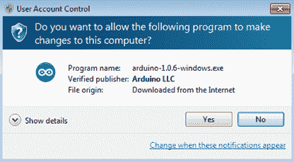

图 1：单击是允许应用程序更改计算机

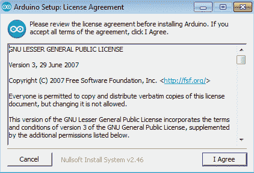

图 2：单击“我同意”同意许可协议

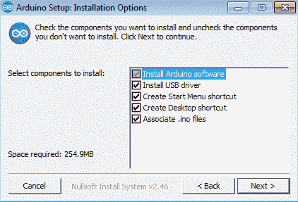

图 3：选择 Installation Options，然后单击 Next

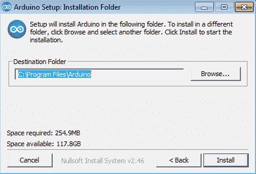

图 4：选择 Installation Folder 并单击 Install

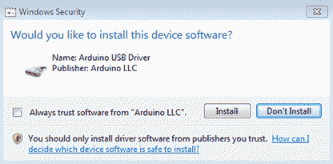

图 5：单击 Install，允许安装 Arduino USB Driver

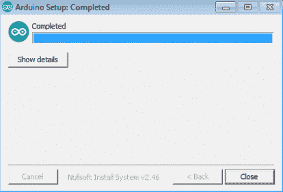

图 6：安装完成后，单击“关闭”

如果您按照上图中显示的步骤操作，那么现在您的 Windows 机器上应该有一个功能强大的 Arduino IDE。通过单击“开始”菜单中的 Arduino 或双击桌面上的 Arduino 图标启动 Arduino IDE。您应该看到如下内容：

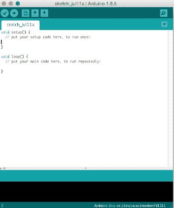

图 7：Arduino IDE

当您第一次插入 Arduino 时，您可能需要等待一段时间，直到 Windows 识别并安装 Arduino Uno 板的驱动程序。这很常见;等一会儿，你应该立即启动并运行你的 Arduino。这是我们现在要做的。在这个阶段，最重要的是我们已经安装了 Arduino IDE。稍后我们将介绍如何使用 Arduino IDE 实际连接 Arduino Uno 板以及如何将代码上传到 Arduino。

## 在 Linux 上安装 Arduino IDE

Linux 平台上的安装并不像在 Windows 平台上那样简单。安装和运行 Arduino IDE 之前需要先决条件。此先决条件涉及安装 Java 运行时环境。有很多 Linux 版本可用。大约三分之一的桌面 Linux 机器在 Ubuntu 上运行。我们将在本节介绍如何在 Linux Ubuntu 上安装 Arduino IDE。 Linux Ubuntu 最基本的 Java 安装是启动终端，然后运行以下命令：

```
[Update the package index]
    # sudo apt-get update[Check if Java is already there, skip to Arduino installing if it’s installed]
    # java -version[Install Java if it’s not present on your system]
    # sudo apt-get install default-jre

    [install all the required packages and check if Java is installed]
    # java -version

```

在检查系统中是否存在 Java 之后（或从头开始安装 Java 之后），是时候从 Arduino 网站 [](http://arduino.cc/en/Main/Software) 下载 IDE 了。单击 Linux 版本的下载链接。

请注意检查您的系统是 32 位还是 64 位，并从网站下载相应的版本。如果 Linux 的版本与您的系统不匹配，您将无法将程序上传到 Arduino，并且在尝试执行此操作时会出现异常。

适用于 Linux 的 Arduino IDE 下载已压缩。下载后将其打开并将其解压缩到通常安装应用程序的文件夹中。确保记住解压缩 Arduino IDE 的文件夹，然后导航到解压缩 Arduino IDE 的文件夹。双击运行`arduino`可执行文件。系统会问你以下问题：

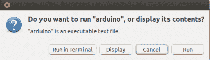

图 8：单击“运行”

如果从终端运行 IDE，则不会显示前面图中显示的对话框。在您真正开始使用 Arduino IDE 之前，还有一个步骤。 IDE 还会询问您在何处存储新创建的草图。简而言之，草图是可以上传到 Arduino 板的程序的源代码文件：

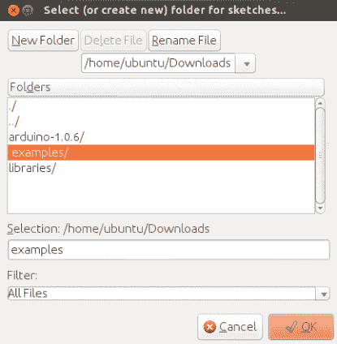

图 9：指定 IDE 将保存草图文件的文件夹

## 在 Mac OS X 上安装 Arduino IDE

在 Mac OS X 上，Java 是运行 Arduino IDE 的先决条件。默认情况下，Mac OS X 上不提供 Java，至少不能使用最新版本。有多种方法可以将 Java 引入 Mac。某些以前版本的 Mac 默认安装了它。在 Mac 上开始使用 Java 的最简单方法是转到[这里提供的 Apple 支持页面](http://support.apple.com/kb/DL1572)，然后下载并安装提供的文件。与 Linux 和 Windows 版本一样，Arduino IDE 可在 Arduino 网站 [](http://arduino.cc/en/Main/Software) 上找到。

Mac OS X Arduino IDE 默认是压缩的。将存档解压缩到一个文件夹，并记住解压缩的位置。其余的安装很简单;只需将提取的应用程序复制到 Applications 文件夹即可。然后，以与运行 Mac 上安装的其他应用程序相同的方式运行 Arduino：

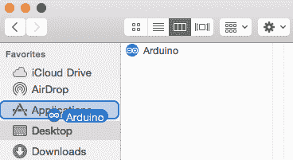

图 10：将解压缩的应用程序拖到 Applications 文件夹中

一旦 Arduino IDE 启动，无论您使用什么平台，它都几乎完全相同。在下一节中，我们将介绍 Arduino 编程的基本 Hello World。

## Arduino Uno Hello World

这是您需要 Arduino Uno 板跟随的第一部分。除了电路板，您还需要 A 到 Mini-B USB 电缆。目前有两种方法可供选择。一种方法是将 Arduino 挂接到 USB，看看当你将它插入计算机时会发生什么。

第二种方法是在插入电路板之前就可以了解电路板的各个部分。在开始时了解 Arduino Uno 电路板上的组件可能看起来不那么重要，但随着您的进步，您必须得到很好地了解部件。起初看起来有点复杂，但有几点你应该知道。我们来看看 Arduino：

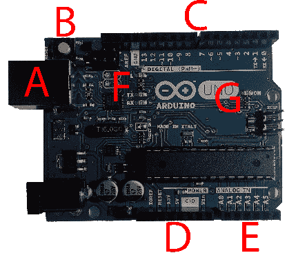

图 11：Arduino Uno 板

花一点时间熟悉电路板。尝试找到位于上图中标记的字母附近的元素。

以下是我们将使用的 Arduino Uno 板元素：

*   A - USB 电缆插座。通过这条电缆，我们为 Arduino 供电并上传程序。
*   B - 重置按钮。我们使用此按钮重新启动上传的程序。
*   C - Arduino 数字引脚。这些工作将如何在后面的章节中解释。
*   D - Arduino 电源引脚。这些将用于为电子元件供电。
*   E - Arduino 模拟引脚。如何使用它们将在后面的章节中解释。
*   F-TX 和 RX 发光二极管（LED）表示 Arduino 通过 USB 进行通信。 L 是可编程的。
*   G - 开机指示灯。一旦有电，Arduino 就应该点亮这个 LED。

如果您在开始时不记得所有这些元素，那就完美了。您使用电路板的次数越多，您就越熟悉它。目前，唯一重要的元素是 USB 电缆插座。将 USB 电缆插入计算机，然后插入 Arduino 上的 USB 电缆插座。再次，您应该使用 USB A 到 Mini-B 电缆。如果您不确定是哪种类型的电缆，请询问在您附近的电子商店工作的人。电缆看起来应该与以下内容完全相同（或类似）：


图 12：USB 电缆类型 A 到 Mini-B

将电缆插入 Arduino Uno 并将其与计算机连接。如果这是您第一次将 Arduino 插入计算机，您应该看到一个标有字母“L”的小黄色 LED 定期打开和关闭。它靠近图中标有字母 F 的区域，解释了 Arduino Uno 板的基本部分。

这实际上是一个正在运行的 Arduino Hello World 程序。所有官方 Arduino Uno 主板都预先上传了这个程序。这个程序在插入 Arduino Uno 板后立即运行。这样，您可以快速确定 Arduino 板是否一切正常。但是，如果 LED 没有打开和关闭，请不要担心。也许你或其他人已经上传了一些东西。无论如何，我们将通过您需要的步骤让这个 LED 闪烁。

上一节介绍了如何安装 Arduino IDE。如果您还没有，请立即运行 IDE。每次将程序上传到 Arduino Board 时，都需要执行两个步骤。首先，确保在 Arduino IDE 中正确设置了电路板类型。转到`Tools`菜单然后转到`Board`，然后选择`Arduino Uno`以正确设置类型。

第二步是选择串行端口（它位于 Board 菜单选项下面）。根据您安装的操作系统类型，串行端口可能具有不同的名称。在 Windows 上，它将是`COM`后跟一个后缀。在 Linux 和 Mac 上，它将更多地朝着`/dev/tty.xxxxxx`或类似方向发展。如果在 Arduino IDE 运行时在 Windows 上插入 Arduino Uno，您可能无法选择串行端口。如果发生这种情况，请重新启动 Arduino IDE。现在我们连接了 Arduino，让我们做一些编程。在 Arduino IDE 中输入以下代码：

```
// setup runs just once
void setup() {
  // initialize digital pin 13 as an output.
  pinMode(13, OUTPUT);
}

// this loop runs for as long the Arduino has power
void loop() {

  // turn the LED on with HIGH voltage level
  digitalWrite(13, HIGH);

  // wait for a second
  delay(1000);

  // turn the LED off by making the voltage LOW
  digitalWrite(13, LOW);

  // wait for a second
  delay(1000);
}

```

在继续之前，我们会稍微解释一下代码。板载 LED 绑定到数字引脚 13.现在，您可能想知道数字引脚是什么。嗯，名字中有一个“数字”。这意味着引脚可以有两种状态：`HIGH`和`LOW`。 `HIGH`表示引脚上有电流，而`LOW`表示引脚上没有电流。 Arduino 可以将电流输出到引脚，也可以从引脚读取电流。在此示例中，我们向引脚 13 发送电流。如果引脚 13 上的电流为高电平，则板载 LED 将亮起。如果引脚 13 处于低电平状态，则板载 LED 将熄灭。

代码的第二部分是循环函数。只要有一个连接到 Arduino 的电源，循环函数内的代码就会运行，它会将电流发送到引脚 13.它将等待一秒钟，然后停止向引脚发送电流。然后它将等待另一秒并从头开始。前面的代码基本上会给出电流，然后以规则的一秒间隔将它从引脚 13 上取下。暂停 Arduino 的单位是一毫秒，所以一秒钟的暂停等于一千毫秒。现在您已经输入了代码，验证代码是个好主意。为此，只需单击验证：

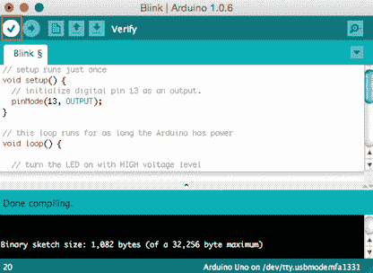

图 13：运行中的验证功能

现在代码已经过验证，是时候将它上传到 Arduino 了。我们点击上传即可。点击后，代码被编译和上传：

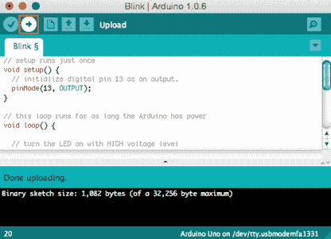

图 14：上传功能

如果一切顺利，你应该看到 LED 闪烁。现在，它可能看起来不是很多，但这实际上是你 Arduino 板上的一个功能完备的程序，而你的软件实际上是通过这个 LED 与现实世界进行交互。现在，除了学习如何控制它之外，这个 LED 目前还没有用处。但是这个引脚的输出可以用来控制很多东西。我们将在本书的其余部分讨论它。

## 串行监视器

Arduino 能够进行串行通信，可用于与理解串行通信的计算机或其他设备进行通信。串行通信已存在很长时间，并且经常在构建各种电子项目时使用。也许最好看看一个简单的 Arduino 示例：

```
void setup() {
  // initializes serial communication with a speed of 9600 bit/s
  Serial.begin(9600);
}

// this loop runs for as long as the Arduino has power
void loop() {
  // send a message to the serial port
  Serial.println("Hello I'm your Arduino Board!");

  // wait for 3 seconds and then start over
  delay(3000);
}

```

如果您将此示例上传到电路板，电路板将每隔三秒钟向串行端口发送一条消息。您可以使用各种应用程序读取计算机上串行端口的信息。您甚至可以编写自己的与 Arduino 通信的应用程序。消息中互换的数据通常是以逗号分隔的字符串列表。这实际上是微控制器世界的悠久传统，因为数据对于人类来说足够可读，很容易被机器解析，并且没有太多开销。这种方法的缺点是消息不易扩展，并且每个消息结构的更改都会导致发送方和接收方的代码发生更大的变化。

Arduino IDE 有一个很好的工具，可以显示来自串口的数据。它被称为串行监视器。要访问串行监视器，请转到`Tools`菜单并选择`Serial Monitor`。如果您上传了上一个示例，则应该会看到工具中显示的消息：


图 15：Arduino 串行监视器

除了与其他设备的通信外，串行通信对调试程序也很有用。有一个`Autoscroll`选项，可以使用该选项始终显示最新消息。如果您发现异常情况，可以禁用此选项，然后查看打印值。

这样就完成了对 Arduino 和 Arduino IDE 的介绍。在下一章中，我们将使用电子元件 - 更具体地说，LED。使用 LED 相对容易;它们是相对便宜的组件，并且它们执行各种任务。