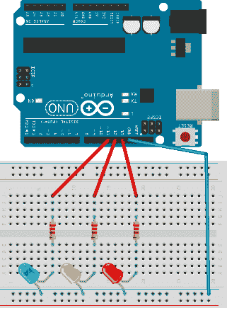
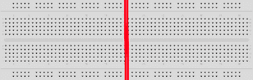
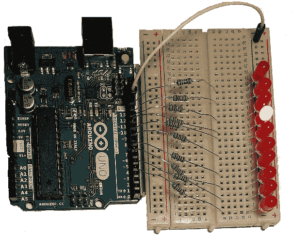
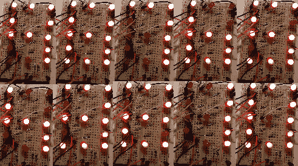
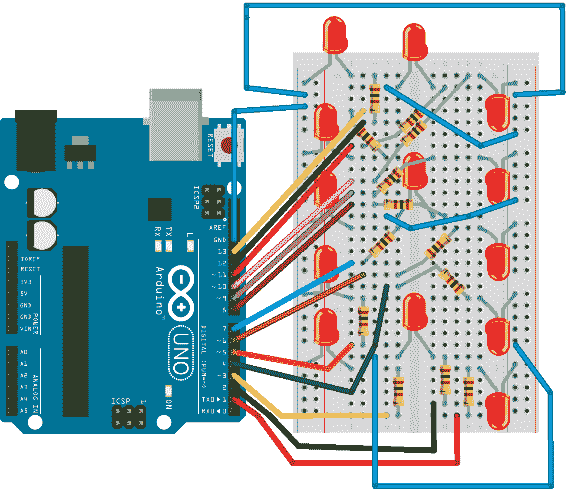

# 第 2 章用 LED 构建电路

使用 LED 构建电路是了解电子产品和 Arduino 的好方法。调试所有内容相对容易，因为 LED 处于打开状态或不处于打开状态，因此如果出现意外情况，则可能会出现某种错误。在下一步中，我们将只使用一个 LED。拿任何你有两条腿的 LED，看起来应该是这样的：


图 16：各种颜色的 LED

现在，大多数人都听说过 LED。 LED 的具体特点是它们只让电流通过一个方向，因此在制作电路时必须小心，因为如果以错误的方式连接电路，它们就不会闪烁。基本上，你必须确定哪条腿是加号，哪条腿是减号。有两种方法可以找到它：


图 17：确定 LED 上的正负极引线

大多数情况下，你会寻找一条较长的腿，你会把它连接到一个加号。如果腿被切断并且您需要找出腿的极性，您可以通过观察腿附近的平坦边缘（在 LED 的外壳上）找到负腿。关于 LED 有一个重要的事实，你必须记住。他们有一点自我毁灭的本性。他们将尽可能多地吸取电流直到它们烧坏。为了防止这种行为，我们必须使用称为电阻器的电子元件。电阻器将限制 LED 可用的电流量，并且它将防止 LED 自毁。

电阻器的电阻量以欧姆为单位测量。在确定 LED 的正确电阻时需要进行一些计算。您必须查看 LED 的规格，然后在此处填写可用的表[以找到适当的电阻量。使用 Arduino，可用的电压并不多。它总是 3.3 或 5 伏。我喜欢用 LED 保持安全，所以我将使用一个 100 欧姆的电阻器用于 3.3 伏 LED，一个 220 欧姆的电阻器用于 5 伏 LED。您可以根据自己的需要对其进行微调，但通常，在使用 Arduino 和 LED 时，您只需要两种类型的电阻。](http://ledcalc.com/)

要从实际 LED 开始，您根本不需要任何类型的电阻。首先，您只需要一个普通的 LED。如果您按照上一节的说明进行操作，那么您已经上传了一个 LED 闪烁程序。现在引脚 13 已经有一个内置电阻，所以下一个例子你不需要额外的一个。在引脚 13 旁边有一个接地引脚。 Arduino 的制造商故意这样做，以便我们可以尝试下一个例子。将称为二极管的较长脚放入引脚 13，将较短引脚放入 GND。如果您不确定数字引脚 13 的位置，请将 Arduino 侧向翻转并将支脚插入孔中：


图 18：侧面观看 Arduino Uno 板

如果正确插入 LED，您应该看到它以与车载 LED 相同的节奏闪烁。您的 Arduino 现在正在控制电子元件。如果房间里有点暗，请关灯并欣赏现场。但这只是开始。我们将在下一节中构建它。

## Arduino 红绿灯

本节的零件清单：

*   Arduino Uno
*   USB 电缆
*   3 个 100 欧姆电阻器
*   面包板
*   1x 5mm 红色 LED
*   1x 5mm 黄色 LED
*   1x 5mm 绿色 LED
*   4x 面包板跳线

该示例的接线如下所示：



图 19：Arduino Uno 交通灯布线

我们将红色 LED 连接到引脚 13，将黄色 LED 连接到引脚 12，将绿色 LED 连接到引脚 11.我们将为红色和绿色光提供相同的时间。从红色到绿色的过渡会更快一些。从绿色到红色的过渡通常需要更长的时间。我们来看看代码：

```
void setup() {
  // initialize red light pin
  pinMode(13, OUTPUT);
  // initialize yellow light pin
  pinMode(12, OUTPUT);
  // initialize green light pin
  pinMode(11, OUTPUT);
}

void loop() {
  // turn the red light on
  digitalWrite(13, HIGH);
  digitalWrite(12, LOW);
  digitalWrite(11, LOW);
  // wait
  delay(5000);

  // turn the yellow light on together with red
  // at least that's the way they work in some parts of Europe
  digitalWrite(13, HIGH);
  digitalWrite(12, HIGH);
  digitalWrite(11, LOW);
  // wait
  delay(1000);

  // turn the green light on
  digitalWrite(13, LOW);
  digitalWrite(12, LOW);
  digitalWrite(11, HIGH);
  // wait
  delay(5000);

  // turn the yellow light on
  digitalWrite(13, LOW);
  digitalWrite(12, HIGH);
  digitalWrite(11, LOW);
  // wait
  delay(1000);

  //start over 
}

```

当您将代码上传到 Arduino 板时，红色 LED 将闪烁。这是故意的，以便您知道在程序上传时引脚 13 随机上下移动。这样，您将来不会将某些移动或敏感组件附加到其中。对于我们的红绿灯，这只会为上传带来更多乐趣。当程序开始运行时，第一个指示灯将为红色。然后会显示黄灯。在欧洲，在交通灯显示绿灯之前，红灯与黄灯一起亮起。我们将模拟此行为，以便您可以看到两个 LED 可以同时打开。只要它具有动力，Arduino 将继续从红灯变为绿灯并再次返回。

在这个例子中有一个非常重要的组件，那就是面包板。面包板是一个有用的组件，因为人们不必了解焊接以开始使用电子设备。当我开始时，这对我帮助很大。使用原型板的另一个优点是构建基本电路不需要很长时间，如果出现问题，您可以快速重新安排组件。在原型板的孔下面是导线，例如：


图 20：原型板布线

原型板的缺点是它不能容纳很多元件，而且通过焊接，我们的电路将会小很多。但是，对于刚刚建立电子电路的人来说，这是一个完美的起点。很难总结使用原型面包板的注意事项和注意事项。通过查看以后各节中的示例，您将了解如何使用原型板。

假设大多数读这本书的人都来自软件开发背景。当谈到面包板（以及一般的电子电路）时，我们需要指出一件重要的事情。有些 bug 很难找到，因为除了软件组件之外，还有可能出现错误的布线。一些错误的接线可能来自误解如何在原型板中连接引线。

我最大的误解之一就是我买了一个带有多条电源线的面包板，但它们并没有从电路板的左边向右边走。他们在电源线中间休息，这就是更长的面包板的工作方式。如果您不了解这一事实，您可能会期望组件处于通电状态。但它们不起作用，因为电源轨在中间停止，你必须用额外的电线连接它们以确保它们获得电流。在找到实际发生的事情之前，你可能会浪费很多时间。有一些面包板的版本，中间没有断裂，只是为了让你意识到更大的面包板上的电源线之间的差距。我将在下图中用红线描绘间隙：



图 21：较大面包板中间的电源线之间的无桥接间隙

## Arduino Cylon Eye

本节的零件清单：

*   Arduino Uno
*   USB 电缆
*   10x 100 欧姆电阻
*   面包板
*   10x 5mm 红色 LED
*   1x 面包板跳线;如果电阻器具有短引线，则最多 11 根电线

我不会谈论 Cylon Eye 效果;如果你不熟悉它，请查阅它。从电子角度看，它是一个从左到右不断发出的红光。我将尝试使用此示例保存一些电线，因此我将向您展示如何使用一根电线制作整个布线的版本。但您也可以使用每个 LED 一根电线，如上例所示;这完全取决于你。这是一个只有一根电线的例子：



图 22：采用单根跳线的 Cylon Eye 版

第一个 LED 插入 Arduino 数字引脚 4.最后一个是数字引脚 13.在将每个引脚连接到 LED 之前，不要忘记将每个引脚连接到电阻。另外，不要忘记仔细检查 LED 的极性，因为如果将负 LED 支脚连接到引脚输出，示例将完全不起作用。你可能想知道什么是错的，事实上，你所做的只是以错误的方式转动 LED。这种情况发生了很多，特别是如果有人刚开始的话。由于视角，您可能有点难以阅读上图中的引脚连接，并知道必须从组件插入引线的位置。所以这是一个完整的原理图，可以帮助您。正如预防一样，请记住，共有 10 个 LED：


图 23：Cylon Eye 接线示意图

我们在此示例中控制的 LED 数量明显大于上一节中的数量。在控制所有 LED 时，我们必须使用循环结构。这是代码：

```
// define the starting pin as a constant
const int startPin = 4;
// total number of LEDs
const int numLEDs = 10;

// current LED will go from 0-9
int currentLed = 0;
// direction will be 1 and -1
int direction = 1;

void setup() {
  // initialize the pins with a for loop
  for (int i = startPin; i < startPin + numLEDs; i++) {
      // set pin mode to output
      pinMode(i, OUTPUT);
  }
}

void loop() {
  // turn the led on
  digitalWrite(startPin + currentLed, HIGH);
  // wait for 100 ms
  delay(100);
  // turn the led off
  digitalWrite(startPin + currentLed, LOW);

  // move to the next LED 
  currentLed += direction;

  // go back up if we've reached the bottom
  if (currentLed < 1) {
    direction = 1;
  }
  // go back down if we've reached the top
  if (currentLed >= numLEDs - 1) {
    direction = -1;
  }
}

```

我认为这个例子看起来最好，如果在黑暗中观看。所以花一些时间来享受它。这个例子可以作为各种特殊 LED 灯光效果的良好起点。想象一下，你可以改变 LED 的颜色，并在打开和关闭时以随机顺序放置它们。在节日期间，您可以将此作为礼物赠送。我不知道为什么，但光效果总会让人微笑。如果您构建了此示例，请尝试使用它并进行各种效果。在下一节中，我将更进一步。

## 倒计时

这个例子就像在一个小的无焊料面包板上一样复杂。我们将使用比前几节更多的电线。 LED 的数量也将增加。

本节的零件清单：

*   Arduino Uno
*   USB 电缆
*   13x 100 欧姆电阻
*   面包板
*   13x 5mm LED
*   18x 面包板跳线

在本节中，我们将构建 13 个 LED 中的数字显示。这是最初的想法：


图 24：单位数显示中的 13 个 LED

在这里它是在倒计时显示所有 10 个数字的行动：



图 25：13 个 LED 倒计时动作

这个例子的接线有点复杂，特别是如果你刚刚开始使用面包板。在构建示例时尽量保持专注。你可以重新连接这个例子但是你看得最清楚。这是我完整的布线架构：



图 26：倒计时示例接线架构

这个例子更适合练习。在实践中，您将使用七段显示。但这是我们研究 LED 行为的一个部分，所以我们用 LED 而不是七段显示器来构建这个例子。但是，为了完成这个例子，你还需要做一件事，即代码：

```
// define the starting pin as a constant
const int startPin = 1;

// total number of LEDs
const int numLEDs = 13;

// we'll start the countdown at 9
int count = 9;

// here is each digit mapped to the state of the pins
int numberMatrix[][13] = {
  {1, 1, 1, 1, 1, 1, 1, 0, 1, 1, 1, 1, 1}, // 0
  {1, 0, 0, 1, 0, 1, 0, 0, 1, 1, 0, 0, 0}, // 1
  {1, 1, 1, 0, 1, 1, 1, 1, 1, 1, 1, 1, 0}, // 2
  {1, 1, 1, 1, 0, 1, 1, 1, 1, 1, 1, 1, 0}, // 3
  {1, 0, 0, 1, 0, 1, 1, 1, 0, 0, 0, 1, 1}, // 4
  {1, 1, 1, 1, 0, 1, 1, 1, 0, 1, 1, 1, 1}, // 5
  {1, 1, 1, 1, 1, 1, 1, 1, 0, 0, 0, 1, 1}, // 6
  {1, 0, 0, 1, 0, 1, 0, 0, 1, 1, 1, 1, 0}, // 7
  {1, 1, 1, 1, 1, 1, 1, 1, 1, 1, 1, 1, 1}, // 8
  {1, 0, 0, 1, 0, 1, 1, 1, 1, 1, 1, 1, 1}, // 9
};

void setup() {
  // initialize the pins with a for loop
  for (int i = startPin; i < startPin + numLEDs; i++) {
      // set pin mode to output
      pinMode(i, OUTPUT);
  }
}

void loop() {

  // go through the pins for the current count, turn them on an off
  for (int i = 0; i < numLEDs; i++) {
    digitalWrite(startPin + i, numberMatrix[count][i]);
  }

  // wait for a second
  delay(1000);

  // count down
  count--;

  if (count < 0) {
    // start over
    count = 9;

    // turn all the LEDs off
    for (int i = startPin; i < startPin + numLEDs; i++) {
        digitalWrite(i, LOW);
    }

    // wait for a second and start over
    delay(1000);
  }
}

```