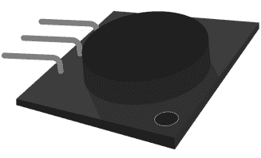
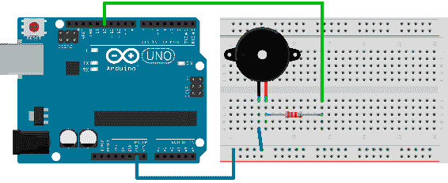
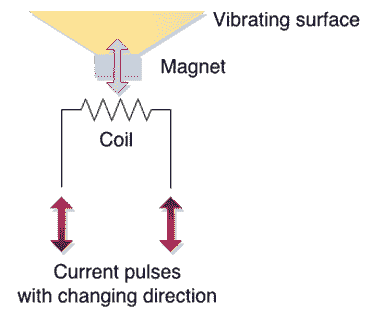

# 第 4 章使用蜂鸣器

提供视觉反馈在电子产品中始终很重要。但是在某些情况下，灯光根本不会削减它。即使它位于拐角处或者两者之间存在障碍物，也可以听到蜂鸣器。我们人类非常重视音频信号，因为相对较弱的音频信号甚至可以将人从深度睡眠中唤醒而没有任何问题。据说深度昏迷的病人仍能清楚地听到我们的声音。因此，当谈到电子产品时，这种感觉绝对重要。

音频系统是它自己的一个章节，我不会在这里处理它们。在这个例子中，我将使用称为蜂鸣器的相对便宜的组件。该组件已存在数十年，主要用于通知用户。通过使用蜂鸣器，电子产品可以在某些事件中通知我们，而无需经常监视某些事情（例如在微波炉中弹出爆米花，等待顾客进入商店，发出游戏结束信号，提醒我们最喜欢的节目很快，或只是唤醒我们）。

在本章中，我将介绍蜂鸣器的可能用例。在使用蜂鸣器时，请检查附近的其他人是否正常，因为蜂鸣器有时会变得非常烦人。不要滥用电子项目中的蜂鸣器，并始终牢记他们可以惹恼生物。简而言之，只有在有重要事情发生时，才会通过蜂鸣器通知用户。

## 计算秒数

当涉及到蜂鸣器时，这更像是一个 Hello World 示例。这个例子的最终结果就像时钟滴答作响。用例可能仅限于测量心跳，观察现象，或等待适当的秒数以在短时间内通过（例如，当漂白蔬菜时）。想象一下你在计算“一个密西西比河，两个密西西比河”等所有时刻。这是一个可以帮助您计算秒数的设备。

这个例子中最重要的部分是蜂鸣器。有很多版本可供选择;本例中使用的一个如下图所示。但无论蜂鸣器的外观如何，布线几乎都是一样的 - 只使用了两个引脚。此蜂鸣器上的中间引脚未连接，如下所示：



图 31：蜂鸣器

本节的零件清单：

*   Arduino Uno
*   USB 电缆
*   用于蜂鸣器的 1x 100 欧姆电阻器
*   面包板
*   3x 面包板跳线
*   兼容 Arduino 的无源蜂鸣器

我们将使用代码启动此示例。它类似于我们用来使 LED 闪烁的那个。唯一不同的部分是我们必须做一些数学运算。发出声音的脉冲相当短，我们将使它持续 10 毫秒长。这是关于适当的时间来感知短暂的嘀嗒声。在我们的循环中必须考虑这个滴答的持续时间，因为一段时间后，如果我们等待下一个循环一整秒，我们将得到显着的时间漂移​​，而不补偿滴答的持续时间。

我们每 100 秒钟会漂移大约一秒钟。因此循环的延迟将是 990 毫秒。在`setup`函数中，我们将寄存器用于输出，然后向引脚发送短脉冲。在我们设置硬件之后，它听起来就像旧时钟那样。

这是编程部分：

```
// We'll use pin 12 for buzzing
int buzzPin = 12;

void setup() {
  // register the pin for output
  pinMode(buzzPin, OUTPUT);    
}

void loop() {
  // during ten milliseconds we'll make a tick
  digitalWrite(buzzPin, HIGH);
  delay(10);

  // then we'll wait 990 millis to tick again
  digitalWrite(buzzPin, LOW);
  delay(990);
}

```

接线时蜂鸣器可能有点棘手。曾经发生在我身上的是我用错误的方式连接了蜂鸣器，所以我听到了一个恒定的声音。当我触摸蜂鸣器时，它非常热。因此，在给蜂鸣器接线后，检查蜂鸣器是否发烫。它可以为你节省蜂鸣器的钱，因为如果你不检查它，它可能会烧坏。好消息是蜂鸣器上的正极和负极引脚通常都有很好的标记，因此识别引脚时不会有任何问题。如果您的蜂鸣器有两个以上的引脚，蜂鸣器上的一个引脚与所使用的蜂鸣器没有连接就好了（在本例中，它是中间的蜂鸣器）。这是示例的接线：



图 32：蜂鸣器计数秒接线

所有接线都将与此类似。蜂鸣器的内部电阻不同于一个蜂鸣器，因此您必须使用蜂鸣器的数据表来查找蜂鸣器的电阻（然后可能会进行一些计算以获得正确的电阻）。在大多数情况下，100 欧姆电阻很好。要计算电阻额定值，请使用数据表并简单地将五伏电压除以元件的当前额定值。如果电流额定值为 20 mA，则将五除以 0.020 A.这只是您获得整个电阻额定值确定过程概述的示例。另外，请注意，这将为您提供整体阻力，您必须从此数字中减去蜂鸣器的内阻。计算过程总结在本说明中：

|  | 注意：电阻=（5V / Buzzer_current_rating A） - Buzzer_internal_resistance |

如果您不确定，在大多数情况下，100 欧姆的电阻将覆盖您。 Arduino 也经过精心设计，因此最常见的接线错误会对其造成损坏，因为这些引脚具有内部上拉电阻，可以限制一个引脚可以吸取的电流。如果您执行以下操作，我不会以任何方式认为自己或 Syncfusion 负责。我没有电阻器连接蜂鸣器，它似乎没有任何问题。请记住，这是一种我不同意的做法。我是出于好奇而做到这一点，并告诉你 Arduino 将涵盖一些初学者的错误。现在，你们中的一些人可能会玩弄蜂鸣器并更改上一个程序的值。让我们看一下下面的代码，并尝试确定它对蜂鸣器的作用：

```
// what do you think this will do?

// we'll use pin 12 for buzzing
int buzzPin = 12;

void setup() {
  // register the pin for output
  pinMode(buzzPin, OUTPUT);    
}

void loop() {
  // we'll keep the pin high for 990 ms
  digitalWrite(buzzPin, HIGH);
  delay(990);

  // and then we'll make just a short break
  digitalWrite(buzzPin, LOW);
  delay(10);
}

```

在运行上一个列表之后，您可能想知道发生了什么，以及您是否以某种方式输入了上一个示例。别担心，这个例子很好。这两个例子完全相同。我们必须深入了解一下蜂鸣器的内部工作原理来解释实际发生的事情。作为简短介绍，我会提到声音实际上是通过空气或水等介质传播的振动。而且，如果你仔细观察，你会注意到我们在前面的例子中没有产生任何脉动电流。我们只是在引脚上输出一个恒定电平的电流。我们听到的嘀嗒声是脉冲开始时的短脉冲，其中电流从零上升到引脚上的`HIGH`值。我们将在下一节中详细介绍。

## 改变蜂鸣器的频率

本节使用与前一节完全相同的布线。我们将改变代码，以演示如何更改蜂鸣器生成的音调的频率。让我们回到扬声器的基本原理。

扬声器通过振动然后推动空气来工作，从而引起我们可以听到的振动。那里有很多扬声器设计，所以我不会介绍它们中的每一个，但我会解释最基本的设计。在基本形式中，扬声器包括磁体，振动表面和线圈。

电流通过线圈并引起磁铁的运动。如果电流开始交替，则振动表面开始前后移动。然后，这引起空气的振动并形成声波。这是扬声器背后的基本函数原理。请注意，在某些扬声器设计中，线圈放在振动表面上，因为它比磁铁轻得多。实际上，这就是大多数扬声器的构建方式，但这是一个教育的例子。这里描述的是基本部分：



图 33：扬声器的基本函数

在我们之前的示例中，我们没有向扬声器发送任何特定的交流电。我们只是将`HIGH`值写入引脚，然后等待流过引脚的恒定电流。电流不断流动;当它开始流动然后扬声器稳定时，它吸引或击退振动表面。这发生得很快，因为涉及机械运动，它不会立即停止。所以我们听到了振动表面的惯性所产生的振动。每秒一次，我们改变了电流的方向并重复了这一点，所以我们听到了一个节拍。所以，是的，实际上，前面的例子没有按照它们应该使用的方式使用蜂鸣器。让我们快速交替高低。请记住，这可能会惹恼周围的人：

```
// we'll use pin 12
int buzzPin = 12;

void setup() {
  // register the pin for output
  pinMode(buzzPin, OUTPUT);    
}

void loop() {
  // high for a short while
  digitalWrite(buzzPin, HIGH);
  delay(1);

  // low for a short while
  digitalWrite(buzzPin, LOW);
  delay(1);
}

```

现在听起来像是什么。它比以前的滴答更好;这实际上听起来像一个音调。我们来看看当前的情况：


图 34：上一个编程示例中的电压电平

在两毫秒内，我们将从高到低。我们每秒可以做 500 次，所以实际上，前面的例子产生了 500 赫兹的音调。如果您查看蜂鸣器的规格，您可能会发现它支持高达 2,500 Hz 甚至更高的频率。 500 毫秒的音调大约可以达到毫秒级的延迟。 Arduino 还具有`delayMicroseconds`函数，可以将循环的执行延迟一个短于毫秒的时间。

微秒实际上比毫秒小一千倍。再一次，毫秒内有 1000 微秒。因此，如果我们想要产生 2,000 赫兹的音调，这意味着我们必须在一秒钟内进行 2,000 次改动。一次改动将持续半毫秒，而且由于我们必须在那段时间内从低到高，我们将进一步将它除以 2。这使我们延迟了 250 微秒。以下代码将在蜂鸣器上产生 2,000 Hz 的音调：

```
// we'll use pin 12
int buzzPin = 12;

void setup() {
  // register the pin for output
  pinMode(buzzPin, OUTPUT);    
}

void loop() {
  // high for a short while
  digitalWrite(buzzPin, HIGH);
  delayMicroseconds(250);

  // low for a short while
  digitalWrite(buzzPin, LOW);
  delayMicroseconds(250);
}

```

现在，我们可以继续进行各种计算，以便获得我们想要的频率。但是，如果我们想用实际音调做一些事情并编程它们的持续时间，它会变得非常复杂。 Arduino 通过提供音调函数使我们更容易。我们将在下一节中对其进行描述。

## 使用音调函数

在前面的例子中，我们不得不做一些数学运算并编写多行代码来产生音调。为了解决这个问题，Arduino 具有内置的`tone`函数。该函数非常简单，可以接受波形成的引脚数，波的频率和持续时间。这里显示了基本的例子;我们只会播放 2200 赫兹的音调：

```
// we'll use pin 12
int buzzPin = 12;

void setup() {
  // register the pin for output
  pinMode(buzzPin, OUTPUT);
}

void loop() {
  tone(buzzPin, 2200, 100);
}

```

接线与前面的例子相同。如果运行此示例，您会注意到音调是不变的。原因是循环运行得非常快，并且在播放音调之前，开始新的音调发射。让我们将`tone`调用移动到程序的`setup`部分。为了让我们确定发生了什么，我们会让它持续一整秒：

```
// we'll use pin 12
int buzzPin = 12;

void setup() {
  tone(buzzPin, 2200, 1000);
}

void loop() {
  // leave empty
}

```

音调函数有一个有趣的属性。您如何看待以下代码？：

```
// we'll use pin 12
int buzzPin = 12;

void setup() {
  tone(buzzPin, 2200, 1000);
  tone(buzzPin, 1000, 1000);
  tone(buzzPin, 440, 1000);
}

void loop() {
  // leave empty
}

```

实际上，这只是发挥最后的基调，因此根本不会听到 2,200 和 1,000 的音调。这是因为对`tone`函数的调用没有被缓冲，一旦我们调用它，`tone`就会开始发出。我们为前一个呼叫指定了 1,000 毫秒的持续时间并不重要。如果我们希望听到这种语气，我们必须仔细阅读其他说明或等待。让我们来看看如果我们在`tone`的调用之间放置一个`delay`会发生什么：

```
// we'll use pin 12
int buzzPin = 12;

void setup() {
  tone(buzzPin, 2200, 1000);
  delay(2000);
  tone(buzzPin, 1000, 1000);
  delay(2000);
  tone(buzzPin, 440, 1000);
}

void loop() {
  // leave empty
}

```

我们也可以使用`noTone`停止播放引脚上的音调。通过以下示例，您应该在程序上传后听到一个小故障：

```
// we'll use pin 12
int buzzPin = 12;

void setup() {
  tone(buzzPin, 2200, 1000);
  noTone(buzzPin);
}

void loop() {
  // leave empty
}

```

有了这个，我们讨论了`tone`函数的用例。通过我向你展示的例子，你可以发出很好的警告声或类似的东西。但这不是蜂鸣器的全部内容;很多人都在用 Arduino 和一个蜂鸣器来播放旋律。我将在下一部分讨论如何在蜂鸣器上播放旋律。

## 播放旋律

到目前为止，我们已经涵盖了使用 Arduino 制作声音的理论部分。但是本书的一些读者会接受某种音乐教育，希望他们会喜欢这一部分。请记住，我们会保持简短和重点。

你不必担心接线，因为它一直都是一样的。就像简要介绍一样，音符具有频率，音乐将频率与持续时间相结合。蜂鸣器实际上不能再现低于 31 Hz 的频率。我们之前提到，那里的大多数蜂鸣器都没有超过 2,500 赫兹。我们将在下面的代码清单中介绍如何播放旋律。列表的最初部分只是为您提供笔记列表及其频率。您可以重复使用它们来播放自己的旋律：

```
#define _SILENCE 0
// most of the buzzers don't work with very low tones
#define _B0  31
#define _C1  33
#define _CS1 35
#define _D1  37
#define _DS1 39
#define _E1  41
#define _F1  44
#define _FS1 46
#define _G1  49
#define _GS1 52
#define _A1  55
#define _AS1 58
#define _B1  62
#define _C2  65
#define _CS2 69
#define _D2  73
#define _DS2 78
#define _E2  82
#define _F2  87
#define _FS2 93
#define _G2  98
#define _GS2 104
#define _A2  110
#define _AS2 117
#define _B2  123
#define _C3  131
#define _CS3 139
#define _D3  147
#define _DS3 156
#define _E3  165
#define _F3  175
#define _FS3 185
#define _G3  196
#define _GS3 208
#define _A3  220
#define _AS3 233
#define _B3  247
#define _C4  262
#define _CS4 277
#define _D4  294
#define _DS4 311
#define _E4  330
#define _F4  349
#define _FS4 370
#define _G4  392
#define _GS4 415
#define _A4  440
#define _AS4 466
#define _B4  494
#define _C5  523
#define _CS5 554
#define _D5  587
#define _DS5 622
#define _E5  659
#define _F5  698
#define _FS5 740
#define _G5  784
#define _GS5 831
#define _A5  880
#define _AS5 932
#define _B5  988
#define _C6  1047
#define _CS6 1109
#define _D6  1175
#define _DS6 1245
#define _E6  1319
#define _F6  1397
// some buzzers don't produce tones before 1500 Hz
#define _FS6 1480
#define _G6  1568
#define _GS6 1661
#define _A6  1760
#define _AS6 1865
#define _B6  1976
#define _C7  2093
#define _CS7 2217
#define _D7  2349
// only higher quality buzzers after 2500 Hz
#define _DS7 2489
#define _E7  2637
#define _F7  2794
#define _FS7 2960
#define _G7  3136
#define _GS7 3322
#define _A7  3520
#define _AS7 3729
#define _B7  3951
#define _C8  4186
#define _CS8 4435
#define _D8  4699
#define _DS8 4978

int buzzPin = 12;

// predefined melody
int melody[] = {
  _C4, _G3, _G3, _A3, _G3, _SILENCE, _B3, _C4};

#define melodySize (sizeof(melody)/sizeof(int *))

// durations: 4 = quarter, 8 = eighth, etc.:
int noteDurations[] = {
  4, 8, 8, 4, 4, 4, 4, 4 };

void setup() {
  // going over the notes in the melody:
  for (int noteIndex = 0; noteIndex < melodySize; noteIndex++) {

    // note duration = one second / duration
    // quarter note = 1000 / 4, eighth note = 1000/8 ...
    int noteDuration = 1000/noteDurations[noteIndex];
    tone(buzzPin, melody[noteIndex], noteDuration);

    // let's wait a little bit longer so that we can hear the tones
    int pauseBetweenNotes = noteDuration * 1.10;
    delay(pauseBetweenNotes);
    // stop the tone and start with the next
    noTone(buzzPin);
  }
}

void loop() {
  // leave empty
}

```

正如上一个例子中的旋律一样，我们已经达到了关于蜂鸣器的最后部分。我们从蜂鸣器的基本布线到软件方面的使用方式。有很多应用程序可以为基于 Arduino 的项目的用户提供音频反馈，所提供的示例将帮助您在使用蜂鸣器时开始，无论是通知用户还是播放旋律。在下一章中，我们将介绍如何测量环境条件。