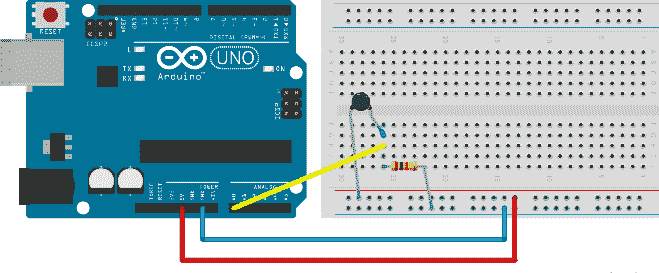
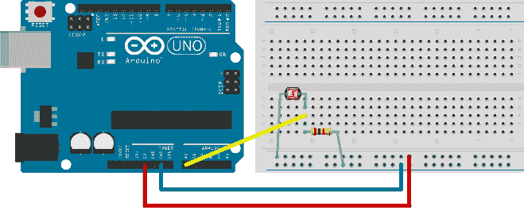
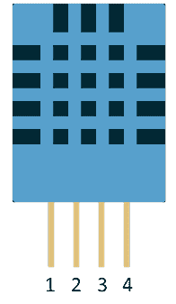
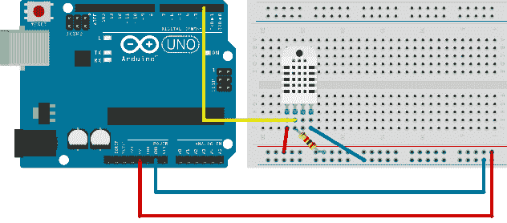
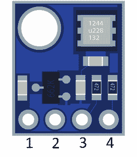
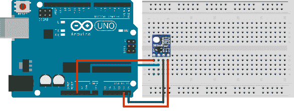

# 第 5 章测量环境条件

到目前为止，我们所涉及的 Arduino 的唯一输入是对按下按钮的反应。这是一个相对简单的读数，其中电流存在与否。根据目前的存在，我们可以做各种行动。 Arduino 不仅仅能够检测按钮是否被按下;它可以用来衡量环境条件。环境测量很少是简单的二进制值。例如，房间的光线水平可能介于完全黑暗和非常明亮的太阳从玻璃天花板进入。例如，如果光照水平低于预定值，我们可以打开灯。在本节中，我们将解释如何测量空气温度，空气湿度和气压以及如何检测光照水平。与前面的章节一样，我们将使用广泛可用且价格低廉的组件来制作示例。让我们从简单的气温读数开始。

## 测量空气温度

我们首先使用一个名为 Thermistor 的简单电子元件。该组件背后的基本原理是它根据周围温度对通过电流提供不同的阻力。热敏电阻有两种基本类型：

*   负温度系数 - 电阻随温度升高而下降
*   正温度系数 - 电阻随温度升高而增加

在我们的示例中，我们将使用负温度系数类型。 10K 欧姆 NTC 5mm 热敏电阻在可用性，精度和价格方面是一个不错的选择：


图 35：10K 欧姆 NTC 5mm 热敏电阻

本节的零件清单：

*   Arduino Uno
*   USB 电缆
*   1x 10K 欧姆 NTC 5mm 热敏电阻
*   1x 10k 欧姆电阻
*   面包板
*   3x 面包板跳线

热敏电阻的行为由 Steinhart-Hart 方程确定。等式中最重要的参数是测量的电阻。测得的电阻不是`HIGH`和`LOW`的数字值。它具有`HIGH`和`LOW`之间的整个值范围。 Arduino 使用模拟引脚来测量这些值。使用二进制引脚，只有当某个引脚上存在电流时，我们才会获得信息。使用模拟，我们从一个范围获得一个值。在 Arduino 中，该范围为 0 到 1023，这意味着有 10 位代表引脚上的输入电流。模拟引脚也可以用于输出，但它们表现为常规数字引脚，并且无法从它们读取模拟值。大多数情况下，您不会遇到这种行为的问题，但请记住它可能会发生。让我们从示例的接线开始：



图 36：10K 欧姆热敏电阻的接线

前面的示例仅使用三条线而不是五条线。如果需要，用导线更换元件的较长引脚。这是文献和原理图中通常的布线方式，但对于较小的电路，不使用太多电线完全没问题。我们将读数输出到串口。此示例中最复杂的部分是读取输入电流，然后将此读数转换为温度。在线发现的大多数例子都使用了几个单行，然后神奇地向用户显示输出。您将通过理解代码而不仅仅是复制和粘贴示例来了解更多信息。所以我们将继续这个实现：

```
// we need advanced math functions
#include <math.h>

int reading;

void setup() {
  // Initialize serial communication at 9600 bit/s
  Serial.begin(9600);
}

void loop() {
  reading = analogRead(A0);

  float kelvins = thermisterKelvin(reading);
  float celsius = kelvinToCelsius(kelvins);
  float fahrenheit = celsiusToFahrenheit(celsius);

  Serial.print("kelvins = ");
  Serial.println(kelvins);

  Serial.print("celsius = ");
  Serial.println(celsius);

  Serial.print("fahrenheit = ");
  Serial.println(fahrenheit);

  Serial.println("");

  delay(3000);
}

float thermisterKelvin(int rawADC) {
  // Steinhart-Hart equation
  // 1/T = A + B (LnR) + C(LnR)ˆ3

  // LnR is the natural log of measured resistance
  // A, B, and C are constants specific to resistor

  // we'll use:
  // T = 1 / (A + B(LnR) + C(LNR)ˆ3)

  // we are using long because Arduino int goes up to 32 767
  // if we multiply it by 1024, we won't get correct values
  long resistorType = 10000;

  // input pin gives values from 0 - 1024
  float r = (1024 * resistorType / rawADC) - resistorType;

  // let' calculate natural log of resistance
  float lnR = log(r);

  // constants specific to a 10K Thermistor
  float a = 0.001129148;
  float b = 0.000234125;
  float c = 0.0000000876741;

  // the resulting temperature is in kelvins
  float temperature = 1 / (a + b * lnR + c * pow(lnR, 3));

  return temperature;
}

float kelvinToCelsius(float tempKelvin) {
  return tempKelvin - 273.15;
}

float celsiusToFahrenheit(float tempCelsius) {
  return (tempCelsius * 9.0)/ 5.0 + 32.0;
}

```

运行示例后，将手指缠绕在热敏电阻上并保持一段时间。你的体温应该高于空气的温度，所以你会看到读数的变化。我们在前面的例子中使用了串行监视器。

## 检测光照水平

光级检测与温度测量非常相似。我们将在本节中使用的组件在照射它的光线下变得更具导电性：


图 37：光电阻器

本节的零件清单：

*   Arduino Uno
*   USB 电缆
*   1x GL5528 光电阻或任何 10K 欧姆光电阻
*   1x 10k 欧姆电阻
*   面包板
*   3x 面包板跳线

该示例的接线类似于测量气温的接线：



图 38：连接光电阻器

让我们马上跳过代码并稍后解释：

```
// we'll store reading value here
int reading;

void setup() {
  // initialize serial communication at 9600 bit/s
  Serial.begin(9600);
}

void loop() {
  reading = analogRead(A0); 

  // we'll measure the input values and map 0-1023 input
  // to 0 - 100 values
  int lightLevel = map(reading, 0, 1023, 0, 100);

  Serial.print("light = ");
  Serial.println(lightLevel);

  delay(3000);
}

```

可能会想到的第一个问题是这个数字是什么意思？它从 0 到 100，所以人们甚至可以将其视为百分比。但问题是，与什么相比？如果光电阻器连接在一个电路中（如上图所示），它可以测量高达 10 勒克斯的光照水平。勒克斯是亮度的测量。如果你看下表，10 勒克斯不是很多;实际上，它很暗，你无法测量明亮和亮度之间的差异：

表 1：勒克斯水平和光照水平的描述

| 勒克斯等级 | 描述 |
| 0.27 - 1.0 | 月光 |
| 3.4 | 黄昏 |
| 10 勒克斯 | 非常黑暗和阴雨天 |
| 50 勒克斯 | 客厅定期光线充足 |
| 320 - 500 | 办公室灯 |
| 1000 | 光线充足，没有阳光直射 |
| 100 000 | 阳光 |

在我们的示例中，我们不是以勒克斯单位测量光照水平，而是简单地将读数映射到百分比。百分比很容易理解，并且很容易检查我们想要采取行动的光照水平。但是，使用之前的设置，我们将无法测量非常明亮的光线。有一个巧妙的方法来解决这种情况。如果你将一个 1k 欧姆的电阻放入电路而不是 10，你将能够在更高的水平上获得读数差异，并且你将能够区分明亮和亮度。

如果要测量精确的勒克斯电平，则必须仔细查看电阻器规格并将电压从规格映射到读数。这项工作有点单调乏味，仅用于非常具体的情况，如摄影。对于常规使用情况，例如“有灯亮吗？”或类似的东西，建议您只需使用百分比并将电路中的电阻器调整到您想要测量的亮度级别。基本上，如果要区分深色和深色，请使用 10K 电阻，如果要区分浅色和浅色，请使用 1K 电阻。大多数具有工程背景的读者可能更喜欢勒克斯单元，但将电压映射到简单的百分比对于日常使用来说已经足够了。

## 使用温度和湿度传感器

在前面的部分中，我们使用了一个称为热敏电阻的元件来测量温度。它背后的电子设备相对简单：有一个元素，我们只是解释我们得到的当前水平。对于某些用途，使用简单的元素并不会削减它，并且使用基本元素会显着增加我们必须放入电子元件的元素数量。因此，制造商开始构建单独的组件，然后可以与 Arduino 进行通信，然后 Arduino 与其他设备进行通信，等等。我们将从相对简单的开始，例如测量温度，以便完成使用 Arduino 的单独组件的整个过程。

有许多温度传感器可以与 Arduino 通信并与之交换信息。 DHT11 传感器是最常用且相对便宜的产品之一。除了温度，它还可以测量相对湿度。编程它可能有点棘手，我们必须深入到规范中去做任何工作。所以我们将使用一个库为我们做脏工作。这是 DHT11 模块：



图 39：DHT11 温度和湿度传感器

该图显示了引脚上的标记，以便在开始设置示例时将传感器连接到电路板更容易。您不必担心错误地转动传感器，因为图中所示的正面有孔，而背面是光滑的。与每个部分一样，我们将从部分开始。

零件清单：

*   Arduino Uno
*   USB 电缆
*   DHT11 温湿度传感器
*   10K 欧姆电阻器
*   面包板
*   5x 面包板跳线

这是接线：



图 40：DHT22（图示）和 DHT11 具有相同的布线

DHT 有各种变体，例如 DHT22。我们描述了 DHT22 的布线，因此您意识到其他传感器具有几乎相同的名称，但它们的功能完全不同（尽管布线相同）。当我们讨论编程时，我们会看一下。

为了解决所有问题，我们需要下载一个库。在此处下载位于 Github [中的文件并记住保存它的位置。创建一个新草图，然后单击`Sketch`＆gt; `Include Library`＆gt; `Add ZIP Library`。选择您下载的 zip 存档，IDE 应自动安装库。这是与示例一起提供的代码。确保将 DHTTYPE 常量更改为您正在使用的类型：](https://github.com/adafruit/DHT-sensor-library/archive/master.zip)

```
#include "DHT.h"

// to use the library we have to define some constants

// what pin are we going to use
#define DHTPIN 2

// what type of sensor are we going to use
// possible: DHT11, DHT22, DHT21
// be careful to set it correctly
#define DHTTYPE DHT11

// instantiate DHT sensor
DHT dht(DHTPIN, DHTTYPE);

void setup() {
  // we'll print measurements to serial
  Serial.begin(9600);

  // start the sensor
  dht.begin();
}

void loop() {
  // it takes around 2 seconds for the sensor to update data
  delay(2000);

  // read humidity
  float h = dht.readHumidity();

  // Read temperature as Celsius
  float t = dht.readTemperature();

  // Read temperature as Fahrenheit
  float f = dht.readTemperature(true);

  // check the value
  if (isnan(h) || isnan(t) || isnan(f)) {
    Serial.println("Failed to read, reading again!");
  }
  else {
    // compute heat index
    // heat index works only with Fahrenheit
    float hi = dht.computeHeatIndex(f, h);

    Serial.print("Humidity %: ");
    Serial.println(h);

    Serial.print("Temperature *C: ");
    Serial.println(t);

    Serial.print("Heat index *C: ");
    Serial.println(fahrenheitToCelsius(hi));

    Serial.print("Temperature *F: ");
    Serial.println(f);

    Serial.print("Heat index *F: ");
    Serial.println(hi);

    Serial.println();
  }
}

float fahrenheitToCelsius(float tempF) {
  return (tempF - 32) / 1.8;
}

```

许多 Arduino 传感器与此类似。您下载库，连接传感器，然后开始读取数据。有许多库用于各种 Arduino 传感器。本节介绍了使用更复杂传感器时的标准步骤。

## 测量气压

这不是一本关于物理学的书，所以我们不会谈论气压是什么。空气也具有重量，暴露在大气中的表面会受到空气的压力。使用气压有两种主要方法。一种方法是跟踪天气的变化。第二种方法是用已知压力测量两点之间的高度变化。

在观测天气时，有许多气象站位于山区，海平面或其下方（如死亡谷）。无论我们在哪里进行测量，如果我们知道海平面以上的高度，我们就能计算出海平面上的压力。因此，在天气预报中，所有气压值通常都表示在海平面上。标准压力为 1013.25 毫巴或 29.92 英寸汞柱。然后我们可以快速确定某个点是否低于通常的压力值或高于它。根据我们目前所处的位置，我们甚至可以使用气压的运动来预测天气。

当空气进入​​大气层时，空气变薄。今天，传感器可以测量相对较小的垂直运动;通常精度在三英尺或一米之内。我们将在本节中使用的主要组件是 BMP180 气压传感器：



图 41：BMP180 气压传感器

本节的零件清单：

*   Arduino Uno
*   USB 电缆
*   BMP180 气压传感器
*   面包板
*   4x 面包板跳线

外部引脚连接到 Arduino 上的 3.3V 电源。针脚 2 接地。引脚 3 进入 A5，引脚 4 进入 A4。请注意，芯片种类繁多，其中一些有五个或更多引脚。在五针版本中，第一个引脚被忽略，其余部分与上图相同。如果有超过五个引脚，请查看制造商的文档。我们来看看接线：



图 42：BMP180 传感器接线

读取值有点复杂。与模块的沟通将是一个劳动密集型过程。因此，为了解决所有问题，我们需要下载一个库。在此处下载位于 Github [上的文件，并记住保存它的位置。创建一个新草图并单击`Sketch`＆gt; `Include Library`＆gt; `Add ZIP Library`。选择您下载的 zip 存档，IDE 应自动安装库。以下是与示例一起提供的代码：](https://github.com/sparkfun/BMP180_Breakout_Arduino_Library/archive/master.zip)

```
#include <SFE_BMP180.h>
// SFE_BMP180 library is not enough
// we have to include the wire to communicate with the sensor
#include <Wire.h>

// SFE_BMP180 object sensor:
SFE_BMP180 sensor;

// altitude of my home in meters
// change this to your own altitude!!!
// you will get strange reading otherwise
#define ALTITUDE 178.0

// we'll keep track of previous measured pressure
// so that we can calculate relative distance
double previous_p = 0;

void setup() {
  Serial.begin(9600);
  Serial.println("INIT ...");

  // begin initializes the sensor and calculates the calibration values
  if (sensor.begin()) {
    Serial.println("BMP180 init OK");
  }
  else {
    Serial.println("BMP180 init FAILED!!!");
    // stop the execution
    delay(1000);
    exit(0);
  }
}

void loop() {
  // we'll make a reading every 5 seconds
  delay(5000);

  byte waitMillis, status;
  double temp, p, p0, a;

  // weather reports use sea level compensated pressure
  // find out your altitude to get the readings right

  Serial.println();
  Serial.print("ALTITUDE: ");
  Serial.print(ALTITUDE);
  Serial.print(" m  ");
  Serial.print(ALTITUDE * 3.28084);
  Serial.println(" feet");

  // to read the pressure, you must read the temperature first

  // ask the sensor when can we get a temperature reading
  // if o.k. we get waitMillis, otherwise 0

  waitMillis = sensor.startTemperature();
  if (waitMillis == 0) {
    Serial.println("Temperature reading not ready");
    return;
  }

  // wait for as long as the sensor says
  delay(waitMillis);

  // retrieve the temperature measurement into temp
  // function updates waitMillis again
  waitMillis = sensor.getTemperature(temp);

  if (waitMillis == 0) {
    Serial.println("Error reading temperature");
    return;
  }

  // current temperature values in different units
  Serial.print("TEMPERATURE: ");
  Serial.print(temp);
  Serial.print(" *C  ");
  Serial.print((9.0 / 5.0) * temp + 32.0);
  Serial.println(" *F");

  // start a pressure measurement:
  // precision from 0 to 3, precise readings take more time
  // we get millis how long to wait for the measurement

  waitMillis = sensor.startPressure(3);

  if (waitMillis == 0) {
    Serial.println("Error starting pressure reading");
    return;
  }

  delay(waitMillis);
  // Retrieve the completed pressure measurement:
  // Function returns 1 if successful, 0 if failure.

  status = sensor.getPressure(p,temp);
  if (waitMillis == 0) {
    Serial.println("Error getting pressure reading");
    return;
  }

  // pressure data
  Serial.print("ABSOLUTE PRESSURE: ");
  Serial.print(p);
  Serial.print(" mb  ");
  Serial.print(p * 0.0295333727);
  Serial.println(" inHg");

  // sensor returns absolute pressure, which varies with altitude.
  // in weather reports a relative sea-level pressure is used
  p0 = sensor.sealevel(p, ALTITUDE);

  Serial.print("SEA LEVEL: ");
  Serial.print(p0);
  Serial.print(" mb  ");
  Serial.print(p0 * 0.0295333727);
  Serial.println(" inHg");

  // altitude difference from previous reading
  a = sensor.altitude(p, previous_p);
  Serial.print("HEIGHT DIFFERENCE FROM PREVIOUS: ");
  Serial.print(a);
  Serial.print(" m  ");
  Serial.print(a * 3.28084);
  Serial.println(" feet");

  previous_p = p;
}

```

该示例可能会给您与本地气象站的读数显着不同的读数。在运行示例之前，请确保找到房屋的海平面高度。否则，您可能会对结果感到困惑。使用所提供示例的第 12 行中的 define 命令`#define ALTITUDE 178.0`设置高度。如果您打算建立一个进行天气监测的项目，这将是一个将派上用场的例子之一。到现在为止，我们谈了很多关于气氛的事情。我们还能用 Arduino 感受到什么？我们将在下一节中详细讨论它。

## 检测土壤水分

如果你曾经有植物，你知道偶尔会忘记浇水。好吧，不管你信不信，Arduino 也有这个。所有你需要避免的问题是土壤湿度传感器。土壤电导率特性随土壤中含水量的变化而变化，传感器测量这些特性。传感器有两个组件：探头和传感器本身。


图 43：带有零件的土壤湿度传感器

探头和传感器之间的接线用两根电线完成。你如何连接它们并不重要。我们马上谈谈 Arduino 和传感器之间的接线。在这个例子中我们不会使用面包板。

本节的零件清单：

*   Arduino Uno
*   USB 电缆
*   YL-96 土壤湿度传感器
*   4x 电线
*   一杯水来测试功能

表 2： YL-96 引脚

| 销 | 描述 |
| VCC | 用于连接 5V +的引脚 |
| GND | 用于连接地面的引脚 |
| 做 | 数字输出 |
| AO | 模拟输出 |

将 VCC 连接到 Arduino 5V，GND 连接到 Arduino GND，DO 连接到 8 中的数字。使用以下代码清单：

```
// we'll use digital pin 8
int inPin = 8;

// we'll store reading here
int val;

void setup() {
  // initialize serial communication
  Serial.begin(9600);
  // set the pin mode for input
  pinMode(inPin, INPUT);
}

void loop() {
  // read the value
  val = digitalRead(inPin);

  // if the value is low
  if (val == LOW) {
    // notify about the detected moisture
    Serial.println("Moisture detected!");
    delay(1000);
  }
}

```

打开串行监视器，观察将探头放入水中时会发生什么。请记住，这只是一个数字阅读。探头可以使用模拟引脚发送水分。重新连接引脚，将 VCC 连接到 Arduino 上的 Arduino 5V，GND 连接到 Arduino GND，以及 AO 连接到模拟输入 5。使用以下代码示例：

```
// we'll store reading from the input here
int input;

// we'll map the input to the percentages here
int val;

void setup() {
  // initialize the serial communication
  Serial.begin(9600);
}

void loop() {
  // read the value from A5
  input = analogRead(A5);
  // map it to percentage
  val = map(input, 1023, 0, 0, 100);

  // print and wait for a second
  Serial.println(val);
  delay(1000);
}

```

打开串行监视器，检查将探头放入一杯水中的情况。现在，你可能会问，“为什么读数只有 40％左右，如果它浸入水中，它应该在 100％左右？嗯，潮湿的土壤实际上比一杯水导电更好。如果有机会，请尝试将传感器放入潮湿的土壤中（但要注意不要弄乱土壤颗粒）。

此外，请小心使用一杯水，因为如果溢出，可能会损坏 Arduino 或附近的电子设备。现在，您可能会认为这就是它的全部，但这个传感器有一个非常重要的问题。一段时间后探针开始腐蚀，在几天（或几周）内，它将完全无法使用。


图 44：腐蚀的土壤湿度传感器

我们将通过仅在实际需要测量水分时为传感器供电来解决传感器腐蚀问题。通常不会每秒进行采样水分;每分钟或每小时一次就完美了。让我们重新连接传感器，使其仅在我们进行测量时支持开启。将 VCC 连接到 Arduino 数字引脚 8，GND 连接到 Arduino GND，以及 Arduino 上的 AO 到模拟输入 5。使用以下代码每分钟打开一次传感器，然后读取：

```
// we'll store reading from the input here
int input;

int vccPin = 8;

// we'll map the input to the percentages here
int val;

void setup() {
  // initialize the serial communication
  Serial.begin(9600);

  // set up the pin mode
  pinMode(vccPin, OUTPUT);
}

void loop() {
  // turn on the sensor
  digitalWrite(vccPin, HIGH);

  // wait a little bit for the sensor to init
  delay(100);

  // read the value from the A5
  input = analogRead(A5);

  // turn off the sensor
  digitalWrite(vccPin, LOW);

  // map it to percentage
  val = map(input, 1023, 0, 0, 100);

  // print and wait for a minute
  Serial.println(val);

  delay(60000);
}

```

使用此代码可能会为您节省大量探针，因为它们在暴露于恒定电流时会快速耗尽。许多开始在园艺中使用 Arduino 的人经常对这种效果感到惊讶，但这实际上是使用 Arduino 进行园艺时的一个已知问题。此外，还有更昂贵的传感器可以持续更长时间，但是使用便宜的传感器和一点点智能代码的解决方案就是 Arduino 的全部内容。

## 测量环境条件结论

对许多人来说，这是一个非常重要的章节。测量环境条件是他们首先开始使用 Arduino 的主要原因之一。人们只是想知道房间里的温度是什么，或者只是感兴趣他们不在的环境中发生了什么。

大多数问题都与能源成本，环境问题和节约有关。加热不一定是在所有时间。通过将 Arduino 与一些传感器结合使用，我们可以查看历史数据或将其绘制成图表，并快速确定可以节省的成本。

也有人有健康问题，他们希望专门针对他们环境中的确切湿度水平; Arduino 也可以在那里提供很大的帮助。与现成解决方案相比，Arduino 的主要优势之一是您可以随时调整它以满足您的需求 - 而不必在仅需要其部分功能时获得昂贵的设备。

此外，越来越多的人想要吃得更健康，他们开始种植自己的食物（好吧，也许不是所有的食物，但至少有一些）。有一个名为 Urban Gardening（UG）的重要运动，Arduino 绝对是许多 UG 相关应用的首选技术。但 Arduino 的可能性并不仅仅取决于环境条件。实际上，Arduino 可以用来做更多事情。我们将在下一章中介绍它。