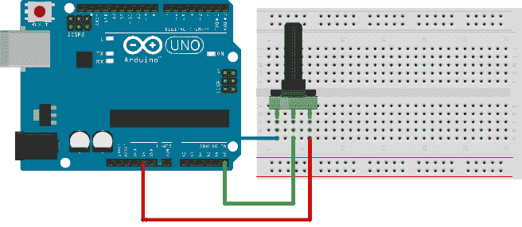
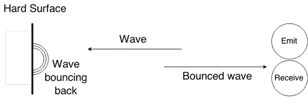
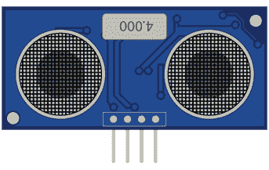
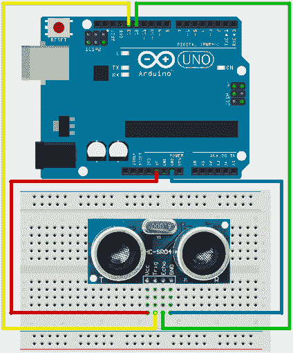
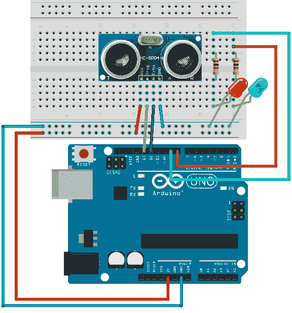
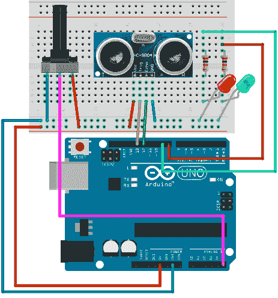
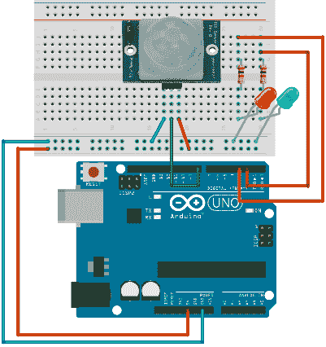
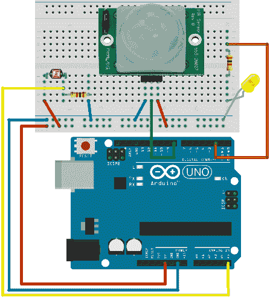

# 第 6 章检测物体

到目前为止，我们学习了如何监控环境属性。但是，我们通常会想要对物理上不断变化的环境或其他移动物体或在我们周围进行动作做出反应。这种传感电子设备已经在日常生活中使用。

例如，如果您开车向后并且有停车传感器，您可能已经在使用物体检测技术。另一种流行的传感技术是各种报警系统中的入侵检测。我们将描述这些系统的工作原理。

检测对象通常不是二进制业务，我们需要一定级别的配置。因此，在本节中，我们将从一些简单的东西开始，它与传感器没有直接和明显的连接来检测物体。但它实际上非常重要，因为如果值超过预定值，我们就不会总是希望检测组件做出反应。但我们希望能够定义灵敏度级别，而无需重新编程整个 Arduino 项目。使我们能够进行变量设置的组件称为电位计。基本上，当我们转动旋钮时，它所做的就是改变它的电阻。我们将在后面的示例中使用电位计来改变灵敏度级别。让我们从电位器开始吧。

## 使用电位计

电位计通常以旋钮的形式出现。转动越多，该旋钮提供越大的阻力。它通常用于控制无线电的音量，通风系统的风扇速度或房间内所需的温度水平。你现在至少可以在生活中使用它一次，但让我们来看看它是如何工作的，以及我们如何使用它。

本节的零件清单：

*   Arduino Uno
*   USB 电缆
*   10K 欧姆电位器
*   面包板
*   3x 面包板跳线

该示例的布线相对简单。请记住，将正极和负极引脚连接到电位计并不重要。如果对正极和负极引线进行不同的布线，唯一会改变的是，当您转动旋钮时，电阻会从较小的值变为较大的值，反之亦然。这一切都取决于你如何连接它。我们来看看接线：



图 45：电位计接线

使用此编程示例来查看正在发生的事情：

```
// we'll store reading from the input here
int input;

// we'll map the input to the percentages here
int val;

// for keeping the previous reading
int previous_val;

void setup() {
  // initialize the serial communication
  Serial.begin(9600);
}

void loop() {
  // read the value from A5
  input = analogRead(A5);

  // map it to percentage
  val = map(input, 1023, 0, 0, 100);

  // if percentage changed
  if (val != previous_val) {
    // print and store the value for comparison
    Serial.println(val);
    previous_val = val;
  }

  // delay to prevent output overcrowding
  delay(100);
}

```

如果旋转旋钮，您应该看到百分比如何从 0 变为 100.如果您不喜欢方向值上升或下降，您有两种选择。一种选择是如前所述交换最右边和最左边的连接器。尝试一下，看看旋钮的行为，然后重新连接，以便我们可以看到如何使用该软件：

```
  val = map(input, 1023, 0, 100, 0);

```

您是如何根据旋钮调整读数值的。模拟组件的好处在于，无论您在何处以及如何使用它们，您都可以立即获得反馈，因此如果您走错了方向，您可以快速补偿。让我们从另一个构建块开始，这个构建块通常用于检测环境中的对象，尤其是用于测量距离。根据 Arduino 构建，它可能会断开或停止在最小和最大电位计旋转点发送数据。如果发生这种情况，请断开 Arduino 并重新连接。

## 使用超声波距离传感器

超声波距离传感器是一种非常便宜且实用的方法来检查物体的距离。声音以已知的速度穿过大气层。速度可能会根据天气情况而有所不同，但根据维基百科的说法，声音在 4.689 秒内传输一英里或在 2.914 秒内传播一公里。传感器背后的基本工作原理是我们只需测量发射超声波然后等待它回来所需的时间。然后，我们将时间除以 2，因为波浪移动了两倍的距离。然后我们简单地将这个持续时间除以声速。基本功能原理如下图所示：



图 46：超声波距离传感器的基本工作原理

上图显示了两个组件。一个用于发射，另一个用于接收声波。超声波距离传感器看起来类似于显示的两个圆圈。如下图所示：



图 47：超声波距离传感器

在我们的案例中使用的模块非常容易和便宜;它的名称是 HC-SR04，它在本节的零件清单中。

本节的零件清单：

*   Arduino Uno
*   USB 电缆
*   HC-SR04 超声波距离传感器
*   面包板
*   4x 面包板跳线

接线的基本概述如下所示：

表 3： HC-SR04 引脚和与 Arduino 的连接

| 销 | 连接 |
| VCC | 用于连接 5V +的引脚 |
| 触发 | 在我们的示例中连接到引脚 13 |
| 回声 | 在我们的示例中连接到引脚 12 |
| GND | 用于连接 Arduino 上的 GND 的引脚 |

下图显示了完整的接线：



图 48：超声波距离传感器接线

我们将使用传感器测量最近的硬表面的距离，然后每秒显示到串口的距离。在后面的示例中，我们将在检测到某个距离处的对象时执行操作，但是，现在，我们将只看一下正在发生的事情。请注意，声音不能很好地从衣服上反弹回来，因此传感器可能无法按照您的预期读取所有内容。这是示例的代码：

```
// we'll use trigPin for emitting
int trigPin = 13;

// we'll listen for the pulse on the echoPin
int echoPin = 12;

// variables for calculations
long duration, distance_inch, distance_cm;

void setup() {
  // initialize serial communication
  Serial.begin (9600);

  // initialize pins
  pinMode(trigPin, OUTPUT);
  pinMode(echoPin, INPUT);
}

void loop() {
  // emit a pulse
  digitalWrite(trigPin, HIGH);
  delayMicroseconds(10);
  digitalWrite(trigPin, LOW);

  // get the time that it takes for the pulse to return
  // pulseIn waits for the pulse and returns number of microseconds
  // divided by two because sound travels there and back again
  duration = pulseIn(echoPin, HIGH) / 2;

  // convert to inches and centimeters by using this formula
  distance_inch = duration / 74;
  distance_cm = duration / 29;

  // print the results
  Serial.print(distance_inch);
  Serial.print(" inch; ");
  Serial.print(distance_cm);
  Serial.println(" cm");
  Serial.println("");

  delay(1000);
}

```

如果打开`Serial Monitor`工具，您应该看到距离传感器前面的距离如何变化。你甚至可以拿一把尺子来检查传感器的精度。请注意，根据您居住的海拔高度和实验期间的天气状况，可能存在细微差别。此外，传感器无法检测到物体何时太靠近它。也不可能测量低于 2 厘米（0.8 英寸）和超过 400 厘米（157.5 英寸）的距离。在下一节中，如果对象太靠近传感器，我们将执行操作。

## 对接近物体做出反应

大多数情况下，传感器不仅仅用于测量物体的距离。通常我们需要执行某种动作，例如打开灯，开始发出哔哔声或打开闹钟。在本节中，我们将讨论前面的示例，并使用 LED 来模拟简单的警报。

如果一切正常，绿色 LED 将亮起。但如果有些东西靠近传感器，我们将打开红色 LED。零件清单将比上一节略长。

本节的零件清单：

*   Arduino Uno
*   USB 电缆
*   HC-SR04 超声波距离传感器
*   2x 100 欧姆电阻
*   1 个红色 LED
*   1 个绿色 LED
*   面包板
*   8x 面包板跳线

示例的接线如下所示：



图 49：距离报警接线

示例的代码：

```
// we'll use trigPin for emitting
int trigPin = 13;

// we'll listen for the pulse on the echoPin
int echoPin = 12;

int okPin = 8;
int nOkPin = 9;

// variables for calculations
long duration, distance_inch, distance_cm;

void setup() { 
  // initialize pins
  pinMode(trigPin, OUTPUT);
  pinMode(echoPin, INPUT);
  pinMode(okPin, OUTPUT);
  pinMode(nOkPin, OUTPUT);
}

void loop() {
  // emit a pulse
  digitalWrite(trigPin, HIGH);
  delayMicroseconds(10);
  digitalWrite(trigPin, LOW);

  // get the time that it takes for the pulse to return
  // pulseIn waits for the pulse and returns number of microseconds
  // divided by two because sound travels there and back again
  duration = pulseIn(echoPin, HIGH) / 2;

  // convert to inches and centimeters by using this formula
  distance_inch = duration / 74;
  distance_cm = duration / 29;

  // the distance is the same in both units
  // leave the one that suits you
  if (distance_cm < 28 || distance_inch < 11) {
    digitalWrite(nOkPin, HIGH);
    digitalWrite(okPin, LOW);
  }
  else {
    digitalWrite(okPin, HIGH);   
    digitalWrite(nOkPin, LOW);
  }

  delay(200);
}

```

## 在飞行中调整距离传感器

如果对象比预定值更接近，则前面的示例始终固定为打开警告 LED。在大多数现实生活中，拥有固定值是不够的。在某些情况下，我们需要调整传感器检测的距离。为了克服我们当前解决方案的这个缺点，我们将为游戏增加一个电位器。不久之前我们有一个关于它是如何工作的部分，所以请随意回顾它以稍微刷新自己。我们将从零件清单开始。

本节的零件清单：

*   Arduino Uno
*   USB 电缆
*   HC-SR04 超声波距离传感器
*   2x 100 欧姆电阻
*   1 个红色 LED
*   1 个绿色 LED
*   10K 欧姆电位器
*   面包板
*   11x 面包板跳线

我们将用电位器调节报警距离。规格中提供了传感器的最小值和最大值。我们将在示例中使用它。我们还将从电位计读取的值映射到百分比。然后我们将使用百分比来计算警报将要发生的实际距离。我们之前没有提到它，但传感器在所有读数中都不正确。如果读数小于或大于传感器能够检测到的读数，那么我们将跳过一个循环来做出反应并继续新的循环。接线比前面的例子复杂一点：



图 50：带调节电位计的距离报警

该代码使用了比前几节更多的 Arduino 引脚。如果您使用其他传感器检测距离，请更改代码中的范围。这是示例的代码清单：

```
// we'll use trigPin for emitting
int trigPin = 13;

// we'll listen for the pulse on the echoPin
int echoPin = 12;

int okPin = 8;
int nOkPin = 9;

// sensor limits are defined in cm
int sens_min = 2;
int sens_max = 400;

// variables
long duration, distance, tune_in, alarm_distance;

void setup() {
  // initialize pins
  pinMode(trigPin, OUTPUT);
  pinMode(echoPin, INPUT);
  pinMode(okPin, OUTPUT);
  pinMode(nOkPin, OUTPUT);
}

void loop() {
  // check the current tuned setting
  tune_in = map(analogRead(A5), 1023, 0, 0, 100);

  alarm_distance = sens_min + ((sens_max - sens_min) * tune_in)/100;

  // emit a pulse
  digitalWrite(trigPin, HIGH);
  delayMicroseconds(10);
  digitalWrite(trigPin, LOW);

  // get the time that it takes for the pulse to return
  // pulseIn waits for the pulse and returns number of microseconds
  // divided by two because sound travels there and back again
  duration = pulseIn(echoPin, HIGH) / 2;

  distance = duration / 29;

  // sanity check on the values
  if (distance > sens_max ||  distance < sens_min) {
    return;
  }

  // check if the alarm LED should light up
  if (distance <= alarm_distance) {
    digitalWrite(nOkPin, HIGH);
    digitalWrite(okPin, LOW);
  }
  else {
    digitalWrite(okPin, HIGH);   
    digitalWrite(nOkPin, LOW);
  }

  delay(200);
}

```

完成接线后，更换电位计，看看报警器如何响应接近。通过这个例子，我们介绍了距离传感器的基本用法。我们已经介绍了很多，但这些例子或多或少是固定不变的。在下一节中，我们将向动态传感迈出一小步。

## 停车传感器

我们提到了一种停车传感器作为使用超声波距离传感器的可能方式之一。在本节中，我们将更进一步，并完成制作一个所需的步骤。

接线比前一个示例容易一些，但编程稍微复杂一些。本节中最难的部分是计算蜂鸣声间隔，并使蜂鸣器在物体越近时发出蜂鸣声。如前几节所述，我们将从零件清单开始。

本节的零件清单：

*   Arduino Uno
*   USB 电缆
*   HC-SR04 超声波距离传感器
*   1x 100 欧姆电阻
*   Arduino 兼容无源蜂鸣器
*   面包板
*   8x 面包板跳线

示例的接线：


图 51：驻留传感器接线

代码比前面的部分要复杂一些。最复杂的部分是根据物距确定哔哔声之间的间隔：

```
// we'll use trigPin for emitting
int trigPin = 13;

// we'll listen for the pulse on the echoPin
int echoPin = 12;

// pin for the buzzer
int buzzPin = 7;

// sensor limitations defined in cm
int sens_min = 2;
int sens_max = 400;

// buzzer limitations are defined in cm
// it starts buzzing when something is closer than 100 cm
long buz_min = 2;
long buz_max = 100;

// beeping intervals in seconds
// this will be a long beep
int beep_max = 700;
// short beep
int beep_min = 50;

// variables for calculations
long duration, distance, beepInterval;
float pulsePercent;

// we'll initialize the lastBuzzTime to 0
long lastBuzzTime = 0;

void setup() {
  // initialize pins
  pinMode(trigPin, OUTPUT);
  pinMode(echoPin, INPUT);
  pinMode(buzzPin, OUTPUT);
}

void loop() { 
  // emit a pulse
  digitalWrite(trigPin, HIGH);
  delayMicroseconds(10);
  digitalWrite(trigPin, LOW);

  // get the time that it takes for the pulse to return
  // pulseIn waits for the pulse and returns number of microseconds
  // divided by two because sound travels there and back again
  duration = pulseIn(echoPin, HIGH) / 2;

  distance = duration / 29;

  // sanity check on the values
  if (distance > sens_max || sens_min < 2) {
    return;
  }

  // if distance is smaller than the beeping trigger distance, start beeps
  if (distance < buz_max) {   
    // the easiest is to calculate the percentages of min and max distance
    pulsePercent = (100 * (distance - buz_min) / (buz_max - buz_min));

    // determine the beeping interval with the help of percentages
    beepInterval = beep_min + (pulsePercent * (beep_max - beep_min)) / 100;

    // we will emit a tone without using the delay function
    // so we will check the Arduino internal clock to check when to beep
    if ((millis() - lastBuzzTime) >= beepInterval) {
      tone(buzzPin, 2200, 100);
      // we have to remember the last time we started a beep so that we don't
      // start to emit a continuous sound
      lastBuzzTime = millis();
    }
  }

  // minimum sensing time is the minimum beep interval
  delay(beep_min);
}

```

现在用手掌试试吧。越接近传感器，哔哔声之间的时间就越短。请注意，超声波距离传感器在硬表面上效果最佳，如果您远离传感器，则蜂鸣声可能有点不规则。在这种情况下，采取任何类型的硬表面物体，并尝试看看传感器如何反应它。

使用坚硬的表面物体，您应该获得比手掌更好的效果。此外，距离传感器有时不会检测与其平行或以更大角度的表面，因为声束以不会返回传感器的方向反弹回来。因此，大多数汽车在挡泥板中都有多个传感器。

此外，一些较旧的传感器没有检测到诸如杆和类似物体之类的小垂直障碍物。但是这种传感器非常适合廉价的项目，并且经常用于机器人技术。有许多 Arduino 机器人设计使用这种传感器来检测墙壁等障碍物。传感器通常安装在炮塔上，为机器人提供更多探测障碍物的可能性。传感器也有一个非常有趣的形状，因为发射器和接收器看起来像眼睛，机器人得到一个非常有趣的形式。在某种程度上，传感器代表它的眼睛。

## 使用红外运动传感器

到目前为止，我们在示例中使用了超声波距离传感器。如果您构建了示例，您可能已经注意到超声波距离传感器无法始终检测到没有坚硬表面的物体，或者表面是否以不会返回到波浪的方式反射波浪。传感器。它在距离感方面也具有相对适中的能力，并且无法检测超过 4 米或 157 英寸的物体。

此外，有时候事情的重要程度并不重要，我们通常只想检测是否有人在房间里或是否有什么东西在移动。红外传感器非常适合这些情况，因此我们将在本节中使用它。我们将构建一个带有两个 LED 的运动检测器。如果没有任何动作，绿色 LED 将亮起。如果有东西开始移动，我们将打开红色 LED。

本节的零件清单：

*   Arduino Uno
*   USB 电缆
*   Arduino 兼容的红外传感器
*   2x 100 欧姆电阻
*   1 个绿色 LED
*   1 个红色 LED
*   面包板
*   7x 面包板跳线

布线：



图 52：运动传感器接线

传感器接线可能因生产商而异。为了确保，请使用下表仔细检查接线：

表 4：实施例的红外传感器接线

| 销 | 连接 |
| VCC | 用于连接 5V +的引脚 |
| OUT | 在我们的示例中连接到引脚 8 |
| GND | 用于连接 Arduino 上的 GND 的引脚 |

该示例的代码相对简单。我们将从输入引脚读取状态，然后打开和关闭 LED，具体取决于我们从输入中读取的内容：

```
// detection is going to be on pin 8
int detectPin = 8;

// LED pins
int greenPin = 2;
int redPin = 3;

int detectPinValue = LOW;

void setup() {
  // initialize pins
  pinMode(detectPin, INPUT);
  pinMode(greenPin, OUTPUT);
  pinMode(redPin, OUTPUT);
}

void loop() { 
  // check the value from the sensor
  detectPinValue = digitalRead(detectPin);

  if (detectPinValue == HIGH) {
    // if sensor detected movement, turn the red LED on
    digitalWrite(greenPin, LOW);
    digitalWrite(redPin, HIGH);

    // we'll leave the red LED on for a while
    delay(500);
  }
  else {
    // turn the green LED on
    digitalWrite(greenPin, HIGH);
    digitalWrite(redPin, LOW);
  }

  // relatively short loop cycle
  delay(100);
}

```

这是一个非常有趣的例子。在传感器周围移动，看看它是如何反应的。尽量不要全身移动，只要动一下手来看看会发生什么。此示例是创建警报设备的良好基础。此传感器的另一个用途是打开灯，这样我们就可以看到通往门的路径，而无需使用遥控器或类似的东西。在下一节中，我们将设置一个运动传感器，在检测到运动时打开 LED，但仅在房间较暗时才开启。

## 有条不紊地开灯

运动传感器的一个常见用途是在有人靠近时打开和关闭灯。传感器可在夜间和白天工作。但在白天，我们希望节省电力而不开灯，因为光线充足。在本节中，我们将通过布线和编程来完成。与所有示例一样，我们将从零件清单开始。

本节的零件清单：

*   Arduino Uno
*   USB 电缆
*   Arduino 兼容的红外传感器
*   1x 10k 欧姆电阻
*   1x GL5528 光电阻或任何 10K 欧姆光电阻
*   1x 100 欧姆电阻
*   1 个黄色 LED
*   面包板
*   9x 面包板跳线

10k 欧姆电阻器与光电阻器配对。与前面的示例中一样，100 欧姆电阻与 LED 配对。我们将使用黄色 LED，因为它模仿了应该打开的灯泡。我们之前提到过，我们不会向您展示任何具有强电流的电路，因此我们只使用 LED。但 LED 很容易被继电器取代，你就会拥有真实的东西。但是在这个发展阶段，最好不要玩危险的电流。我们来看看接线：



图 53：带有运动传感器接线的条件指示灯

所有缺少的是代码。我们将使时序比实际电路中的时间短一些。例如，在最后一次注册的移动后，灯将保持开启约五秒钟。如果您正在构建一个真正的条件光，我们会在最后一次检测到的动作后将灯保持开启几分钟。此外，我们在这里制作的软件肯定会在更高的价格范围内，因为传感器监视最后一次移动。通常情况下，照明解决方案只是自己开启并等待无论如何，在时间到期后，他们会自行关闭并再次等待新的运动。此示例持续监视空间并在最后一次移动注册后五秒钟继续提供灯光。如果您在非常明亮或黑暗的房间中尝试该示例，请根据需要调整 startTurningLightAt 变量。你最好试验价值，看看会发生什么：

```
// movement detection is going to be on pin 8
int detectPin = 8;
int detectPinValue = LOW;

// light pin is going to be on pin2
int lightPin = 2;

// we'll store reading value here
int lightLevel, lightReading;

// give this a bigger value in a light room
int startTurningLightAt = 70;

long lastMovementTime = 0;

// continue with light 5 seconds after last movement
int continueLightTime = 5000;

void setup() {
  pinMode(lightPin, OUTPUT);
}

void loop() {
  // read the light level from pin A5
  lightReading = analogRead(A5); 

  // we'll measure the input values and map 0-1023 input
  // to 0 - 100 values
  lightLevel = map(lightReading, 0, 1023, 0, 100);

  if (lightLevel < startTurningLightAt) {
      detectPinValue = digitalRead(detectPin);

      if (detectPinValue == HIGH) {
        digitalWrite(lightPin, HIGH);
        lastMovementTime = millis();
      }
      else if ((millis() - lastMovementTime) > continueLightTime) {
        digitalWrite(lightPin, LOW);
      }
  }
  else {
    digitalWrite(lightPin, LOW);
  }

  delay(100);
}

```

这是检测对象部分中的最后一个示例。对于本章的更好部分，我们一直在使用 Arduino 世界中最受欢迎的两种传感器：超声波距离传感器和红外线运动传感器。我们还展示了涉及这两者的日常生活中的经典例子。在下一章中，我们将概述最常见的 Arduino 网络解决方案。