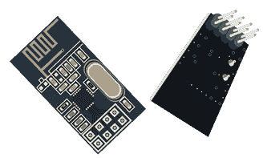
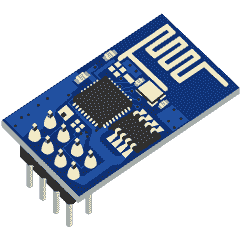
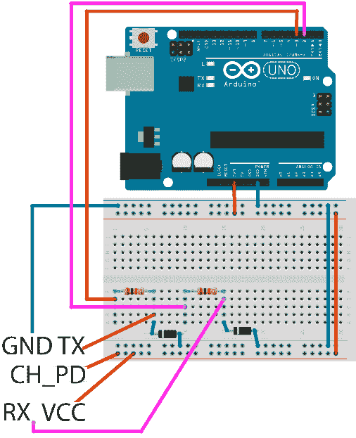

# 第 7 章网络

到目前为止，所有示例都处于脱机状态。我们没有将 Arduino 的读数发送到另一台设备，也没有使用 Arduino 通过网络接收信息以开始表现不同。 Arduino 通常采用两种类型的连接：点对点和网络感知。点对点通常具有较短的范围，并且经常在家庭自动化中使用。如果我们想要从更远的距离接收或发送某些内容，我们会使用网络感知连接。本节中的一些示例将要求您拥有两个 Arduino 板。如果你没有第二块 Arduino 板，你可以跟随并看看如果你得到第二块 Arduino 可能会有什么。

## 使用 MK 模块的通信

Arduino 世界中最简单的通信方式之一是与 MK 模块的点对点通信。模块总是成对的，通信只以一种方式进行。模块的范围对于位于家庭周围的房间中的设备之间的通信是相对合理的，但是仅当您焊接天线时。天线可以是普通的绝缘线。棘手的部分是计算线的长度。当天线是波长的四分之一时，可以获得最佳结果。波长由传输完成的频率决定。波长可以通过公式计算。

|  | 注意：波长= speed_of_light /频率 |

MK 模块通常工作在 315,330 和 433 MHz，因此最好以表格形式表示：

表 5：天线长度的频率

| 频率 | 天线长度（厘米） | 天线长度以英寸为单位 |
| 315 Mhz | 23.8 | 9.4 |
| 330 Mhz | 22.7 | 8.9 |
| 433 Mhz | 17.3 | 6.8 |

您可以使用上一个表来确定天线长度，而无需进行太深入的计算。在我们的例子中我们不需要天线，因为它需要焊接，焊接超出了本书的范围。相反，我们将把发射器和接收器放在彼此附近。区分哪个模块是发射器以及哪个模块是接收器非常重要。每个人都有不同的角色和外表：


图 54：左侧的 MK 发射器，右侧的 MK 接收器

模块对不支持双向通信。如果您需要双向通信，则必须使用两对，两侧都有发射器和接收器。接线相对简单，因为每个模块只使用三根导线。接收器有四个引脚，其中两个用于接收数据。但是由于它们之间的干扰，使用两个引脚进行接收是不可靠的。重要的是发射器和接收器的频率匹配。它是 315,330 还是 433 MHz 并不重要;它们是相同的，这一点非常重要。我们来看看本节的零件清单。

本节的零件清单：

*   2x Arduino Uno
*   2 个 USB 线
*   XY-MK-5V 接收器模块
*   FS1000A 发射器模块
*   6x 面包板公对母跳线

我们将使用一个 Arduino 向通信通道发送消息。然后，我们将使用第二个 Arduino 从通道中获取消息并将其发送到计算机上的串行端口。通常使用库来完成通信和实现协议。可以使用发送器和接收器模块发送相对简单的信号而无需使用库，但处理复杂的消息和检查错误是其自身的一个章节。 MK 发送器和接收器的最佳库之一称为`VirtualWire`。要开始使用它，您必须下载存档。存档位于[此处](https://www.pjrc.com/teensy/arduino_libraries/VirtualWire.zip)。下载它并记住你保存它的位置。

创建一个新草图并单击`Sketch`&gt; `Include Library`&gt; `Add Zip Library`。选择您下载的 zip 存档，IDE 应自动安装库。如果您已经安装了库，则无需安装两次。如果您尝试这样做，Arduino IDE 可能会报告错误。在这个例子中没有面包板，所以我们将展示如何用表格来连接模块。模块上有可见的标记，因此我们将重新查看我们的示例所需的连接。发射器模块工作在 3.3 伏的较小电压上。有些模块可以接收高达 12 伏的电压，但请检查您购买的模块的规格，以确保安全。将设备与电压过大的设备连接会损坏设备。变送器模块上只有三根电线：

表 6：发射器接线

| 发射器 PIN | Arduino Uno PIN |
| ATAD
（反向 DATA） | 12 |
| VCC | 3.3 V |
| GND | GND |

接收器模块有四个引脚，但最好的结果是我们只使用三根引线。我们来看看这些引脚：

表 7：接收器接线

| 接收者 PIN | Arduino Uno PIN |
| VCC | 5 V |
| 数据（VCC 旁边） | 11 - 只连接一个数据引脚！ |
| DATA（GND 旁边） | 11 - 只连接一个数据引脚！ |
| GND | GND |

连接接收器时，只需将其中一个数据引脚连接到 Arduino 引脚 11.现在已经建立了接线，我们将交换消息，然后将消息打印到串行端口。我们先来看看发射器代码：

```
#include <VirtualWire.h>
// connect the ATAD (data reverse) to pin 12

// greater speed smaller reliability
// smaller speed greater reliability
// 2000 bits per second is fine for most of the applications

int bits_per_second_speed = 2000;

void setup() {
  // initialize VirtualWire
  vw_setup(bits_per_second_speed);
}

void loop() {
  send("This Totally Works!");
  delay(1000);
}

void send (char *message) {
  // send the message
  vw_send((uint8_t *)message, strlen(message));

  // wait until the message is transmitted
  vw_wait_tx();
}

```

接收者代码：

```
#include <VirtualWire.h>
// connect just one of the DATA wires to pin 11

// transmission speeds have to match
int bits_per_second_speed = 2000;

// buffer for storing incoming messages
byte message[VW_MAX_MESSAGE_LEN];

// we'll save received message size, initial value is max
byte messageLength = VW_MAX_MESSAGE_LEN;

void setup() {
  // initialize serial communication with the computer
  Serial.begin(9600);

  // just to let us know that something is going on
  Serial.println("Initializing device");
  // initialize
  vw_setup(bits_per_second_speed);
  // starting the receiver
  vw_rx_start();
  Serial.println("VirtualWire receiver started ...");
}

void loop() {
  // not blocking
  if (vw_get_message(message, &messageLength)) {
    Serial.print("Incoming: ");

    // print every byte
    for (int i = 0; i < messageLength; i++) {
      Serial.write(message[i]);
    }

    Serial.println();
  }
}

```

这个例子可能看起来不像是特别的，但不管你信不信，前面的例子是许多基于 Arduino 的 DIY 解决方案的基础，从家庭自动化到安全和遥感。

该模块的主要优点是它非常便宜并且具有焊接天线的相对良好的范围。天线可以像具有确定长度的电线一样简单。甚至有些人声称他们设法将信息传达到 100 米或 110 码。

实际上，它实际上取决于您之间的墙类型。如果它是一个厚实的钢筋混凝土墙，你可能不会经历它。但对于普通家庭和合理的距离，MK 模块就可以了。在下一节中，我们将介绍一种更强大的无线技术，它可以在更高的速度下工作，并且可以双向通信（并且不总是从发射器到接收器）。

## 使用 nRF24L01 +数据收发器

使用 nRF24L01 +，数据可以同时进行两种方式。没有专用的发射器和接收器电路。收发器工作的频率为 2.4 GHz，并且处于通常的家庭无线互联网接入设备的范围内。

与前一节中的 MK 模块相比，最困难的是布线。布线也取决于我们正在使用的库。有几个库可用。写作时最常用的是`RF24`。

要安装库，请从这里下载 Github [中的文件，并记住保存它的位置。创建一个新草图并单击`Sketch > Include Library > Add ZIP Library`。选择您下载的 zip 存档，Arduino IDE 应自动安装库。如果您决定使用其他库，请检查模块的连接方式。接下来，我们将介绍接线方案。我们来看看模块：](https://github.com/maniacbug/RF24/archive/master.zip)



图 55：nRF24L01 +正面和背面视图

连接引脚的最简单方法是转动模块，以便看到它的背面。背面是销钉伸出的一面：


图 56：nRF24L01 +接线

网上有许多接线方案，但大多数都需要你从另一侧寻找引脚。此图像表示当您将引脚转到背面时如何看到引脚。以这种方式连接模块会更容易。有一些版本的 nRF24L01 +可在线使用，此布局印在引脚旁边的背面。如果您没有带打印的版本，请使用上图。引脚名称旁边是 Arduino 上目标引脚的名称。以下是收发器模块上每个引脚的详细说明：

表 8： nRF24L01 +带 Arduino 的引脚和布线的引脚说明

| 接收者 PIN | 描述 | Arduino 上的目的地 Pin |
| VCC | 引脚为 3.3V + | 3.3 V |
| GND | 地面 | GND |
| CSN | 芯片选择不。如果这个值很低，芯片会响应 SPI 命令。串行外设接口（SPI）总线是串行同步通信标准。 | 10 |
| CE | 芯片使能。如果它很高，则模块正在发送或收听。 | 9 |
| MOSI | 主出从入。将数据从微控制器发送到设备。 | 11 |
| SCK | SPI 移位时钟;用于在传输期间同步数据。 | 13 |
| IRQ | 可选的中断请求引脚。 | 在我们的示例中未连接此引脚。 |
| 味噌 | 主入从出。将数据从设备发送到微控制器。 | 12 |

在这个例子中我们需要两个 Arduino 板和两个收发器模块。我们还需要 14 根电线连接两个 Arduino 板。我们不会在示例中制作非常复杂的协议。每个 Arduino 都会读取数据并发送数据。

我们将调整其中一个 Arduino 板以显示串行监视器中的信息，以便我们知道发生了什么。我们将为微控制器命名。第一个将得到一个简单的名称“A”。我们将发送的数据将成为简单协议的基础。我们将源和目标信息放入包中，加上一些随机生成的数据，如温度和光照。我们不会设置测量值的布线，因为此示例中的焦点在于网络部分。

```
#include <SPI.h>
#include <nRF24L01.h>
#include <RF24.h>

// set up nRF24L01 radio on SPI bus plus pins 9 & 10
RF24 radio(9, 10);

// channel designations, put as many as you need, 2 are enough for this
// every transceiver can have one out and up to 5 read channels
const uint64_t pipes[2] = { 0xF0F0F0F0E1LL, 0xF0F0F0F0D2LL };

typedef struct {
  char source;
  char destination;
  float temperature;
  int light;
} TotallyCustomData;

TotallyCustomData data_out, data_in;

void setup(void) {
  Serial.begin(9600);
  radio.begin();
  // 15 millis delay for channel to settle, try to send 15x
  radio.setRetries(15, 15);

  radio.openWritingPipe(pipes[0]);
  radio.openReadingPipe(1, pipes[1]);

  radio.startListening();
}

void loop(void) {
  data_out.source = 'A';
  data_out.destination = 'B';
  data_out.temperature = random(30);
  data_out.light = random(100);

  // check if the data is available
  if (radio.available()) {
    bool done = false;

    // read the data until finished
    while (!done) {
      done = radio.read(&data_in, sizeof(data_in));

      // print the data
      Serial.println("Received data");
      Serial.print("source = ");
      Serial.println(data_in.source);
      Serial.print("destination = ");
      Serial.println(data_in.destination);
      Serial.print("temperature = ");
      Serial.println(data_in.temperature);
      Serial.print("light = ");
      Serial.println(data_in.light);
      Serial.println("");
    }
  }

  // send the data after reading is done

  // stop listening so we can talk.
  radio.stopListening();
  bool ok = radio.write(&data_out, sizeof(data_out));
  radio.startListening();

  // just so that we don't send too much data
  delay(1000);
}

```

让我们看一下我们要放在 Arduino 板“B”上的代码：

```
#include <SPI.h>
#include "nRF24L01.h"
#include "RF24.h"

// set up nRF24L01 radio on SPI bus plus pins 9 & 10
RF24 radio(9, 10);

// radio pipe addresses for the two nodes to communicate.
const uint64_t pipes[2] = { 0xF0F0F0F0E1LL, 0xF0F0F0F0D2LL };

typedef struct {
  char source;
  char destination;
  float temperature;
  int light;
} TotallyCustomData;

TotallyCustomData data_out, data_in;

void setup(void) {
  radio.begin();
  // 15 millis delay for channel to settle, try to send 15x
  radio.setRetries(15, 15);

  radio.openWritingPipe(pipes[1]);
  radio.openReadingPipe(1, pipes[0]);

  radio.startListening();
}

void loop(void) {
  data_out.source = 'B';
  data_out.destination = 'A';
  data_out.temperature = random(30);
  data_out.light = random(100);

  if (radio.available()) {
    bool done = false;
    while (!done) {
      done = radio.read(&data_in, sizeof(data_in));
    }
  }

  // after data reading, write something
  // transceiver works in both directions, so cool :)

  // stop listening so we can talk.
  radio.stopListening();
  bool ok = radio.write(&data_out, sizeof(data_out));
  radio.startListening();

  // just so that we don't send too much data
  delay(1000);
}

```

上传示例时要小心，因为将代码上传到错误的电路板很容易发生！在将草图上传到 Arduino 板之前，请仔细检查串行端口。

传输距离取决于您家中的墙壁设置。所以会出现边境情况，你会感觉到你只缺少几英寸才能完成所有工作。在这些情况下尝试减少包的长度。在我们的示例中，消息包含八个字节，但有效负载大小默认设置为 32 个字节。尝试在`setup`功能中将有效负载长度减少到 8。

```
void setup(void) {
…
    radio.setPayloadSize(8);
…

```

Arduino Uno 板上出现的另一个问题是 3.3V 引脚上的电压不是很稳定，一旦传输开始，就会有很高的消息丢失率。有些人正在使用单独的 3.3V 电源。

有些在 3.3V 电压下焊接 10 -μF 电容，在收发器上焊接 GND 引脚。电容器的消息丢失率降低了 25% 。还有一些版本的模块具有更大的天线，类似于家用路由器上可用的天线。该示例中使用的模块具有印刷在收发器板上的天线。

## 用 ESP8266 芯片连接到无线

关于物联网（IoT），连接到物联网的设备以及与其他设备和计算机交换数据的讨论和文章很多。前面部分提到的 MK 芯片和 nRF24 芯片通常支持一种基础设施，我们有一个家庭集线器收集来自其他设备的信号，然后使用来自这些设备的消息将它们进一步发送到其他设备，家庭网络或在线某处的更多计算能力。

今天的大多数互联网接入都是通过我们家中的无线路由器。现在，问题出现了，如果我们能够让我们的智能设备使用已经可用的无线基础设施来发送数据，那会不会很好？直到最近，这些设备相当昂贵，并且如果这些设备比 Arduino 板更昂贵，它会破坏整个目的。实际上，最近在 Arduino 家族中添加了一个新成员，可以完成所有这些，即 ArduinoYún。但它的价格是 Arduino Uno 的两倍多。 ESP8266 Wi-Fi 收发器是价格合理的绝佳选择。它实际上看起来非常类似于 nRF24 芯片：



图 57：ESP8266 前视图

在这个例子中，我们将使用多条线，原型板，ESP8266 模块和 Arduino Uno。 ESP8266 是 3.3 V 电路，您应始终将所有引脚连接到 3.3 V 电源，因为没有任何引脚与 5 V 兼容。即使文本状态连接到 Arduino 引脚，从现在开始的所有引脚在连接时都会降至 3.3 V.

本节的零件清单：

*   1x Arduino Uno
*   ·1 根 USB 线
*   ESP8266 无线芯片
*   面包板
*   2x 1K 欧姆电阻
*   2x 3.3V 齐纳二极管，用于降低 Arduino 5V 至 3.3V 芯片的电压
*   5x 面包板公对母跳线
*   6x 面包板公对公跳线
*   一个有效的家庭无线网络

EXP8266 上的引脚名称如下图所示：


图 58：带有引脚名称的 ESP8266 背面侧视图

让我们马上跳到接线：



图 59：ESP8266 接线

与之前使用的芯片不同，该芯片只需五根电线即可连接。需要连接的引脚在上图中标有蓝色。芯片的工作原理是我们通过串口发送文本命令，但命令列表很长，而且工作有点繁琐，所以我们最好使用库。该库可在 Github [](https://github.com/itead/ITEADLIB_Arduino_WeeESP8266/archive/master.zip)上下载。创建一个新草图并单击`Sketch`&gt; `Include Library`&gt; `Add ZIP Library`。选择您下载的 zip 存档，Arduino IDE 应自动安装库。

但是，该库不会开箱即用，并且在适合我们使用之前需要进行一些调整。但是，在这样做之前，让我们退一步。 Arduino 使用 TX 和 RX 引脚进行串行通信。我们使用这两个引脚将程序传输到电路板并从 Arduino 接收消息。因此，如果我们希望 Arduino 通过串口与其他设备进行通信，我们必须使用一个名为`SoftwareSerial`的 Arduino 库，它允许我们将任何一对引脚转换为串行通信引脚。

在我们的示例中，我们将使用真正的 Arduino TX 和 RX 引脚来显示串行监视器中的消息，我们将引脚 3 转换为软件版本的 RX 和引脚 2 转换为 TX 的软件版本。软件序列库随 Arduino 一起提供，因此您无需安装其他库。在我们的示例中使用它之前，我们必须在`WeeESP8266`库中进行一些调整。首先，您必须找到 Arduino 库所在的文件夹：

表 9： Arduino 库文件夹按平台位置

| 平台 | 地点 |
| 视窗 | 我的文档\ Arduino \ libraries \ |
| Linux 的 | 文件/ Arduino 的/库/ |
| 苹果电脑 | 文件/ Arduino 的/库/ |

然后，您必须在库文件夹中找到新安装的库所在的文件夹。它被称为`ITEADLIB_Arduino_WeeESP8266-master`或`ITEADLIB_Arduino_WeeESP8266`。使用原始文本编辑器打开名为`ESP8266.h`的文件。查找以下行：

```
// #define ESP8266_USE_SOFTWARE_SERIAL

    turn this into:

    #define ESP8266_USE_SOFTWARE_SERIAL

```

从行首开始删除注释。如果此行仍然被注释，您将无法将草图上载到 Arduino 板，因为以下示例将无法编译。我们将从相对简单的事情开始，因为对于初学者，我们只希望我们的 Arduino 访问我们的无线网络并获取 IP 地址：

```
#include <ESP8266.h>
#include <SoftwareSerial.h>

// define the access data for your home wifi
#define SSID        "YourSSID – Name of your wifi connection"
#define PASSWORD    "YourWirelessPassword"

// initialize a softwareserial with rx - 3 and tx - 2
SoftwareSerial mySerial =  SoftwareSerial(3, 2);

// initialize the wifi to work with mySerial
ESP8266 wifi(mySerial);

void setup(void) {
  Serial.begin(9600);
  Serial.println("Setup begin");

  Serial.print("FW Version: ");
  Serial.println(wifi.getVersion().c_str());

  if (wifi.setOprToStation()) {
    Serial.println("to station ok");
  } else {
    Serial.println("to station err");
  }

  if (wifi.joinAP(SSID, PASSWORD)) {
    Serial.println("Join AP success");
    Serial.print("IP: ");
    Serial.println(wifi.getLocalIP().c_str());
  } else {
    Serial.println("Join AP failure");
  }

  Serial.println("setup end");
}

void loop(void) {
  // we'll leave the loop empty
}

```

如果一切顺利，您应该看到路由器为您分配的 IP 地址。对于这个组件，这是一个简单的 Hello World。但是，如果您退后一步，查看协议和排放标准的所有可能性，将所有内容连接到家庭无线网络，这个例子就是真的。您的 Arduino 板正在成为一个真正的物联网设备，就像那样。

## 使用 ESP8266 芯片获取数据

接线和组件与前一节中的相同。重点将放在编程上。任务是通过 TCP 将数据从 Arduino 发送到远程服务器。为简单起见，我们将在服务器端显示发送的数据。在这个例子中，我们也将创建一个简单的服务器。这本书有点超出范围，直到现在我们都没有提到任何 Python 编程，但是请尝试找到安装了 Python 的计算机，或者按照[这里](https://www.python.org/)的说明安装它。请注意，在某些系统上，您必须将 python 可执行文件添加到 PATH 变量中，但这完全超出了本书的范围。请按照上一个链接提供的官方文档进行操作。之后，创建一个名为`simple_service.py`的文件，并记住将其保存在磁盘上的位置：

```
#!/usr/bin/env python

"""
A simple server
"""

import socket

host = '0.0.0.0'
port = 31233
backlog = 10
size = 1024

s = socket.socket(socket.AF_INET, socket.SOCK_STREAM)
s.bind((host, port))
s.listen(backlog)

# do until script is interrupted
while 1:
    # accept incoming connections
    client, address = s.accept()
    # get the sent data
    data = client.recv(size)
    # print received data
    print("request: " + data)
    # close the connection
    client.close()

```

如果安装了 Python，则只需从命令行运行脚本：

```
$ python simple_service.py

```

这涵盖了示例的服务器端。另外，请务必小心防火墙设置。如果服务器和 ESP 芯片之间有防火墙，则该示例将不起作用。现在服务器端已经处理好了，让我们来看看 Arduino 代码：

```
#include <ESP8266.h>
#include <SoftwareSerial.h>

// define the access data for your home wifi
#define SSID        "YourSSID"
#define PASSWORD    "YourPassword"

// initialize a softwareserial with rx - 3 and tx - 2
SoftwareSerial mySerial(3, 2);

// the endpoint of the service
// in my case it's 192.168.1.2
#define HOST_NAME   "192.168.1.2"
#define HOST_PORT   (31233)

ESP8266 wifi(mySerial);

void setup(void) {
    Serial.begin(9600);
    Serial.println("Setup begin");

    Serial.print("FW Version:");
    Serial.println(wifi.getVersion().c_str());

    if (wifi.setOprToStationSoftAP()) {
        Serial.println("to station + softap ok");
    } else {
        Serial.println("to station + softap err");
    }

    if (wifi.disableMUX()) {
        Serial.println("single ok");
    } else {
        Serial.println("single err");
    }

    Serial.println("setup end");
}

void loop(void) {
    uint8_t buffer[128] = {0};

    if (wifi.createTCP(HOST_NAME, HOST_PORT)) {
        Serial.println("create tcp ok");
    } else {
        Serial.println("create tcp err");
    }

    char *request = "This could be anything!";
    Serial.println(request);

    wifi.send((const uint8_t*)request, strlen(request));

    uint32_t len = wifi.recv(buffer, sizeof(buffer), 1000);

    if (len > 0) {
        Serial.print("Received:[");
        for(uint32_t i = 0; i < len; i++) {
            Serial.print((char)buffer[i]);
        }
        Serial.println("");
        Serial.println("]");
    }

    delay(10000);
}

```

如果一切顺利，你应该看到来自 Arduino 的数据。在我们的示例中，它将类似于以下内容：

```
$ python echo_service.py
request: This could be anything!

```

这是 ESP 芯片将数据发送到服务器的示例。但 ESP 实际上是一个非常强大的芯片。它甚至有自己的固件，你可以根据需要升级它。板上有两个 GPIO 引脚，网上有很多例子，甚至不需要 Arduino，芯片可以单独工作。为了证明这个芯片实际上有多强大，我们将构建一个小型 TCP 回送服务器，它可以反转发送给它的数据。这是 Arduino 的代码：

```
#include <ESP8266.h>
#include <SoftwareSerial.h>

// define the access data for your home wifi
#define SSID        "YourSSID"
#define PASSWORD    "YourPassword"

// initialize a softwareserial with rx - 3 and tx - 2
SoftwareSerial mySerial(3, 2);

ESP8266 wifi(mySerial);

void setup(void) {
  Serial.begin(9600);
  Serial.println("setup begin");

  Serial.print("FW Version:");
  Serial.println(wifi.getVersion().c_str());

  if (wifi.setOprToStationSoftAP()) {
    Serial.println("to station + softap ok");
  } else {
    Serial.println("to station + softap err");
  }

  if (wifi.joinAP(SSID, PASSWORD)) {
    Serial.println("Join AP success");
    Serial.print("IP: ");
    Serial.println(wifi.getLocalIP().c_str());
  } else {
    Serial.println("Join AP failure");
  }

  if (wifi.enableMUX()) {
    Serial.println("multiple ok");
  } else {
    Serial.println("multiple err");
  }

  if (wifi.startTCPServer(8090)) {
    Serial.println("start tcp server ok");
  } else {
    Serial.println("start tcp server err");
  }

  if (wifi.setTCPServerTimeout(10)) {
    Serial.println("set tcp server timout 10 seconds");
  } else {
    Serial.println("set tcp server timout err");
  }

  Serial.print("setup end, ready to receive requests");
}

void loop(void) {
  uint8_t buffer[128] = {0};
  uint8_t buffer_reverse[128] = {0};
  uint8_t mux_id;
  uint32_t len = wifi.recv(&mux_id, buffer, sizeof(buffer), 100);
  if (len > 0) {
    Serial.print("Status:[");
    Serial.print(wifi.getIPStatus().c_str());
    Serial.println("]");

    Serial.print("Received from :");
    Serial.print(mux_id);
    Serial.print("[");
    for (uint32_t i = 0; i < len; i++) {
      Serial.print((char)buffer[i]);
    }
    Serial.println("]");

    for (int c = len - 1, d = 0; c >= 0; c--, d++) {
      buffer_reverse[d] = buffer[c];
    }

    if (wifi.send(mux_id, buffer_reverse, len)) {
      Serial.println("send back ok");
    } else {
      Serial.println("send back err");
    }

    if (wifi.releaseTCP(mux_id)) {
      Serial.print("release tcp ");
      Serial.print(mux_id);
      Serial.println(" ok");
    } else {
      Serial.print("release tcp");
      Serial.print(mux_id);
      Serial.println(" err");
    }

    Serial.print("Status:[");
    Serial.print(wifi.getIPStatus().c_str());
    Serial.println("]");
  }
}

```

当您启动该示例时，您应该在`Serial Monitor`工具中看到使用 ESP 芯片为 Arduino 分配了哪个 IP 地址。然后，我们将使用 Telnet 工具在端口 8090 上连接它.ESP 应该返回我们输入的反转字符。请记住，输入内容并按 Enter 键有 10 秒超时：

```
$ telnet 192.168.1.5 8090
Trying 192.168.1.5...
Connected to unknown-18-fe-34-9b-79-87.lan.
Escape character is '^]'.
!sklof lla s'tahT

That's all folks!Connection closed by foreign host.

```

此示例是显示 ESP 模块功能的最后一个示例，它还总结了有关 Arduino 网络的部分。这也是本书的最后一个例子。