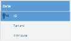

# 第 11 章数据访问

## 简介

问题：每个租户至少需要部分地拥有单独的数据甚至架构。

在多租户应用程序中访问数据时，有三种主要技术：

*   **单独的数据库**：每个租户的数据都保存在一个单独的数据库实例中，每个实例的连接字符串不同;多租户系统应自动选择适合当前租户的系统


图 35：单独的数据库

*   **单独的模式**：所有租户的数据都使用相同的数据库实例，但每个租户都有一个单独的模式;并非所有 RDBMS 都能正确支持这一点，例如，SQL Server 没有，但 Oracle 确实如此。当我说 SQL Server 不支持这个时，我并不是说它没有模式，只是它们没有像 Oracle 模式那样提供隔离机制，而且无法指定，每个查询或每个连接，默认情况下使用的架构。


图 36：单独的模式

*   **分区数据**：所有租户的数据保存在同一物理实例和模式中，分区列用于区分租户;由框架来发布适当的 SQL 查询以适当地过滤数据。



图 37：分区数据

|  | 注意：如果您有兴趣了解更多信息，[本文](http://www.codeproject.com/Tips/492342/Concept-mapping-between-SQL-Server-and-Oracle)介绍了 Oracle 和 SQL Server 之间关于模式的一些区别。 |

至于实际检索和更新关系数据库中的数据，存在两种主要方法：

*   使用 ADO.NET 或其周围的一些瘦包装器，如[企业库数据访问块](https://msdn.microsoft.com/en-us/library/dn440726(v=pandp.60).aspx)
*   使用对象关系映射器（ORM），例如 [NHibernate](http://nhibernate.info) 或[实体框架](http://entityframework.codeplex.com) （代码优先）

关于哪种方法更好的讨论超出了本书的范围，就个人而言，这对我来说毫无意义：两者都有利有弊。但是，ORM 提供了一些配置机制，允许根据某些条件自动过滤数据，例如租户的名称。因此，我们将讨论如何使用 ORMs NHibernate 和 Entity Framework Code First 进行多租户数据访问，我们将省略基于 SQL 的解决方案。

### NHibernate

#### 不同的数据库

在 NHibernate 架构中，连接字符串与**会话工厂**相关联。它是构建**会话**的会话工厂，后者又封装了 ADO.NET **连接**。一般来说，拥有一个会议工厂是一种好习惯。在我们的例子中，我们将需要每个租户一个（和连接字符串）。

为了使会话工厂可被发现，我们将使用我们在本书前面使用的相同机制，即公共服务定位器。每个租户在其名称下都有自己的 ISessionFactory 注册，每个会话工厂将指向一个同名的连接字符串。考虑以下引导代码，再次使用 Unity 作为控制反转（IoC）框架：

代码示例 133

```
protected void Application_BeginRequest()
{
      var tenant = TenantsConfiguration.GetCurrentTenant().Name;
      var sessionFactory = ServiceLocator.Current
            .TryResolve<ISessionFactory>(tenant);
      if (sessionFactory == null)
      {
            this.SetupSessionFactory(tenant);
      }
}

private void SetupSessionFactory(String tenant)
{
      var cfg = new Configuration().DataBaseIntegration(x =>
            {
                  x.ConnectionStringName = tenant;
                  //rest goes here
            });
      //etc
      //get the Unity instance from the Common Service Locator – another option would be to encapsulate this in some class or to use a custom connection provider
      var unity = ServiceLocator.Current.GetInstance<IUnityContainer>();
      unity.RegisterInstance<ISessionFactory>(tenant,cfg.BuildSessionFactory());
}

```

这就是它的作用：当收到请求时，它从中获取租户名称，并检查公共服务定位器中是否已经在该名称下注册了会话工厂。如果没有，它将开始为当前租户构建和注册会话工厂的过程。

此代码可以作为 [HttpApplication](https://msdn.microsoft.com/en-us/library/system.web.httpapplication.aspx) 派生类的实例方法放在 **Global.asax.cs** 文件中，也可以放在模块中，实现 [IHttpModule 的类](https://msdn.microsoft.com/en-us/library/system.web.ihttpmodule.aspx)。后者建议允许代码重用和更好的可维护性，但如果您要遵循此路径，则需要在 **Web.config** 文件的 [system.webServer 部分自行注册模块。 / modules](http://www.iis.net/configreference/system.webserver/modules) ：

代码示例 134

```
<system.webServer>
      <modules>
            <add name="MyModule" type="MyNamespace.MyModule, MyAssembly"/>
      </modules>
</system.webServer>

```

因此，每当您希望打开会话时，首先需要为当前租户检索适当的会话工厂：

代码示例 135

```
var tenant = TenantsConfiguration.GetCurrentTenant().Name;
//lookup the session factory for the current tenant
var sessionFactory = ServiceLocator.Current.GetInstance<ISessionFactory>(tenant);
using (var session = sessionFactory.OpenSession())
{
      //...
}

```

|  | 注意：如果您想了解有关 NHibernate 架构的更多信息，我建议您在 Succinctly 系列中阅读 [NHibernate Succinctly](http://www.syncfusion.com/resources/techportal/ebooks/nhibernate) 。 |

#### 不同的架构

NHibernate 和映射的问题在于，通常我们只有一个会话工厂和一个来自它的配置实例。因为它是包含映射的配置实例，然后传递到会话工厂，最后传递到从它生成的会话，我们需要有不同的配置实例，每个租户一个。

以下是我们如何为当前租户配置架构：

代码示例 136

```
public class MyMultitenantEntityClassMapping : ClassMapping<MyMultiTenanEntity>
{
      public MyMultitenantEntityClassMapping()
      {
            var tenant = TenantsConfiguration.GetCurrentTenant().Name;
            this.Schema(tenant);
            //rest goes here
      }
}

```

或者，我们可以通过约定来实现：

代码示例 137

```
var mapper = new ConventionModelMapper();
var tenant = TenantsConfiguration.GetCurrentTenant().Name;
mapper.BeforeMapClass += (modelInspector, type, classCustomizer) =>
{
      classCustomizer.Schema(tenant);
};

```

|  | 提示：不要忘记模式名称不能包含所有字符，通常只允许使用字母数字字符 - 因此您可能需要对租户名称进行一些转换。 |

#### 数据分区

NHibernate 有一个很好的功能，名称为 **filter** ，可用于在实体级别定义任意 SQL 限制。可以启用或禁用过滤器，并且可以获取运行时参数，这些参数与租户名称非常相似。例如，假设我们的表有一个**租户**列，它保留了它所引用的租户的名称。我们会添加“tenant ='abc.com'”的 SQL 限制，但我们不能对租户名称进行硬编码;我们使用参数代替。过滤器在实体的映射中定义。以下是使用代码映射的示例：

代码示例 138

```
public class MyMultitenantEntityClassMapping : ClassMapping<MyMultitenantEntity>
{
      public MyMultitenantEntityClassMapping()
      {
            this.Filter("tenant", filter =>
            {
                  filter.Condition("tenant = :tenant");
            });
            //rest goes here
      }
}

```

注意**“** 租户=：租户”部分;这是伪装的 SQL 限制，其中租户是列的名称，：租户是一个命名参数，恰好具有相同的名称。我省略了映射的大部分内容，因为只有过滤部分与我们的讨论相关。应在所有租户感知实体的所有映射中重复类似的代码，当然，应指定正确的列名。

这是使用传统映射器的另一个示例：

代码示例 139

```
var mapper = new ConventionModelMapper();
var tenant = TenantsConfiguration.GetCurrentTenant().Name;
mapper.BeforeMapClass += (modelInspector, type, classCustomizer) =>
{
      classCustomizer.Filter("tenant", filter =>
      {
            filter.Condition("tenant = :tenant");
      });
};

```

现在，每当我们打开一个新会话时，我们需要启用租户过滤器并为其租户参数赋值：

代码示例 140

```
var tenant = TenantsConfiguration.GetCurrentTenant().Name;
session
      .EnableFilter("tenant")
      .SetParameter("tenant", tenant);

```

除非明确更改，否则限制和参数值将持续会话的整个生命周期。您可以看到我正在使用第 3 章中定义的静态辅助方法 GetCurrentTenant 。现在，每当您查询 MyMultitenantEntity 类时，过滤器 SQL 都将附加到生成的 SQL，参数已正确替换为其实际值。

#### 通用存储库

为了让开发人员的工作更轻松，我们可以在[存储库模式](http://martinfowler.com/eaaCatalog/repository.html)（或**通用存储库**）外观后面封装会话的创建和过滤器的配置。这种模式规定数据访问隐藏在方法和集合之后，这些方法和集合抽象数据库操作并使它们看起来就像内存中一样。

|  | 注意：我不会讨论 Repository / Generic Repository Pattern 是否是好事。我个人理解它的缺点，但我认为它在某些情况下很有用，比如这个。 |

Generic Repository 接口的可能定义是：

代码示例 141

```
public interface IRepository : IDisposable
{
      T Find<T>(Object id);
      IQueryable<T> All<T>(params Expression<Func<T, Object>> [] expansions);
      void Delete(Object item);
      void Save(Object item);
      void Update(Object item);
      void Refresh(Object item);
      void SaveChanges();
}

```

读者应该熟悉大多数方法。我们不会深入介绍这个界面;相反，让我们继续讨论 NHibernate 的可能实现：

代码示例 142

```
public sealed class SessionRepository : IRepository
{
      private ISession session;

      public SessionRepository()
      {
            var tenant = TenantsConfiguration.GetCurrentTenant().Name;
            //lookup the one and only session factory
            var sessionFactory = ServiceLocator.Current
                  .GetInstance<ISessionFactory>();
            this.session = sessionFactory.OpenSession();
            //enable the filter with the current tenant
            this.session.EnableFilter("tenant")
                  .SetParameter("tenant", tenant);
            this.session.BeginTransaction();
      }

      public T Find<T>(params Object[] ids) where T : class
      {
            return this.session.Get<T>(ids.Single());
      }

      public IQueryable<T> Query<T>(params 
            Expression<Func<T, Object>>[] expansions) where T : class
      {
            var all = this.session.Query<T>() as IQueryable<T>;
            foreach (var expansion in expansions)
            {
                  all = all.Include(expansion);
            }          
            return all;
      }

      public void Delete<T>(T item) where T : class
      {
            this.session.Delete(item);
      }

      public void Save<T>(T item) where T : class
      {
            this.session.Save(item);
      }

      public void Update<T>(T item) where T : class
      {
            this.session.Update(item);
      }

      public void Refresh<T>(T item) where T : class
      {
            this.session.Refresh(item);
      }

      public void Detach<T>(T item) where T : class
      {
            this.session.Evict(item);
      }

      public void SaveChanges()
      {
            this.session.Flush();
            try
            {
                  this.session.Transaction.Commit();
            }
            catch
            {
                  this.session.Transaction.Rollback();
            }          
            this.session.BeginTransaction();
      }

      public void Dispose()
      {
            if (this.context != null)
            {
                  this.session.Dispose();
                  this.session = null;
            }
      }
}

```

请记住，现在只有一个会话工厂，因为还有一个数据库。现在，我们所要做的就是将 IRepository 接口注册到我们的 Io​​C 框架，并始终通过 Common Service Locator 访问它：

代码示例 143

```
//register our implementation under the IRepository interface
unity.RegisterType<IRepository, SessionRepository>(
      new PerRequestLifetimeManager());
//get a reference to a new instance
using (var repository = ServiceLocator.Current.GetInstance<IRepository>())
{
      //query some entity
      var items = repository.All<MyEntity>().ToList();
}

```

|  | 提示：必须始终执行启用过滤器和设置租户参数的过程，因此要么确保使用存储库，要么自己执行初始化，如果可能，可能在某些基础结构代码中执行。 |

|  | 注意：我用于注册应用服务章节中提供的 PerRequestLifetimeManager。 |

### 实体框架代码优先

#### 不同的数据库

Entity Framework Code First 的体系结构与 NHibernate 的体系结构完全不同。例如，我们可以连接到的构建器方法可以返回具有自己的连接字符串的特定于租户的上下文。我们可以做的是构建我们自己的工厂方法，为当前租户返回一个正确的连接字符串：

代码示例 144

```
public class MultitenantContext : DbContext
{
      public MultitenantContext(): base(GetTenantConnection()) { }

      private static String GetTenantConnection()
      {
            var tenant = TenantsConfiguration.GetCurrentTenant();
            return String.Format("Name={0}", tenant.Name);
      }

      //rest goes here
}

```

重要的是，不允许使用任意连接字符串创建上下文，因为这会通过单独的数据库破坏透明多租户的目的。

#### 不同的架构

使用 Code First，将我们自己的约定应用于模型非常容易：

代码示例 145

```
protected override void OnModelCreating(DbModelBuilder modelBuilder)
{
      var tenant = TenantsConfiguration.GetCurrentTenant();
      //repeat for all multitenant entities   
      modelBuilder.Types().Configure(x => x.ToTable(x.ClrType.Name, tenant.Name);
      //rest goes here
      base.OnModelCreating(modelBuilder);
}

```

|  | 提示：确保架构名称有效。 |

#### 数据分区

即使不那么强大，Entity Framework Code First 也允许我们使用鉴别器列和值映射实体。这基本上用于允许[表每类层次结构](http://www.martinfowler.com/eaaCatalog/singleTableInheritance.html) / [单表继承](http://www.martinfowler.com/eaaCatalog/singleTableInheritance.html)策略，其中此列用于告知记录映射到哪个实体，在表中由类的层次结构共享。实现此配置的唯一开箱即用方法是覆盖 [OnModelCreating](https://msdn.microsoft.com/en-us/library/system.data.entity.dbcontext.onmodelcreating.aspx) 方法并指定鉴别器列和值：

代码示例 146

```
protected override void OnModelCreating(DbModelBuilder modelBuilder)
{
      var tenant = TenantsConfiguration.GetCurrentTenant();
      //repeat for all multitenant entities   
      modelBuilder.Entity<MyMultitenantEntity>().Map(m => m.Requires("Tenant")
            .HasValue(tenant.Name));
      //rest goes here
      base.OnModelCreating(modelBuilder);
}

```

这告诉实体框架，每当创建 [DbContext](https://msdn.microsoft.com/en-us/library/system.data.entity.dbcontext.aspx) 时，应该映射某些实体，以便无论何时插入或检索它们，实体框架将始终考虑具有值的 Tenant 鉴别器列与当前租户相同，自动完成。

|  | 注意：再次，为了更深入地了解实体框架代码优先，我建议首先简明地阅读[实体框架代码](http://www.syncfusion.com/resources/techportal/ebooks/entityframework)，同样在简洁系列中。 |

#### 通用存储库

对于更安全的解决方案，以下是实体框架代码优先数据上下文的通用存储库模式的实现可能是：

代码示例 147

```
public sealed class MultitenantContextRepository : IRepository
{
      private MultitenantContext context;

      public MultitenantContextRepository()
      {
            //if you use the code from the previous example, this is not necessary, it is done there
            var tenant = TenantsConfiguration.GetCurrentTenant();
            //set the connection string name from the current tenant
            this.context = new          
                  MultitenantContext(String.Format("Name={0}", 
                        tenant.Name));
      }

      public T Find<T>(params Object[] ids) where T : class
      {
            return this.context.Set<T>().Find(ids);
      }

      public IQueryable<T> Query<T>(params 
            Expression<Func<T, Object>>[] expansions) where T : class
      {
            var all = this.context.Set<T>() as IQueryable<T>;
            foreach (var expansion in expansions)
            {
                  all = all.Include(expansion);
            }
            return all;
      }

      public void Delete<T>(T item) where T : class
      {
            this.context.Set<T>().Remove(item);
      }

      public void Save<T>(T item) where T : class
      {
            this.context.Set<T>().Add(item);
      }

      public void Update<T>(T item) where T : class
      {
            this.context.Entry(item).State = EntityState.Modified;
      }

      public void Refresh<T>(T item) where T : class
      {
            this.context.Entry(item).Reload();
      }

      public void Detach<T>(T item) where T : class
      {
            this.context.Entry(item).State = EntityState.Detached;
      }

      public void SaveChanges()
      {
            this.context.SaveChanges();
      }

      public void Dispose()
      {
            if (this.context != null)
            {
                  this.context.Dispose();
                  this.context = null;
            }
      }
}

```

我觉得很简单。只需将它存储在 Unity（或您选择的任何 IoC 容器）中，您就完成了：

代码示例 148

```
//register our implementation with Unity under the IRepository interface
unity.RegisterType<IRepository, MultitenantContextRepository>(
      new PerRequestLifetimeManager());
//get a reference to a new instance using Common Service Locator
using (var repository = ServiceLocator.Current.GetInstance<IRepository>())
{
      //query some entity
      var items = repository.All<MyEntity>().ToList();
}

```

|  | 注意：再次注意 PerRequestLifetimeManager 生命周期管理器。 |