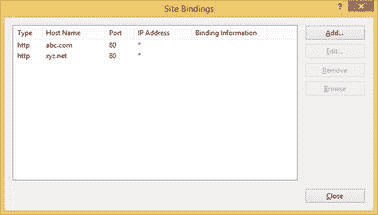
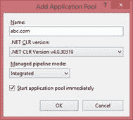

# 第 2 章设置

## 简介

本章将指导您设置开发和测试环境。

## Visual Studio

为了能够遵循此处描述的概念和代码，您将需要 Visual Studio 的工作安装; 2012 年以上的任何版本都可以，包括闪亮的新[社区版](http://www.visualstudio.com/en-us/products/visual-studio-community-vs.aspx)。我自己使用过 Visual Studio 2013，但您可以自由使用其他版本;基本上，你需要一个可以处理.NET 4.x 和 [NuGet](http://www.nuget.org) 软件包的 Visual Studio 版本。

## NuGet

[NuGet](http://www.nuget.org) 是 Visual Studio 的原生包装系统。大多数软件公司，包括微软，以及独立开发者和社区（如 [NHibernate 社区](http://nhibernate.info/)）都通过 NuGet 提供他们的库和框架。这是一种获取软件包及其依赖项的简便方法。

出于本书中示例的目的，您将需要以下包：

**OWIN 自我主持人**


**OWIN Web API**


**实体框架代码第一**


**NHibernate**


**Unity**


**ASP.NET MVC 的 Unity Bootstrapper**


**企业库记录应用程序块**


**ASP.NET 身份（实体框架）**


**ASP.NET 身份（NHibernate）**


**OWIN 身份**


**AspNet.Identity.EntityFramework.Multitenant**


**WatiN**


## 地址映射

如果要按照本书中介绍的示例进行操作，则需要为开发计算机设置不同的主机名。这样我们就可以使用第 3 章中描述的[主机头租户识别模式](../Text/aspn-multiapp-3.html#_Host_Header_Strategy)。如果您对提供本地连接（工作或家庭）的 DNS 服务器具有管理访问权限，则可以添加不同的别名到静态 IP 地址，然后使用该 IP 地址而不是使用 DHCP 分配的 IP 地址。

另一种选择是使用免费服务，如 [xip.io](http://xip.io) ，它将域 **xip.io** 中的主机名转换为 IP 地址;例如， **127.0.0.1.xip.io** 将自动转换为 **127.0.0.1** ， **192.168.1.1.xip.io** 变为 **192.168.1.1** ，等等。这样我们就可以使用该策略根据前面提到的主机头识别租户，但它只适用于 IP 地址，而不适用于主机名。

另一种选择是通过**% WINDIR% \ System32 \ Drivers \ Etc \ hosts** 文件配置静态 IP 名称映射。此文件包含以下格式的行：

代码示例 1

```
<IP address> <host name>  <alias 1>    …      <alias n>

```

例如，您可以添加以下条目：

代码示例 2

```
127.0.0.1    localhost    abc.com             xyz.net

```

这将告诉 Windows 上的 IP 堆栈，名为 **abc.com** 和 **xyz.net** 的主机都将转换为环回地址 **127.0.0.1** ，而不是需要 DNS 查找。

## IIS

在 **Internet 信息服务**（IIS）中设置多租户站点很简单：只需打开 **IIS 管理器**小程序并选择**站点**&gt; **添加网站**。然后添加您要处理的主机名：


图 2：在 IIS 中设置多租户站点

现在为所有其他租户添加主机名，选择站点，然后单击 **Bindings** 。


图 3：向站点添加其他主机名



图 4：所有站点的主机名

同样重要的是应用程序池：您可以为不同的租户（站点绑定）提供不同的应用程序池。这提供了更好的隔离，从某种意义上说，如果其中一个租户出现问题 - 可能是一个未处理的异常导致网站无法使用 - 它不会影响其他人。此外，您可以让应用程序池在不同的身份下运行，如果您希望访问不同的数据库或具有不同的访问级别，这是很好的。只需在 IIS 管理器中创建任意数量的应用程序池：



图 5：为租户创建应用程序池

## IIS Express

如果您将使用 **IIS Express** ，除 DNS 或**主机**文件外，您还需要配置网站的绑定以允许其他主机名。不幸的是，您必须手动完成，因为 IIS Express 不提供任何图形工具用于此目的;该站点的配置文件位于：**% HOMEPATH% \ Documents \ IISExpress \ Config \ ApplicationHost.config** 。打开它，找到您想要更改的站点条目;它应该如下所示（减去名称， id ， physicalPath 和 bindingInformation ）：

代码示例 3

```
<sites>
       <site name="Multitenant" id="1">                                 
              <application path="/" applicationPool="Clr4IntegratedAppPool">                         <virtualDirectory path="/" 
                           physicalPath="C:\InetPub\Multitenant" />
             </application>
             <bindings>
                    <binding protocol="http" bindingInformation="*:80:localhost" />
              </bindings>
       </site>
</sites>

```

您可能会看到已经配置了一些站点。在这种情况下，您必须找到您感兴趣的那个，可能通过 physicalPath 属性，并添加绑定元素和 bindingInformation 属性指向到正确的主机名和端口。

代码示例 4

```
<bindings>
      <binding protocol="http" bindingInformation="*:80:localhost" />
      <binding protocol="http" bindingInformation="*:80:abc.com" />
      <binding protocol="http" bindingInformation="*:80:xyz.net" />
</bindings>

```

这指示 IIS Express 还接受对主机 **abc.com** 和 **xyz.net** 以及 **localhost** 的请求。