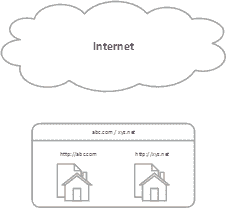
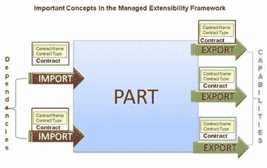
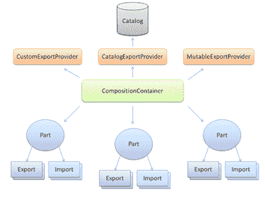

# 第 3 章概念

## 你想跟谁说话？

正如我们所看到的，多租户的主要前提是我们可以对不同的租户做出不同的反应。您可能已经问过自己：ASP.NET 如何知道它应该服务哪个租户的内容？也就是说，客户试图联系谁？ ASP.NET 如何找到？

这个问题可能有几个答案：

*   从请求的主机名;例如，如果浏览器尝试到达 **abc.com** 或 **xyz.net** ，请求 URL 中所述
*   来自查询字符串参数，如 **http://host.com?tenant=abc.com**
*   来自始发（客户端）主机 IP 地址
*   来自原始客户端的域名

可能最典型（和有用）的用例是第一个;您有一个单独的 Web 服务器（或服务器场），它分配了多个 DNS 记录（ [A](http://en.wikipedia.org/wiki/List_of_DNS_record_types) 或 [CNAME](http://en.wikipedia.org/wiki/List_of_DNS_record_types) ），它将根据其达到的方式做出不同的响应，比如说， **abc.com** 和 **xyz.net** 。作为开发人员，让我们尝试定义一个可以给出这个问题答案的通用契约。请考虑以下方法签名：

代码示例 5

```
String GetCurrentTenant(RequestContext context)

```

我们可以将其解释为：“给定一些请求，给我相应租户的名字。”

|  | 注意：如果您想知道 DNS A 和 CNAME 记录之间的区别，可以在找到一个很好的解释[。](http://www.differencebetween.net/technology/internet/difference-between-cname-and-a-record/) |

[RequestContext](http://msdn.microsoft.com/en-us/library/system.web.routing.requestcontext%28v=vs.110%29.aspx) 类是 [System.Web.Routing](http://msdn.microsoft.com/en-us/library/system.web.routing(v=vs.110).aspx) 命名空间的一部分，它封装了所有请求的属性和上下文。它的 [HttpContext](http://msdn.microsoft.com/en-us/library/system.web.routing.requestcontext.httpcontext(v=vs.110).aspx) 属性允许轻松访问常见的 HTTP 请求 URL，服务器变量，查询字符串参数，cookie 和标题以及 [RouteData](http://msdn.microsoft.com/en-us/library/system.web.routing.requestcontext.routedata(v=vs.110).aspx) 路由信息（如果有）。我为请求选择了这个类而不是更明显的那个 - [HttpContext](http://msdn.microsoft.com/en-us/library/system.web.httpcontext%28v=vs.110%29.aspx) 和 [HttpContextBase](http://msdn.microsoft.com/en-us/library/system.web.httpcontextbase%28v=vs.110%29.aspx) - 因为它简化了访问路由数据，以防我们需要它。

|  | 注意： [HttpContextBase](http://msdn.microsoft.com/en-us/library/system.web.httpcontextbase%28v=vs.110%29.aspx) 是在.NET 3.5 中引入的，允许轻松进行模拟，因为它不是封闭的，而且在 ASP.NET 管道之外。它基本上模仿 [HttpContext](http://msdn.microsoft.com/en-us/library/system.web.httpcontext%28v=vs.110%29.aspx) 的属性和行为，这是密封的。 |

至于返回类型，它将是租户的名称。稍后会详细介绍。

在.NET 世界中，如果我们要重用这样的方法签名，我们有两个主要选项：

*   定义方法委托
*   定义接口或抽象基类

在我们的例子中，我们将使用接口，输入 ITenantIdentifierStrategy ：

代码示例 6

```
public interface ITenantIdentifierStrategy
{
      String GetCurrentTenant(RequestContext context);
}

```

### 主机头策略



图 6：主机头策略

使用请求的主机名（[主机 HTTP 标头](http://www.w3.org/Protocols/rfc2616/rfc2616-sec14.html#sec14.23)）作为租户标识符的 ITenantIdentifierStrategy 的简单实现可能是您在面向公众的站点中更常使用的那个。具有单个 IP 地址和多个主机名和域名的单个服务器将在 HTTP 请求中通过请求的主机区分租户：

表 1：HTTP 主机头与租户的映射

| HTTP 请求标头 | 承租人 |
| GET /Default.aspx HTTP / 1.1 主持人：abc.com | abc.com |
| GET /Default.aspx HTTP / 1.1 主持人：xyz.net | xyz.net |

|  | 注意：有关 Host HTTP 标头的更多信息，[请参阅 RFC 2616，HTTP 标头字段定义](http://www.w3.org/Protocols/rfc2616/rfc2616-sec14.html#sec14.23)。 |

使用主机头作为租户名称的类可能如下所示：

代码示例 7

```
public class HostHeaderTenantIdentifierStrategy : ITenantIdentifierStrategy
{
      public String GetCurrentTenant(RequestContext context)
      {
            return context.HttpContext.Request.Url.Host.ToLower();
      }
}

```

|  | 提示：此代码仅用于演示目的;它没有任何类型的验证，只返回小写的请求主机名。现实代码应该稍微复杂一些。 |

### 查询字符串策略


图 7：查询字符串策略

我们可能希望使用查询字符串参数来区分租户，例如 **host.com?tenant=abc.com** ：

表 2：HTTP 查询字符串到租户的映射

| HTTP 请求 URL | 承租人 |
| http://host.com?Tenant=abc.com | abc.com |
| http://host.com?Tenant=xyz.net | xyz.net |

这种策略使得与不同租户一起测试变得非常容易;无需配置任何内容 - 只需在 URL 中传递查询字符串参数即可。

我们可以使用类似下面的类，它选择 Tenant 查询字符串参数并将其指定为租户名称：

```
public class QueryStringTenantIdentifierStrategy : ITenantIdentifierStrategy
{
      public String GetCurrentTenant(RequestContext context)
      {
            return (context.HttpContext.Request.QueryString["Tenant"] ??                    String.Empty).ToLower();
      }
}

```

|  | 提示：即使这种技术最初看起来很有趣，但它确实不适合现实场景。只需考虑对于所有内部链接和回发，您必须确保添加租户查询字符串参数;如果由于某种原因它丢失了，你就会从理想的租户中退出。 |

|  | 注意：此模式的变体可以使用 HTTP 变量 PATH_INFO 而不是 QUERY_STRING ，但这会产生影响，即使用 MVC。 |

### 源 IP 地址策略


图 8：源 IP 策略

现在假设我们想要从原始请求的 IP 地址确定租户的名称。假设位于 **200.200.200.0/24** 的网络的用户将被分配租户 **abc.com** ，另一个使用静态 IP **160.160.160.160** ] **xyz.net** 。它变得有点棘手，因为我们需要手动注册这些分配，我们需要做一些数学运算来确定请求是否与注册的网络地址列表相匹配。

我们有两种方法可以将网络地址与租户名称相关联：

*   我们使用单个 IP 地址
*   我们使用 IP 网络和子网掩码。

比方说，例如：

表 3：源 IP 地址到租户的映射

| **来源网络/ IP** | **租客** |
| 200.200.200.0/24（200.200.200.1-200.200.200.254） | abc.com |
| 160.160.160.1 | xyz.net |

.NET 基类库没有为 IP 网络地址操作提供开箱即用的 API，因此我们必须构建自己的 API。请考虑以下帮助方法：

代码示例 8

```
public static class SubnetMask
{
      public static IPAddress CreateByHostBitLength(Int32 hostPartLength)
      {
            var binaryMask = new Byte[4];
            var netPartLength = 32 - hostPartLength;
            if (netPartLength < 2)
            {
                  throw new ArgumentException
                         ("Number of hosts is too large for IPv4.");
            }
            for (var i = 0; i < 4; i++)
            {
                  if (i * 8 + 8 <= netPartLength)
                  {
                        binaryMask[i] = (Byte) 255;
                  }
                  else if (i * 8 > netPartLength)
                  {
                        binaryMask[i] = (Byte) 0;
                  }
                  else
                  {
                        var oneLength = netPartLength - i * 8;
                        var binaryDigit = String.Empty
                             .PadLeft(oneLength, '1').PadRight(8, '0');
                        binaryMask[i] = Convert.ToByte(binaryDigit, 2);
                  }
            }
            return new IPAddress(binaryMask);
      }

      public static IPAddress CreateByNetBitLength(Int32 netPartLength)
      {
            var hostPartLength = 32 - netPartLength;
            return CreateByHostBitLength(hostPartLength);
      }

      public static IPAddress CreateByHostNumber(Int32 numberOfHosts)
      {
            var maxNumber = numberOfHosts + 1;
            var b = Convert.ToString(maxNumber, 2);
            return CreateByHostBitLength(b.Length);
      }
}

public static class IPAddressExtensions
{
      public static IPAddress[] ParseIPAddressAndSubnetMask(String ipAddress)
      {
            var ipParts = ipAddress.Split('/');
            var parts = new IPAddress[] { ParseIPAddress(ipParts[0]), 
                  ParseSubnetMask(ipParts[1]) };
            return parts;
      }

      public static IPAddress ParseIPAddress(String ipAddress)
      {
            return IPAddress.Parse(ipAddress.Split('/').First());
      }

      public static IPAddress ParseSubnetMask(String ipAddress)
      {
            var subnetMask = ipAddress.Split('/').Last();
            var subnetMaskNumber = 0;
            if (!Int32.TryParse(subnetMask, out subnetMaskNumber))
            {
                  return IPAddress.Parse(subnetMask);
            }
            else                   
            {
                  return SubnetMask.CreateByNetBitLength(subnetMaskNumber);
            }
      }

      public static IPAddress GetBroadcastAddress(this IPAddress address, 
            IPAddress subnetMask)
      {
            var ipAdressBytes = address.GetAddressBytes();
            var subnetMaskBytes = subnetMask.GetAddressBytes();
            if (ipAdressBytes.Length != subnetMaskBytes.Length)
            {
                  throw new ArgumentException
                  ("Lengths of IP address and subnet mask do not match.");
            }
            var broadcastAddress = new Byte[ipAdressBytes.Length];
            for (var i = 0; i < broadcastAddress.Length; i++)
            {
                  broadcastAddress[i] = (Byte)(ipAdressBytes[i] | 
                         (subnetMaskBytes[i] ^ 255));
            }
            return new IPAddress(broadcastAddress);
      }

      public static IPAddress GetNetworkAddress(this IPAddress address, 
            IPAddress subnetMask)
      {
            var ipAdressBytes = address.GetAddressBytes();
            var subnetMaskBytes = subnetMask.GetAddressBytes();
            if (ipAdressBytes.Length != subnetMaskBytes.Length)
            {
                  throw new ArgumentException
                  ("Lengths of IP address and subnet mask do not match.");
            }
            var broadcastAddress = new Byte[ipAdressBytes.Length];
            for (var i = 0; i < broadcastAddress.Length; i++)
            {
                  broadcastAddress[i] = (Byte)(ipAdressBytes[i] 
                        & (subnetMaskBytes[i]));
            }
            return new IPAddress(broadcastAddress);
      }

      public static Boolean IsInSameSubnet(this IPAddress address2, 
            IPAddress address, Int32 hostPartLength)
      {
            return IsInSameSubnet(address2, address, SubnetMask
                  .CreateByHostBitLength(hostPartLength));
      }    

      public static Boolean IsInSameSubnet(this IPAddress address2, 
            IPAddress address, IPAddress subnetMask)
      {
            var network1 = address.GetNetworkAddress(subnetMask);
            var network2 = address2.GetNetworkAddress(subnetMask);
            return network1.Equals(network2);
      }
}

```

|  | 注意：此代码基于公共代码[此处](http://blogs.msdn.com/b/knom/archive/2008/12/31/ip-address-calculations-with-c-subnetmasks-networks.aspx)（稍作修改）。 |

现在我们可以编写 ITenantIdentifierStrategy 的实现，它允许我们将 IP 地址映射到租户名称：

代码示例 9

```
public class SourceIPTenantIdentifierStrategy : ITenantIdentifierStrategy
{
      private readonly Dictionary<Tuple<IPAddress, IPAddress>, String> networks = new Dictionary<Tuple<IPAddress, IPAddress>, String>();

      public IPTenantIdentifierStrategy Add(IPAddress ipAddress, 
            Int32 netmaskBits, String name)
      {
            return this.Add(ipAddress, SubnetMask.CreateByNetBitLength(
                  netmaskBits), name);
      }

      public IPTenantIdentifierStrategy Add(IPAddress ipAddress, 
            IPAddress netmaskAddress, String name)
      {
            this.networks
[new Tuple<IPAddress, IPAddress>(ipAddress, netmaskAddress)] = name.ToLower();
            return this;
      }
            public IPTenantIdentifierStrategy Add(IPAddress ipAddress, String name)
      {
            return this.Add(ipAddress, null, name);
      }

      public String GetCurrentTenant(RequestContext context)
      {
            var ip = IPAddress.Parse(context.HttpContext.Request
                  .UserHostAddress);
            foreach (var entry in this.networks)
            {
                  if (entry.Key.Item2 == null)
                  {
                        if (ip.Equals(entry.Key.Item1))
                        {
                             return entry.Value.ToLower();
                        }
                  }
                  else
                  {
                        if (ip.IsInSameSubnet(entry.Key.Item1,
                             entry.Key.Item2))
                        {
                             return entry.Value;
                        }
                  }
            }
            return null;
      }
}

```

请注意，此类不是线程安全的;如果你想这样做，一种可能性就是使用[`ConcurrentDictionary<TKey, TValue>`](http://msdn.microsoft.com/en-us/library/dd287191%28v=vs.110%29.aspx) 而不是普通的[`Dictionary<TKey, TValue>`](http://msdn.microsoft.com/en-us/library/xfhwa508%28v=vs.110%29.aspx) 。

在我们使用 **IPTenantIdentifierStrategy** 之前，我们需要注册一些映射：

代码示例 10

```
var s = new SourceIPTenantIdentifierStrategy();
s.Add(IPAddress.Parse("200.200.200.0", 24), "abc.com");
s.Add(IPAddress.Parse("160.160.160.1"), "xyz.net");

```

在此示例中，我们看到租户 **xyz.net** 映射到单个 IP 地址 **160.160.160.1** ，而租户 **abc.com** 映射到网络 **200.200.200.0** 的 **24** 位网络掩码，意味着所有主机范围从 **200.200.200.1** 到 **200.200.200.254** 将是包括在内。

### 源域策略


图 9：源域策略

我们可能不知道 IP 地址，而是域名;因此，基于客户端域名的策略按顺序排列。我们希望从请求主机的域名部分获取租户的名称，例如：

表 4：将源域名映射到租户

| 源域 | 承租人 |
| * .some.domain | abc.com |
| * .xyz.net | xyz.net |

子域名也应包括在内。以下是这种策略的可能实现：

代码示例 11

```
public class SourceDomainTenantIdentifierStrategy : ITenantIdentifierStrategy
{
      private readonly Dictionary<String, String> domains = new 
Dictionary<String, String>(StringComparer.OrdinalIgnoreCase);
            public DomainTenantIdentifierStrategy Add(String domain, String name)
      {
            this.domains[domain] = name;
            return this;
      }

      public DomainTenantIdentifierStrategy Add(String domain)
      {
            return this.Add(domain, domain);
      }

      public String GetCurrentTenant(RequestContext context)
      {
            var hostName = context.HttpContext.Request.UserHostName;
            var domainName = String.Join(".", hostName.Split('.')
                  .Skip(1)).ToLower();
            return this.domains.Where(domain => domain.Key == domainName)
                  .Select(domain => domain.Value).FirstOrDefault();
            }
}

```

对于 **DomainTenantIdentifierStrategy** ，当然我们还需要输入一些映射：

代码示例 12

```
var s = new SourceDomainTenantIdentifierStrategy();
s.Add("some.domain", "abc.com");
s.Add("xyz.net");

```

第一个条目将来自 **some.domain** 域（或子域）的所有客户端请求映射到名为 **abc.com** 的租户。第二个对 **xyz.net** 域执行相同的操作，我们跳过租户的名称，因为它应该与域名相同。

正如您所看到的，先前策略的两个实现 - 主机头和查询字符串参数 - 基本上是无状态和不可变的，因此我们不是每次都创建新实例，而是在一个众所周知的位置拥有每个实例的静态实例。让我们为此目的创建一个结构：

代码示例 13

```
public static class TenantsConfiguration
{
      public static class Identifiers
      {
            public static readonly HostHeaderTenantIdentifierStrategy 
                  HostHeader = new HostHeaderTenantIdentifierStrategy();
            public static readonly QueryStringTenantIdentifierStrategy 
                  QueryString = new QueryStringTenantIdentifierStrategy();
      }

```

|  | 提示：请注意 DefaultTenant 属性。如果租户识别策略无法将请求映射到租户，将使用此功能。 |

另外两个策略 - 按源 IP 地址和域名需要配置，所以我们不应该将它们作为常量实例，但为了便于查找，让我们在 TenantsConfiguration 类中添加一些静态工厂刚才介绍：

代码示例 14

```
public static class TenantsConfiguration
{
      //rest goes here 
      public static class Identifiers
      {
            //rest goes here 
            public static SourceDomainTenantIdentifierStrategy SourceDomain()
            {
                  return new SourceDomainTenantIdentifierStrategy();
            }

            public static SourceIPTenantIdentifierStrategy SourceIP()
            {
                  return new SourceIPTenantIdentifierStrategy();
            }
      }
}

```

|  | 注意：在第 9 章“全部放在一起”中，我们将看到所有这些策略是如何相关的。 |

### 获取当前租户

我们已经考虑了从请求中获取租户名称的一些策略;现在，我们必须选择一个，并将其存储在可以轻松找到的地方。

#### 静态属性

一种选择是将其存储为 TenantsConfiguration 类中的静态属性：

代码示例 15

```
public static class TenantsConfiguration
{
       public static ITenantIdentifierStrategy TenantIdentifier { get; set; }
       //rest goes here   
}

```

现在，我们可以选择我们想要的任何策略，可能从 TenantsConfiguration 的静态成员中选择一个。此外，我们需要设置 DefaultTenant 属性，这样如果当前策略无法识别要使用的租户，我们会有一个后备：

代码示例 16

```
TenantsConfiguration.TenantIdentifier = TenantsConfiguration.Identifiers.HostHeader;
TenantsConfiguration.DefaultTenant = "abc.com";

```

#### Unity 和公共服务定位器

另一种选择是使用[控制反转](http://en.wikipedia.org/wiki/Inversion_of_control)（IoC）框架来存储对我们选择的租户标识符实例的单例引用。更好的是，我们可以使用[通用服务定位器](https://commonservicelocator.codeplex.com/)来抽象出我们正在使用的 IoC。这样，我们就不依赖于特定的实现，甚至可以在不影响代码的情况下更改要使用的实现（当然，除了一些引导代码）。 .NET 框架有几个 IoC 容器。接下来，我们将看到一个使用着名的 IoC 框架的示例， [Microsoft Unity](http://unity.codeplex.com) ，Microsoft 的[企业库](http://entlib.codeplex.com)的一部分。

代码示例 17

```
//set up Unity
var unity = new UnityContainer();
//register instances
unity.RegisterInstance<ITenantIdentifierStrategy>(TenantsConfiguration.Identifiers.HostHeader);
unity.RegisterInstance<String>("DefaultTenant", "abc.com");
//set up Common Service Locator with the Unity instance
ServiceLocator.SetLocatorProvider(() => new UnityServiceLocator(unity));
//resolve the tenant identifier strategy and the default tenant
var identifier = ServiceLocator.Current.GetInstance<ITenantIdentifierStrategy>();
var defaultTenant = ServiceLocator.Current.GetInstance<String>("DefaultTenant");

```

这种方法的优点是我们可以通过代码（或通过 **Web.config** 文件）动态注册新策略，而无需更改任何代码，我们是否需要这样做。我们将在整本书中使用这种方法。第 9 章“应用程序服务”的服务定位器部分还讨论了 Unity 以及如何使用它来返回特定于当前租户的组件。

|  | 注意：Unity 只是数十个 IoC 容器中的一个，提供类似的功能以及更具体的功能。并非所有公共服务定位器都具有适配器，但通常很容易实现。有关 IoC，Common Service Locator 和 Unity 的更深入讨论，请参见 [Microsoft Unity 简洁](https://www.syncfusion.com/resources/techportal/ebooks/microsoftunity) 。 |

### 名称中有什么？

既然我们有一个抽象可以给我们一个租户的**名称**，让我们想一下租户需要什么。

我们可能还需要一个**主题**，它可以聚合颜色方案和字体等内容。不同的租户可能想要不同的外观。

在 ASP.NET 世界中，两个主要框架 MVC 和 Web 窗体提供了母版页或布局页面的概念（在 MVC 术语中），用于定义 HTML 页面的全局布局。有了这个，很容易在整个站点中实施一致的布局，所以，让我们考虑一个**母版页**（或 MVC 术语中的布局页面）属性。

无论是否具有更高级的配置功能，都不​​会有一组特定于租户的键/值对，因此我们现在有一个通用的**属性包**。

Windows 提供了一种通用的，操作系统支持的监视应用程序的机制：[性能计数器](https://technet.microsoft.com/en-us/library/cc749154.aspx)。性能计数器允许我们实时监控应用程序的某些方面，甚至自动对条件做出反应。我们将公开一个**计数器实例**的集合，以便与租户自动创建。

提供通用扩展机制可能是有用的;在 IoC 开始流行之前，.NET 已经包含了一个通用接口，用于以 [IServiceProvider](https://msdn.microsoft.com/en-us/library/system.iserviceprovider.aspx) 接口的形式解析某个类型的组件。我们还考虑使用此接口的**服务分辨率**机制。

最后，让租户**在我们的框架注册时初始化**是有意义的。这不是数据，而是行为。

因此，根据我们所讨论的内容，我们的租户定义界面 ITenantConfiguration 将如下所示：

代码示例 18

```
public interface ITenantConfiguration
{
      String Name { get; }
      String Theme { get; }
      String MasterPage { get; }
      IServiceProvider ServiceProvider { get; }
      IDictionary<String, Object> Properties { get; }
      IEnumerable<String> Counters { get; }
      void Initialize();
}

```

例如，名为 xyz.net 的租户可能具有以下配置：

代码示例 19

```
public sealed class XyzNetTenantConfiguration : ITenantConfiguration
{
            public XyzNetTenantConfiguration()
      {
            //do something productive
            this.Properties = new Dictionary<String, Object>();
            this.Counters = new List<String> { "C", "D", "E" };
      }

      public void Initialize()
      {
            //do something productive
      }

      public String Name { get { return "xyz.net"; } }
      public String MasterPage { get { return this.Name; } }
      public String Theme { get { return this.Name; }      }
      public IServiceProvider ServiceProvider { get; private set; }
      public IDictionary<String, Object> Properties { get; private set; }
      public IEnumerable<String> Counters { get; private set; }
}

```

在这个例子中，我们返回的 MasterPage 和主题与租户的名称相同，并且没有返回中真正有用的任何内容计数器，属性和 ServiceProvider 属性，但在现实生活中，您可能会做其他事情。您返回的任何计数器名称将自动创建为数字性能计数器实例。

|  | 注意：提供此类信息还有很多其他选项，例如属性。 |

## 寻找租户

### 租户位置策略

什么是没有人居住的房子？

现在，我们必须找出寻找租户的策略。我想到了两种基本方法：

*   明确手动配置单个租户
*   自动查找和注册租户

再次，让我们在一个漂亮的界面中抽象出这个功能， ITenantLocationStrategy ：

代码示例 20

```
public interface ITenantLocationStrategy
{
      IDictionary<String, Type> GetTenants();
}

```

此接口返回**名称**和**类型**的集合，其中**类型**是实现 ITenantConfiguration 的一些非抽象类的实例， **名称**是唯一的租户标识符。

我们还将在 TenantsConfiguration ， DefaultTenant 中保留静态属性，我们可以存储默认租户的名称，如果无法自动识别，则作为后备：

代码示例 21

```
public static class TenantsConfiguration
{
      public static String DefaultTenant { get; set; }
      //rest goes here 
}

```

以下是查找和识别租户的策略：

代码示例 22

```
public static class TenantsConfiguration
{
      public static String DefaultTenant { get; set; }
      public static ITenantIdentifierStrategy TenantIdentifier { get; set; }
      public static ITenantLocationStrategy TenantLocation { get; set; }
      //rest goes here 
}

```

接下来，我们将看到一些注册租户的方法。

#### 手动注册租户

注册租户最明显的方法可能是在 **Web.config** 文件中有一个配置部分，我们可以在其中列出实现租户配置的所有类型。我们希望有一个简单的结构，如下所示：

代码示例 23

```
<tenants default="abc.com">
    <add name="abc.com" type="MyNamespace.AbcComTenantConfiguration, MyAssembly" />
    <add name="xyz.net" type="MyNamespace.XyzNetTenantConfiguration, MyAssembly" />
</tenants>

```

在租户部分中，我们有许多包含以下属性的元素：

*   名称：唯一租户标识符;在这种情况下，它将与我们希望回答的域名相同（请参阅主机标头策略）
*   类型：实现 ITenantConfiguration 的类的完全限定类型名称
*   默认：默认租户，如果无法从当前租户标识符策略中识别租户

.NET 中相应的配置类是：

代码示例 24

```
[Serializable]
public class TenantsSection : ConfigurationSection
{           public static readonly TenantsSection Section = ConfigurationManager
            .GetSection("tenants") as TenantsSection;
            [ConfigurationProperty("", IsDefaultCollection = true, IsRequired = true)]
      public TenantsElementCollection Tenants
      {
            get
            {
                  return base[String.Empty] as TenantsElementCollection;
            }
      }
}

[Serializable]
public class TenantsElementCollection : ConfigurationElementCollection,
      IEnumerable<TenantElement>
{
      protected override String ElementName { get { return String.Empty; } }

      protected override ConfigurationElement CreateNewElement()
      {
            return new TenantElement();
      }
            protected override Object GetElementKey(ConfigurationElement element)
      {
            var elm = element as TenantElement;
            return String.Concat(elm.Name, ":", elm.Type);
      }
            IEnumerator<TenantElement> IEnumerable<TenantElement>.GetEnumerator()
      {
            foreach (var elm in this.OfType<TenantElement>())
            {
                  yield return elm;
            }
      }
}

[Serializable]
public class TenantElement : ConfigurationElement
{
      [ConfigurationProperty("name", IsKey = true, IsRequired = true)]
      [StringValidator(MinLength = 2)]
      public String Name
      {
            get { return this["name"] as String; }
            set { this["name"] = value; }
      }

      [ConfigurationProperty("type", IsKey = true, IsRequired = true)]
      [TypeConverter(typeof(TypeTypeConverter))]
      public Type Type
      {
            get { return this["type"] as Type; }
            set { this["type"] = value; }
      }
            [ConfigurationProperty("default", IsKey = false, IsRequired = false, 
            DefaultValue = false)]
      public Boolean Default
            {
                        get { return (Boolean)(this["default"] ?? false); }
                        set { this["default"] = value; }
            }
}

```

因此，我们的租户位置策略（ **ITenantLocationStrategy** ）实现可能类似于以下内容：

代码示例 25

```
public sealed class XmlTenantLocationStrategy : ITenantLocationStrategy
{
      public static readonly ITenantLocationStrategy Instance = new          XmlTenantLocationStrategy();

      public IDictionary<String, Type> GetTenants()
      {
            var tenants = TenantsSection.Section.Tenants
                  .ToDictionary(x => x.Name, x => x.Type);
            foreach (var tenant in TenantsSection.Section.Tenants
                  .OfType<TenantElement>())
            {
                  if (tenant.Default)
                  {
                        if (String.IsNullOrWhiteSpace
                               (TenantsConfiguration.DefaultTenant))
                        {
                             TenantsConfiguration.DefaultTenant = 
                                   tenant.Name;
                        }
                  }
            }
            return tenants;
      }
}

```

您可能已经注意到实例字段;因为拥有这个类的多个实例没有多大意义，因为所有实例都指向相同的.config 文件，我们可以拥有一个静态实例，并在必要时始终使用它。现在，我们所要做的就是将此策略设置为 TenantsConfiguration 中使用的策略。如果我们要使用 Common Service Locator 策略（参见 Unity 和 Common Service Locator），我们需要在 Unity 注册方法和 TenantsConfiguration 静态类中添加以下行：

代码示例 26

```
public static class TenantsConfiguration
{
      //rest goes here
      public static class Locations
      {
            public static XmlTenantLocationStrategy Xml()
            {
                  return XmlTenantLocationStrategy.Instance;
            }
            //rest goes here
      }
}

container.RegisterInstance<ITenantLocationStrategy>(TenantsConfiguration.Locations.      Xml());

```

通过在 TenantsConfiguration 类中保留所有策略的工厂，开发人员可以更容易地从开箱即用的集合中找到他们需要的策略。

#### 自动寻找租户

至于自动寻找租户，有几种选择，但我选择使用 [Microsoft 可扩展性框架](https://msdn.microsoft.com/en-us/library/dd460648%28v=vs.110%29.aspx)（MEF）。这是.NET 附带的一个框架，它提供了从文件系统等自动定位插件的机制。其概念包括：

*   **合同类型**：描述要导入的功能的抽象基类或接口（插件 API）
*   **合同名称**：自由格式名称，用于区分同一合同类型的多个部分
*   **Part** ：导出特定合同类型和名称的具体类，可以通过**目录**找到
*   **目录**：实现查找零件策略的 MEF 类



图 10：MEF 架构



图 11：MEF 部件

我们不会深入研究 MEF;我们将看到如何使用它在我们的代码中自动查找租户配置类。我们只需要装饰插件类 - 在我们的例子中，租户配置 - 具有几个属性，选择要使用的策略，MEF 将为我们找到并可选地实例化它们。让我们看一个使用 MEF 属性和租户配置类的示例：

代码示例 27

```
[ExportMetadata("Default", true)]
[PartCreationPolicy(CreationPolicy.Shared)]
[Export("xyz.net", typeof(ITenantConfiguration))]
public sealed class XyzNetTenantConfiguration : ITenantConfiguration
{
      public XyzNetTenantConfiguration()
      {
            //do something productive
            this.Properties = new Dictionary<String, Object>();
            this.Counters = new List<String> { "C", "D", "E" };
      }

      public void Initialize()
      {
            //do something productive
      }

      public String Name { get { return "xyz.net"; } }
      public String MasterPage { get { return this.Name; } }
      public String Theme { get { return this.Name; }      }
      public IServiceProvider ServiceProvider { get; private set; }
      public IDictionary<String, Object> Properties { get; private set; }
      public IEnumerable<String> Counters { get; private set; }
}

```

该类与代码示例 18 中呈现的类基本相同，添加了 [ExportMetadataAttribute](https://msdn.microsoft.com/en-us/library/system.componentmodel.composition.exportmetadataattribute(v=vs.110).aspx) ， [PartCreationPolicyAttribute](https://msdn.microsoft.com/en-us/library/system.componentmodel.composition.partcreationpolicyattribute(v=vs.110).aspx) 和 [ExportAttribute](https://msdn.microsoft.com/en-us/library/system.componentmodel.composition.exportattribute%28v=vs.110%29.aspx) 属性。这些是 MEF 框架的一部分，其目的是：

*   [ExportMetadataAttribute](https://msdn.microsoft.com/en-us/library/system.componentmodel.composition.exportmetadataattribute(v=vs.110).aspx) ：允许向注册添加自定义属性;您可以根据需要添加任意数量的这些内容。这些属性对 MEF 没有任何特殊含义，只对导入插件的类有意义。
*   [PartCreationPolicyAttribute](https://msdn.microsoft.com/en-us/library/system.componentmodel.composition.partcreationpolicyattribute(v=vs.110).aspx) ：MEF 如何创建插件;目前，存在两种选择：[共享](https://msdn.microsoft.com/en-us/library/system.componentmodel.composition.creationpolicy(v=vs.110).aspx)（用于单例）或[非共享](https://msdn.microsoft.com/en-us/library/system.componentmodel.composition.creationpolicy(v=vs.110).aspx)（对于瞬态实例，默认值）
*   [ExportAttribute](https://msdn.microsoft.com/en-us/library/system.componentmodel.composition.exportattribute%28v=vs.110%29.aspx) ：标记要作为零件导出的类型。这是唯一必需的属性。

现在，我们使用 MEF 实施租户位置策略如下：

代码示例 28

```
public sealed class MefTenantLocationStrategy : ITenantLocationStrategy
{
      private readonly ComposablePartCatalog catalog;

      public MefTenantLocationStrategy(params String [] paths)
      {
            this.catalog = new AggregateCatalog(paths.Select(
                  path => new DirectoryCatalog(path)));
      }

      public MefTenantLocationStrategy(params Assembly [] assemblies)
      {
              this.catalog = new AggregateCatalog(assemblies
                      .Select(asm => new AssemblyCatalog(asm)));
      }    

      public IDictionary<String, Type> GetTenants()
      {
            //get the default tenant
            var tenants = this.catalog.GetExports(
                  new ImportDefinition(a => true, null, 
                        ImportCardinality.ZeroOrMore, false, false))
                             .ToList();
            var defaultTenant = tenants.SingleOrDefault(x => x.Item2.Metadata
                  .ContainsKey("Default"));

            if (defaultTenant != null)
            {
                  var isDefault = Convert.ToBoolean(defaultTenant.Item2
                        .Metadata["Default"]);
                  if (isDefault)
                  {
                        if (String.IsNullOrWhiteSpace(
                             TenantsConfiguration.DefaultTenant))
                        {
                             TenantsConfiguration.DefaultTenant = 
                                   defaultTenant.Item2.ContractName;
                        }
                  }
            }

            return this.catalog.GetExportedTypes<ITenantConfiguration>();
      }
}

```

此代码将从一组程序集或一组路径中查找零件。然后，如果没有设置默认值，它将尝试将租户设置为默认租户。让我们将它添加到 TenantsConfiguration 类：

代码示例 29

```
public static class TenantsConfiguration
{
      //rest goes here
      public static class Locations
      {
            public static XmlTenantLocationStrategy Xml()
            {
                  return XmlTenantLocationStrategy.Instance;
            }
            public static MefTenantLocationStrategy Mef
                   (params Assembly[] assemblies)
            {
                  return new MefTenantLocationStrategy(assemblies);
            }
            public static MefTenantLocationStrategy Mef(params String [] paths)
            {
                  return new MefTenantLocationStrategy(paths);
            }
            //rest goes here
      }
}

container.RegisterInstance<ITenantLocationStrategy>(TenantsConfiguration.Locations.      Mef("some", "path");

```

最后，我们将此实施注册为默认租户位置策略 - 记住，只能有一个。这将是 ITenantLocationStrategy 类型的公共服务定位器返回的实例。

|  | 注意：再次参考第 9 章，对这些策略进行比较。 |

### 引导租户

我们需要在 Web 应用程序的开头运行引导代码。我们有几个选择：

*   在 [HttpApplication](https://msdn.microsoft.com/en-us/library/system.web.httpapplication.aspx) 的 [Application_Start](https://msdn.microsoft.com/en-us/library/ms178473.aspx) 事件中，通常在 **Global.asax.cs** 中定义
*   使用 [PreApplicationStartMethodAttribute](https://msdn.microsoft.com/en-us/library/system.web.preapplicationstartmethodattribute.aspx) ，在 [Application_Start](https://msdn.microsoft.com/en-us/library/ms178473.aspx) 之前运行代码

无论如何，我们需要设置策略并获取租户列表：

代码示例 30

```
TenantsConfiguration.DefaultTenant = "abc.com";
TenantsConfiguration.TenantIdentifier = TenantsConfiguration.Identifiers
      .HostHeader;
TenantsConfiguration.TenantLocation = TenantsConfiguration.Locations.Mef();
TenantsConfiguration.Initialize();

```

这是一个更新的 TenantsConfiguration 类：

代码示例 31

```
public static class TenantsConfiguration
{
      public static String DefaultTenant { get; set; }
      public static ITenantIdentifierStrategy TenantIdentifierStrategy
            { get; set; }
      public static ITenantLocationStrategy TenantLocationStrategy { get; set; }

      public static void Initialize()
      {
            var tenants = GetTenants();
            InitializeTenants(tenants);
            CreateLogFactories(tenants);
            CreatePerformanceCounters(tenants);
      }

      private static void InitializeTenants
             (IEnumerable<ITenantConfiguration> tenants)
      {
            foreach (var tenant in tenants)
            {
                  tenant.Initialize();
            }
      }

      private static void CreatePerformanceCounters(
            IEnumerable<ITenantConfiguration> tenants)
      {
            if (PerformanceCounterCategory.Exists("Tenants") == false)
            {
                  var col = new CounterCreationDataCollection(tenants
                        .Select(t => new CounterCreationData(t.Name,
                             String.Empty,                            PerformanceCounterType.NumberOfItems32))
                        .ToArray());
                  var category = PerformanceCounterCategory
                        .Create("Tenants", 
                             "Tenants Performance Counters",
                             PerformanceCounterCategoryType
                                   .MultiInstance,
                             col);

                  foreach (var tenant in tenants)
                  {
                        foreach (var instanceName in tenant.Counters)
                        {
                             using (var pc = new PerformanceCounter(
                                   category.CategoryName,
                                   tenant.Name,
                                   String.Concat(tenant.Name,
                                         ":",
                                         instanceName), false))
                             {
                                   pc.RawValue = 0;
                             }
                        }
                  }
            }
      }
}

```

通过利用 ServiceProvider 属性，我们可以添加自己的特定于租户的服务。例如，考虑这个注册私有 Unity 容器并向其添加一些服务的实现：

代码示例 32

```
public sealed class XyzNetTenantConfiguration : ITenantConfiguration
{
      private readonly IUnityContainer container = new UnityContainer();

      public void Initialize()
      {
            this.container.RegisterType<IMyService, MyServiceImpl>();
            this.container.RegisterInstance<IMyOtherService>(new MyOtherServiceImpl());
      }

      public IServiceProvider ServiceProvider { get { return this.container; } }
      //rest goes here
}    

```

然后，如果可用，我们可以从当前租户获得实际服务：

代码示例 33

```
var tenant = TenantsConfiguration.GetCurrentTenant();
var  myService = tenant.ServiceProvider.GetService(typeof(IMyService)) as IMyService;

```

这里有一个小问题：如果没有给定类型的注册，Unity 将抛出异常。为了解决这个问题，我们可以在 [IServiceProvider](https://msdn.microsoft.com/en-us/library/system.iserviceprovider(v=vs.110).aspx) 上使用这个很好的扩展方法：

代码示例 34

```
public static class ServiceProviderExtensions
{
       public static T GetService<T>(this IServiceProvider serviceProvider)
       {
             var service = default(T);

             try
             {
                    service = (T) serviceProvider.GetService(typeof (T));
             }
             catch
             {
             }

             return service;
       }
}

```

如您所见，除了执行强制转换之外，它还返回泛型参数的默认类型（如果没有注册，则可能 **null** ，如果是接口）。