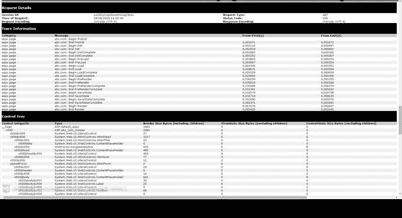
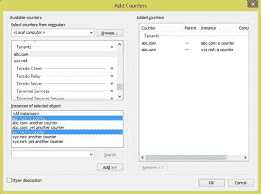
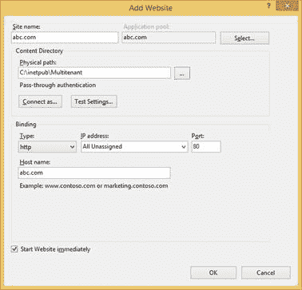
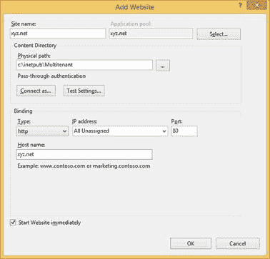

# 第 9 章应用服务

## 简介

任何做一些至少稍微复杂的应用程序取决于某些服务。称他们为常见问题，应用服务，中间件或其他。这里面临的挑战是，我们不能仅仅使用这些服务而不向他们提供某些背景，即当前的租户。例如，考虑缓存：您可能不希望其他租户可以访问特定租户缓存的内容。在这里，我们将看到一些通过利用 ASP.NET 和.NET 框架已经提供的功能来防止这种情况的技术。

## 控制反转

在整个代码中，我一直在使用 Common Service Locator 来检索服务，而不管用于实际注册它们的 Inversion of Control 容器，但最后，我们使用的是 Unity。当我们实际注册它们时，我们有几个选择：

*   注册静态实例
*   注册类实现
*   注册注塑工厂

对于需要上下文的服务（了解当前租户），注入工厂是我们的朋友，因为只有在实际请求服务时才能获得此信息。使用 Unity，我们使用以下代码注册它们：

代码示例 89

```
var container = UnityConfig.GetConfiguredContainer();
container.RegisterType<IContextfulService>(new PerRequestLifetimeManager(), 
      new InjectionFactory(x =>
      {
            var tenant = TenantsConfiguration.GetCurrentTenant();
            return new ContextfulServiceImpl(tenant.Name);
      }));

```

值得注意的是：

*   [PerRequestLifetimeManager](https://msdn.microsoft.com/en-us/library/microsoft.practices.unity.perrequestlifetimemanager%28v=pandp.30%29.aspx) 是一个 Unity 生命周期管理器实现，它为已注册的组件提供每请求生存期，这意味着组件只会在当前 HTTP 请求的范围内创建（如果尚未创建）。否则，将始终返回相同的实例。在请求结束时适当处理一次性组件。
*   [InjectionFactory](https://msdn.microsoft.com/en-us/library/microsoft.practices.unity.injectionfactory%28v=pandp.51%29.aspx) 接受一个只返回预先创建的实例的委托。在这个例子中，我们正在构建一个伪造的服务实现， **ContextfulServiceImpl** ，它接受一个构造函数参数，它是当前的租户名称。

|  | 提示：使用除了 PerRequestLifetimeManager 之外的生命周期管理器的 InjectionFactory 没有多大意义。 |

|  | 注意：就像我之前说过的那样，你不依赖于 Unity - 你可以使用你喜欢的任何 IoC 容器，前提是（为了本书中的例子），它为 Common Service Locator 提供了一个适配器。 |

还记得代表租户配置的接口， **ITenantConfiguration** ？如果您这样做，您知道它具有通用的索引集合， **属性** 。我们可以实现一个自定义生命周期管理器，以透明的方式将项目存储在当前租户的 **属性** 集合中：

代码示例 90

```
public sealed class PerTenantLifetimeManager : LifetimeManager
{
      private readonly Guid id = Guid.NewGuid();
      private static readonly ConcurrentDictionary<String, 
            ConcurrentDictionary<Guid, Object>> items = 
            new ConcurrentDictionary<String, 
                  ConcurrentDictionary<Guid, Object>>();

      public override Object GetValue()
      {
            var tenant = TenantsConfiguration.GetCurrentTenant();
            ConcurrentDictionary<Guid, Object> registrations = null;
            Object value = null;

            if (items.TryGetValue(tenant.Name, out registrations))
            {
                  registrations.TryGetValue(this.id, out value);
            }

            return value;
      }

      public override void RemoveValue()
      {
            var tenant = TenantsConfiguration.GetCurrentTenant();
            ConcurrentDictionary<Guid, Object> registrations = null;

            if (items.TryGetValue(tenant.Name, out registrations))
            {
                  Object value;
                  registrations.TryRemove(this.id, out value);
            }
      }

      public override void SetValue(Object newValue)
      {
            var tenant = TenantsConfiguration.GetCurrentTenant();
            var registrations = items.GetOrAdd(tenant.Name, 
                  new ConcurrentDictionary<Guid, Object>());
            registrations[this.id] = newValue;
      }
}

```

## 缓存

缓存是可以显着提高应用程序性能的技术之一，因为它可以保留内存数据，这些数据的获取成本可能很高。我们需要能够针对密钥存储数据，其中多个租户可以使用相同的密钥。这里的技巧是在后台加入提供的密钥和特定于租户的标识符。例如，典型的缓存服务接口可能是：

代码示例 91

```
public interface ICache
{
      void Remove(String key, String regionName = null);
      Object Get(String key, String regionName = null);
      void Add(String key, Object value, DateTime absoluteExpiration, 
            String regionName = null);
      void Add(String key, Object value, TimeSpan slidingExpiration, 
            String regionName = null);
}

```

并使用 ASP.NET 内置缓存实现：

代码示例 92

```
public sealed class AspNetMultitenantCache : ICache, ITenantAwareService
{
      public static readonly ICache Instance = new AspNetMultitenantCache();

      private AspNetMultitenantCache()
      {
            //private constructor since this is meant to be used as a singleton
      }

      private String GetTenantKey(String key, String regionName)
      {
            var tenant = TenantsConfiguration.GetCurrentTenant().Name;
            key = String.Concat(tenant, ":", regionName, ":", key);
            return key;
      }

      public void Remove(String key, String regionName = null)
      {
            HttpContext.Current.Cache.Remove(this.GetTenantKey(key, 
            regionName));
      }

      public Object Get(String key, String regionName = null)
      {
            return HttpContext.Current.Cache.Get(this.GetTenantKey(key, 
            regionName));
      }
            public void Add(String key, Object value, DateTime absoluteExpiration, 
            String regionName = null)
      {
            HttpContext.Current.Cache.Add(this.GetTenantKey(key, regionName),
            value, null, absoluteExpiration, Cache.NoSlidingExpiration, 
            CacheItemPriority.Default, null);
      }
            public void Add(String key, Object value, TimeSpan slidingExpiration, 
            String regionName = null)
      {
            HttpContext.Current.Cache.Add(this.GetTenantKey(key, regionName),
            value, null, Cache.NoAbsoluteExpiration, slidingExpiration, 
            CacheItemPriority.Default, null);
      }
}

```

|  | 注意：不要担心 ITenantAwareService ;它只是我用于了解当前租户的那些服务的标记接口。 |

这里没什么特别的东西 - 我们只需用户提供的密钥包含当前租户的 ID 和区域名称。这是作为一个单独实现的，因为只有一个 ASP.NET 缓存，并且没有任何一点 **AspNetMultitenantCache** 的实例，没有任何状态，并且都指向同一个缓存。这就是 **ITenantAwareService** 接口所说的：它知道我们要处理的是谁，因此不需要为每个租户提供不同的实例。

|  | 注意：请注意类名称上的&gt; AspNet 前缀。这表明此类需要 ASP.NET 才能工作。 |

注册缓存服务很简单，我们不需要使用 [InjectionFactory](https://msdn.microsoft.com/en-us/library/microsoft.practices.unity.injectionfactory%28v=pandp.51%29.aspx) ，因为我们将注册一个单例：

代码示例 93

```
container.RegisterInstance<ICache>(AspNetMultitenantCache.Instance);

```

## 配置

我不知道任何中型应用程序不需要任何类型的配置。这里的问题是相同的：两个租户可能共享相同的配置键，同时他们会期望不同的值。让我们为基本配置功能定义一个通用接口：

代码示例 94

```
public interface IConfiguration
{
      Object GetValue(String key);
      void SetValue(String key, Object value);
      Object RemoveValue(String key);
}

```

我们还定义了一个多租户实现，它在每个租户配置文件中使用 [appSettings](https://msdn.microsoft.com/en-us/library/aa903313%28v=vs.71%29.aspx) 作为后备存储：

代码示例 95

```
public class AppSettingsConfiguration : IConfiguration, ITenantAwareService
{
      public static readonly IConfiguration Instance = 
            new AppSettingsConfiguration();

      private AppSettingsConfiguration()
      {
      }

      private void Persist(Configuration configuration)
      {
            configuration.Save();
      }

      private Configuration Configuration
      {
            get
            {
                  var tenant =  TenantsConfiguration.GetCurrentTenant();
                  var configMap = new ExeConfigurationFileMap();
                  configMap.ExeConfigFilename =  String.Format(                    AppDomain.CurrentDomain.BaseDirectory, 
                        tenant.Name, ".config");

                  var configuration = ConfigurationManager
                        .OpenMappedExeConfiguration(configMap, 
                             ConfigurationUserLevel.None);

                  return configuration;
            }
      }

      public Object GetValue(String key)
      {
            var entry = this.Configuration.AppSettings.Settings[key];
            return (entry != null) ? entry.Value : null;
      }

      public void SetValue(String key, Object value)
      {
            if (value == null)
            {
                  this.RemoveValue(key);
            }
            else
            {
                  var configuration = this.Configuration;
                  configuration.AppSettings.Settings
                        .Add(key, value.ToString());
                  this.Persist(configuration);
            }
      }

      public Object RemoveValue(String key)
      {
            var configuration = this.Configuration;
            var entry = configuration.AppSettings.Settings[key];

            if (entry != null)
            {
                  configuration.AppSettings.Settings.Remove(key);
                  this.Persist(configuration);
                  return entry.Value;
            }

            return null;
      }
}

```

|  | 注意：此类对于 Web 或非 Web 完全不可知;它可以用于任何类型的项目。它还实现了 ITenantAwareService ，原因与之前相同。 |

通过这个实现，我们可以为每个租户提供一个文件，比如 **abc.com.config** 或 **xyz.net.config** ，语法将与普通的.NET 配置文件：

代码示例 96

```
<configuration>
      <appSettings>
            <add key="Key" value="Value"/>
      </appSettings>
<configuration>

```

这种方法很好，因为我们甚至可以在运行时更改文件，并且我们不会导致 ASP.NET 应用程序重新启动，如果我们要更改 **Web.config** 文件，就会发生这种情况。

我们将使用相同的模式进行注册：

代码示例 97

```
container.RegisterInstance<IConfiguration>(AppSettingsConfiguration.Instance);

```

## 日志

当有太多好的选择时，实现另一个日志框架会很麻烦而且相当愚蠢。在本书中，我选择了[企业库记录应用程序块](https://msdn.microsoft.com/en-us/library/dn440731%28v=pandp.60%29.aspx)（ELLAB）。您可能希望通过 NuGet 添加对它的支持：


图 18：安装企业库日志记录应用程序块

ELLAB 提供了一个可用于将日志发送到多个源的 API，如下图所示：


图 19：企业库日志记录应用程序块体系结构

这些来源包括：

*   文本文件（ [RollingFlatFileTraceListener](https://msdn.microsoft.com/en-us/library/microsoft.practices.enterpriselibrary.logging.tracelisteners.rollingflatfiletracelistener.aspx) ， [FlatFileTraceListener](https://msdn.microsoft.com/en-us/library/microsoft.practices.enterpriselibrary.logging.tracelisteners.flatfiletracelistener.aspx) ， [XmlTraceListener](https://msdn.microsoft.com/en-us/library/microsoft.practices.enterpriselibrary.logging.tracelisteners.xmltracelistener.aspx) ）
*   Windows 事件日志（ [FormattedEventLogTraceListener](https://msdn.microsoft.com/en-us/library/microsoft.practices.enterpriselibrary.logging.tracelisteners.formattedeventlogtracelistener.aspx) ）
*   MSMQ（ [MsmqEventTraceListener](https://msdn.microsoft.com/en-us/library/microsoft.practices.enterpriselibrary.logging.tracelisteners.msmqtracelistener.aspx) ）
*   电子邮件（ [EmailTraceListener](https://msdn.microsoft.com/en-us/library/microsoft.practices.enterpriselibrary.logging.tracelisteners.emailtracelistener.aspx) ）
*   数据库（ [FormattedDatabaseTraceListener](https://msdn.microsoft.com/en-us/library/microsoft.practices.enterpriselibrary.logging.database.formatteddatabasetracelistener.aspx) ）
*   WMI（ [WmiTraceListener](https://msdn.microsoft.com/en-us/library/microsoft.practices.enterpriselibrary.logging.tracelisteners.wmitracelistener.aspx) ）

现在，我们的要求是将每个租户的输出发送到自己的文件。例如，租户“ **abc.com** ”的输出将转到“ **abc.com.log** ”，，依此类推。但首先要做的是这里 - 我们的基本合同是：

代码示例 98

```
public interface ILog
{
            void Write(Object message, Int32 priority, TraceEventType severity, 
                        Int32 eventId = 0);
}

```

我保持简单，但是，无论如何，请添加您认为合适的任何辅助方法。

ELLAB 可以记录：

*   任意**消息**
*   字符串**类别**：我们将其用于租户名称，因此我们不会在 API 中公开它
*   整数**优先级**
*   事件**严重性**
*   事件标识符，是可选的（ **eventId** ）

在 ELLAB 上实现它可能是：

代码示例 99

```
public sealed class EntLibLog : ILog, ITenantAwareService
{
      public static readonly ILog Instance = new EntLibLog();

      private EntLibLog()
      {
            //private constructor since this is meant to be used as a singleton
      }

      public void Write(Object message, Int32 priority, TraceEventType severity,            Int32 eventId = 0)
      {
            var tenant = TenantsConfiguration.GetCurrentTenant();
            Logger.Write(message, tenant.Name, priority, eventId, severity);
      }
}

```

注册遵循与以前相同的模式：

代码示例 100

```
container.RegisterInstance<ILog>(EntLibLog.Instance);

```

这次，我们还需要考虑 ELLAB 配置。因为我们需要单独设置每个租户，所以我们必须在启动时运行以下代码：

代码示例 101

```
private void CreateLogFactories(IEnumerable<ITenantConfiguration> tenants)
{
      foreach (var tenant in tenants)
      {
            try 
            {
                  var configurationSource = 
                        new FileConfigurationSource(tenant.Name + 
                        ".config");
                  var logWriterFactory = new LogWriterFactory(
                        configurationSource);
                  Logger.SetLogWriter(logWriterFactory.Create());
            }
            catch {}
      }
}

var tenants = TenantsConfiguration.GetTenants();
CreateLogFactories(tenants);

```

|  | 提示：初始化代码周围的 try ... catch 块是存在的，这样如果我们不想拥有特定租户的配置文件，它就不会抛出。 |

TenantsConfiguration.GetTenants 方法在“寻找租户”一章中介绍。此代码，特别是 FileConfigurationSource 类，要求所有租户在单个文件中进行配置，以租户命名（`<tenant>.config`）。接下来是使用每周旋转的滚动平面文件的日志记录配置示例：

代码示例 102

```
<configuration>
      <configSections>
            <section name="loggingConfiguration" 
                  type="Microsoft.Practices.EnterpriseLibrary.Logging.
Configuration.LoggingSettings, Microsoft.Practices.EnterpriseLibrary.Logging" />
      </configSections>
      <loggingConfiguration name="loggingConfiguration" tracingEnabled="true"
            defaultCategory="" logWarningsWhenNoCategoriesMatch="true">
            <listeners>
                  <add name="Rolling Flat File Trace Listener"
                        type="Microsoft.Practices.EnterpriseLibrary
.Logging.TraceListeners.RollingFlatFileTraceListener,
                  Microsoft.Practices.EnterpriseLibrary.Logging"                   listenerDataType="Microsoft.Practices.EnterpriseLibrary
.Logging.Configuration.RollingFlatFileTraceListenerData,
                  Microsoft.Practices.EnterpriseLibrary.Logging"
                  fileName="abc.com.log"
                  footer="---------------------------"
                  formatter="Text Formatter"
                  header="---------------------------"
                  rollFileExistsBehavior="Increment"
                  rollInterval="Week"
                  timeStampPattern="yyyy-MM-dd hh:mm:ss"
                  traceOutputOptions="LogicalOperationStack, DateTime,
                  Timestamp, ProcessId, ThreadId, Callstack"
                  filter="All" />
            </listeners>
            <formatters>
                  <add type="Microsoft.Practices.EnterpriseLibrary.Logging.
Formatters.TextFormatter,
                  Microsoft.Practices.EnterpriseLibrary.Logging"
                  template="Timestamp: {timestamp}&#xA;
                  Message: {message}&#xA;Category: {category}&#xA;
                  Priority: {priority}&#xA;EventId: {eventid}&#xA;
                  Severity: {severity}&#xA;Title:{title}&#xA;
                  Machine: {machine}&#xA;Process Id: {processId}&#xA;
                  Process Name: {processName}&#xA;"
                  name="Text Formatter" />
            </formatters>
            <categorySources>
                  <add switchValue="All" name="General">
                        <listeners>
                              <add name=
                             "Rolling Flat File Trace Listener" />
                        </listeners>
                  </add>
            </categorySources>
            <specialSources>
                  <allEvents switchValue="All" name="All Events">
                        <listeners>
                             <add name=
                             "Rolling Flat File Trace Listener" />
                        </listeners>
                  </allEvents>
                  <notProcessed switchValue="All"
                        name="Unprocessed Category">
                        <listeners>
                             <add name=
                             "Rolling Flat File Trace Listener" />
                        </listeners>
                  </notProcessed>
                  <errors switchValue="All" 
                        name="Logging Errors &amp; Warnings">
                        <listeners>
                             <add name=
                             "Rolling Flat File Trace Listener" />
                        </listeners>
                  </errors>
            </specialSources>
      </loggingConfiguration>
</configuration>

```

|  | 注意：有关企业库日志记录应用程序块的更多信息，请查看[企业库站点](https://msdn.microsoft.com/en-us/library/dn440731(v=pandp.60).aspx)。要记录到数据库，您需要安装[日志应用程序块数据库供应器](https://www.nuget.org/packages/EnterpriseLibrary.Logging.Database/) NuGet 程序包。 |

## 监测

ASP.NET 和.NET 应用程序提供的用于诊断和监视的经典 API 在多租户方面表现不佳，即：

*   [追踪](https://msdn.microsoft.com/en-us/library/zs6s4h68.aspx)
*   [性能指标](https://msdn.microsoft.com/en-us/library/windows/desktop/aa373083.aspx)
*   网络事件（[健康监测供应器](https://msdn.microsoft.com/en-us/library/bb398933.aspx)）

在本章中，我们将介绍使这些 API 成为多租户的一些技术。在此之前，让我们为所有这些不同的 API 定义一个统一合同：

代码示例 103

```
public interface IDiagnostics
{           Int64 IncrementCounterInstance(String instanceName, Int32 value = 1);
      Guid RaiseWebEvent(Int32 eventCode, String message, Object data, 
            Int32 eventDetailCode = 0);
      void Trace(Object value, String category);
}

```

需要对每种方法进行解释：

*   **Trace** ：写入已注册的跟踪侦听器
*   **IncrementCounterInstance** ：递增特定于当前租户的性能计数器
*   **RaiseWebEvent** ：在 ASP.NET 运行状况监控基础结构中引发 Web 事件

在以下部分中，我们将更详细地看到每个部分。

### 追踪

#### ASP.NET 跟踪

[ASP.NET 跟踪](https://msdn.microsoft.com/en-us/library/bb386420%28v=vs.140%29.aspx)服务对于分析 ASP.NET Web 窗体页面非常有用，它甚至可以帮助解决一些问题。

在使用跟踪之前，需要全局启用，这需要在 **Web.config** 文件上通过[跟踪](https://msdn.microsoft.com/en-us/library/vstudio/6915t83k%28v=vs.100%29.aspx)元素完成：

代码示例 104

```
<system.web>
                        <trace enabled="true" localOnly="true" writeToDiagnosticsTrace="true" 
                        pageOutput="true" traceMode="SortByTime" requestLimit="20"/>
</system.web>

```

该声明所说的是：

*   跟踪是 **启用** 。
*   跟踪输出仅存在于本地用户（ **localOnly** ）。
*   通知标准诊断跟踪侦听器（ **writeToDiagnosticsTrace** ）。
*   输出发送到每个页面的底部，而不是显示在跟踪处理器 URL（ **pageOutput** ）上。
*   跟踪事件按其时间戳（ **traceMode** ）排序。
*   最多存储 20 个请求（ **requestLimit** ）。

您还需要逐页启用它（默认为禁用）：

代码示例 105

```
<%@ Page Language="C#" CodeBehind="Default.aspx.cs" Inherits="WebForms.Default" 
Trace="true" %>

```

我们不会详细介绍 ASP.NET 跟踪。相反，让我们看一下 ASP.NET Web 窗体的示例跟踪：



图 20：Web 窗体的页面跟踪

在 MVC 中，唯一的区别是**控制树**表是空的，这很明显，一旦你想到它。

该跟踪显示在页面本身上，如 pageOutput 所示;另一个选项是仅在跟踪处理器页面上显示跟踪， Trace.axd ，并保留页面。无论哪种方式，输出都是相同的。

跟踪条目对应于服务器处理的请求。我们可以通过调用 [TraceContext](https://msdn.microsoft.com/en-us/library/System.Web.TraceContext(v=vs.110).aspx) 类中的一个跟踪方法将我们自己的跟踪消息添加到条目中，方便地在 Web 窗体中以 [Page.Trace](https://msdn.microsoft.com/en-us/library/system.web.ui.page.trace%28v=vs.110%29.aspx) 的形式提供：

代码示例 106

```
protected override void OnLoad(EventArgs e)
{
      this.Trace.Write("On Page.Load");
      base.OnLoad(e);
}

```

或者作为 [Trace](https://msdn.microsoft.com/en-us/library/system.diagnostics.trace%28v=vs.110%29.aspx) 类（对于 MVC 或一般）的静态方法，它甚至具有传递条件的重载：

代码示例 107

```
public ActionResult Index()
{
      Trace.WriteLine("Before presenting a view");
      var tenant = TenantsConfiguration.GetCurrentTenant();
      Trace.WriteLineIf(tenant.Name != "abc.com", "Not abc.com");
      return this.View();
}

```

现在，跟踪供应器保留了许多跟踪，最多为 requestLimit 指定的值 - 默认值为 10，最大值为 10,000。这意味着对我们所有租户的请求将以相同的方式处理，因此如果我们转到 Trace.axd URL，我们无法知道该请求的租户是谁。但是，如果仔细查看图 20 中**跟踪信息**表的**消息**列，您会注意到与发出请求的租户对应的前缀。为了实现这一点，我们需要在 **system.diagnostics 部分的 **Web.config** 文件中注册自定义诊断侦听器：**

代码示例 108

```
<system.diagnostics>
      <trace autoflush="true">
            <listeners>
                  <add name="MultitenantTrace" 
                        type="WebForms.MultitenantTraceListener, 
WebForms" />
            </listeners>
      </trace>
</system.diagnostics>

```

**MultitenantTraceListener** 的代码如下：

代码示例 109

```
public sealed class MultitenantTraceListener : WebPageTraceListener
{
      private static readonly MethodInfo GetDataMethod = typeof(TraceContext)
      .GetMethod("GetData", BindingFlags.NonPublic | BindingFlags.Instance);

      public override void WriteLine(String message, String category)
      {
            var ds = GetDataMethod.Invoke(HttpContext.Current.Trace, null)
                   as DataSet;
            var dt = ds.Tables["Trace_Trace_Information"];
            var dr = dt.Rows[dt.Rows.Count - 1];
            var tenant = TenantsConfiguration.GetCurrentTenant();
            dr["Trace_Message"] = String.Concat(tenant.Name, ": ", 
                  dr["Trace_Message"]);

            base.WriteLine(message, category);
      }
}

```

这样做有一点反射魔法，获得对包含最后痕迹的当前数据集的引用，并且在它们的最后一个 - 当前请求的一个 - 添加一个前缀，即当前租户的名称（对于例如， abc.com ）。

**Web.config** 不是注册诊断侦听器的唯一方法;还有代码： [Trace.Listeners](https://msdn.microsoft.com/en-us/library/system.diagnostics.trace.listeners.aspx) 。使用此机制，您可以添加自定义侦听器，以便在发出跟踪调用时执行各种操作：

代码示例 110

```
protected void Application_Start()
{
      //unconditionally adding a listener
      Trace.Listeners.Add(new CustomTraceListener());
}

protected void Application_BeginRequest()
{
      //conditionally adding a listener
      var tenant = TenantsConfiguration.GetCurrentTenant();
      if (tenant.Name == "abc.com")
      {    
            Trace.Listeners.Add(new AbcComTraceListener());
      }
}

```

#### 跟踪供应器

.NET 基类库中存在其他跟踪供应器：

*   [EventLogTraceListener](https://msdn.microsoft.com/en-us/library/system.diagnostics.eventlogtracelistener.aspx) ：写入 Windows 事件日志
*   [WebPageTraceListener](https://msdn.microsoft.com/en-us/library/system.web.webpagetracelistener.aspx) ：ASP.NET 跟踪
*   [IisTraceListener](https://msdn.microsoft.com/en-us/library/system.web.iistracelistener.aspx) ：IIS 跟踪
*   [EventProviderTraceListener](https://msdn.microsoft.com/en-us/library/system.diagnostics.eventing.eventprovidertracelistener.aspx) ： [Windows 事件跟踪](https://msdn.microsoft.com/en-us/library/windows/desktop/bb968803.aspx)（ETW）
*   [ConsoleTraceListener](https://msdn.microsoft.com/en-us/library/system.diagnostics.consoletracelistener.aspx) ：控制台
*   [DefaultTraceListener](https://msdn.microsoft.com/en-us/library/system.diagnostics.defaulttracelistener.aspx) ：Visual Studio 中的输出窗口
*   [TextWriterTraceListener](https://msdn.microsoft.com/en-us/library/system.diagnostics.textwritertracelistener.aspx) ：文本文件
*   [DelimitedListTraceListener](https://msdn.microsoft.com/en-us/library/system.diagnostics.delimitedlisttracelistener.aspx) ：带有自定义字段分隔符的文本文件
*   [EventSchemaTraceListener](https://msdn.microsoft.com/en-us/library/system.diagnostics.eventschematracelistener.aspx) ：XML 文本文件
*   [XmlWriterTraceListener](https://msdn.microsoft.com/en-us/library/system.diagnostics.xmlwritertracelistener.aspx) ：XML 文本文件
*   [FileLogTraceListener](https://msdn.microsoft.com/en-us/library/microsoft.visualbasic.logging.filelogtracelistener.aspx) ：文本文件

所有这些都可以在 [system.diagnostics](https://msdn.microsoft.com/en-us/library/1txedc80%28v=vs.110%29.aspx) 或 [Trace.Listeners](https://msdn.microsoft.com/en-us/library/system.diagnostics.trace.listeners.aspx) 中注册。我们将为 [Trace](https://msdn.microsoft.com/en-us/library/System.Diagnostics.Trace.aspx) 静态方法提供一个包装类，我们在其中实现 IDiagnostics 接口的 Trace 方法：

代码示例 111

```
public sealed class MultitenantDiagnostics : IDiagnostics, ITenantAwareService
{
      public void Trace(Object value, String category)
      {
            var tenant = TenantsConfiguration.GetCurrentTenant();
            System.Diagnostics.Trace.AutoFlush = true;
            System.Diagnostics.Trace.WriteLine(String.Concat(tenant.Name,
                  ": ", value), category);
      }
}

```

### 性能计数器

[性能计数器](https://msdn.microsoft.com/en-us/library/windows/desktop/aa373083(v=vs.85).aspx)是一项 Windows 功能，可用于提供有关运行的应用程序和服务的见解。甚至可以让 Windows 自动对性能计数器的值超过给定阈值的情况做出反应。如果我们愿意，我们可以使用性能计数器向感兴趣的各方通知我们的应用程序状态，其中该状态由整数值组成。

绩效计数器的组织方式如下：

*   分类：名称
*   计数器：名称和类型（让我们忘记现在的类型）
*   实例：给定类型的名称和值（我们假设一个长整数）


图 21：性能计数器的基本概念

在 ITenantConfiguration 接口中，我们添加了 Counters 属性，该属性在实现时用于自动创建性能计数器实例。我们将遵循这种方法：

表 6：多租户映射性能计数器概念

| 概念 | 内容 |
| 类别 | “租户” |
| 计数器 | 租户名称（例如 **abc.com** 或 **xyz.net** ） |
| 实例 | 来自 **ITenantConfiguration.Counters** 的特定租户名称 |

在 TenantsConfiguration 类中自动创建每个性能计数器和实例的代码如下：

代码示例 112

```
public sealed class TenantsConfiguration : IDiagnostics, ITenantAwareService
{
      private static void CreatePerformanceCounters(
            IEnumerable<ITenantConfiguration> tenants)
      {
            if (PerformanceCounterCategory.Exists("Tenants"))
            {
                  PerformanceCounterCategory.Delete("Tenants");
            }

            var counterCreationDataCollection = 
                  new CounterCreationDataCollection(
                        tenants.Select(tenant => 
                             new CounterCreationData(
                                   tenant.Name,
                                   String.Empty,
                             PerformanceCounterType.NumberOfItems32))
                        .ToArray());

            var category = PerformanceCounterCategory.Create("Tenants",
                  "Tenants performance counters",
                  PerformanceCounterCategoryType.MultiInstance,
                  counterCreationDataCollection);

            foreach (var tenant in tenants)
            {
                  foreach (var instance in tenant.Counters)
                  {
                        var counter = new PerformanceCounter(
                              category.CategoryName,
                             tenant.Name,
                             String.Concat(tenant.Name,
                                   ": ",
                                   instance.InstanceName), false);
                  }
            }
      }
}

```

另一方面，用于递增性能计数器实例的代码在 IDiagnostics 接口（ IncrementCounterInstance ）中定义，我们可以将其实现为：

代码示例 113

```
public sealed class MultitenantDiagnostics : IDiagnostics, ITenantAwareService
{
      public Int64 IncrementCounterInstance(String instanceName,
            Int32 value = 1)
      {
            var tenant = TenantsConfiguration.GetCurrentTenant();
            using (var pc = new PerformanceCounter("Tenants", tenant.Name,
                  String.Concat(tenant.Name, ":", instanceName), false))
            {
                  pc.RawValue += value;
                  return pc.RawValue;
            }
      }
}

```

当应用程序运行时，我们可以通过[性能监视器](https://technet.microsoft.com/en-us/library/cc749249.aspx)应用程序实时观察计数器实例的值：


图 22：性能监视器应用程序显示性能计数器

我们只需要在显示屏上添加一些计数器;我们将在**租户** - **_&lt;租户名称&gt;下提供。_** - **_&lt;实例名称&gt;_** ：



图 23：添加性能计数器

在这个例子中，可以感觉到两个租户 **abc.com** 和 **xyz.net** ，具有相同的命名计数器实例，但并非必须如此。

还有其他内置的 ASP.NET 相关性能计数器，可用于监视您的应用程序。例如，在**性能监视器**中，添加一个新计数器并选择 **ASP.NET 应用程序**：


图 24：ASP.NET Applications 性能计数器

您会注意到您有多个实例，每个实例对应一个正在运行的站点。这些实例会自动命名，但每个数字都可以跟踪到应用程序。例如，如果您使用的是 IIS Express，请打开 **ApplicationHost.config** 文件（`C：\ Users \<username>\ Documents \ IISExpress \ Config`）并转到**网站**部分，在那里你会发现这样的东西（当然，你正在为租户服务 **abc.com** 和 **xyz.net** ]）：

代码示例 114

```
<sites>
       <site name="abc.com" id="1">
             <application path="/" applicationPool="Clr4IntegratedAppPool">
                    <virtualDirectory path="/" 
                           physicalPath="C:\InetPub\Multitenant" />
             </application>
              <bindings>
                    <binding protocol="http" bindingInformation="*:80:abc.com" />
             </bindings>
       </site>
       <site name="xyz.net" id="2">
             <application path="/" applicationPool="Clr4IntegratedAppPool">
                    <virtualDirectory path="/" 
                           physicalPath="C:\InetPub\Multitenant" />
             </application>
             <bindings>
                    <binding protocol="http" bindingInformation="*:80:xyz.net" />
             </bindings>
       </site>
</sites>

```

或者使用 IIS：



图 25：为 abc.com 创建单独的站点



图 26：为 xyz.net 创建单独的站点

为了获得更多控制权，我们将这两个站点分开了;这是更准确地控制每一个所必需的。但代码库保持不变。

在每个实例的名称中（`LM_W3SVC_<n>_ROOT`），`<n>`将匹配其中一个数字。

另一方面，如果要使用完整的 IIS， [appcmd](https://technet.microsoft.com/en-us/library/cc772200(v=ws.10).aspx) 命令将为您提供以下信息：

代码示例 115

```
C:\Windows\System32\inetsrv>appcmd list site
SITE "abc.com" (id:1,bindings:http/abc.com:80:,state:Started)
SITE "xyz.net" (id:2,bindings:http/xyz.net:80:,state:Started)

C:\Windows\System32\inetsrv>appcmd list apppool
APPPOOL "DefaultAppPool" (MgdVersion:v4.0,MgdMode:Integrated,state:Started)
APPPOOL "Classic .NET AppPool" (MgdVersion:v2.0,MgdMode:Classic,state:Started)
APPPOOL ".NET v2.0 Classic" (MgdVersion:v2.0,MgdMode:Classic,state:Started)
APPPOOL ".NET v2.0" (MgdVersion:v2.0,MgdMode:Integrated,state:Started)
APPPOOL ".NET v4.5 Classic" (MgdVersion:v4.0,MgdMode:Classic,state:Started)
APPPOOL ".NET v4.5" (MgdVersion:v4.0,MgdMode:Integrated,state:Started)
APPPOOL "abc.com" (MgdVersion:v4.0,MgdMode:Integrated,state:Started)
APPPOOL "xyz.net" (MgdVersion:v4.0,MgdMode:Integrated,state:Started)

```

我列出了所有站点（第一个列表），然后列出了所有应用程序池。

### 健康监测

ASP.NET 的[运行状况监视](https://msdn.microsoft.com/en-us/library/bb398933(v=vs.140).aspx)功能使规则配置能够响应 ASP.NET 应用程序中发生的某些事件。它使用提供的模型来决定在满足规则条件时要执行的操作。一个示例可能是当失败的登录尝试次数在一分钟内达到三次时发送通知邮件。因此，非常简单，健康监控功能允许我们：

*   注册许多将执行操作的供应器
*   添加绑定到特定供应器的命名规则
*   将事件代码映射到创建的规则

ASP.NET API 在内部引发了许多现成的事件，但我们也可以定义自己的事件：


图 27：包含的健康监控事件

事件按类和子类分组。有特定的类处理认证事件（ [WebAuditEvent](https://msdn.microsoft.com/en-us/library/system.web.management.webauditevent(v=vs.110).aspx) ， [WebFailureAuditEvent](https://msdn.microsoft.com/en-us/library/system.web.management.webfailureauditevent(v=vs.110).aspx) ， [WebSuccessAuditEvent](https://msdn.microsoft.com/en-us/library/system.web.management.websuccessauditevent(v=vs.110).aspx) ），请求（ [WebRequestEvent](https://msdn.microsoft.com/en-us/library/system.web.management.webrequestevent(v=vs.110).aspx) ， [WebRequestErrorEvent](https://msdn.microsoft.com/en-us/library/system.web.management.webrequesterrorevent(v=vs.85).aspx) ）和应用程序生命周期事件（ [WebApplicationLifetimeEvent](https://msdn.microsoft.com/en-us/library/system.web.management.webapplicationlifetimeevent(v=vs.110).aspx) ），查看状态失败事件（ [WebViewStateFailureEvent](https://msdn.microsoft.com/en-us/library/system.web.management.webviewstatefailureauditevent(v=vs.85).aspx) ）等。这些事件（和类）中的每一个都被分配了唯一的数字标识符，该标识符在 [WebEventCodes](https://msdn.microsoft.com/en-us/library/system.web.management.webeventcodes(v=vs.110).aspx) 字段中列出。自定义事件应以 [WebEventCodes.WebExtendedBase](https://msdn.microsoft.com/en-us/library/system.web.management.webeventcodes.webextendedbase(v=vs.110).aspx) + 1 中的值开头。

当然，还包括许多供应器 - 当满足规则时执行动作。我们也可以通过继承 [WebEventProvider](https://msdn.microsoft.com/en-us/library/system.web.management.webeventprovider.aspx) 或其子类之一来实现我们自己的：


图 28：包含的健康监控供应器

包含的供应器涵盖了许多典型场景：

*   写入数据库（ [SQLWebEventProvider](https://msdn.microsoft.com/en-us/library/system.web.management.SQLWebEventProvider(v=vs.110).aspx) ）
*   写入 WMI（ [WMIWebEventProvider](https://msdn.microsoft.com/en-us/library/system.web.management.WMIWebEventProvider(v=vs.110).aspx) ）
*   写入事件日志（ [EventLogWebEventProvider](https://msdn.microsoft.com/en-us/library/system.web.management.eventlogwebeventprovider(v=vs.110).aspx) ）
*   发送邮件（ [SimpleMailWebEventProvider](https://msdn.microsoft.com/en-us/library/system.web.management.SimpleMailWebEventProvider(v=vs.110).aspx) ）

在我们编写一些规则之前，让我们看一下我们的自定义供应器， **MultitenantEventProvider** ，及其相关类 **MultitenantWebEvent** 和 **MultitenantEventArgs** ：

代码示例 116

```
public sealed class MultitenantEventProvider : WebEventProvider
{
      private static readonly IDictionary<String, MultiTenantEventProvider> 
            providers = 
            new ConcurrentDictionary<String, MultiTenantEventProvider>();

      private const String TenantKey = "tenant";

      public String Tenant { get; private set; }

      public event EventHandler<MultiTenantEventArgs> Event;

      public static void RegisterEvent(String tenantId,
            EventHandler<MultiTenantEventArgs> handler)
      {
            var provider = FindProvider(tenantId);
            if (provider != null)
            {
                  provider.Event += handler;
            }
      }

      public static MultiTenantEventProvider FindProvider(String tenantId)
      {
            var provider = null as MultiTenantEventProvider;

            providers.TryGetValue(tenantId, out provider);

            return provider;
      }

      public override void Initialize(String name, NameValueCollection config)
      {
            var tenant = config.Get(TenantKey);

            if (String.IsNullOrWhiteSpace(tenant))
            {
                  throw new InvalidOperationException(
                        "Missing tenant name.");
            }

            config.Remove(TenantKey);

            this.Tenant = tenant;
            providers[tenant] = this;

            base.Initialize(name, config);
      }

      public override void Flush()
      {
      }

      public override void ProcessEvent(WebBaseEvent raisedEvent)
      {
            var evt = raisedEvent as MultitenantWebEvent;
            if (evt != null)
            {
                  var tenant = TenantsConfiguration.GetCurrentTenant();

                  if (tenant.Name == evt.Tenant)
                  {
                        var handler = this.Event;
                        if (handler != null)
                        {                                                          handler(this, 
                                   new MultitenantEventArgs(
                                         this, evt));
                        }
                  }
            }
      }

      public override void Shutdown()
      {
      }
}

[Serializable]
public sealed class MultitenantEventArgs : EventArgs
{
      public MultitenantEventArgs(MultitenantEventProvider provider,
            MultitenantWebEvent evt)
      {
            this.Provider = provider;
            this.Event = evt;
      }

      public MultitenantEventProvider Provider { get; private set; }
      public MultitenantWebEvent Event { get; private set; }
}

public class MultitenantWebEvent : WebBaseEvent
{
      public MultitenantWebEvent(String message, Object eventSource,               Int32 eventCode, Object data) : 
                  this(message, eventSource, eventCode, data, 0) {}

      public MultitenantWebEvent(String message, Object eventSource, 
            Int32 eventCode, Object data, Int32 eventDetailCode) : 
                  base(message, eventSource, eventCode, eventDetailCode)
      {
            var tenant = TenantsConfiguration.GetCurrentTenant();
            this.Tenant = tenant.Name;
            this.Data = data;
      }

      public String Tenant { get; private set; }
      public Object Data { get; private set; }
}

```

因此，我们有一个供应器类（ MultitenantEventProvider ），一个供应器事件参数（ MultitenantEventArgs ）和一个供应器事件（ MultitenantWebEvent ）。我们总是可以通过调用静态方法 FindProvider 找到为当前租户注册的供应器，并且可以从此供应器向事件事件注册事件处理器。稍后，我们将看到如何连接它，但首先，这是 IDiagnostics 接口 RaiseWebEvent 方法的可能实现：

代码示例 117

```
public sealed class MultitenantDiagnostics : IDiagnostics, ITenantAwareService
{
      public Guid RaiseWebEvent(Int32 eventCode, String message, Object data, 
            Int32 eventDetailCode = 0)
      {
            var tenant = TenantsConfiguration.GetCurrentTenant();
            var evt = new MultitenantWebEvent(message, tenant, eventCode,
                  data, eventDetailCode);
            evt.Raise();
            return evt.EventID;
      }
}

```

现在，让我们添加一些规则，看看事情的进展。首先，我们需要在 **Web.config** 文件的 [healthMonitoring](https://msdn.microsoft.com/en-us/library/2fwh2ss9(v=vs.100).aspx) 部分添加几个元素：

代码示例 118

```
<configuration>
      <system.web>
            <healthMonitoring enabled="true" heartbeatInterval="0">
                  <providers>
                        <add name="abc.com"                                                                type="MultitenantEventProvider, MyAssembly"
                             tenant="abc.com" />
                        <add name="xyz.net"
                             type="MultiTenantEventProvider, MyAssembly"
                             tenant="xyz.net" />
                  </providers>
                  <rules>
                        <add name="abc.com Custom Event"
                             eventName="abc.com Custom Event"
                             provider="abc.com"
                             minInterval="00:01:00"
                             minInstances="1" maxLimit="1" />
                        <add name="xyz.net Custom Event"
                             eventName="xyz.net Custom Event"
                             provider="xyz.net"
                              minInterval="00:01:00"
                             minInstances="2" maxLimit="2" />
                  </rules>
                  <eventMappings>
                        <add name="abc.com Custom Event"
                             startEventCode="100001"
                             endEventCode="100001"
                             type="MultiTenantWebEvent, MyAssembly" />
                        <add name="xyz.net Custom Event"
                             startEventCode="200001"
                             endEventCode="200001"
                             type="MultiTenantWebEvent, MyAssembly" />
                  </eventMappings>
            </healthMonitoring>
      </system.web>
</configuration>

```

所以，我们在这里有：

*   两个**供应器**注册了同一个类（ MultitenantEventProvider ），每个租户一个，具有属性租户
*   两个**规则**，每个规则在命名事件（ eventName ）被多次引发时引发自定义事件（ minInstances ， maxLimit ）对于给定的供应器，在一定时间内（ minInterval ）;
*   两个事件映射（ eventMappings）将事件 id 间隔（ startEventCode ， endEventCode ）转换为某个事件类（ type ）。

我们还需要为右租户的 MultitenantEventProvider 类添加一个事件处理器，可能在 [Application_Start](https://msdn.microsoft.com/en-us/library/ms178473(v=vs.140).aspx) 中：

代码示例 119

```
protected void Application_Start()
{
      MultiTenantEventProvider.RegisterEvent("abc.com", (s, e) =>
      {
            //do something when the event is raised
      });
}

```

因此，最后，如果在任何规则中指定的时间段内引发了许多 Web 事件，则会引发事件并希望发生某些事情。

## 分析

在分析网站流量时， [Google Analytics](http://www.google.com/analytics/) 是事实上的标准。我所知道的其他服务都没有提供相同数量的信息和功能，因此使用它也是有意义的，也适用于多租户网站。

如果您没有 Google Analytics 帐户，请创建一个帐户，这个过程非常简单（是的，您确实需要一个 Google 帐户）。

如果有，请转到 **Admin** 页面并创建与租户一样多的属性（ **Property** 下拉列表）：


图 29：创建 Google Analytics（分析）属性

将为每个租户分配`UA-nnnnnnnn-n`形式的唯一密钥，其中`n`是数字。如果您按照配置服务上的上一个主题进行操作，则每个租户（ **abc.com.config** ）的配置文件将位于您网站的根目录下，您将在此处存储此密钥：

代码示例 120

```
<configuration>
      <appSettings>
            <add key="GoogleAnalyticsKey" value="UA-nnnnnnnn-n"/>
      </appSettings>
</configuration>

```

当然，请更换`UA-nnnnnnnn-n`用右键！

现在，我们需要在我们提到此密钥和租户名称的页面中添加一些 JavaScript。此脚本是对 Google AnalyticsAPI 的实际调用完成的位置，如下所示：

代码示例 121

```
<script type="text/javascript">// <![CDATA[
      (function(i,s,o,g,r,a,m){i['GoogleAnalyticsObject']=r;i[r]=i[r]||function(){
            (i[r].q=i[r].q||[]).push(arguments)},i[r].l=1*new Date();a=s.createElement(o),
            m=s.getElementsByTagName(o)[0];a.async=1;a.src=g;m.parentNode.insertBefore(a,m)
            })(window,document,'script','//www.google-analytics.com/analytics.js','ga');
            ga('create', '{0}', 'auto');
            ga('send', 'pageview');
// ]]></script>

```

如果您对此来自何处感到好奇，Google Analytics 的**管理员**页面会准备好此信息供您选择 - 只需点击**跟踪信息**，即可获得您选择的房产（租户） 。

您可能已经注意到 **{0}** 标记 - 这是标准的.NET 字符串格式化占位符。这意味着，它需要用实际的租户密钥（`UA-nnnnnnnn-n`）替换。每个租户都会将此密钥存储在其配置中，例如，在密钥 GoogleAnalyticsKey 下。这样我们总能通过前面提到的 IConfiguration 界面检索它。

如果我们将使用 ASP.NET Web 窗体，那么一个很好的包装器可能是一个控件：

代码示例 122

```
public sealed class GoogleAnalytics : Control
{
      private const String Script = "<script type=\"text/javascript\">// <![CDATA[" +
      "(function(i,s,o,g,r,a,m){{i['GoogleAnalyticsObject']=r;i[r]=i[r]||function(){{" +
      "  (i[r].q=i[r].q||[]).push(arguments)}},i[r].l=1*new Date();a=s.createElement(o)," +
      "  m=s.getElementsByTagName(o)[0];a.async=1;a.src=g;m.parentNode.insertBefore(a,m)" +
      "  }})(window,document,'script','//www.google-analytics.com/analytics.js','ga');" +
            "  ga('create', '{0}', 'auto');" +
            "  ga('send', 'pageview');" +
            "// ]]></script>";

      protected override void Render(HtmlTextWriter writer)
      {
            var config = ServiceLocator.Current
                  .GetInstance<IConfiguration>();
            var key = config.GetValue("GoogleAnalyticsKey");

            writer.Write(Script, key);
      }
}

```

以下是页面或母版页上的示例声明：

代码示例 123

```
<%@ Register Assembly="Multitenancy.WebForms" Namespace="Multitenancy.WebForms" 
TagPrefix="mt" %>

<mt:GoogleAnalytics runat="server" />

```

否则，对于 MVC，正确的位置将是 [HtmlHelper](https://msdn.microsoft.com/en-us/library/system.web.mvc.htmlhelper%28v=vs.118%29.aspx) 的扩展方法：

代码示例 124

```
public static class HtmlHelperExtensions
{           private const String Script = "<script type=\"text/javascript\">// <![CDATA[" +            "(function(i,s,o,g,r,a,m){{i['GoogleAnalyticsObject']=r;i[r]=i[r]||function(){{" +
      "  (i[r].q=i[r].q||[]).push(arguments)}},i[r].l=1*new Date();a=s.createElement(o)," +
      "  m=s.getElementsByTagName(o)[0];a.async=1;a.src=g;m.parentNode.insertBefore(a,m)" +
      "  }})(window,document,'script','//www.google-analytics.com/analytics.js','ga');" +
      "  ga('create', '{0}', 'auto');" +
      "  ga('send', 'pageview');" +
      "// ]]></script>";

      public static void GoogleAnalytics(this HtmlHelper html)
      {
            var config = ServiceLocator.Current
                  .GetInstance<IConfiguration>();
            var key = config.GetValue("GoogleAnalyticsKey");
            html.Raw(String.Format(Script, key));
      }
}

```

然后在本地或共享视图上调用它：

代码示例 125

```
@Html.GoogleAnalytics()

```

就是这样！每个租户都会在 Google Analytics 上获得自己的属性页面，您可以开始监控它们。