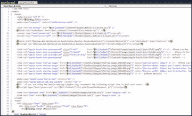
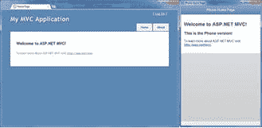

# 第 11 章还在使用 MVC 3 吗？

“我会拥有她拥有的东西！”
_ 中的匿名客户当 Harry 遇到 Sally 时 _

有很多项目都是用 MVC 3 开发的，如果你还在使用 MVC 3，你可能会觉得现在有些遗漏，并想要其他人拥有的一些东西。不要担心 - 您可以使用现有的 MVC 3 技术实现相同的移动友好效果，并将自己定位为直接进入 MVC 4 而不会造成很大的干扰。

## 减速带：MVC 3 和 MVC 4 并行

您可以轻松地将 MVC 4 与 MVC 3 一起安装，并且不应该打破任何东西。但是，您可能遇到一个小的减速带。

安装 MVC 4 时，它会在 **C：\ Program Files（x86）\ Microsoft ASP.NET \ ASP.NET MVC 4** 文件夹中为系统安装新文件，因此它会保留新的 MVC 文件与它旁边的 ASP.NET MVC 3 文件夹分开。但是，它还在 **v1.0** 文件夹旁边的 **ASP.NET 网页**文件夹中安装了一个新的 **v2.0** 文件夹： **C： \ Program Files（x86）\ Microsoft ASP.NET \ ASP.NET Web Pages \ v2.0** 。

这个文件夹恰好包含一些 MVC 3 使用的文件，但名称相同但版本不同。

当您在安装 MVC 4 之后返回并构建现有的 MVC 3 项目时，您可能会收到此编译错误：

```
c:\Windows\Microsoft.NET\Framework\v4.0.30319\Microsoft.Common.targets(1360,9): warning MSB3247: Found conflicts between different versions of the same dependent assembly.

```

如果你逛了一会儿，你会发现你的 MVC 3 项目引用了 **System.Web.Pages** 和 **System.Web.Helpers** DLL，但没有指定版本。最快的解决方法是在记事本中打开您的项目文件并进行一些快速编辑，将所有内容放回适当的位置，您的项目将再次开始正常工作。

项目定义文件之前：（* .csproj）

```
<Reference Include="System.Web.WebPages">
  <Private>True</Private>
</Reference>
<Reference Include="System.Web.Helpers">

```

项目定义文件之后：（* .csproj）

```
<Reference Include="System.Web.WebPages, Version=1.0.0.0, Culture=neutral,
  PublicKeyToken=31bf3856ad364e35, processorArchitecture=MSIL">
  <SpecificVersion>True</SpecificVersion>
</Reference>
<Reference Include="System.Web.Helpers, Version=1.0.0.0, Culture=neutral,
  PublicKeyToken=31bf3856ad364e35, processorArchitecture=MSIL">
  <Private>True</Private>
</Reference>

```

一旦你修复了这个小 bug，你应该能够再次正常运行你的 MVC 3 项目，并且一切都可以并行工作。但是，您必须将此修复程序应用于您打开的每个 MVC 3 项目。

## 返回 MVC 3 项目

让我们回到我们的主题：如何将您的 MVC 3 项目转换为使用我们在新的 MVC 4 项目中使用的适合移动设备的技术？事实证明，我们需要添加很多东西才能在 MVC 3 中实现这一功能。

首先要做的是使用 NuGet 安装 jQuery.Mobile 包，就像我们在 MVC 4 中一样。使用**包管理器控制台**命令行，运行命令 **Install-Package jQuery.Mobile** 。

由于`DisplayModeProvider`代码是 MVC 4 中的新功能，我们必须在 MVC 3 项目中复制该功能。在项目的根目录中，创建一个名为 **MobileCapableRazorViewEngine.cs** 的新类文件，并将以下代码放入该类：

```
using System;
using System.IO;
using System.Web;
using System.Web.Mvc;

namespace YourApplicationNameSpace
{
  // In Global.asax.cs Application_Start you can insert these
  // into the ViewEngine chain like so:
  //
  // ViewEngines.Engines.Insert(0, new
  //   MobileCapableRazorViewEngine());
  //
  // or
  //
  // ViewEngines.Engines.Insert(0,
  //  new MobileCapableRazorViewEngine("iPhone")
  //  {
  //    ContextCondition = (ctx =>
  //     ctx.Request.UserAgent.IndexOf(
  //      "iPhone", StringComparison.OrdinalIgnoreCase) >= 0)
  //  });

  public class MobileCapableRazorViewEngine : RazorViewEngine
  {
    public string ViewModifier { get; set; }
    public Func<HttpContextBase, bool> ContextCondition
      { get; set; }

    public MobileCapableRazorViewEngine()
      : this("Mobile", context =>
        context.Request.Browser.IsMobileDevice)
    {
    }

    public MobileCapableRazorViewEngine(string viewModifier)
      : this(viewModifier,
        context => context.Request.Browser.IsMobileDevice)
    {
    }

    public MobileCapableRazorViewEngine(string viewModifier,
      Func<HttpContextBase, bool> contextCondition)
    {
      this.ViewModifier = viewModifier;
      this.ContextCondition = contextCondition;
    }

    public override ViewEngineResult FindView(
     ControllerContext controllerContext,
     string viewName, string masterName, bool useCache)
    {
      return NewFindView(controllerContext, viewName, 
        null, useCache, false);
    }

    public override ViewEngineResult FindPartialView(
      ControllerContext controllerContext,
      string partialViewName, bool useCache)
    {
      return NewFindView(controllerContext, partialViewName,
        null, useCache, true);
    }

    private ViewEngineResult NewFindView(
      ControllerContext controllerContext,
      string viewName, string masterName, bool useCache,
      bool isPartialView)
    {
      if (!ContextCondition(controllerContext.HttpContext))
      {
        // We found nothing and we pretend we looked nowhere.
        return new ViewEngineResult(new string[] { });
      }

      // Get the name of the controller from the path.
      string controller = controllerContext.RouteData
        .Values["controller"].ToString();
      string area = "";
      try
      {
        area = controllerContext.RouteData.DataTokens["area"]
         .ToString();
      }
      catch
      {
      }

      // Apply the view modifier.
      var newViewName = string.Format("{0}.{1}", viewName,
        ViewModifier);

      // Create the key for caching purposes.         
      string keyPath = Path.Combine(area, controller,
        newViewName);

      string cacheLocation =
        ViewLocationCache
          .GetViewLocation(controllerContext.HttpContext,
          keyPath);

      // Try the cache.         
      if (useCache)
      {
        //If using the cache, check to see if the location
        //is cached.                             
        if (!string.IsNullOrWhiteSpace(cacheLocation))
        {
          if (isPartialView)
          {
            return new ViewEngineResult(CreatePartialView(
              controllerContext, cacheLocation), this);
          }
          else
          {
            return new ViewEngineResult(
              CreateView(controllerContext, cacheLocation,
               masterName),
                this);
          }
        }
      }
      string[] locationFormats = string.IsNullOrEmpty(area) ?
        ViewLocationFormats : AreaViewLocationFormats;

      // For each of the paths defined, format the string and
      // see if that path exists. When found, cache it.         
      foreach (string rootPath in locationFormats)
      {
        string currentPath = string.IsNullOrEmpty(area)
          ? string.Format(rootPath, newViewName, controller)
          : string.Format(rootPath, newViewName, controller,
            area);
        if (FileExists(controllerContext, currentPath))
        {
          ViewLocationCache.InsertViewLocation(
            controllerContext.HttpContext,
            keyPath, currentPath);
          if (isPartialView)
          {
            return new ViewEngineResult(CreatePartialView(
              controllerContext, currentPath), this);
          }
          else
          {
            return new ViewEngineResult(CreateView(
              controllerContext, currentPath, masterName),
                this);
          }
        }
      }
      // We found nothing and we pretend we looked nowhere.
      return new ViewEngineResult(new string[] { });
    }
  }
}

```

通过运行以下命令，NuGet 上也可以使用此代码：

```
PM> Install-Package MobileViewEngines

```

如果您安装 NuGet 包，它将不会自动包含项目中的代码，但代码将位于项目旁边的 **Packages** 文件夹中，因此您可以从那里复制它。

* * *

这段代码的荣誉归功于 Scott Hanselman，他在博客中介绍了这种移动视图方法 &lt;sup&gt;[5](../Text/aspn-mobisite-14.html#heading_id_82)&lt;/sup&gt; ，以及 Peter Mourfield，他提供了此版本的 Mobile View Engine 代码！

* * *

现在您已经可以使用视图引擎了，编辑 **Global.asax.cs** 文件并使用以下代码更新`Application_Start`函数（它看起来与我们为 MVC 4 做的非常相似！） ：

```
protected void Application_Start()
{
  AreaRegistration.RegisterAllAreas();
  RegisterGlobalFilters(GlobalFilters.Filters);
  RegisterRoutes(RouteTable.Routes);

  ViewEngines.Engines.Insert(0,
  new MobileCapableRazorViewEngine("Phone")
  {
    ContextCondition = (ctx =>
      ctx.Request.UserAgent.IndexOf("iPhone",
          StringComparison.OrdinalIgnoreCase) >= 0 ||
      ctx.Request.UserAgent.IndexOf("iPod",
          StringComparison.OrdinalIgnoreCase) >= 0 ||
      ctx.Request.UserAgent.IndexOf("Droid",
          StringComparison.OrdinalIgnoreCase) >= 0 ||
      ctx.Request.UserAgent.IndexOf("Blackberry",
          StringComparison.OrdinalIgnoreCase) >= 0 ||
      ctx.Request.UserAgent.StartsWith("Blackberry",
          StringComparison.OrdinalIgnoreCase))
  });
  ViewEngines.Engines.Insert(0,
  new MobileCapableRazorViewEngine("Tablet")
  {
    ContextCondition = (ctx =>
      ctx.Request.UserAgent.IndexOf("iPad",
          StringComparison.OrdinalIgnoreCase) >= 0 ||
      ctx.Request.UserAgent.IndexOf("Playbook",
          StringComparison.OrdinalIgnoreCase) >= 0 ||
      ctx.Request.UserAgent.IndexOf("Transformer",
          StringComparison.OrdinalIgnoreCase) >= 0 ||
      ctx.Request.UserAgent.IndexOf("Xoom",
          StringComparison.OrdinalIgnoreCase) >= 0)
  });
}

```

就是这样 - 你现在拥有的代码库几乎与我们使用`DisplayModeProvider`使用 MVC 4 移动功能创建的功能相同。有一些差异，但您应该能够使用此代码库开始创建一个非常适合移动设备的网站。 jQuery.Mobile 功能应该都是相同的，大多数布局文件应该是相同的。有一些像 MVC 3 中没有的捆绑技术，所以你必须在你的布局文件中列出你的每个样式表和 JavaScript 文件（或者自己缩小和连接它们）。

下图是 MVC 3 应用程序的示例，其中包含布局页面代码的屏幕截图，桌面的熟悉，蓝色，选项卡式，默认布局的屏幕截图，以及标题已更改为**电话主页**。





带桌面和电话布局的 MVC 3 应用程序

当您将此技术与本书前面所学到的内容相结合时，您应该能够开始使 MVC 3 应用程序几乎与 MVC 4 应用程序一样适合移动设备！