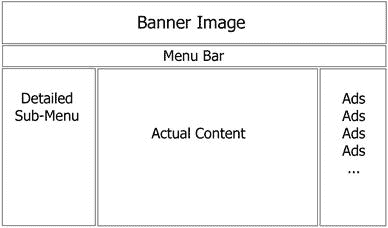
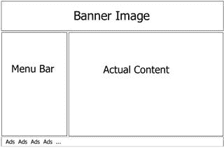
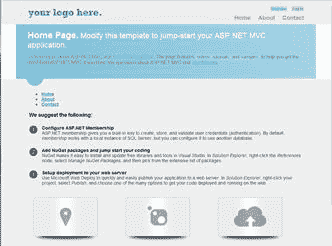
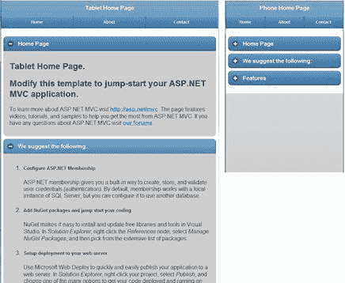

# 第 3 章设计适合移动设备的网站

“妈妈总是说生活就像一盒巧克力。你永远不会知道你会得到什么。“
阿甘在 _ 阿甘正传 _

如今设计移动网站是一个很大的话题。您参加的每个会议都有关于此主题的多个会议，并且有大量关于该主题的书籍。有了这些噪音，很难知道听谁说。

有些人说你需要使用移动专用站点和桌面专用站点。这有时被称为“mdot”策略，因为许多网站在其移动网址的前面放置了“m。”。但是，此策略会导致问题，因为您最终必须维护两个（或三个！）不同的站点，每个站点都有重复的内容和 Web 配置。

其他站点依赖于通常所说的响应式 Web 设计。理论上说，如果您使用适合的样式表设计您的站点，您将能够拥有一个具有一个 URL 的站点，并且它将适应许多屏幕大小，向上或向下缩放大小，改变列，以及制作它在各种不同尺寸上都很好看。这个策略失败的一个地方是页面臃肿。即使您的内容较少的屏幕较小，您通常也没有**较少的内容**。较少可见内容不等于下载的字节数较少。手机具有数据上限和较低的下载速度，因此使用该策略并不是移动设备的最佳设计。

如果您使用响应式设计策略设计网站，则需要确定是否要将移动设计作为偏见开始，然后随着屏幕变大而逐步增强，或者如果您想从桌面设计开始，然后做出优雅的退化。这两种方法都存在一些严重问题。

如果您可以创建一个从这两种策略中获得好成绩的网站，该怎么办？我不是依赖于响应式 Web 设计策略，而是使用我称之为“自适应视图设计”的模式。通过使用本书中的自适应视图设计模式，您可以获得这两种策略中最好的部分在你的项目中。

## 桌面布局与移动布局

在我们进入实际代码之前，在设计移动布局时需要了解一些设计概念。当您将桌面屏幕与小型手机屏幕进行比较时，存在一些明显的差异，当您设计适用于平板电脑等中型屏幕时，有些情况并不明显。

### 多列与单列设计

在设计典型的桌面网站时，您倾向于使用多列布局，其中三列布局是最常用的方法。这样的布局利用横幅图片，菜单栏，广告吸引你的注意力等，如下所示：

桌面布局

在布置移动网站时，更好的方法是设计单列布局。仅使用一列就可以轻松地在不同尺寸的设备之间进行缩放，并且可以在纵向和横向模式之间切换。考虑大多数手机应用程序的布局：

手机布局

另一方面，平板电脑倾向于采用两种方法。平板电脑倾向于采用手机常用的一列方法，但是当旋转到横向模式时它会切换到两列布局，并且偶尔会使用三列布局。

平板电脑布局

每个设计都有不同的方法，假设我们可以创建一个在所有这三种形状因子中都能很好地工作的页面是错误的。这不仅仅是布局的变化;还有其他考虑因素。

### 点击与悬停和点击

另一个需要考虑的问题是，在桌面上，人们习惯于点击将它们带到下一页的小文本链接，鼠标是一个非常精确的工具。在移动设备上，人们用手指和拇指敲击，当您尝试这样做时，小文本链接并不真正起作用。您的移动设备友好型设计需要尽可能地包含更大的按钮和图标，并使用链接可以点击整条线上的任意位置以激活选择，而不仅仅是包含链接的实际单词。

此外，在许多桌面应用程序和网站上，开发人员倾向于使用隐藏的信息，直到指针悬停在对象上。这种概念根本不存在于基于触摸的输入设备（如手机或平板电脑）上。

### 大屏幕和可折叠容器

除了缩减设计中的列数之外，您还需要考虑内容容器本身。在桌面上有足够的空间，因此在许多视觉上不同的容器中扩展和显示尽可能多的数据是有意义的。在移动设备的小屏幕上，您希望显示最少量的有意义的数据，然后让用户决定接下来要显示的内容，并在平板电脑上介于两者之间。对这种范例最敏感的选择之一是可折叠容器。以下三个屏幕截图是具有完全相同内容的完全相同的 URL，但每个屏幕截图都针对其所针对的平台进行了组织和优化。

桌面视图

在此示例中，桌面显示所有内容，并将其组织为具有适当样式的漂亮容器。

平板电脑和手机视图

平板电脑视图显示相同的内容，但它放置在标题中带有减号的容器内，允许您根据需要折叠它们。电话视图使用相同的容器，但从折叠的所有内容开始，以便您可以轻松扫描文档以了解您感兴趣的内容。

* * *

在[第 8 章](../Text/aspn-mobisite-9.html#heading_id_52)中，我们将看一个我们可以使用的模式，你可以使用三种不同的布局，但在每个布局中重复使用相同的内容，这样你就不会得到重复的内容。我们还将在[第 8 章](../Text/aspn-mobisite-9.html#heading_id_53)和 [9](../Text/aspn-mobisite-10.html#heading_id_61) 中更详细地研究可折叠容器。

* * *

## 桌面！=平板电脑！=手机

希望本章让您对构建移动网站时需要解决的不同设计范例有所了解。良好的桌面设计与优秀的平板电脑设计并不相同，这与优秀的手机设计不同。这里的关键是尝试优化设计以匹配请求内容的设备，同时不必在多个站点和文件中维护重复的内容。

在设计网站时，Forrest Gump 是对的 - 我们真的不知道我们会得到什么。我们可能会认为我们应该知道如何设计我们的网站，但在我们知道它之前，一个新的设备将会出现并让我们感到惊讶。正如有人曾经说过的那样，“如果你做了一些白痴证明，那么他们只会做一个更好的白痴。”