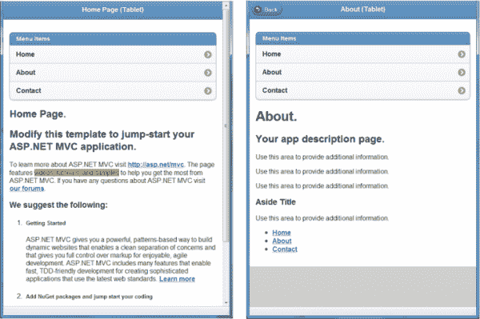
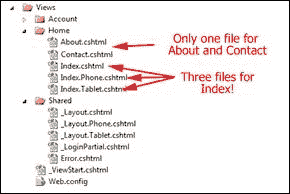
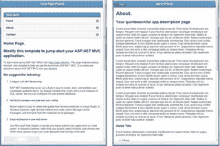

# 第 5 章使其适合移动设备

“让一切变得尽可能简单，但并不简单。”
阿尔伯特爱因斯坦

随着我们在前一章中所做的更改，我们现在有一个网站开始看起来更像一个适合移动设备的网站，但仍然存在一些问题。如果我们使用我们的演示站点并向上和向下滚动页面，您将看到页面滚动离开页面并消失，并且列表实际上没有像移动样式列表那样的任何图形界面。我们可以解决许多问题，但首先要解决这两件事。

## 固定标题

目前标题已附加到页面顶部。如果您滚动页面，标题会消失。向标题添加`data-position`标记会使向上或向下滚动时标题粘贴在页面顶部。

```
<div data-role="header" data-position="fixed" data-theme="b">

```

而已！使用 jQuery.Mobile 的一个好处是它有很多这样的内置功能，你可以轻松使用。使用此标记后，标题将保留在屏幕顶部。如果用户点击屏幕，他或她也可以使标题显示或消失。

## 为我们的列表对象添加样式

接下来让我们看一下菜单，然后给它一些视觉上的 pizazz。将`data-role`和`data-inset`标记添加到列表标题将使该列表采用新样式。此外，我们可以使用`list-divider`项目向列表添加标题，以使其更具视觉趣味性：

```
 <nav>
   <ul data-role="listview" data-inset="true">
      <li data-role="list-divider">Menu Items</li>
      <li>@Html.ActionLink("Home", "Index", "Home")</li>
      <li>@Html.ActionLink("About", "About", "Home")</li>
      <li>@Html.ActionLink("Contact", "Contact", "Home")</li>
    </ul>
  </nav>

```

通过进行这些极小的更改，我们将有一个更好看的页面：



改进了列表项的标题和样式

现在我们正在取得一些进展，使这个网站适合移动设备。在查看主页时，单击**关于**页面链接，看看会发生什么。您会注意到的一件事是，您可以单击该行的任何位置，然后操作将会发生。您不必仅限于单击**关于**。

如果您一直在跟踪（而不是自己前进），当您单击**关于**链接时，您应该看到类似于上一个图像的右半部分。注意什么遗失？您应该注意到标题栏中没有后退按钮。大多数移动应用程序都会跟踪其上下文，并为您提供轻松返回的方法。您可能会想回答用户始终可以只使用浏览器中的**返回**按钮，这在许多情况下都会起作用。但如果进入全屏网络应用模式呢？正如您在[第 7 章](../Text/aspn-mobisite-8.html#heading_id_44)中看到的，我们可以设置我们的应用程序来接管屏幕并模拟本机应用程序，在这种情况下，没有**返回**按钮，所以我们确实需要处理这个问题。

另一件非常值得注意的事情是我们还在 **Home** 页面和 **About** 页面上显示菜单，这是多余的。在桌面上，用户希望屏幕顶部有该菜单栏。但你必须记住，这是一个屏幕很小的移动设备 - 我们想要最大化我们的房地产，只显示每页绝对必要的信息。我们的目标是同时创建一个适合移动设备的站点以及一个桌面友好的站点，因此我们也需要对其进行自定义。我们的下一步是删除该菜单并添加**返回**按钮功能。

## 绕道：为什么我们需要三份副本？

在我们开始添加**返回**按钮的路径之前，让我们快速一趟。看一下 **Views** 文件夹，看看你是否注意到任何看似有点不寻常的东西：



视图文件夹内容

当我们创建**索引**页面的移动友好视图时，我们将该文件复制到 **Index.Phone.cshtml** 和 **Index.Tablet.cshtml** ，然后放入在每个中的特殊布局命令中。我们还没有使用**关于**视图，那么如何获得移动视图？如果**关于**页面没有它们，我们为什么还需要这两个额外的文件呢？

答案是，只需将布局文件放在那里，任何没有* .Phone 或* .Tablet 对应的页面都会加载默认页面，如果它与我们的`DisplayMode`定义匹配，它将使用 **_Layout.Phone** 或 **_Layout.Tablet** 布局文件。这可能是也可能不是我们想要的。如果我们的目标是在所有三个平台上创建独特的体验，我们将希望提供每个文件的唯一版本。如果您将内容复制三次，这确实会导致一些维护问题，但我们将在[第 8 章](../Text/aspn-mobisite-9.html#heading_id_51)中讨论如何解决这个问题。

## 添加主页和后退按钮

目前，我们的首要目标是在我们的工具栏中放置一个**返回**按钮，让我们回过头来看看。通常，您可以在左上角找到两个基本按钮：**返回**按钮或**主页**按钮。很多时候你需要**后退**按钮，但有时候你不想回到上一个屏幕，所以你想要一个固定行为 **Home** 按钮。例如，如果您向用户显示可编辑项目列表，然后他或她编辑项目并单击**保存**，则您不希望用户单击**返回**按钮并被带回他们刚刚离开的编辑屏幕。旧数据仍会出现在列表中，因此我们必须处理该情况。（哇！我们的待办事项清单上有很多东西！）

让我们首先编辑 **Layout** 文件，然后在标题中添加可选 **Back** 或 **Home** 按钮的代码。在编辑器中打开此文件，并使用`data-role=header`在`div`中插入以下代码：

```
<div data-role="header" data-position="fixed" data-theme="b">
  <h1>@ViewBag.Title</h1>
@{
  bool ShowBackButton = false;
  bool ShowHomeButton = false;
  if (ViewBag.ShowBackButton != null &&
      ViewBag.ShowBackButton == true)
  {
    ShowBackButton = true;
  }
  if (ViewBag.ShowHomeButton != null &&
      ViewBag.ShowHomeButton == true)
  {
    ShowHomeButton = true;
  }
  if (ShowBackButton)
  {
    <a data-rel="back" data-role="button"
       data-transition="slide" data-direction="reverse"
       data-icon="back">Back</a>
  }
  if (ShowHomeButton)
  {
    <a href="@Url.Action("Index", "Home")" data-role="button"
       data-transition="slide" data-direction="reverse"
       data-icon="home">Home</a>
  }
}
</div>

```

`data-rel="` `back` `"`标记是 jQuery.Mobile 的另一个特殊标记，并提示它跟踪当前的页面堆栈。当您单击此按钮时，它将返回上一页（这与您可能熟悉的 JavaScript 中的`onclick="history.back()"`非常相似）。 `transition`，`direction`和`icon`标签稍微装饰一下按钮并给它一些默认行为。

还有另一种方法可以做到这一点。您实际上可以在页面`div`上添加“`data-add-back-btn`”标签，如下所示：

```
<div data-role="page" data-theme="b" data-add-back-btn="true">
  <div data-role="header" data-position="fixed" data-theme="b">
  <h1>@ViewBag.Title</h1>
</div>

```

这两个都有用，但它们确实有一个小问题：它们使用 jQuery.Mobile 中的堆栈，它根据用户到达页面的方式而改变。如果用户为您的辅助页面添加了书签，那么稍后再回过头来猜猜是什么？如果他们直接导航到页面，第二个版本中的**返回**按钮将消失，如果您使用第一个技术，**返回**按钮将在那里，但它可能不会执行任何操作。如果这是一个问题，您可能需要使用 **Home** 按钮直接链接回主页。

接下来，我们将为手机和平板电脑创建一个独特版本的 **About.cshtml** 。复制该文件并将其粘贴到 **Home** 目录中，然后将这些文件重命名为 **About.Phone.cshtml** 和 **About.Tablet.cshtml** 。在编辑器中打开它们并插入`Layout`赋值和`ViewBag`设置（对于`ShowBackButton`或`ShowHomeButton`），以便文件的开头类似于以下代码示例：

```
@{
  Layout = "../Shared/_Layout.Phone.cshtml";
  ViewBag.ShowBackButton = true;
}
@{ ViewBag.Title = "About"; }
<hgroup class="title">
  <h1>@ViewBag.Title.</h1>
  <h2>@ViewBag.Message</h2>
</hgroup>
...the rest of the file...

```

通过在顶部插入以下行来对平板电脑版本执行相同操作，使其看起来像以下代码示例：

```
@{
  Layout = "../Shared/_Layout.Tablet.cshtml";
  ViewBag.ShowBackButton = true;
}
@{ ViewBag.Title = "About"; }
<hgroup class="title">
  <h1>@ViewBag.Title.</h1>
  <h2>@ViewBag.Message</h2>
</hgroup>
...the rest of the file...

```

而已。现在，当您尝试运行它时，您的网站终于开始看起来有点像移动应用程序。



主页和后退按钮的应用

在本章中，我们添加了固定标题，漂亮的菜单，后退和主页按钮以及其他一些使我们的网站看起来更像移动应用程序的东西。我们可以通过一些更多的增强功能进一步扩展它，但这只是几行代码的良好开端。