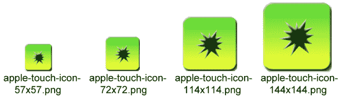
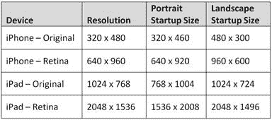

# 第 7 章使用移动设备元标记

“正确的单词与几乎正确的单词之间的区别在于闪电和闪电之间的区别。”
Mark Twain

有几个简单的选项可以增强您的网站，使其更像是一个移动应用程序。之前我们简要地查看了`viewport`标签。我们将在本章中更详细地介绍它，以及以下代码示例中显示的其他特殊标记：

```
<meta name="viewport" content="width=device-width" />
<meta name="apple-touch-fullscreen" content="no" />
<meta name="apple-mobile-web-app-capable" content="no" />
<link rel="apple-touch-icon"
  href="~/Conteimg/apple-touch-icon.png" />
<link rel="apple-touch-startup-image"
  href="~/Conteimg/iPhone_Startup.png" />

```

## 视口标签

我们之前简要地查看了`viewport`标签，它看起来像这样：

```
<meta name="viewport" content="width=device-width" />

```

这个标签很简单。它告诉网页始终尝试使用请求页面的设备的宽度。例如，iPhone 的分辨率为 320×480 像素或 640×960 像素（取决于您使用的型号 - 有关更详细的 iOS 屏幕分辨率，请参阅本章后面的图表）。因此，来自 iPhone 的请求将使用 320 或 640 的宽度，并且它将尽量不超过该宽度。如果您的内容结构正确，则会重新格式化以适应该维度。如果你去一个没有这个标签的普通网站，并且该网站被格式化为 900 像素或 1024 像素宽（就像大多数桌面目标网站一样），它在手机上看起来很小。除非它有此标记，否则它将继续缩小，直到内容适合屏幕。

如果您使用比设备更宽的标题图像，那么您可能会遇到问题。如果您在图像上指定`style`标签，如`&lt;img style="width: 100%;"… /&gt;`，您应该没问题。如果您没有这种类型的`style`标签，您的页面大小将扩展到图像的大小（即使您有`viewport`标签），并且用户可能最终向左和向右滚动。

如果需要，您可以使用`viewport`标签上的一些其他属性：

```
<meta name="viewport" content="width=device-width, initial-scale=1.0, maximum-scale=1.0, user-scalable=no"/> 

```

`user-scalable`标签确定您是否允许用户完全缩放。 `initial-scale`在加载时设置页面的大小，`maximum-scale`定义用户可以放大的程度。两个标签的设置范围为 0 到 10.0。通常，您可以将它们设置为 1.0，或将`maximum-scale`设置为 3.0 之类的值。

有关详细信息，请在`viewport`中搜索 Apple 开发人员网站 &lt;sup&gt;[4](../Text/aspn-mobisite-14.html#heading_id_82)&lt;/sup&gt; ，其中包含此标记的完整规范。

## 网络应用程序标签

接下来的两个标签`apple-mobile-web-app-capable`和`apple-touch-fullscreen`组合在一起，应该相互配合：

```
<meta name="apple-mobile-web-app-capable" content="no" />
<meta name="apple-touch-fullscreen" content="no" />

```

通常，您将设置为`yes`或`no`，具体取决于您的应用程序。在浏览器中正常浏览期间，这些标记对您来说很少。一旦用户在使用 iPhone 或 iPad 等 Apple 设备时在其主页上设置快捷方式，它们就会发挥作用。使用此类快捷方式时，如果将这些标记设置为`yes`，则您的网页将以 Web 应用程序模式运行。所有像地址栏和后退按钮一样的浏览器都会消失，你的应用程序会占用整个屏幕，就像本机应用程序一样（甜蜜！）。

* * *

为什么有这两个标签？您可能只需为 iOS 设备设置“apple-mobile-web-app-capable”标签即可，因为这是 Apple Developer 网站上唯一记录的标签。 apple-touch-fullscreen 似乎来自该框架的早期版本。在大多数情况下可能不需要它，但包含它不会伤害任何东西。

* * *

与`apple-mobile-web-app-capable`标签密切相关的是`apple-mobile-web-app-status-bar-style`标签。如果将`apple-mobile-web-app-capable`设置为`yes`，则可以更改状态栏的颜色。

```
<meta name="apple-mobile-web-app-status-bar-style" content="black" />

```

您可以将该标签设置为`default`（将其变为灰色），`black`或`black-translucent`。此标记完全是可选的，您不会经常使用它。

* * *

警告：如果您选择黑色半透明，标题将在您的普通 jQuery.Mobile 标题栏顶部流失，因此您必须通过在标题中放置 20 像素的死区来考虑这一点，因此不建议进行此设置。

* * *

通过设置这两个简单的值，您创建了一个看起来和功能几乎像本机应用程序的网页。您仍然在运行网页并运行浏览器，但所有使其看起来像浏览器的东西都被隐藏了。

### 使用 Web App 模式时请小心

当您第一次看到这些标签时，您可能会在所有网站上一直使用它们 - 毕竟，它们使您的网页看起来像本机应用程序，而没有任何创建本机应用程序的问题。但是，使用 Web 应用程序模式时需要注意一些问题。当您尝试链接到 PDF 文件或外部网站等外部项目时，最大的问题就出现了。当您这样做时，该链接将在 Safari 浏览器中打开，因此用户将看到一个新窗口打开，并将在应用程序中丢失其上下文。更糟糕的是，当用户返回你的应用程序时，它将在开始时全部启动：启动画面，登录，主页等。当你在桌面上的 Safari 中测试时，你不会注意到这种行为，但它肯定会在移动设备上引人注目。在您承诺在应用中使用此标记之前，请确保已测试了所有链接。

### 在桌面上创建一个漂亮的图标

作为 Web 开发人员，您之前可能已使用此标记在浏览器中为桌面网站创建图标：

```
<link rel="shortcut icon" href="~/favicon.ico" type="image/x-icon" />
<link rel="icon" href="~/favicon.ico" type="image/x-icon" />

```

您可以使用`icon`标签让浏览器快捷方式，标签栏和标题使用您的图标。创建一个好的 **favicon.ico** 文件在过去一直很棘手，但微软有一个非常好的网站来帮助你创建一个。转到 [http://www.xiconeditor.com/](http://www.xiconeditor.com/) ，您可以轻松上传任何图像（最好是 64×64 像素），编辑器将为您创建一个格式正确的 favicon.ico 文件。完成后，您可以保存文件并将其放在网站的根目录中。

尽管`icon`标签在桌面上运行良好，但它们对移动设备的影响不同。以下标记本质上是相当于快捷方式图标标记的移动浏览器：

```
<link rel="apple-touch-icon" href="~/Conteimg/apple-touch-icon.png"/> 

```

此标记将允许用户创建快捷方式，并将漂亮的图标显示为应用程序的桌面快捷方式。如果您不提供此标记，则当用户创建桌面快捷方式时，iOS 设备将获取应用程序屏幕的缩略图快照并使用该快照。 Android 设备将使用系统定义的书签图标。

乍一看，这个标签看起来很简单，但是你需要使用这个标签的许多排列。它在大多数情况下都可以正常工作，但不会在基本版本中为您提供最佳结果。在 iOS 设备上，使用此标记的基本版本会在图像的上半部分添加高光阴影。如果您不希望在图像上出现白色阴影，可以使用略微修改的标记将其删除（将`-precomposed`添加到名称中）：

```
<link rel="apple-touch-icon-precomposed"
  href="~/Conteimg/apple-touch-icon.png"/> 

```

这个标签的欺骗性部分是每个移动操作系统都有自己的规范，以确定图标 _ 应该 _ 的大小。此标记支持一个属性，该属性指定不同大小的不同图标。

首先保存以下每种尺寸的应用程序图标图像的副本，将它们放在**内容/图像**文件夹中，并使用如下命名方案：

```
apple-touch-icon-57x57.png
apple-touch-icon-72x72.png
apple-touch-icon-114x114.png
apple-touch-icon-144x144.png

```



多个尺寸的图标

手机和平板电脑使用不同尺寸的图标，因此我们必须为每个布局文件添加唯一的线条。将以下标记添加到 **_Layout.Phone.cshtml** 文件中：

```
<!-- iPhone Low-Res -->
<link rel="apple-touch-icon-precomposed" sizes="57x57"  
  href="~/Conteimg/apple-touch-icon-57x57.png" />
<!-- iPhone Hi-Res -->
<link rel="apple-touch-icon-precomposed" sizes="114x114"
  href="~/Conteimg/apple-touch-icon-114x114.png" />
<!-- Android -->
<link rel="apple-touch-icon-precomposed" sizes="android-only"
  href="~/Conteimg/apple-touch-icon-57x57.png" />  
<!-- default -->
<link rel="apple-touch-icon-precomposed"
  href="~/Conteimg/apple-touch-icon-57x57.png" />  

```

Android 浏览器不支持`size`标记，因此我们将在一个标记中放入`android-only`值，以便其他浏览器不会尝试使用此标记。 4.2 之前的 iOS 版本也不支持`size`标记，因此它们将使用列表中指定的最后一个版本，这就是为什么您会看到默认版本没有在代码末尾列出的大小。

通过添加以下代码在 **_Layout.Tablet.cshtml** 文件中执行相同的操作（请注意，这些标记与我们在 **_Layout.Phone** 页面中使用的标签类似但不同） ：

```
<!-- iPad Low-Res -->
<link rel="apple-touch-icon-precomposed" sizes="72x72"
  href="~/Conteimg/apple-touch-icon-72x72.png" />  
<!-- iPad Hi-Res -->
<link rel="apple-touch-icon-precomposed" sizes="144x144"
  href="~/Conteimg/apple-touch-icon-144x144.png" />
<!-- Android -->
<link rel="apple-touch-icon-precomposed" sizes="android-only"
  href="~/Conteimg/apple-touch-icon-57x57.png" />  
<!-- default -->
<link rel="apple-touch-icon-precomposed"
  href="~/Conteimg/apple-touch-icon-57x57.png" />  

```

通过这些设置，您应该能够在各种 iOS 和 Android 设备上创建快捷方式，并在桌面上显示格式正确且大小合适的图标。

### 提示用户创建快捷方式

即使我们现在拥有格式正确的 HTML 来创建漂亮的桌面快捷方式和图标，但这并不意味着用户实际上会花时间创建快捷方式 - 它不会自动发生！让我们看一下我们可以在第一次启动应用程序时提示用户创建桌面快捷方式的方法。使用 iOS 设备时，`navigator.standalone`属性将告诉我们页面是否以全屏模式运行。

* * *

Android 设备并不真正需要此检查，因为它们不完全支持全屏应用模式。他们仍然可以创建一个主屏幕书签，但它并不重要，因为它仍然打开浏览器，看起来完全一样。

* * *

这是我们可以用来执行此检查的一些 JavaScript。将此 JavaScript 保存在 **/Scripts/PromptForBookmark.js** 文件中：

```
// Contents of file "/Scripts/PromptForBookmark.js"
$(document).ready(function () {
  // This script should only be enabled if you are using the
  // apple-mobile-web-app-capable=yes option.
  var cookie_name = "PromptForBookmarkCookie";
  var cookie_exists = false;
  documentCookies = document.cookie;
  if (documentCookies.length > 0) {
    cookie_exists = (documentCookies.indexOf(cookie_name + "=")
     != -1);
  }
  if (cookie_exists == false) {
    // If it's an iOS device, then we check if we are in a
    // full-screen mode, otherwise just move on.
    if ((navigator.userAgent.indexOf("iPhone") > 0 ||
         navigator.userAgent.indexOf("iPad") > 0 ||
         navigator.userAgent.indexOf("iPod") > 0)) {
      if (!navigator.standalone) {
        window.alert('This app is designed to be used in full screen mode. For best results, click on the Create Bookmark icon in your toolbar and select the Add to Home Screen option and start this app from the resulting icon.');
      }
    }
    //Now that we've warned the user, set a cookie so that
    //the user won't be asked again.
    document.cookie = cookie_name +
       "=Told You So;expires=Monday, 31-Dec-2029 05:00:00 GMT";
  }
});

```

此脚本通过检查是否存在 cookie 来检查用户是否已被警告。如果用户之前没有收到警告，脚本将首先通过查看用户代理确保这是 iOS 设备，然后它将打开警报以通知用户他或她应该真正使用桌面快捷方式启动这个应用程序。最后，它将存储一个具有较长过期日期的 cookie，以便用户不会再被此打扰。

* * *

除了弹出消息之外，您可能想要提供更优雅的解决方案。我将把实现细节留给您！

* * *

要启用此功能，请启用`apple-mobile-web-app-capable`选项，然后在 **_Layout.Phone.cshtml** 和 **_Layout.Tablet.cshtml** 文件中添加以下脚本行：

```
<meta name="apple-touch-fullscreen" content="yes" />
<meta name="apple-mobile-web-app-capable" content="yes" />
<script type="text/javascript"
  src="@Url.Content("~/Scripts/PromptForBookmark.js")" ></script>

```

这些标签将告诉 iOS 设备以全屏模式运行应用程序。他们还将启用脚本，通知用户他或她应该在第一次运行应用程序时为此应用程序创建快捷方式。

## 创建启动画面

在加载应用程序时，大多数应用程序都会显示漂亮的启动屏幕。如果您希望在全屏模式下运行应用程序时有一个漂亮的启动画面，则需要添加以下标记：

```
<link rel="apple-touch-startup-image" href="startup.png"> 

```

乍一看，这个标签看起来也很简单，但再次看起来可能是骗人的。在第一个非常简单的示例中，此标记指定从桌面快捷方式启动应用程序时将显示的启动图像，并将其设置为使用 Web 应用程序模式。不幸的是，大多数时候这个标签根本没有任何效果。您的图像需要完全适合您的特定设备，因此有许多可能的选择。如果条件不完全正确，则图像不会显示。您甚至可以在纵向模式下使图像正确，然后如果用户将设备更改为横向模式，则不会显示图像。

为了使事情变得更加复杂，您需要担心两种版本的显示器：原始的 iPhone 和 iPad，以及用于 iPhone 和 iPad 的较新的 Retina 显示器。下表列出了启动映像的大小：



从图表中可以看出，在原始设备上，我们必须从一侧减去 20 个像素来考虑标题栏，而在 Retina 设备上我们必须减去 40 个像素。你可能想让你的图像大小不同，但不要屈服于那种诱惑。这些设备非常挑剔，如果你不能使你的图像完全成为这些尺寸中的一种，它们根本就不会显示出来。要考虑所有这些可能的情况，您需要创建以下每个图像并将它们放在 **Content \ Images** 文件夹中：

```
startup_image_320x460.png (iPhone Low-Res)
startup_image_640x920.png (iPhone Retina)

startup_image_480x300.png (iPhone Low-Res Landscape)
startup_image_960x600.png (iPhone Retina Landscape)

startup_image_768x1004.png (iPad Low-Res)
startup_image_1536x2008.png (iPad Retina)

startup_image_1024x748.png (iPad Low-Res Landscape)
startup_image_2048x1496.png (iPad Retina Landscape)

```

* * *

您可以随意命名它们，但这些名称是随后的 HTML 示例中使用的名称。

* * *

为了让您的图像在适当的时间显示在所有不同的设备上，您需要在页面中使用各种不同版本的`apple-touch-startup-image`标签。添加 CSS 媒体规则将有助于确定在每种情况下使用哪个图像。

放置此代码的最佳位置是在布局页面中。将以下标记添加到 **_Layout.Phone.cshtml** ：

```
<!-- iPhone Low-Res -->
<link rel="apple-touch-startup-image"
  href="~/Conteimg/startup_image_320x460.png"
  media="(device-width: 320px)" />
<!-- iPhone Retina -->
<link rel="apple-touch-startup-image"
  href="~/Conteimg/startup_image_640x920.png"
  media="(device-width: 640px) and
 (-webkit-device-pixel-ratio: 2)" />
<!-- iPhone Low-Res Landscape -->
<link rel="apple-touch-startup-image"
  href="~/Conteimg/startup_image_480x300.png"
  media="(device-width: 320px) and (orientation: landscape)" />
<!-- iPhone Retina Landscape -->
<link rel="apple-touch-startup-image"
  href="~/Conteimg/startup_image_960x600.png"
  media="(device-width: 640px) and (orientation: landscape) and
  (-webkit-device-pixel-ratio: 2)" />
<!-- (iPhone default) -->
<link rel="apple-touch-startup-image"
  href="~/Conteimg/startup_image_320x460.png" />

```

通过创建以下标记为您的平板电脑布局页面执行相同的操作（请注意，这些标签与我们在电话页面中使用的标签类似但不同）：

```
<!-- iPad Low-Res -->
<link rel="apple-touch-startup-image"
  href="~/Conteimg/startup_image_768x1004.png"
  media="(device-width: 768px) and (orientation: portrait)" />
<!-- iPad Retina -->
<link rel="apple-touch-startup-image"
  href="~/Conteimg/startup_image_1536x2008.png"
  media="(device-width: 1536px) and (orientation: portrait)
  and (-webkit-device-pixel-ratio: 2)" />
<!-- iPad Low-Res Landscape -->
<link rel="apple-touch-startup-image"
  href="~/Conteimg/startup_image_1024x748.png"
  media="(device-width: 768px) and (orientation: landscape)" />
<!-- iPad Retina Landscape -->
<link rel="apple-touch-startup-image"
  href="~/Conteimg/startup_image_2048x1496.png"
  media="(device-width: 1536px) and (orientation: landscape)
  and (-webkit-device-pixel-ratio: 2)" />
<!-- (iPad default) -->
<link rel="apple-touch-startup-image"
  href="~/Conteimg/startup_image_768x1004.png" />

```

有了这些标签，你 _ 应该 _ 有一个启动图像，将显示当前市场上的所有 iOS 设备。虽然您可以在 Android 设备上使用 Web 应用程序模式并创建桌面图标，但在 Android 设备上将忽略这些启动图像。

* * *

注意：当它处于横向模式时，我仍然无法使新的 iPad Retina 显示器上的启动图像完美地工作。图像确实显示，但显示在屏幕的下四分之一处，其他四分之三的屏幕显示为白色。我希望这是一个将在未来的更新中解决的错误。

* * *