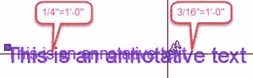
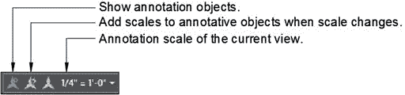

注释性对象允许您创建可以表示多个大小或比例的单个注释对象（请参见图 104）。您可以启用注释对象的 Annotative 属性，并为对象指定许多绘图比例，而不是在不同的图层上创建注释对象的多个实例。

 104：分配了两个注释比例的注释文本

正确使用注释性对象可以提高工作效率，并帮助您在编辑或删除注释性对象时避免不必要的错误。

创建注释性对象时，将缩放对象大小以匹配当前注释性比例。

 105：状态栏中的注释控件

注释控件如下：

**显示注释对象**：当打开（蓝色）时，如果与当前视图的当前注释比例关联，则所有注释性对象将独立显示。对象显示为最接近的关联比例。关闭（灰色）时，仅显示与当前视图的注释比例关联的注释性对象。

|  | 提示：在模型空间中工作时打开“显示注释对象”，在纸空间中关闭。这将帮助您避免创建图形中已存在的注释性对象，您所要做的就是分配必要的比例。 |

**缩放更改时向标注对象添加比例**：启用（蓝色）时，选择另一个比例时，所有注释性对象都与注释比例关联。

**当前视图的注释比例**：显示当前注释比例。单击以从列表中选择另一个注释比例，或编辑/添加注释比例。

添加和删​​除注释到对象：

1.  选择一个注释性对象并单击鼠标右键。
2.  单击**注释性对象比例**。
3.  1.  **添加当前比例**：将当前注释比例添加到所选对象。
    2.  **删除当前比例**：从选定对象中删除当前注释比例。仅当对象具有多个关联的注释比例时，此选项才可用。
    3.  **添加/删除比例**：打开一个对话框，您可以从中选择要添加或删除的多个注释比例。
    4.  **同步多尺度位置**：可以拉伸注释性对象而不影响指定的其他尺度。此选项重新定位比例以匹配选定的注释比例。