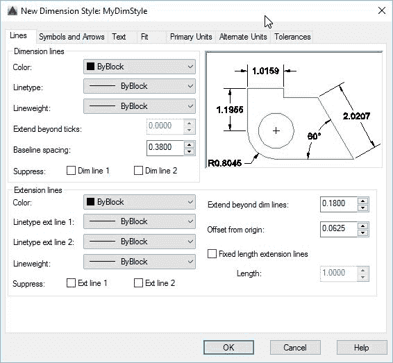
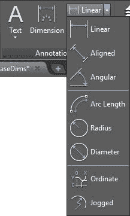
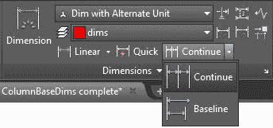
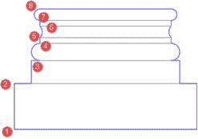
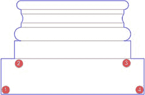

没有尺寸，设计就不完整。尺寸是设计过程的关键部分，必须易于阅读和精确。

您需要在几乎所有类型的项目上添加尺寸，从概念到生产和施工图纸。 AutoCAD 包含正确的工具，可帮助您使尺寸设计成为一个平滑的设计过程。

尺寸样式是一组保存在图形中的参数，您可以在其中定义从线到单位格式的所有标准属性。

命令：DIMSTYLE

别名：D

要从“主页”选项卡创建或编辑尺寸样式，请展开**注释**面板，然后单击**尺寸样式**图标（参见图 103）或在 **DIMSTYLE** 中键入命令窗口并按**输入**或**空格键**以打开“尺寸样式管理器”对话框。

样式列表（左侧的框）显示当前图形中可用的所有尺寸样式。在列表中选择尺寸样式时，预览将显示在预览框中。

要创建新的尺寸样式，请单击对话框右侧的**新建...** ，以打开“创建新尺寸样式”对话框：

**新样式名称**：输入新样式的名称。

**以**开始：允许您选择要用作模板的样式。

**Annotative** ：允许用户定义新的维度样式是否具有注释性。

**用于**：允许用户定义要应用新样式的尺寸类型。例如，您可以创建一组仅用于角度尺寸的参数。选择特定类型的尺寸时，新名称不可用，新样式将成为**开始于**下拉列表中所选尺寸的子样式。

创建尺寸样式，如下所示：

*   新样式名称： **MyDimStyle**
*   开头：**标准**
*   注释：**是**（已选中）
*   用于：**所有尺寸**
*   单击**继续**。加载了尺寸样式编辑器（图 110），您可以开始配置新的尺寸样式。

维度样式编辑器（“新建”，“修改”和“覆盖维度样式”对话框）由七个选项卡组成：

*   **行：**控制维度中所有行的外观。
*   *   **尺寸线**：尺寸文本所在的线条。
    *   **延长线**：从尺寸为维的对象到尺寸线的线。
*   **符号和箭头**：控制箭头和中心标记的外观。
*   **Text** ：控制要放置在尺寸样式中的文本的外观，位置和对齐方式。
*   **适合：**控制文本和箭头的放置方式。
*   **主要单位：**控制尺寸单位格式。
*   **备用单位：**允许用户为尺寸定义第二个单位。例如，假设您将主要单位设置为建筑格式（英尺和英寸），则可以设置备用单位以厘米为单位显示尺寸。
*   **Tolerances：**控制公差的文本外观。

 110：尺寸样式编辑器

继续我们的维度风格：

1.  选择**行**选项卡：
2.  尺寸线：
3.  1.  颜色，线型和线宽： **ByBlock**
    2.  基线间距： **0.2**
    3.  抑制：两者都未经检查
4.  延长线
5.  1.  颜色，线型和线宽： **ByBlock**
    2.  超越暗线： **0.1**
    3.  原点偏移： **0.5** （这是从偏转点到延长线的距离。）
    4.  抑制：两者都未经检查
6.  选择**符号和箭头**选项卡：
7.  箭头：
8.  1.  第一：建筑刻度
    2.  第二：建筑刻度
    3.  领导者：封闭填充
    4.  箭头大小： **0.1**
9.  选择**文本**选项卡：
10.  文字外观：
11.  1.  文字样式： **DimTxt**
    2.  文字颜色：**绿色**
    3.  填充颜​​色：**背景**（这类似于上一主题中多行文字中使用的蒙版。）
    4.  文字高度： **0.1**
12.  文字放置：
13.  1.  垂直：**高于**
    2.  水平：**居中**
    3.  查看方向：**从左到右**
    4.  从暗线偏移： **0.05**
14.  文字对齐： **ISO 标准**
15.  选择**主要单位**选项卡：
16.  线性尺寸：
17.  1.  单位格式：**建筑**
    2.  精度： **0'-0 1/16“**
    3.  分数格式：**水平**
18.  单击**确定**添加尺寸样式并关闭对话框。
19.  在**尺寸样式管理器**中，在**样式**列表中选择 **MyDimStyle** ，然后单击**设置当前**按钮。
20.  单击**关闭**以关闭尺寸样式管理器。
21.  保存图纸。

编辑尺寸样式

要编辑现有尺寸样式，请打开尺寸样式管理器，选择要编辑的尺寸样式，然后单击**修改...** 按钮。完成编辑后，单击**确定**提交更改并关闭对话框，或单击**取消**放弃所有更改并关闭对话框。

关闭所有对话框后，AutoCAD 将重新生成图形以将更改应用于与已编辑样式关联的现有尺寸。

您可以使用“注释”选项卡中“尺寸”面板中的“主页”选项卡中的“注释”面板中的尺寸，或更高级的工具。基本上有七种基本类型的维度：

*   **线性**：线性尺寸是与当前 UCS 方向匹配的垂直或水平尺寸。
*   **对齐**：对齐尺寸是线性尺寸，尺寸线在该尺寸线上旋转到延长线原点的方向。
*   **半径**：测量圆'和弧'半径的径向尺寸。 Jogged 是一个径向尺寸，可用于微调尺寸线。
*   **直径**：测量圆的直径的径向尺寸，虽然不常用，但是弧。
*   **Angular** ：测量所选对象的角度或指定三个点（顶点，角度起点和角度终点）。
*   **纵坐标**：测量与 UCS 原点的垂直或水平距离。
*   **弧长**：测量弧的长度。

图 111：尺寸工具

基线和持续尺寸

Baseline 和 Continued 是维度命令，支持从先前创建的维度继续维度或选择现有维度。

**继续尺寸**从先前创建的尺寸的第二个尺寸线开始创建新尺寸。

**基线尺寸**创建新尺寸，其中所有后续尺寸从先前创建的尺寸的第一个延伸线开始，并且在尺寸样式中设置的基线间距中指定的值间隔。

要快速启动尺寸标注，请打开位于**第 06 章**文件夹中的 **Column Base Notes** 图纸。这是在之前的练习中创建和编辑的相同绘图，但在此之后，我添加了一个名为 **Dim with Alternate Unit** 的维度样式。此尺寸样式包括建筑单元中的主要单元和以毫米为单位的备用单元。您可以在“尺寸样式编辑器”中打开它以查看属性。

让我们为列基添加一些维度：

1.  确保 **Osnap** 打开。您可以随时按 **F3** 以根据需要切换 **Osnap** 。
2.  从 **Home** 选项卡， **Annotation** 面板中，选择 **Linear dimension** 工具。
3.  单击列底部左下角附近。确保捕捉到终点。
4.  单击上面的结束点。
5.  向左移动光标并单击以放置尺寸线。
6.  激活功能区中的**注释**选项卡。
7.  从**尺寸**面板中，选择 **Baseline** 。
8.  Select each end point of the column base transition sequentially, up to the top-most point.

    

    图 112：Annotate 选项卡中的 Dimensions 面板

    

9.  按**输入**，**空格键**或 **Esc** 完成命令。
10.  选择**线性尺寸**工具。
11.  选择列基础的左下端点。
12.  选择列基础第二级左下角的终点。
13.  向下移动光标，使尺寸线水平。单击以将尺寸放置在列基础下方。
14.  选择底座第二层右侧的终点，然后选择底座的右下角。
15.  选择**线性**尺寸工具。
16.  Select the points **1** and **4** shown in the following figure.

    

17.  向下移动光标并选择一个点以将尺寸线放在现有水平尺寸下方。
18.  保存你的绘图。