# 第 3 章：创建

是时候开始创造你的世界了。在本章中，您将学习如何创建最常见的 AutoCAD 几何体

打开 AutoCAD，如果尚未打开，则基于 ACAD Succinctly 模板启动新绘图。

## 对象捕捉

在我们开始创建几何之前，让我们先谈谈对象捕捉。对象小区正在绘制帮助程序，允许您在提示输入点时选择精确位置。

AutoCAD 具有一个名为 AutoSnap 的功能（图 39），它会自动捕捉到现有对象中最近的点。当对象捕捉打开时，当接近现有对象时，将显示一个可视确认标记和工具提示。按 **F3** 键打开或关闭 AutoSnap。

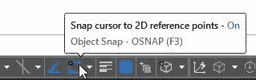

图 39：对象捕捉切换按钮

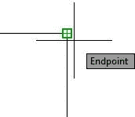

图 40：捕捉到一条线的终点

要查看或设置运行对象捕捉，请单击按钮右侧的小三角形以显示当前选择。要打开或关闭“对象捕捉”模式，请单击所需的模式。复选标记显示在活动模式的左侧，如图 41 所示。

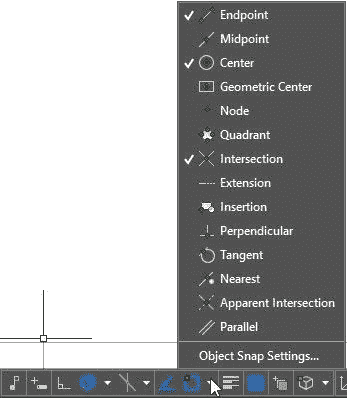

图 41：运行对象捕捉

要临时覆盖正在运行的对象捕捉模式，请按住 **Shift** 键并**右键单击**鼠标按钮以显示“对象捕捉覆盖”菜单（参见图 42）并选择临时对象您选择的快照模式。临时对象捕捉仅对当前选择点有效。

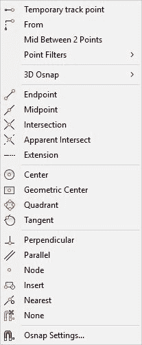

图 42：覆盖运行对象捕捉

## AutoCAD 几何图形

### 直线

命令：LINE

别名：L

该线是最基本和最常见的 AutoCAD 对象。线是连接两个给定点（起点和终点）的直线段。要绘制线，请单击**线**工具。要开始一行，单击主页选项卡中的**行**工具，或在命令窗口中键入 LINE （或仅 L ），然后按 **Enter** 或**空格键**。

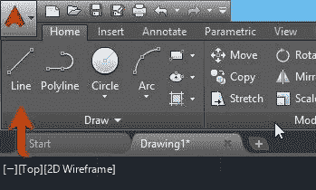

图 43：Home 选项卡中的 Line 命令

运行 LINE 命令时，可以创建一系列连接的线段。每个段都是一个独立的对象，可以在不影响其他段的情况下进行修改或擦除。

现在是生产东西的时候了。让我们创建以下图：

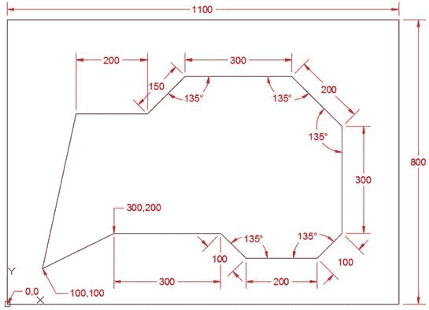

图 44：线段

以下步骤指导您创建外部矩形。您可以从命令窗口或功能区工具运行 LINE 命令。

命令： L 8

指定第一点： 0,0 8

指定下一个点或[撤消]： @ 1100,0 8

指定下一个点或[撤消]： @ 0,800 8

指定下一个点或[关闭/撤消]： @ -1100,0 8

指定下一个点或[关闭/撤消]： C 8

当您开始创建绘图时，它可能会超出当前屏幕边界。双击鼠标中键可缩放到绘图扩展名，或键入 **Z** 并按**输入**，然后按 **E** 并按 **Enter** 。

在前面的步骤中，我们通过输入绝对坐标（0,0），然后输入三个相对坐标，最后通过键入 **C** 来关闭矩形，从而在 UCS 的原点开始第一个线段。

|  | 提示：如果创建的线段坐标不正确，只需按 U 键然后按 Enter 键撤消线段而不中断命令。您可以根据需要撤消任意数量的段，但重做段的唯一方法是重新输入点坐标。 |

要创建图形的其余行，请执行以下命令序列：

命令： L 8

指定第一点： 100,100 8

指定下一个点或[撤消]： 300,200 8

指定下一个点或[撤消]： @ 300,0 8

指定下一个点或[关闭/撤消]： @ 100&lt; -45 8

指定下一个点或[关闭/撤消]： @ 200&lt; 0 8

指定下一个点或[关闭/撤消]： @ 100 &lt;45 8

指定下一个点或[关闭/撤消]： @ 300&lt; 90 8

指定下一个点或[关闭/撤消]： @ 200&lt; 135 8

指定下一个点或[关闭/撤消]： @ 300 &lt;180 8

指定下一个点或[关闭/撤消]： @ 150&lt; 225 8

指定下一个点或[关闭/撤消]： @ 200 &lt;180 8

指定下一个点或[关闭/撤消]： C 8

请注意，我使用了绝对，相对和相对极坐标的混合。您选择的坐标输入方法没有限制。例如，输入 @ -300,0 将创建与 @ 300&lt; 180 创建的相同的段。

因为默认情况下从 **X** 轴的正方向逆时针测量角度，所以我必须计算一个更简单的角度测量值。例如，在第三个线段中，如果您为角度测量输入了 135，则会导致从上一个点开始向右上方的线段。由于我们需要向下和向右，我们输入 -45（90-135）进行角度测量。

将图形另存为 **Lines01.dwg** 。

|  | 注意：默认情况下，AutoCAD 2016 将另存为 AutoCAD 2013 文件格式，这意味着您可以在 AutoCAD 2013 之后的任何 AutoCAD 版本上打开在 AutoCAD 2016 上编辑的文件。如果需要在较旧的 AutoCAD 版本上打开图形，请选择“文件”中的版本。类型下拉列表。 |

|  | 提示：要快速保存图形，可以使用快捷键 Ctrl + S 组合。要使用其他名称保存图形，请使用 Ctrl + Shift + S 显示“将图形另存为”对话框。 |

开始一个新的空白绘图。我们将使用极坐标跟踪和距离输入创建以下图形：

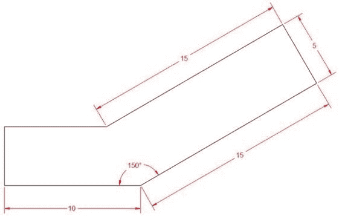

图 45：Lines02.dwg

确保对象捕捉，对象捕捉跟踪和极坐标跟踪打开，并将极坐标跟踪设置为 15º增量，如第 2 章所述。

您的状态栏应类似于下图，其中蓝色图标表示相应的帮助程序已打开：

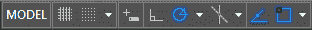

|  | 提示：按 F3 切换对象捕捉，按 F10 切换极坐标跟踪，按 F11 切换对象捕捉跟踪。 |

通过在命令窗口中键入或单击功能区工具来启动行命令。

命令： L 8

指定第一个点：单击绘图区域中的任意位置

对于下一个点，我们将定位鼠标，使其模拟向量的方向，如 图 46 所示。在命令提示符中仅输入段长度，然后按 输入 。

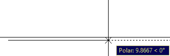

图 46：0º处的极坐标跟踪

指定下一个点或[撤消]： 10 8

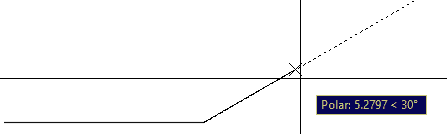

图 47：30º处的极坐标跟踪

指定下一个点或[撤消]： 15 8

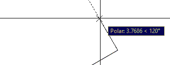

图 48：120º处的极坐标跟踪

指定下一个点或[关闭/撤消]： 5 8

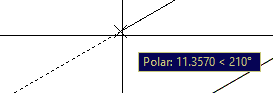

图 49：210º处的极坐标跟踪

指定下一个点或[关闭/撤消]： 15 8

接下来，我们使用极坐标跟踪和对象捕捉跟踪的组合。首先将鼠标悬停在第一个分段的左端点上，如 图 50 所示。这将激活该点上的对象捕捉。将鼠标向上移动大约 90º时，将显示对象捕捉跟踪线。继续向上移动光标，直到出现与 Polar Tracking 的交点，如 图 51 所示，然后单击鼠标左键以选择该点。

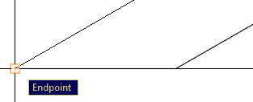

图 50：激活一个点的对象捕捉跟踪

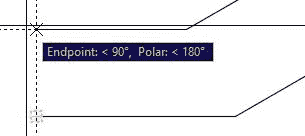

图 51：物体捕捉跟踪和极地捕捉跟踪交叉点

指定下一个点或[关闭/撤消]：在对象捕捉跟踪线和极坐标跟踪线的交叉点处按鼠标左键。

指定下一个点或[关闭/撤消]： C 8

将绘图另存为 **Line02.dwg** 。

#### 直线命令提示

*   指定第一个点：选择线段的第一个点。按**输入**将从先前创建的对象的最后一个点继续。如果前一个对象是圆弧，按 **Enter** 将从圆弧最后一个点继续该直线并与圆弧相切。

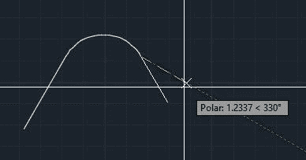

图 52：从先前创建的弧延续一条线

*   指定下一个点：选择线段的端点（以及下一个段的起点，直到命令完成）。
*   撤消：撤消系列的最后一个线段。
*   关闭：创建一个线段，从最后一个段的结束点开始，到系列中第一个线段的第一个点结束，然后完成命令。您需要在系列中至少有两个线段才能使用“关闭”命令。

|  | 提示：您只需单击命令窗口中的选项或键入相应的大写蓝色字母即可。 |

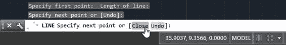

图 53：从命令窗口中选择命令选项

### 圆圈

命令：CIRCLE

别名：C 或 CI

使用 Circle 命令在 AutoCAD 中创建圆形对象。创建圆的默认方法是选择圆心点并输入半径值。如果单击主面板上“绘图”选项卡中“圆”工具下方的小三角形，则可以使用其他创建圆的方法。

要开始创建圆，请单击绘图选项卡中的**圆**工具，或输入 CIRCLE （或简单地 C ）并按 **Enter** 或**空格键**。

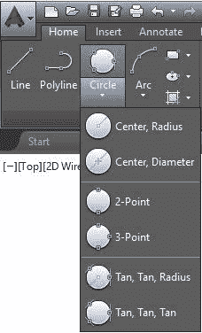

图 54：“主页”选项卡中的“圆形命令”

图 55;圆命令提示选项

请注意，命令窗口显示创建圆的选项。要选择选项，请单击选项或键入 Alias（以蓝色显示），然后按 **Enter** 或**空格键**。您也可以右键单击并从弹出的上下文菜单中选择该选项。这种做法在所有 AutoCAD 命令上都类似。

您可以使用以下任一选项创建圆圈：

**Center，Radius** ：这是在命令窗口和功能区中键入命令时创建圆形的默认选项，直到选择另一个选项。要创建圆，请运行命令，然后通过输入坐标值或在屏幕上选择它们来选择一个点。通过在命令窗口键入半径或选择一个点来输入半径长度。选择一个点时，半径的起点是所选的最后一个点，即圆的中心。

中心，直径 **（D）**：与中心，半径相同，但您将输入直径长度。从命令窗口运行命令时，可以输入 D 并在输入长度之前按**输入**或**空格键**。这将指示 AutoCAD 下一个长度是圆直径。

点 **（2P）**：通过选择两个点来创建圆。两点之间的距离是圆直径。

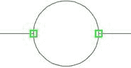

图 56：2 点圆圈

**分（3P）**。这将创建一个圆，其中圆周通过三个选定点。

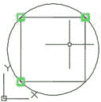

图 57：3 点圆圈

**Tan，Tan，Radius（TTR）**。这通过选择两个切点和圆半径来创建圆。有时，选择可能会导致创建圆圈的可能性不止一种。发生这种情况时，AutoCAD 会创建一个圆，其中切点最接近您选择的点。

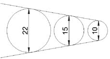

图 58：具有不同半径的相同两条线的圆切线

**Tan，Tan，Tan** 。这将创建一个与三个选定点相切的圆。此选项不可用作命令窗口选项，但实际上，这是与切线对象捕捉结合使用的 3P 选项，您将在本书的后面部分了解该选项。

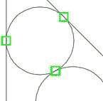

图 59：具有三个切点的圆

### 弧形

命令：ARC

别名：A

默认情况下，逆时针创建弧。使用第 1 章中讨论的单元命令更改角度方向也会影响构造弧的方向。

要创建圆弧，请单击功能区主页选项卡中的**圆弧**工具（图 62），或在命令窗口中输入 A （ ARC 命令的别名））然后按**输入**或**空格键**。从命令窗口运行 Arc 时，提示会更改以匹配下一个点选择可能性。

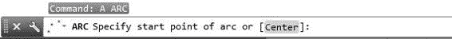

图 60：命令窗口中的 Arc 命令

**3 点**。创建圆弧的默认方法是在绘图区域中选择三个点。通过三个选定点创建弧。

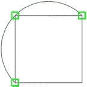

图 61：使用三个点创建的圆弧

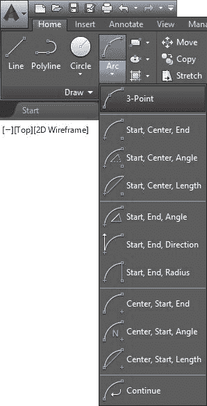

图 62：Arc Tools

|  | 注意：功能区工具中的所有构造方法都可以通过命令窗口获得，并在运行时选择组合。使用命令窗口可以提高大多数 AutoCAD 命令的效率。 |

|  | 提示：某些弧创建方法允许用户在选择最后一个点时按住 Ctrl 键来更改弧的方向。 |

**开始，中心，结束**。在此方法中，选择的第一个点是圆弧的起点，选择的第二个点是中心点，第三个（和最后一个）点是圆弧的终点。

图 63：开始，居中，结束圆弧

**开始，居中，角度**：在此构造方法中，首先选择圆弧起点，然后选择定义圆弧​​半径的圆弧的中心点。最后一个提示指定弧的夹角。您可以输入角度测量值或选择一个点来定义角度。

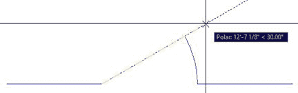

**开始，居中，长度**：通过选择和弦的起点，中心和长度来创建弧。

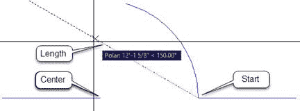

**开始，结束，方向**：通过选择弧的起点，终点和切线方向来创建弧。

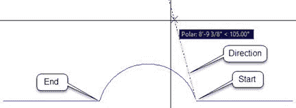

**开始，结束，半径**：通过选择第一个点，终点和半径来创建弧。

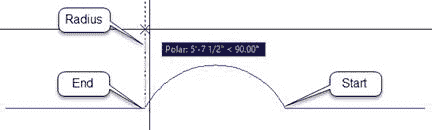

**连续切线弧和线**：您可以从先前创建的弧或线继续弧。弧的起点将是先前创建的对象的最后一个点。

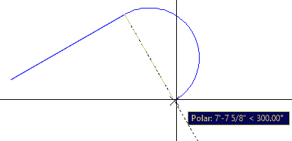

图 64：从先前创建的行继续创建弧

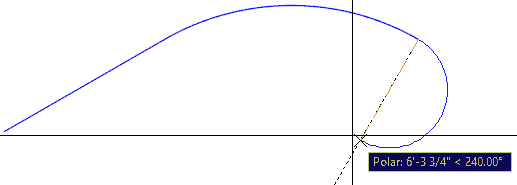

图 65：从先前创建的弧继续弧

好的，让我们生产一些东西。我们将绘制一个列基，如下图所示：

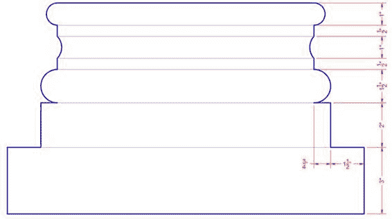

确保对象捕捉，对象捕捉跟踪和极地跟踪打开，并将极坐标跟踪设置为 15º增量，如第 2 章所述。

将**绘图单位**更改为 **Architectural** （请参阅第 1 章中的绘图单位）。

使用颜色 **5** （蓝色）创建名为 **ColumnBase** 的图层，并使其成为当前图层。有关创建图层的详细信息，请参阅第 2 章中的“创建图层”。

命令： L 8

指定第一点： 0,0 8

向上移动鼠标，使跟踪尖端显示角度为 90º。

指定下一个点或[撤消]： 3 8

将鼠标向左移动，使跟踪尖端显示角度为 180º。

指定下一个点或[撤消]： 1.5 8

向上移动鼠标，使跟踪尖端显示角度为 90º。

指定下一个点或[关闭/撤消]： 2 8

将鼠标向左移动，使跟踪尖端显示角度为 180º。

指定下一个点或[关闭/撤消]： .75 8

指定下一个点或[关闭/撤消]： 8

命令： A 8

指定圆弧的起点或[中心]：单击创建的最后一条线的终点旁边，确保 OSNAP 尖端显示为端点，如下图所示。

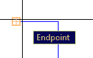 

指定弧的第二个点或[中心/结束]： C 8

指定圆弧的中心点： @ 0，.75 8

指定弧的终点（按住 Ctrl 切换方向）或[角度/弦长]： 8

命令： L 8

指定第一个点：在先前创建的圆弧 的终点附近单击

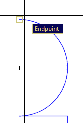

向上移动鼠标，使跟踪尖端显示角度为 90º。

指定下一个点或[撤消]： .5

指定下一个点或[撤消]： 8

命令： A

指定弧的起点或[中心]： @ 0,1

指定圆弧的第二个点或[中心/结束]： E

指定圆弧的终点：在先前创建的线 的终点附近单击

指定圆弧的中心点（按住 Ctrl 键切换方向）或[角度/方向/半径]： R 8

指定弧的半径（按住 Ctrl 键切换方向）： .75 8

命令： L 8

指定第一点：

指定下一个点或[撤消] :. 5 8

指定下一个点或[撤消]：

命令： A 8

指定弧的起点或[中心]：

指定弧的第二个点或[中心/结束]： E 8

指定弧的终点： @ 0,1 8

指定圆弧的中心点（按住 Ctrl 键切换方向）或[角度/方向/半径]： D 8

指定弧的起点的切线方向（按住 Ctrl 切换方向）：

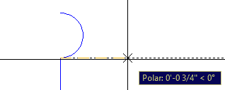

命令： L 8

指定第一点： 0,0 8

将鼠标向左移动，使跟踪尖端显示角度为 180º。

指定下一个点或[撤消]： 1'4“ 8

指定下一个点或[撤消]： 8

现在让我们镜像复制配置文件以创建列底部的左侧。您将在下一章中了解有关 Mirror 命令的更多信息。

命令： MI 8

选择对象：单击要选择的图形左侧和上方的点，然后单击圆弧右侧和下方的点，如下图所示：

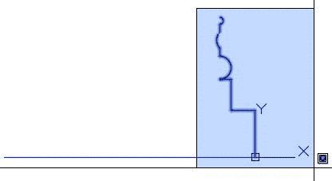

选择对象： 8

指定镜像线的第一个点： MID 8 （或按住 shift 并右键单击以显示“覆盖运行对象捕捉”菜单和选择中点）

点击宽水平线 中点附近

指定镜像线的第二个点：选择上方或下方的点，确保极坐标跟踪为 90 &lt;sup class="calibre72"&gt;O&lt;/sup&gt;

擦除源对象？ [是/否]&lt; No&gt;： N 8

缩放到绘图扩展名。运行命令后，绘图将填充绘图区域。

命令： Z 8

指定窗口的角，输入比例因子（nX 或 nXP）或[全部/中心/动态/范围/上一个/比例/窗口/对象]&lt;实时&gt;： E 8

现在我们将缩小一点（10% ）以使绘图更具可读性：

命令： Z 8

指定窗口的角，输入比例因子（nX 或 nXP）或[全部/中心/动态/范围/上一个/比例/窗口/对象]&lt;实时&gt;：。 9x 8

使用颜色 **8** 创建一个名为 **ColumnBase-vis** 的图层，并使其成为当前图层。

创建连接列基础的每个级别的端点的线。

将绘图另存为 **ColumnBase.dwg** 。

### 折线

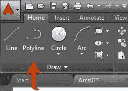

图 66：折线工具

折线是由多个线段或弧组成的单个对象。创建仅由直线段组成的折线与创建标准线类似。

命令：PL 或 PLINE

折线显示以下提示：

指定起点：设置折线起点。一个小刻度标记折线第一个点，直到命令完成（参见图 67）。按**以空提示输入**，从创建直线，圆弧或其他折线时选择的最后一个点开始新的折线。

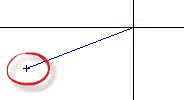

图 67：折线第一个刻度线

#### 线段提示

指定下一个点或[圆弧/闭合/半宽/长度/撤消/宽度]：

*   **圆弧：**开始创建与前一个线段相切的曲线折线。
*   **Length** ：创建具有指定距离的连续直线段。如果前一个段是弧，则新线段与弧相切。

#### 弧形提示

|  | 注意：拱形折线段构造方法类似于通用弧构造方法。 |

指定弧的终点（按住 Ctrl 切换方向）或

[Angle / CEnter / CLose / Direction / Halfwidth / Line / Radius / Second pt / Undo / Width]：

*   圆弧终点 ：完成圆弧段。弧段与折线的前一段相切。
*   角度 ：指定从起点开始的弧的夹角。
*   方向： 指定弧段的切线。
*   Line ：将折线构造模式设置回直线段。
*   半径 ：指定弧段的半径。
*   秒 pt ：指定三点弧的第二个点和终点。

#### 常见提示选项

*   **关闭**：连接第一个和最后一个段以创建闭合折线。请注意，线性段的别名是 C ，而拱形段的别名是 CL 以避免与中心冲突（ CE ）。
*   **半宽**：指定从宽段中心到边缘的宽度。此值保持不变，直到再次更改并持续显示当前图形的新折线。
*   **Width** ：指定下一个段的全宽。此值保持不变，直到再次更改并持续显示当前图形的新折线。
*   **撤消**：删除最后添加的段。

|  | 注意：定义宽度图的折线如定义，并受绘图比例以及缩放命令所做的修改的影响。要重置，请将宽度设置为 0。 |

### 矩形

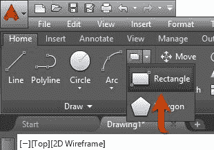

图 68：功能区中的矩形工具

命令：RECTANGLE

别名：REC 或 RECTANG

根据命令窗口提示中传递的参数创建一个矩形：

指定第一个角点或[倒角/高度/圆角/厚度/宽度]：

指定其他角点或[区域/尺寸/旋转]：

您可以通过在绘图区域中选择两个点（第一个角和另一个角）来快速创建矩形。

例如，在 图 44 中创建的矩形可以创建如下：

命令： REC 8

指定第一个角点或[倒角/高程/圆角/厚度/宽度]： 0,0 8

指定其他角点或[区域/尺寸/旋转]： @ 1100,800 8

|  | 注意：对于“其他角点”输入，您可以简单地输入 1100,800，因为第一个点位于 UCS 原点，并且在这种情况下相对和绝对坐标相同。 |

或者只需输入矩形尺寸，如下所示：

命令： REC 8

指定第一个角点或[倒角/高程/圆角/厚度/宽度]： 0,0 8

指定其他角点或[区域/尺寸/旋转]： D 8

指定矩形的长度&lt; 10.0000&gt;： 1100 8

指定矩形的宽度&lt; 10.0000&gt;： 800 8

指定其他角点或[区域/尺寸/旋转]：选择第一个点 右上角的点

**矩形选项：**

*   **倒角**：允许用户为具有确定倒角长度的矩形指定倒角。新的矩形的倒角长度一直存在，直到更改为止。
*   **Elevation** ：指定矩形的 Z 级别。在定义的 Z 级别创建新的矩形，直到更改为止。
*   **圆角**：设置半径以创建带圆角的矩形。
*   **厚度**：定义新矩形的线段厚度（高度）。
*   **Width** ：指定新矩形的线宽。

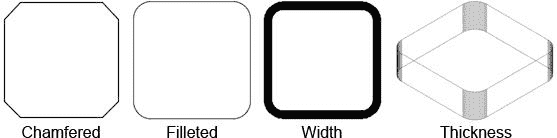

图 69：矩形方法

### 多边形

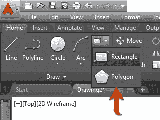

图 70：功能区中的多边形工具

命令：POLYGON

别名：POL

Polygon 方法创建一个具有定义数量的相等边的闭合折线。最小边数为 3，最大边数为 1,024。下图显示了两种创建多边形的方法。

要了解多边形的构造，我们首先创建两个圆，如以下步骤所列：

命令： C 8

指定圆的中心点或[3P / 2P / Ttr（tan tan radius）]： 3,3 8

指定圆的半径或[直径]： 2.5 8

命令： C 8

指定圆的中心点或[3P / 2P / Ttr（tan tan radius）]： 10,3 8

指定圆的半径或[直径]&lt; 2.5000&gt;： 2.5 8

现在让我们将绘图放到屏幕上：

命令： Z 8

指定窗口的角，输入比例因子（nX 或 nXP）或[全部/中心/动态/范围/上一个/比例/窗口/对象]&lt;实时&gt;： E 8

命令： Z

指定窗口的角，输入比例因子（nX 或 nXP）或[全部/中心/动态/范围/上一个/比例/窗口/对象]&lt;实时&gt;： .7X 8

现在让我们创建两个六边形（6 边多边形）。第一个将围绕左边的圆圈，第二个围绕圆圈刻在右边。

按照步骤创建第一个六边形：

命令： POL 8

POLYGON 输入边数&lt; 4&gt;： 6 8

指定多边形中心或[Edge]： CEN 8

将光标放在左边圆圈的旁边。 OSNAP 提示读取“中心”，并在圆的中心出现一个小的琥珀色圆圈。单击鼠标左键以选择圆的中心点。

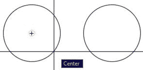

输入选项[圆圈内圈/围绕圆圈记录]&lt; I&gt;： C 8

指定圆的半径： 2.5 8

现在是第二个六边形：

命令： POL 8

POLYGON 输入边数&lt; 6&gt;： 6 8

指定多边形中心或[Edge]： CEN 8

将光标放在右边圆圈的旁边。 OSNAP 提示读取“中心”，并在圆的中心出现一个小的琥珀色圆圈。单击鼠标左键以选择圆的中心点。

输入选项[圆圈内圈/围绕圆圈记录]&lt; C&gt;： I 8

指定圆的半径： 2.5 8

如果需要，使用 Zoom 命令使图形适合屏幕。

将绘图另存为 **Polygons.dwg** 。

其他创作方法：

**Edge** ：通过指定第一条边的端点来创建多边形。

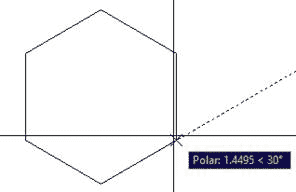

### 舱口

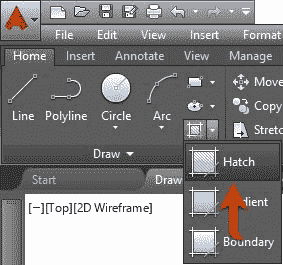

图 71：功能区中的填充工具

命令：HATCH

别名：H

填充命令允许用户使用预定义和自定义图案填充封闭区域，以及实心和渐变填充。

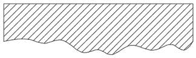

图 72：填充区域

运行 Hatch 命令或选择影线对象时，将加载并激活 Hatch 上下文选项卡，显示影线选项。

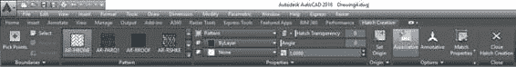

图 73：Hatch Contextual 选项卡

“填充”上下文选项卡包括以下面板和工具：

*   **Boundaries panel**: Includes tools for addition and removal of areas to be hatched

    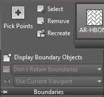

*   **拾取点**：允许用户通过单击封闭区域内部来选择边界
*   **选择**：允许用户选择要加阴影的对象
*   **删除**：从选择集中删除边界区域
*   **重新创建**：仅在编辑舱口时可用;创建剖面边界的闭合折线
*   **图案面板**：AutoCAD 中可用的图案填充图案列表
*   **Properties Panel**: Allows the user to set and modify properties for the hatch

    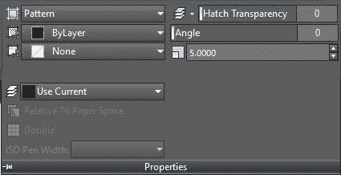

*   **填充类型**：允许用户选择要应用的填充类型。您可以选择“图案”（默认），“实体”，“渐变”和“用户定义”。
*   **颜色**：设置填充颜色。如果“填充类型”设置为“渐变”，则会成为渐变填充起始颜色（颜色 1）。
*   **背景颜色**：设置影线背景的颜色。如果“填充类型”设置为“渐变”，则会变为渐变填充结束颜色（颜色 2）。
*   **填充透明度**：将填充透明度级别的填充设置为 0 到 90% ，其中 0 是完全不透明的填充。
*   **Angle** ：改变影线图案角度。该角度相对于当前 UCS 的 X 轴。
*   **比例**：允许增加或减少图案可见性比例。仅当“填充类型”设置为“模式”时，此选项才可用。
*   **图层名称**：允许用户设置分配阴影线的阴影图层。
*   **相对于纸张空间**：相对于纸张空间单位缩放图案，允许具有一致的比例显示（仅在处理布局时可用）。
*   **Double** ：用于用户定义的填充类型;创建另一组垂直于原始线条的线条。
*   **Origin Panel** ：控制生成模式的基点。这在创建图案（例如图块）时非常有用，您需要控制图案起点。
*   **选项面板**：包括一组用于管理图案填充模式的工具。
*   *   **关联**：维护与原始边界对象关联的模式。如果修改边界，则更新填充图案以匹配更改。
    *   **Annotative** ：使模式比例相对于注释比例集。 （您将在第 6 章中了解注释性对象。）
    *   **匹配属性**：从现有的填充对象复制填充属性。

让我们看一下 Hatch 命令是如何通过为站点平面图创建添加阴影来实现的。

如果您还没有这样做，请从 DRAWING_LOCATION 下载本书的绘图。

打开位于 中的 SitePlan.dwg 文件]第 03 章 文件夹。

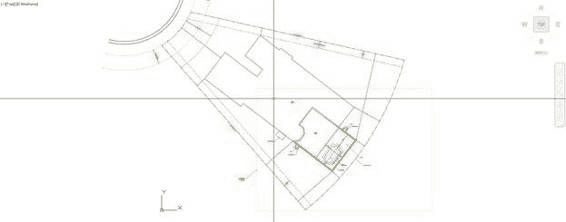

让我们首先在建筑物足迹上添加舱口。使用首选缩放工具缩放到建筑区域附近。建筑物足迹是深蓝色折线，如上图所示。继续执行以下步骤：

通过从“主页”选项卡“图层”面板的“图层”列表中选择，激活图层 L-Deck Pavers 。

|  | 注意：确保在选择图层之前未选择任何对象。选择一个或多个对象时选择图层会将所选对象分配给图层。在选择图层之前按 Escape（Esc）键取消任何选择。 |

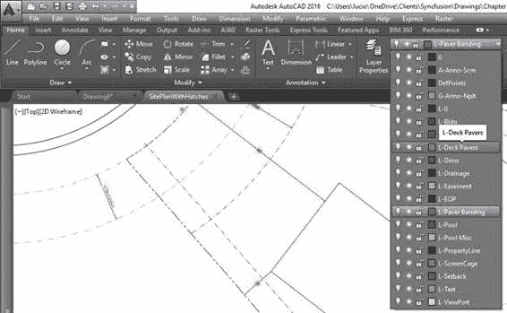

图 74：激活图层

移动 UCS 并将其放在建筑物的左上角。

1.  单击绘图区域左下角的 UCS 图标。显示描绘原点的蓝色框和每个轴末端的两个蓝色圆圈。
2.  单击蓝色框并将其拖动到建筑物的左上角。确保看到描绘线条终点的琥珀色矩形，然后再次单击鼠标。
3.  单击描绘 X 轴的蓝色圆圈以旋转 UCS，然后选择设置原点的同一行以南的一个点。应显示 UCS 图标，如下图所示。按 Escape 键取消选择。请注意，您的光标已更改为与 UCS 方向匹配。您现在创建的任何内容都将指向此 UCS。

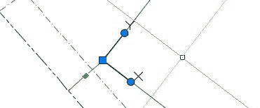  

单击剖面线工具或输入 H 运行影线命令，然后按 ] 在命令窗口中输入 。

命令：H 8

Hatch（Hatch Creaion）上下文选项卡显示在功能区中。在 Boundaries 面板中，单击 选择 工具。

选择对象或[picK 内部点/撤消/设置]：_ S

单击建筑物足迹边界将其添加到选择集。

选择对象或[picK 内部点/撤消/设置]：1 找到

填充图形在选定边界上显示为实心灰色填充。确保在 Pattern 面板中选择 ANSI31，然后在 Properties 面板中将比例设置为 96 并按 输入 。

选择对象或[picK 内部点/撤消/设置]：按 Escape（Esc）键完成命令。

再次将 UCS 移动到卡座区域，如下图所示：

在“主页”选项卡的“图层”面板中，单击**关闭图层**工具（请参见下图）。

命令：LAYOFF

当前设置：视口= Vpfreeze，块嵌套级别=块

选择要关闭的图层上的对象或[设置/撤消]：单击文本对象。

图层“L-Text”已关闭。

选择要关闭的图层上的对象或[设置/撤消]：单击尺寸对象。

图层“L-Dims”已关闭。

选择要关闭的图层上的对象或[设置/撤消]：单击门或代表屏蔽外壳的 MultiLine 对象。

图层“L-ScreenCage”已关闭。

选择要关闭的图层上的对象或[设置/撤消]：单击池区域内的任何浅蓝色线

层“L-Pool Misc”已关闭。

选择要关闭的图层上的对象或[设置/撤消]：按 Esc 键

|  | 提示：关闭图层有助于选择正确的边界以及提高选择性能。 |

再次运行 Hatch 命令。

命令：H 8

在 Boundaries 面板中，单击 Pick Points 工具。

选择内部点或[选择对象/撤消/设置]：单击所有四个摊铺机指定区域内部，Lanai，Pool Deck 和 Door paddings，如下图所示：

|  | 提示：如果选择了错误的边界，可以通过单击快速访问工具栏中的“撤消”工具或输入 U 然后在命令窗口中按 Enter 来撤消选择。 |

在 模式面板 中，滚动查找并选择 AR-HBONE 模式。

在 属性面板 中，输入 1 [在 孵育模式量表 框中的 TAG14] 并按 输入 。

按 Esc 键结束命令。

从 View Cube 帮助器中，单击 View Cube 下方的下拉菜单，然后选择 8 返回 UCS 到其原始状态。

来自 TAG14] 选项卡，单击 打开 工具上的所有图层，如所示] 图 75 ，显示您在之前命令中隐藏的所有图层（您将在第 4 章中了解有关图层管理的更多信息）。

图 75：打开所有图层

将图形保存为 MySitePlan.dwg 。

如果需要在阴影区域进行修改，请通过单击选择阴影。 “功能区编辑器”上下文选项卡在功能区中激活，因此您可以进行所需的更改。

|  | 注意：编辑在另一个 UCS 上创建的填充将重置填充以匹配当前的 UCS。确保在编辑填充之前正确设置 UCS。 |

## 几何建筑助手

### 点

图 76：功能区中的点工具

命令：POINT

别名：PO

点是可以作为助手使用的对象，您可以使用 OSNAP 节点选项进行捕捉。命令分割和测量（本节稍后介绍）沿选定对象创建点。

在屏幕上可能会很难看到积分。要更改点的显示方式，请单击 Home 选项卡 **Utilities** 面板中的 **Point Style** 工具（图 77）或输入 PTYPE 并按 TAG6]在命令窗口中输入以显示“点样式”对话框，并选择您希望如何显示该点。

图 77：功能区中的点样式工具

|  | 注意：点如图所示绘制在屏幕上;确保将外观更改为所需的样式，以避免不必要的绘图重新绘制。另一种选择是在非绘图层上创建点，例如 Defpoints 图层（在标注尺寸时自动创建）或自定义非绘图图层（您将在第 4 章中了解有关图层的更多信息）。 |

### XLINE（构造线）

图 78：功能区中的构造线工具

命令：XLINE

别名：XL

**XLINE** 是一个无限长的线性物体;它没有起点或终点。 **在 Zoom Extend 操作中忽略 XLINES** 。

**XLINE** 提示如下：

指定一个点或[Hor / Ver / Ang / Bisect / Offset]：

**Point** ：指定 XLINE 通过的点。

**Hor 或 H** ：创建与当前 UCS X 轴平行的 XLINE（垂直于 Y 轴）。

**Ver 或 V** ：创建垂直于当前 UCS X 轴（平行于 Y 轴）的 XLINE。

**Ang** ：允许用户指定从 X 轴逆时针测量的 XLINE 角度（默认情况下）。

**Bisect** ：创建一个 XLINE，将由三个点选择的角度平分：假想弧的顶点，起点和终点。

**偏移**：创建与给定距离或选定点的现有线性对象平行的 XLINE。

### 射线

图 79：功能区中的 Ray 工具

命令：RAY

光线类似于 XLINES，不同之处在于光线只在一个方向上无限延伸。如果你在一个点上修剪一个 XLINE，它将变成一条光线。

### 分割

图 80：功能区中的分割工具

命令：DIVIDE

别名：DIV

在给定数量的等长段中划分几何对象（线，折线，圆弧，圆，椭圆或样条曲线）。默认情况下，段划分用 Point 对象标记。

除命令提示如下：

选择要分割的对象：

输入段数或[Block]：

如果在上一个提示中选择了 Block，则会显示以下提示：

输入要插入的块名称：

将块与对象对齐？ [是/否]&lt; Y&gt;：

图 81：块与对象对齐（左）而未对齐（右）

您将在第 5 章中了解块。

### 测量

图 82：功能区中的测量工具

命令：MEASURE

别名：ME

在给定给定长度的数字段中划分几何对象（线，折线，圆弧，圆，椭圆或样条曲线）。默认情况下，段划分用 Point 对象标记。

测量和分割命令的工作方式相同。唯一的区别是在 Divide 命令中，用户输入所需段的数量，并计算段长度。在 Measure 命令中，用户输入所需的段长度，并计算分割数。

## 显示清理

### 重绘

命令：REDRAW

别名：R

在活动视口中执行快速显示刷新并删除临时图形帮助程序。

### Regen

命令：REGEN

别名：RE

随着您的绘图变大并且您缩放并平移到绘图的许多不同区域，最终，当您更接近弯曲对象时，它可能看起来是刻面的，并且阴影可能看起来很破碎。更改“注释比例”设置时，还需要重新生成图形。

这是因为 AutoCAD 重新调整图形以提高显示性能，但不会自动重新调整。为此，运行 Regen 命令从活动视口中重新生成整个图形，如下所示：

*   重新计算所有对象的位置和可见性
*   重新索引绘图数据库以优化显示和对象选择性能
*   重置可用于平移和缩放的整个区域

### RegenAll

命令：REGENALL

别名：REA

执行所有 Regen 进程，但适用于空间或布局中的所有视口。