# 第 4 章：管理绘图

## 选择对象

无论何时需要修改绘图，都需要选择愿意更改的对象。 AutoCAD 包含许多帮助选择对象的方法。您可以选择不在冻结或锁定图层中的任何对象。

您可以在运行命令之前或之后选择对象。如果在未选择任何对象的情况下运行命令，AutoCAD 将在命令窗口中显示以下提示：

选择对象：

您可以通过单击它或使用窗口，窗口交叉或套索来选择对象，而无需其他提示。

### 窗口

从由左到右选择的两个点定义的矩形区域内完全选择所有对象。

要开始选择，请单击要选择的一个或多个对象（上方或下方）的绘图区域（不要按住鼠标按钮）并向右移动鼠标以在对象周围创建一个矩形区域或对象。选择窗口填充蓝色，边框实线。

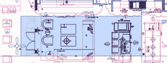

图 83：窗口选择

### 窗口交叉

选择由从右到左选择的两个点定义的矩形区域内部或交叉的所有对象。

选择窗口以绿色填充，带有虚线边框。

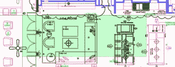

图 84：交叉选择

### 套索

您可以通过按住鼠标左键并绘制您想要选择的对象来选择对象。与窗口和窗口交叉选择类似，开始从左向右拖动鼠标以选择完全位于套索边界内的所有对象。从右到左（Crossing Lasso）将选择套索内的所有物体以及套索边界穿过的物体。

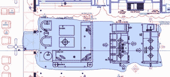

图 85：套索选择

|  | 提示：您可以从“选项”对话框的“选择”选项卡中取消激活“套索选择”模式。取消选中“允许按下并拖动 Lasso”复选框。 |

### 命令提示符选项

**全部**：选择图形中的所有对象，包括其他空间上的对象（冻结或锁定图层上的对象除外）。

选择对象：全部 8

6110 发现（204 重复），共 5217

893 不在当前空间。

Last 或 L ：选择活动绘图空间中最后创建的对象，假设对象的图层既未冻结也未锁定。

选择对象：L

1 发现

**交叉**：与窗口交叉相同，但允许交叉选择到任何方向。

**WPolygon 或 WP（窗口多边形）**：选择完全位于由点定义的多边形边界内的所有元素。

选择对象：WP

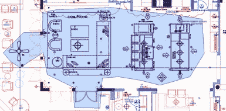

图 86：WPoligon 选择

**CPolygon 或 CP（交叉多边形）**：选择由点定义的多边形边界内部和交叉的所有对象。

选择对象：CP

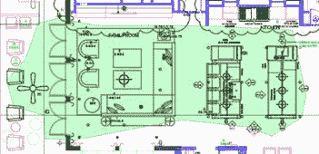

图 87：CPolygon 选择

**F 的栅栏：**与 **CPolygon** 类似，只是选择了只有边界穿过的物体。

选择对象：F

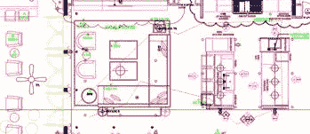

图 88：围栏选择

### 选择相似对象

选择相似对象允许用户选择与先前选择的对象类似的所有对象。如果要选择（例如）图形中的一组匹配块，则选择“类似”非常有用。

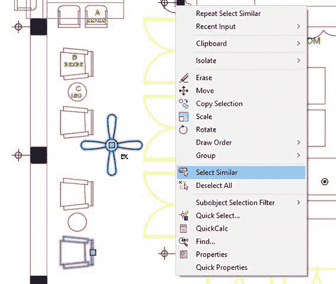

图 89：选择类似

要选择相似的对象，首先选择要用作参考的对象，然后右键单击鼠标以显示上下文菜单，然后单击**选择类似**，如图 89 所示。

## 管理图层

您在第 2 章中熟悉了图层和图层属性管理器。现在是时候回顾一下在 AutoCAD 中使用图层的强大功能了。大多数可用的图形设计软件都有一种在图层中组织绘图的方法。

您可以使用图层来控制图形或输出中对象的可见性，以及设置颜色，线型，线宽和透明度等属性。创建对象时，它会继承与创建对象的图层关联的属性，但您可以根据需要覆盖对象属性。当您看到显示为 **BYLAYER** 的对象属性时，表示该属性是从对象的图层继承的。

要打开**图层属性管理器**窗口：

在“主页”选项卡的“图层”面板中，单击**图层属性**工具。

命令：LAYER

别名：LA

### 层列表

“图层特性管理器”窗口中的图层列表显示图形中的图层列表和属性。您可以通过单击列标题对列表进行排序。

图 90：图层列表

|  | 提示：按住 Shift 键选择一组连续的图层，或按住 Ctrl 键选择交替图层。 |

图层列表包含以下列：

*   状态 ：显示描绘图层状态的图标。带有绿色复选标记的图层是当前图层。要将另一个图层设置为当前图层，请双击图层状态或图层名称。
*   名称 ：显示图层名称。要重命名图层，请选择图层并按 F2。
*   开 ：打开或关闭所选图层。在绘图时，关闭图层以使图层在显示中不可见。 “关闭”层中的对象参与再生过程和一些选择方法。
*   冻结： 冻结图层不可见，未绘制，在选择对象和重新生成图形时会被忽略。这改善了复杂绘图的性能和再生时间。
*   **锁定**：虽然您可以在图层中添加新对象，但无法修改锁定图层中的对象。
*   **颜色**：定义图层的颜色。
*   **Linetype** ：定义图层的线型。
*   **线宽**：设置图层线宽。
*   **透明度**：将图层的透明度级别设置为 0 到 90，其中 0 表示完全不透明。
*   **Plot Style** ：允许选择图层的打印样式。如果绘图图样式策略是颜色相关的绘图样式，则禁用此选项。
*   **Plot：**设置绘图时对象的可见性。设置为无绘图时，对象将显示在屏幕上，但不会显示在绘图中。
*   **新 VP 冻结**：定义图层在布局选项卡上新创建的视口中是否可见。
*   **描述**：您可以输入图层的友好描述。此字段是可选的，您可以按 F2 进行编辑。

### 层面板工具

图 91：图层面板

默认情况下，“图层”面板位于“主页”选项卡中，并包含以下工具：

 **图层属性**：打开图层属性管理器，您可以在其中添加新图层，编辑现有图层的属性，管理图层过滤器和状态，或删除空图层。

**图层列表**：显示当前（活动）图层。所有新对象都分配给该图层。您还可以从此列表中激活另一个图层，或更改对象选择的图层属性。您还可以从此列表中更改图层状态。

图 92：图层列表下拉列表

|  | 注意：如果愿意激活另一个图层，请确保没有选择任何对象。使用选定的一个或多个对象更改列表中的图层会将对象分配给选定的图层。 |

 **关**：通过选择对象关闭图层。使用此命令清除视图并便于阅读图形或绘图。

 **隔离层**：此命令将关闭除选定对象以外的所有层。当愿意只与某些物体一起工作时非常有帮助。例如，您可能只想在墙壁，窗户和门上工作并隐藏所有尺寸，天花板平面图，注释等。使用图层取消隔离命令恢复图层状态。

 **冻结**：通过选择对象冻结图层。

 **锁定**：通过选择对象锁定图层。当您需要查看并捕捉图层中的对象而不会有意外修改或删除这些对象的风险时，这非常有用。

**使当前**：使所选对象成为当前（活动）层。

**图层打开**：打开图形中的所有图层。

 **Un-Isolate Layers** ：恢复最后一个 Layer Isolate 命令之前的图层状态。

**解冻所有图层**：解冻（解冻）图形中的所有图层。它不会解冻在 Paper Space 布局中冻结的图层。

**解锁**：单击对象解锁图层。

**匹配层**：此命令允许用户将其他对象的图层与选定对象的图层进行匹配。

### 处理图层

在本主题中，我们将处理现有文件以编辑图层，隐藏和隔离图层和对象，以及编辑现有对象。请继续执行以下步骤：

1.  打开 AutoCAD（如果尚未打开）。
2.  打开位于**第 04 章**文件夹中的**第一平面图**绘图。该图是一个建筑计划，包括基本调查和景观规划。绘图很难阅读，所以让我们关闭一些图层以便于阅读。
3.  Zoom closer to the center of the house so that the Great Room fits in the drawing area.

    

4.  在**主页**选项卡，**图层**面板中，单击**关闭**工具（请参阅本章前面的图层面板工具主题）。
5.  随机单击某些对象以关闭其指定的图层。如果您不小心关闭了图层，请输入 **U** 并按**确定**以恢复最后一层图像。您可以根据需要使用鼠标滚轮进行平移和缩放，而不会中断命令。
6.  按**输入**，**空格键**或 **Esc** 完成命令。

|  | 注意：您可能会在命令窗口中收到警报，通知您正在尝试关闭当前图层。你必须确认行动。建议不要关闭当前图层，因为您可以创建在打开图层之前不可见的新对象。 |

要重新打开所有图层，单击图层面板中的**图层**工具，或在命令窗口中键入 **LAYON** ，然后按 **Enter** 或**空格键**。关闭的所有图层现在都已打开。

您也可以直接从**图层属性**窗口或**图层**面板中的**图层列表**打开或关闭图层;灰色灯泡表示图层已关闭，黄色灯泡表示图层已打开。

打开**图层属性窗口**并关闭以下图层：

A-Anno-Det-TAG，A-Anno-Dims，A-Anno-E-Dr-TAG，A-Anno-Elev-TAG-48，A-Anno-Mas-Dim，A-Anno-Mas-Slab- Elev，A-Anno-Mas-Text，A-Anno-TieB-Txt，A-Anno-Win-TAG，A-Clng-Circ，A-Clng-Head，A-Clng-Lite，A-Flor-Case， A-Furn-Free，A-Grid-Cntr，A-Roof-Lines，A-Site-Hatch，A-Site-Vegn，A-Str-Slab-Edge，A-Str-Tie-Beam，A-Str- TieBm-Htch，S-Anno-Site-spot elev，S-Anno-Site-Text 和 S-Site-Misc。

如果需要，请关闭图层属性。

平移并缩放到泳池区域并单击图层面板中的**隔离**工具按钮，或在命令窗口中键入 **LAYISO** 并按**输入**或**空格键**。

|  | 提示：默认情况下，LAYISO 命令（隔离工具）锁定并淡化未选定对象的图层。要关闭图层，请在命令窗口中输入 S，按 Enter 键，键入 O，然后按 Enter 键。对于新图形或 AutoCAD 部分，将保留此设置，直到您再次更改它为止。 |

选择池中的任何一行，然后按 **Enter** 。

单击**图层**面板中的 **Unisolate** 工具按钮，或在命令窗口中键入 **LAYUNISO** ，然后按 **Enter** 或**空格键**，恢复以前的状态。

将图形保存为**我的第一层平面图**并关闭图形。

## 修改对象

AutoCAD 提供了许多工具来支持重用和修改现有对象。大多数这些工具都位于“主页”选项卡的“修改面板”（图 93）中。

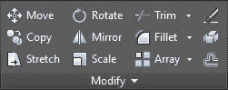

图 93：修改面板

常用提示选项 ：

*   选择对象 ：选择要修改的对象。
*   基点 ：选择要用作参考点的点

### 移动

将所选对象移动到新位置。

命令：MOVE

别名：M

### 复制

在新位置创建所选对象的副本。

命令：COPY

别名：CP 或 CO

提示选项 ：

*   模式 ：更改选项以允许在单个命令中创建多个（多个）副本，或在创建一个副本后完成命令（单个）。
*   数组 ：创建一个具有等间距对象数的线性数组。
*   要排列的项目数
*   第二点 ： 定义阵列相对于基点的距离和方向。数组中的第一个元素位于指定的距离，其余元素在此给定距离处均匀分布。
*   适合 ：以等间距创建对象的多个副本，以适合选定的距离。

### 旋转

将基点周围的一个或多个对象旋转到绝对角度。

命令：ROTATE

别名：RO

提示选项：

*   **旋转角度**：定义旋转轴穿过所选基点并与当前 UCS 方向匹配的旋转角度。
*   **复制**：创建所选对象的副本以进行旋转。
*   **参考**：允许用户指定一个新角度作为基准角度。然后，参考新选择的角度旋转对象。

### 偏移

创建与原始对象平行或同心的所选对象的副本。

命令：OFFSET

别名：O

提示选项 ：

*   **偏移距离**：指定距离源对象的距离。
*   **退出**：退出命令。
*   **多个**：使用当前偏移距离重复偏移操作。
*   **撤消**：反转上一个偏移。
*   **通过**：创建通过指定点的对象。

### 拉伸

拉伸命令允许您通过拉伸由本章前面的“选择对象”主题中描述的交叉窗口或其他交叉选择方法所包围的点来修改所选对象。

命令：STRETCH

别名：S

### 镜像

创建从选定对象镜像的新对象。

命令：MIRROR

别名：MI

提示选项：

*   **指定第一个点，镜像线的第二个点**：定义一个像镜子一样的线。所有选定的对象都通过镜像线镜像。从镜像对象的点到镜像线的距离与源对象到镜像线的点的距离相同。
*   **擦除源对象**：用于保留或删除源对象的选项。

### 比例

通过指定基点和比例因子来调整一个或多个对象的大小。负比例因子反映了选择。

命令：SCALE

别名：SC

### 修剪

Trim 命令允许用户在选定的修剪边界处修剪对象。要将所有现有对象用作修剪边界，请在第一个提示中按**输入**进行对象选择。例如， Trim 命令可用于修剪墙壁开口处的线条。

命令：TRIM

别名：TR

|  | 提示：选择要修剪的对象时使用 Shift +单击将扩展对象而不是修剪它。 |

### 延长

扩展所选对象以触摸先前选定的边界。此命令与 Trim 命令的工作方式类似。

命令：EXTEND

别名：EX

|  | 提示：在选择要修剪的对象时使用 Shift +单击将修剪对象而不是扩展它。 |

### 圆角

从两个对象创建一个圆角。默认情况下，圆角会根据需要自动修剪或扩展打开的对象（直线，圆弧，开放折线）。

命令：FILLET

别名：F

提示选项：

*   **撤消**：撤消命令部分中的上一个圆角。
*   **折线：**使用指定的圆角半径舍入折线的所有角。
*   **半径**：设置圆角半径。
*   **修剪：**定义是否要修剪圆角片段。
*   *   **修剪**。修剪选定的段以满足圆角的端点。这是默认设置。
    *   **无修剪**。选定的段将被保留并且不会被修剪。
*   **Multiple** ：允许用户在单个命令运行中创建多个圆角。

### 斜角

从两个非平行线性段创建一个斜角。

命令：CHAMFER

别名：CHA

提示选项：

*   **撤消**：撤消命令部分中的上一个倒角。
*   **折线：**使用指定的距离对折线的所有角进行倒角。
*   **距离**：设置倒角距离。
*   *   **指定第一个倒角距离**：第一个选定行的倒角距离。
    *   **指定第二个倒角距离**：第二个选定行的倒角距离。
*   **Angle** ：设置所选元素交叉点的倒角距离和第一个段的角度。
*   **修剪：**定义是否要修剪圆角片段。
*   *   **修剪**。修剪选定的段以满足倒角的端点。这是默认设置。
    *   **无修剪**。将创建倒角线段，但会保留原始选定的线段。
*   **Multiple** ：允许用户在单个命令运行中创建多个倒角。

### 折线编辑

此命令允许用户编辑折线或从现有直线，圆弧和样条线创建新折线。

命令：PEDIT

别名：PE

提示选项：

*   **关闭：**通过创建将最后一个点连接到折线中第一个点的线段来关闭折线。
*   **打开：**删除关闭折线的线段。
*   **加入：**允许用户向折线添加其他元素。折线必须打开，要添加的元素必须共享结束点或起点。
*   **宽度：**设置折线宽度。这是一个可扩展的值。如果宽度值大于零，则缩放输出宽度以匹配绘图比例。
*   **编辑顶点：**允许用户单独编辑折线中的每个顶点。
*   **拟合：**创建一条曲线折线，每条折线顶点上都连接有弧线。
*   **样条曲线：**将折线转换为样条曲线拟合折线，其中折线的每个顶点都是样条控制点。
*   **Decurve** ：拉直弯曲的折线。所有弯曲段都成为线性段。
*   **Ltype gen：**将非连续的线型分配给图层或折线时有用。启用此功能后，将连续生成折线线型，而无需在每个线段上重新启动。
*   **Reverse：**反转折线的顶点顺序。
*   **撤消：**通过折线编辑部分撤消每个动作。

### 数组

Array 命令可以创建均匀间隔的对象副本，并可以创建为矩形，径向（极坐标）或跟随路径。阵列工具位于“主页”选项卡的“修改”面板中，如下图所示：

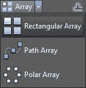

图 94：阵列工具

命令：ARRAY

别名：AR

ARRAY 命令有以下选项：

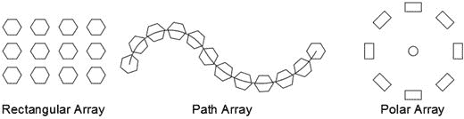

图 95：数组类型

以下选项适用于所有阵列创建方法：

*   **Associative** ：指定阵列对象是关联的还是独立的。
*   *   **是：**数组创建为包含源对象的多个实例的单个对象。关联数组允许在命令完成后通过“数组上下文”选项卡的“属性选项板”编辑数组，以及编辑源对象。
    *   **否**：生成的数组由独立对象组成，无法动态编辑，编辑源对象不会影响其他对象。
*   **基点**：允许用户设置阵列的基点和基点夹点。
*   **退出或关闭阵列**：结束命令。

#### 长方形

矩形数组由行和列组成。创建矩形数组的替代命令是 ARRAYRECT 。

您可以通过在调用命令之前或之后选择对象来创建数组。完成对象选择后，功能区中将显示“阵列创建”上下文选项卡，如图 96 所示

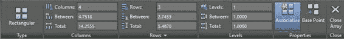

图 96：矩形阵列上下文选项卡

创建矩形数组的选项是：

*   **列**：指定数组中的列数。按照当前 UCS 的 **X** 方向创建列。
*   *   之间：在当前 UCS 的 **X** 方向上设置数组中元素中心之间的距离。
    *   **Total** ：设置当前 UCS 的 **X** 方向上阵列的总长度。
*   **行**：指定数组中的行数。按照当前 UCS 的 **Y** 方向创建行。
*   *   之间：在当前 UCS 的 **Y** 方向上设置阵列中元素中心之间的距离。
    *   **Total** ：设置当前 UCS 的 **Y** 方向的阵列总长度。
*   **级别**：指定阵列中的数字级别。在当前 UCS 的 **Z** 方向之后创建级别。
*   *   之间：在当前 UCS 的 **Z** 方向上设置阵列中元素中心之间的距离。
    *   **Total** ：设置当前 UCS 的 **Z** 方向上阵列的总长度。

#### 路径

创建沿选定路径均匀分布的对象数组。创建矩形数组的替代命令是 ARRAYPATH 。

要创建路径数组：

1.  单击 **Path Array** 工具
2.  如果在调用命令之前未选择任何对象，请沿路径选择要分发的对象（源对象）。按**确定**完成选择。
3.  选择分发路径。路径可以是直线，折线，三维多段线，样条曲线，螺旋，圆弧，圆或椭圆。

将在功能区中激活“路径阵列创建”上下文选项卡，如下图所示：

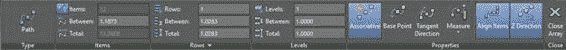

图 97：Path Array Creation 面板

创建路径数组的选项是：

*   **方法**：控制如何沿路径分配项目。
*   *   **测量**：沿输入距离等距离的点沿路径分布对象。
    *   *   **Items** ：指定要分发的实例数
    *   **除以**：沿路径分布对象以填充输入的距离。计算项目之间的距离。
    *   *   之间：指定沿路径实例化的对象的距离（中心到中心）。
*   **切线方向**：指定数组中的对象相对于路径起始方向的对齐方式。选择两个点，这两个点定义要在整个路径中分布的数组中第一个元素的切线。
*   **Rows** ：指定数组中的行数，它们之间的距离以及行之间的增量高程。
*   *   **行数**：定义沿路径的行数。
    *   **行之间的距离**：标识每行均匀分布的距离。
    *   **Total** ：定义第一行和最后一行之间的总距离。
*   **对齐项目**：设置时，数组中的项目将旋转以跟随路径，否则项目将保持与源对象相同的方向。

#### 极性

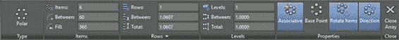

极坐标阵列通过围绕选定点旋转来重复选定的对象，如下图所示：

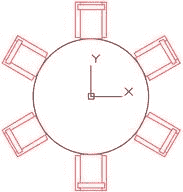

### 爆炸

将所选对象转换为下一个原始级别。例如，爆炸折线将折线转换为常规的独立线和弧段。

命令：EXPLODE

别名：X

### 删除

Erase 命令从图形中删除所选对象。它不会将对象复制到剪贴板以便粘贴到其他位置。

命令：删除

别名：E

快捷方式：DEL 键

|  | 提示：OOPS 命令可以恢复最后擦除的对象，而与擦除后执行的命令数无关。 |

### 使用夹具

如果在没有运行命令时选择对象，则所选对象在每个顶点节点或对象的基点上显示小的实心方块（图 98）。这些方块称为夹点（蓝色夹点称为冷夹点），您可以通过快速拖动夹点拉伸，移动，旋转，缩放或镜像对象来编辑对象。可以使用更多编辑选项，具体取决于对象的类型。您选择执行的操作称为抓握模式。我个人使用夹点比使用任何其他方法更频繁地编辑对象。

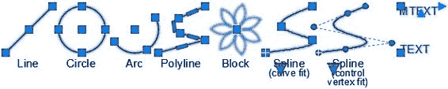

图 98：抓住所选对象

|  | 注意：夹点不会显示在锁定图层上的对象上。 |

要使用夹点编辑对象，请单击手柄，手柄变为红色，称为热手柄。默认情况下，编辑处于拉伸模式。右键单击鼠标以显示上下文菜单（图 99）以选择其他操作。

选择并修改多个夹点

您可以在选择手柄时按住 **Shift** 键选择各种夹点。选定的夹点称为多个热夹具选择并参与编辑操作;它们主要用于使用夹具拉伸物体时。在加热所需的夹点后，松开 **Shift** 键并选择一个温暖或冷的夹具，以用作基点（或参考点）来执行操作。

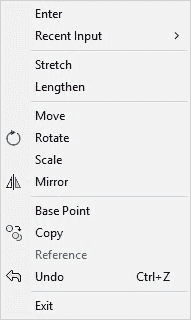

图 99：手柄模式上下文菜单

用握把伸展

要使用夹点拉伸对象，只需单击要拉伸的夹点，在夹点变为红色后，将夹点移动到新的所需位置。

|  | 注意：使用圆形和椭圆形等对象时，显示的夹点用于对象中心点和四个象限。在这种情况下，距离是从物体的中心（或径向距离）测量的，像拉伸这样的动作实际上会改变物体半径，而不是来自所选夹点的位移。 |

用夹子移动

1.  选择要用作参考点的手柄。
2.  右键单击鼠标并选择 **Move** 。
3.  将所选对象移动到所需位置，然后单击以放置对象。
4.  按**确定**，**空格键**或 **Esc** 取消抓握模式。

用把手旋转

1.  选择要用作参考点的手柄。
2.  右键单击鼠标并选择**旋转**。
3.  如果旋转中心点（基点）不合适，请右键单击鼠标并选择**基点**以选择新的基点。
4.  移动鼠标以旋转所选对象，然后单击以放置对象。
5.  按**确定**，**空格键**或 **Esc** 取消抓握模式。

用握把缩放

1.  选择要用作参考点的手柄。
2.  右键单击鼠标并选择 **Scale** 。
3.  如果缩放基点不合适，请右键单击鼠标并选择 **Base Point** 以选择新的基点。
4.  **输入**比例因子值并按**输入**，或移动鼠标以动态缩放所选对象，然后单击以放置对象。
5.  按**确定**，**空格键**或 **Esc** 取消抓握模式。

带把手的镜子

1.  选择要用作参考点的手柄。
2.  右键单击鼠标并选择 **Mirror** 。
3.  如果镜像基点不合适，请右键单击鼠标并选择 **Base Point** 以选择新的基点。
4.  选择镜像线的第二个点。

使用夹点制作多个副本

1.  按**输入**，**空格键**或 Esc 取消抓握模式。
2.  从上下文菜单中选择所需的操作。
3.  按 **C** 并按**确定**，或在执行操作时按住 **Ctrl** 键。继续复印，直至按**确定**，**空格键**或 **Esc** 。

### 手动编辑对象

在本练习中，您将练习许多方法来编辑对象。我们要开展的工作是一个景观规划。

1.  如果尚未打开，请打开 AutoCAD。
2.  打开位于**第 04 章**文件夹中的图**横向平面图**。
3.  将图形另存为**我的横向平面图**。
4.  缩放到泳池区域，以便整个泳池适合绘图区域。

让我们首先使用 Offset 命令创建池步骤

命令： O 8

指定偏移距离或[通过/擦除/层]＆lt; 1'-0“＆gt;： 12 8

选择要偏移的对象或[退出/撤消]＆lt;退出＆gt;：选择分隔货架的线，如下图所示：

1 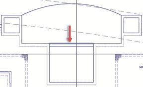

指定偏移一侧的点或[退出/多个/撤消]＆lt;退出＆gt;：单击所选行下方的任意位置。

选择要偏移的对象或[退出/撤消]＆lt;退出＆gt;：选择新创建的行。

指定偏移一侧的点或[退出/多个/撤消]＆lt;退出＆gt;：单击所选行下方的任意位置。

选择要偏移的对象或[退出/撤消]＆lt;退出＆gt;：按 Enter，空格键或 Escape（Esc）完成命令。

接下来让我们在游泳池的拱形边缘创造一个消失的边缘和低谷。

命令： O 8

指定偏移距离或[通过/擦除/层]＆lt; 1'-0“＆gt;： 8 8

选择要偏移的对象或[退出/撤消]＆lt;退出＆gt;：选择弧

指定偏移的一侧或[退出/多个/撤消]＆lt;退出＆gt;：单击弧下方的任何位置

选择要偏移的对象或[退出/撤消]＆lt;退出＆gt;：按 Enter，空格键或 Escape（Esc）完成命令。

命令：按 Enter 键或空格键重复上一个命令

指定偏移距离或[通过/擦除/层]＆lt; 0'-8“＆gt;： 2'6” 8

选择要偏移的对象或[退出/撤消]＆lt;退出＆gt;：选择顶部圆弧

指定偏移的一侧或[退出/多个/撤消]＆lt;退出＆gt;：单击弧上方的任何位置

选择要偏移的对象或[退出/撤消]＆lt;退出＆gt;：按 Enter，空格键或 Escape（Esc）完成命令。

命令：按 Enter 键或空格键重复上一个命令

指定偏移距离或[通过/擦除/层]＆lt; 3'-0“＆gt;： 12 8

选择要偏移的对象或[退出/撤消]＆lt;退出＆gt;：选择新创建的弧

指定偏移的一侧或[退出/多个/撤消]＆lt;退出＆gt;：单击弧上方的任何位置

选择要偏移的对象或[退出/撤消]＆lt;退出＆gt;：按 Enter，空格键或 Escape（Esc）完成命令。

请注意，使用 offset 命令创建的新弧不会触及池边界。为了解决这个问题，我们将使用 Extend 命令。

命令： EX 8

选择对象或＆lt;全选＆gt;：选择如下图所示的行，然后按 Enter 或空格键确认选择。

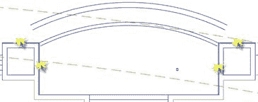

选择对象以进行扩展或移位选择以修剪或[围栏/交叉/项目/边缘/撤消]：

路径不与边界边相交。

选择要扩展的对象或移动选择以修剪或[围栏/交叉/项目/边缘/撤消]：在创建的弧的每个端点附近点击以延伸

选择要扩展或移位选择对象以修剪或[围栏/交叉/项目/边缘/撤消]：按 Enter，空格键或 Esc 完成

按 Ctrl + S 保存图形。

现在让我们在泳池甲板的右侧建造楼梯台阶。缩放到该区域，使其适合绘图区域，如下图所示：

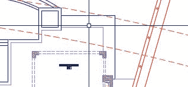

使用偏移命令来偏移：向右的垂直线和建议楼梯顶部的水平线。偏移距离为 12;对于建筑物，每条线重复三次偏移。结果应如下图所示：

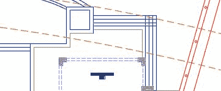

我们需要修剪和修剪线条。缩放到靠近修剪区域（步进线穿过的右上区域），然后按如下方式进行：

命令： TR 8

选择切削刃...

选择对象或＆lt;全选＆gt;：选择两个步骤行，如下图所示，然后按 Enter

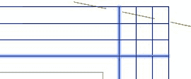

选择要修剪的对象或移位选择以扩展或[围栏/交叉/项目/边缘/ eRase /撤消]：单击交叉点右侧的水平线

选择要修剪的对象或移位选择以扩展或[围栏/交叉/项目/边缘/ eRase /撤消]：单击交叉点上方的垂直线

选择要修剪的对象或移位选择以扩展或[Fence / Crossing / Project / Edge / eRase / Undo]：按 Enter，空格键或 Esc 以完成命令

在这种情况下快速修剪分段的另一种方法是使用命令 Trim ，如下所示：

命令： F 8

选择第一个对象或[Undo / Polyline / Radius / Trim / Multiple]： R 8 （设置圆角半径）

指定圆角半径＆lt; 2'-3 11/16“＆gt;： 0 8 （设定半径为零） ）

选择第一个对象或[Undo / Polyline / Radius / Trim / Multiple]： M 8 （多个修剪动作）

选择第一个对象或[撤消/折线/半径/修剪/多个]：单击交叉点旁边的一条线。

选择第二个对象或 shift-select 以应用角或[半径]：单击最近的相交线

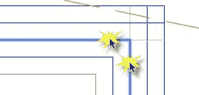

选择第一个对象或[撤消/折线/半径/修剪/多个]：单击交叉点旁边的一条线。

选择第二个对象或 shift-select 以应用角或[半径]：单击最近的相交线

选择第一个对象或[撤消/折线/半径/修剪/多个]：按 Enter，空格键或 Esc 完成命令

进行缩放，使整个泳池甲板适合绘图区域。在阳台和泳池架的左下角之间有一个桌子。我们需要另一侧的对称副本。我们可以通过使用 Mirror 命令完成此操作，如下所示：

命令： MI 8

选择对象：选择表格集

选择对象： 8

指定镜像线的第一个点：按住 Shift 并右键单击鼠标，从上下文菜单中选择 Mid。 _mid 点击池阶梯中点附近

指定镜像线的第二个点：按住 Shift 并右键单击鼠标，从上下文菜单中选择 Mid。 的 _mid 点击另一个泳池楼梯台阶的中点附近以创建垂直镜像线。

擦除源对象？ [是/否]＆lt; No＆gt;： N 8 （这将保持源，选择是擦除源对象）

按 Ctrl + S 保存图形，让 工作在网站的前部。

命令： Z 8

指定窗口的角，输入比例因子（nX 或 nXP）或[全部/中心/动态/范围/上一个/比例/窗口/对象]＆lt;实时＆gt;： E 8

我们首先需要改变摊铺机模式。为此，我们需要使用**填充编辑器**上下文选项卡编辑填充。如果需要，可以更靠近前院。

1.  选择车道舱口模式。 **填充编辑器**上下文选项卡将加载到功能区中。
2.  在 **Pattern** 面板中，找到并选择名为 **AR-HBONE** 的模式。
3.  在**属性**面板中，将比例更改为 **1** 。

车道现在呈现人字形舱口图案。

车道上有一个车辆（车轮），我们需要旋转它以适应车道的自然流动。我们可以使用 Move 命令，或者我们可以在 Grip 模式下旋转。没有规则可以使用哪种方法，但在这种情况下，让我们在 Grip 模式下旋转。

1.  选择车辆块。在汽车中心附近出现蓝色，坚固的抓地力。
2.  点击手柄;它变红了。进入拉伸模式（因为此对象是一个块，拉伸将充当移动）。
3.  右键单击鼠标，然后从上下文菜单中选择**旋转**。
4.  如果您知道旋转角度，则可以在此处输入值。在这种情况下，旋转角度是未知的，因此我们将选择方向。按住 **Shift** 键，右键单击鼠标，然后从上下文菜单中选择 **Center** 。
5.  单击其中一个弧段上的任意位置，创建拱形驱动器。
6.  按 **Esc** 取消该部分。

接下来，我们将在车道周围创建两个灌木床。有两条折线将定义分配表示灌木的对象的路径。右边的路径使对象位于路径的左端。在创建阵列之前，将灌木复制到左侧路径的一个端点。

*   选择灌木（中间有十字形的小绿色圆圈）。
*   单击块中心的夹点。
*   右键单击并选择 **Move** 。
*   右键单击并选择**复制**。
*   按住 **Shift** ，右键单击鼠标，然后选择 **Endpoint** 以覆盖对段的捕捉到端点。
*   单击左侧弧的端点附近。
*   按 **Esc** 完成 Grip 模式。
*   按 **Esc** 清除选择。
*   按 Ctrl + S 保存图形。

接下来，我们将创建一个遵循车道周围路径的数组。 单击 路径数组 工具启动路径数组。

选择对象：选择右侧折线路径末端的灌木块。

选择对象：按 Enter 提交选择。

选择路径曲线：选择阵列路径右侧的折线。

选择夹点以编辑阵列或[ASsociative / Method / Base point / Tangent direction / Items / Rows / Levels / Align items / Z direction / eXit]＆lt; eXit＆gt;：从 Array Creation 上下文选项卡，Items 在 panel 字段中输入 36，然后按 Enter 键。

选择夹点以编辑阵列或[ASsociative / Method / Base point / Tangent direction / Items / Rows / Levels / Align items / Z direction / eXit]＆lt; eXit＆gt;：按 Enter，空格键或 Esc 键完成命令。

重复前面的步骤，在车道左侧创建灌木床。

选择用于定义阵列路径的两条折线。您可能需要缩放以确保不选择阵列。

按 **Delete** 键删除路径。

放大靠近车道中央的棕榈树。有一个代表灌木的块，它需要排列在棕榈树周围。我们将使用 Array Polar 命令来完成此任务：

在 Home 选项卡的 Modify Panel 中，单击 **Polar Array** 工具：

命令：_arraypolar

选择对象：选择棕榈树符号下的灌木符号。

选择对象：按 Enter 确认选择并转到下一步。

指定数组的中心点或[基点/旋转轴]：按住 Shift 键，右键单击鼠标，然后从上下文菜单中选择插入： _ 将鼠标悬停在棕榈树上，琥珀色符号显示在符号的中心。左键单击鼠标以选择 Palm Tree Insertion 点作为数组的中心。

选择夹点以编辑阵列或[ASsociative / Base point / Items / Angle between / Fill angle / ROWs / Levels / ROTate items / eXit]＆lt; eXit＆gt;：在 Array Creation 上下文选项卡上，输入 12 作为项目计数，然后按 Enter 键。

选择夹点以编辑阵列或[ASsociative / Base point / Items / Angle between / Fill angle / ROWs / Levels / ROTate items / eXit]＆lt; eXit＆gt;：按 Enter 或 Esc 完成命令。

现在我们需要在庭院里建一个灌木床。庭院墙壁的左下角旁边有一个灌木符号。我们将使用该块创建一个矩形数组。

单击**矩形阵列**工具，然后按照以下步骤操作：

命令：_arrayrect

选择对象：选择灌木符号。

选择对象：按 Enter 确认选择并转到下一步。

选择夹点以编辑阵列或[ASsociative / Base point / COUnt / Spacing / COLumns / Rows / Levels / eXit]＆lt; eXit＆gt;：在阵列创建上下文选项卡，列面板上，为列输入 3 计数字段和 48 表示 Between 值（这是项之间的空间，基点到基点）。

选择夹点以编辑阵列或[ASsociative / Base point / COUnt / Spacing / COLumns / Rows / Levels / eXit]＆lt; eXit＆gt;： Rows Panel，为 Rows count 字段输入 8，为 Between 之间输入 48 值。

选择夹点以编辑阵列或[ASsociative / Base point / COUnt / Spacing / COLumns / Rows / Levels / eXit]＆lt; eXit＆gt;：按 Enter 或 Esc 完成命令。

接下来我们应该修改凉棚和车道之间的步行区域。放大到人行道。我们需要对人行道围裙的角落进行倒角，以创造更平滑的过渡。这将使用倒角命令完成：

命令： CHA 8

选择第一行或[Undo / Polyline / Distance / Angle / Trim / mEthod / Multiple]： D 8

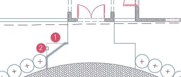

指定第一个倒角距离＆lt; 0'-0“＆gt;： 48 8 这是倒角距离第 1 行显示在上图中。

指定第二个倒角距离＆lt; 4'-0“＆gt;： 36 8 这是第 2 行所示的行号的倒角距离上图。

选择第一行或[Undo / Polyline / Distance / Angle / Trim / mEthod / Multiple]：左键单击上图中显示的行号 1。

选择第二行或 shift-select 以应用角或[距离/角度/方法]：左键单击上图中所示的行号 2。

重复上一个动作，也可以在人行道围裙的右侧露营。

要完成此练习，我们需要移动位于车道通道右侧的绿色圆圈，更靠近车道围裙，如下图所示，然后将树木添加到其他位置。请按以下步骤操作：

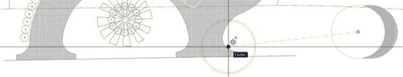

命令： M 8

选择对象：选择树符号。

选择对象：按 Enter 提交选择。

指定基点或[Displacement]＆lt; Displacement＆gt;：按住 Shift 键并右键单击鼠标。从上下文菜单中，选择“中心”。

指定基点或[Displacement]＆lt; Displacement＆gt ;: 的 _cen 单击树符号周长。

指定第二个点或＆lt;使用第一个点作为位移＆gt;：按住 Shift 键并右键单击鼠标。从上下文菜单中，选择中心 _cen of - 在弧上单击鼠标左键，如上图所示。

现在继续复制：

命令：CO

选择对象：选择您在上一个操作中重新定位的树符号。按 Enter 提交选择。

指定基点或[Displacement / mOde]＆lt; Displacement＆gt;：按住 Shift 键并右键单击鼠标。从上下文菜单中，选择的中心 _cen 单击树符号圆周。

指定第二个点或[数组]＆lt;使用第一个点作为位移＆gt;：将树符号复制到位置，如下图所示。确保使用中心对象捕捉覆盖。按 Enter 键，空格键或 Esc 键完成命令。

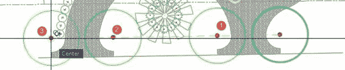

按 **Ctrl + S** 保存图形。

关闭图形，然后打开位于**第 04 章**文件夹中名为 **ColumnBase Partial** 的图形。这与我们在第 3 章中使用的列基础相同，以下练习的目的是将弧和线转换为单个折线。我们还将使用 Stretch 命令练习更改柱基的高度。

1.  From the Home tab, Modify panel, click on the **Stretch** tool.

    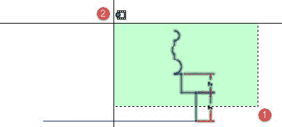

2.  单击要拉伸的对象右侧的点（上一个图片中显示的点 1），然后单击要拉伸的元素左侧的点（点 2）。所有要参与的点都是至关重要的。 Stretch 操作由 Crossing Window 包围，要交叉影响的元素由 Crossing Window 包围。
3.  按**输入**提交选择。
4.  单击绘图区域中的任意位置以标记基点。
5.  确保**极坐标跟踪**打开，并且角度增量包括 90º（请参阅第 2 章中的“其他输入法”部分）。
6.  在绘图区域中向上移动光标。对象开始沿光标方向伸展。确保 Polar Tracking 显示 90º，键入 **1** ，然后按 **Enter** 。
7.  基础被拉伸，尺寸更新为 4“。

接下来，我们需要连接元素来创建折线：

命令： PE 8

选择折线或[多个]：选择垂直蓝线（测量 4“），然后按 Enter 键。

因为所选对象是一条线（不是折线），AutoCAD 会确认是否应将其转换为折线。我们需要在提示中输入 Y 来接受：

选中的对象不是折线你想把它变成一个吗？ ＆LT; Y＆GT; Y 8

接下来我们将加入定义基本配置文件的其他段：

输入选项[Close / Join / Width / Edit vertex / Fit / Spline / Decurve / Ltype gen / Reverse / Undo]： J 8

选择对象：创建一个交叉窗口，如上图中的拉伸操作所示。 11 发现

选择对象：按 Enter 键将选定的段连接到折线。

8 个段添加到折线

输入选项[Close / Join / Width / Edit vertex / Fit / Spline / Decurve / Ltype gen / Reverse / Undo]：按 Enter，空格键或 Esc 完成命令。

|  | 注意：尺寸线会自动从选区中过滤，因为它们无法连接或转换为折线。 |

将鼠标放在新折线上以确认对象是否已连接。

让我们使用 Mirror 命令镜像复制折线以定义左侧的轮廓：

命令： MI 8

选择对象：选择折线。 1 发现

选择对象：指定镜像线的第一个点：按住 Shift 键并右键单击鼠标。从上下文菜单中，选择 Midpoint。 _

指定镜像线的第二个点：确保 Polar Tracking 打开，向上或向下移动光标 90 &lt;sup class="calibre72"&gt;o&lt;/sup&gt; ，然后单击鼠标左键以定义镜像线。

擦除源对象？ [是/否]＆lt; No＆gt;： N 8 （我们需要保留源对象。）

让我们将它们连接起来创建一条折线：

命令： PE 8

默认情况下，您只能编辑一条折线。我们将使用 Multiple 选项在一次运行中选择所有对象：

选择折线或[多个]： M 8

现在让我们选择绘图中的所有对象。尺寸对象自动从连接中排除：

选择对象： ALL 8

5 发现

选择对象：按 Enter 提交选择。

将直线，圆弧和样条线转换为折线[是/否]？ ＆LT; Y＆GT; Y 8

输入选项[Close / Open / Join / Width / Fit / Spline / Decurve / Ltype gen / Reverse / Undo]： J 8

输入模糊距离或[Jointype]＆lt; 0'-0“＆gt;： 0 8

10 个段添加到折线

关闭折线：

输入选项[Close / Open / Join / Width / Fit / Spline / Decurve / Ltype gen / Reverse / Undo]： C 8

输入选项[Close / Open / Join / Width / Fit / Spline / Decurve / Ltype gen / Reverse / Undo]：按 Enter，空格键或 Esc 完成命令。

现在，列基是一个折线对象。按 **Ctrl + Shift + S** 打开**将图形另存为**对话框。将绘图另存为 **MyColumnBasePL.dwg** 。

## 章节总结

在本章中，您学习了如何选择，修改，修改和创建对象的副本。 AutoCAD 的编辑功能超出了此处所涵盖的范围，您肯定会找到自己的方法来使用 AutoCAD 提供的许多修改工具。

在下一章中，您将学习如何以非常有效的方式重用对象。到时候那里见。