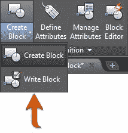
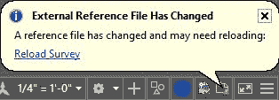
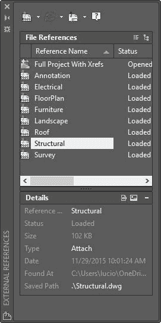

# 第 5 章：参考对象

随着您获得 AutoCAD 的使用经验，您很快就会意识到必须反复重复绘制和编辑相同的对象。 AutoCAD 提供的工具可以在同一图形中或在图形之间重复使用对象。

重用对象的一种方法是创建副本。您可以根据需要多次复制图形中的任何对象，以便在图形中的任何位置重复使用它。假设您在整个绘图中多次创建对象选择的副本。现在假设您的客户决定需要修改那些（重复的）对象的一部分。如果您选择的是普通几何图形（折线，圆弧，直线等），则必须找到每个副本并编辑或替换每个实例的受影响区域。

在本章中，您将学习如何使用两种非常有效的方法来重用对象：块和外部引用（XREF）。

## 块

块是由其他对象组成的单个对象，块中的每个元素可以具有自己的属性集。

块是时间和文件大小的储存器。定义块时，AutoCAD 会将其存储在当前图形的内部库中，称为“块表”。即使未在任何地方使用（插入），图形中也可能存在块，如果通过重新插入或复制创建块的多个实例，则所有实例都引用块库。如果编辑单个块引用，则同样更新所有其他块。

### 创建块

命令：BLOCK

别名：B 或 BL

在创建块之前，首先像创建任何绘图时一样绘制元素。为了说明创建一个块，我们将处理我们在前面章节中创建的 Column Base 图。

如果尚未打开 AutoCAD，请立即打开它，然后打开位于**第 05 章**文件夹中的图 **ColumnBase.dwg** 。

图形由定义柱基轮廓的蓝色折线和定义柱基过渡的灰线组成。

元素在已定义的图层上正确设置，但是有些做法虽然不是必需的，但在使用这样的简单块时变得非常方便：

*   将所有对象设置为图层 **0** 。第 0 层是一个“神奇”层，在隐藏或冻结图层时可以进行许多操作。
*   将所有属性设置为 **ByBlock** 。这将允许用户通过更改块属性来更改块元素的外观，如果块（对象）属性设置为 **ByLayer** ，则块将继承图层属性。如果设置为 **ByLayer** ，则块继承**图层属性**，块属性的更改不会影响块元素。
*   定义有意义的基点（插入点）。

同样，这些不是规则，但在低密度块上变得很方便。对于更复杂的块（例如详细信息），您可能希望维护所有属性，以便可以通过其他方式进行管理。

让我们改变这个块的对象属性：

1.  按窗口或窗口交叉选择所有对象。
2.  从 **Home 选项卡**， **Layers Panel** 中，从图层列表中选择 **Layer 0** 。
3.  从**属性**面板，将所有属性更改为 **ByBlock** （当前显示为 **ByLayer** ）。
4.  按 **Esc** 取消选择所有对象。
5.  从**图层面板**中，将图层 **0** 设置为当前图层。
6.  从 **Home** 选项卡， **Block** 面板，单击 **Create** 工具打开 **Block Definition** 对话框。
7.  在**名称**字段中输入 **Column Base** 。
8.  在**基点**区域中，单击**拾取点**。
9.  按住 **Shift** ，右键单击鼠标，然后从上下文菜单中选择 **Midpoint** 。
10.  单击最低水平线的中点附近。
11.  在**对象**区域中，单击**选择对象**。
12.  选择定义列基的所有对象，然后按**确定**。
13.  在**选择对象**区域中，单击**转换为块**。
14.  单击**确定**。

现在擦除源对象，并在当前层中插入新创建的块引用，源对象在此之前。

1.  选择块插入。
2.  从 **Home** 选项卡， **Layers** 面板，将块 Layer 更改为 **Column Base** ，然后按 **Esc** 清除选择。该块继承了 Layer 属性。
3.  将绘图另存为 **MyBlocks** 。

### 插入块

插入当前图形的块表中存在的块

命令：INSERT

别名：我或 INS

现在我们有了一个块，我们可以在图形中插入块的其他实例，或者您可以复制现有的实例。现在，让我们看看如何插入一个块：

1.  缩小到足以使您可以在绘图区域中至少再放置一个列基块。
2.  将 **ColumnBase** 设置为当前 **Layer** 。
3.  从 **Home** 选项卡， **Block** 面板，单击 **Insert** 工具，或键入 **I** （或 **INSERT** ）然后按**输入**或**空格键**。
4.  出现可用块列表。选择 **Column Base** 块。如果图形的块表中没有可用的块，则会显示“插入”对话框，因此您可以加载要作为块插入的图形。
5.  表示块的字形显示在光标处，单击绘图区域中的任意位置以插入块。
6.  尝试复制块，就像上一章中对植物块一样。

将现有图形作为块插入

通常，您需要从先前从制造商的网站创建或下载的文件库中插入图纸。理想情况下，要插入的图形是常规图形而不是图形中的已定义块，因为在插入时会创建包含所选图形中的元素的新块定义。

要将现有图形作为块插入当前图形中：

1.  从 **Home** 选项卡， **Block** 面板，单击 **Insert** 工具，然后单击 **More Options** 打开 **Insert** 对话框。
2.  单击**浏览**按钮并导航到您下载本书的练习文件的位置。在**第 05 章**文件夹中，选择名为 **sink.dwg** 的图形，然后单击**打开**。
3.  如果需要，您可以为块输入新名称。插入具有已存在于块表中的名称的图形将重新定义现有块。
4.  确保选中**指定屏幕上的**复选框，以便在绘图区域中选择插入点。
5.  单击**确定**。
6.  块标志符号出现在十字光标中;单击图形中的任意位置以插入块。
7.  该块插入当前层。

### 编辑块

命令：BEDIT

别名：BE

您可能需要对块进行更改。例如：我真的不喜欢显示列基过渡线的方式，并且它们可能会绘制为粗体，具体取决于绘图样式定义。我们将编辑列基块，以便过渡线为灰色：

1.  选择一个列基本块实例。
2.  右键单击鼠标，然后从上下文菜单中选择**块编辑器**。

绘图区域背景颜色更改为灰色，块编辑器上下文选项卡将加载到功能区中。您现在处于块编辑器模式。

图 100：块编辑器上下文选项卡

1.  选择连接整个柱基的所有七条线（不要选择轮廓折线）。
2.  如果看不到“特性”选项板，请按 **Ctrl + 1** 显示“特性”选项板。
3.  在**属性**调色板，**常规属性**上，单击颜色下拉菜单，然后从列表中选择**选择颜色**。
4.  在颜色文本框中，输入 **9** 并单击 **OK** 以设置所选对象的颜色。
5.  按 **Esc** 清除选择。
6.  单击**块编辑器**上下文选项卡中的**关闭块编辑器**。
7.  单击**保存**将更改保存到 **Column Base** 。
8.  块的所有实例都会更新。

|  | 提示：创建块时，您可以选择避免块被爆炸。这对于避免意外爆炸块非常有帮助。在块编辑器模式下，可以从“特性”选项板更改此属性。 |

爆炸水槽块：

命令： X 8 EXPLODE

选择对象：选择接收器块，然后按 Enter 或空格键。

该对象不再是一个块。

命令： I 8

“插入”对话框打开;从 名称 中选择 接收 列表并单击 确定 。

指定插入点或[基点/比例/ X / Y / Z /旋转]：在绘图区域中选择一个点。

插入了接收器块的新实例，因为接收器块定义保留在图形的块表中。

### 将块写入文件

您经常需要编写一个文件块，以便在将来的图纸中重复使用。要将块写入文件，选择不必是块;它可以是任何选择集，包括包含块和其他非块对象的集合。

命令：WBLOCK

别名：WB

让我们将 Column Base 块写入文件：

1.  From the **Insert** tab, **Block Definition** panel, select **Write Block**, as shown in the following figure:

    

    图 101：写入块

2.  从选项中选择 **Block** 。
3.  从**块**列表中，选择 **Column Base** 。
4.  在目标区域中，单击 **...** 按钮以显示**浏览图形文件**对话框。浏览到您偏好的位置。
5.  在**文件名**文本框中，输入 **My Column Base.dwg** 并单击**保存**。
6.  单击 **OK** 保存块。

该块现已保存，您可以在以后的任何图纸中重复使用。

保存并关闭图形。

|  | 注意：生成的保存文件不包含块;它包含组成所选块的对象。 |

|  | 提示：您可以使用 Ctrl + C 从图形中复制对象，使用 Ctrl + V 粘贴到另一个图形中。 |

## 外部参考

外部引用（Xref）类似于块，但它不是将块保存在当前图形的块表中，而是链接到可能位于文件系统中任何文件夹中的外部文件。外部参照定义保存在外部参照表中，与块一样，从图形中删除外部参照实例不会从外部参照表中删除该文件。

在处理来自不同学科的大文件时，Xref 被广泛使用，并促进设计管理。例如，在建筑设计中，您可以将主要平面图设计为室内设计，结构，景观，机械或其他平面图。

外部参照可以嵌套。您可以附加已包含其他附加外部参照的外部参照，此文件可以是另一个图形的外部参照，依此类推。

因为您可以按需卸载和重新加载外部参照，所以正确使用它可以显着提高绘图性能和设计效率，并且还有助于项目管理。

更新外部参照时，所有主图纸在关闭时会自动更新，如果打开主图纸，气球会通知用户外部参照已保存并需要更新。

您可以在外部参照中冻结或关闭图层。

除非绑定（将外部参照转换为块），否则不能展开外部参照。

外部参照类型

*   **附件**：附件外部参照在所有插入附件主文件的图纸上加载，与级别数无关。
*   **叠加**：当附加的图形作为外部参照附加到另一个图形时，忽略叠加。

### 插入外部参考

命令：ATTACH

1.  打开位于**第 05 章**文件夹中的文件 **FloorPlan.dwg** 。
2.  确保当前图层为 **0** （在图层 **0** 上插入 Xrefs 是一个好习惯）。
3.  从 **Insert** 选项卡，**参考**面板，单击 **Attach** 。
4.  导航至**第 05 章**文件夹。
5.  从**文件类型**列表（在对话框中）下，选择**绘图（* .dwg）**。
6.  从文件列表中选择 **Survey.dwg** 并单击**打开**以显示 Attach Attach Reference 对话框。
7.  确保在**参考类型**区域中选择了**附件**。
8.  在 **Scale** 区域中，确保未选中**指定屏幕上的**，并确保 **X** ， **Y** 和 **Z** 值为 **1.00** 。
9.  在**插入点**区域中，确保未选中**指定屏幕上的**，并确保 **X** ， **Y** 和 **Z** 值为 0.00（Xref 基点位置）。
10.  在**旋转**区域中，确保未选中**指定屏幕上**并且**角度**为 **0.00** 。
11.  单击**确定**以插入外部参照。
12.  从 **Insert** 选项卡，**参考**面板，单击 **Attach** 。
13.  从文件列表中，选择 **Electrical.dwg** 并单击**打开**以显示 Attach Attach Reference 对话框。
14.  确保在**参考类型**区域中选择了 **Overlay** 。
15.  单击**确定**以附加电气计划。
16.  保存图纸。
17.  打开 **Landscape.dwg** 文件。
18.  重复步骤 4 到 11 以附加 **FloorPlan.dwg** 图纸。
19.  现在已附上平面图和测量图，但未附加电气计划，因为它是平面图中的叠加图。
20.  保存图纸。

### 编辑外部参考

要编辑外部参照，只需打开文件，进行更改并保存即可。每次保存附件时，主图纸都会收到通知。

要快速打开外部参照：

1.  单击外部参照进行选择。
2.  右键单击鼠标以显示上下文菜单。
3.  选择**打开外部参照**打开文件。
4.  将显示“打开参考文件”对话框，其中显示了所有附加和嵌套的外部参照。
5.  从**参考名称**列表中选择**测量**，然后单击**打开**。
6.  **测量**图纸将加载到新的图纸选项卡中。
7.  缩放并平移绘图，然后保存并关闭它（我不是真的愿意进行更改，但 AutoCAD 会将任何命令识别为绘图更改）。
8.  通知气球出现在主图纸中。单击**重新加载测量**以更新外部参照。
9.  保存并关闭所有图纸。

### 管理外部参考

您可以附加几乎任意数量的外部参照，并且您可以完全控制它们的显示方式和时间，或者您需要分离任何外部参照。

附加外部参照时，AutoCAD 会显示前缀为外部参照名称的每个外部参照的图层，例如 **Landscape | L-Pool** 。您可以在不影响源的情况下更改图层属性和可见性，并且即使重新加载外部参照，或者默认情况下跨 AutoCAD 部分，任何图层属性更改都会保留。

|  | 提示：图层可见性状态由名为 VISRETAIN 的系统变量控制，并且是绘图持久的。当 VISRETAIN = 1 时，主图形会保留图层的属性更改。当 VISRETAIN = 0 时，每次重新加载外部参照时都会恢复图层的属性。 |

AutoCAD 提供了一种支持管理外部参照的工具，称为 XRef Manager。按照以下步骤打开外部参照管理器并管理外部参照：

1.  如果 AutoCAD 未运行，请打开 AutoCAD。
2.  使用位于**第 05 章**文件夹中的外部参照图纸打开**完整项目。**
3.  In the command window, type **XREF** and press **Enter** to open the Xref Manager palette, as shown in Figure 102.

    

    图 102：外部参照管理器

4.  在**文件参考**列表中，选择 **Annotation** 。请注意，外部参照在绘图区域中突出显示。
5.  右键单击 **Annotation** 。将出现一个菜单，其中包含可用于外部参照的命令。
6.  选择 **Unload** 。外部参照已卸载，在绘图区域中不再可见。
7.  右键单击 **Annotation** 并选择 **Reload** 。外部参照重新加载并在绘图区域中可见。
8.  右键单击 **Electrical** 并选择 **Detach** 。外部参照与图纸分离;它不再可见，无法重新加载。
9.  右键单击 **Annotation** 并选择 **Bind** 。
10.  在 **Binding Xrefs / DGN underlays** 对话框中，选择 **Insert** 并单击 **OK** 以绑定外部参照。
11.  注释计划在绘图区域中可见，转换为块引用（您可以根据需要展开块），并从列表中删除外部参照名称。
12.  单击**附加位于调色板左上角的 DWG** 。
13.  找到 **Electrical** 图纸并将其作为图纸的附件。

|  | 注意：绑定外部参照时，“绑定”模式会保留图层，块和其他绘图元素的前缀（外部参照名称），而“插入”会删除所有前缀。 |

## 章节摘要

在本章中，您学习了如何使用块和外部引用，这可能是重用图纸的最常用技术。许多设计公司使用块和外部参照来定义图纸中的标题栏和详细信息表。我们将在第 7 章中完成此任务。