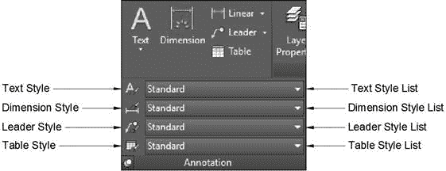
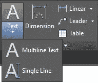
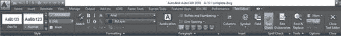
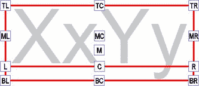
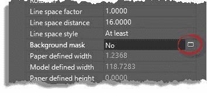
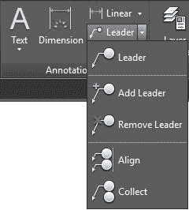

# 第 6 章：注释

添加注释和尺寸标注可能是设计过程中最无聊的阶段。幸运的是，AutoCAD 提供了合适的工具，可以更快速，更有效地添加注释。

在本章中，您将学习如何向 AutoCAD 添加注释，包括文本，引线和表格。您还将学习如何拼写检查笔记以及如何创建要在绘图中使用的文本样式。

您可以在“主页”选项卡的“注释”面板中使用注释对象，并且可以从“注释”选项卡访问更强大的工具。

图 103 显示了“主页”选项卡中的“注释”面板，您可以从中打开对话框以定义样式并设置当前样式。

图 103：主页选项卡中的扩展注释面板

## 注释性对象

注释性对象允许您创建可以表示多个大小或比例的单个注释对象（请参见图 104）。您可以启用注释对象的 Annotative 属性，并为对象指定许多绘图比例，而不是在不同的图层上创建注释对象的多个实例。

图 104：分配了两个注释比例的注释文本

正确使用注释性对象可以提高工作效率，并帮助您在编辑或删除注释性对象时避免不必要的错误。

创建注释性对象时，将缩放对象大小以匹配当前注释性比例。

图 105：状态栏中的注释控件

注释控件如下：

**显示注释对象**：当打开（蓝色）时，如果与当前视图的当前注释比例关联，则所有注释性对象将独立显示。对象显示为最接近的关联比例。关闭（灰色）时，仅显示与当前视图的注释比例关联的注释性对象。

|  | 提示：在模型空间中工作时打开“显示注释对象”，在纸空间中关闭。这将帮助您避免创建图形中已存在的注释性对象，您所要做的就是分配必要的比例。 |

**缩放更改时向标注对象添加比例**：启用（蓝色）时，选择另一个比例时，所有注释性对象都与注释比例关联。

**当前视图的注释比例**：显示当前注释比例。单击以从列表中选择另一个注释比例，或编辑/添加注释比例。

添加和删​​除注释到对象：

1.  选择一个注释性对象并单击鼠标右键。
2.  单击**注释性对象比例**。
3.  1.  **添加当前比例**：将当前注释比例添加到所选对象。
    2.  **删除当前比例**：从选定对象中删除当前注释比例。仅当对象具有多个关联的注释比例时，此选项才可用。
    3.  **添加/删除比例**：打开一个对话框，您可以从中选择要添加或删除的多个注释比例。
    4.  **同步多尺度位置**：可以拉伸注释性对象而不影响指定的其他尺度。此选项重新定位比例以匹配选定的注释比例。
    
## 文字

### 文字样式

在开始添加注释之前，设置至少两种文本样式很重要。文本样式是一个库，其中 AutoCAD 存储文本格式（如文本高度和字体信息），以满足您可能需要的许多注释目的。理想情况下，您应该在模板文件中创建文本样式。

要创建文本样式：

1.  开始新的绘图。
2.  在 Home 选项卡中，展开 Annotation Panel 并单击 **Text Style** 工具（参见图 105）以打开 Text Style 对话框。
3.  样式列表中当前有一种样式（标准。）我们将创建一些其他样式。
4.  单击 **New ...** 按钮添加新样式，为名称输入 Normal，然后单击 OK 添加样式。
5.  在“字体”区域中，选择：
6.  字体名称： **Arial**
7.  字体样式：**常规**
8.  在大小区域：
9.  确保选中了 **Annotative** （样式名称旁边会出现一个符号，表示该样式是注释性的）。
10.  高度： **0.1** （这是以 1：1 比例绘制时的字体大小）。
11.  在效果区域中：
12.  1.  确保未选中**颠倒**。
    2.  确保未选中 **Backwards** 。
    3.  设置**宽度系数** = **1** 和**倾斜角度** = **0** 。
    4.  单击**应用**。
13.  单击 **New ...** 并为**样式名称**输入 **DimTxt** ，然后单击 **OK** 。
14.  在“字体”区域中，选择：
15.  字体名称： **Arial**
16.  字体样式：**常规**
17.  在大小区域：
18.  确保未选中**注释**。
19.  高度： **0** （当高度设置为零时，高度在创建文本时定义）。
20.  在效果区域中：
21.  确保未选中**颠倒**。
22.  确保未选中 **Backwards** 。
23.  设置**宽度系数** = **0.8** 和**倾斜角度** = **0** 。
24.  单击**应用**。
25.  创建其他文本样式，如下所示：

| 名称 | 字体名称 | 字体样式 | 注释 | 高度 | 宽度系数 | 斜角 |
| 调整 | 宋体 | 斜体 | 是 | 0.1 | 1 | 0 |
| 标题 1 | 英语字体格式一种 | 胆大 | 没有 | 0.25 | 1 | 0 |
| 标题 2 | 英语字体格式一种 | 加粗斜体 | 没有 | 0.16 | 1 | 0 |
| TITLE3 | 英语字体格式一种 | 斜体 | 没有 | 0.125 | 1 | 0 |

在**样式**列表中，选择 **Normal** 并单击 **Set Current** 使 **Normal** 成为当前文本样式。单击**关闭**关闭对话框。

现在您已经定义了一些文本样式，您就可以开始为绘图添加注释了。两种最常见的文本类型是单行文本和多行文本。

图 106：文本工具

### 单行文字

创建不需要高级格式的基本文本（如标签）时，请使用单行文本。

每按一次 **Enter** 键，单行文本就会创建一个新的文本行。每行文本都是一个独立的对象，您可以根据需要进行编辑，而不会影响其他行。

命令：DTEXT

别名：DT

### 多行文字

使用多行文本创建段落文本对象。所有行和段落都是可以使用 AutoCAD 文本编辑器编辑的单个对象的一部分。

命令：MTEXT

别名：T 或 MT

创建多行文本时，文本编辑器上下文选项卡将显示在功能区中，您可以从中将文本格式设置为与 Microsoft Word 或其他桌面文本编辑器中的方式类似。

图 107：文本编辑器上下文选项卡

如果您爆炸多行文本，它将转换为单行文本，其中每行文本都是一个独立的对象，并且所有格式都被取消。

### 文字对齐

图 108：文本对齐基点

| **TL** =左上角
**ML** =中左
**L** =左
**BL** =左下 | **TC** =顶部中心
**MC** =中间中心
**M** =中
**C** =中心
**BC** =底部中心 | **TR** =右上角
**MR** =中右
**R** =右
**BR** =右下角 |

### 创建注释性文本：

1.  在“主页”选项卡中，展开**注释**面板，确保活动的文本样式有注释性（注释性文本样式显示小的蓝色三角形）。在本练习中，选择 **Normal** 文本样式。
2.  在状态栏中，选择适当的注释比例（稍后可以向对象添加其他注释比例）。本练习选择 **1/8“= 1'-0”**。

创建注释性单行文本：

1.  继续上一个绘图，创建一个名为 **A-Anno-Note** ，颜色 231，连续线型，可绘制的新图层（请参阅第 2 章中的“创建图层”主题以查看如何创建图层）。将 **A-Anno-Note** 设置为当前图层。
2.  进行缩放，使建筑物适合绘图区域。
3.  从 **Home** 选项卡， **Annotation** 面板，展开 **Text** 并选择**单行文本**。
4.  按 **F3** 关闭对象捕捉。命令窗口显示一条消息，通知您 **Osnap** 状态。如果它读取＆lt; Osnap on＆gt;。再次按 **F3** 将其关闭。
5.  点击建筑物中心大房间区域的中心附近。
6.  输入 0 并按**输入**作为文本的旋转角度。
7.  输入 **Great Room** ，按**输入**， **FFL + 7'-0“**，然后按**确认**。
8.  按**确定**完成命令。
9.  选择文字。请注意，它们是两个独立的对象。

创建注释性多行文字：

单行文本没有宽度限制，直到您按 **Enter** 创建新的文本行为止。

对于多行文本，您可以指定宽度限制，并且当行达到指定宽度时，该行会自动断开。

1.  从 **Home** 选项卡， **Annotation** 面板，展开 **Text** 并选择 **Multiline Text** 。
2.  指定第一个拐角：单击车库区域中心附近
3.  指定对角：单击一个点，使文本框接近 125 个单位宽。
4.  键入 **Garage** 并按**输入**，然后输入 **FFL + 6'-6“。** 不要按**确定**;相反，单击文本框外部以完成命令。
5.  选择多行文字;文本是一个有两行的单个对象。

将现有文本导入多行文本

1.  双击鼠标的中间按钮以缩放扩展。
2.  从 **Home** 选项卡， **Annotation** 面板，展开 **Text** 并选择 **Multiline Text** 。
3.  单击站点左侧的空白区域。
4.  在命令窗口中，输入 **W** 并按**输入**指定文本框宽度。
5.  输入 **550** 并按**输入**作为宽度。
6.  从**文本编辑器**上下文选项卡中，展开**工具**面板，然后选择**导入文本**。
7.  浏览到本书练习的**第 06 章**文件夹，然后选择 **MText.txt** 文件。
8.  单击**打开**。
9.  文本已导入文本框。
10.  单击文本框外部以完成命令。

创建非注释性文本的步骤与创建注释性文本相同，但您需要确保选择未设置为注释性的文本样式，并且可能需要在屏幕上指定文本高度。

**编辑文本**

命令：TEXTEDIT

别名：ED

要编辑文本，只需双击文本对象或选择要编辑的注释对象，在命令窗口中键入 **ED** ，然后按 **Enter** 或**空格键**。

|  | 注意：如果在未选择注释对象的情况下执行 TEXTEDIT，AutoCAD 将提示选择要编辑的注释对象。 |

### 文字屏蔽

有时，如果文本与其他对象重叠，则难以阅读。可以轻松屏蔽多行文本，以便隐藏背景元素并使文本可读。

为了说明这一点，将车库中添加的多行文本复制到右侧的车道区域。双击以编辑文本，并将 **Garage** 替换为**车道**。单击文本区域外部以进行提交。

该文本很难通过填充图案阅读。请按照以下步骤进行掩码：

1.  选择多行文字。
2.  右键单击并从上下文菜单中选择**属性**以打开“特性”选项板。
3.  在**属性**选项板的**文本组**下，找到背景蒙版。
4.  单击 **No** 文本，然后单击该字段右侧的小图标，如图 109 所示。
5.  在**背景蒙版**对话框中，选择**使用背景蒙版**和**使用绘图背景颜色**。
6.  在**边框偏移系数**文本框中输入 **1.25** 。这是相对于文本大小的文本到蒙版边界的间隙距离。
7.  单击**确定**应用设置并关闭对话框。
8.  在命令窗口中，键入 **REGEN** 并按**输入**重新生成图形。
9.  使用 Grip 模式调整文本框宽度。
10.  保存并关闭绘图。

图 109：Mtext 背景蒙版

## 尺寸

没有尺寸，设计就不完整。尺寸是设计过程的关键部分，必须易于阅读和精确。

您需要在几乎所有类型的项目上添加尺寸，从概念到生产和施工绘图。 AutoCAD 包含正确的工具，可帮助您使尺寸设计成为一个平滑的设计过程。

### 尺寸样式

尺寸样式是一组保存在图形中的参数，您可以在其中定义从线到单位格式的所有标准属性。

命令：DIMSTYLE

别名：D

要从“主页”选项卡创建或编辑尺寸样式，请展开**注释**面板，然后单击**尺寸样式**图标（参见图 103）或在 **DIMSTYLE** 中键入命令窗口并按**输入**或**空格键**以打开“尺寸样式管理器”对话框。

样式列表（左侧的框）显示当前图形中可用的所有尺寸样式。在列表中选择尺寸样式时，预览将显示在预览框中。

要创建新的尺寸样式，请单击对话框右侧的**新建...** ，以打开“创建新尺寸样式”对话框：

**新样式名称**：输入新样式的名称。

**以**开始：允许您选择要用作模板的样式。

**Annotative** ：允许用户定义新的维度样式是否具有注释性。

**用于**：允许用户定义要应用新样式的尺寸类型。例如，您可以创建一组仅用于角度尺寸的参数。选择特定类型的尺寸时，新名称不可用，新样式将成为**开始于**下拉列表中所选尺寸的子样式。

创建尺寸样式，如下所示：

*   新样式名称： **MyDimStyle**
*   开头：**标准**
*   注释：**是**（已选中）
*   用于：**所有尺寸**
*   单击**继续**。加载了尺寸样式编辑器（图 110），您可以开始配置新的尺寸样式。

维度样式编辑器（“新建”，“修改”和“覆盖维度样式”对话框）由七个选项卡组成：

*   **行：**控制维度中所有行的外观。
*   *   **尺寸线**：尺寸文本所在的线条。
    *   **延长线**：从尺寸为维的对象到尺寸线的线。
*   **符号和箭头**：控制箭头和中心标记的外观。
*   **Text** ：控制要放置在尺寸样式中的文本的外观，位置和对齐方式。
*   **适合：**控制文本和箭头的放置方式。
*   **主要单位：**控制尺寸单位格式。
*   **备用单位：**允许用户为尺寸定义第二个单位。例如，假设您将主要单位设置为建筑格式（英尺和英寸），则可以设置备用单位以厘米为单位显示尺寸。
*   **Tolerances：**控制公差的文本外观。

图 110：尺寸样式编辑器

继续我们的维度风格：

1.  选择**行**选项卡：
2.  尺寸线：
3.  1.  颜色，线型和线宽： **ByBlock**
    2.  基线间距： **0.2**
    3.  抑制：两者都未经检查
4.  延长线
5.  1.  颜色，线型和线宽： **ByBlock**
    2.  超越暗线： **0.1**
    3.  原点偏移： **0.5** （这是从偏转点到延长线的距离。）
    4.  抑制：两者都未经检查
6.  选择**符号和箭头**选项卡：
7.  箭头：
8.  1.  第一：建筑刻度
    2.  第二：建筑刻度
    3.  引线：封闭填充
    4.  箭头大小： **0.1**
9.  选择**文本**选项卡：
10.  文字外观：
11.  1.  文字样式： **DimTxt**
    2.  文字颜色：**绿色**
    3.  填充颜​​色：**背景**（这类似于上一主题中多行文字中使用的蒙版。）
    4.  文字高度： **0.1**
12.  文字放置：
13.  1.  垂直：**高于**
    2.  水平：**居中**
    3.  查看方向：**从左到右**
    4.  从暗线偏移： **0.05**
14.  文字对齐： **ISO 标准**
15.  选择**主要单位**选项卡：
16.  线性尺寸：
17.  1.  单位格式：**建筑**
    2.  精度： **0'-0 1/16“**
    3.  分数格式：**水平**
18.  单击**确定**添加尺寸样式并关闭对话框。
19.  在**尺寸样式管理器**中，在**样式**列表中选择 **MyDimStyle** ，然后单击**设置当前**按钮。
20.  单击**关闭**以关闭尺寸样式管理器。
21.  保存绘图。

编辑尺寸样式

要编辑现有尺寸样式，请打开尺寸样式管理器，选择要编辑的尺寸样式，然后单击**修改...** 按钮。完成编辑后，单击**确定**提交更改并关闭对话框，或单击**取消**放弃所有更改并关闭对话框。

关闭所有对话框后，AutoCAD 将重新生成图形以将更改应用于与已编辑样式关联的现有尺寸。

### 尺寸图

您可以使用“注释”选项卡中“尺寸”面板中的“主页”选项卡中的“注释”面板中的尺寸，或更高级的工具。基本上有七种基本类型的维度：

*   **线性**：线性尺寸是与当前 UCS 方向匹配的垂直或水平尺寸。
*   **对齐**：对齐尺寸是线性尺寸，尺寸线在该尺寸线上旋转到延长线原点的方向。
*   **半径**：测量圆'和弧'半径的径向尺寸。 Jogged 是一个径向尺寸，可用于微调尺寸线。
*   **直径**：测量圆的直径的径向尺寸，虽然不常用，但是弧。
*   **Angular** ：测量所选对象的角度或指定三个点（顶点，角度起点和角度终点）。
*   **纵坐标**：测量与 UCS 原点的垂直或水平距离。
*   **弧长**：测量弧的长度。

图 111：尺寸工具

基线和持续尺寸

Baseline 和 Continued 是维度命令，支持从先前创建的维度继续维度或选择现有维度。

**继续尺寸**从先前创建的尺寸的第二个尺寸线开始创建新尺寸。

**基线尺寸**创建新尺寸，其中所有后续尺寸从先前创建的尺寸的第一个延伸线开始，并且在尺寸样式中设置的基线间距中指定的值间隔。

要快速启动尺寸标注，请打开位于**第 06 章**文件夹中的 **Column Base Notes** 绘图。这是在之前的练习中创建和编辑的相同绘图，但在此之后，我添加了一个名为 **Dim with Alternate Unit** 的维度样式。此尺寸样式包括建筑单元中的主要单元和以毫米为单位的备用单元。您可以在“尺寸样式编辑器”中打开它以查看属性。

让我们为列基添加一些维度：

1.  确保 **Osnap** 打开。您可以随时按 **F3** 以根据需要切换 **Osnap** 。
2.  从 **Home** 选项卡， **Annotation** 面板中，选择 **Linear dimension** 工具。
3.  单击列底部左下角附近。确保捕捉到终点。
4.  单击上面的结束点。
5.  向左移动光标并单击以放置尺寸线。
6.  激活功能区中的**注释**选项卡。
7.  从**尺寸**面板中，选择 **Baseline** 。
8.  Select each end point of the column base transition sequentially, up to the top-most point.

    

    图 112：Annotate 选项卡中的 Dimensions 面板

    

9.  按**输入**，**空格键**或 **Esc** 完成命令。
10.  选择**线性尺寸**工具。
11.  选择列基础的左下端点。
12.  选择列基础第二级左下角的终点。
13.  向下移动光标，使尺寸线水平。单击以将尺寸放置在列基础下方。
14.  选择底座第二层右侧的终点，然后选择底座的右下角。
15.  选择**线性**尺寸工具。
16.  Select the points **1** and **4** shown in the following figure.

    

17.  向下移动光标并选择一个点以将尺寸线放在现有水平尺寸下方。
18.  保存你的绘图。

## 多重引线

Multileader 是一个注释对象，用于创建带有引线的文本。

图 113：多重引线

### 多重引线样式

要从“主页”选项卡创建或编辑多重引线样式，请展开**注释**面板，然后单击**多重引线样式**图标（参见图 103）以打开“尺寸样式管理器”对话框。

样式列表（左侧的框）显示当前图形中可用的所有多重引线样式。在列表中选择尺寸样式时，预览将显示在预览框中。

要创建新的多重引线样式，请单击对话框右侧的 **New ...** 按钮，打开 **Create New Multileader Style** 对话框：

**新样式名称**：输入新样式的名称。

**以**开始：允许您选择要用作模板的样式。

**Annotative** ：允许您定义新的维度样式是否具有注释性。

在 **Column Base Notes** 绘图中，创建一个多重引线样式，如下所示：

1.  新样式名称： **MyMultileader**
2.  开头：**标准**
3.  注释：**是**（已选中）
4.  用于：**所有尺寸**

6.  单击**继续**。

多重引线样式编辑器已加载，它包含三个选项卡：

*   **Leader Format** ：用于控制引导线和箭头外观的设置。
*   **引线结构**：处理引线格式的设置。
*   **内容**：用于控制多重引线内容的设置。您可以选择 Mtext，Block 或 none（仅限 leader）。

继续我们新的 Multileader Style 配置：

1.  在 Leader Format 选项卡中：
2.  一般：
3.  1.  类型：**直**
    2.  颜色，线型和线宽： **ByBlock**
4.  箭头：
5.  1.  符号：**已填充**
    2.  尺寸： **0.1** （由于绘图单位设置，该值将自动转换为英寸）
6.  在 Leader Structure 选项卡中：
7.  约束
8.  1.  最高领导点：已选中， **2** （这会将领导线限制为两个点）
    2.  第一和第二段角度：未选中
9.  着陆设置：
10.  1.  自动包含着陆：已检查
    2.  设置着陆距离：已检查
    3.  着陆距离： **0.25** （您可以在创建引线后使用夹点调整着陆距离）
11.  规模：
12.  1.  注释：检查
13.  在“内容”选项卡中：
14.  多重引线类型： **Mtext**
15.  文字选项：
16.  1.  文字样式：**正常**
    2.  文字角度：**保持水平**
    3.  文字颜色：**蓝色**
    4.  总是左对齐：检查
    5.  框架文字：未选中
17.  引线联系：
18.  1.  水平附件：已检查
    2.  左附件：顶线中间
    3.  正确的依恋：顶线中间
    4.  着陆间隙： **0.5** （此值也会影响文本框架偏移）
19.  单击**确定**保存更改并关闭对话框。
20.  选择 **MyMultileader** 样式，然后单击 **Set Current** 。
21.  单击**关闭**。

### 添加引线

您可以从“主页”选项卡中的“注释”面板或“注释”选项卡中的“引线”面板中使用引线。

图 114：注释面板中的多重引线工具

1.  如果未打开，请打开 **Column Base Notes** 绘图。
2.  单击“注释”面板中的 **Leader** 工具。
3.  右键单击鼠标，然后从**对象捕捉覆盖**菜单中选择**几何中心**。
4.  将十字准线移动到柱底周边附近。确保它正在卡入柱底的中心并单击。
5.  将光标移动到图形右侧，然后单击以放置多重引线。
6.  类型：**铸石饰面** **8 颜色待定**
7.  按 **Ctrl + Enter** 或单击文本框外的任何位置。
8.  选择**添加引线**工具。
9.  选择多重引线对象。
10.  在现有引线的上方和下方再添加两名引线。
11.  按**输入**，**空格键**或 **Esc** 完成命令。
12.  单击 **Annotation** 面板中的 **Leader** 工具。
13.  单击列底部最右侧垂直线的中点附近。
14.  将鼠标向右移动，然后单击以放置引线。
15.  类型：**其他结构**
16.  按 **Ctrl + Enter** 完成。
17.  保存你的绘图。

## 章节总结

在本章中，您了解了如何向绘图添加注释。您创建了文本样式，尺寸样式和引线样式，还为图形添加了注释。

绘图笔记在绘图中至关重要。这就是您如何传达您的想法和产品的生产要求。