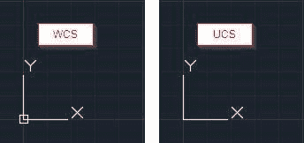
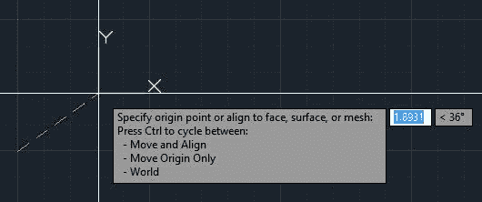
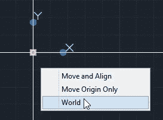

## AutoCAD 坐标系

所有 AutoCAD 产品都包含基于 x，y 和 z 坐标的三维（3D）坐标系。当您基于标准模板而不是 3D 模板（acad3D.dwt 和 acadiso3D.dwt）开始空白绘图时，您将从顶视图开始，并且您只能看到用户坐标系的 x 和 y 轴（ UCS）。

本书仅涉及创建和编辑二维（2D）几何，假设坐标系的 z 值为零。

|  | 注意：AutoCAD LT 可以打开在其他版本的 AutoCAD 上创建的 3D 模型，但它无法创建或编辑 3D 几何图形，也不允许进行高级自定义。 |

当您开始新绘图时，坐标系实际上是世界坐标系（WCS），只有在方向，x，y 或 z 轴或原点位置发生任何变化后才应调用 UCS。

WCS 在原点包含一个小方块，而 UCS 没有（见图 18）。

图 18：WCS 和 UCS

出于简化目的，我们将 AutoCAD 坐标系简称为 UCS。

如果选择其中一个轴末端，则可以通过单击它并将所需节点拖动到正确的位置或角度来更改 UCS 位置。

图 19：移动 UCS Origin

如果将鼠标悬停在称为夹点的蓝色方块上，则会弹出一个菜单，显示所指对象节点的可能编辑选项。图 20 显示了 UCS 原点的快捷菜单。单击 **World** 返回 UCS 到世界坐标系。

图 20：原点的 UCS 快捷菜单