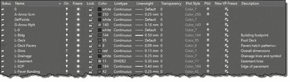
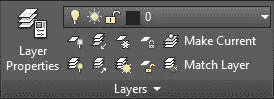
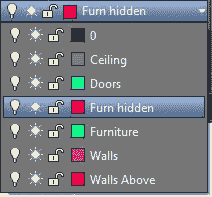
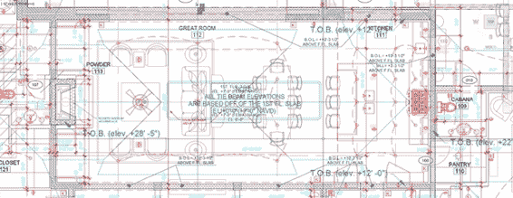

## 管理图层

您在第 2 章中熟悉了图层和图层属性管理器。现在是时候回顾一下在 AutoCAD 中使用图层的强大功能了。大多数可用的图形设计软件都有一种在图层中组织绘图的方法。

您可以使用图层来控制图形或输出中对象的可见性，以及设置颜色，线型，线宽和透明度等属性。创建对象时，它会继承与创建对象的图层关联的属性，但您可以根据需要覆盖对象属性。当您看到显示为 **BYLAYER** 的对象属性时，表示该属性是从对象的图层继承的。

要打开**图层属性管理器**窗口：

在“主页”选项卡的“图层”面板中，单击**图层属性**工具。

命令：LAYER

别名：LA

### 层列表

“图层特性管理器”窗口中的图层列表显示图形中的图层列表和属性。您可以通过单击列标题对列表进行排序。

图 90：图层列表

|  | 提示：按住 Shift 键选择一组连续的图层，或按住 Ctrl 键选择交替图层。 |

图层列表包含以下列：

*   状态 ：显示描绘图层状态的图标。带有绿色复选标记的图层是当前图层。要将另一个图层设置为当前图层，请双击图层状态或图层名称。
*   名称 ：显示图层名称。要重命名图层，请选择图层并按 F2。
*   开 ：打开或关闭所选图层。在绘图时，关闭图层以使图层在显示中不可见。 “关闭”层中的对象参与再生过程和一些选择方法。
*   冻结： 冻结图层不可见，未绘制，在选择对象和重新生成图形时会被忽略。这改善了复杂图纸的性能和再生时间。
*   **锁定**：虽然您可以在图层中添加新对象，但无法修改锁定图层中的对象。
*   **颜色**：定义图层的颜色。
*   **Linetype** ：定义图层的线型。
*   **线宽**：设置图层线宽。
*   **透明度**：将图层的透明度级别设置为 0 到 90，其中 0 表示完全不透明。
*   **Plot Style** ：允许选择图层的打印样式。如果绘图图样式策略是颜色相关的绘图样式，则禁用此选项。
*   **Plot：**设置绘图时对象的可见性。设置为无绘图时，对象将显示在屏幕上，但不会显示在绘图中。
*   **新 VP 冻结**：定义图层在布局选项卡上新创建的视口中是否可见。
*   **描述**：您可以输入图层的友好描述。此字段是可选的，您可以按 F2 进行编辑。

### 层面板工具

图 91：图层面板

默认情况下，“图层”面板位于“主页”选项卡中，并包含以下工具：

 **图层属性**：打开图层属性管理器，您可以在其中添加新图层，编辑现有图层的属性，管理图层过滤器和状态，或删除空图层。

**图层列表**：显示当前（活动）图层。所有新对象都分配给该图层。您还可以从此列表中激活另一个图层，或更改对象选择的图层属性。您还可以从此列表中更改图层状态。

图 92：图层列表下拉列表

|  | 注意：如果愿意激活另一个图层，请确保没有选择任何对象。使用选定的一个或多个对象更改列表中的图层会将对象分配给选定的图层。 |

 **关**：通过选择对象关闭图层。使用此命令清除视图并便于阅读图形或绘图。

 **隔离层**：此命令将关闭除选定对象以外的所有层。当愿意只与某些物体一起工作时非常有帮助。例如，您可能只想在墙壁，窗户和门上工作并隐藏所有尺寸，天花板平面图，注释等。使用图层取消隔离命令恢复图层状态。

 **冻结**：通过选择对象冻结图层。

 **锁定**：通过选择对象锁定图层。当您需要查看并捕捉图层中的对象而不会有意外修改或删除这些对象的风险时，这非常有用。

**使当前**：使所选对象成为当前（活动）层。

**图层打开**：打开图形中的所有图层。

 **Un-Isolate Layers** ：恢复最后一个 Layer Isolate 命令之前的图层状态。

**解冻所有图层**：解冻（解冻）图形中的所有图层。它不会解冻在 Paper Space 布局中冻结的图层。

**解锁**：单击对象解锁图层。

**匹配层**：此命令允许用户将其他对象的图层与选定对象的图层进行匹配。

### 手上层

在本主题中，我们将处理现有文件以编辑图层，隐藏和隔离图层和对象，以及编辑现有对象。请继续执行以下步骤：

1.  打开 AutoCAD（如果尚未打开）。
2.  打开位于**第 04 章**文件夹中的**第一平面图**图纸。该图是一个建筑计划，包括基本调查和景观规划。绘图很难阅读，所以让我们关闭一些图层以便于阅读。
3.  Zoom closer to the center of the house so that the Great Room fits in the drawing area.

    

4.  在**主页**选项卡，**图层**面板中，单击**关闭**工具（请参阅本章前面的图层面板工具主题）。
5.  随机单击某些对象以关闭其指定的图层。如果您不小心关闭了图层，请输入 **U** 并按**确定**以恢复最后一层图像。您可以根据需要使用鼠标滚轮进行平移和缩放，而不会中断命令。
6.  按**输入**，**空格键**或 **Esc** 完成命令。

|  | 注意：您可能会在命令窗口中收到警报，通知您正在尝试关闭当前图层。你必须确认行动。建议不要关闭当前图层，因为您可以创建在打开图层之前不可见的新对象。 |

要重新打开所有图层，单击图层面板中的**图层**工具，或在命令窗口中键入 **LAYON** ，然后按 **Enter** 或**空格键**。关闭的所有图层现在都已打开。

您也可以直接从**图层属性**窗口或**图层**面板中的**图层列表**打开或关闭图层;灰色灯泡表示图层已关闭，黄色灯泡表示图层已打开。

打开**图层属性窗口**并关闭以下图层：

A-Anno-Det-TAG，A-Anno-Dims，A-Anno-E-Dr-TAG，A-Anno-Elev-TAG-48，A-Anno-Mas-Dim，A-Anno-Mas-Slab- Elev，A-Anno-Mas-Text，A-Anno-TieB-Txt，A-Anno-Win-TAG，A-Clng-Circ，A-Clng-Head，A-Clng-Lite，A-Flor-Case， A-Furn-Free，A-Grid-Cntr，A-Roof-Lines，A-Site-Hatch，A-Site-Vegn，A-Str-Slab-Edge，A-Str-Tie-Beam，A-Str- TieBm-Htch，S-Anno-Site-spot elev，S-Anno-Site-Text 和 S-Site-Misc。

如果需要，请关闭图层属性。

平移并缩放到泳池区域并单击图层面板中的**隔离**工具按钮，或在命令窗口中键入 **LAYISO** 并按**输入**或**空格键**。

|  | 提示：默认情况下，LAYISO 命令（隔离工具）锁定并淡化未选定对象的图层。要关闭图层，请在命令窗口中输入 S，按 Enter 键，键入 O，然后按 Enter 键。对于新图形或 AutoCAD 部分，将保留此设置，直到您再次更改它为止。 |

选择池中的任何一行，然后按 **Enter** 。

单击**图层**面板中的 **Unisolate** 工具按钮，或在命令窗口中键入 **LAYUNISO** ，然后按 **Enter** 或**空格键**，恢复以前的状态。

将图形保存为**我的第一层平面图**并关闭图形。