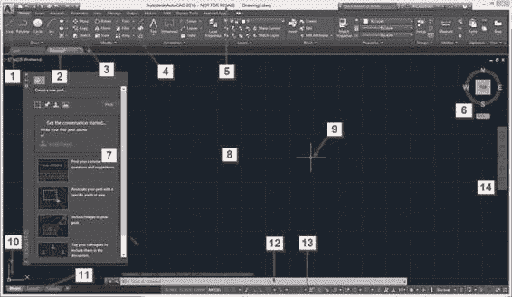
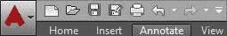
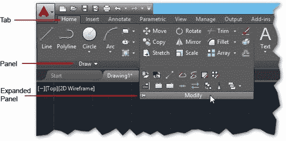
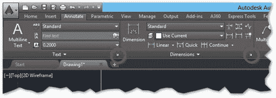
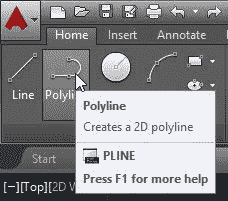
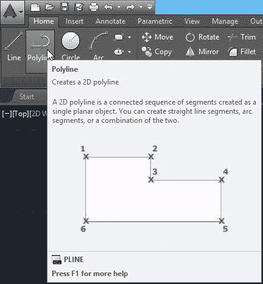
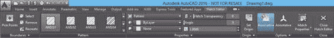
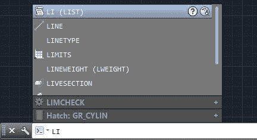
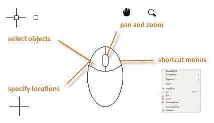

## AutoCAD 界面

AutoCAD 标准界面由许多项组成。下图显示了启动 AutoCAD 并首次启动绘图后的标准 AutoCAD 界面。大多数界面组件在绘图区域周围浮动或停靠，AutoCAD 关闭后最新的界面布局将保持不变。

图 2：AutoCAD 界面

标准接口项如下：

1.  **菜单浏览器**：从“开始”菜单中，您可以找到文件管理，发布和实用程序的命令。
2.  **绘图标签**：显示所有打开的图纸，只需单击一下即可快速切换图纸。
3.  **快速访问工具栏**：包括有用的命令，如新建，打开，保存，打印，撤消等。
4.  **功能区**：AutoCAD 在绘图区域的顶部包含一个功能区，包括多个选项卡。您可以从“主页”选项卡访问本书中涵盖的几乎所有命令。
5.  **标题栏**：显示产品名称和活动图纸名称。
6.  **View Cube** ：广泛用于 3D 建模。
7.  **工具选项板**：AutoCAD 包含几个不同的工具选项板。图 2 中显示的浮动调色板是“Design Feed”。要关闭工具调色板，请单击位于调色板左上角的 **X** 图标（它也可以位于顶部 - 右上角，取决于它最后定位的位置。）如果您当前打开了一个工具调色板，您可以关闭它，因为我们暂时不会使用它。
8.  **绘图区**：大面积，默认为深灰色，是您的设计发生的地方。最初，绘图区域显示可以隐藏的网格，如您所愿。
9.  **十字光标**：创建并选择在整个设计过程中创建的实体。
10.  **用户坐标系（UCS）图标**：显示坐标系的 x 和 y 向量的当前方向。您输入的每个距离点都与之一致。
11.  **布局选项卡**：由模型空间和图纸空间布局组成。模型空间是您创建设计的地方，而纸空间是您的打印/绘图空间。虽然您可以创建许多 Paper Space 布局，但只能有一个 Model Space 布局。
12.  **命令窗口**：这是您与 AutoCAD 通信的位置，以及 AutoCAD 响应您的请求的位置。接下来，您将了解有关命令窗口的更多信息。
13.  **状态栏**：包含许多快速访问读数，切换和选择工具，可帮助您处理绘图。

### 键盘

熟悉 AutoCAD 命令后，您可以通过键入命令和命令别名而不是在功能区或工具栏上进行选择来完成更多工作。键盘也有几个快捷命令，可以帮助您处理绘图。

最常见的键盘用途是：

*   **输入**：执行或结束命令以确认输入。在空白命令窗口按 Enter 键将调用您运行的最后一个命令。
*   **空格键**：功能与 Enter 键相同，但在尝试完成命令时可能会有不同的结果，具体取决于您运行的命令。
*   **Escape（Esc）键**：完成或取消命令。
*   **F1 键**：打开“帮助”窗口
*   **F2 键**：如果命令窗口是浮动的，则显示扩展命令历史记录;否则会打开 AutoCAD 文本历史记录窗口。要在命令窗口浮动时显示 AutoCAD 文本历史记录窗口，请按 **Ctrl** + **F2** 。
*   **F3 键**：打开/关闭对象捕捉（osnap）
*   **F7 键**：切换网格
*   **F8 键**：切换正交（正交）模式
*   **F9 键**：切换捕捉到网格
*   **F10 键**：切换极坐标模式
*   **F11 键**：切换对象跟踪
*   **F12 键**：切换动态输入

### 快速访问工具栏

默认情况下，快速访问工具栏位于应用程序的左上角。它是完全可定制的，默认工具是：

 **新**：从图纸模板开始新图纸

 **打开**：打开现有图纸

 **保存**：保存当前图形

 **另存为**：使用新名称保存当前图形

 **绘图**：绘制（打印）当前图形

 **撤消**：撤消上一个命令。 AutoCAD 可以在创建图形之前撤消所有操作。关闭图形时，将删除撤消历史记录，并在重新打开图形时开始新的历史记录。

 **重做**：重做上次撤消的命令，但仅在使用撤消命令后立即执行。

### 功能区

默认情况下，功能区位于绘图区域的顶部。它由几个标签组成，由几个面板组成，如图 3 所示。色带也可以停靠在侧面，以便在绘图区域内或另一个显示器上浮动（未对接）。

具有指向下方的小三角形的面板是可展开面板，您可以通过单击面板标题来展开这些面板。

图 3：功能区

某些功能区面板允许访问与该面板相关的对话框。要显示该对话框，请单击位于面板右下角的小箭头图标（参见图 4）。

图 4：对话框启动器

将鼠标悬停在面板工具上时会显示工具提示，如果再按住它几秒钟，会弹出一个快速帮助窗口，其中包含有关相应命令的信息。

图 5：工具提示

图 6：快速帮助

#### 上下文功能区选项卡

上下文功能区选项卡是一种相关的功能区选项卡，当您选择某些对象或执行某些命令时，它会显示为工具栏或对话框的替换，并在您结束命令时自动关闭或取消选择该对象。

图 7：Hatches 的 Contextual Ribbon 选项卡

### 命令窗口

命令窗口是 AutoCAD 的核心，默认情况下，它位于图形底部的浮动位置。您可以通过单击窗口左侧的栏并拖动将其放置在您选择的任何位置（图 8）。当您靠近绘图区域的顶部或底部时，命令窗口将尝试停靠在该位置。这种特性对于工具调色板来说是类似的，工具调色板可以浮动或对接到侧面。

图 8：命令窗口

当您开始键入命令时，有多种选择可供选择，如图 9 所示。您可以通过单击它或使用键盘箭头选择正确的命令来选择您的选择，然后按 **Enter** 或**空格键**。

图 9：命令自动完成

### 鼠标

使用带有左右按钮和滚轮的鼠标是个好主意。一个好的鼠标可以在项目结束时为您节省大量时间。

以下列表描述了如何使用鼠标键：

*   **左按钮**：用于实体选择以及标记坐标点。
*   **右键**：打开与当前所选实体匹配的上下文菜单（如果有）。
*   **轮**：
*   *   卷起：放大
    *   下拉：缩小
    *   双击：缩放到图形的扩展名
    *   按住，然后拖动：平移绘图

图 10：鼠标