# 第 2 章使用 SSAS 表格实例开发数据模型

在本章中，我们将首先使用 SQL Server 数据工具（SSDT，以前称为 BI Development Studio）使用 SSAS 表格实例设计和开发数据模型。

如前一章所述，与多维模型方法不同，表格数据模型不一定要求在数据仓库中按维度或事实组织数据。这使得表格数据建模成为相对较小的数据仓库设计的优选方法，其中数据可以在不同的数据源中可用，其可以直接加载到 SSAS 表格数据模型中以进行分析。但是，设计星型或雪花模式的数据仓库仍然是推荐的方法，因为它存储了合并的历史数据，这些数据将数据与原始（可能正在变化的）数据分离。

在本章中，我们将使用 AdventureWorksDW2012 数据库作为表格数据模型的数据源。 AdventureWorksDW2012 数据库是 [www.codeplex.com](http://www.codeplex.com) 提供的示例数据仓库数据库。样本数据库可以从[链接](http://msftdbprodsamples.codeplex.com/releases/view/55330)下载。

## 情景

AdventureWorks 是一家虚拟公司，销售自行车，自行车配件，自行车零件和服装。该公司通过在线门户网站和经销商销售其产品。通过 Internet 或经销商的每个销售交易都在 OLTP 数据库（AdventureWorks2012）中捕获，而 AdventureWorksDW2012 是此 OLTP 数据库的相应数据仓库，其中数据以星型模式组织到维度表和事实表中。

组织中的业务分析师需要按地理位置分析经销商的销售情况;按产品尺寸，颜色和重量;员工;和动态日期维度。对于给定的要求，我们在 AdventureWorksDW2012 数据仓库数据库中设计了以下星型模式。

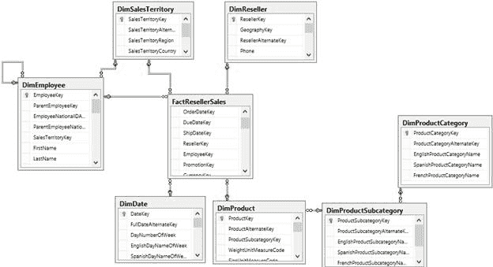

图 12 ：AdventureWorksDW2012 架构

要求是为经销商销售数据集市设计表格数据模型，以便业务分析师可以使用 Power View 或 Excel 动态对销售数据进行排序，以获取分析报告。

让我们首先在 SSDT 中开发我们的 Analysis Services 表格项目，以了解数据建模的方法。

## Analysis Services 表格项目入门

与多维立方体类似，SQL Server 数据工具（SSDT）用于设计和开发 SSAS 表格模型多维数据集。在安装 SSAS 期间，当我们到达 Analysis Services 的服务器配置页面时，可以选择多维模式或表格模式。给定的 SQL Server 实例可以在多维模式或表格模式下使用 Analysis Services。但是，如果我们需要在服务器上安装两种 SSAS 模式，我们将需要安装两个 SQL Server 实例（再次运行安装程序以安装另一个实例）。

在我的开发工作站上，我安装了一个 SQL Server 的默认实例，其中包含数据库引擎，多维模式下的 SSAS，SSRS 和共享组件，我安装了一个 SQL Server 命名实例（TABULAR）来安装 SSAS 表格模型。

安装完成后，当我们启动 SSDT 并单击 **New Project** 时，我们将看到以下可用于商业智能的模板：

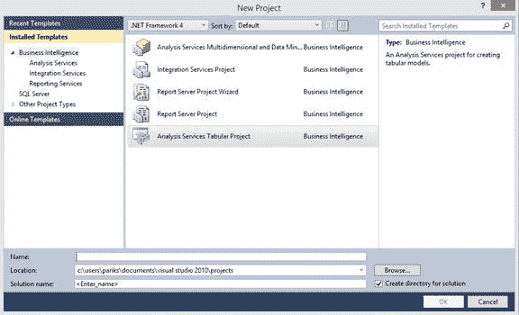

图 13 ：商业智能项目模板

**Analysis Services 表格项目**是 SSDT 中可用的新模板。

在**新建项目**窗口中，我们将项目命名为 **AdventureWorks 经销商销售**，然后单击**确定**以创建项目。出现以下窗口。

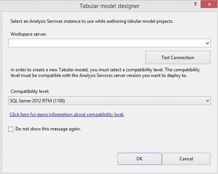

图 14 ：表格模型设计者

**表格模型设计器**要求我们提供 SSAS 表格实例名称，该名称将在项目开发期间用作工作区服务器。在开发阶段，当我们将数据处理到数据模型中时，它实际上将存储在工作空间 SSAS 实例中创建的临时数据库中。

重要的是要了解工作区服务器不是将部署表格模型多维数据集的实例;部署实例将是独立的，需要单独指定，我们将在部署期间进一步讨论。

无论何时创建或打开表格项目，工作区数据库都会保存在服务器的 OLAP \ Data 目录中。随着时间的推移，此文件夹可能会与临时数据库膨胀。你不时需要摆脱你不再需要的东西。为此，您需要文件系统访问权限。因此，最好选择可以清理的工作区数据库服务器。这不是必需的，但您的服务器管理员会感谢您。

在 Tabular 模型设计器的第一个屏幕中，我们提供 SSAS 表格实例名称，然后单击**测试连接**以确保我们能够连接到工作区服务器。如果测试连接失败，则提供的服务器名称不正确，由于防火墙或其他原因可能无法访问服务器，或者您登录的 Windows 凭据对 SSAS 实例没有权限。

在此屏幕中，我们还有**兼容级别**菜单，其中我们有两个可用值（在编写本书时）：

*   SQL Server 2012 RTM（1100）
*   SQL Server 2012 SP1（1103）

每个表格模型数据库都与它兼容并可以部署到的 SQL Server 版本相关联。如果我们正在开发将部署到 SQL Server 2012 SP1 实例的表格数据模型，我们应该选择兼容级别为 SQL Server 2012 SP1（1103），反之亦然。

指定工作区服务器和兼容级别详细信息后，单击 **OK** 。创建解决方案并打开名为 Model.bim 的空文件，如下图所示。

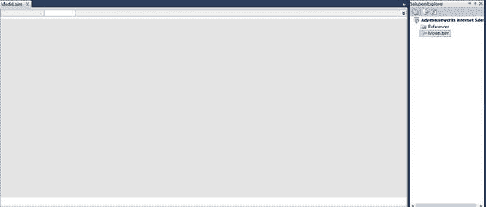

图 15 ：新项目

## 将数据导入表格模型

如前所述，设计数据模型的第一步是识别数据的数据源。对于给定的要求，我们在 AdventureWorksDW2012 文件中提供了所有必需的数据。

要从数据源导入数据，请在 SSDT 中单击**从数据源导入**按钮，这是左上角工具栏中的第一个选项，如下图所示。

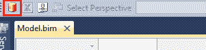

图 16 ：从数据源导入按钮

当我们单击**从数据源导入**按钮时，弹出**表导入向导**并显示所有支持的数据源。

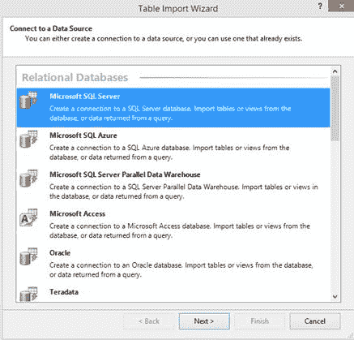

图 17 ：表格模型支持的数据源

如上图所示，表格模型项目支持各种数据源，包括关系数据库，SQL Azure，多维立方体，平面文件和数据源。

选择 **Microsoft SQL Server** ，然后单击**下一步**。在下一个屏幕中，我们通过提供服务器名称并在**数据库名称**下拉列表中选择 **AdventureWorksDWDenali** （我们的 AdventureWorksDW2012 数据库）来为 SQL Server 提供连接字符串。我们提供**友好连接名称**作为 **AdventureworksDW** 以轻松识别数据源。

|  | 注释 ： 对于我的所有演示和实验，我使用了 AdventureWorksDWDenali 数据库，该数据库在 SQL 2012 的 CTP 版本中作为示例数据库提供。当您下载最新版本时来自 CodePlex 站点的 AdventureWorksDW2012，数据库名称将为 AdventureWorksDW2012，并且数据可能与本书中显示的演示和实验不同。 |

在转到下一个屏幕之前，请务必单击**测试连接**以确保与数据库的连接成功并且不会导致任何错误。

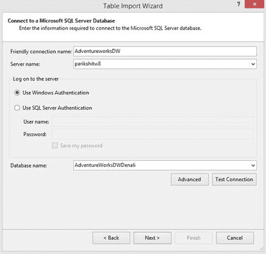

图 18 ：设置数据库连接

接下来，我们需要提供将存储在表格模型多维数据集中的 Windows 凭据，并将用于连接到 AdventureWorksDW2012 数据库以将数据移动到数据模型的表中。

如果 SSAS 服务帐户有权从数据源读取数据，我们可以选择**服务帐户**选项，这不需要我们明确提供凭据。如果服务帐户是域帐户并且具有可能位于远程服务器上的数据源的权限，则这可能是首选方法。


图 19 ：设置 Analysis Services 凭据

下一个屏幕允许我们通过选择表或编写 SQL 查询来直接导入数据，如果我们想要连接多个表并将数据导入单个表，这可能很有用。单击**从表**列表中选择以进入下一步。

在此步骤中，我们选择要导入的各个表，并提供用户友好名称，该名称将是数据模型中导入表的名称。

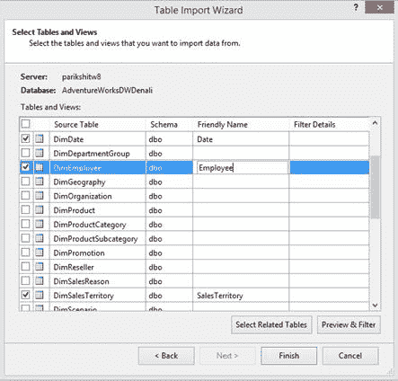

图 20 ：选择要导入的表格

对于我们的数据模型，我们选择以下表格并提供以下名称。

| 来源表 | 名称 |
| DimDate | 日期 |
| DimEmployee | 员工 |
| DimSalesTerritory | SalesTerritory |
| FactResellerSales | 经销商销售 |

对于 DimSalesTerritory，我们通过单击 **DimSalesTerritory** 表并选择 **Preview 和 Filter** 选项来过滤掉 SalesTerritoryAlternateKey 列，如下图所示。

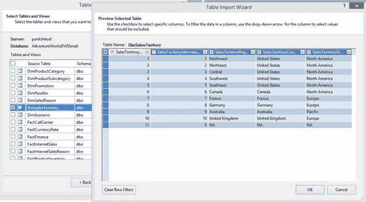

图 21 ：从 DimSalesTerritory 表中过滤列

在同一窗口中，我们可以通过单击每个列标题旁边的下拉列表并选择需要过滤的框来设置行过滤器。

为了缩短处理时间并节省存储空间，建议过滤掉不需要的列和行。

在我们的场景中，我们有许多这样的列可以在每个表中过滤掉，但为了简单起见，我们只会过滤掉 DimSalesTerritory 中的列，如下图所示。

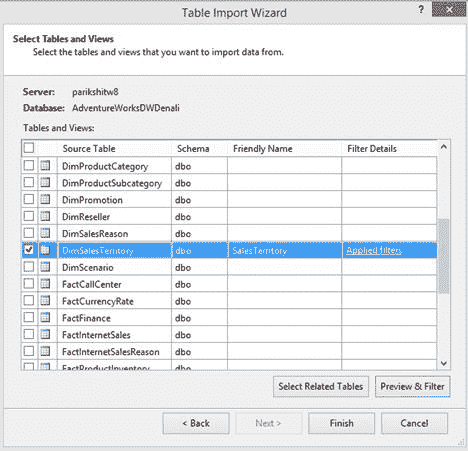

图 22 ：过滤的 DimSalesTerritory 源

一旦我们选择了所有必需的表并应用了必要的过滤器，我们就可以单击 **Finish** 将数据导入到数据模型的表中。对于 SQL Server 数据源，我们还会导入关系以及数据，这些数据在最后一步中可见，即数据准备。对于其他数据源，我们需要在数据模型中手动创建关系。

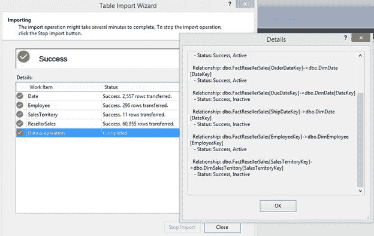

图 23 ：导入数据

接下来我们需要导入表 **DimProduct** ， **DimProductSubCategory** 和 **DimProductCategory** ，但我们不需要将它们作为三个单独的表导入。相反，我们希望将这三个表非规范化为一个名为 columns 的表。

为此，我们需要再次启动**表导入向导**并通过编写连接三个表并导入所需列的 SQL 查询来导入表。

由于我们已经创建了与 AdventureWorksDW2012 的连接，我们可以单击工具栏上的**现有** **连接**选项以启动表导入向导，如下图所示。

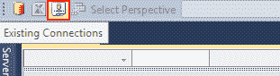

图 24 ：现有连接按钮

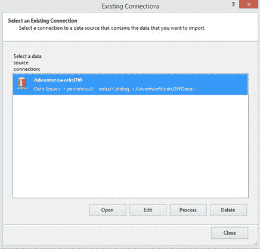

图 25 ：现有连接列表

选择 **AdventureWorksDW** ，然后单击**打开**。下一个窗口将为您提供如何导入数据的选项。选择**编写将指定要导入的数据**选项的查询。

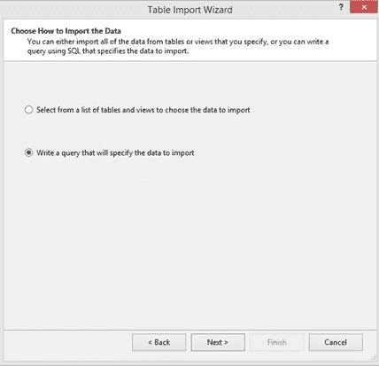

图 26 ：数据导入选项

接下来，我们键入以下 TSQL 查询，该查询从多个表（DimProduct，DimProductCategory 和 DimProductSubCategory）导入数据。

```
SELECT
DimProduct.ProductKey
    ,DimProduct.EnglishProductName
    ,DimProduct.Color
    ,DimProduct.[Size]
    ,DimProduct.Weight
    ,DimProduct.LargePhoto
    ,DimProductCategory.EnglishProductCategoryName
    ,DimProductSubcategory.EnglishProductSubcategoryName
    FROM
    DimProductSubcategory
    INNER JOIN DimProduct
    ON DimProductSubcategory.ProductSubcategoryKey = DimProduct.ProductSubcategoryKey
    INNER JOIN DimProductCategory
    ON DimProductSubcategory.ProductCategoryKey = DimProductCategory.ProductCategoryKey

```

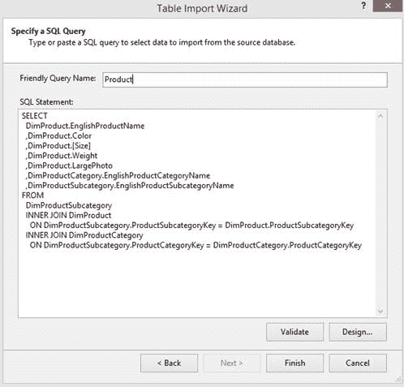

图 27 ：键入查询以从多个表导入数据

将表命名为**产品**，然后单击**完成**以导入数据。

|  | 注意：出于开发目的，在 SSDT 中设计表格模型时，建议仅导入原始数据库的子集，因为所有数据处理都驻留在工作区服务器实例上的临时工作空间数据库中。 |

我们现在已将以下五个表从数据源导入表格模型：


图 28 ：导入的表格

## 修改或删除导入的表格

如果您对从表中导入的表或列不满意，可以删除表或修改其列。首先，单击窗口底部要更改的表的选项卡。下图显示了正在选择的经销商销售表。然后，单击菜单中的**表**选项。顾名思义，**删除表**选项允许您删除表，而选择**表属性**允许您修改用于导入表的表或 TSQL 查询。

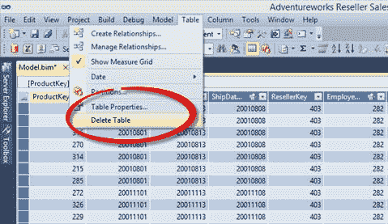

图 29 ：删除表格

## 修改或删除表格中的列

通过选择列并右键单击列，我们可以在导入列后重命名，过滤或删除列，如下图所示。

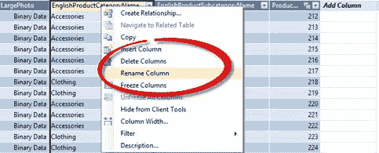

图 30 ：修改列

在我们的数据模型中，我们导入了所有表，但是我们无法提供列名（我们可以使用列别名在 SQL 查询中提供列名，我们在上一个查询中遗漏了这些列）。将数据导入表后，将列重命名为用户友好名称非常重要，因为数据模型将按原样向最终用户公开。

我们将使用新的用户友好名称重命名以下列：

| 表 | 源列名称 | 用户友好的列名称 |
| 产品 | EnglishProductCategoryName | 产品类别 |
| 产品 | EnglishProductSubCategoryName | 产品子类别 |
| 产品 | EnglishProductName | 产品 |
| SalesTerritory | SalesTerritoryRegion | 地区 |
| SalesTerritory | SalesTerritoryCountry | 国家 |
| SalesTerritory | SalesTerritoryGroup | 组 |
| 日期 | EnglishMonthName | 月 |

同样，使用表导入向导，我们可以从各种其他数据源导入数据。

以下是表格数据模型支持的数据源列表：

| 资源 | 版本 | 文件类型 | 供应商 |
| 访问数据库 | Microsoft Access 2003,2007,2010 | .accdb 或.mdb | ACE 14 OLE DB 提供程序 |
| SQL Server 关系数据库 | Microsoft SQL Server 2005,2008,2008 R2; SQL Server 2012，Microsoft SQL Azure 数据库 2 | n / a | SQL Server 的 OLE DB 提供程序 SQL Server Native Client OLE DB 提供程序 SQL Server Native 10.0 客户端 OLE DB 提供程序 SQL 客户端的.NET Framework 数据提供程序 |
| SQL Server 并行数据仓库（PDW）3 | 2008 R2 | n / a | SQL Server PDW 的 OLE DB 提供程序 |
| Oracle 关系数据库 | Oracle 9i，10g，11g | n / a | Oracle OLE DB 提供程序适用于 Oracle 客户端的.NET Framework 数据提供程序 SQL Server 的.NET Framework 数据提供程序 OraOLEDBMSDASQL |
| Teradata 关系数据库 | Teradata V2R6，V12 | n / a | TDOLEDB OLE DB 提供程序 Teradata 的.NET 数据提供程序 |
| Informix 关系数据库 |  | n / a | Informix OLE DB 提供程序 |
| IBM DB2 关系数据库 | 8.1 | n / a | DB2OLEDB |
| Sybase 关系数据库 |  | n / a | Sybase OLE DB 提供程序 |
| 其他关系数据库 | n / a | n / a | OLE DB 提供程序或 ODBC 驱动程序 |
| 文本文件 | n / a | .txt，.tab，.csv | 用于 Microsoft Access 的 ACE 14 OLE DB 提供程序 |
| Microsoft Excel 文件 | Excel 97-2003,2007,2010 | .xlsx，xlsm，.xlsb，.xltx，.xltm | ACE 14 OLE DB 提供程序 |
| PowerPivot 工作簿 | Microsoft SQL Server 2008 R2 分析服务 | xlsx，xlsm，.xlsb，.xltx，.xltm | ASOLEDB 10.5（仅用于发布到安装了 PowerPivot for SharePoint 的 SharePoint 场的 PowerPivot 工作簿） |
| Analysis Services 多维数据集 | Microsoft SQL Server 2005,2008,2008 R2 Analysis Services | n / a | ASOLEDB 10 |
| 数据馈送（用于从 Reporting Services 报告，Atom 服务文档，Microsoft Azure Marketplace DataMarket 和单数据馈送中导入数据） | Atom 1.0 格式作为 Windows Communication Foundation（WCF）数据服务（以前称为 ADO.NET 数据服务）公开的任何数据库或文档。 | .atomsvc​​，用于定义一个或多个订阅源的服务文档.atom for Atom 网络订阅源文档 | PowerPivot 的 Microsoft 数据馈送提供程序 PowerPivot 的.NET Framework 数据馈送数据提供程序 |
| Office 数据库连接文件 |  | .odc |  |

在本节中，我们将数据源中的数据导入到数据模型中。在下一节中，我们将设计层次结构，关系和 KPI，以增强报告模型。

## 定义关系

一旦在数据模型中导入了所有必需的数据并应用了相关的过滤器，我们接下来应该定义表之间的关系。

与使用关系定义约束（主键或外键）的 RDBMS 不同，我们将在表格数据模型中定义关系，以便在定义计算列和度量时在 DAX 公式中使用它们。有两个 DAX 公式，如 USERELATIONSHIP，RELATED 和 RELATEDTABLE，用于定义纯粹依赖于关系的计算。

从 SQL Server 数据源导入数据时，当我们从 SQL 数据库中选择多个表时，表导入向导会自动检测数据库中定义的关系，并将其与数据准备阶段中的数据一起导入。对于其他数据源，我们需要在导入数据后手动创建关系。

在我们的示例中，由于我们通过再次运行表导入向导导入了 Product 表，因此不会自动导入 Product 表的关系。我们需要手动创建关系。

有两种方法可以创建关系。

在第一种方式中，我们点击具有外键 ProductKey 列的**经销商销售**表，单击**表**选项卡，然后选择**创建关系**，如图所示下图

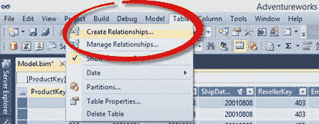

图 31 ：创建关系菜单项

这将打开“创建关系”窗口。我们可以提供**相关查找表**和**相关查找列**，如下图所示。

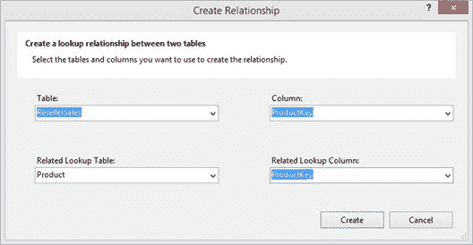

图 32 ：创建关系窗口

我们还可以使用图表视图定义关系。我们可以通过单击项目右下角的**图**选项切换到图表视图，如下图所示。

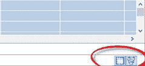

图 33 ：图表视图选项

在图表视图中，我们可以将 **ResellerSales** 表中的 **ProductKey** 列拖到 **Product** 表中的 **ProductKey** 列和关系将创建，如下图所示。

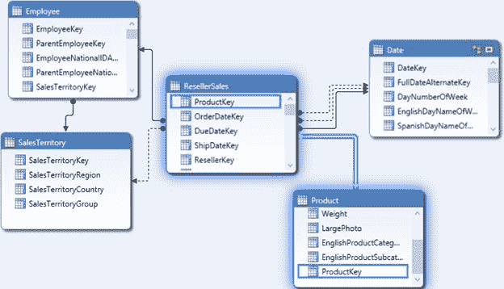

图 34 ：使用图表视图创建关系

图表视图对于查看所有表及其关系非常有用，尤其是在我们处理大型复杂数据集市时。

在图表视图中，连接表的实线称为活动关系，连接表的虚线称为非活动关系。

当表与具有多个关系的另一个表相关时，我们会看到非活动关系。例如，在上图中，Date 表是角色扮演维度，因此它与具有多个关系的 Reseller Sales 表相关（OrderDateKey，DueDateKey 和 CloseDateKey）。在这种情况下，只有一个关系可以被认为是活动的，它将由 RELATED 和 RELATEDTABLE DAX 函数使用，而其他两个关系被认为是非活动的，可以与 UseRelationship DAX 函数一起使用。

我们可以通过右键单击虚线非活动关系并选择 **Mark as Active** 将非活动关系切换为活动关系，如下图所示。

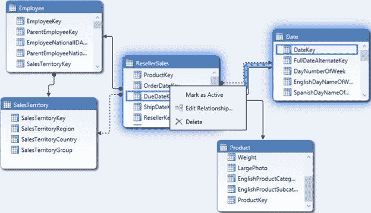

图 35 ：将关系更改为活动

现在我们已经定义了关系，我们将学习如何定义层次结构。

## 定义层次结构

当用户从高级聚合数据导航到详细数据时，层次结构对于分析非常有用。因此，多维数据集或数据模型支持创建层次结构以允许用户向下钻取或汇总数据非常重要。大多数维度表包含分层数据。

例如，时间维度可以具有层次结构：Year&gt;学期&gt;季度&gt;每月&gt;每周&gt;天。地理维度可以具有层次结构 Country&gt;状态&gt;市。

层次结构的特征是：

*   它包含从父级别到子级别的多个级别。
*   每个父级可以有多个子级，但子级只能属于一个父级。

在我们的数据模型中，我们可以有以下层次结构：

| 表 | 等级制度 |
| 产品 | 产品类别&gt;产品子类别&gt;产品 |
| 日期 | 日历年&gt;日历学期&gt;日历季 |
| 日期 | 会计年度&gt;财政学期&gt;财政季度 |
| SalesTerritory | 组&gt;国家&gt;地区 |

为了创建层次结构，我们需要切换到图表视图。在图表视图中的每个表的标题处，我们看到了创建层次结构的选项。


图 36 ：在图表视图中创建层次结构按钮

当我们单击**创建层次结构**时，它将创建一个新的层次结构对象，我们将其命名为 **Calendar Hierarchy** ，如下图所示。

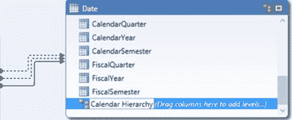

图 37 ：创建新的层次结构

接下来，我们将 **CalendarYear** 列从表格拖动到**日历层次结构**，然后拖动 **CalendarSemester** 和 **CalendarQuarter** 以形成日历层次结构如下图所示。

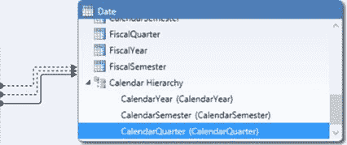

图 38 ：创建日历层次结构

同样，我们创建财务，产品和地理层次结构。

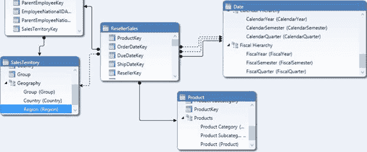

图 39 ：财政，地理和产品层次结构

## 定义计算列

计算列只是使用 DAX 公式定义的派生列。计算列在行上下文中进行计算，换句话说，对于表的每一行进行计算。

在我们的数据模型中，我们有 Employee 表，其中每个员工的 FirstName，MiddleName 和 LastName 都在一个单独的列中捕获。但是，对于报告和分析，使用其全名（FirstName + MiddleName + LastName）来表示员工是有意义的。为此，我们在 Employee 表中定义一个名为 Name 的计算列，以连接每个员工的 FirstName，MiddleName 和 LastName。

要添加计算列，我们转到 Employee 表并向右滚动，直到到达最后一列。在最后一列之后的列中，我们可以开始键入 DAX 公式来定义计算列。

```
=Employee[FirstName] & " " & Employee[MiddleName] & " " & Employee[LastName]

```

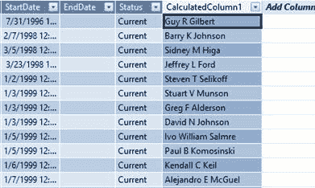

图 40 ：添加计算列

默认情况下，该列将命名为 CalculatedColumn1，我们需要通过右键单击列来重命名为 **Name** ，如前所述。

在我们的数据模型中，CalendarQuarter 和 FiscalQuarter 由数值 1,2,3 和 4 表示;但是，从报告的角度来看，季度表示为 Q1，Q2，Q3 和 Q4。因此，我们使用以下 DAX 公式定义计算列：

```
="Q" & 'Date'[FiscalQuarter]
="Q" & 'Date'[CalendarQuarter]

```

## 定义计算的度量

计算的度量是在维度层次结构的各个维度和级别上聚合的感兴趣度量。

在我们的数据模型中，ResellerSales 表源自一个事实表，该事实表由用于查找维度表和度量列的关键列组成，这些列需要聚合。 “经销商销售”表中感兴趣的关键指标之一是“销售额”，需要在各个维度上进行汇总。因此，我们需要定义一个名为 Sales 的计算度量来计算 Sales Amount 的总和。

需要在度量网格中定义计算度量，这在表格选项卡下方的部分中可见，如图 41 所示。我们使用以下 DAX 公式定义计算度量 Sales。

```
Sales:=SUM(ResellerSales[SalesAmount])

```

|  | 注意：此时不要担心 DAX 语法。我们将在下一章详细介绍 DAX。 |

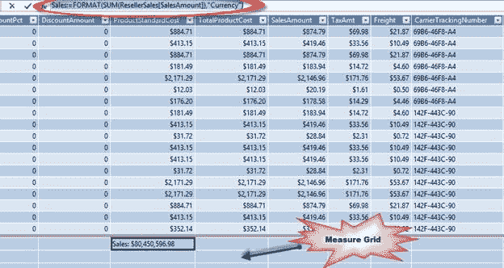

图 41 ：在测量网格中定义计算的测量

接下来，我们使用以下 DAX 公式定义计算的度量 Cost，Profit 和 Margin。

```
Cost:=SUM(ResellerSales[TotalProductCost])
    Profit:=[Sales]-[Cost]
    Margin:=([Profit]/[Cost])*100

```

将计算的度量格式化为货币和百分比格式，如下图所示，将在本书后面介绍。

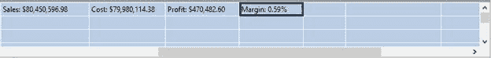

图 42 ：单位格式的测量

我们将在下一章学习 DAX 时定义更多计算的度量。在下一节中，我们将学习如何定义 KPI。

## 定义 KPI

关键绩效指标（KPI）是衡量指标与目标之间关系的图形和直观表示。

如下图所示，KPI 是状态或趋势指标，可用于突出显示度量与目标的偏差。

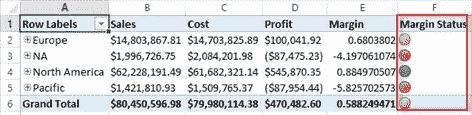

图 43 ：KPI

在我们的数据模型中，我们已经定义了计算的度量保证金，它计算利润百分比与成本之比。现在，该组织希望设置一个关键绩效指标，如果保证金超过成本的 0.8% 则认为是好的，如果保证金在 0.4% 和 0.8% 之间，则利润为中等或平均，如果保证金低于 0.2% ，被认为是差的。

为了分析保证金，我们通过选择我们定义了保证金的单元格来定义 KPI，右键单击它，然后选择**创建 KPI** ，如下图所示。

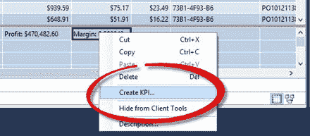

图 44 ：创建 KPI 选项

在 KPI 窗口中，已经选择了边距测量，我们可以通过单击**绝对值**选项并将目标值设置为“1”来将目标或目标设置为绝对值，如图所示下图然后，我们为较低频段选择状态阈值为 0.2，为较高频段选择 0.8，并选择 KPI 图标样式作为红色，黄色和绿色圆形指示符。

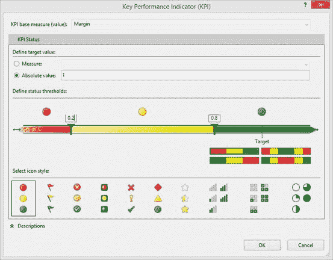

图 45 ：设置 KPI

单击 **OK** 后，将在 Margin 度量的数据模型中创建 KPI。为了验证 KPI，我们可以通过单击项目左上方工具栏中的 **Excel** 图标来浏览 Excel 中的数据模型：


图 46 ：在 Excel 中分析选项

这将打开一个身份验证窗口，如下图所示。我们需要使用**当前 Windows 用户**选项登录并打开 Excel，然后单击 **OK** 。本书稍后将介绍身份验证和安全性。

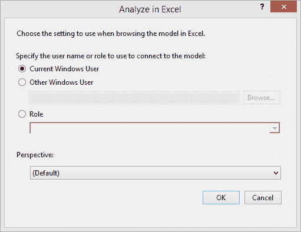

图 47 ：用于分析 Excel 中数据模型的用户选项

Excel 将打开一个数据透视表和与模型的数据连接。在**数据透视表字段**窗口中，我们可以将地理层次结构拖动到**行**区域，并将销售，成本，KPI 值，保证金和 KPI 状态拖到**值**区域如下图所示。生成的 Excel 报告如下：

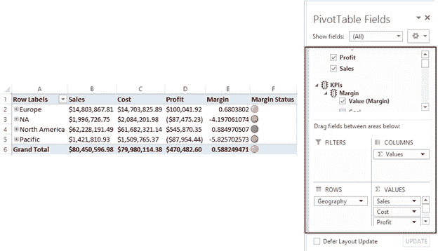

图 48 ：在 Excel 中分析的数据模型

## 过滤数据模型

有两种方法可以过滤行数据：

*   从数据源导入时过滤数据
*   从表导入后过滤数据

第一种选择是首选方法;从数据源导入时过滤数据有助于减少处理时间和存储要求。在[导入数据](#_Import_data_to)部分中，我们讨论了各种过滤器选项。在本节中，我们将讨论在数据加载到数据模型后对数据进行过滤。

加载数据后，我们可以根据列的数据类型使用以下过滤器：

*   数字过滤器
*   文字过滤器
*   日期过滤器

要根据任何列过滤行，我们需要单击列旁边的下拉箭头以查看过滤器选项。

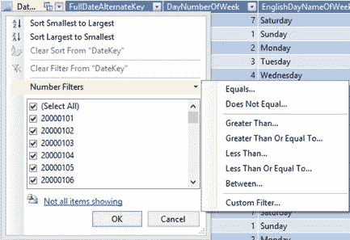

图 49 ：数字过滤器选项

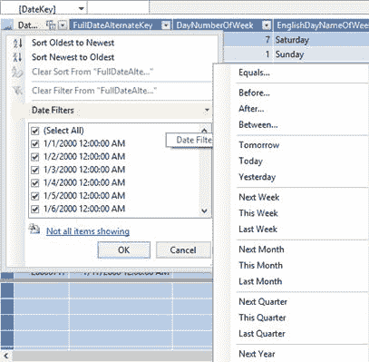

图 50 ：日期过滤器选项

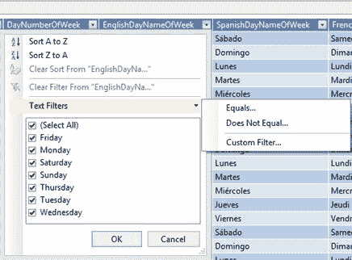

图 51 ：文本过滤器选项

如上图所示，当我们点击数字列 DateKey 时，我们看到数字过滤器，当我们点击日期列 FullDateAlternateKey 时，我们会看到日期过滤器，当我们点击文本列 EnglishDayNameOfWeek 时，我们会看到文本过滤器。

如果我们为表的任何列定义过滤器，我们会在列标题旁边看到以下图标：

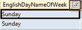

图 52 ：过滤的列标题

如果我们想暂时过滤某些要求的数据并在以后删除它，那么过滤数据模型中的数据可能是一个不错的选择。

## 对数据模型进行排序

如上图所示，单击列标题上的下拉列表将打开一个选项，以按升序或降序对列进行排序。

根据列的数据类型，以下选项可用于排序。

| 数据类型 | 升序期权 | 降序选项 |
| 号码 | 从最小到最大 | 从最大到最小 |
| 文字 | A 到 Z | Z 到 A |
| 日期 | 最新到最新 | 最新到最早 |

除了这些排序选项之外，我们还有其他选项可以根据另一列的值对列进行排序。这些非常有用，实际上在某些情况下是必需的。

在我们的数据模型中，我们在日期表中有一个 Month 列。 Month 列是文本数据类型，如果我们尝试按月自己的数据值对月份列进行排序，我们将看到以下报告：

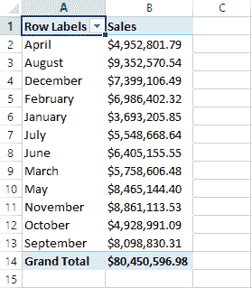

图 53 ：Sorted Month 列

在此报表中，数据按月值按升序排序，其中四月位于顶部，九月位于底部，但这不是我们想要的。我们希望 Month 列可以根据全年的月份顺序进行排序，而不是按字母顺序排序。为此，我们需要根据 MonthNumberOfYear 列进行排序。

为此，我们使用**按列排序**选项，如下图所示：

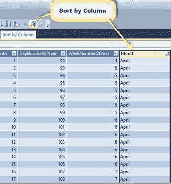

图 54 ：按列按钮排序

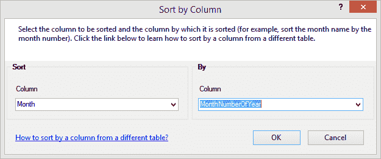

图 55 ：按列选项排序

我们选择**月**列，单击**按列**排序，然后选择 **MonthNumberOfYear** 作为**按列**。这将按 MonthNumberOfYear 对 Month 列进行排序，并按预期顺序向我们提供报告。

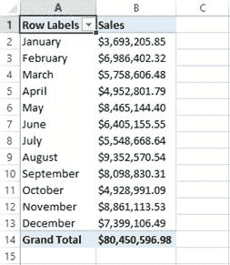

图 56 ：按 MonthNumberOfYear 列排序的 Month 列

## 小结

在本章中，我们学习了如何使用 SSDT 使用 SSAS 表格模型开发数据模型。在下一章中，我们将重点介绍 DAX 语言，该语言用于定义计算列和度量以及表格模型的查询语言。