# 第 3 章学习 DAX

数据分析表达式（DAX）是用于在表格数据模型中定义计算的语言。 DAX 也是客户端报告工具用于查询表格数据模型的查询语言。在本章中，我们将从 DAX 的基础知识（语法，运算符，数据类型和求值上下文）开始，然后学习 DAX 函数。

DAX 查询引用包含许多函数，这些函数对表或表本身的列进行操作，并计算为标量常量或返回表。

## DAX 语法

当 DAX 用于定义计算的列或度量时，公式始终以等号（=）开头。在 DAX 语法中，表的列名始终在方括号[]中引用，列名称前面是表的名称。

例如，在上一章中，我们使用以下公式在 Employee 表中定义了计算的“Name”列：

```
=Employee[FirstName] & " " & Employee[MiddleName] & " " & Employee[LastName]

```

我们使用以下公式在数据模型中定义了度量：

```
Sales:=SUM(ResellerSales[SalesAmount])

```

在这些示例中，我们看到公式以等号开头，并且所有列都被引用为＆lt; _ 表名 _＆gt; **[＆lt;** _ 列名称＆gt;_ **]** 。

当 DAX 用作查询表格数据模型的查询语言时，语法显示为：

```
DEFINE
    { MEASURE <table>[<col>] = <expression> }]
EVALUATE <Table Expression>
[ORDER BY {<expression> [{ASC | DESC}]} [, …]
    [START AT {<value>|<parameter>} [, …]] ]

```

DAX 作为查询语言始终以 EVALUATE 关键字开头，后跟表达式，该表达式返回一个表。

## DAX 运算符

DAX 支持四种不同类型的计算运算符：算术运算，比较运算，文本串联运算和逻辑运算运算符。

算术运算符

| 操作者 | 手术 |
| + | 添加 |
| - | 减去 |
| * | 乘以 |
| / | 除以 |
| ^ | Exponentiation |

比较运算符

| 操作者 | 手术 |
| = | 等于 |
| ＆gt; | 大于 |
| ＆lt; | 小于 |
| ＆gt; = | 大于或等于 |
| ＆lt; = | 小于或等于 |
| ＆lt;＆gt; | 不等于 |

文本运算符

| 操作者 | 手术 |
| ＆amp; | 连接 |

逻辑运算符

| 操作者 | 手术 |
| ＆amp;＆amp; | 逻辑 AND |
| &#124;&#124; | 逻辑或 |

DAX 运算符具有以下优先顺序：

1.  ^
2.  - （负值的符号运算符）
3.  * /
4.  ！ （不是运算符）
5.  + -
6.  ＆安培;
7.  ＆lt;，＆gt;，＆gt; =，＆lt; =，=，＆lt;＆gt;

## DAX 数据类型

支持以下数据类型。导入数据或使用公式中的值时，即使原始数据源包含不同的数据类型，数据也会转换为以下数据类型之一。公式生成的值也使用这些数据类型。

| 模型中的数据类型 | DAX 中的数据类型 | 描述 |
| 整数 | 64 位（8 字节）整数值 | 没有小数位的数字。整数可以是正数或负数，但必须是-9,223,372,036,854,775,808（-2 ^ 63）和 9,223,372,036,854,775,807（2 ^ 63-1）之间的整数。 |
| 十进制数 | 64 位（8 字节）实数 | 实数是可以有小数位的数字。实数涵盖了各种各样的值：
负值从-1.79E +308 到-2.23E -308
零
正值从 2.23E -308 到 1.79E + 308
但是，有效位数限制为 15 位小数。 |
| 布尔 | 布尔 | 是真值还是假值。 |
| 文字 | 字符串 | Unicode 字符数据字符串。可以是以文本格式表示的字符串，数字或日期。 |
| 日期 | 日期/时间 | 接受日期时间表示中的日期和时间。
有效日期是 1900 年 3 月 1 日之后的所有日期。 |
| 货币 | 货币 | 货币数据类型允许介于-922,337,203,685,477.5808 和 922,337,203,685,477.5807 之间的值，具有四个固定精度的十进制数字。 |
| N / A | 空白 | 空白是 DAX 中表示并替换 SQL 空值的数据类型。您可以使用 BLANK 函数创建空白，并使用逻辑函数 ISBLANK 测试空白。 |

此外，DAX 使用表数据类型。 DAX 在许多函数中使用此数据类型，例如聚合和时间智能计算。有些函数需要引用表;其他函数返回一个表，然后可以将其用作其他函数的输入。在某些需要表作为输入的函数中，您可以指定一个表达式来计算表。对于某些函数，需要引用基表。

## 求值上下文

DAX 公式或表达式始终在以下某个上下文中进行求值：

*   行上下文
*   查询上下文
*   过滤上下文

行上下文

在行上下文中计算 DAX 公式时，将对表达式引用的列的每一行计算表达式。计算列表达式始终在行上下文中计算。

例如，在我们的数据模型中，我们使用以下 DAX 公式定义了计算列。

```
=Employee[FirstName] & " " & Employee[MiddleName] & " " & Employee[LastName]

```

对 Employee 表的每一行计算此 DAX 公式，因此在 Employee 表的行上下文中进行求值。

查询上下文

在查询上下文中计算 DAX 公式时，将通过应用为该查询定义的过滤器来计算表达式。

例如：

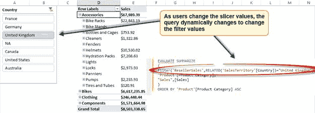

图 57 ：动态更改查询

在此 Excel 报表中，当用户单击 Country Slicer 的各种值时，数据透视表的 DAX 查询会动态更改以反映用户选择的过滤器值。换句话说，DAX 查询据说在查询上下文中进行求值。

过滤上下文

在筛选器上下文中求值 DAX 公式时，公式中定义的筛选器将覆盖查询上下文或行上下文中的任何筛选器。例如，在我们的数据模型中，我们定义以下计算度量：

```
FY04 Sales:=CALCULATE(SUM(ResellerSales[SalesAmount]),'Date'[FiscalYear]=2004)

```

此公式包含 2004 会计年度的过滤器，因此将始终在此过滤器上下文中进行求值。

如果在 Excel 报表中使用度量“FY04 Sales”并使用财务年度的切片器设置，则切片器选择不会影响 FY04 销售度量值，因为度量将在筛选器上下文中计算，从而覆盖查询上下文。

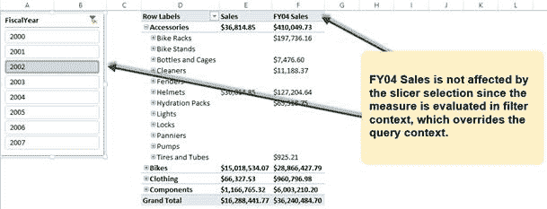

图 58 ：在 Excel 中过滤上下文

## DAX 函数

DAX 语言包含丰富的函数，使其成为分析和报告的强大语言。这些函数分为以下几类：

*   聚合函数
*   日期和时间函数
*   过滤函数
*   信息函数
*   逻辑函数
*   数学和三角函数
*   统计函数
*   文字函数
*   时间智能函数

讨论 DAX 查询参考中的每个函数超出了本书的范围;但是，我们将讨论每个类别中的一些常用函数。

### 聚合函数

聚合函数用于聚合列。这些主要用于定义度量。

以下是 DAX 中可用的聚合函数列表以及每个函数的简要说明。

| 函数 | 使用 |
| 平均 | 返回列中所有数字的平均值（算术平均值）。 |
| AVERAGEA | 返回列中所有值的平均值（算术平均值）。处理文本和非数字值。 |
| AVERAGEX | 平均在表上计算的一组表达式。 |
| MAX | 返回列中的最大数值。 |
| MAXX | 返回通过表计算的一组表达式中的最大值。 |
| MIN | 返回列中的最小数值。 |
| MINX | 返回通过表计算的一组表达式中的最小值。 |
| SUM | 添加列中的所有数字。 |
| SUMX | 返回在表上计算的一组表达式的总和。 |
| COUNT | 计算列中数值的数量。 |
| COUNTA | 计算列中非空的值的数量。 |
| COUNTAX | 计算在表上计算的一组表达式。 |
| COUNTBLANK | 计算列中空白值的数量。 |
| COUNTX | 计算表中的总行数。 |
| COUNTROWS | 计算从嵌套表函数返回的行数，例如过滤函数。 |

聚合函数非常易于理解且易于使用。在上表中列出的函数集中，聚合函数的变体带有“X”后缀，例如 SUMX 和 AVERAGEX。这些函数用于在表或返回表的表达式上聚合表达式。例如，SUMX 的语法是：

```
SUMX(<table>, <expression>)

```

我们可以如下定义计算的度量。

```
France Sales:=SUMX(FILTER('ResellerSales',RELATED(SalesTerritory[Country])="France"),ResellerSales[SalesAmount])

```

在此公式中，FILTER 函数首先过滤法国的经销商销售，稍后 SUMX 函数会为法国的销售交易聚合 SalesAmount。

X 后缀聚合函数使我们可以灵活地聚合从表达式返回的一组行（或表）。

上表中列出的某些聚合函数后缀为“A”（AVERAGEA，COUNTA）。 “A”后缀函数使用非数字数据类型聚合列或数据。所有其他聚合函数只能聚合数值数据类型。例如：

```
COUNTA(<column>)

```

当函数找不到任何要计数的行时，该函数返回一个空白。如果有行，但它们都不符合指定的条件，则该函数返回 0。

```
Regions:=COUNTA(SalesTerritory[Region])

```

之前的 DAX 公式计算 AdventureWorks 销售区域所涵盖的区域，可以在以下报告中使用。

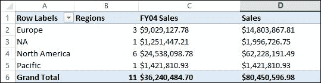

图 59 ：使用聚合公式表示非数字数据类型

### 日期和时间函数

在数据仓库或维度模型中，日期和时间维度是一致的维度，因为它们在所有数据集市中用于分析日期和时间的度量。数据模型中定义的日期维度应具有尽可能多的列或属性（例如，Day，Month，DayOfWeek，MonthOfYear），以便最终用户可以灵活地识别数据中的趋势。

为了支持跨日期和时间维度的分析，以及从 Date 列中提取各种属性，我们具有以下日期和时间函数。

| 函数 | 使用 |
| 日期 | 将指定日期作为日期时间返回。 |
| DATEVALUE | 将文本日期值转换为日期时间格式的日期。 |
| DAY | 以数值形式返回月中的某天。 |
| EDATE | 将日期作为开始日期之前或之后的月份返回。 |
| EOMONTH | 返回该月最后一天的日期。 |
| HOUR | 将小时作为 0 到 23 之间的数值返回。 |
| MINUTE | 将分钟作为 0 到 59 之间的数值返回。 |
| 个月 | 将月份作为 1 到 12 之间的数值返回。 |
| 现在 | 返回当前日期和时间。 |
| TIME | 将小时，分钟和秒转换为日期时间格式的时间值。 |
| TIMEVALUE | 将文本日期值转换为日期时间格式的时间。 |
| 今天 | 返回当前日期。 |
| WEEKDAY | 以 1（星期日）和 7（星期六）之间的数值返回当前星期几。 |
| WEEKNUM | 返回年份的周数。 |
| 年 | 返回日期的当前年份，整数值介于 1900 和 9999 之间。 |
| YEARFRAC | 计算两个日期之间天数所代表的年份比例。 |

函数 DAY，MONTH 和 YEAR 分别用于从日期值中提取日，月和年。例如：

```
YEAR(<date>) , Day(<date>), Month(<date>)
=YEAR('Date'[FullDateAlternateKey])

```

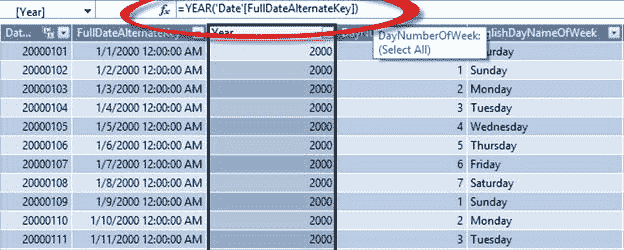

图 60 ：使用日期和时间函数

### 过滤函数

过滤函数是另一个常用的函数集，我们已经在一些先前的例子中使用过它们。当我们对表中各列的度量进行切片和切块时，我们会过滤列的这些值的数据，这是通过使用过滤函数实现的。

下表列出了可用的过滤器函数。

| 函数 | 使用 |
| CALCULATE（＆lt; expression＆gt;，＆lt; filter1＆gt;，＆lt; filter2＆gt; ...） | 计算由函数中指定过滤器修改的上下文中的表达式。 |
| CALCULATETABLE（＆lt; expression＆gt;，＆lt; filter1＆gt;，＆lt; filter2＆gt; ...） | 计算由函数中指定过滤器修改的上下文中的表表达式。 |
| 相关（＆lt; column＆gt;） | 返回另一个相关表的相关值。 |
| RELATEDTABLE（＆lt; TableName＆gt;） | 根据过滤器上下文计算表表达式。 |
| ALL（{＆lt; table＆gt; &#124;＆lt; column＆gt; [，＆lt; column＆gt; [，＆lt; column＆gt; [，...]]]}） | 返回表中的所有行或列中的所有值，忽略可能已应用的任何过滤器。 |
| ALLEXCEPT（＆lt; table＆gt;，＆lt; column＆gt; [，＆lt; column＆gt; [，...]]） | 删除表中除了已应用于指定列的过滤器之外的所有上下文过滤器。 |
| ALLNOBLANKROW（＆lt; table＆gt; &#124;＆lt; column＆gt;） | 从关系的父表中，返回除空行之外的所有行，或列的所有不同值，但返回空行，忽略上下文过滤器。 |
| ALLSELECTED（[＆lt; tablename＆gt; &#124;＆lt; columnname＆gt;） | 获取表示查询中所有行和列的上下文，同时维护过滤器和行上下文。 |
| DISTINCT（＆lt; column＆gt;） | 返回一个由一列组成的表，该列具有与指定列不同的值。 |
| FILTER（＆lt; table＆gt;，＆lt; filter＆gt;） | 返回表示另一个表或表达式的子集的表。 |
| 过滤器（＆lt; columnName＆gt;） | 返回直接作为过滤器应用于 columnName 的值。 |
| HASONEFILTER（＆lt; columnName＆gt;） | 当 columnName 上直接过滤的值的数量为 1 时，返回 TRUE;否则返回 FALSE。 |
| HASONEVALUE（＆lt; columnName＆gt;） | 当 columnName 的过滤上下文仅具有一个不同的值时，返回 TRUE;否则返回 FALSE。 |
| ISCROSSFILTERED（＆lt; columnName＆gt;） | 当过滤 columnName 或同一或相关表中的另一列时，返回 TRUE。 |
| ISFILTERED（＆lt; columnName＆gt;） | 正在过滤 columnName 时返回 TRUE;否则返回 FALSE。 |
| EARLIER（＆lt; column＆gt;，＆lt; number＆gt;） | 用于嵌套计算，其中需要使用某个值作为输入并根据该输入生成计算。 |
| EARLIEST（＆lt; column＆gt;） | 返回指定列的外部求值过程中指定列的当前值。 |
| VALUES（＆lt; column＆gt;） | 返回包含指定列中的不同值的单列表。 |

虽然以前的函数被归类为过滤函数，但每种函数在过滤数据方面都是独一无二的。我们在这里讨论一些过滤函数。

CALCULATE 函数

CALCULATE 函数是用于通过应用各种过滤器来计算表达式的最常用函数之一。 CALCULATE 函数中定义的过滤器会覆盖客户端工具中的查询上下文。例如：

```
CALCULATE( <expression>, <filter1>, <filter2>… )

```

以前，我们将计算出的度量定义为 FY04 Sales，它使用 CALCULATE 函数计算 2004 会计年度的销售额：

```
FY04 Sales:=CALCULATE(SUM(ResellerSales[SalesAmount]),'Date'[FiscalYear]=2004)

```

在之前的 DAX 公式中，SalesAmount 的总和是通过过滤 2004 会计年度的经销商销售表来求值的。我们看到会计年度列在日期表中定义，但仍可以过滤经销商销售表由于表之间定义的关系，使用会计年度。 CALCULATE 函数自动使用表之间的活动关系来过滤表达式。

过滤函数

FILTER 函数通常用于根据过滤条件过滤表或表达式。例如：

```
FILTER(<table>,<filter>)

```

在前面的示例中，要计算 FY04 Sales，我们可以使用以下 DAX 公式计算相同的度量：

```
FY04 Sales:=SUMX(FILTER('ResellerSales',RELATED('Date'[FiscalYear])=2004),ResellerSales[SalesAmount])

```

在此公式中，我们首先过滤 2004 会计年度的经销商销售表，并使用 SUMX 计算经过筛选的经销商销售额的 SalesAmount 总和。

相关函数

RELATED 函数是计算列或度量中使用的另一种常用的常用函数，用于执行对相关表的查找并获取与基础关系相关的列值。 RELATED 函数使用在数据建模期间定义的基础表关系来对相关表执行查找。

RELATED 函数要求当前表与具有相关信息的表之间存在关系。 RELATED 函数允许用户查找与 VLOOKUP for Excel 类似的维或主表。例如：

```
RELATED(<column>)

```

在此示例中，为了计算法国的总销售额，我们使用了 RELATED 函数：

```
France Sales:=SUMX(FILTER('ResellerSales',RELATED(SalesTerritory[Country])="France"),ResellerSales[SalesAmount])

```

在此公式中，我们使用属于 SalesTerritory 的 Country 列过滤 ResellerSales 表。因此，我们使用 RELATED 函数，该函数使用 ResellerSales 表和 SalesTerritory 表之间定义的关系来过滤国家 France 的 ResellerSales 表。

所有函数

ALL 函数用于检索列或表的所有值，忽略可能已应用的任何过滤器。此函数可用于覆盖过滤器并在表中的所有行上创建计算。例如：

```
ALL( {<table> | <column>[, <column>[, <column>[,…]]]} )

```

在我们的数据模型中，让我们说我们需要计算每个国家对总销售额的贡献。为了创建此度量，我们定义以下计算：

```
Total Geography Sales:=CALCULATE(SUM(ResellerSales[SalesAmount]),ALL(SalesTerritory[Country]))
% Geography Contribution:=[Sales]/[Total Geography Sales]

```

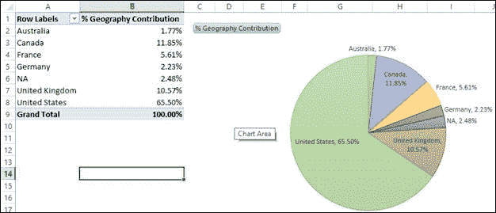

图 61 ：使用 ALL 函数

### 信息函数

信息函数是检查某些数据值，空白或错误​​是否存在的有用函数。大多数信息函数返回布尔值，因此最好与 IF 函数一起使用。

| 函数 | 使用 |
| 包含 | 如果值存在或包含在指定的列中，则返回 TRUE。 |
| ISBLANK | 如果值为空，则返回 TRUE;如果值不为空，则返回 FALSE。 |
| ISERROR | 如果值是错误则返回 TRUE，否则返回 FALSE。 |
| ISLOGICAL | 如果值是逻辑值或布尔值，则返回 TRUE。 |
| ISNONTEXT | 如果指定的值不是文本，则返回 TRUE。 |
| ISNUMBER | 如果指定的值是数字，则返回 TRUE。 |
| ISTEXT | 如果指定的值是文本，则返回 TRUE。 |
| LOOKUPVALUE | 返回符合为搜索指定的所有条件的行的值。 |
| 路径 | 返回带有当前标识符的所有父项的标识符的分隔文本字符串，从最旧的开始并持续到当前。 |
| PATHCONTAINS | 如果项目存在于指定的 PATH 中，则返回 TRUE。 |
| PATHITEM | 从 PATH 函数的求值返回指定位置的项目。职位从左到右进行求值。 |
| PATHITEMREVERSE | 从求值 PATH 函数得到的字符串返回指定位置的项目。位置从右向左计数。 |
| PATHLENGTH | 返回给定 PATH 结果中指定项目的父项数，包括 self。 |

包含函数

CONTAINS 函数返回一个布尔数据类型（True 或 False），具体取决于该值是否存在于指定的列中。例如：

```
CONTAINS(<table>, <columnName>, <value>[, <columnName>, <value>]…)

```

考虑一个场景，AdventureWorks 管理层决定修改销售目标，以便每个国家都应该尝试达到 20％增长的销售目标，但美国除外。由于市场条件，管理层决定为美国设定 10％的增长目标。

要计算修订后的销售目标，我们使用 CONTAINS 函数，如下所示：

```
Revised Sales Target:=IF(CONTAINS(ResellerSales,SalesTerritory[Country],"United States"),[Sales]+0.1*[Sales],[Sales]+0.2*[Sales])

```

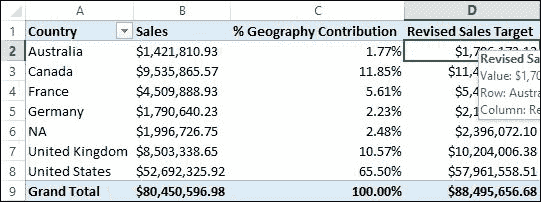

图 62 ：使用 CONTAINS 函数

ISBLANK 函数

ISBLANK 函数检查列值并返回一个布尔值，具体取决于列值是否为空。

Blank 是表格数据模型中可用的特殊数据类型，用于处理空值。空白不表示 0 或空白文本字符串。空白是没有值时使用的占位符。此外，在表格数据模型中，我们没有空值，因此在导入数据时，空值将转换为空值。

ISBLANK 函数可用于检查列中的空白值。例如：

```
ISBLANK(<value>)
PreviousSales:=CALCULATE([Sales],PARALLELPERIOD('Date'[FullDateAlternateKey],-1,YEAR))
YoY:=[Sales]-[PreviousSales]
YoY %:=IF(ISBLANK([Sales]),BLANK(),IF(ISBLANK([PreviousSales]),1,[YoY]/[PreviousSales]))

```

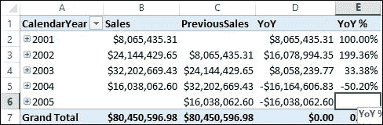

图 63 ：在数据模型中使用 ISBLANK 函数

在此示例中，我们使用 ISBLANK 函数来测试当前年份的销售额是否为空白，如果它们为空白，则显示空白值。此外，如果当前年度的销售额不是空白，我们会检查前一年的销售额是否为空白。如果是，我们代表销售额增长 100％;否则我们会计算上一年销售额的增长百分比。

类似地，我们有 ISTEXT，ISNONTEXT，ISERROR 和 ISLOGICAL 函数，用于测试列的值并返回布尔值。

路径函数

PATH 函数专门用于解决父子维度。与自动检测并创建父子层次结构的多维模型不同，表格数据模型不支持创建开箱即用的父子层次结构。

在我们的数据模型中，我们有一个具有父子关系的员工表，其中每一行代表一个拥有经理的员工，而经理又是同一个表中的员工。

首先，我们使用 PATH 函数在 Employee 表中创建一个计算列，以确定每个员工到其父级的路径。

```
=PATH(Employee[EmployeeKey],Employee[ParentEmployeeKey])

```

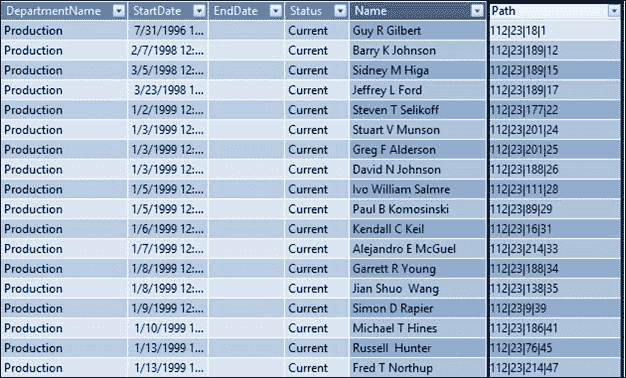

图 64 ：使用 PATH 函数

如您所见，该列现在包含从下到上存储为单个字符串值的 EmployeeKey 的完整路径。

现在，对于父子关系中的每个级别，我们要创建一个列。我们对每个计算列使用 DAX 函数 PathItem 来获取特定级别的键。要获得路径的第一级，我们使用以下函数。

```
=PathItem([Path],1,1)

```

要获得第二级，我们使用以下函数。

```
=PathItem([Path],2,1)

```

PathItem 函数的输出将是 manager 的 EmployeeKey;但是，我们需要管理器的名称，因此我们使用 LOOKUPVALUE 函数进行查找，如下所示。

```
=LOOKUPVALUE(Employee[Name], Employee[EmployeeKey],PATHITEM([Path],1,1))

```

我们使用先前的 LOOKUPVALUE 函数为层次结构的每个级别定义计算列，以形成展平的层次结构，如下图所示。

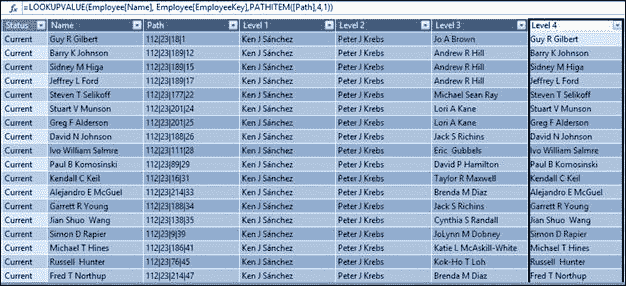

图 65 ：使用 PathItem 和 LOOKUPVALUE 列出层次结构级别

接下来，我们通过切换到图表视图来创建 Employees 层次结构：

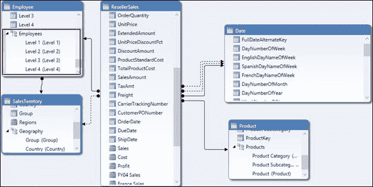

图 66 ：创建 Employees 层次结构

现在，我们在 Excel 中浏览层次结构：

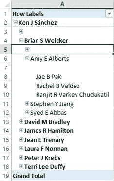

图 67： Excel 中的员工层次结构

用于创建父子层次结构的每种方法的缺陷是：

*   应提前知道父子层次结构中的级别数，以便我们可以为每个级别创建计算列。
*   如果我们有一个参差不齐的层次结构，则某些级别为空 - 因此图 67 中的层次结构中为空白值。但是，我们可以使用 ISBLANK 函数处理空白值。

这种使用 Path 函数创建父子层次结构的方法引用了以下博客作者：Kasper de Jonge，他是 Microsoft 程序经理： [http://www.powerpivotblog.nl/powerpivot-denali -parent-child-using-dax /](http://www.powerpivotblog.nl/powerpivot-denali-parent-child-using-dax/)

### 逻辑函数

逻辑函数在检查，错误处理和执行逻辑 AND / OR 操作时非常有用。下表列出了 DAX 支持的逻辑函数。

| 函数 | 使用 |
| 和 | 计算两个参数是否为真并返回 TRUE 或 FALSE。 |
| FALSE | 返回 FALSE。 |
| IF | 将第一个参数计算为逻辑测试，如果条件为 TRUE 则返回一个值，如果条件为 FALSE 则返回另一个值。 |
| IFERROR | 如果表达式返回错误，则计算表达式并返回指定的值。如果该值未返回错误，则返回该值。 |
| 不是 | 更改逻辑 TRUE 或 FALSE 的值。 |
| 或 | 计算两个参数中的一个是否为真，如果一个为真，则返回 TRUE;如果两个参数都为假，则返回 FALSE。 |
| SWITCH | 根据值列表计算表达式并返回一个可能的表达式。此函数与 C ++或 C＃中的 SWITCH 函数非常相似。 |
| TRUE | 返回 TRUE。 |

此类别中列出的大多数函数都是不言自明的，并且通常用于其他编程语言。

IFERROR 是一个用于 DAX 中错误处理的特殊函数，我们将在后面详细讨论。 IFERROR 实际上是两个函数 IF 和 ISERROR 的组合。由于它们通常用于错误处理，因此 SSAS 产品团队决定使用专用的 IFERROR 函数。例如：

```
IFERROR(value, value_if_error)

```

在前面的示例中，为了计算同比（YoY）百分比，我们使用 ISBLANK 函数来处理上一年的空白值。但是，我们也可以使用 IFERROR 函数来实现类似的结果，如下例所示。

```
YoY %:=IF(ISBLANK([Sales]),BLANK(),IFERROR([YoY]/[PreviousSales],BLANK()))

```

### 数学函数

由于 DAX 是一种分析查询语言，因此它必须支持对分析和报告有用的数学函数。 DAX 支持以下数学函数。

| 函数 | 使用 |
| ABS | 返回数字参数的绝对值。 |
| 天花板 | 将数字舍入到最接近的整数值或重要的倍数。 |
| 货币 | 计算作为参数传递的值并将结果作为货币返回。 |
| EXP | 返回上升到指定功率的 _e_ （2.71828182845904）的值。 |
| 事实 | 返回数值的阶乘。 |
| FLOOR | 将数字向下舍入到最接近的有效倍数。 |
| INT | 将数值向下舍入为最接近的整数值。 |
| ISO.CEILING | 将数字舍入到最接近的整数值或重要的倍数。 |
| LN | 返回数值的自然对数。 |
| LOG | 返回指定基数的数字的对数。 |
| LOG10 | 返回数字的以 10 为底的对数。 |
| MROUND | 返回四舍五入到所需倍数的数字。 |
| PI | 返回 Pi 的值 3.14159265358979，精确到 15 位。 |
| POWER | 返回上升到幂的数字的结果。 |
| QUOTIENT | 执行除法并仅返回除法结果的整数部分。 |
| RAND | 返回大于或等于 0 且小于 1 的随机数，均匀分布。 |
| RANDBETWEEN | 返回指定的两个数字之间的随机数。 |
| ROUND | 将数字舍入到指定的位数。 |
| ROUNDDOWN | 向下舍入数值。 |
| ROUNDUP | 向上舍入数值。 |
| 签署 | 确定数值的符号，并返回 1 表示正数，0 表示零，或-1 表示负值。 |
| SQRT | 返回数值的平方根。 |
| SUM | 返回列中所有数字的总和。 |
| SUMX | 返回为表中的每一行计算的表达式的总和。 |
| TRUNC | 通过删除数字的小数部分将数字截断为整数。 |

我相信这些函数非常明显，不需要详细阐述。如有必要，我们可以参考[在线文档](http://technet.microsoft.com/en-us/library/ee634241.aspx)了解函数的语法并将它们使用。

### 统计函数

DAX 支持以下统计函数列表。请注意，聚合和统计函数（SUMX，COUNT，AVERAGE 等）之间存在一些重叠。

| 函数 | 使用 |
| ADDCOLUMNS | 将计算列添加到表或表表达式中。 |
| 平均 | 返回列中数字的算术平均值。 |
| AVERAGEA | 返回列中数字的算术平均值，但处理非数字值 |
| AVERAGEX | 计算表格上一组表达式的算术平均值。 |
| COUNT | 计算包含数字的列中的单元格数。 |
| COUNTA | 计算列中非空的单元格数，而不管数据类型如何。 |
| COUNTAX | 计算表中指定表达式导致非空值的行数。 |
| COUNTBLANK | 计算列中空白单元格的数量。 |
| COUNTROWS | 计算指定表或表格表达式中的行数。 |
| COUNTX | 计算求值为数字的行数。 |
| CROSSJOIN | 返回一个表，该表包含参数中所有表中所有行的笛卡尔积。 |
| DISTINCTCOUNT | 计算一列数字中不同单元格的数量。 |
| 生成 | 返回 table1 中每一行与求值 table2 得到的表之间的笛卡尔积的表。 |
| GENERATEALL | 返回 table1 中每一行与求值 table2 得到的表之间的笛卡尔积的表。 |
| MAX | 返回列中包含的最大数值。 |
| MAXA | 返回列中的最大值，包括布尔值和空值。 |
| MAXX | 计算表的每一行的表达式并返回最大的数值。 |
| MIN | 返回列中的最小数值。 |
| MINA | 返回列中包含布尔值和空值的最小数值。 |
| MINX | 在为表的每一行计算表达式之后返回最小的数值。 |
| RANK.EQ | 返回数字列表中数字的排名。 |
| RANKX | 返回表参数中每行的数字列表中数字的排名。 |
| 行 | 返回一个表，该表由一行使用每列的表达式组成。 |
| 样本 | 返回指定表中的行样本，其中行数由用户确定。 |
| STDEV.P | 返回总体标准差。 |
| STDEV.S | 返回样本标准差。 |
| STDEVX.P | 返回总体标准差。 |
| STDEVX.S | 返回样本标准差。 |
| 概要 | 返回摘要表。 |
| TOPN | 返回表格的前 N 行，其中 N 是用户指定的数值。 |
| VAR.P | 返回样本总体的方差。 |
| VAR.S | 返回总体的方差估计值。 |
| VARX.P | 返回总体的方差估计值。 |
| VARX.S | 返回样本总体的方差。 |

当我们在客户端工具中使用 DAX 作为查询语言时，一些统计函数（例如 GENERATE，SUMMARIZE，CROSSJOIN 和 TOPN）是有用的函数。在本节中，我们将讨论 RANK 函数。

RANKX 函数

顾名思义，RANKX 函数用于根据表达式或度量对列进行排名。例如：

```
RANKX(<table>, <expression>[, <value>[, <order>[, <ties>]]])

```

考虑一个场景，AdventureWorks 希望根据产品的需求和订单数量对产品进行排名。为实现此目的，我们首先定义一个计算的度量，即订单，以捕获订单数量。

```
Orders:=SUM(ResellerSales[OrderQuantity])

```

接下来，我们使用 Products 表中的 RANKX 函数来定义计算列，该列根据度量订单对产品进行排名。

```
=RANKX(Product,[Orders])

```

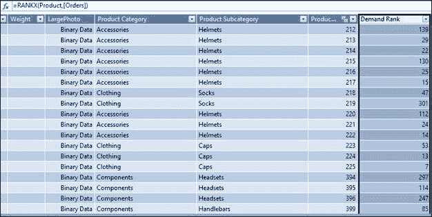

图 68 ：使用 RANKX 函数

### 文字函数

文本函数类似于字符串操作函数。这些是 DAX 查询参考中可用的文本函数：

| 函数 | 使用 |
| REPLACE | 用不同的文本替换部分文本字符串。 |
| REPT | 重复文本参数中指定的次数。 |
| 右 | 返回字符串末尾的指定字符数。 |
| 搜索 | 返回首次找到特定字符或文本字符串的字符数，从左向右阅读。搜索不区分大小写并且区分重音。 |
| SUBSTITUTE | 用新文本替换现有文本。 |
| TRIM | 从字符串中删除前导和尾随空格。 |
| UPPER | 将字符串转换为大写。 |
| VALUE | 将数值的文本表示形式转换为数字。 |
| BLANK | 返回 BLANK 值。 |
| CONCATENATE | 连接两个文本字符串。 |
| EXACT | 比较两个文本字符串，如果它们完全相同则返回 TRUE，包括大小写。 |
| 发现 | 返回另一个文本字符串中一个文本字符串的起始位置。 |
| 已修复 | 将数字舍入到指定的小数位数，并将结果作为文本返回。 |
| 格式 | 将值转换为文本。 |
| 左 | 从文本字符串的开头返回指定的字符数。 |
| LEN | 返回文本字符串中的字符数。 |
| LOWER | 将文本字符串转换为小写。 |
| MID | 根据起始位置和长度返回一个字符串。 |

大多数文本函数都是不言自明的，非常简单，因此我们不会详细讨论它们。事实上，我们已经在之前的一些例子中使用了 FORMAT 和 CONCATENATE 函数。

### 时间智能函数

如前所述，日期和时间符合数据仓库中的维度，因为大多数分析是在时间轴上执行的，例如比较 YoY，QoQ 和 MoM 等度量，以及计算 YTD，QTD 和 MTD。时间智能函数可用于促进此类计算。

| 函数 | 使用 |
| CLOSINGBALANCEMONTHCLOSINGBALANCEQUARTERCLOSINGBALANCEYEAR | 计算给定期间日历末尾的值。 |
| OPENINGBALANCEMONTHOPENINGBALANCEQUARTEROPENINGBALANCEYEAR | 计算给定期间之前的日历结束时的值。 |
| TOTALMTDTOTALYTDTOTALQTD | 计算在期间的第一天开始并在指定日期列的最后日期结束的时间间隔内的值。 |
| DATEADD | 返回一个表，其中包含一列日期，向前或向后移动。 |
| DATESBETWEEN | 返回一个表，其中包含以 start_date 开头的日期列，并一直持续到 end_date。 |
| DATESINPERIOD | 返回一个表，其中包含以 start_date 开头的日期列，并继续执行指定的 number_of_intervals。 |
| DATESMDT
DATESQTD
DATESYTD | 返回一个表，其中包含当前上下文中给定时间段的日期列。 |
| ENDOFMONTH
ENDOFQUARTER
ENDOFYEAR | 返回当前上下文中给定时间段的最后日期。 |
| NEXTDAY
NEXTMONTH
NEXTQUARTER
NEXTYEAR | 根据当前上下文中指定的日期，返回包含下一个句点中所有日期的单列表。 |
| FIRSTDATE | 根据当前上下文返回指定日期列的第一个日期。 |
| FIRSTNONBLANK | 返回由当前上下文过滤的列中的第一个值，其中表达式不为空。 |
| LASTDATE | 返回指定日期列的当前上下文中的最后一个日期。 |
| LASTNONBLANK | 返回由当前上下文过滤的列中的最后一个值，其中表达式不为空。 |
| PARALLELPERIOD | 返回一个表，该表包含一列日期，表示与当前上下文中指定日期列中的日期平行的句点，日期在时间上向前或向后移动多个间隔。 |
| 上一页
上一页
上一页
上一页 | 根据当前上下文中指定的日期，返回包含上一期间所有日期的单列表。 |
| SAMEPERIODLASTYEAR | 返回一个表，其中包含使用当前上下文从指定日期列中的日期开始一年后移动的日期列。 |
| STARTOFMONTH
STARTOFQUARTER
STARTOFYEAR | 根据当前上下文返回指定时间段的第一个日期。 |

为了在我们的数据模型中使用时间智能函数，我们需要有一个标记为日期表的表，并将该表的一列标识为唯一标识符，该标识符应为日期数据类型。

在我们的数据模型中，我们定义了一个可以标记为日期表的 Date 表，以及 FullDateAlternateKey 列，它是表的唯一标识符，是日期数据类型。在我们的数据模型中，我们通过选择表格并单击**表**＆gt;来标记日期表。 **日期**＆gt; **标记为日期表**，如下图所示。

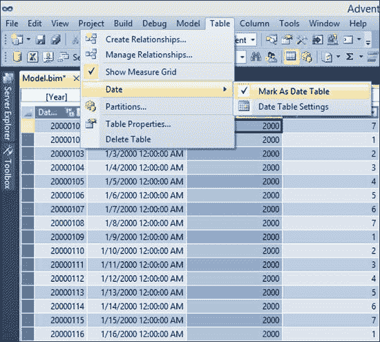

图 69 ：设置表格以使用时间智能函数

接下来，我们单击同一菜单中的**日期表设置**选项，然后在 **Date** 字段中选择 **FullDateAlternateKey** 唯一标识符列。

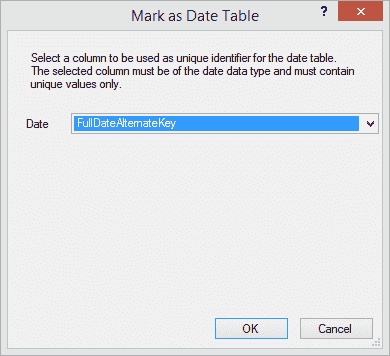

图 70 ：标记日期表

现在我们已经标记了日期表，我们使用时间智能函数来定义数据模型中的计算。

TotalYTD，TotalQTD 和 TotalMTD 函数

TotalYTD，TotalQTD 和 TotalMTD 是财务分析中常用的函数，用于求值从年初到当前日期的表达式，从季度开始到当前日期，以及从月初到当前日期。例如：

```
TOTALYTD(<expression>,<dates>[,<filter>][,<year_end_date>])
TOTALQTD(<expression>,<dates>[,<filter>])

```

在我们的数据模型中，我们定义 YTD Sales 和 QTD Sales 度量如下：

```
YTD Sales:=TOTALYTD(SUM(‘Reseller Sales’[SalesAmount]),'Date'[FullDateAlternateKey],ALL('Date'),"6/30")
QTD Sales:=TOTALQTD(SUM(‘Reseller Sales’[SalesAmount]), 'Date'[FullDateAlternateKey],ALL('Date'))

```

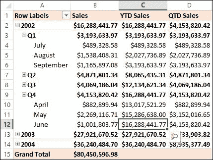

图 71 ：使用 TotalYTD 和 TotalQTD 函数

PREVIOUSYEAR，PREVIOUSQUARTER 函数

PREVIOUSDAY，PREVIOUSMONTH，PREVIOUSQUARTER 和 PREVIOUSYEAR 函数是财务分析中常用的函数，用于将当前度量值与前一天，一个月，一个季度或一年进行比较。例如：

```
PREVIOUSYEAR(<dates>[,<year_end_date>])
PREVIOUSQUARTER(<dates>)

```

在我们的数据模型中，我们可以定义度量 PreviousYearSales 和 PreviousQuarterSales，它们使用以下 DAX 公式计算前几年和前几个季度的销售额：

```
PreviouYearsSales:=CALCULATE([Sales],PreviousYear('Date'[FullDateAlternateKey]))
PreviousQuarterSales:=CALCULATE([Sales],PREVIOUSQUARTER('Date'[FullDateAlternateKey]))

```

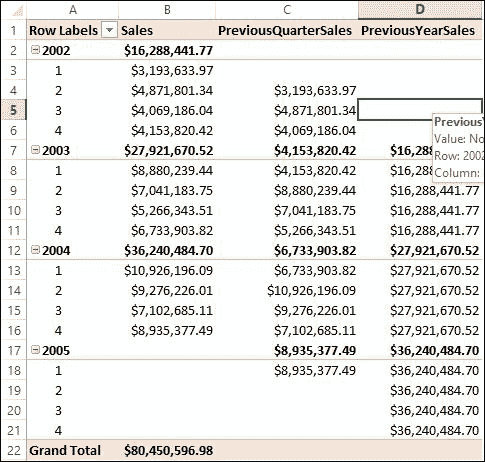

图 72 ：使用 PREVIOUSYEAR 和 PREVIOUSQUARTER 函数

SAMEPERIODLASTYEAR 函数

SAMEPERIODLASTYEAR 函数返回一个表，该表包含在当前上下文中从指定日期列中的日期开始一年后移位的日期列。

使用 PARALLELPERIOD 函数也可以实现 SAMEPERIODLASTYEAR 函数，如下所示：

```
PARALLELPERIOD(dates,-1,year)

```

例如：

```
SAMEPERIODLASTYEAR(<dates>)

```

在我们的数据模型中，我们之前定义了计算的度量 PreviousSales，它使用 PARALLELPERIOD 函数计算去年同期的销售额，如下所示：

```
PreviousSales:=CALCULATE([Sales],PARALLELPERIOD('Date'[FullDateAlternateKey],-1,YEAR))

```

我们还可以使用 SAMEPERIODLASTYEAR 函数重写此度量以获得相同的结果：

```
PreviousSales:=CALCULATE([Sales],SAMEPERIODLASTYEAR('Date'[FullDateAlternateKey]))

```

现在我们更熟悉 DAX 函数，在下一节中我们将看到如何使用这些函数进行报告。

## DAX 作为查询语言

在某些客户端报告工具（如 SSRS）中，我们使用 DAX 作为查询语言来定义数据集以从表格数据模型多维数据集中获取数据。当我们使用 DAX 作为查询语言时，我们使用前面讨论的一些相同的函数，它们返回一个表格数据集。

当 DAX 用作查询语言时，我们使用以下语法：

```
DEFINE
    { MEASURE <table>[<col>] = <expression> }]
EVALUATE <Table Expression>
[ORDER BY {<expression> [{ASC | DESC}]} [, …]
    [START AT {<value>|<parameter>} [, …]] ]

```

DAX 作为查询语言始终以 EVALUATE 关键字开头，后跟表达式，该表达式返回一个表。 DEFINE 关键字用于定义查询范围内的计算度量。

为了使用 DAX 作为查询语言，我们使用 SQL Server Management Studio 连接表格 Analysis Services 多维数据集，然后单击 **New MDX Query** 窗口。

相同的 MDX 查询窗口也用于对表格模型立方体执行 DAX 查询，如图 73 所示。

例如，最简单的 DAX 查询将是：

```
EVALUATE 'SalesTerritory'

```

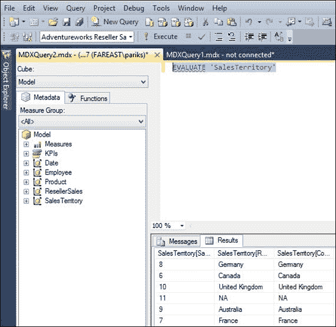

图 73 ：使用 DAX 作为查询语言

此查询返回 SalesTerritory 作为输出。如果输出需要按国家/地区排序，我们可以将查询重写为：

```
EVALUATE 'SalesTerritory'
ORDER BY 'SalesTerritory'[Country]

```

将过滤器应用于 DAX 查询

如果我们需要求值美国 2004 财年的销售额，我们使用 FILTER 函数来过滤 Country United States 和 FiscalYear 2004 的 ResellerSales 表。生成的 DAX 查询是：

```
EVALUATE
FILTER(
       FILTER('ResellerSales', RELATED('SalesTerritory'[Country])="United States"),
       RELATED('Date'[FiscalYear])=2004
       )

```

在 DAX 查询中添加列以查询输出

考虑一个报告，我们需要 AdventureWorks 目录中的所有产品以及迄今为止订购的最大数量。我们可以使用 ADDCOLUMNS 函数添加计算列，该列计算最大订单数量并将其添加到产品表中。生成的 DAX 查询是：

```
EVALUATE
ADDCOLUMNS('Product',
                    "Max Quantities Ordered",CALCULATE(MAX('ResellerSales'[OrderQuantity]),ALL(Product[Product]))
                    )
ORDER BY [Max Quantities Ordered] desc

```

在 DAX 查询中聚合和分组

考虑一个报告，其中我们需要每个产品类别的聚合销售值。这可以通过使用 SUMMARIZE 函数在 DAX 查询中轻松实现，如下所示：

```
EVALUATE
SUMMARIZE(
'Product',
'Product'[Product Category],
"Sales",FORMAT(SUM(ResellerSales[SalesAmount]),"CURRENCY")
)
ORDER BY [Sales] desc

```

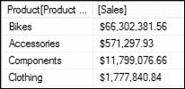

图 74 ：使用 DAX 查询聚合值

如果我们想要计算总销售额，我们可以在 DAX 查询中使用 SUMMARIZE 函数和 ROLLUP：

```
EVALUATE
SUMMARIZE (
'Product',
ROLLUP('Product'[Product Category]),
"Sales",FORMAT(SUM(ResellerSales[SalesAmount]),"CURRENCY")
)
ORDER BY [Sales] asc

```

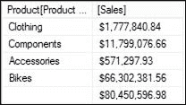

图 75 ：使用 DAX 查询聚合值

在 DAX 查询中使用 CROSSJOIN

考虑一个报告，我们需要为每个会计年度计算每个国家/地区的销售额。我们可以使用 CROSSJOIN 函数来实现这一点，如下面的 DAX 查询所示：

```
EVALUATE
FILTER(
ADDCOLUMNS(
              CROSSJOIN(
                         ALL('Date'[FiscalYear]),
                         ALL('SalesTerritory'[Country])
                         ),
                    "Sales",FORMAT(ResellerSales[Sales],"CURRENCY")
                    ),
                    ResellerSales[Sales]>0
                    )

```

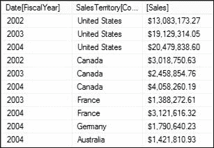

图 76 ：在 DAX 查询中使用 CROSSJOIN

在 DAX 查询中使用 TOPN

考虑一份报告，我们需要确定需求最多的前三种产品。为此，我们将使用先前定义的 TOPN 函数和需求排名计算列，该列根据迄今为止销售的总订单数量计算每种产品的排名。

```
EVALUATE
TOPN(3,Product,Product[Demand Rank],1)
ORDER BY Product[Demand Rank]

```

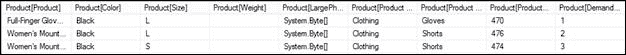

图 77 ：在 DAX 查询中使用 TOPN 函数

在 DAX 查询中定义度量

在前面的示例中，我们设计了 DAX 查询来计算迄今为止每个产品的最大销售量，我们可以通过定义度量来重写查询，如下面的示例所示。

```
DEFINE MEASURE 'Product'[Max Quantities Ordered]=CALCULATE(MAX('ResellerSales'[OrderQuantity]),ALL(Product[Product]))

EVALUATE
ADDCOLUMNS('Product',
                    "Max Quantities Ordered",'Product'[Max Quantities Ordered]
                    )
ORDER BY [Max Quantities Ordered] desc

```

定义查询范围的度量可以在很大程度上简化查询。例如，在之前的查询中，我们首先定义计算度量来计算所有产品的最大订购量。在 ADDCOLUMNS 函数中使用此度量时，将在行上下文中为产品表的每一行求值度量，该行给出每个产品的最大订单数量。

在 DAX 查询中使用 GENERATE 函数

在前面的示例中，我们根据使用 TOPN 销售的总订单数量计算了前三种需求产品。现在，让我们说我们需要计算每个国家需求的前三种产品，以确定每个国家最受欢迎的产品。

为此，我们需要为每个国家迭代相同的 TOPN 计算。这可以使用 DAX 中的 GENERATE 函数，如下所示。

```
DEFINE MEASURE 'Product'[Max Quantities Ordered]=IF(ISBLANK(MAX('ResellerSales'[OrderQuantity])),0,MAX('ResellerSales'[OrderQuantity]))
EVALUATE
GENERATE
(
VALUES('SalesTerritory'[Country]),
ADDCOLUMNS(
TOPN(3,VALUES('Product'[Product]),'Product'[Max Quantities Ordered]),
             "Max Quantities Ordered",'Product'[Max Quantities Ordered]
    )
)

```

在此 DAX 查询中，我们重复 TOPN 计算，该计算根据使用 GENERATE 函数为每个国家/地区销售的最大订单数量计算前三个产品。查询的结果输出如下图所示：

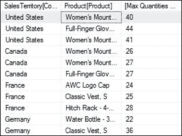

图 78 ：在 DAX 查询中使用 GENERATE 函数

这些例子应该让我们有足够的机会开始使用 DAX。与任何其他查询语言一样，我们可以通过更多练习获得 DAX 的专业知识。

## 小结

在本章中，我们学习了如何使用 DAX 语言定义计算列和度量。在下一章中，我们将讨论如何准备我们的数据模型以进行部署和部署数据模型以进行报告和分析。