# 第 4 章为报告和部署准备数据模型

完成数据模型的设计并使用 DAX 添加所需的计算列和度量后，我们接下来计划并准备用于报告和部署的数据模型。在本章中，我们将学习一些技巧，通过隐藏不需要的列，创建透视图和改善最终用户体验来为报告准备数据模型。在本章的后半部分，我们将学习如何定义角色，分区以及将数据模型部署到 SSAS 实例。

## 从数据模型中隐藏不需要的列和表

在我们的数据模型中，我们导入了一些关键列，因为它们用于定义与模型中其他表的关系。除了键列之外，我们还导入了一些可能不会被最终用户直接使用的列，但用于定义计算列。这些称为中间列的关键列无需向最终用户公开。如果列不用于报告，则应从报告视图中隐藏它们以增强用户体验。

|  | 注意：如果数据模型中根本没有使用该列，则不应导入该列，因为数据模型中的任何冗余列都会增加处理时间和存储空间并影响系统的整体性能。 |

在我们的数据模型中，我们有关键列和一些未使用的列，用于定义关系或中间计算;我们将隐藏这些列。

为了从数据模型中隐藏列，我们选择表并右键单击该列，如下图所示。

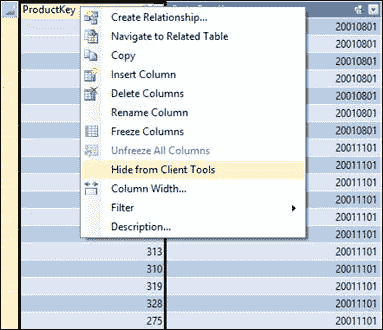

图 79 ：选择要隐藏的列

单击**从客户端工具**隐藏，该列将显示为不可用，如下图所示。

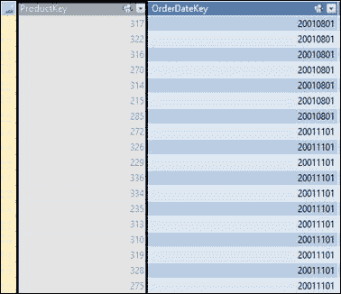

图 80 ：隐藏列

同样，如果报表不需要表格，我们可以将其从客户端工具中隐藏。要从客户端工具隐藏表，请右键单击表的选项卡，然后从客户端工具中选择 **Hide。**

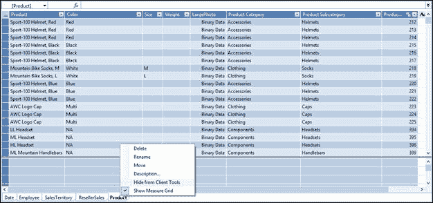

图 81 ：隐藏一张桌子

从客户端工具隐藏表或列后，当用户使用 Excel，Power View 或 PPS Dashboards 与数据模型交互时，它不可见。

## 设置默认字段集和表行为属性

表格数据模型支持几个表属性，默认字段集和表行为，这些属性专门用于增强 Power View 报告客户端的用户交互性和体验。

默认字段集

默认字段集属性用于定义表的字段或列集，以便最终用户在 Power View 报表中单击表时，将自动报告已定义的列集。

为了设置给定表的默认字段集，我们需要选择网格视图底部的表格选项卡，然后按 F4 打开属性窗口。在 SalesTerritory 表的**属性**窗口中，我们看到表属性**默认字段集**，如下图所示。

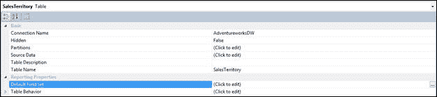

图 82 ：SalesTerritory 表属性

当我们单击默认字段集单元格旁边的**单击编辑**单元格时，我们可以选择默认字段集，如下图所示。

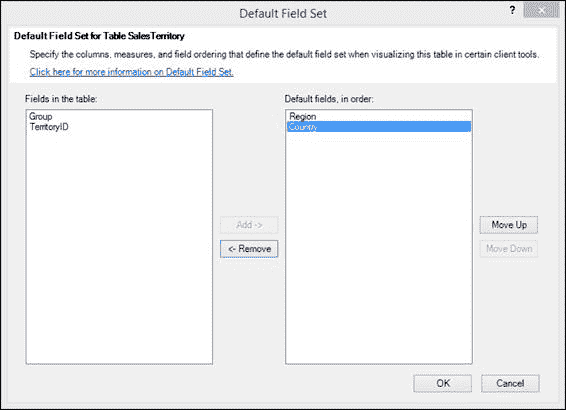

图 83 ：设置 SalesTerritory 表的默认字段

然后，我们选择 **Region** 和 **Country** 作为 SalesTerritory 的默认字段。现在，当用户在 Power View 中单击 SalesTerritory 表时，报表会自动填充 Region 和 Country 字段。

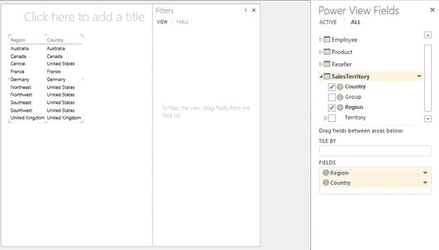

图 84 ：带有默认字段的 Power View

表行为

表行为属性是另一组属性，专门用于增强 Power View 用户的交互性。

对于主要感兴趣的行（例如员工或客户记录），建议设置表行为属性。相反，不受益于这些属性的表包括充当查找表的表（例如，日期表，产品类别表或部门表，其中表由相对较少的行和列组成） ，或包含仅在汇总时相关的行的汇总表（例如，按性别，年龄或地理位置汇总的人口普查数据）。对于查找和汇总表，默认分组行为会产生最佳结果。

表行为属性包括以下内容：

*   **行标识符**：指定仅包含唯一值的列，允许该列用作内部分组键。
*   **保留唯一行**：指定哪些列提供应被视为唯一的值，即使它们是重复的（例如，在两个或多个员工共享相同名称的情况下，员工的名字和姓氏）。
*   **默认标签**：指定哪个列提供表示行数据的显示名称（例如，员工记录中的员工姓名）。
*   **默认图像**：指定哪个列提供表示行数据的图像（例如，员工记录中的照片 ID）。

在我们的数据模型中，我们有一个 Products 表，通常会将其报告为单个记录，因此是使用表行为属性的良好候选者。

在网格视图（也称为数据视图）中，我们单击底部的**产品**表选项卡，然后按 F4。我们在默认字段集属性下面看到表行为属性。在**产品表**的表行为属性中，我们设置了以下值：

**行标识符：** ProductKey
**保持唯一行：**产品
**默认标签：**产品
**默认图像：** LargePhoto

## 设置列的数据类别属性

在表格数据模型中，我们可以将一些列数据分类为一组预定义的类别。这些属性对于 Power View 等客户端工具非常有用，它可以使用这些属性以最佳可视化方式报告数据。

在我们的数据模型中，我们有一个带有 Country 列的 SalesTerritory 表;我们可以将 Country 列的 Data 类别设置为 **Country** 。要更改 Country 列的 Data Category 属性，请选择该列并按 F4 打开 Properties 窗口，如下图所示：

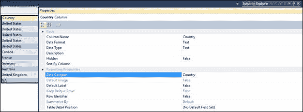

图 85 ：国家/地区列属性

为 Country 列设置 Data Category 后，当我们在 Power View 中浏览数据模型时，我们会看到 Country 列旁边的地图图标。

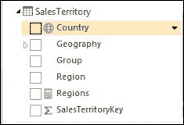

图 86 ：国家/地区列旁边的地图图标

Power View 使用这些数据类别值来映射数据，并使用可用于该类型数据的最佳可视化。

同样，如果列中的数据与可用的预定义数据类别集匹配，我们可以对其他列进行分类。

## 设置度量的 Format 属性

在上一章中，我们定义了各种计算度量（销售额，成本，利润，保证金等）。当这些计算的度量在 Excel 或 Power View 报告中按原样使用时，它们对最终用户没有多大意义，因为这些度量将以纯数格式报告。对于我们来说，为度量设置 Format 属性非常重要，这些度量指定度量的格式应该是货币还是百分比。

在我们的数据模型中，我们使用以下 DAX 公式定义了 Sales 度量。

```
Sales:=SUM(ResellerSales[SalesAmount])

```

如果在 Power View 或 Excel 报告中使用此 DAX 度量，我们将看到以下报告。

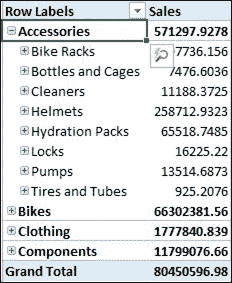

图 87 ：没有数据格式的销售措施

要设置 Sales 度量的 Format 属性，请在度量网格中选择 **Sales Measure** 单元格，然后按 F4 打开“属性”窗口。在 Properties 窗口中，我们将 **Format** 属性设置为 **Currency** ，如下图所示。

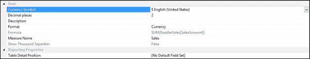

图 88 ：设置 Format 属性

我们可以进一步指定小数位数，默认设置为 **2** ，以及**货币符号**用于本地化。

同样，我们可以在部署数据模型之前定义其他度量的属性以适当地格式化值。

## 设置列的 Summarize 属性

在表格数据模型中，我们可以为列设置默认聚合，这样无论何时在 Power View 报告中检查列，它都会自动聚合数据。

但是，如果列是数字数据类型，则列的默认聚合设置为 **Sum** ，有时可能不需要。例如，当我们在 Power View 中浏览数据模型并展开 Date 表时，我们会看到以下内容：

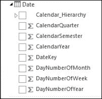

图 89 ：带有求和列的日期表

为了确保这些列旁边没有总和符号，请按 F4 打开该列的“属性”窗口，然后选择**不要**汇总**汇总**属性，如图所示在下图中。

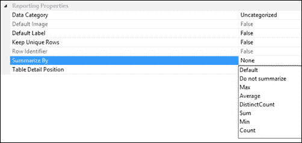

图 90 ：更改 Summarize By 属性

我们需要选择**不要为所有我们不想聚合的整数数据类型的列汇总**。对于我们希望聚合的列，我们可以从“属性”窗口中为每列选择默认聚合。

## 添加列，表和度量的描述

在表格数据模型中，我们可以向列，表和计算度量添加描述。这些描述对于最终用户或分析师来说可能是一个有用的提示，告知他们列，表或度量的含义以及它将显示的数据。该描述在 Power View 报告中显示为工具提示。

在我们的数据模型中，我们可以通过右键单击表格，列或字段并单击**描述**来添加描述，如下图所示。

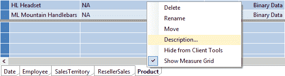

图 91 ：向表格添加说明

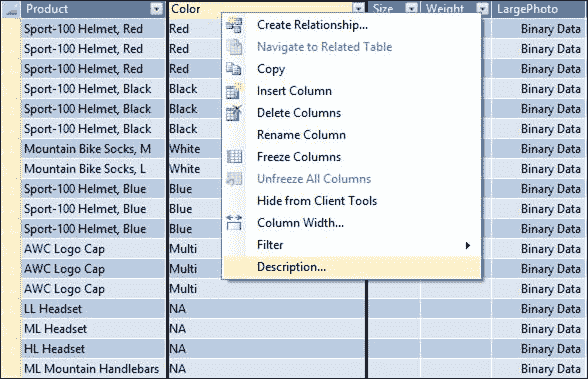

图 92 ：向列添加描述

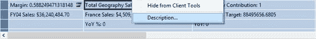

图 93 ：向字段添加描述

我们编写的描述将在 Power View 报告中显示为最终用户的工具提示：

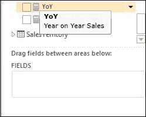

图 94 ：字段说明

通过提供有关列，表或计算字段的其他信息，描述非常有用，这些信息可以增强用户的报告体验。

## 定义透视图

表格数据模型可以在单个数据库中一起包含多个数据集市，以避免共享维度表的冗余。因此，单个数据模型可以定义大量的表，列和度量。如果所有这些列和度量都通过报告客户端（如 Excel 或 Power View）向最终用户公开，那么对于最终用户来说这将是压倒性的。为了改善用户体验，以便用户只能看到与它们相关的表，列和度量以进行分析，我们可以定义透视图。

透视图类似于 RDBMS 中的视图，它充当数据模型的窗口，显示与分析相关的字段。我们可以根据最终用户的分析需求在数据模型中定义多个透视图。

在我们的数据模型中，为了定义透视图，我们单击工具栏上的 **Perspectives** 按钮，如下图所示：


图 95 ：Perspectives 选项

将出现“透视”向导。当我们单击 **New Perspective** 时，我们可以为定义的新透视图提供名称，并使用复选框包含所需的列，层次结构，度量和表。在我们的数据模型中，我们定义了透视图“经销商销售”，如下图所示。

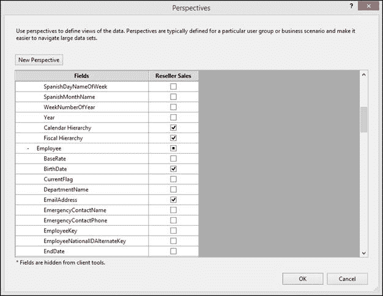

图 96 ：定义新的视角

要创建“Reseller Sales”透视图，我们从每个表中选择以下列和字段。

| 表 | 经销商销售视角中包含的字段 |
| 日期 | 日历层次结构，财政层次结构 |
| 员工 | 姓名，出生日期，电子邮件地址，性别，婚姻状况 |
| 产品 | 产品，颜色，尺寸，大图 |
| 经销商销售 | 销售额，订单数量，％地理位置贡献，利润，修订销售目标，同比，同比％ |
| SalesTerritory | 地理 |

对于 Date，Product 和 SalesTerritory 表，我们在透视图中包含了先前定义的层次结构，而不是选择单个列以避免冗余。

为了连接到透视图，最终用户需要在定义数据模型的连接字符串时指定透视图名称。

在 Excel 中部署模型后，我们将在“数据连接向导”中定义数据连接。该向导为我们提供了选择透视图的选项，如下图所示。

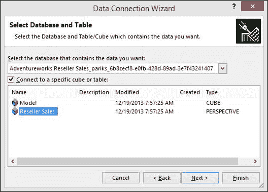

图 97 ：连接到透视图

当最终用户连接到“经销商销售”透视图时，将显示我们在定义透视图时包含的字段，如下图所示。

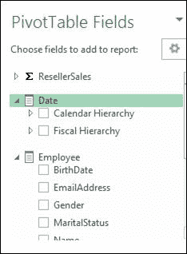

图 98 ：经销商销售视角字段

对于大型数据模型或多维数据集，始终建议定义多个透视图，以便仅为最终用户提供分析所需的字段。

## 定义角色和安全性

SSAS 表格模型使用基于角色的安全性，其中有效的经过身份验证的用户将看到数据，具体取决于用户所属的角色。与多维模型一样，SSAS 表格模型支持 Windows 身份验证（唯一支持的身份验证）。与用于分别限制用户在单元级别和维度成员的多维模型（具有单元安全性和维度安全性）不同，表格模型具有行级安全性，我们可以将用户限制为表格的行，他们可以视图。行过滤器也适用于相关表格;例如，如果在 Product 表中限制行，则还将限制与 Product 表中的受限行对应的 Reseller Sales 表中的行。

Microsoft SQL Server Analysis Services 中使用角色来管理 Analysis Services 和数据的安全性。 Analysis Services 中有两种类型的角色：

*   服务器角色：一个固定角色，提供对 Analysis Services 实例的管理员访问权限。
*   数据库角色：模型作者和管理员定义的角色，用于控制对模型数据库的访问，以及非管理员用户的数据访问。

为表格模型定义的角色是数据库角色。也就是说，角色包含由 Windows 用户或具有特定权限的组组成的成员，这些权限定义了这些成员可以在模型数据库中执行的操作。数据库角色作为数据库中的单独对象创建，仅适用于创建该角色的数据库。 Windows 用户，Windows 组或两者都包含在模型作者的角色中，默认情况下，模型作者在工作区数据库服务器上具有管理员权限。在部署的模型中，角色由管理员管理。

表格模型中的角色可以使用行过滤器进一步定义。行过滤器使用 DAX 表达式来定义表中的行以及用户可以查询的任何相关行。使用 DAX 表达式的行过滤器只能为“读取”和“读取”和“处理”权限定义。

默认情况下，在创建新的表格模型项目时，项目没有任何角色。您可以使用 SQL Server 数据工具中的角色管理器定义角色。在模型创作期间定义角色时，它们将应用于模型工作空间数据库。部署模型后，相同的角色将应用于已部署的模型。部署模型后，服务器角色（Analysis Services 管理员）和数据库管理员的成员可以使用 SQL Server Management Studio 管理与模型关联的角色以及与每个角色关联的成员。

在我们的数据模型中，我们需要定义安全性，以便每个国家/地区的用户都应该看到特定于其区域的销售数据，而顶级管理层应该可以无限制地访问所有数据。换句话说，我们需要为每个国家/地区定义角色，以将数据限制到该国家/地区，并进一步根据用户所属的国家/地区将用户分配到角色。

要在我们的数据模型中定义角色，请单击工具栏中的**角色**按钮，如下图所示。


图 99 ：角色选项

这将启动角色管理器。单击**新建**以创建新角色。默认情况下，创建的新角色的名称为“Role”。单击角色将其​​重命名为 **United States** ，这适用于允许查看美国销售交易的所有用户。

当我们点击**权限**下拉列表时，我们会看到以下选项。

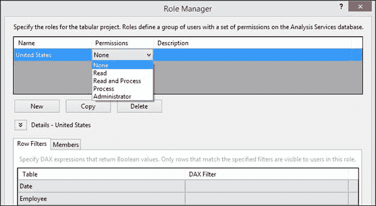

图 100 ：角色管理器中的权限选项

权限选项与多维模型中的权限选项类似。

| 权限 | 描述 | 使用 DAX 的行过滤器 |
| 无 | 成员无法对模型数据库模式进行任何修改，也无法查询数据。 | 行过滤器不适用。此角色的用户无法看到任何数据。 |
| 阅读 | 允许成员基于行过滤器查询数据，但无法在 SSMS 中查看模型数据库，无法对模型数据库模式进行任何更改，也无法处理模型。 | 可以应用行过滤器。只有行筛选器 DAX 公式中指定的数据对用户可见。 |
| 读取和处理 | 允许成员基于行级筛选器查询数据，并通过运行包含进程命令的脚本或包来运行进程操作，但不能对数据库进行任何更改。无法在 SQL Server Management Studio 中查看模型数据库。 | 可以应用行过滤器。只能查询行过滤器 DAX 公式中指定的数据。 |
| 流程 | 成员可以通过运行包含进程命令的脚本或包来运行进程操作。无法修改模型数据库架构。无法查询数据。无法在 SQL Server Management Studio 中查询模型数据库。 | 行过滤器不适用。此角色无法查询任何数据。 |
| 管理员 | 成员可以对模型模式进行修改，并可以查询模型设计器，报告客户端和 SQL Server Management Studio 中的所有数据。 | 行过滤器不适用。可以在此角色中查询所有数据。 |

在我们的数据模型中，我们定义角色的权限和描述，并添加 DAX 过滤器，如下图所示。

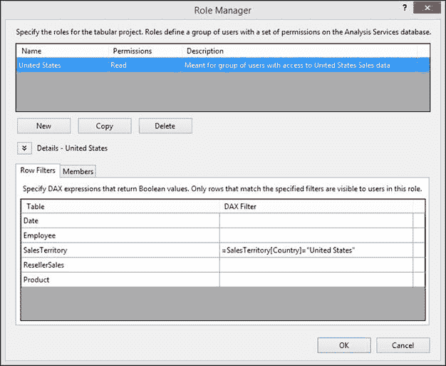

图 101 ：定义角色

用于定义角色的 DAX 过滤器只是在行上下文中计算的 DAX 表达式（类似于计算列），并返回布尔值 True 或 False。在上一个角色定义中，将为 SalesTerritory 表的每一行求值 DAX 过滤器;对于国家/地区为美国的行，它返回 True，而对于所有其他行，它返回 False。

要将 Windows 组或单个用户分配给此角色，请单击“行筛选器”选项卡旁边的**成员**选项卡，然后单击**添加**以添加 Windows 用户或组。

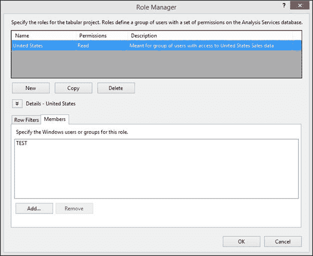

图 102 ：向角色添加成员

同样，我们需要为每个国家定义角色。为了加快开发速度，我们可以单击 Role Manager 向导中的 **Copy** 按钮，该按钮将创建我们之前定义的美国角色的副本。在副本中，我们可以将 DAX 过滤器修改为其他国家/地区名称，并添加属于该角色的成员。

|  | 注意：如果成员是多个角色的一部分，他或她将继承这两个角色的权限。如果成员是多个角色的一部分，并且一个角色拒绝权限而另一个角色允许该权限，则将允许用户获得该权限。 |

要测试该角色，请单击工具栏中 Excel 中的 **Analyze** **，使用 Excel 连接到数据模型，如下图所示。**


图 103 ：在 Excel 中分析

我们可以选择以当前 Windows 用户，其他 Windows 用户或角色定义用户身份连接到模型。选择 **Role** 选项，然后从下拉列表中选择 **United States** ，如下图所示。

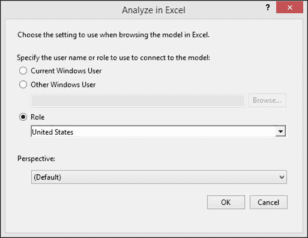

图 104 ：选择在 Excel 中分析时要使用的角色

如果我们使用数据透视表浏览数据模型，我们将看到表中的数据仅限于美国，如下图所示。

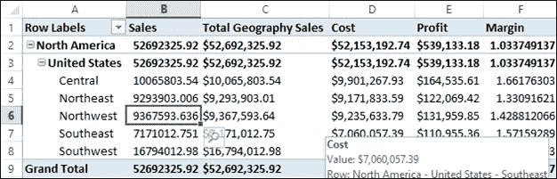

图 105 ：数据模型仅限于美国数据

## 动态安全性

动态安全性提供了一种基于当前登录用户的用户名或从连接字符串返回的 CustomData 属性来定义行级安全性的方法。为了实现动态安全性，您必须在模型中包含一个包含用户登录值（Windows 用户名）的表以及一个可用于定义特定权限的字段;例如，具有登录 ID（域和用户名）的 DimEmployees 表以及每个员工的 Country 值。

要实现动态安全性，可以使用以下函数作为 DAX 公式的一部分来返回当前登录用户的用户名，或者返回连接字符串中的 CustomData 属性：

| 功能 | 描述 |
| [USERNAME 函数（DAX）](http://technet.microsoft.com/en-us/library/hh230954.aspx) | 返回当前登录用户的域和用户名。 |
| [CUSTOMDATA 功能（DAX）](http://technet.microsoft.com/en-us/library/hh213140.aspx) | 返回连接字符串中的 CustomData 属性。 |

我们可以使用 LOOKUPVALUE 函数返回一个列的值，其中 Windows 用户名与 USERNAME 函数返回的用户名或 CustomData 函数返回的字符串相同。然后可以限制查询，其中 LOOKUPVALUE 返回的值与相同或相关表中的值匹配。例如：

```
='Sales Territory'[Country]=LOOKUPVALUE('Employee Security'[Country], 'Employee Security'[Login Id], USERNAME(), 'Employee Security'[Country], 'Sales Territory'[Country])

```

|  | 注意：此公式是为 AdventureWorksDW2012 数据库的自定义版本编写的，不适用于示例 AdventureWorksDW2012 数据库。 |

有关设置动态安全性的更多信息，请参阅 SQL 2012 版本期间 SSAS 团队项目经理 Cathy Dumas 的以下白皮书： [http://msdn.microsoft.com/en-us/library /jj127437.aspx](http://msdn.microsoft.com/en-us/library/jj127437.aspx) 。

## 定义分区

表格模型中的分区将表格划分为逻辑分区对象。然后可以独立于其他分区处理每个分区。例如，表可能包含某些行集，这些行集包含很少更改的数据，但其他行集的数据经常更改。在这些情况下，当您真正只想处理部分数据时，无需处理所有数据。通过分区，您可以将需要经常处理的部分数据与可以较不频繁处理的数据进行划分。

有效的模型设计利用分区来消除 Analysis Services 服务器上不必要的处理和后续处理器负载，同时确保经常处理和刷新数据以反映来自数据源的最新数据。在我们的数据模型中使用分区表的目的之一是加快模型中的数据刷新。

在我们的数据模型中，我们有 Reseller Sales 表，目前包含大约 65,000 条记录。这些可以很快地处理，但在数据模型的开发过程中，还必须考虑到未来几年数据仓库的增长。在大多数数据模型中，事实或事务表是分区的理想选择，因为数据每天都在增长。但是，分区不限于事实表，也可以应用于维度表。

在大多数数据模型中，我们可能还希望按日期或时间进行分区，因为在大多数情况下，在事务进入数据仓库之后，很少有机会更新或删除事务。因此，我们设计了上一年的年度分区，而对于当前年度，我们可以设计每月分区以最小化处理要求。

要定义分区，请选择相关表，然后单击工具栏中的 **Partitions** 按钮，如下图所示。

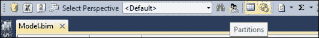

图 106 ：分区按钮

这将启动分区管理器窗口。

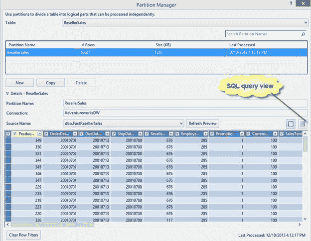

图 107 ：分区管理器

分区管理器公开经销商销售表的当前分区，该分区是包含所有记录的单个分区。

我们选择使用财务日历中的 OrderDateKey 对 Reseller Sales 表进行分区。 FactResellerSales 表中可用的最小 OrderDateKey 值为 20010701，而可用的最大 OrderDateKey 值为 20040601.我们使用财务日历中的 OrderDateKey 将表分成五个分区，如下表所示。

| 分区名称 | 分区逻辑 |
| FY01 销售 | OrderDateKey＆lt; 20010701 |
| FY02 销售 | OrderDateKey 介于 20010701 和 20020630 之间 |
| FY03 销售 | OrderDateKey 介于 20020701 和 20030630 之间 |
| FY04 销售 | OrderDatekey 介于 20030701 和 20040630 之间 |
| 05 财年销售额 | OrderDatekey＆gt; 20040630 |

为了定义第一个分区，将**分区名称**更改为 **FY01 Sales** 并切换到 SQL 查询视图，我们将分区的查询定义为：

```
SELECT [dbo].[FactResellerSales].* FROM [dbo].[FactResellerSales]
    Where OrderDateKey < 20010701

```

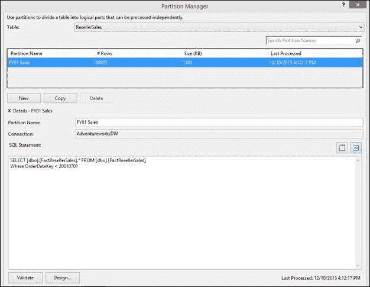

图 108 ：添加 FY01 销售分区

接下来，单击**复制**以创建另一个分区，我们将其命名为 **FY02 Sales** 并将查询修改为：

```
SELECT [dbo].[FactResellerSales].* FROM [dbo].[FactResellerSales]
    Where OrderDateKey between 20010701 and 20020630

```

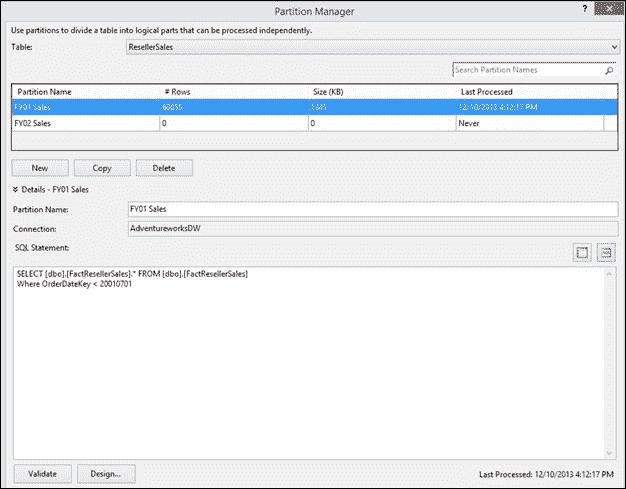

图 109 ：添加 FY02 销售分区

同样，我们定义分区 FY03 Sales，FY04 Sales 和 FY05 Sales。在定义分区时，我们需要确保分区之间没有重叠，并且我们没有错过事实表中的任何行;否则我们会得到不正确的计算结果。

一旦我们定义了所有分区，我们可以通过单击 **Process Table** 立即处理所有分区，或者通过单击 **Process Partitions** 一次处理一个分区。

|  | 注意：Process All 选项处理整个数据模型，因此如果已经处理了其他表，我们可能不想使用此选项。 |

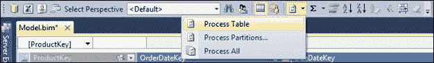

图 110 ：处理选项

在开发数据模型时，始终建议定义所有分区，但不要处理所有分区。当我们在 SSDT 中开发数据模型时处理分区时，数据存储在工作空间数据库中，该数据库就像一个临时存储位置。处理分区也会增加内存使用量，因为数据缓存在内存中。

作为开发过程中的最佳实践，我们应该定义所有分区，但是处理其中一个最小的分区，并根据该分区数据定义计算。稍后，当分区部署到 SSAS 表格实例时，我们可以使用 Management Studio 或脚本处理数据模型，该脚本将填充数据仓库中的所有数据。

如果我们需要在部署后添加或删除分区，我们可以使用 SQL Server Management Studio 管理分区，然后再处理分区。此功能可确保分区管理不需要重新部署，甚至团队中的管理员也可以管理数据模型中的分区。

## 部署数据模型

完成表格数据模型的设计和开发后，就可以将模型部署到 SSAS 表格实例。

您可以使用多种方法来部署表格模型项目。可用于其他 Analysis Services 项目的大多数部署方法（如​​多维方法）也可用于部署表格模型项目。

| 方法 | 描述 |
| SQL Server 数据工具中的部署命令 | deploy 命令提供了一种从 SQL Server 数据工具环境部署表格模型项目的简单直观方法。 |
| 分析管理对象（AMO）自动化 | AMO 为 Analysis Services 的完整命令集提供编程接口，包括可用于解决方案部署的命令。作为解决方案部署的一种方法，AMO 自动化是最灵活的，但它也需要一些编程工作。使用 AMO 的一个关键优势是，您可以将 SQL Server 代理与 AMO 应用程序一起使用，以按预设的计划运行部署。 |
| XMLA | 使用 SQL Server Management Studio 生成现有 Analysis Services 数据库的元数据的 XMLA 脚本，然后在另一台服务器上运行该脚本以重新创建初始数据库。通过定义部署过程，然后将其编码并将其保存在 XMLA 脚本中，可以在 SQL Server Management Studio 中轻松构建 XMLA 脚本。在已保存的文件中安装 XMLA 脚本后，可以根据计划轻松运行脚本，或将脚本嵌入直接连接到 Analysis Services 实例的应用程序中。您还可以使用 SQL Server 代理在预设的基础上运行 XMLA 脚本，但是您没有与 AMO 一样的 XMLA 脚本灵活性。 AMO 通过托管全部管理命令提供更广泛的功能。 |
| 部署向导 | 使用“部署向导”使用 Analysis Services 项目生成的 XMLA 输出文件将项目的元数据部署到目标服务器。使用“部署向导”，您可以直接从 Analysis Services 文件进行部署，该文件由项目构建的输出目录创建。使用 Analysis Services 部署向导的主要优点是方便。就像您可以保存 XMLA 脚本以供以后在 SQL Server Management Studio 中使用一样，您可以保存部署向导脚本。可以通过 Deployment Utility 以交互方式和命令提示符运行“部署向导”。 |
| 部署实用程序 | Deployment Utility 允许您从命令提示符启动 Analysis Services 部署引擎。 |
| 同步数据库向导 | 使用“同步数据库向导”在任意两个 Analysis Services 数据库之间同步元数据和数据。
“同步向导”可用于将数据和元数据从源服务器复制到目标服务器。如果目标服务器没有要部署的数据库的副本，则会将新数据库复制到目标服务器。如果目标服务器已具有同一数据库的副本，则更新目标服务器上的数据库以使用源数据库的元数据和数据。 |
| 备份和恢复 | Backup 提供了传输 Analysis Services 数据库的最简单方法。从 Backup 对话框中，您可以设置配置选项，然后可以从对话框本身运行备份。或者，您可以创建可以根据需要保存和运行的脚本。备份和还原的使用频率与其他部署方法不同，但它是一种以最小的基础结构要求快速完成部署的方法。 |

在本章中，我们将使用第一种使用 SSDT 部署数据模型的方法。

**重要：**在部署数据模型之前，我们必须将数据模型的数据源连接更改为指向生产数据仓库。

为了部署数据模型，我们需要设置一些部署属性。在 **Solution Explorer** 中右键单击项目名称，然后选择 **Properties** ，如下图所示。

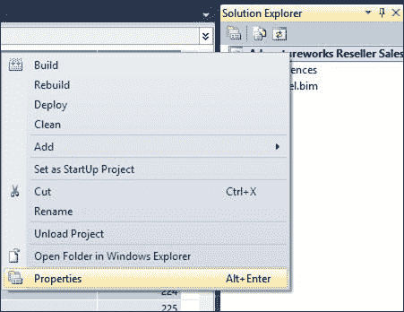

图 111 ：解决方案资源管理器中的数据模型

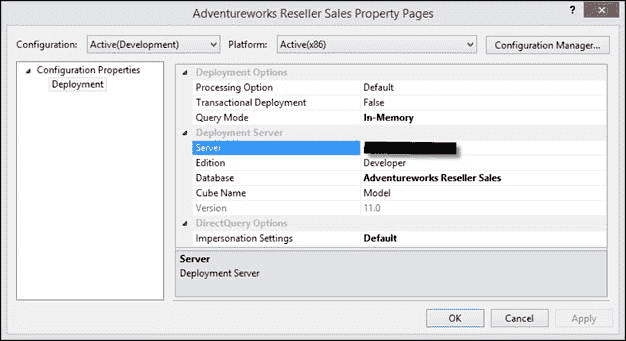

图 112 ：数据模型属性

部署数据模型时，将建立与 **服务器** 属性中指定的 Analysis Services 实例的连接。然后在该实例上创建具有在 **数据库** 属性中指定的名称的新模型数据库（如果尚不存在）。模型项目的 Model.bim 文件中的元数据用于配置部署服务器上的 model 数据库中的对象。使用 **处理**选项，您可以指定是否仅部署模型元数据，从而创建模型数据库。如果指定 **默认** 或 **完整** ，则用于连接到数据源的模拟凭据将从内存中从模型工作空间数据库传递到部署的模型数据库。然后，Analysis Services 运行处理以将数据填充到已部署的模型中。部署过程完成后，客户端应用程序可以使用数据连接或使用 SharePoint 中的.bism 连接文件连接到模型。

部署选项属性包括以下内容。

| 属性 | 默认设置 | 描述 |
| 处理选项 | 默认 | 此属性指定部署对象更改时所需的处理类型。该属性有以下选项：

*   默认值：Analysis Services 将确定所需的处理类型。将处理未处理的对象，如果需要，将重新计算属性关系，属性层次结构，用户层次结构和计算列。与使用“完全处理”选项相比，此设置通常可以缩短部署时间。
*   不处理：仅部署元数据。部署后，可能需要在部署的模型上运行流程操作以更新和重新计算数据。
*   Full：部署元数据并执行进程完整操作。这可确保部署的模型具有元数据和数据的最新更新。

 |
| 交易部署 | 错 | 此属性指定部署是否为事务性。默认情况下，所有或更改的对象的部署与处理这些已部署的对象不是事务性的。即使处理失败，部署也可以成功并持续存在。您可以更改此选项以在单个事务中合并部署和处理。 |
| 查询模式 | 内存 | 此属性指定返回查询结果的源是以内存（缓存）模式还是以 DirectQuery 模式运行。该属性有以下选项：

*   DirectQuery：指定对模型的所有查询应仅使用关系数据源。 DirectQuery 模式要求设置 Impersonate 设置以指定用于在建立与关系数据源的连接时进行身份验证的凭据
*   DirectQuery with In-Memory：默认情况下，指定应使用关系源来回答查询，除非客户端的连接字符串中另有指定。
*   In-Memory：指定应仅使用缓存来应答查询。
*   使用 DirectQuery 的内存：指定默认情况下应使用缓存来应答查询，除非客户端的连接字符串中另有指定。

 |

设置部署属性后，在解决方案资源管理器中再次右键单击项目，然后单击 **Deploy** 将数据模型部署到 Server 属性中指定的 SSAS 表格实例。部署成功完成后，我们会看到以下屏幕。

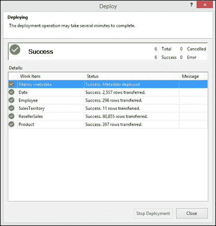

图 113 ：成功部署

我们可以通过登录目标服务器并使用 SSMS 连接到 SSAS 表格实例来进一步验证部署，如下图所示。

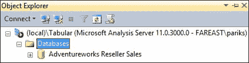

图 114 ：SSMS 中显示的成功部署

## 部署后任务

部署数据模型后，我们需要完成某些部署后任务：

*   确保数据源指向生产数据仓库而不是开发数据仓库，如果我们忘记在部署之前更新数据源，则可能会发生这种情况。
*   如果使用“请勿处理”选项部署模型，则处理数据模型。
*   创建流程计划和作业以频繁处理表或分区，以确保数据是最新的。
*   将 Windows 用户或组分配给适当的角色，以便为其提供对数据模型的正确访问权限。
*   使用 Management Studio 为表创建或添加分区，以最大限度地减少要处理的数据并缩短数据刷新时间。

## 小结

在下一章中，我们将讨论如何使用 Power View 来探索数据模型并创建视觉上吸引人的报告，这可以帮助最终用户从他们的数据模型中获取有意义的信息。