# 第 5 章用 Power View 探索数据模型

在前面的章节中，我们学习了如何使用 SSAS 表格模型设计，开发和部署数据模型。在本章中，我们将学习如何使用 SQL 2012 中引入的报告工具探索数据模型：Power View。 Power View 是一种新的基于 Silverlight 的临时报告工具，具有丰富的可视化集，可用于数据探索和分析。

当 Power View 与 SQL 2012 一起引入时，它仅在 SharePoint 2010 和 SharePoint 2013 支持的 SharePoint 集成模式下可用。随着 Excel 2013 的引入，Power View（和 PowerPivot）现在作为 COM 添加器本地集成在 Excel 中 - in，并可用于报告。带有 Power View 报表的 Excel 2013 工作表可以上载到 SharePoint 2013 文档库，也可以通过 Excel 中的 Excel Services（Excel Web 应用程序）在浏览器中呈现。

SharePoint 和 Excel 2013 中 Power View 的界面类似。在本章中，我们将使用 Excel 2013 设计 Power View 报表，但此处讨论的大多数步骤也适用于 SharePoint。

## 在 Excel 2013 中创建与数据模型的连接

设计报告的第一步始终是创建与模型的数据连接。在 Excel 2013 中，我们单击工具栏中的 **Data** 选项卡，然后从 **Other Sources** 按钮中选择 **Analysis Services** ，如下图所示。

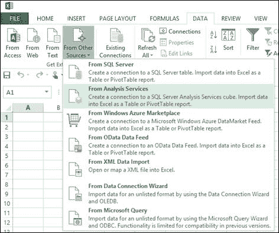

图 115 ：将 Excel 连接到 Analysis Services

在数据连接向导中，我们在**服务器名称**下提供 SSAS 实例名称并使用 Windows 身份验证。在下一个屏幕上，我们从下拉列表中选择数据库，然后从我们要连接的数据模型中选择多维数据集或透视图，如下图所示。

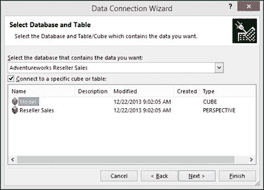

图 116 ：连接到立方体

向导的最后一个屏幕用于提供文件名，.odc 文件的位置以及有关数据模型的简要说明。如果将 Excel 文件上载到 SharePoint 文档库中并使用 Excel Web 应用程序在浏览器中查看，我们还可以选择要使用的身份验证设置。

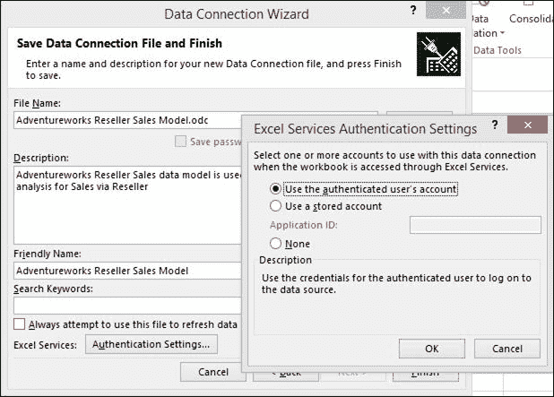

图 117 ：设置验证详细信息

单击**完成**时，我们可以选择将数据模型导入 Excel 工作簿。在 Excel 2013 之前，我们只能选择创建数据透视表或数据透视图报表。使用 Excel 2013，我们还可以看到 Power View 报告选项。选择 **Power View** ，如下图所示。

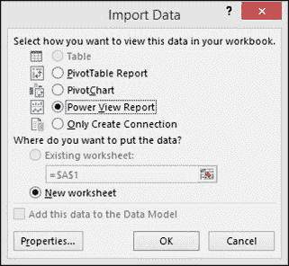

图 118 ：在 Excel 中创建 Power View 报告

我们可以单击**属性**按钮来修改数据刷新设置，这些设置指定何时刷新 Excel 工作表中的数据，以及“使用”选项卡中的其他 OLAP 设置。在 Definition 选项卡中，我们看到了之前指定的连接字符串。

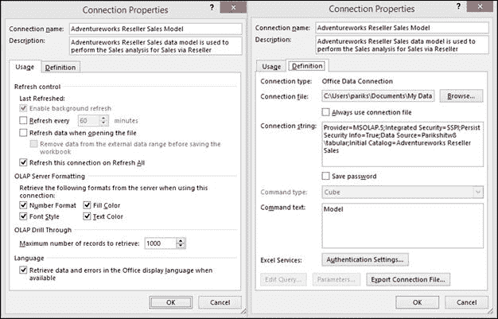

图 119 ：连接属性

单击**确定**关闭“属性”窗口，然后再次单击**确定**并选择**电源视图报告**选项，在单独的工作表中创建 Power View 报告，如图所示在下图中。

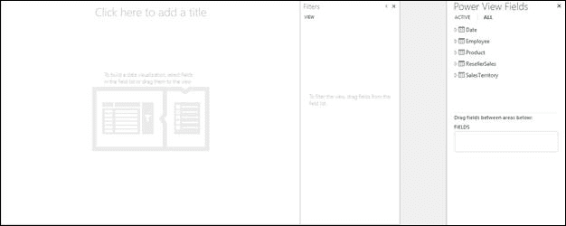

图 120 ：新的 Power View 报告

对于 SharePoint 中的 Power View，我们需要创建一个 BISM 连接文件，该文件再次定义数据模型的连接字符串。

## Power View 可视化

Power View 具有高度直观性和丰富的可视化效果，用户只需点击几下即可设计报告，数据格式本身应识别可用于表示报告的最佳可视化。只有在我们设置了正确的属性（包括默认字段集，表行为，格式，汇总和数据类别）时才可以这样做，我们在[第 4 章](../Text/bi-5.html#_Setting_the_Default)中讨论过这些属性。

在以下部分中，我们将讨论 Power View 可用的所有可视化选项，以及哪种数据类型最适合每个可视化。

### 使用 Power View 中的表格可视化数据

报告中最简单和最重要的数据可视化工具之一是表格可视化，因为大多数结构化数据可以以表格格式进行最佳分析和解释。默认情况下，Power View 以表格格式表示大多数数据类型，如果需要，我们稍后可以切换到其他可视化方法。

为了可视化数据，我们首先需要从 Power View 报告右侧的字段列表中按顺序选择数据。首先，我们选择 Products 层次结构，然后选择 Sales 和 Profit 度量，如下图所示。

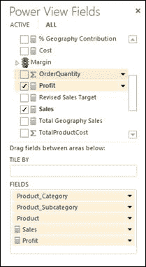

图 121 ：选择要显示的数据

Power View 工作区窗口中生成的表格报告如图 122 所示。

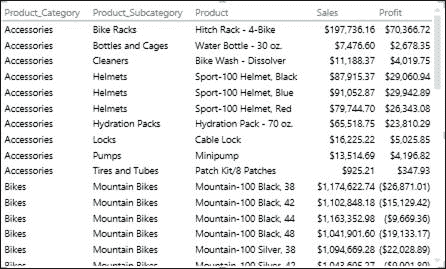

图 122 ：Power View 中的表格可视化

默认情况下，表格可视化对行进行汇总，并在表格底部显示总计，如下图所示。

图 123 ：表数据可视化中的汇总行

如果我们不想要报告中的总数，我们可以打开功能区上的**设计**选项卡，单击**总计**，然后选择**无**。

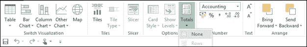

图 124 ：关闭总计

如果我们需要根据任何列对表进行排序，我们单击列标题，按升序对表进行排序。再次单击列标题将按降序对表进行排序。

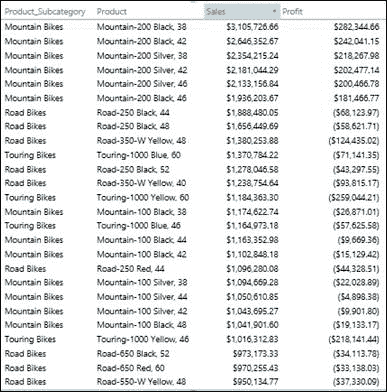

图 125 ：对列进行排序

我们还可以表示 KPI 数据，这是仪表板报告的常见要求。

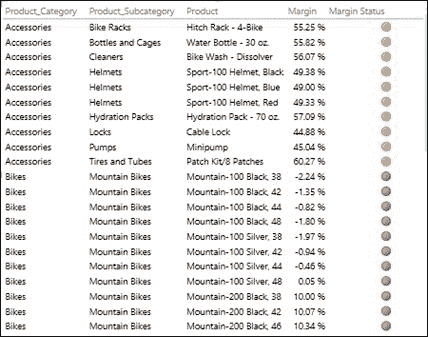

图 126 ：Power View 表报告中的 KPI

### 在 Power View 中使用矩阵可视化数据

矩阵可视化是另一种流行的可视化方法，用于使用行分组和列分组跨多个维度分析度量。要使用它，我们首先从字段列表中选择我们想要在矩阵中可视化的所有数据字段。

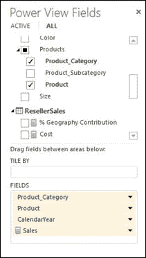

图 127 ：选择要可视化的数据

如前所述，默认情况下，从字段列表中选择数据会创建表格报告。要切换到矩阵可视化，请选择表格，打开功能区中的**设计**选项卡，单击**表**，然后选择**矩阵**。

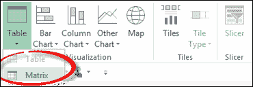

图 128 ：矩阵可视化选项

切换到矩阵可视化会将度量放在字段列表的“值”区域中，以及“行”区域中的所有维度列。我们现在将 CalendarYear 移动到 Columns 区域以形成矩阵报告，如下图所示。

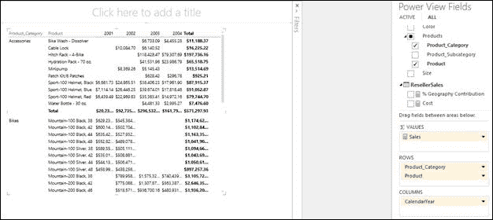

图 129 ：Power View 中的矩阵报告

默认情况下，Power View 会汇总行和列中的度量值，以计算行总计和列总计（以粗体表示），如上图所示。我们可以使用“设计”选项卡和“总计”选项卡关闭行总计，列总计或两者，如前所述。

如果我们需要在行层次结构中启用向下钻取以初始隐藏子级别，我们可以单击**设计**选项卡中的**显示级别**按钮并选择**行 - 启用向下钻取** **一次一级**，如下图所示。

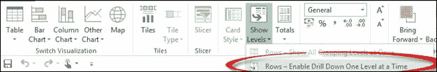

图 130 ：最初隐藏子级别

这将创建一个深入报表，该报表最初会折叠，隐藏层次结构的所有子级别。在我们的矩阵报告中，最初我们只在行级别看到产品类别。当我们点击附件值时，我们会看到一个下钻箭头，如下图所示。当我们单击箭头时，数据将钻取到子级别（在我们的示例中为产品级别），并带有向上钻取箭头以允许我们向后钻取到父级别。

图 131 ：向下钻取和向上钻取选项

### 在 Power View 中使用卡片可视化数据

卡片可视化是一种独特且创新的可视化，可用于可视化实体的相关数据，属性或属性。例如，员工姓名，年龄，性别和婚姻状况字段可以一起表示在卡片中。同样，产品名称，重量，尺寸，颜色和照片可以用卡片格式显示，可以在报告中显示为目录。

要使用卡片可视化，我们首先从卡片视图中的字段列表中选择所有字段。

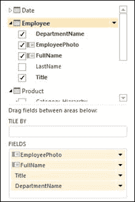

图 132 ：字段列表

接下来，我们打开功能区上的 **Design** 选项卡，单击**表**项目，然后选择**卡**。

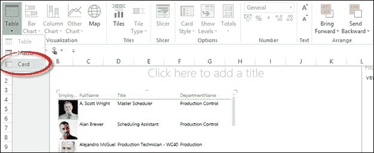

图 133 ：选择卡片可视化

在卡片可视化中，数据表示如下图所示：

图 134 ：卡片可视化

如果我们需要在报告中调出这些字段，我们可以通过单击**设计**选项卡中的**卡样式**按钮并选择**标注来将卡样式切换到标注模式**如下图所示。

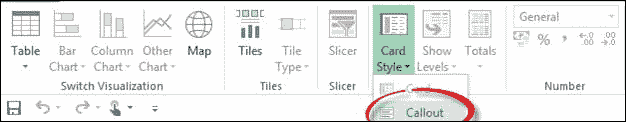

图 135 ：将卡片样式更改为标注模式

图 136 ：启用了标注模式的卡片可视化

### 使用 Power View 中的图表可视化数据

Power View 提供了丰富的图表可视化工具，包括柱形图和条形图，以及散点图。不同的图表可用于分析和比较不同维度的数据。在本节中，我们将探讨可用的各种图表可视化方法。

首先，我们从字段列表中选择我们需要显示的所有字段，如下图所示。

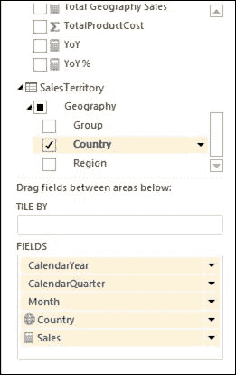

图 137 ：选择要绘制的字段

我们切换到 **Design** 选项卡中的 **Stacked Column** 图表，如下图所示。

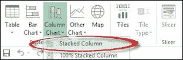

图 138 ：选择堆积柱形图

我们将 **Year** ， **Quarter** 和 **Month** 字段拖到 **AXIS** 框中，并将 **LEGEND** 选项设置为**国家**，如下图所示。

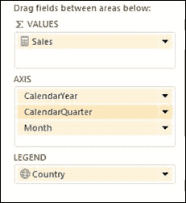

图 139 ：设置图表的轴，图例和值字段

结果图如图 140 所示。

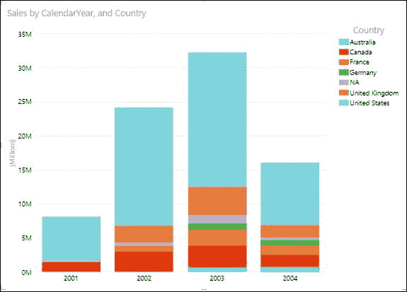

图 140 ：Power View 中的堆积柱形图

在横轴上，我们有 Year，Quarter 和 Month 的层次结构;但是，默认情况下，我们只能显示父级别。为了深入到季度级别，我们需要双击列栏。当我们双击 2003 栏栏时，我们会看到以下图表。

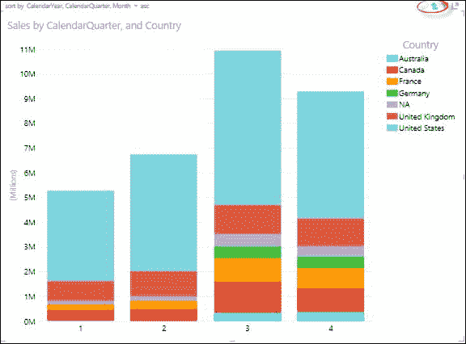

图 141 ：向下钻取 2003 列（向上钻取的向上箭头）

现在，数据分布在 2003 年的各个季度。我们可以通过单击上图中圈出的箭头向上钻取。我们可以通过双击四分之一的列栏来进一步深入到月份级别。

在这种数据表示中，我们可以比较层次结构的同一级别的成员之间的销售额。例如，我们可以使用柱形图对特定年份的年度或季度水平进行比较，但我们无法比较不同年份的季度。

如果我们需要比较不同年份的销售额，我们可以将**日历年**移动到**水平倍数**部分，如下图所示。

图 142 ：重新组织柱形图

结果图显示在下图中。

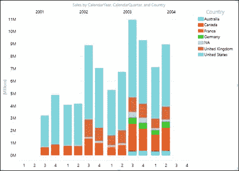

图 143 ：比较柱形图中年份之间的季度

如果我们需要关闭图例，更改图例的位置或打开数据标签，我们可以从顶部的**布局**选项卡进行操作。

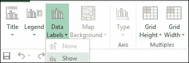

图 144 ：启用数据标签

如果我们不关心绝对销售但想要想象每个国家对每个季度的销售额的贡献，我们可以切换到 100％堆积柱形图来比较每个国家的相对贡献。结果图是：

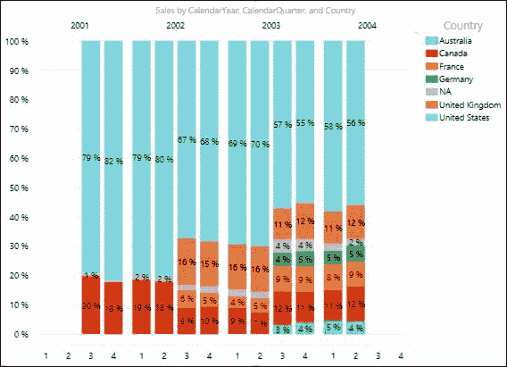

图 145 ：100％堆积柱形图

该图表解释了 2003 年销售额的增长是由于德国，澳大利亚和法国等某些国家对整体销售额的贡献增加。

我们可以切换到聚类柱形图，由于它将图例移动到顶部以节省一些水平空间，因此不太紧凑，但可用于相对比较每个国家/地区的绝对销售额。要将图例移到顶部，请单击**布局**选项卡，单击**图例**，然后选择**在顶部显示图例**。

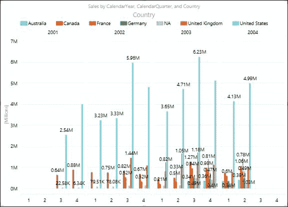

图 146 ：图例顶部设置的图例

从图 146 中的图表可以看出，美国第三季度的销售额在 2003 年第三季度销售额最高。

与柱形图类似，我们提供了水平条形图，即堆积条形图，100％堆积条形图和聚类条形图。我们使用柱形图绘制的相同信息在下图中显示为条形图。

图 147 ：条形图

如果我们以条形格式观察到相同的信息，我们会发现它看起来不像列格式那么混乱。条形图更易于用于视觉比较。

同样，如果我们需要研究各种产品类别的月份销售，成本和利润值的趋势，我们可以使用带有图 148 所示字段的折线图。

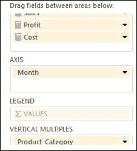

图 148 ：选择折线图的字段

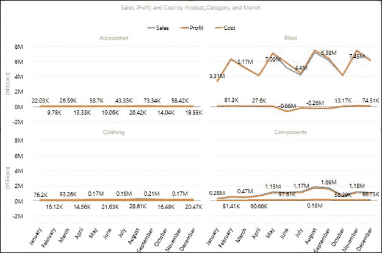

图 149 ：折线图

此图表显示了有趣的自行车统计数据;尽管自行车图表显示 5 月至 8 月的销售情况良好，但在此期间自行车的成本也较高，这也解释了该产品类别的损失。折线图适用于类似的趋势分析和图表报告。

饼图是另一种图形工具，可用于分析每个部门对总数的份额或贡献。在设计数据模型时，我们为％地理位置贡献创建了一个计算度量，以衡量每个地区对总销售额的贡献。此度量可以在饼图中得到最佳表示。

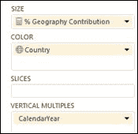

图 150 ：选择要在饼图中绘制图表的度量

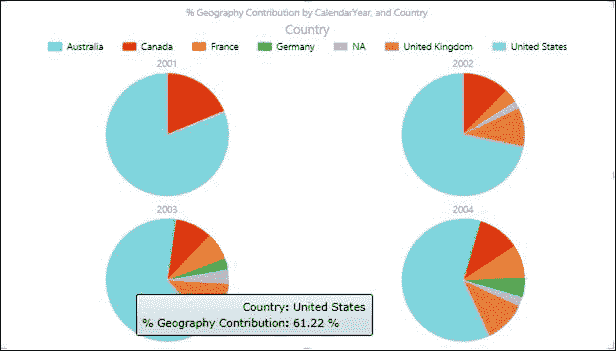

图 151 ：饼图

目前，饼图的一个主要局限是缺乏数据标签。

最令人印象深刻的图表可视化工具之一，即气泡和散点图，使我们能够跨多个维度或轴同时测量数据。考虑一种情况，我们需要在各种产品类别中测量每个 AdventureWorks 员工的销售额，销售目标和利润趋势。在这里，我们需要同时对 Employee，Date 和 Product 维度中的 Sales，Sales Target 和 Profit 度量进行切片和切块。我们可以使用气泡和散点图来实现这一点，如下图所示。

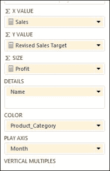

图 152 ：选择要在气泡和散点图中绘制图表的字段

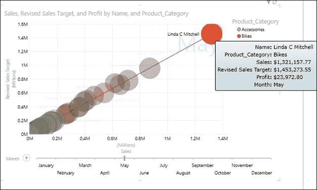

图 153 ：气泡和散点图

在散点图中，x 轴显示一个数字字段，y 轴显示另一个数字字段，从而可以轻松查看图表中所有项目的两个值之间的关系。

在气泡图中，第三个数字字段控制数据点的大小。要查看数据随时间的变化，我们将时间字段 Month 添加到带有“播放轴”的散点图和气泡图。

当我们点击图表中的播放按钮时，气泡穿过月轴，增长和收缩，以显示利润如何根据播放轴而变化。我们可以暂时停下来更详细地研究数据。当我们点击图表上的气泡时，我们会看到气泡随着时间推移而跟踪的历史记录，如上图所示。

我们将“产品类别”字段添加到“颜色”框中以显示散点图或气泡图，该图表根据类别的不同值对气泡或散点图进行不同的着色，从而覆盖气泡颜色。

### 使用 Power View 报告中的地图可视化数据

使用 Power View 报告中的地图可以最好地显示地理或空间数据。 Power View 可以解释表格模型多维数据集中定义的每个字段的数据类别属性，我们在前一章中对此进行了讨论。包含国家/地区，城市和地区等数据类别的字段是以地图形式查看的理想候选对象。

Power View 中的地图使用 Bing 地图图块，因此您可以像使用任何其他 Bing 地图一样进行缩放和平移。为了使地图有效，Power View 必须通过安全的 Web 连接将数据发送到 Bing 以进行地理编码，因此它会要求您启用内容。因此，我们需要具有 Internet 连接以在 Power View 中可视化地图。

考虑一种情况，我们需要针对各种产品类别报告不同销售地区的 AdventureWorks 的％地理位置贡献度量。我们选择所需的所有字段，然后使用功能区上的“设计”选项卡切换到地图可视化。我们可以将数据表示如下：

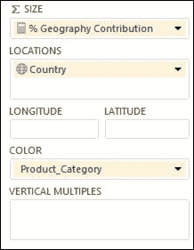

图 154 ：选择要映射的字段

添加位置和字段会在地图上放置点。值越大，点越大。添加多值系列时，会在地图上显示饼图，饼图的大小显示总计的大小，如下图所示：

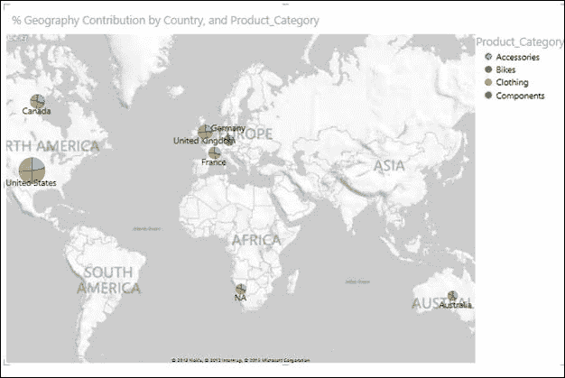

图 155 ：地图可视化

在地图可视化中，除了图例和数据标签选项外，我们还可以选择在“布局”选项卡中更改地图背景：

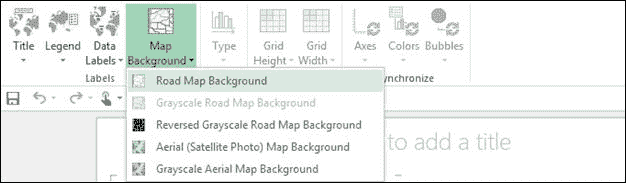

图 156 ：更改地图背景的选项

## 在 Power View 报告中过滤和切片

### 使用图表可视化交互式过滤和突出显示

Power View 中的一项独特功能是使用图表可视化进行交互式过滤和突出显示，该图表可视化适用于报表中的所有其他可视化。

由于底层模型中的这些关系，图表可以充当过滤器。这是交互式过滤，这意味着我们可以直接在图表上选择值，并让它过滤视图中的其他数据区域。如果我们在柱形图中选择一列，则会自动：

*   过滤报表中所有表格，图块和气泡图表中的值。
*   向条形图和柱形图添加突出显示。它突出显示与该值相关的其他条形图和柱形图的部分，显示过滤值对原始值的贡献。

我们可以按住 Ctrl 键选择多个值。要清除过滤器，请在过滤器内部单击，但不要在值上单击。

交互式过滤也适用于具有多个系列的图表。单击条形图中条形图的一个部分可过滤到该特定值。单击图例中的项目会过滤该系列中的所有部分。

在 Power View 中考虑以下报告，其中我们按柱形图显示产品类别的销售额，按条形图显示日历年的销售额，以及饼图中销售额的地理位置贡献百分比。

图 157 ：包含柱形图，条形图和饼图的报告

现在，如果我们有兴趣知道每年的“组件”类别的销售额以及每个国家/地区在“组件”类别中对销售额的贡献，我们可以单击柱形图中的“组件”栏，报告将动态切片并过滤其他图表以突出显示仅限“组件”类别的销售额。结果如下图所示。

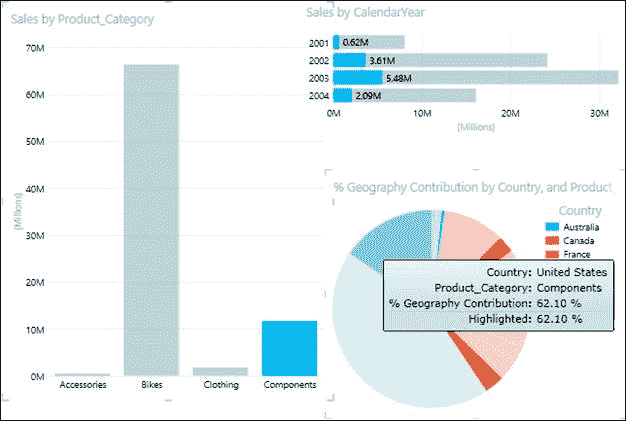

图 158 ：过滤的图表数据

每个可视化中的这种交互式过滤适用于报告中的所有其他可视化，是临时分析和报告的一个非常有用的功能。

### 过滤器

除了交互式过滤，我们还可以在 Power View 报告的 Filters 区域中定义过滤器。我们可以将过滤器应用于报表中的各个可视化，或将其应用于整个报表。要添加滤波器，我们需要将字段从 **Field** 列表拖放到**滤波器**区域。

让我们在 Filters 区域中添加 Product Category 作为过滤器，如下图所示。

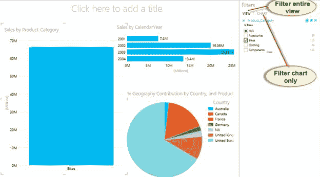

图 159 ：在“过滤器”区域添加类别

在 Filters 区域中，我们为列出的每个过滤器提供了不同的字段值，如图 159 所示。默认情况下，在过滤器中选择所有值。我们可以使用复选框选择我们要查看的各个“产品类别”字段。如果我们需要重置滤波器，我们可以单击**清除滤波器**选项。要删除过滤器，我们可以单击**删除过滤器**选项，如下图所示。

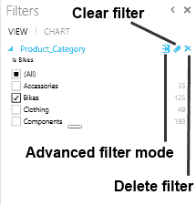

图 160 ：滤波器选项

我们还有一个高级过滤模式选项，当我们需要过滤具有大量唯一值的字段时非常有用，并且通过单独选择值来过滤值是不切实际的。

如果我们单击**高级过滤模式**，将出现以下屏幕。

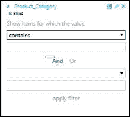

图 161 ：高级滤波器选项

在高级过滤模式中，我们可以使用 And 和 Or 运算符指定多个过滤条件。如果字段值满足条件，则数据将显示在报告中。高级筛选器选项根据要筛选的字段的数据类型而更改。

如果我们将高级过滤器应用于文本数据类型的字段，我们会看到以下选项。

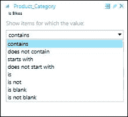

图 162 ：文本数据类型过滤器选项

我们可以在文本字段的可视化级别或视图级别过滤器中搜索值，然后选择是否对其应用过滤器。与搜索文本匹配的字段值的部分将在搜索结果列表中突出显示。搜索不区分大小写，因此搜索“Bikes”会产生与“bikes”相同的结果。

我们也可以使用通配符，如问号（？）和星号（*）。问号与任何单个字符匹配;星号匹配任何字符序列。如果我们想要找到实际的问号或星号，我们需要在字符前键入代字号（〜）。

如果我们搜索具有日期数据类型的字段，我们会看到以下选项。

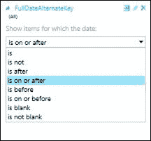

图 163 ：日期数据类型过滤器选项

对于具有数字数据类型的字段，我们会看到以下选项。

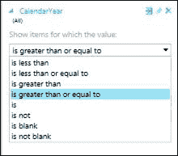

图 164 ：数字数据类型过滤器选项

### 切片器

切片器是另一种过滤器。他们过滤页面上的所有内容。 Power View 切片器看起来非常像 PowerPivot for Excel 中的切片器。我们可以从作为属性的任何字段创建单列表，然后将表转换为切片器。每个值都是一个按钮，顶角的按钮清除（重置）过滤器。要选择值，只需单击该按钮即可。数据立即在报告中过滤。

单击时按住 **Ctrl** 键可以选择多个值。

我们还可以通过使用顶角中的按钮重置滤镜来选择除一组值之外的所有内容，然后使用 **Ctrl** +单击以清除特定值。这显示除了未选择的值之外的总体值。

您可以在报告中添加多个切片器。切片器相互过滤;例如，如果我们有两个切片器，一个用于产品类别，一个用于产品，当我们单击前一个类别时，它会过滤后者以仅显示该类别中的产品。所有切片器的滤波效果结合在一起。

与图表过滤器不同，切片器：

*   过滤图表。它们没有突出显示图表。
*   与报告一起保存。保存，关闭和重新打开报告时，将在切片器中选择相同的值。
*   可以使用图像字段。在幕后，Power View 将该图像的行标识符字段用作切片器中的过滤器。

为了在报告中创建切片器，我们需要从字段列表中选择我们要用作切片器的字段，然后单击**设计**选项卡中的**切片器**选项。带。

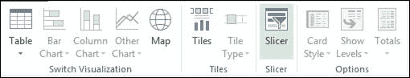

图 165 ：色带上的切片器选项

“产品类别”字段的切片器显示在“Power View”报告中，如下图所示。当我们单击切片器中的各个值时，在这种情况下为附件，将为该值过滤整个报告。

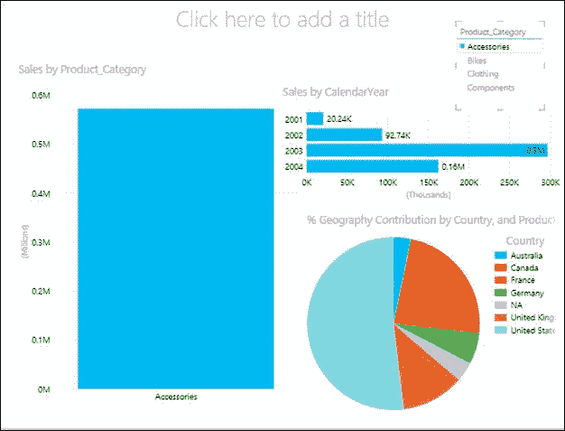

图 166 ：将切片器应用于报告

当我们需要使用具有较少不同值的字段过滤整个报表时，切片器可用作过滤器。当字段中的唯一值数量很多时，我们可以在“过滤器”区域中选择高级过滤器模式。

在我们可以在报告中过滤和突出显示数据的不同方式中，每种方式在保存报告时的行为都不同：

*   如果我们在设计视图中设置过滤器或切片器，切片器或过滤器的状态将与报告一起保存。
*   如果我们在设计视图中突出显示图表，则其状态不会随报告一起保存。

## 在 Power View 中设计仪表板

在前面的部分中，我们学习了 Power View 提供的所有可视化和过滤选项，以及每个可视化可以最好地表示哪些数据。将它们整合在一起，我们可以为最终用户和分析师创建交互式仪表板，使他们能够更好，更快地做出明智的决策。

在本节中，我们将设计 AdventureWorks 销售仪表板，以提供销售，利润，逐年比较以及每个地区的贡献的执行级摘要。

我们使用之前讨论过的可视化创建以下仪表板。

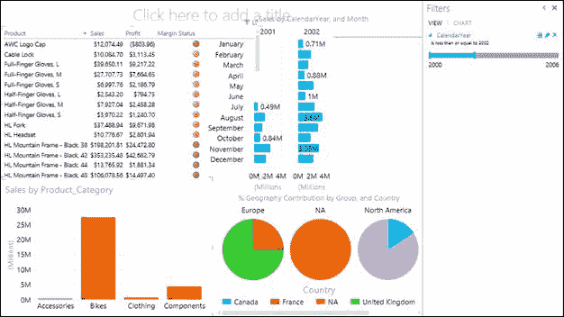

图 167 ：Power View 仪表板

在仪表板中，最好以表格格式表示详细级别的数据和 KPI。因此，我们使用表格可视化表示产品级详细信息以及销售，利润和保证金 KPI。

为了展示产品销售的逐年比较，我们选择用日历年作为横向倍数的条形图来表示月度销售数字。我们可以使用柱形图可视化来表示相同的图表，但是由于水平空间的限制，我们选择用条形图来表示它（对于年度比较，这在视觉上也更好）。

为了表示区域贡献，我们使用饼图作为水平倍数来表示地理贡献百分比。饼图最能代表这些数据。

我们选择使用柱形图按产品类别表示销售额，这对于交互式过滤和突出显示非常有用，特别是用于过滤“产品详细信息”表。

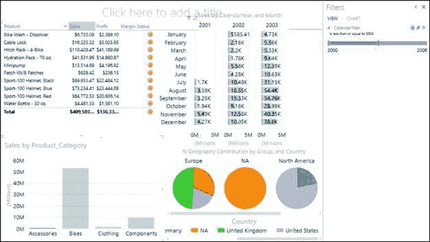

图 168 ：将过滤器应用于仪表板

我们在“过滤器”区域中添加“日历年”过滤器，这有助于限制条形图中的数据以进行年度比较。

一旦我们为仪表板提供了所有可视化和过滤器，我们就会在报告中添加标题，并使用**文本**选项卡调整其位置和字体。仅当鼠标指针位于文本框中时，才会显示“文本”选项卡。

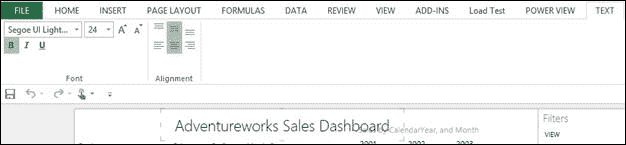

图 169 ：文本选项

接下来，我们通过单击功能区上 **Power View** 选项卡中的 **Picture** 按钮添加 AdventureWorks 徽标图像：

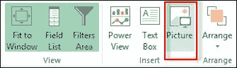

图 170 ：图片选项

我们定位徽标，如下图所示。

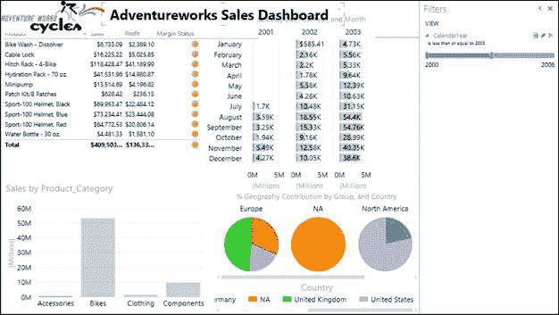

图 171 ：向仪表板添加图像和标题

接下来，我们可以通过单击功能区上 **Power View** 选项卡中的**设置图像**选项，在报告的背景中设置图像。

图 172 ：设置图像选项

图 173 ：将背景图像添加到仪表板

我们还可以在 **Power View** 选项卡的**背景图像**区域中将图像的透明度及其位置设置为 Fit，Stretch，Tile 或 Center。

图 174 ：背景图像选项

最后，为了使 Power View 报告具有视觉吸引力，我们可以使用**主题**选项更改 Power View 报告的主题和背景，如下图所示。

图 175 ：Power View 仪表板中的主题选项

仪表板现在可以用于报告和分析。

图 176 ：已完成的 Power View 仪表板

利用您的创造力和 UI 专业知识，您可以为分析和报告创建视觉上吸引人且丰富多彩的报告。

## 摘要

总之，Power View 是一款出色的报表和分析工具，具有丰富的数据探索和商业智能可视化选项。

新的 SSAS 表格模型为 BI 开发人员提供了灵活性，可以轻松创建数据模型，而 Power View 报告可以使用最小的复杂性。

希望您现在对于探索 Microsoft BI 堆栈中引入的这些和其他新产品感到兴奋和好奇。