# 第 10 章配置 BizTalk 管理员

要配置我们的应用程序，我们将使用 BizTalk Server Administrator。我不会详细介绍这一点，因为整本书只是为了解释如何使用所有管理任务，以及它们如何影响应用程序的性能。相反，我将仅介绍使小应用程序运行所需的配置。

要打开 BizTalk Server 管理控制台，请执行以下步骤：

1.  单击**开始**。
2.  选择**程序**。
3.  选择 **Microsoft BizTalk Server 2010** 。
4.  选择 **BizTalk Server 管理**。

在 Administrator 的左侧，您有一个树视图，允许您在这些控制台选项和组件之间导航。打开树后，您将找到包含已部署应用程序的 Applications 节点。如您所见，我们的 MyFirstBizTalkApp 可作为 Applications 节点的子节点使用。如果展开它，您会发现此应用程序的所有元素都组织到文件夹中，其中包含在 BizTalk 开发人员环境中创建的所有工件（模式，映射，编排，端口和任何其他资源）。

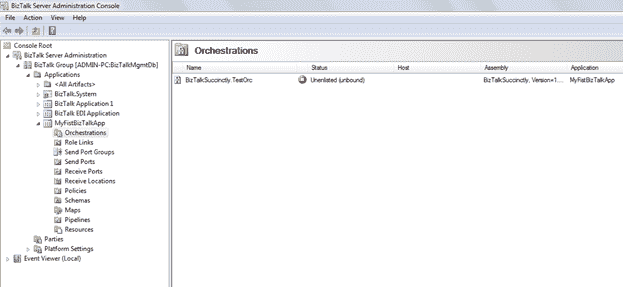

图 78：BizTalk Administrator 的第一个视图

在第 8 章的示例中，我们开发了一个简单的应用程序，其中包含一个接收端口，一个发送端口和一个转换。为了测试它，我们需要手动绑定接收消息的物理位置和发送消息的物理位置，指定它们将运行的进程（主机实例），然后将这些端口绑定到我们的业务流程中现有的端口。

为了使我们的应用程序正常工作，我们需要完成以下步骤：

1.  配置接收端口和位置。
2.  配置发送端口和位置。
3.  配置业务流程。
4.  启动应用程序。
5.  测试应用程序。

配置接收端口

我们的第一步是配置接收端口。在左侧树视图窗口的应用程序节点中选择**接收端口[​​TAG1]选项。接收端口文件夹将打开。要创建新的接收端口，请右键单击屏幕中央，选择 **New** ，然后选择**单向接收端口[​​TAG5]，如图 79 所示。****

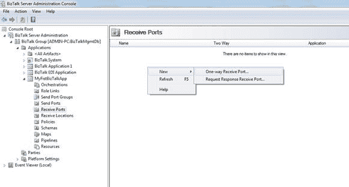

图 79：创建一个新的接收端口

BizTalk Administrator 将启动一个向导，帮助您进行配置。如图 80 所示，您需要设置接收端口名称和身份验证级别。对于我们的示例，选择**无身份验证**，因为我们不需要任何处理我们的接收消息。

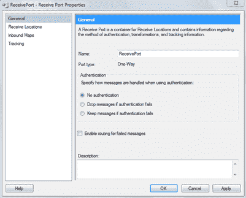

图 80：配置接收端口

接下来，单击向导屏幕左侧窗格中的**接收位置**。这是我们要告诉 BizTalk 使用特定的物理位置作为我们的消息接收位置。单击接收位置窗口中的**新建...** 。

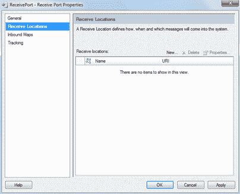

图 81：创建新的接收位置

这将打开一个新的“接收位置”窗口，您可以从中选择以下一个开箱即用选项中需要使用的适配器：

*   文件
*   FTP
*   HTTP
*   的 MQSeries
*   MSMQ
*   POP3
*   肥皂
*   SQL
*   WCF
*   Windows SharePoint Services

如您所见，BizTalk 允许许多适配器。适配器是一种软件组件，使您可以使用符合公认标准（如 SMTP，POP3，FTP 或 Microsoft 消息队列（MSMQ））的传送机制轻松地将消息发送到 BizTalk Server 或从中接收消息。随着 Microsoft BizTalk Server 的发展，对快速实现与常用应用程序和技术的连接的适配器的需求也在增加。对于我们的示例，我们将使用 FILE 传输类型。

在**类型**组合框中选择 **FILE** ，然后选择此端口的**接收处理程序**，默认情况下为 **BizTalk Server 应用程序**。不要忘记在**接收管道**字段中选择 **XMLReceive** ;这样，消息将被反汇编，并且可以识别订户。否则，如果您选择 PassThruReceive 管道，BizTalk 将引发错误，指出未识别任何订户。

现在单击**配置**，以便您可以定义您所在位置的 URI。

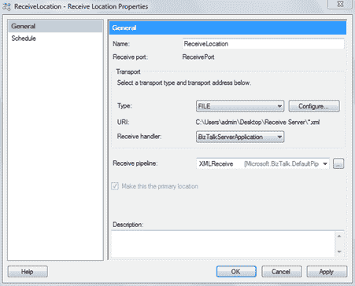

图 82：接收位置属性

接下来，系统将提示您使用 FILE Transport Properties 窗口，您可以在其中设置 **Receive 文件夹**路径。这将是我们的模拟**接收服务器**。由于我们将处理 XML 文件作为输入，因此选择文件掩码 *** .xml** ，以便只处理 xml 文件。

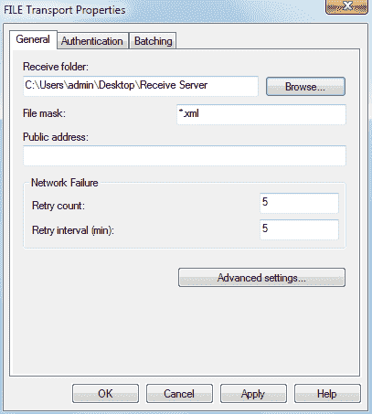

图 83：配置接收文件夹

单击 FILE Transport Properties 窗口中的 **OK** ，然后继续为此接收端口配置的所有打开窗口单击 **OK** 。完成后，您将在 Receive Ports 文件夹中看到一个新对象，该文件夹是您最近创建的端口。

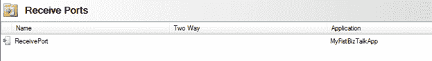

图 84：创建的接收端口

现在，您将对发送端口执行相同操作 - 唯一的区别是您将使用的管道。由于我们期望结果消息格式和 BizTalk 内部消息格式为 XML，因此您不需要任何特殊处理，因此您可以使用 **PassThruSend** 管道。创建发送端口后，您应该会看到它出现在“发送端口”文件夹中。唯一的区别是状态字段端口中的红色符号，表示此端口已停止。

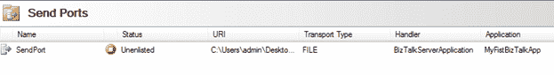

图 85：未列出的端口

右键单击端口并选择 **Start** 。现在您应该看到一个绿色符号，表示状态已更改为已启动。

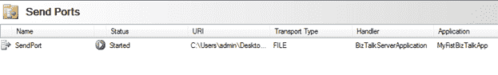

图 86：启动端口

配置业务流程

这是我们的最后一个配置步骤，我们只是将物理端口绑定到我们的业务流程中开发的逻辑端口。双击 Orchestration 文件夹中的业务流程;您将在管理员左侧的树视图中看到 Orchestration Properties 窗口。选择主机，选择默认 **BizTalk Server 应用程序**，对于每个接收和发送端口，使用组合框将它们绑定到此管理员控制台中先前创建的物理端口。完成此步骤后，我们的应用程序配置即告完成，我们就可以开始测试了。

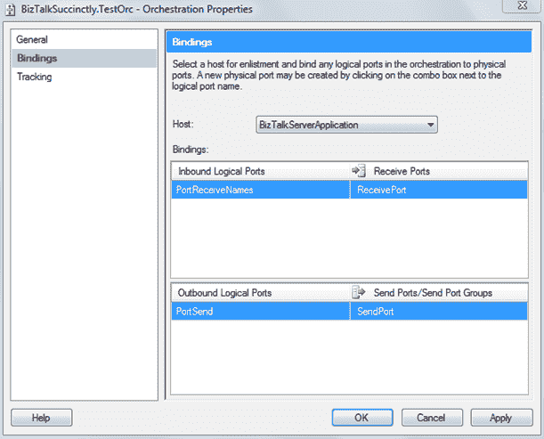

图 87：将业务流程绑定到物理端口

启动应用程序

下一步是启动应用程序，这是一个非常简单的步骤：只需右键单击 **MyFirstBizTalkApp** 并选择 **Start ...** 。接下来，BizTalk 将询问您是否要启动，您应该选择**开始**进行确认。

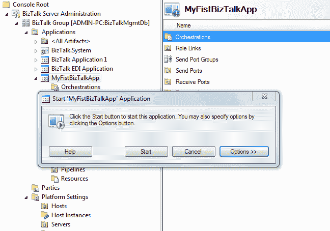

图 88：启动应用程序

测试应用程序

这是我们应用程序运行的最后一步测试。为此，我们需要构建 XML 消息;对于此示例，我将使用图 89 中所示的代码。

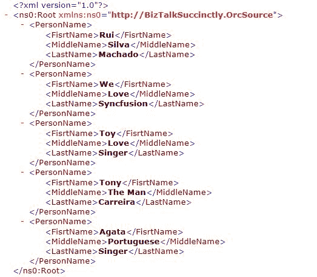

图 89：输入 xml

现在让我们在我们的接收位置使用它。只需转到**接收服务器**文件夹并删除输入的 XML 文件。如果配置一切顺利，BizTalk 将自动使其消失。

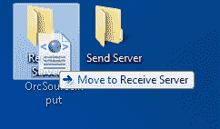

图 90：将输入文件拖放到接收位置

文件消失后，转到**发送服务器**位置，该位置应包含新消息。

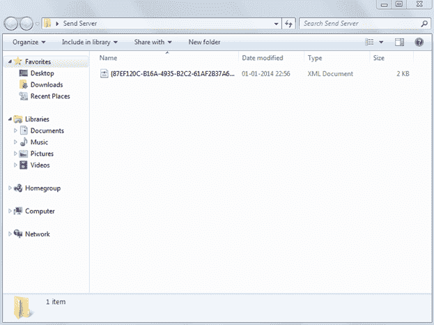

图 91：使用新消息发送服务器

如果打开此文件，您将看到使用我们开发的映射转换输入消息，预期结果如图 92 所示：

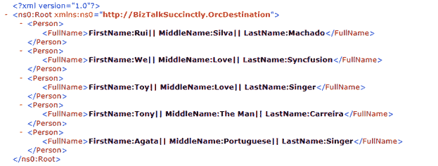

图 92：结果消息

## 最后一个注释

BizTalk Server 是一个功能强大的平台，可应用于多种项目类型。它不仅允许您使用业务活动监视集成数据，使用业务规则引擎和监视业务，还允许您使用业务流程和工作流连接人员，系统和业务。我在本书中没有谈到的另一个很好的功能是能够创建电子数据交换（EDI）项目，这不仅仅是在业务合作伙伴之间交换文档的标准。

本书旨在向您展示如何开始使用该平台进行开发;然而，BizTalk 激发了围绕它的整个世界的职业，包括开发人员，数据库管理员，经理，集成顾问等等。如果您希望继续学习，可以使用许多资源。

虽然它可能看起来像是一种新技术，但它自 2000 年以来就已经存在，并且许多人每天都在与该平台相关的主题上分享他们的知识。花在研究上的时间是一笔宝贵的投资，我相信它会为你带来许多商机。

我最后的注意事项是 BizTalk Server 2013 R2，它为该产品带来了更强大的功能。其中一个最大的功能是能够将您的应用程序连接到 Azure 服务，无需使用物理基础架构来开发某些集成解决方案，以及适配器和执行效率的显着改进。如果您对 BizTalk Server 2010 感到满意，则应该尝试使用此版本。