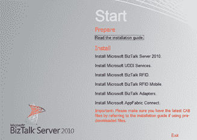
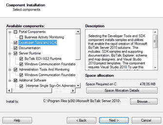
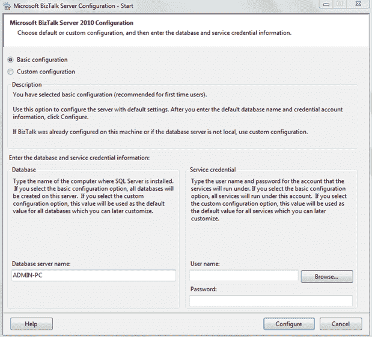
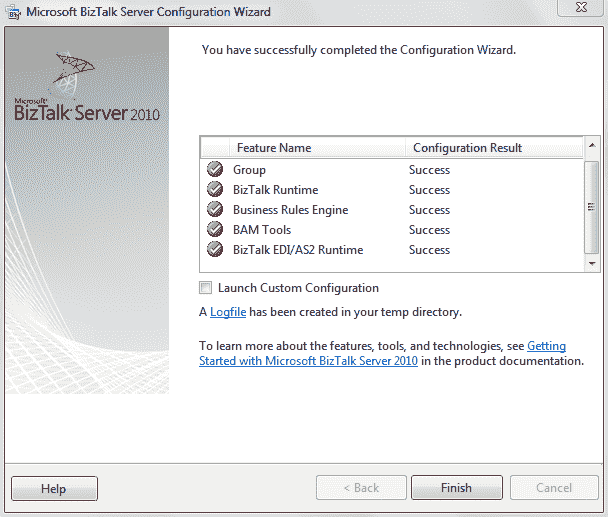

# 第 2 章 BizTalk Server 入门

## 安装 BizTalk Developer Edition

系统要求

因此，您可以开始练习您将从本电子书中学到的所有内容，您可以安装 Microsoft 提供的免费的 BizTalk Server 开发人员版（迄今为止，它只能在 BizTalk Server 2010 中免费提供）。我们将使用 BizTalk Server 2010，即使已经启动了 BizTalk Server 2013 R2。 2010 版本仍然是最常用的版本之一，并且有更多与此版本相关的资源，因此如果您在此平台上启动，则比 2013 年更容易找到教程，视频和示例。 2013 R2。

您可以在此处找到软件[，也可以在此处](http://www.microsoft.com/en-us/download/details.aspx?id=24433)下载评估 VM [。](http://www.microsoft.com/en-us/download/details.aspx?id=18969)

要安装它，请确保满足以下所有硬件和软件要求。

要运行 BizTalk Server 2010，您需要：

*   32 位（x86）平台：具有 Intel Pentium 兼容 CPU 的计算机，单处理器为 1 GHz 或更快，双处理器为 900 MHz 或更快，四处理器为 700 MHz 或更快。
*   64 位（x64）平台：具有与 AMD64 和扩展内存 64 位技术（EMT64T）兼容的 CPU 的计算机，推荐用于 BizTalk Server 2010 的 1.7 GHz 或更快的处理器。
*   最低 2 GB RAM（建议使用更多）。
*   10 GB 的可用硬盘空间。
*   VGA 显示器（1024 x 768）或更高分辨率的显示器。

要使用和开发 BizTalk Server 2010，您需要以下软件：

*   Microsoft Windows：可以是 Windows 7，Windows Server 2008 R2，Windows Server 2008 SP2 或带有 Service Pack 2（SP2）的 WindowsVista®。
*   SQL Server 2008 R2 或 SQL Server 2008 SP1
*   Microsoft .NET Framework 4 和带有 Service Pack 1（SP1）的.NET Framework 3.5
*   Microsoft Visual Studio 2010（仅适用于所选功能）
*   Microsoft Office Excel 2010 或 2007（仅适用于所选功能）
*   SQL Server 2005 通知服务（仅适用于所选功能）
*   带 Service Pack 1 的 SQLXML 4.0（仅适用于所选功能）
*   Internet 信息服务（IIS）版本 7.5 和 7.0（仅适用于所选功能）

|  | 注意：BizTalk 是一种企业产品，应安装在 Windows Server 等服务器操作系统中。 |

这些要求来自微软的网页;但是，我建议您安装 Visual Studio，否则您将无法开发 BizTalk 项目。

安装

假设所有计算机都已安装操作系统，其中包含 Microsoft 的最新关键 Windows 更新，并且满足所有其他先决条件，那么让我们开始安装 BizTalk Server 2010 免费版。

在这本电子书中，我将帮助您进行基本安装，以便您可以自己尝试以下章节中的示例。虽然它可能看起来很简单，但您应该知道这是一个可以访问多个公司中的多个数据源的平台，因此如果您想在生产环境中安装 BizTalk，我建议您更彻底地研究它。

### 正在安装 BizTalk

当您开始设置时，您将看到一个包含多个选项的欢迎页面。请选择**安装 Microsoft BizTalk Server 2010** 以初始化基本安装。

图 2：安装 BizTalk Server

选择安装 Microsoft BizTalk Server 2010 的选项后，将提示您几个配置选项。对于此安装，您可以保留默认选项。只需确保选择了**开发人员工具和 SDK** 选项，因为它是允许我们在 Visual Studio 中开发映射和编排的功能。

图 3：选择 Tools 和 SDK 选项

### 配置 BizTalk Server

安装完成后，将显示 BizTalk Server 2010 的配置屏幕;这是您配置数据库连接和访问数据库的凭据的位置，BizTalk Server 将存储所有应用程序的元数据。

第一个屏幕允许您在基本配置和自定义配置之间进行选择，如您在选项说明中所见，您应该选择 **Basic** 配置。您还需要配置数据库服务器名称，在我的情况下是 **ADMIN-PC** ，以及访问此数据库服务器的服务凭据，如图 4 所示：

图 4：配置 BizTalk Server 2010

配置数据库服务器连接后，单击 **Configure** 选项，设置将为您建立连接和配置，如下图所示：

图 5：完成配置

在配置结束时，会在临时目录中创建 LogFile。每当发生错误时，您都可以查看此文件以获取有关该问题的更多信息。