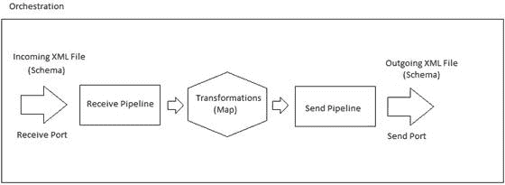

# 第 4 章所有工件如何协同工作

BizTalk Server 是 Microsoft 开发的产品，用于响应不断增加的各种不同系统以及在它们之间交换消息的需求。

对这种工具的需求很容易理解，因为基于计算机的信息系统有自己的数据结构，文档结构和工作流，并且在公司之间交换文档或只是单独的系统需要业务流程之间的一致性。我们需要对这些进行集成，以便在消息到达时，它与要触发的工作流程完全集成。

这种对齐需要中间件工具，可以捕获需要交换的消息，应用目标所需的所有转换和业务规则，并确保消息集成在其系统中的正确业务流程中。 BizTalk Server 适合这个中间件平台，其主要作用是响应业务流程集成的这种需求。

在处理系统集成时，需要满足和理解一些挑战，包括文档的格式和结构。当中间件平台捕获消息时，它不知道其结构，它包含哪些节点或目标系统。但是还有更多潜在的问题，例如文档结构是否符合目标的预期结构以及它需要遵循的工作流程。

通过使用您可以开发和组合的多个对象开发 BizTalk Server 应用程序，可以解决所有这些问题以及更多问题。在本书中，我们将浏览每组工件，它们是：

*   架构
*   端口
*   管道
*   地图
*   业务流程

除了 BizTalk Server 应用程序工件之外，还有一些工件，例如适配器，它们基本上是软件组件，使您能够使用符合公认标准的传送机制轻松地将消息发送到 BizTalk Server 或从中接收消息。 。它们将在本书中更详细地解释。图 8 概述了所有这些工件如何在 BizTalk Server 应用程序中协同工作。

图 8：简单应用程序