# 第 5 章架构

### 简介

模式是定义 XML 文件的层次结构的文件，就像类在面向对象的编程中定义对象一样。这些具有 XML 模式定义（XSD）扩展的文件必须具有根节点以及任何其他元素和属性。在为应用程序定义 XSD 之后，BizTalk 将使用它来验证通过接收端口进入的任何 XML 文件，如果匹配，则该 XML 将被转换并发送给该 XSD 格式的任何订户。

模式是 BizTalk 的核心基础工件，因为它们描述和识别 BizTalk 将处理的消息类型，并且您必须意识到通常 BizTalk 只处理它知道的消息。它们由业务流程和地图等其他工件引用。

BizTalk Server 支持以下四种类型的模式：

1.  **XML 模式**。 XML 模式定义了一组 XML 实例消息的结构。因为这种类型的模式使用 XSD 语言来定义 XML 实例消息的结构。这是 XSD 的预期目的，因为这样的模式以直接的方式使用 XSD。
2.  **平面文件架构**。平面文件模式定义了一类实例消息的结构，这些实例消息使用平面文件格式（分隔或位置）或其某种组合。因为 XSD 的本机语义功能不能满足定义平面文件实例消息结构的所有要求 - 例如可能用于平面文件中的不同记录和字段的各种类型的分隔符 - BizTalk Server 使用注释 XSD 的功能，可以在 XSD 架构中存储这些额外信息。 BizTalk Server 定义了一组丰富的特定注释标记，可用于存储所有必需的附加信息。
3.  **信封架构**。信封模式是一种特殊类型的 XML 模式。信封模式用于定义 XML 包络的结构，XML 包络用于将一个或多个 XML 业务文档包装到单个 XML 实例消息中。将 XML 架构定义为信封架构时，需要一些其他属性设置，具体取决于是否在信封架构中定义了多个根记录等因素。
4.  **属性架构**。属性架构与 BizTalk Server 中存在的两种机制之一一起使用，即所谓的属性提升。属性提升是将特定值从实例消息中的深层复制到消息上下文的过程。从消息上下文中，各种 BizTalk Server 组件可以更轻松地访问这些值。这些组件使用这些值来执行消息路由等操作。在实例消息发送到目的地之前，也可以将升级的属性值从另一个方向复制，从更容易访问的消息上下文返回到实例消息的深度。属性模式是 BizTalk 模式的简单版本，它在实例消息和消息上下文之间来回复制提升属性的过程中起作用。

除了 XML 文件，BizTalk 还使用模式来描述平面文件和任何其他格式。要向项目添加新模式，请在 Visual Studio 中选择 **Schema** 选项，单击 **Add** ，然后选择 **New Item** 。

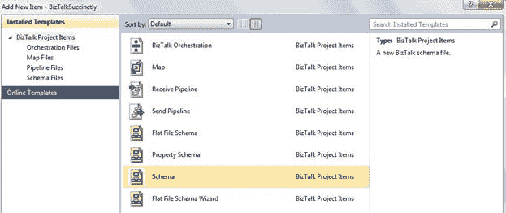

图 9：添加新架构

BizTalk 使用`命名空间#rootnode`的组合来定义消息的模式类型，从而使 MessageType 唯一（例如： [http：//mynamespace.com#MyRootNode](http://mynamespace.com#MyRootNode) ）。换句话说，BizTalk 使用此组合来标识和解析模式引用。

### 管理架构节点

向项目添加新架构后，Visual Studio 将打开 Schemas 的配置屏幕，您可以在其中定义该 XSD 文件的节点，记录和属性。一个重要的注意事项是，您应该始终更改架构的根名称，以便 BizTalk 可以正确识别它。

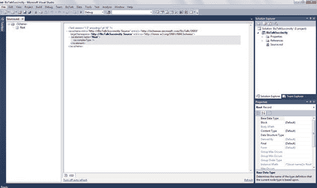

图 10：Schema creator 屏幕

在此 Visual Studio 屏幕中，您可以将项（节点）添加到架构中。为此，请右键单击屏幕左侧的根节点，然后根据需要选择正确的选项。

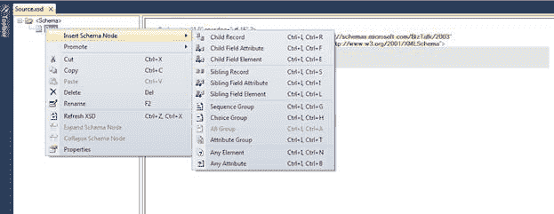

图 11：向节点添加节点

对于此模式，我将创建基本员工信息，包括姓名，地址，国家/地区，电话号码，出生日期和薪水。生成的模式将如图 12 所示：

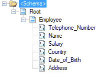

图 12：员工的架构

### 模式节点的属性

虽然此模式具有代表我们员工所需的所有节点，但 BizTalk 允许您使用更多定义（如数据类型）或哪些字段是必需的来丰富您的模式。这样，您可以选择节点（字段元素或属性），并使用“属性”窗口定义所有节点设置。图 13 显示了选择模式节点后的所有可用属性。

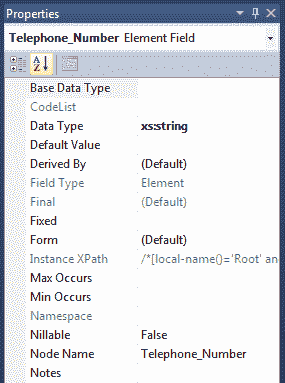

图 13：Schema 节点属性窗口

表 2 更详细地描述了架构节点属性：

表 2：模式节点属性

| 属性 | 描述 |
| 基础数据类型 | 确定当前节点类型所基于的类型定义的名称。使用**基本数据类型**属性指定将从中派生所选记录，字段元素或字段属性节点的数据类型的基本数据类型值（例如，“xs：string”）。 |
| 代码清单 | 指定用于所选 **字段元素** 或 **字段属性** 节点的代码列表的参考号，并提供访问权限到 **CodeList** 对话框。 |
| 数据类型 | 节点的数据类型。 （主要类型是 Decimal，DateTime，String，Int 和 Boolean，但 BizTalk 提供了更多选项。）指定所选字段元素或字段属性节点的简单数据类型;例如，string，int，Boolean 等。 |
| 默认值 | 指定所选 **字段元素** 或 **字段属性** 节点的默认值（对于数量，类似于 0）。 |
| 由派生 | 指示如何从其基本数据类型派生基础简单类型的字段。 |
| 字段类型 | 将所选节点标识为 **字段元素** 节点或 **字段属性** 节点。 |
| 决赛 | 指定为所选 **记录** ， **字段元素** 或 **定义的数据类型的派生限制字段属性** 节点。 |
| 已修复 | 指定实例消息中与所选 **字段元素** 或 **字段属性对应的元素或属性的固定值**节点，如果数据存在。 |
| 实例 XPath | 显示访问 XML 文件中节点的 Xpath 代码。 |
| 发生最大值/最小值 | 节点的最大和最小出现次数 |
| 命名空间 | 节点的命名空间 |
| Nillable | 指示值是否可以为 null（默认值为 False）。 |
| 节点名称 | 节点名称 |
| 备注 | 关于节点的任何注释 |

### 模式文件属性

管理与 **记录** ， **字段元素** 或 **字段属性相关的设置后**，BizTalk 还允许您定义模式本身的属性，这些属性应该始终进行检查，因为它们定义了 BizTalk 引擎如何识别模式。要访问这些属性，只需在解决方案资源管理器中单击您的架构文件。

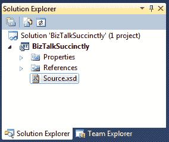

图 14：架构的属性

选择要设置的架构后，Visual Studio 将在“属性”窗口中显示其属性。

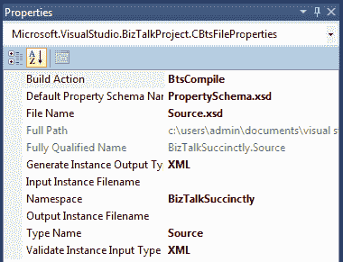

图 15：架构定义的属性

表 3 列出并解释了模式的所有属性。

表 3：架构属性

| 属性 | 描述 |
| 构建行动 | 指定在应用程序构建操作中如何处理文件。 （您可以指定在构建项目时不会编译模式。） |
| 默认属性架构名称 | 指定为提升属性生成的文件的名称 |
| 档案名称 | 模式文件的名称。您可以使用此属性来检查和设置所选模式文件的名称。 |
| 完整路径 | 架构文件的位置。您可以使用 **完整路径** 属性来检查存储所选模式文件的文件系统位置。 |
| 完全合格的名称 | 这是命名空间和类型名称的串联。它们一起形成用于在.NET 框架中唯一标识类型的完全限定名称。您必须确保整个 BizTalk 环境中没有两种类型具有相同的完全限定名称，因为它们用于标识传入和传出消息以及哪些消息针对哪些订阅者。 |
| 生成实例输出类型 | 指定生成实例选项的输出类型。 |
| 输入实例文件名 | 使用 validate 实例输入类型时，输入用于实例验证的文件名。 |
| 命名空间 | 编译模式所属的.NET 命名空间。 |
| 输出实例 FileName | 生成实例选项的文件名。 |
| 类型名称 | 已编译模式的.NET 类型。 |
| 验证实例输入类型 | 指定 validate 实例选项的输出类型。 |

### Visual Studio 中的模式操作

#### 验证架构

BizTalk 提供了几个选项来评估模式的一致性，告诉您它们是否构造良好或是否存在错误。为此，请使用“验证架构”选项，在解决方案资源管理器中右键单击架构文件并选择**验证架构**时可用。

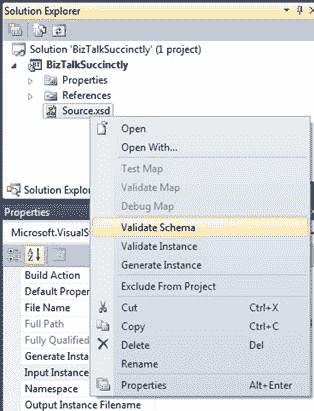

图 16：验证模式

BizTalk 将返回一条消息，提示架构是否定义良好。 BizTalk 还将返回文件名，以便您可以使用它进行进一步评估。如图 17 所示，模式没有错误：

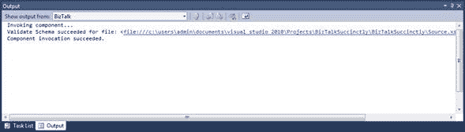

图 17：验证模式的输出窗口

#### 生成实例

“生成实例”功能用于根据先前创建和验证的架构为 Flat 文件生成 XML 文件或本机类型的实例。虽然此选项也验证了架构，但验证架构然后生成实例是一种常见的最佳实践。此选项与 Validate Schema 选项在同一菜单中可用。

单击**生成实例**选项后，BizTalk 将生成一个示例 XML 文件，其文件名在具有生成实例输出类型的模式的输出实例文件名属性中定义。图 18 显示了我们的员工架构的 XML 实例。

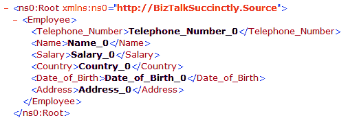

图 18：为员工架构生成实例

现在可以使用此生成的实例作为示例，使用“验证实例”选项评估我们的模式。

#### 验证实例

验证实例功能允许您验证 Flat 文件的 XML 文件或本机类型是否具有模式文件的结构，因此具有该格式。此选项与“验证架构”菜单在同一菜单中可用。

要使用此选项，您需要更改架构属性输入实例文件名，定义 XML 文件名（完整路径），以便架构在使用此验证实例选项时使用您要验证的 XML 文件。更改属性并运行验证程序后，BizTalk 将在输出窗口中显示结果。如图 19 所示，BizTalk 成功验证了我们的 XML 文件。

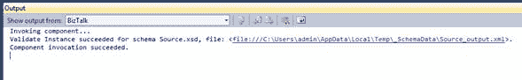

图 19：验证实例

### 从 XML 文件生成架构

BizTalk 的一个很好的功能是从 XML 实例生成 XSD 文件的功能。这对 BizTalk 开发人员很重要，因为它允许他们向客户询问正在集成的文件的单个 XML 示例，然后生成要在其映射中使用的模式。 （此方法有一些限制，可能需要您手动设置一些属性或元素。）

要使用此选项，请在“解决方案资源管理器”面板中右键单击项目，然后选择**添加**，**添加生成的项目**，然后选择**生成模式**选项为如图 20 所示。

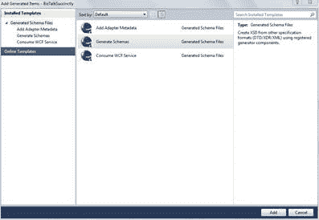

图 20：生成模式

出现“生成架构”屏幕后，您需要选择文档格式。当您使用我们的员工 XML 时，我们需要选择**格式良好的 XML** 并指定 XML 文件路径。

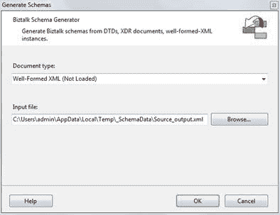

图 21：生成架构规范

完成指定文档类型和输入文件路径后，单击 **OK** ，BizTalk 将生成 XSD 文件。如果出现错误，指示未加载模块，则需要在消息框中显示的路径上执行模块安装程序（可能需要使用具有提升权限的 CMD 执行它）。在那之后，你准备好了。

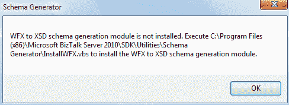

图 22：生成架构错误

到这一代结束时，您将能够在“解决方案资源管理器”窗口中看到您的全新架构。在我们的例子中，名称是 Source_output.xsd：

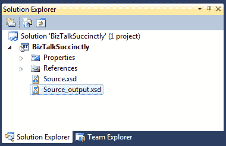

图 23：新生成的模式

### 物业推广

BizTalk 提供两种类型的属性促销：区分字段和属性字段。

以简化的方式，可以在业务流程中使用区分字段，而可以通过业务流程或自定义代码，路由和管道中的 BizTalk 消息处理的所有阶段访问提升的属性字段。

#### 杰出的领域

BizTalk Server 具有允许您使用模式中的元素根据 XML 实例在这些元素中具有的值进行路由或逻辑操作的机制。我想谈的第一个机制是杰出的领域。

这些可分辨字段是使用 BizTalk 架构编辑器中的此功能标记为已区分的消息中的字段。这些字段在标记为区分时可以在编排中通过点表示法使用，并且可以用于访问此特定字段的值并设置此字段的值。它们与提升的属性不同，因为它们不会被写入 MessageBox 订阅表以进行路由，因为提升的属性是;相反，它们本质上是 XPath 别名（简易指针或 XPATH 查询的抽象），它只是指向适当的 XML 数据字段。

要区分字段，只需右键单击要标记的节点，选择 **Promote** ，然后选择 **Show Promotions** 。

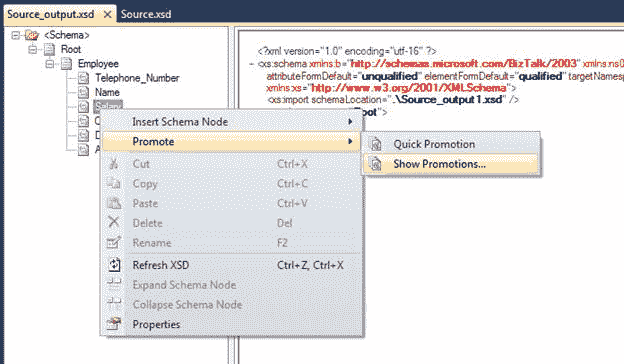

图 24：显示促销

当“促销”屏幕打开时，选择要区分的节点，选择**可分辨字段**选项卡，然后单击**添加**。图 25 显示了此操作的示例。对于此示例，我们将使用 Salary 属性。

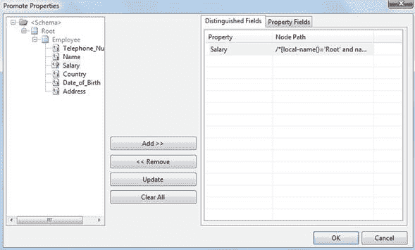

图 25：区分工资节点

#### 推广物业

区分属性和提升属性之间的主要区别在于可以使用它们的上下文。虽然使用了不同的属性来设置或获取业务流程内的消息中的值，但提升的属性用于根据消息的值来路由消息。它们允许消息传递引擎根据消息的值来路由消息，并且在消息上下文允许这样做而不必查看消息有效负载。提升属性是启用基于内容的路由的最常用方法。它们可用于管道，适配器，消息总线和编排。

推广字段的最佳方法是使用“快速促销”选项（与“显示促销”相同的菜单）。使用此选项，BizTalk 将自动在 schema 属性的 Default Property Schema Name 中定义的属性模式中创建提升属性。如果我们的项目中没有这个，Visual Studio 将自动生成并向项目添加属性架构。