# 第 6 章映射

## 简介

以一种非常简单的方式，映射（.BTM 文件）是使用称为 XSLT 的转换语言从一个可扩展标记语言（XML）文档转换为另一个 XML 文档或更多 XML 文档。这些映射在 BizTalk 中用于以下位置：

*   接收端口
*   发送端口
*   内部编排

地图是 BizTalk 的核心概念;他们负责在消息数据中进行任何必要的转换，这些转换由您要集成的不同系统交换。这些映射是使用 BizTalk Mapper 工具在 Visual Studio 2010 中开发的。此工具具有开发人员友好的界面，允许您具有地图使用的输入和输出模式的树结构视图。

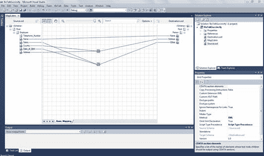

图 26：BizTalk Mapper 工具

## Mapper 概述

Mapper 编辑器分为七个不同的区域，每个区域代表地图和架构节点的不同行为和配置。可用的区域是：

1.  **Functoids** 面板，包含所有可用的 functoid 供您在地图中使用。
2.  **Grid** 面板，表示所有映射和转换。对于逻辑组织，BizTalk 允许您将映射分成页面，这些页面位于网格底部。
3.  **源模式结构**。这表示此地图的传入消息。让所有节点都可供您进行映射和转换。
4.  **目标模式结构**。这表示此地图的外发邮件。从映射转换节点的位置获取所有节点。
5.  **输出**面板。您可以在此处查看地图验证和测试的结果。此工具是一种非常重要的调试形式，您可能已经从.NET 项目中了解到这种形式。
6.  **解决方案资源管理器**。这是所有 Visual Studio 项目的通用面板。它代表了 BizTalk 应用程序的解决方案结构。
7.  **属性**窗口。这也是所有 Visual Studio 项目的共享窗口。它显示所选对象的所有可用属性。

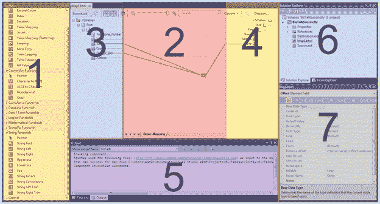

图 27：Mapper 概述

## 向项目添加地图

将地图添加到项目非常简单，因为地图是 SDK 工件。要添加地图，请在解决方案资源管理器中右键单击您的项目，然后选择**添加**＆gt; **添加新项目**，然后选择 **Map** 。不要忘记在**添加新项目**屏幕中为其指定一个描述性名称。添加新映射后，BizTalk 将打开映射编辑器，不需要任何模式和转换，如图 28 所示。

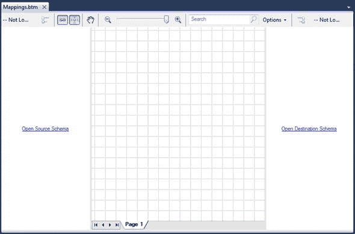

图 28：空地图

创建空映射后，是时候向其添加源和目标模式，以便开始映射和转换。重要的是要回顾一下，现在应该已经创建了两个模式或将它们添加到项目中。

## 将架构添加到地图

如图 28 所示，空映射在源和目标模式中都有链接，允许您不仅从项目中选择模式，还可以从解决方案中引用的任何其他项目中选择模式。单击**开源模式**或**打开目标模式**时，系统将提示您选择模式的位置。

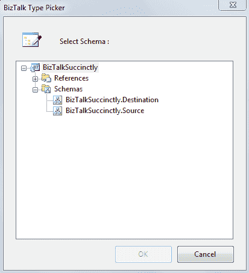

图 29：向项目添加模式

对于我们的示例，我们将添加 **BizTalkSuccinctly.Source** 模式作为源模式，并将 **BizTalkSuccinctly.Destination** 添加为目标模式。重要的是你注意到我们已经使用命名空间 **BizTalkSuccinctly** 配置了我们的模式，因此 BizTalk 创建了两种新类型的消息，这个命名空间与模式名称连接在一起，创建了所谓的完全限定名称架构。这用于标识订户订阅的消息类型。

## 链接节点

将源和目标模式添加到映射后，可以通过将源中的节点链接到目标模式来开始实现简单的转换规则。链接是将源架构中的数据项与目标架构中的数据项相关联的方式。通常，在完整的映射中，源模式和目标模式之间存在许多链接。所有这些链接都指定了如何将源实例消息中的数据转换为语义上等效的，但语法上不同的目标实例消息。

在 BizTalk 中链接节点是一个非常简单的操作，拖放事件将自动在一个源节点和另一个目标节点之间创建链接。要链接节点，请单击鼠标指针并将其拖动到目标节点。图 30 表示地图中两个节点之间的链接。

图 30：链接节点

BizTalk 还为您提供加速映射的机制。在这种情况下，我们只是映射一个节点，但想象你有源节点和目标模式，有数百个节点，它们都有相同的名称 - 我们会失去思想将它们一个接一个地链接起来。要加速映射，您可以在执行链接时单击 **CTRL** ;完成拖放后，BizTalk 将为您提供以下选项：

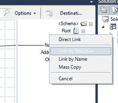

图 31：链接选项

这些选项可能成为您在节点映射中最好的朋友，因为它们将为您节省大量时间。表 4 总结了这些链接选项。

表 4：链接选项

| 名称 | 描述 |
| 直接链接 | 使用此技术，BizTalk Mapper 将记录从源架构链接到目标架构中的选定记录。 |
| 按名称链接 | 使用此技术，BizTalk 映射器尝试匹配在链接的 Record 节点内根据相应节点的名称链接的 Record 节点内的 Record 和 Field 节点，而不管它们的结构如何。 |
| 按结构链接 | 使用此技术，BizTalk Mapper 尝试匹配根据这些 Record 节点的结构链接的 Record 节点内的 Record 和 Field 节点，而不管这些结构中相应节点的名称。 |
| 批量复制 | Mass Copy functoid 使您的地图能够使用包含 any 和 anyAttribute 元素的模式。 |

例如，让我们使用 Link by Name 选项。图 32 显示了使用此选项仅映射一个节点的结果;两个节点都自动链接。

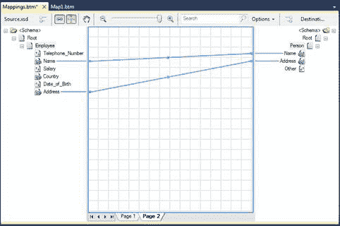

图 32：按名称链接

## Functoids

有时，BizTalk 映射中的直接链接不足以遵守目标模式格式，我们需要应用一些数据转换或转换。它可以是节点与特定类型的串联或转换，并且可能需要若干操作来满足这些目标模式的要求。

Functoid 是对此问题的响应，封装了用于对源节点值执行所有必需处理以使用目标节点格式和值的转换逻辑。 BizTalk 有许多 functoid，可以简单到将字符串连接到乘法值或循环遍历 XML 文件中的重复记录。

在 mapper 中，您可以在工具箱中找到所有可用的 functoid，您可以在地图编辑器工具的左侧找到它们。当您打开工具箱时，您会发现这些 functoid 分为几类，表示该 functoid 响应的操作类型。

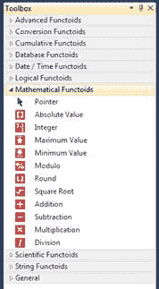

图 33：Functoids 类别

一旦确定了要使用的 functoid，将其添加到地图并配置其行为的过程对于所有 functoid 都是相同的;您只需将 functoid 拖放到地图中，将源节点/节点链接到 functoid，双击它以配置任何其他设置，并将 functoid 链接到目标节点。

在下面的示例中，我们希望将员工的地址与国家/地区连接起来，但是将其与分号分开，然后将其连接到目标节点。第一步是通过将它连接到地图的中心来添加我们的连接 functoid，如图 34 所示。

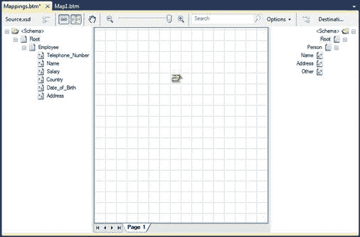

图 34：添加连接 functoid

在添加连接 functoid 之后，BizTalk 将在其上面发出警告，这表明 functoid 没有输出节点。重要的是要了解 functoid 可能不需要输入节点，但它必须链接到至少一个输出节点。现在我们需要将 Address 和 Country 节点链接到 concatenate functoid，并将 functoid 链接到目标节点。如图 35 所示，警告不再存在。

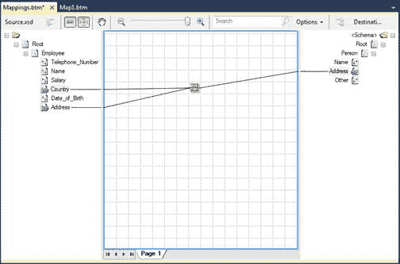

图 35：正确连接的 functoid

最后，您需要在两个节点之间添加分号作为分隔符。为此，双击 functoid 顶部，您将看到配置屏幕。请记住，所有 functoid 都有这种行为;如果您需要配置任何其他设置，请双击它并配置您需要的设置。双击它之后，您将看到如图 36 所示的内容，您可以在其中看到我在节点之间添加了分号。

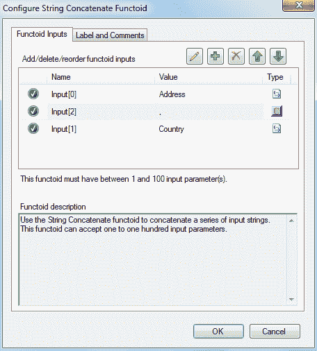

图 36：设置连接 functoid

这个 functoid 不仅允许您在串联逻辑中添加字符串，还允许您重新排序节点，甚至从中删除一些节点或字符串。

这个 BizTalk functoid 机制允许开发人员非常容易地维护和开发映射和消息转换。

### 可用的 Functoids

虽然连接 functoid 易于使用，但还有一些更复杂。下表将向您展示所有可用的开箱即用的 functoid 及其类别。

String Functoids

这类 functoid 代表所有可用于字符串操作的 functoid。所有这些 functoid 都有一个字符串作为返回对象，它们的输入可能是源模式的输入节点或静态字符串，在 functoid 配置屏幕中配置为输入参数。表 5 中描述了此类别中可用的 functoid。

表 5：字符串 Functoid

| 形状 | 名称 | 描述 |
|  | 字符串查找 | 返回第一个参数中第一个找到的第二个参数实例。 |
|  | 字符串左 | 返回字符串左侧第二个参数中指定的字符数。 |
|  | 字符串右 | 返回字符串右侧第二个参数中指定的字符数。 |
|  | 大写 | 以大写形式返回输入字符串。 |
|  | 小写 | 以小写形式返回输入字符串。 |
|  | 尺寸 | 返回输入字符串的长度（int）。 |
|  | 字符串提取 | 接受三个参数（字符串，开始和结束位置）并返回第一个输入的子字符串。 |
|  | 字符串连接 | 从一个字符串到 100 个字符串，并在添加顺序中返回它们的串联。 |
|  | 左边修剪 | 接受一个字符串并从左边修剪它。 |
|  | 右边修剪 | 接受一个字符串并从右边修剪它。 |

高级 Functoids

此类 functoid 允许您对其输入执行高级操作。其中一些返回一个输出，可以用作另一个 functoid 的输入或直接发送到目的地。在此类别中，您有以下可用的 functoid：

表 6：高级 Functoid

| 形状 | 名称 | 描述 |
|  | 脚本 | 允许您执行自定义代码。可以是 C＃，内联 JScript .NET，内联 Visual Basic .NET，内联 XSLT 或内联调用模板。 |
|  | 记录计数 | 返回节点的总出现次数。 |
|  | 指数 | 使用源模式中的节点作为第一个参数，将所有其他输入用作节点中的级别，返回由其他参数中的值索引的节点的值。 |
|  | 迭代 | 使用源模式中的节点作为第一个参数，返回节点的迭代，表示节点的当前出现次数。 |
|  | 价值图 | 如果第二个参数为真，则输出其第一个参数。 |
|  | 断言 | 允许您确保某些条件始终为真，例如正常 C＃代码中的断言。 |
|  | 价值图（扁平化） | 这个 functoid 与 Value Mapping functoid 的不同之处在于它试图将输入展平为输出。 |
|  | 循环 | 使用源模式中的节点作为输入，遍历其出现次数。必须连接到目标节点。 |
|  | 海量复制 | 递归地将源节点（输入）之下的所有节点复制到目标节点。 |
|  | 表循环 | 在内存中构建一个表，用于在输出中创建具有输入中不存在的某种结构的记录。 |
|  | 表格提取器 | 这个 functoid 有两个参数：第一个必须是 Table Looping functoid，第二个是一个数字，表示从表中获取值的列。 |
|  | 零值 | 如果输入为 true，则允许返回空值。 |

转换 Functoids

这类 functoid 允许您对输入参数执行转换，并使用返回输出作为另一个 functoid 的输入，或者直接发送到目标模式。在此类别中，您有以下可用的 functoid：

表 7：转换 Functoid

| 形状 | 名称 | 描述 |
|  | ASCII 到字符 | 返回转换为 ASCII 表中具有此编号的字符的数字 |
|  | 字符到 ASCII | 返回转换为 ASCII 表示形式的输入参数（字符串）的第一个字符 |
|  | 十六进制 | 返回转换为十六进制值的输入的整数部分。输入假定为十进制。 |
|  | 八进制 | 返回转换为八进制值的输入的整数部分。输入假定为十进制。 |

累积 Functoids

累积 functoid 允许您对源模式中的重复节点执行操作，并根据输入节点的所有实例输出一个值。在此类别中，您有以下可用的 functoid：

表 8：累积 Functoid

| 形状 | 名称 | 描述 |
|  | 累积平均数 | 对输入值执行平均计算，将结果作为十进制值返回 |
|  | 累积连接 | 连接所有出现的字符串输入，将输出作为一个字符串返回 |
|  | 累积最大值 | 返回输入值的最大值 |
|  | 累积最低值 | 返回输入值的最小值 |
|  | 累计和 | 返回所有输入值的总和 |

数据库 Functoids

这个 functoid 类允许您对数据库执行查找操作，以便从中获取存储的值，然后在映射中添加和使用它们。在此类别中，您有以下可用的 functoid：

表 9：数据库 functoid

| 形状 | 名称 | 描述 |
|  | 数据库查找 | 有四个输入，一个查找值（通常是一个 ID），一个连接字符串，要查找的表的名称，以及用于查找具有该 ID 的值的列名。然后，BizTalk 将查询数据库并返回找到的行。 |
|  | 错误返回 | 使用数据库查找 functoid 输入的内容，返回在对数据库执行查询时发生的任何错误。 |
|  | 值提取器 | 有两个输入，数据库查找 functoid 和提取的数据集中的列名，然后返回该列的值。 |
|  | 格式消息 | 使用参数替换以及可能的 ID 和值交叉引用返回格式化和本地化的字符串。 |
|  | 获取应用程序 ID | 检索应用程序对象的标识符。 |
|  | 获取应用价值 | 检索应用程序值。 |
|  | 获取公共 ID | 检索公共对象的标识符。 |
|  | 获得共同价值 | 检索公共值。 |
|  | 删除申请 ID | 删除应用程序对象的标识符。 |
|  | 设置公共 ID | 设置并返回公共对象的标识符。 |

日期/时间 Functoids

这些类型的 functoid 允许您对输入参数执行日期/时间操作，或生成日期/时间对象类型以添加​​到目标节点。它们的输出可以用作另一个 functoid 的输入或直接发送到目的地。在此类别中，您有以下可用的 functoid：

表 10：日期/时间 functoids

| 形状 | 名称 | 描述 |
|  | 添加天数 | 使用它们的两个输入参数，并返回一个新日期，作为将第二个参数中指定的天数添加到第一个参数中指定的日期的结果。 |
|  | 日期 | 返回当前日期，没有输入参数。 |
|  | 时间 | 返回当前时间，没有输入参数。 |
|  | 日期和时间 | 返回当前日期和时间，没有输入参数。 |

逻辑 Functoids

这类 functoid 对其输入执行逻辑运算，并返回一个布尔值，稍后可以将其用作另一个 functoid 的输入，或者指示编译器如何构造生成的 XSLT。它们通常用于在映射内定义规则。

表 11：逻辑 functoid

| 形状 | 名称 | 描述 |
|  | 大于 | 如果第一个参数大于第二个参数，则返回 true，否则返回 false。 |
|  | 大于或等于 | 如果第一个参数大于或等于第二个参数，则返回 true，否则返回 false。 |
|  | 小于 | 如果第一个参数小于第二个参数，则返回 true，否则返回 false。 |
|  | 小于或等于 | 如果第一个参数小于或等于第二个参数，则返回 true，否则返回 false。 |
|  | 相等 | 如果两个参数相等则返回 true，否则返回 false。 |
|  | 不相等 | 如果参数不相等则返回 true，否则返回 false。 |
|  | 逻辑字符串 | 返回 true，输入参数是字符串，否则返回 false。 |
|  | 逻辑日期 | 返回 true，输入参数是日期，否则返回 false。 |
|  | 逻辑数字 | 返回 true，输入参数是数字，否则返回 false。 |
|  | 逻辑或 | 返回所有输入参数的逻辑或。 |
|  | 逻辑和 | 返回所有输入参数的逻辑 AND。 |
|  | 逻辑存在 | 返回节点存在的评估。 |
|  | 逻辑 NOT | 返回布尔值的否定。 |
|  | IsNil | 如果节点在模式中设置为 nil，则返回 true，否则返回 false。 |

数学 Functoids

这些 functoid 几乎是你的转换计算器;它们允许您对其输入执行数学运算并返回一个输出，该输出可用作另一个 functoid 的输入或直接发送到目标模式。在此类别中，您有以下可用的 functoid：

表 12：数学 functoid

| 形状 | 名称 | 描述 |
|  | 绝对值 | 接受一个值，它返回值的绝对值。 |
|  | 整数 | 接受一个参数并返回值的整数部分，有效地删除小数点和所有小数。 |
|  | 最大值 | 至少接收两个参数，最多接受 100 个参数，并返回最高值。 |
|  | 最低价 | 至少接收两个参数，最多接受 100 个参数，并返回最低值。 |
|  | 模数 | 返回执行一个第一参数除以一秒参数的余数。 |
|  | 回合 | 接受两个参数并返回第一个四舍五入第二个定义的小数位数。 |
|  | 平方根 | 返回输入参数的平方根。 |
|  | 增加 | 对参数求和并返回结果。 |
|  | 减法 | 减去参数并返回结果。 |
|  | 乘法 | 将参数相乘并返回结果。 |
|  | 分部 | 除以参数并返回结果。 |

科学 Functoids

这些 functoid 用于对其输入执行科学数学运算，并返回一个输出，该输出可用作另一个 functoid 的输入或直接发送到目标模式。这些是数学类别 functoid 的补充，它们是分开的，因为它们代表了高级数学运算。在此类别中，您有以下可用的 functoid：

表 13：科学 functoids

| 形状 | 名称 | 描述 |
|  | 圆弧切线 | 返回对参数执行反正切函数的结果 |
|  | 余弦 | 返回对参数执行余弦函数的结果 |
|  | X ^ Y | 返回第一个输入提升到第二个输入的功率（例如：23 ^ 7） |
|  | 正弦 | 返回对参数执行正弦函数的结果 |
|  | 正切 | 返回对参数执行切线函数的结果 |
|  | 自然指数函数 | 返回提升到参数幂的自然对数的基数。 |
|  | 自然对数 | 返回参数的自然对数 |
|  | 10 ^ n | 将 10 提升到参数的幂（例如：10 ^ 4） |
|  | 常用对数 | 返回参数的基于 10 的对数 |
|  | 基础指定对数 | 使用第二个参数作为基数并在第一个参数上执行函数，返回基本指定的对数函数 |

## 在 Visual Studio 中映射操作

### 测试图

在开发我们的地图时，我们将执行转换以输入模式以尊重我们的输出模式。这意味着将通过我们的应用程序接收端口或处理内部编排接收的每个 XML 文档将根据这些相同的转换进行转换。

您可以想象，在没有任何先前测试的情况下部署映射将是危险的，因为我们可能会向我们的贸易伙伴发送无效消息。 BizTalk 提供了一种机制，可以根据输入 XML 或平面文件文档模拟地图的执行，并在 Visual Studio 中检索预期的 XML 或平面文件。您还可以检查并检查映射器引擎生成的 XSLT。重要的是要理解尽管 BizTalk 验证了 XSLT 结构和语法，但作为开发人员，您的工作是验证生成的 XML 文档是否符合您的贸易伙伴的要求。

要使用此工具，只需在解决方案资源管理器中右键单击地图，然后选择**测试图**选项。

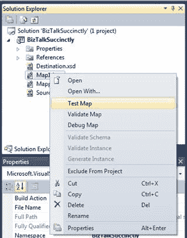

图 37：测试图菜单

然后，BizTalk 将生成一个输出文档，您可以通过单击输出窗口中的文件位置来访问该文档。

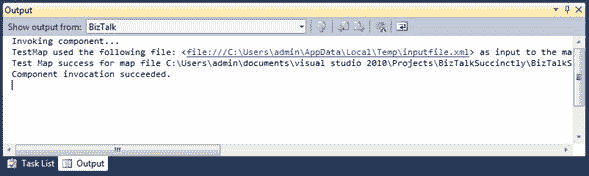

图 38：测试图

虽然您可以直接使用此工具而无需自定义，但地图属性允许您在不同条件下执行测试，例如自定义输入 XML 以针对实际示例方案进行测试。为此，您可以访问地图属性并将属性**测试地图输入**更改为 **XML** ，然后在**测试地图输入实例**中配置测试 XML 文件路径]财产。

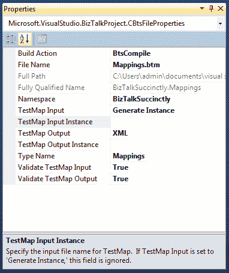

图 39：自定义测试图执行

### 验证地图

映射验证是开发 BizTalk 映射时常用的简单操作。虽然测试映射可帮助您可视化 XML 文档上的映射转换结果，但此功能可验证转换的一致性（例如，是否存在未链接的必需节点，或者您是否有多个指向同一节点的链接）。要使用此选项，请在解决方案资源管理器中右键单击地图，然后选择**验证地图**。

图 40：验证地图

执行映射验证结束后，BizTalk 将生成一个输出，指示是否存在错误或警告，如果成功则生成，并生成 XSLT 以执行映射。如果成功与否，将向您提供此 XSLT。在输出窗口中查找具有其路径的行，您可以将其打开：

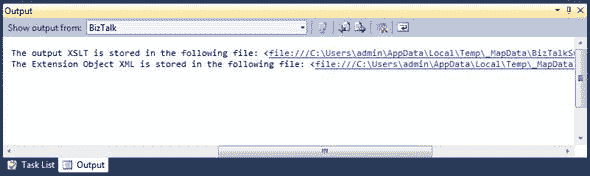

图 41：XSLT 文档的输出

如果您已经使用过 XSLT 文档，那么打开文件时，语法就会很熟悉。它包含来自模式的所有节点，用作输出，每个节点都包含转换的逻辑，以及用于从源模式获取所需节点的 XPath 引用。

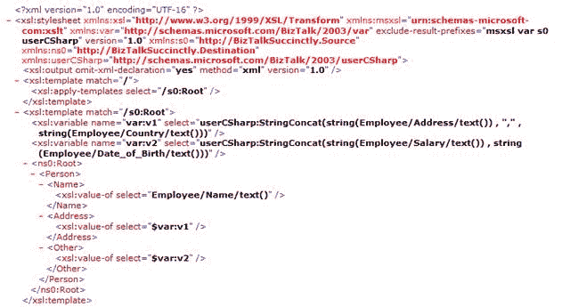

图 42：图 43 XSLT 生成

由于 BizTalk 基于 Microsoft .NET 的.NET 框架，因此您还可以找到用于任何转换或编程逻辑的 C＃代码块。由于我在此映射中仅使用了连接 functoid，因此 XSLT 代码仅具有执行其逻辑的 C＃代码函数。

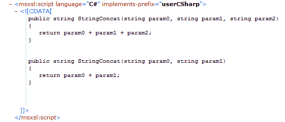

图 43：在 XSLT 中连接 functoid C＃代码

### 调试图

当验证和测试不足以查找错误或评估输出文档时，通常会使用地图编辑器中的调试选项。这样，您可以通过执行映射中定义的所有映射转换来逐步调试 XML 文档的构建。此功能与 C＃/ .NET 应用程序开发中的任何调试非常相似，因此如果您熟悉断点，步入和观察者，这对您来说几乎是一样的。要使用此功能，请在解决方案资源管理器中右键单击您的地图，然后选择 **Debug Map** 选项，如图 44 所示：

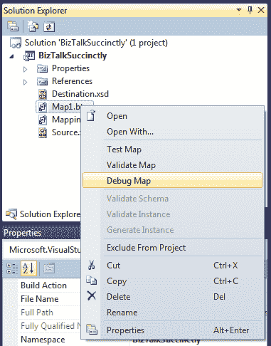

图 44：调试映射

单击“调试映射”选项后，BizTalk 将打开一个新窗口，您可以在其中定义断点并在结果面板中查看步骤执行的结果。图 45 显示了这个调试窗口。

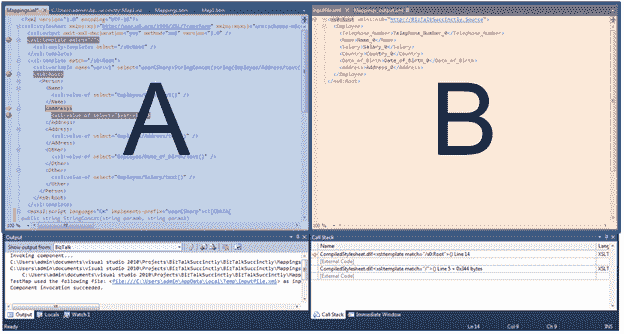

图 45：调试窗口

上图显示了此调试窗口中的两个单独面板。在面板 A 上，基于为地图生成的 XSLT，您可以定义断点（调试器将在下次执行时停止）。在面板 B 上，您将获得生成的 XML 文档的结果面板，该面板是根据您在 XSLT 代码执行中所处的步骤创建的。