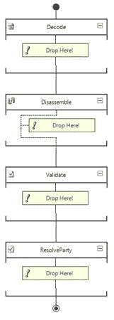
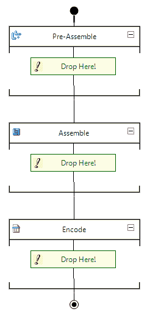
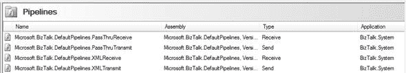
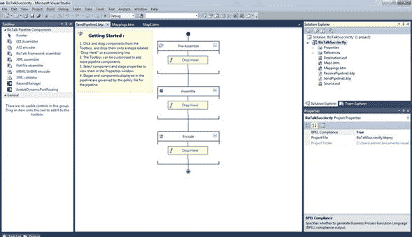
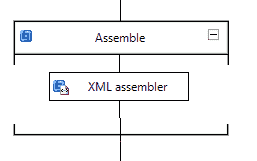

# 第 7 章管道

## 简介

管道是功能强大的 BizTalk 工件，用于标准化 入站和出站 消息，用于接收端口中的预处理或发送端口中的后处理（例如，作为解析）在 MessageBox 中存储消息或向外部系统或目标系统发送消息之前的操作，验证或模式评估。 BizTalk 将管道划分为两种不同的类型：接收管道和发送管道。这两种类型的管道在它们具有的级数方面彼此不同。

接收管道有四个不同的阶段：

1.  **解码** - 该阶段用于执行消息的解码或解密。此阶段用于解码或解密消息的组件。如果传入消息需要从一种格式解码到另一种格式，则应将 MIME / SMIME 解码器流水线组件或自定义解码组件置于此阶段。
2.  **反汇编** - 此阶段将消息反汇编为 XML 格式。开箱即用的 BizTalk 带来了两个反汇编程序：XML 和 Flat File。此阶段用于验证消息格式的组件。管道组件仅处理符合该组件中指定的模式的消息。如果管道接收到其架构未与管道中的任何组件关联的消息，则不会处理该消息。根据提交邮件的适配器，邮件将被挂起或向发件人发出错误。
3.  **验证** - 验证 XML 内容，验证架构一致性。此阶段用于验证消息格式的组件。管道组件仅处理符合该组件中指定的模式的消息。如果管道接收到其架构未与管道中的任何组件关联的消息，则不会处理该消息。根据提交邮件的适配器，邮件将被挂起或向发件人发出错误。
4.  **Resolve Party** - 确定转换后该消息将被发送到哪一方。此阶段是 Party Resolution Pipeline Component 的占位符。

图 46：接收管道

发送管道将与接收管道相反，在发送之前需要进行任何后期转换处理。例如，如果您的贸易伙伴需要平面文件，BizTalk 必须将其内部 XML 消息格式转换为此预期的格式。这些管道包括三个阶段：

1.  **预装配** - 这是一个自定义阶段，因为 BizTalk 没有带任何开箱即用的组件。在消息进入管道之前执行此阶段。此阶段是自定义组件的占位符，应在序列化消息之前对消息执行某些操作。
2.  **汇编** - 将 XML 消息转换为所需的平面文件格式。 BizTalk 为此阶段带来了两个组件，XML 汇编程序和平面文件汇编程序。此阶段的组件负责组合或序列化消息并将其转换为 XML 或从 XML 转换
3.  **编码** - 用于加密消息或添加任何签名。 BizTalk 带来了 MIME / SMIME 编码器在此阶段使用。此阶段用于编码或加密消息的组件。如果需要消息签名，请在此阶段放置 MIME / SMIME 编码器组件或自定义编码组件。

图 47：发送管道

此时你可能会问自己为什么我一直在讨论在这些阶段使用的可用组件。这是因为您作为开发人员负责在需要时开发任何自定义管道，因为 BizTalk 仅带来四个默认管道用于接收和发送管道，这些用于简单方案。它们如下：

PassThruReceive

这是一个旨在应用于接收端口的管道，并且没有组件。您可以在图 47 中看到此管道结构的示例。它允许任何消息进入您的端口而无需任何处理。

XML 接收

这是一个旨在应用于接收端口的 Pipeline，只有 XML 反汇编程序和 Party Resolution 组件。这是一个很好的启动管道，因为它反汇编你的 XML 输入（必须是 XML）并评估哪些合作伙伴将收到它。

PassThruTransmit

这是一个旨在应用于发送端口的管道，而不是其中的组件。您可以在图 48 中看到此 Pipeline 结构的示例。Allsow 将通过您的端口发送任何消息，而不进行任何处理。

XML 传输

这是一个旨在应用于发送端口的 Pipeline，并且只有 XML Assembler。如果您通过端口发送 XML 文档而不进行任何后期处理，请记住 XML 中的 BizTalk 内部消息格式，因此 PassThruTransmit 管道就足够了。

当您开始在 BizTalk 管理员中配置物理端口时，这些管道将可用。

图 48：BizTalk Administrator 中的可用管道

## 自定义管道

开发自定义管道是根据管道类型（接收或发送）将管道编辑器中可用组件添加到可用阶段。要开始创建自己的管道，请在 Visual Studio 中右键单击项目，选择**添加**，**新项**，然后选择**接收管道**或**发送管道**，根据您的发展需要。之后，BizTalk 将向您显示管道编辑器。

图 49：管道编辑器

在工具箱中，您将找到我们已经讨论过的所有组件。要将它们添加到相应的阶段，只需将它们拖放到适当的阶段即可。删除组件后，舞台将如图 50 所示。

图 50：管道阶段