# 第 8 章业务流程

## 简介

业务流程是 BizTalk 项目中的可选组件，因为您可以简单地创建一个解决方案，业务流程响应需要更复杂逻辑或响应业务流程的集成。

以一种非常简单的方式，业务流程以可视方式表示业务流程（形状之间的链接关联，端口表示和一些配置），可以通过 MessageBox 订阅（接收）和发布（发送）消息数据库，比文本语言（C＃，Java）更容易管理和阅读。它简化了创建编译为可执行代码的业务流程的编排模型的过程。或者，我们可以说它是一个 BizTalk 工件，代表业务流程的任意部分。

使用 BizTalk 业务流程的重要好处包括：

*   处理不同类型的交易。
*   更好的错误处理。
*   在异步进程的消息之间定义关联类型。

将编排添加到项目中很容易;只需在 Solution Explorer 中右键单击您的项目，然后选择 **Add** ＆gt; **添加新项目**＆gt; **编排**。 BizTalk 将打开一个 Orchestration Editor，以便您可以开始开发您的业务流程。

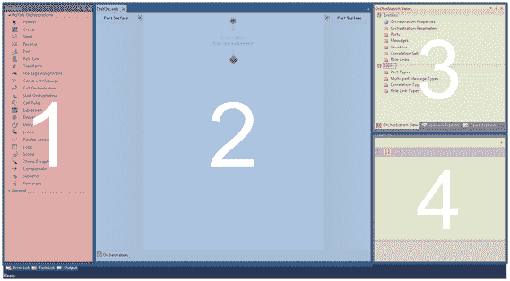

图 51：业务流程编辑器

如图 51 所示，Orchestration Editor 分为四个主要工作区。这些领域是：

工具箱

这是可用于创建业务流程（工作流）业务逻辑的所有工具的地方。将它们拖放到业务流程设计器以使用它们。

业务流程设计师

您可以通过这种方式设计业务流程或业务流程。使用拖放操作，您可以添加构建业务流程所需的工具。这是一个非常有用的组件，因为它允许您查看您的业务流程工作流程。

业务流程概述

您可以在此处创建消息，端口，变量以及在业务流程中使用的任何其他允许对象。

属性窗口

“属性”窗口对于每个基于 Visual Studio 的项目都是通用的;它允许您设置选定的对象属性。

## 可用形状

可用于 Orchestration Editor 的工具箱显示多个形状供您使用以设置业务流程。通过这些形状，您将能够为业务流程添加智能，应用业务规则和条件，以便在运行时消息采用正确的流程。下表显示了工具箱中的可用形状。

表 14：业务流程的可用形状

| 形状 | 名称 | 描述 |
|  | 组 | 使您可以将操作分组到单个可折叠和可扩展的单元中，以方便用户。 |
|  | 发送 | 使您可以从业务流程发送消息。 |
|  | 收到 | 使您可以在业务流程中接收消息。 |
|  | 端口 | 定义消息的传输位置和方式。 |
|  | 角色链接 | 使您可以创建与同一逻辑伙伴通信的端口集合，可能通过不同的传输或端点。 |
|  | 转换 | 变换形状只能出现在构造消息形状中。使您可以将现有消息中的字段映射到新消息中。 |
|  | 消息分配 | 消息分配形状只能出现在构造消息形状中。使您可以分配消息值。 |
|  | 构造消息 | 使您可以构造消息。 |
|  | 呼叫协调 | 使您的业务流程能够同步调用另一个业务流程。 |

表 15：编排的可用形状 II

| 形状 | 名称 | 描述 |
|  | 决定 | 使您可以在业务流程中有条件地分支。 |
|  | 延迟 | 使您能够根据超时间隔在业务流程中构建延迟。 |
|  | 听 | 根据收到的消息或超时期限到期，使业务流程能够有条件地分支。 |
|  | 并行行动 | 使您的业务流程能够彼此独立地执行两个或多个操作。 |
|  | 循环 | 使您的业务流程循环，直到满足条件。 |
|  | 范围 | 为事务和异常处理提供框架。 |
|  | 抛出异常 | 允许您在发生错误时显式抛出异常。 |
|  | 补偿 | 使您可以调用代码来撤消或补偿发生错误时业务流程已执行的操作。 |

表 16：编排的可用工具 III

| 形状 | 名称 | 描述 |
|  | 开始编排 | 使您的业务流程能够异步调用另一个业务流程。 |
|  | 通话规则 | 使您可以配置要在业务流程中执行的业务规则策略。 |
|  | 表达 | 允许您为变量赋值或进行.NET 调用。 |
|  | 暂停 | 暂停业务流程的操作，以便在发生某些错误情况时启用干预。 |
|  | 终止 | 使您能够在出现某些错误情况时立即结束业务流程的操作。 |

## 创建一个简单的业务流程

我们将逐步创建一个简单的业务流程，您可以在其中接收消息，应用预先创建的映射，然后通过发送端口发送它。创建业务流程后，我们将部署项目并使用 BizTalk Server Administrator 设置应用程序。

要创建我们的项目，我们必须从输入和输出模式开始。这些非常简单，因为我们要将包含仅包含三个元素（名字，中间名和姓氏）的记录的模式转换为仅包含一个全名记录的模式。我们的模式如图 52 和 53 所示：

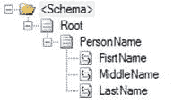

图 52：目标模式

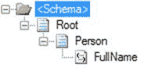

图 53：源模式

我们的地图也很简单。在下面的地图中，您可以看到我们将遍历 XML 文档中的所有人员记录，然后评估名称是否为字符串，如果是，则将其映射到连接 functoid，并将连接 functoid 的结果与我们的目标节点。

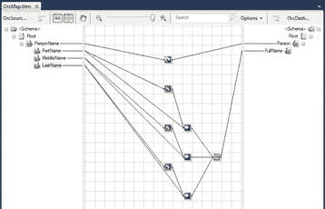

图 54：映射示例

在开发了我们所有的模式和映射之后，我们可以开始我们的编排开发。为此，请在解决方案资源管理器中右键单击您的项目，然后单击**添加新项**。在新项目选择屏幕中，选择 **Orchestration** 。然后 BizTalk 将打开 Orchestration Editor。

编辑器打开后，拖动接收形状并将其拖放到设计器中，如图 55 所示。最佳做法是将形状重命名为将建议其功能和执行的名称。

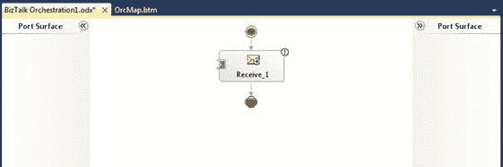

图 55：添加接收形状

接下来，将变换形状添加到设计器，然后添加发送形状。这将允许您设置一个过程，在该过程中接收消息，使用地图转换，并使用发送形状发送到位置。但是，正如您在这个非常简单的示例中所看到的，当您开始向它们添加智能时，编排可能会变得复杂。添加三个形状后，您应该有一个编排，如图 56 所示。

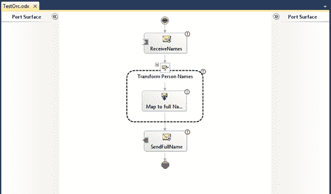

图 56：示例编排

在设计我们的业务流程之后，现在是时候配置它，设置它将使用的消息和端口。让我们从消息开始。正如我们有一个源模式和一个目标模式一样，我们将有两条消息 - 一条基于源模式，另一条基于目标模式。要创建新消息，请右键单击“业务流程视图”面板中的**消息**文件夹，然后选择**新消息**。

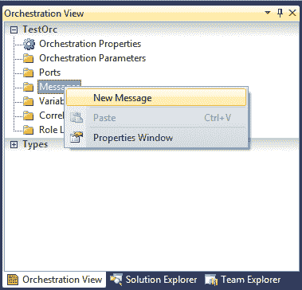

图 57：新消息

BizTalk 将在“属性”窗口中打开“新建消息”属性。为消息命名，并在**消息类型**属性中，选择它应基于的模式，如图 58 所示。

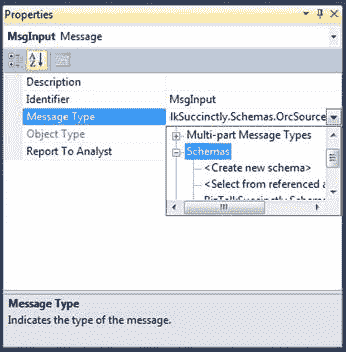

图 58：配置新消息

在这个例子中，我们将创建两个消息：一个名为 MsgInput，用于 Source Schema 消息类型，另一个名为 MsgOutput，用于 Destination Schema 消息类型。完成两者的创建和配置后，您的消息文件夹应该具有如图 59 所示的消息。

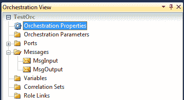

图 59：创建的消息

在创建消息之后，是时候告诉我们接收/发送形状当文档到达其中一个端口时应该期望的消息类型。在这个例子中，我们有一个接收形状和一个发送形状。要从接收形状开始，请在设计器中单击它，然后在“属性”窗口中，将**消息**属性配置为 **MsgInput** 。将**发送形状**属性设置为 **MsgOutput** 。

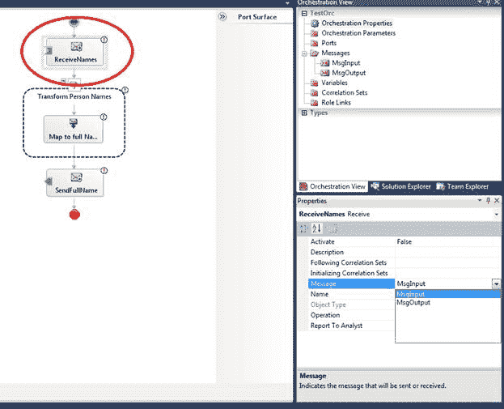

图 60：配置接收/发送形状消息

现在，让我们设置我们的转换形状。双击它，将出现“转换配置”窗口。图 61 显示了此屏幕。

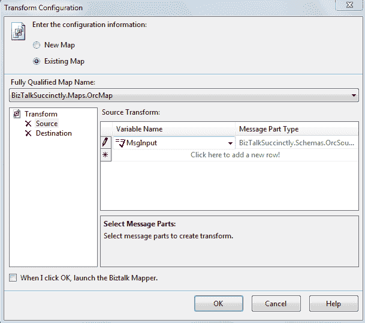

图 61：转换配置

在此配置屏幕中，您将告诉业务流程如何在 MsgInput 到达时对其进行转换。选择屏幕顶部的**现有地图**单选按钮，以便我们可以选择我们创建的地图。接下来，在**完全限定的地图名称**属性中选择我们的地图。最后，我们需要告诉转换形状是输入消息，哪个是输出消息。在相应的**变量名称**组合框中选择我们已创建的消息。

如您所见，我们尚未定义任何接收或发送端口，只定义了形状。请注意，这些只是逻辑端口，而不是物理端口;这些将在稍后的 BizTalk Server Administrator 中配置。

要在业务流程中配置这些逻辑端口，您需要将端口形状拖放到业务流程设计器的**端口表面**通道。有两个端口表面，一个用于左侧的接收端口，另一个用于设计器右侧的发送端口。图 62 显示了接收端口通道。

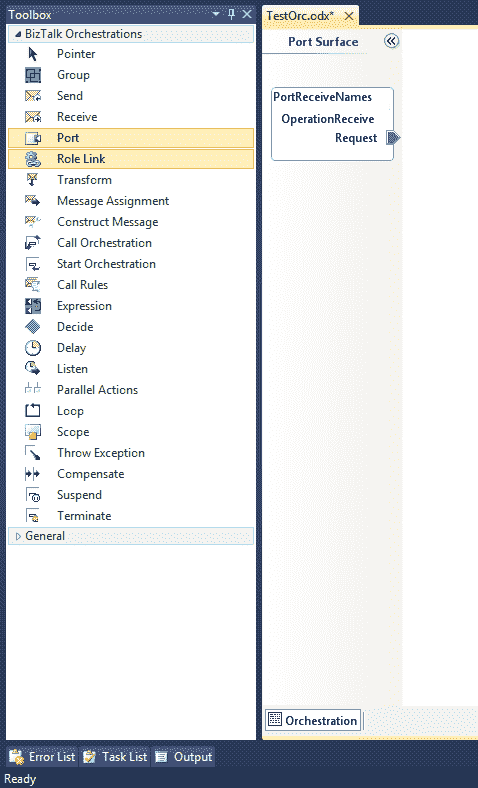

图 62：接收端口通道

现在让我们将第一个端口添加到业务流程 - 接收端口。为此，将其拖放到左侧的端口表面通道。删除后，BizTalk 将启动端口配置向导，如图 63 所示。

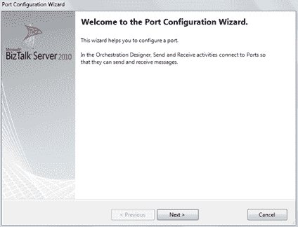

图 63：端口配置向导

此向导的第一步是命名端口。

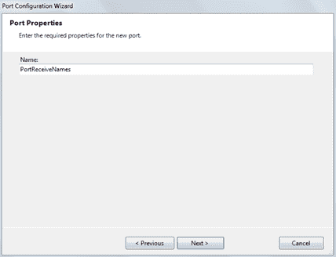

图 64：端口配置向导名称

单击**下一步**后，向导将转到端口配置向导中最重要的一个屏幕，您可以在其中设置端口类型，它定义端口的方向（一个或两个方向） ）和访问限制。图 65 显示了此端口配置屏幕。

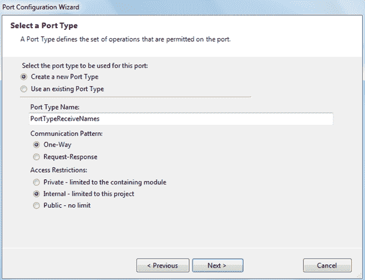

图 65：配置端口类型

第一个配置项允许您在创建新端口类型和使用现有端口类型之间进行选择。对于我们的示例，选择**创建新的端口类型**。

接下来，为您的端口类型命名，并选择**单向**作为通信模式。此单向选项定义您的端口仅接收或发送消息。我们将选择这个，因为我们将转换我们收到的消息，并且只有在发送之后，我们才需要创建两个不同的端口 - 一个接收，另一个发送。但是，如果您希望在没有任何转换的情况下接收和发送给合作伙伴，或者甚至与您发送请求并收到响应的 Web 服务进行通信，则可以使用请求 - 响应模式。

可用的访问限制允许您定义谁可以使用此端口类型：仅此模块（专用），仅允许在此项目（内部）中使用端口类型的工件或每个人（公共）。让我们为我们的示例选择 Internal 选项，因为这将是一个项目端口类型。虽然我们将选择内部选项，但正如您所看到的，有三种类型的访问限制：

*   **Private** - 此端口类型只能在此业务流程中使用
*   **内部** - 此端口类型可用于此项目中的不同业务流程
*   **Public** - 任何项目中的任何人都可以使用此端口类型

定义端口类型后，选择 **Next** 以打开配置向导的端口绑定屏幕。如您所见，您尚未定义这是接收端口还是发送端口;此配置在此屏幕中设置。现在，在我们创建接收端口时，让我们选择**我将始终在**端口通信方向**下的此端口**上接收消息。在**端口绑定**下，选择**稍后指定**，因为我们稍后将使用 BizTalk Administrator 绑定端口。单击**下一步**。

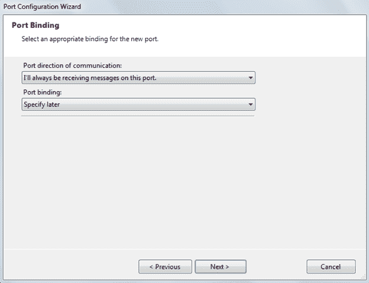

图 66：配置接收端口类型

**端口绑定**是确定消息发送或接收的位置和方式的配置信息。根据其类型，端口绑定可能指的是物理位置，管道或其他业务流程。接收消息有三种类型的端口绑定：

*   **现在指定** - 允许您在设计时指定要使用的管道以及要与之通信的位置。它也被称为“设计时绑定”。
*   **稍后指定** - 如果您没有指定物理位置所需的所有信息，则可以在业务流程设计器中选择“稍后指定端口绑定”选项，并且只需指定端口类型即可描述了端口。也称为“部署时绑定”。
*   **Direct** - 您的业务流程可以使用直接绑定直接与另一个业务流程进行通信。在这种情况下，消息由引擎在内部处理，并且不会发生消息的外部传输。

最后一个端口绑定类型，仅限于发送消息：

*   **动态** - 如果直到运行时才知道通信的位置，则可以对发送端口使用动态绑定。例如，该位置可以根据传入消息的属性来确定。

向导完成后，BizTalk 将带您回到编排设计器。现在是时候将最近创建的接收端口链接到我们的接收形状。这是告诉业务流程这些接收消息将从此端口和端口类型到达的方式。

图 67 显示了业务流程应该如何看待这一点：

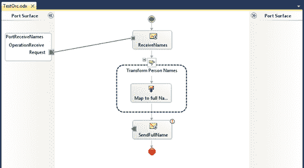

图 67：将端口链接到接收形状

现在，为发送端口重复此过程。将端口形状拖放到设计器右侧的端口表面，并使用端口创建向导配置端口，注意您定义端口是接收端口还是发送端口的步骤。图 68 显示了端口绑定步骤。

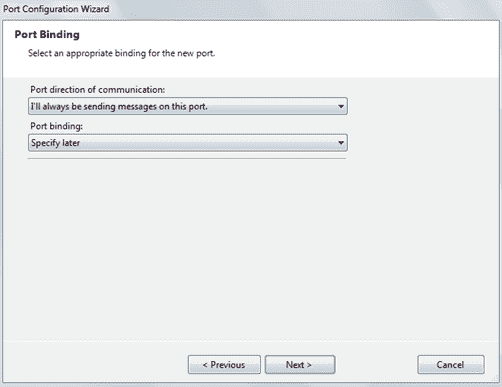

图 68：配置发送端口

要完成业务流程的设计，请将最近创建的发送端口链接到发送形状，您的业务流程应如图 69 所示。

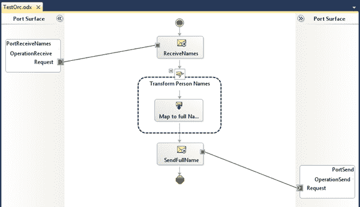

图 69：最终编排示例

尽管它可能看起来完整，但在编译和部署应用程序到 BizTalk Server 之前，仍需要进行多项配置。第一个必需步骤是设置一个活动的接收形状，因为 BizTalk 要求至少有一个接收形状正在侦听消息到达我们的编排。这是 BizTalk Server 新手的常见错误。当您尝试编译没有活动接收形状的应用程序时，图 70 显示了错误消息。

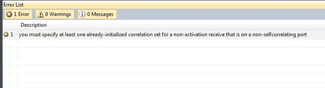

图 70：没有活动接收形状时出错

要避免此问题，应选择要激活的接收形状，并在接收形状的属性窗口中，将**激活**属性设置为 **True** 。

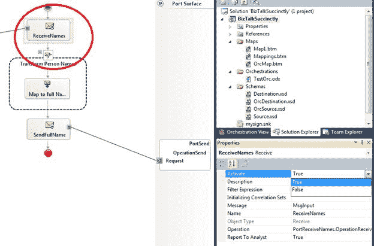

图 71：激活接收形状

现在您的应用程序已准备好编译并部署到 BizTalk Server。下一章将向您展示如何。