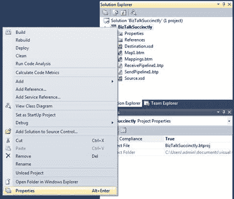
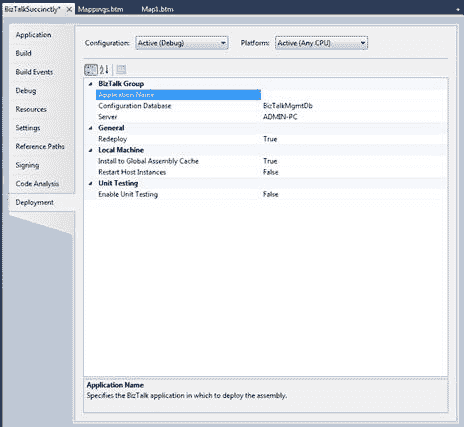
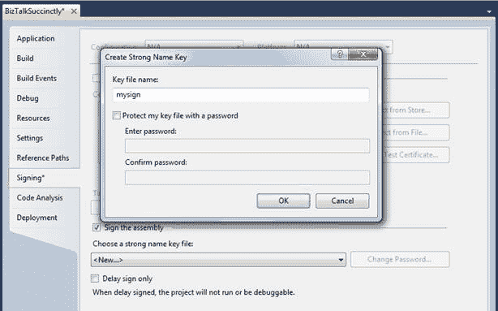
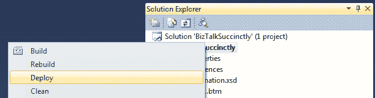
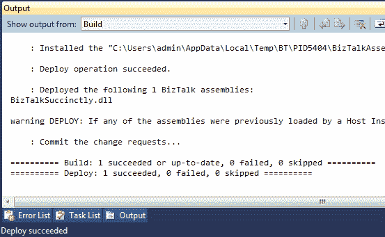
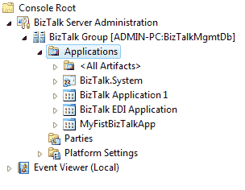

# 第 9 章使用 Visual Studio 部署到服务器

到目前为止，我们一直在讨论开发，创建模式并使用地图转换它们，以及使用业务流程为业务流程构建工作流，但我们的项目尚未在生产中工作。为此，我们需要将其部署到服务器，以便 BizTalk 可以创建正在运行的应用程序，以便我们可以为我们的应用程序创建所有物理端口。

正如我已经提到的，在 Visual Studio 中构建项目和业务流程中的事件定义端口是一种逻辑操作，因为您可以将同一项目用于多个公司，并且只需要将其部署到其服务器并配置物理工件。应用程序。

## 部署

部署应用程序是一个非常快速和简单的步骤。只需在解决方案资源管理器中右键单击您的项目，然后选择**属性**选项以配置应用程序名称，部署数据库和要部署到的服务器。

图 72：项目属性

当“属性”窗口打开时，转到**部署**选项卡并为应用程序命名（如果未设置，则将其部署到应用程序 1），并确保根据应用程序配置配置数据库和服务器您的需求。如果您使用安装了默认设置的 BizTalk Developer，您应该会看到如图 73 所示的内容：

图 73：配置应用程序名称

您需要配置的第二个设置是项目的签名。 BizTalk 对 DLL 使用强名称，因此需要强名称密钥文件。如果有，请转到**签名**选项卡并使用现有选项卡，或者通过选择**签名程序集**复选框和**新**选项创建一个简单的选项卡。列表框。

由于需要在全局程序集缓存（GAC）中安装或注册所有 BizTalk 程序集，因此需要使用强名称密钥对其进行签名。在图 74 中可以看到一个例子。

图 74：签署项目

命名应用程序并设置签名后，保存更改，在解决方案资源管理器中右键单击项目，然后选择 **Deploy** 。请确保您使用提升的权限运行 Visual Studio。

图 75：部署项目

部署完成后，输出窗口将显示成功消息，如果出现任何错误，则会显示错误消息。在我们的例子中，我们有一条成功的消息，如图 76 所示。

图 76：成功部署

您现在可以打开 BizTalk Server Administrator，您将在应用程序列表中看到您的应用程序。接下来的步骤是配置和测试应用程序。

图 77：BTS 管理员中的应用程序