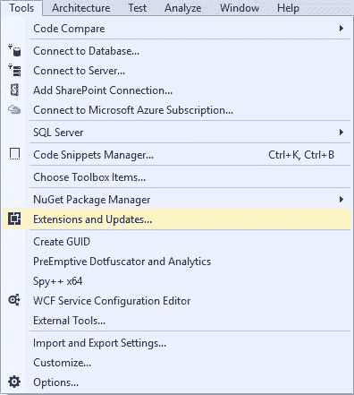
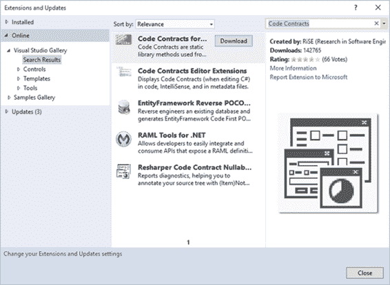
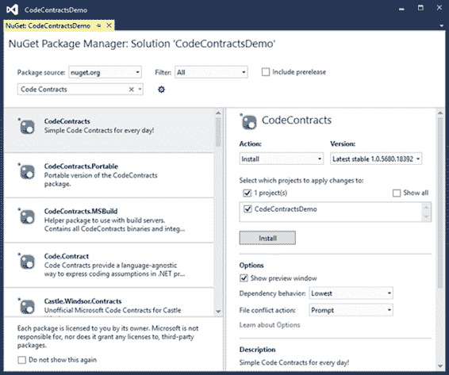
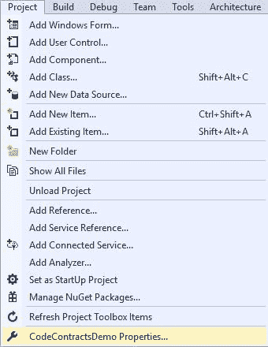
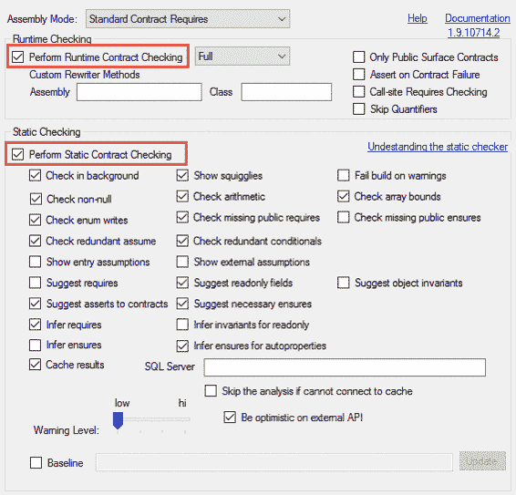
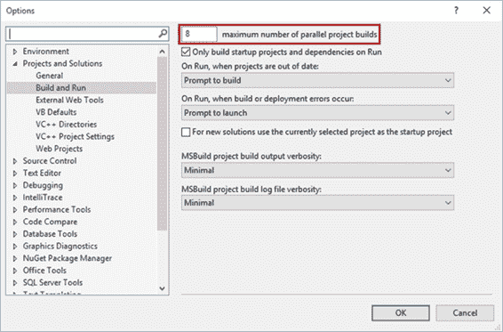

# 第 1 章入门

## 什么是代码合同？

许多开发人员可能知道代码契约是什么，但他们并不了解它们提供的好处或如何实现它们。不过，我必须提到，我已经找到了对代码合同的态度，并且它们在开发中的使用有些分歧。一方面有一群坚定的支持者，而在另一方面，有一群反对者。然而，在中间，是一群不熟悉代码合同及其用途的开发人员。在这里，我怀疑你们很多人会发现自己。在使用 Code Contracts 一段时间之后，我希望你们中的许多人自然会迁移到这种爱恨交织频谱的一端。

代码合约由微软的 RiSE（软件工程研究）创建，已经存在多年。事实上， [RiSE 网站](http://research.microsoft.com/en-us/projects/contracts/releasenotes.aspx)的发布说明始于 2009 年 2 月 23 日的 1.1.20215 发布。代码合同多年来经历了各种修订，现在已经找到了一个新家 [GitHub](https://github.com/Microsoft/CodeContracts) ，由微软开源。

在继续之前，让我们来定义代码合约的确切含义。 Code Contracts 的目标是提供一种与语言无关的方式来传达.NET 应用程序中的代码假设。让我们使用您和第三方（例如银行）之间的实际合同的类比。这是双方之间达成的协议，以确保双方以特定方式行事。这是代码合同的核心。我们在代码中假定某些逻辑，并且我们在该代码中定义合同以维持这些假设。这些假设可以采用前置条件，后置条件和状态不变量的形式。如果这些合同条件在任何时候被破坏，我们就会知道。这在团队合作时特别有价值。

## 下载并安装

在本书的其余部分，我将引用 Visual Studio Enterprise 2015（.NET Framework 4.6）和 Code Contracts 版本 1.9.10714.2。 Code Contracts 也适用于 Visual Studio 2015 Professional，但遗憾的是，在撰写本文时，Code Contracts 不适用于免费的 Visual Studio 2015 社区版。在 Visual Studio 中开始使用代码约定非常简单。从 Visual Studio 的**工具**菜单中，单击**扩展和更新**。



图 1：扩展和更新菜单项

这将打开**扩展和更新**窗口（图 2），您可以从中搜索 Visual Studio 库。顺便提一下，您还可以通过 NuGet 在项目中包含代码约定（稍后会详细介绍）。

在屏幕右侧的搜索框中，输入**代码合约**，并确保在树形视图中选择了**在线**部分。返回搜索结果后，代码合同应该是最重要的结果之一。从这里可以轻松安装代码合同。只需单击**下载**按钮，即可下载可运行的.msi 安装程序以安装代码约定。



图 2：扩展和更新

### 的 NuGet

NuGet 包管理器还可用于在您的解决方案中下载和包含代码约定。您可以使用 NuGet 包管理器（图 3）搜索代码约定，也可以使用工具&gt;中的包管理器控制台。 NuGet 包管理器选项，用于运行以下命令以安装代码约定。

```
PM> Install-Package CodeContracts

```

您还可以在 NuGet 上找到 Code Contracts 包的便携版（用于 Windows Mobile 应用程序）。您使用哪种方法安装代码合同并不重要;这只是你喜欢哪种方法的问题。



图 3：NuGet 包管理器

## Visual Studio 集成

您需要为“属性”页面中的“代码约定”项重新启动 Visual Studio 才能显示。通过右键单击项目并从上下文菜单中选择 **Properties** ，可以找到 Code Contracts 集成。您也可以通过从 Visual Studio 工具栏中选择 **Project** 来找到代码合约集成（确保您已在解决方案资源管理器中选择了您的项目），然后单击 **ProjectName 属性**菜单项（图 4）。

我调用了我的 Visual Studio 项目 **CodeContractsDemo** ，因此 Visual Studio 中 **Projects** 菜单中的项目将被调用 **CodeContractsDemo Properties** 。将为您的项目打开熟悉的“属性”页面，在“属性”页面左侧列表的底部，您将看到名为**代码合同**的新属性窗格。

单击此按钮将显示设置的大杂烩供您选择。不要让设置数量吓到你;我们将在下一节中介绍这些内容。只知道许多设置是默认的，你可以根据需要保留它们。



图 4：项目属性

### 代码合约属性页面

Code Contracts 属性最初会向您显示许多选项和设置。代码合同下的属性分为三组：运行时检查，静态检查和合同参考组装。

通过选择**执行运行时合同检查**或**执行静态合同检查**来启用代码合同。

至少，您需要确保选择其中一个选项，以便在项目中启用代码约定。如果不选择这些选项中的任何一个，则不会在项目中启用代码约定，并且您将无法从它们添加到系统中的值中受益。

运行时契约检查，顾名思义，将在运行时发挥其魔力。然而，静态合同检查是完全不同的动物。它允许代码约定在您键入代码或构建项目时分析代码。这就是代码合同变得有趣并为我增加最大价值的地方。



图 5：代码合同属性页面

### 静态检查

如果启用静态检查，建议在“属性”页面中选择**检查后台**选项。这是因为分析可能需要一些时间才能完成。另一个可取的选择是在 Visual Studio 中选择并行构建选项。从 Visual Studio 的**工具**菜单中，选择**选项**。在 Options 屏幕左侧的树形视图中（图 6），展开 **Projects and Solutions** 节点。您会注意到一个名为 **Build and Run** 的节点。选择该选项，您将看到启用并行构建的选项。

任何大于 1 的值都将启用 Visual Studio 中的并行构建选项。我机器上的默认值是 8 。在此文本框中输入值 1 将有效地关闭 Visual Studio 中的并行构建。通过在 Visual Studio 中启用并行构建，您可以启用代码约定来并行分析多个项目。根据 RiSE，Visual Studio 扩展是线程安全的。 “代码约定”属性页中还有许多其他选项，但您现在可以开始使用代码约定，而无需进一步配置这些设置。



图 6：Visual Studio 并行构建选项