代码约定还包含在代码中使用的各种其他方法。我们将在以下部分中查看这些示例。

### 合同断言和假设

有些人可能想知道在代码中使用 Debug.Assert 和 Contract.Assert 之间有什么区别。 Debug.Assert 仅在代码在 **Debug** 模式下编译时执行。但是， Contract.Assert 方法是在 **Debug** 或 **Release** 模式下调试代码时执行的。

代码契约中的断言方法也很容易与 Contract.Requires 方法混淆。正如我们在之前的代码清单中看到的那样， Requires 方法是一个前提条件，必须始终在特定方法的开头调用。这是因为 Contract.Requires 包含有关其所在方法的信息。 Contract.Assert 和 Contract.Assume ，另一方面，特定于在合同下的方法中的某个时间点的某些代码。

那么我们何时使用哪种方法？使用 Assert ，静态检查器运行并将尝试证明该特定代码行的断言。 假设将让静态检查器简单地假设无论检查是否需要证明，都是如此。那为什么两者都有？考虑下一个代码清单。

```
public void CompleteBinPreparation(int quantityRequired)
{        
    QuantityRequired = quantityRequired;
    int available = BinQtyAvailable();
    Contract.Assert(QuantityRequired <= available, "Quantity required exceeds available bin quantity");        
}

public int BinQtyAvailable()
{
    MaxBinQuantity = 75;
    CurrentBinQuantity = 50;
    int QtyAvailable = MaxBinQuantity - CurrentBinQuantity;
    return QtyAvailable;
}

```

代码 10：断言静态检查

代码清单 10 中的代码检查包含零件的 Bin 是否有足够的空间来容纳所需的数量。使用 Assert 方法，我们让静态检查器检查 QuantityRequired 变量的值。如果我们必须为 QuantityRequired 传递 77 的值，我们会看到静态检查器发出警告并使构建失败（记住，我们打开了 **Fail build on 代码合同属性页面中的警告**）。

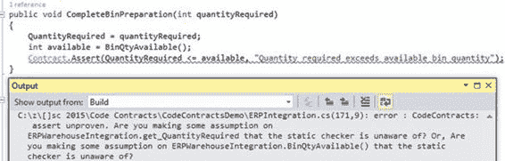

图 13：断言失败

如果我们必须修改代码清单 10 中的代码以包含假设，那么输出确实会完全不同。请考虑以下清单中的代码。

```
public void CompleteBinPreparation(int quantityRequired)
{        
    QuantityRequired = quantityRequired;
    int available = BinQtyAvailable();
    Contract.Assume(QuantityRequired <= available, "Quantity required exceeds available bin quantity");        
}

public int BinQtyAvailable()
{
    MaxBinQuantity = 75;
    CurrentBinQuantity = 50;
    int QtyAvailable = MaxBinQuantity - CurrentBinQuantity;
    return QtyAvailable;
}

```

代码 11：假设静态检查

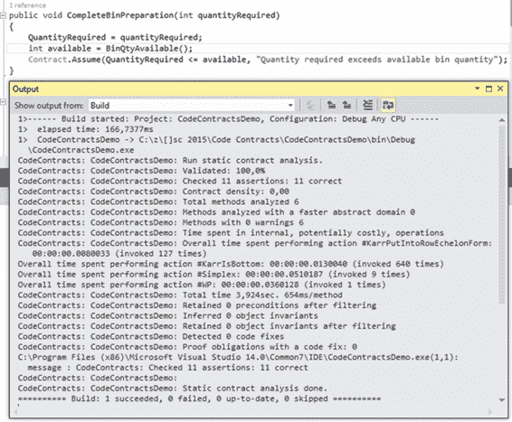

图 14：假设通过

当我们使用 Contract.Assume 时，我们告诉静态检查器它需要假设合同条件为真。我们为什么要这样做？好吧，代码清单 11 中的前面代码调用了一个我们可以控制的方法。我们可以在逻辑上将 Contract.Ensures 添加到 BinQtyAvailable 方法，以保证它符合代码合同。但是，请考虑一下我们在另一个外部库中调用方法。我们无法控制该 DLL 中包含的代码，开发人员也没有实现代码合同。但是，它们确保返回的值始终考虑所需的数量并返回具有足够数量的箱。因此，我们可以告诉静态检查器假设此合同条件通过。

请注意，前面关于断言和假设的示例仅适用于静态检查器。因为我们有**执行运行时间合同检查**并设置为 **Full** ，如果检查的条件失败， Contract.Assume 在运行时仍会失败（外部库为可用的 bin 数量返回无效值。

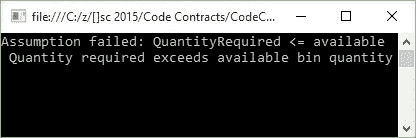

图 15：假设在运行时失败

断言和假设在处理外部代码时确保了一个非常强大的组合，并确保以您需要的方式返回并有效。

最后，您可以在代码约定属性页面中更改**警告级别**。如果您希望在“输出”窗口中看到某些警告但不是，请务必将**警告级别**更改为高。

### Contract.ForAll

在继续解释 Contract.ForAll 逻辑之前，我必须指出它目前无法在 Visual Studio 2015 中静态验证。问题 177 已在 GitHub 上记录此问题，并且有一个解决方法在线程中提供。要了解更多信息，请转到 [github.com/Microsoft/CodeContracts/issues/177](https://github.com/Microsoft/CodeContracts/issues/177) 。

现在，我需要禁用静态检查来说明 Contract.ForAll 方法的使用。要禁用静态检查，请在 Visual Studio 的解决方案资源管理器中右键单击项目，然后选择**属性**。 Code Contracts 属性页面将打开。单击**代码合同**选项卡。

这是我们之前访问过的页面。在**静态检查**组下，清除**执行静态合同检查**选项。

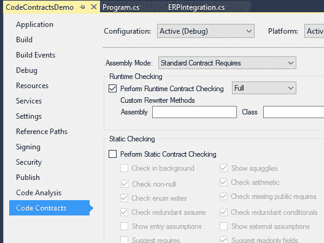

图 16：禁用静态合同检查

完成此操作后，您应该能够让代码合同执行所需的操作并验证您指定的条件。

有了这个，让我们修改我们的 CompleteBinPreparation 方法。业务规则要求在处理 bin 之前，数量需要大于 5.让我们通过要求 binQuantities 数组永远不为空来构建此契约。如前所述，通过添加 Contract.Requires 方法可以轻松完成。

接下来，我们需要添加 Contract.Assert 以包含 Contract.ForAll 方法。然后，这将使用 lambda 表达式检查所有数量是否大于 5.实现显示在以下代码清单中。

```
public void CompleteBinPreparation(int[] binQuantities)
{
    Contract.Requires(binQuantities != null);
    Contract.Assert(Contract.ForAll(binQuantities, x => x > 5),
        "Some Bins contain invalid quantities");

    // Process bin quantities
    BinCount = binQuantities.Length;
}

```

代码 12：Contract.ForAll 示例

如果我们的合同下的方法通过验证，它将只返回数组中的 bin 计数。例如，如果数组包含无效的 bin 数量，则会显示异常。

在我们的调用代码中，我们现在将添加一个包含一些无效 bin 数量的数组。我们可以看到 4 和 3 的数量小于 5 ，因此无效。

```
static void Main(string[] args)
{
    try
    {
        int[] iBins = { 4, 3, 61, 51, 88, 55 };
        ERPWarehouseIntegration oWhi = new ERPWarehouseIntegration();
        oWhi.CompleteBinPreparation(iBins);

        Console.Write("Bin Count: " + oWhi.BinCount);
        Console.ReadLine();
    }
    catch (Exception ex)
    {
        Console.Write(ex.Message);
        Console.ReadLine();
    }
}

```

代码 13：调用 Contract.ForAll 方法

如果我们运行代码，控制台应用程序将抛出异​​常并向用户显示错误消息。

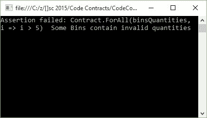

图 17：无效的 Bin 数量

现在让我们修改我们的调用代码，使其只包含 iBins 数组中的有效 bin 数量。您将看到我已将 4 和 3 的无效 bin 数量分别更改为 32 和 19 。

如果再次运行该应用程序，则会导致代码合同通过验证并在控制台应用程序中显示 bin 计数。

```
static void Main(string[] args)
{
    try
    {
        int[] iBins = { 32, 19, 61, 51, 88, 55 };
        ERPWarehouseIntegration oWhi = new ERPWarehouseIntegration();
        oWhi.CompleteBinPreparation(iBins);

        Console.Write("Bin Count: " + oWhi.BinCount);
        Console.ReadLine();
    }
    catch (Exception ex)
    {
        Console.Write(ex.Message);
        Console.ReadLine();
    }
}

```

代码 14：修改的调用代码

控制台应用程序现在显示有效容器的计数，这意味着代码合同通过了验证。

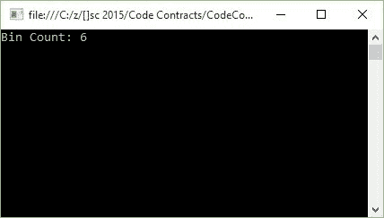

图 18：有效的 Bin 数量

正如您所看到的， Contract.ForAll 方法提供了一种很棒的方法来检查条目的值数组，如果这些条目违反业务规则，则可能导致执行路径中的问题。 Contract.ForAll 方法也可以与 List 集合或任何 IEnumerable 集合一起使用。

### Contract.Exists

暂时，让我们假设需要处理的箱号进入一批处理过的箱子 30 天。系统不知道 bin 何时进入处理阶段，因此需要在处理之前检查每个 bin 编号以确保它不存在于进程队列中。 Code Contracts 也提供了一个很好的解决方案。

创建一个名为 ProcessBin 的方法，并添加 Contract.Requires 方法以检查传递给该方法的参数是否为空。然后添加 Contract.Assert 方法以包含 Contract.Exists 方法。这将检查已处理的队列 ProcessedBins 是否包含我们要处理的 bin。以下代码清单说明了此实现。

```
public void ProcessBin(string bin)
{
    Contract.Requires(bin != null);
    Contract.Assert(!Contract.Exists(ProcessedBins(),
        x => string.Compare(x, bin, true) == 0),
        "Bin " + bin + " already processed");

    // Process bin and add to ProcessedBins collection
}

private List<string> ProcessedBins()
{
    List<string> oBinsProcessed = new List<string>();
    oBinsProcessed.Add("A12");
    oBinsProcessed.Add("CD25");
    oBinsProcessed.Add("ZX4R");
    oBinsProcessed.Add("A11");

    return oBinsProcessed;
}

```

代码 15：Contract.Exists 实现

在调用代码中，我们将使用硬编码值来检查 bin 编号。在合同下调用方法并将其传递给已在进程队列中的 bin。

```
static void Main(string[] args)
{
    try
    {
        string BinToProcess = "ZX4R";
        ERPWarehouseIntegration oWhi = new ERPWarehouseIntegration();
        oWhi.ProcessBin(BinToProcess);

        Console.Write("Bin " + BinToProcess + " processed");
        Console.ReadLine();
    }
    catch (Exception ex)
    {
        Console.Write(ex.Message);
        Console.ReadLine();
    }
}

```

代码 16：调用 Contract.Exists 方法

代码合约验证 bin 是否存在于进程队列中，并在控制台应用程序中向用户显示输出。

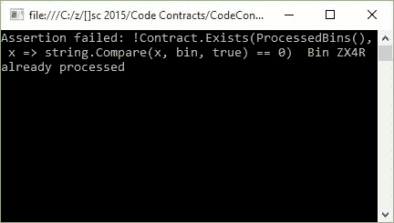

图 19：进程队列中存在的容器

回到我们的调用代码，让我们将 bin 编号更改为进程队列中不存在的 bin 编号。

```
static void Main(string[] args)
{
    try
    {
        string BinToProcess = "SSX4R";
        ERPWarehouseIntegration oWhi = new ERPWarehouseIntegration();
        oWhi.ProcessBin(BinToProcess);

        Console.Write("Bin " + BinToProcess + " processed");
        Console.ReadLine();
    }
    catch (Exception ex)
    {
        Console.Write(ex.Message);
        Console.ReadLine();
    }
}

```

代码 17：修改的调用代码

如果我们第二次运行应用程序，则将处理 bin，并在控制台应用程序中向用户显示确认消息。


图 20：进程队列中不存在 Bin

Contract.Exists 允许开发人员根据您设计的系统中的某些业务规则轻松验证项目是否存在。

### Contract.OldValue＆LT;＆GT;

几年前，我参与了一家钢铁制造商的项目。当通过将钢板切割成特定尺寸生产切口时，他们有一个非常具体的废料处理过程。我工作的另一个项目有一个特定的废料工作流程来处理。废料是许多公司非常重视的事情，他们需要仔细管理这个过程。

对于代码合同的下一个示例，我将使用废料流程来说明 Contract.OldValue＆lt;＆gt;的使用。 方法。不过，我必须提到 Contract.OldValue＆lt;＆gt; 方法只能用于 Ensures 合同的条件表达式。

让我们假设钢铁制造商需要尽量减少切割过程产生的切割量。为此，他们使用计算来计算要切割的钢的体积，并根据切削系数计算可以使用的钢的数量。完美切割意味着如果钢的体积为 10 m &lt;sup class="calibre37"&gt;3&lt;/sup&gt; ，那么所得到的钢材切割量也将等于 10 m &lt;sup class="calibre37"&gt;3&lt;/sup&gt; 。因此，所有的钢都被消耗掉，导致零切。

不完美的切割将导致小于原始钢的体积，这意味着用户将需要改变切割系数，直到它们能够确保接近完美的切割。在没有详细说明阈值和限制的情况下，我们假设如果返回除完美切割之外的任何其他内容，则切割过程不会被批准。

请考虑以下代码清单。

```
public void CutSteelNoScrap(int volumeSteel, int factor)
{
    Contract.Ensures(volumeSteel != 0, "The volume of steel can't be zero");
    Contract.Ensures(Contract.OldValue<int>(volumeSteel)
        == CutSteel(volumeSteel, factor) + volumeSteel,
    "The factor used will result in scrap. Please modify the cutting factor.");
    // Process steel to cut
}

private int CutSteel(int volumeToCut, int factor)
{
    return volumeToCut % factor;
}

```

代码 18：Contract.OldValue＆lt;＆gt;履行

正如您所看到的，我只是使用模数运算符来模拟基于不正确因子的切割的存在。模数运算符只返回除法的余数，并由％运算符表示。因此，以下情况属实：

19％5 = 4

12％4 = 0

这很粗糙，但它有效地说明了我需要做的事情。在调用代码中，我们调用 CutSteelNoScrap 方法来执行计算，并告诉我们使用的因子是否不正确并生成废品。

```
static void Main(string[] args)
{
    try
    {
        int steelVolume = 4;
        int cutFactor = 3;
        ERPWarehouseIntegration oWhi = new ERPWarehouseIntegration();
        oWhi.CutSteelNoScrap(steelVolume, cutFactor);

        Console.Write("Steel fully consumed by cutting process");
        Console.ReadLine();
    }
    catch (Exception ex)
    {
        Console.Write(ex.Message);
        Console.ReadLine();
    }
}

```

代码 19：调用代码

Contract.OldValue 方法将检查变量 volumeSteel 的值，并查看 CutSteel 方法返回的新值是否为零。如果它为零，则 volumeSteel 和 CutSteel 的总和将等于零。因此，我们知道这一因素导致没有减产。

但是，如果 volumeSteel 和 CutSteel 的总和不等于 volumeSteel ，则该因子导致切割过程产生切割。运行控制台应用程序，钢卷体积值为 4 m &lt;sup class="calibre37"&gt;3&lt;/sup&gt; ，因子为 3 会导致切割。

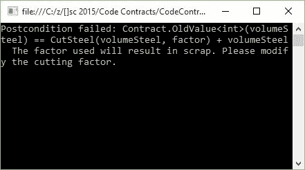

图 21：Contract.OldValue＆lt;＆gt;失败

继续并修改先前的代码清单，以便将因子更改为在模数计算中使用时不会产生余数的值。将其更改为 **2** 的值并再次运行控制台应用程序。

```
static void Main(string[] args)
{
    try
    {
        int steelVolume = 4;
        int cutFactor = 2;
        ERPWarehouseIntegration oWhi = new ERPWarehouseIntegration();
        oWhi.CutSteelNoScrap(steelVolume, cutFactor);

        Console.Write("Steel fully consumed by cutting process");
        Console.ReadLine();
    }
    catch (Exception ex)
    {
        Console.Write(ex.Message);
        Console.ReadLine();
    }
}

```

代码 20：修改的调用代码

控制台应用程序现在返回给定系数和钢量的完美切割。


图 22：Contract.OldValue＆lt;＆gt;通行证

虽然前面的代码清单是一种非常简单的方式来说明 Contract.OldValue＆lt;＆gt;的使用。 方法，它可以扩展，以验证方法符合某些业务规则的更多好处。

### Contract.Result＆LT;＆GT;

谨慎地注意到 Contract.Result＆lt;＆gt; 方法不能用于具有 void 返回类型的方法。为了说明此合同的使用，我们可以重复使用以前的代码清单并稍微修改它们。

```
public int ProductionVolumePerBin(int binVolume, int factor)
{
    Contract.Ensures(Contract.Result<int>() == binVolume,
        "The factor used will result in scrap. Please modify the cutting factor.");

    int remainder = CutSteel(binVolume, factor);
    return binVolume - remainder;
}

private int CutSteel(int volumeToCut, int factor)
{
    return volumeToCut % factor;
}

```

代码 21：Contract.Result＆lt;＆gt;

我们可以看到前面的代码清单告诉调用方法合同下的方法将导致切割量总是等于 bin 容量。这意味着所有钢材都经过完美切割，并且没有使用特定因素进行切割。

调用代码也没有太大差别。

```
static void Main(string[] args)
{
    try
    {
        int binVolume = 4;
        int cutFactor = 2;
        ERPWarehouseIntegration oWhi = new ERPWarehouseIntegration();
        oWhi.ProductionVolumePerBin(binVolume, cutFactor);

        Console.Write("Steel fully consumed by cutting process");
        Console.ReadLine();
    }
    catch (Exception ex)
    {
        Console.Write(ex.Message);
        Console.ReadLine();
    }
}

```

代码 22：调用代码

如果我们运行前面的代码 2 因子和 4 的音量，我们将获得完美的切割。


图 23：完美切割中的合同结果

但是，如果我们不得不再次将调用代码修改为不满足 Contract.Result＆lt;＆gt;的因素。 条件，以下内容将输出到控制台应用程序。

```
static void Main(string[] args)
{
    try
    {
        int binVolume = 9;
        int cutFactor = 2;
        ERPWarehouseIntegration oWhi = new ERPWarehouseIntegration();
        oWhi.ProductionVolumePerBin(binVolume, cutFactor);

        Console.Write("Steel fully consumed by cutting process");
        Console.ReadLine();
    }
    catch (Exception ex)
    {
        Console.Write(ex.Message);
        Console.ReadLine();
    }
}

```

代码 23：修改的调用代码

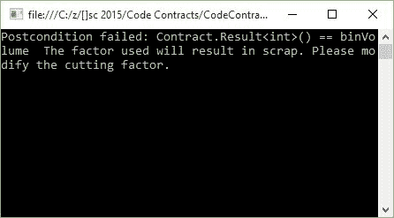

图 24：Contract.Result＆lt;＆gt;失败

代码合同允许我们准确定义需要验证的内容，以便特定方法传递合同条件。能够在单个方法中添加多个契约方法使您的代码更加健壮且无错误。

### Contract.ValueAtReturn＆LT;＆GT;

有时您可能需要在方法中使用 out 参数。代码合同也可以在这里轻松应用。让我们使用 Contract.Result＆lt;＆gt;的略微修改的例子。 来说明这个概念。

与钢铁制造代码演示保持一致，假设我们需要确保在给定特定体积的钢材的情况下所有料箱都满载。我们的 out 参数是 bin over count。如果该值大于零，则表示钢材量超过了料箱可容纳的最大体积。为了实现这个逻辑，我将再次使用模数运算符。

```
public void EnsureAllBinsFilled(out int binOverCount, int binVol, int steelVol)
{
    Contract.Ensures(Contract.ValueAtReturn<int>(out binOverCount) == 0,
        "The steel volume exceeds the bin volume");

    binOverCount = steelVol % binVol;
}

```

代码 24：Contract.ValueAtReturn

合同下的方法需要指定 out 参数 binOverCount 永远不会大于零。为实现这一目标，我们需要使用 Contract.Ensures 方法以及 Contract.ValueAtReturn＆lt;＆gt; 方法。

在代码清单 24 中，您会注意到 Contract.ValueAtReturn＆lt;＆gt; 引用 out 参数 binOverCount 并指定它必须始终等于零。

要实现该方法，请参阅以下代码示例。

```
static void Main(string[] args)
{
    try
    {
        int steelVolume = 10;
        int binVolume = 3;
        int binWastedSpace = 0; // This must always equal zero
        ERPWarehouseIntegration oWhi = new ERPWarehouseIntegration();
        oWhi.EnsureAllBinsFilled(out binWastedSpace, binVolume, steelVolume);

        Console.Write("All bins filled");
        Console.ReadLine();
    }
    catch (Exception ex)
    {
        Console.Write(ex.Message);
        Console.ReadLine();
    }
}

```

代码 25：调用代码

对于通过验证的合同下的方法， binWastedSpace 的值必须保持等于零。如果我们运行此代码，我们会看到为 steelVolume 和 binVolume 提供的值会导致应用程序抛出异常。

该例外通知用户钢量超过为操作提供的箱的最大容积。

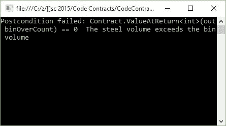

图 25：Contract.ValueAtReturn＆lt;＆gt;失败

如果我们必须修改调用代码以提供参数 steelVolume 和 binVolume 的有效值，我们的应用程序将通过验证。

```
static void Main(string[] args)
{
    try
    {
        int steelVolume = 10;
        int binVolume = 2;
        int binWastedSpace = 0; // This must always equal zero
        ERPWarehouseIntegration oWhi = new ERPWarehouseIntegration();
    oWhi.EnsureAllBinsFilled(out binWastedSpace, binVolume, steelVolume);

        Console.Write("All bins filled");
        Console.ReadLine();
    }
    catch (Exception ex)
    {
        Console.Write(ex.Message);
        Console.ReadLine();
    }
}

```

代码 26：修改的调用代码

我所做的就是将 bin volume 的值更改为 2 。运行应用程序可以成功验证 bin 逻辑。

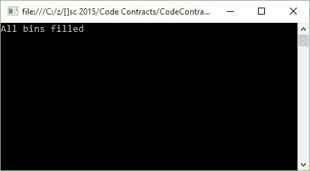

图 26：Contract.ValueAtReturn＆lt;＆gt;成功

无需编写大量代码逻辑来验证传入和返回值，我们以代码契约的形式提供了大量验证代码。