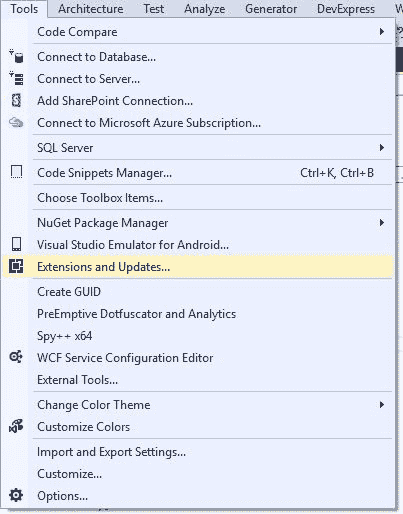
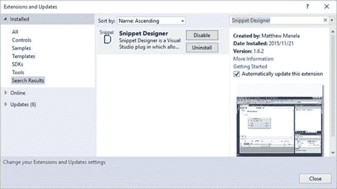
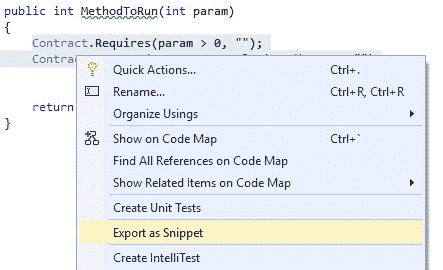
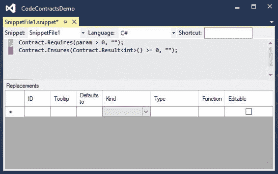
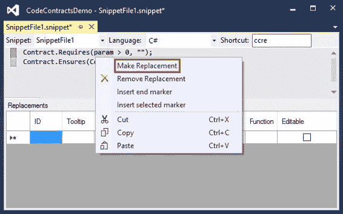
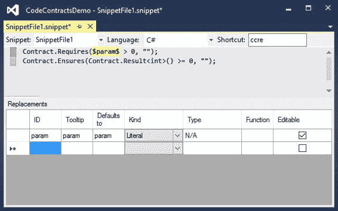
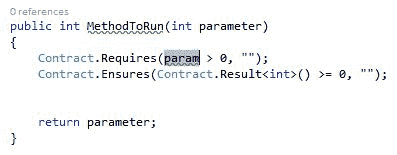

## 扩展代码段

严格来说，下一部分并不是代码合同所独有的，但如果我没有提及扩展代码片段的能力，那将是我的疏忽。我一直发现扩展代码片段有点麻烦。幸运的是，对于开发人员来说，有一些非常慷慨的社区成员可以为 Visual Studio 创建出色的扩展。 Snippet Designer 就是这样一个扩展。

在使用它之前，您需要从**工具**菜单下的**扩展和更新**安装 Snippet Designer。

图 27：Visual Studio 扩展和更新菜单项

安装了 Snippet Designer 后，它将显示在已安装的扩展程序下。

图 28：Snippet Designer 扩展

最基本的 Snippet Designer 使您能够动态生成代码片段。关于代码合同，我总是希望在我的方法中包含一些代码。我希望能够在一个代码片段下将它们链接在一起，为此，Snippet Designer 非常适合。

突出显示要创建代码段的代码合约，打开上下文菜单，然后单击**导出为代码段**。

图 29：导出为片段

Snippet Designer 窗口现在显示在 Visual Studio 2015 IDE 中的新选项卡中。

图 30：Snippet Designer 编辑器

请注意，粉红色突出显示不是 Snippet Designer 的功能;这是另一个名为 Heat Margin 的伟大扩展。但是，这超出了本书的范围。

在 Snippet Designer 窗口中，您可以在编辑器窗口中看到突出显示的代码。

选择要在生成时替换的代码部分。然后，右键单击并从上下文菜单中选择 **Make Replacement** 。

图 31：更换

图 32：已完成的新代码段

您将看到参数被占位符替换，并且该替换项网格中定义了该占位符的属性。剩下要做的就是给快捷方式一个名字（我称之为“TAG0] ccre 为”代码合同需要保证“）并保存你的代码片段。

在 Visual Studio 的代码编辑器中，键入 ccre 快捷键并按两次 Tab 键。我为我插入了我的代码片段，并将标识为替换的参数突出显示，以便我可以立即对其进行编辑。

图 33：插入的代码片段

这是一个非常容易使用的工具，我甚至还没有开始探索它为开发人员提供的可能性。我的重点仅仅是说明代码片段对开发人员非常有用，并且可以在开发过程中进行扩展以满足您的特定需求。