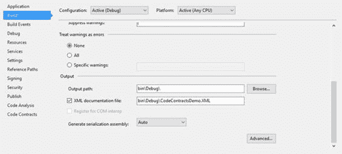
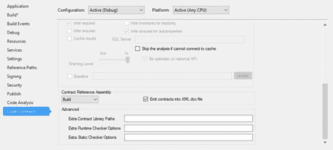
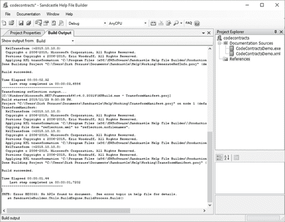
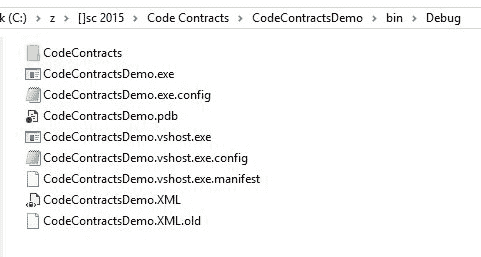
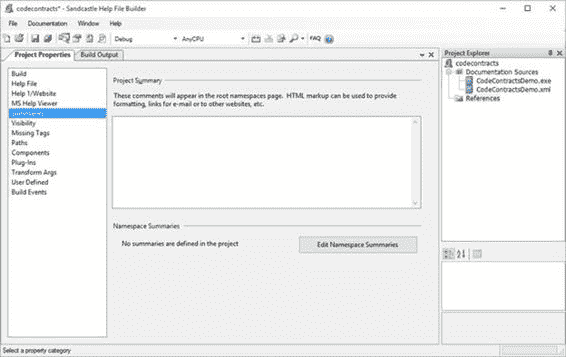
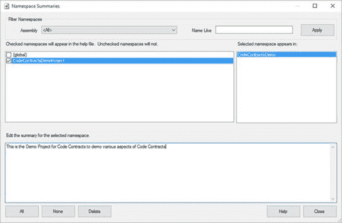
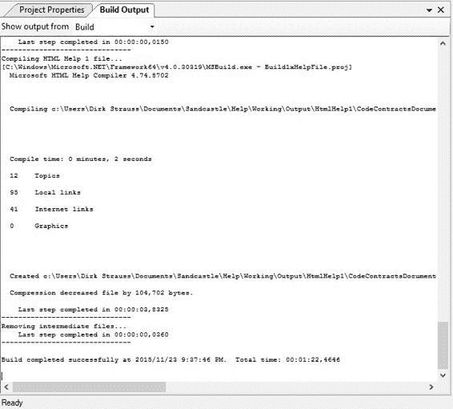
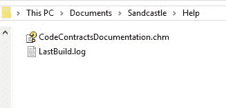
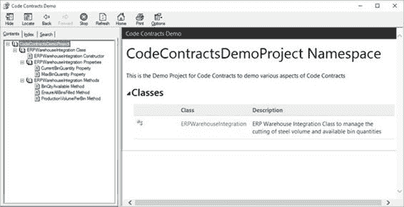

## 代码合同文件生成

我确信大多数（如果不是全部）开发人员不喜欢创建文档的一件事。在许多项目会议中，它已成为房间里的大象。每个人都知道文档是必不可少的，我相信有很多开发人员可以创建简洁而丰富的文档。这显然导致了许多工具和扩展，旨在使这个过程更容易。

因此，Code Contracts 也可以整合所包含合同的文档。要启用文档生成，您需要打开项目属性的 **Build** 选项卡。



图 34：启用 XML 文档文件

在这里，您需要选择 **XML 文档文件**选项。如果未启用此选项，则不会创建文档 XML 文件。您还可以在此处指定文档文件的输出路径和名称。

您需要修改的下一个选项是**代码合同**选项卡。如果滚动到“代码合同”选项卡的底部，您将看到未指定**合约引用程序集**值。将其更改为 **Build** 。

最后，您必须确保选择 **Emit 合同到 XML doc 文件**选项。这将使代码合同注释成为生成的文档文件的一部分。



图 35：启用代码合同文档

然后，您需要确保为代码添加了良好的注释。一旦你创建了一个逻辑不明显的新方法或代码行，你就需要进入这个习惯。另一方面，在代码中包含太多注释也不是一个好主意。所以你什么时候评论，什么时候不评论？一个好的经验法则是只在代码背后的逻辑不明显时才注释代码。

在下面的代码清单中，逻辑在第一个（代码清单 43）中很明显，因此实际上不需要进行注释。但是，在代码清单 44 中，应该在注释中解释模数运算符的使用，因为这样做的原因并不明显。

```
//Bad comment: Calculate the available quantity
int QtyAvailable = MaxBinQuantity - CurrentBinQuantity;

```

代码 43：不必要的代码注释

```
//Good comment: Use modulus to determine if the factor produces any scrap
return volumeToCut % factor;

```

代码清单 44：注释清楚地解释逻辑

评论很好的方法可能如下所示。

```
/// <summary>
/// Calculate any remainder after the modulus operation between volume and factor
/// </summary>
/// <param name="volumeToCut"></param>
/// <param name="factor"></param>
/// <returns>Remainder after cutting</returns>
private int CutSteel(int volumeToCut, int factor)
{
    // Use modulus to determine if the factor produces any scrap
    return volumeToCut % factor;
}

```

代码清单 45：评论良好的方法

添加相关注释后，您需要构建解决方案。在生成文档文件时，您需要了解在构建期间可能收到的任何警告。这些通常与源代码中缺少 XML 注释有关。通过向您的方法和属性添加清晰且相关的代码注释来继续解决这些问题是个好主意。

构建完成后，将在配置构建设置时指定的路径中找到 XML 文档。在此示例中，生成的 XML 文档包括代码合同描述。

```
<?xml version="1.0"?>
<doc>
<assembly>
    <name>CodeContractsDemo</name>
</assembly>
<members>
    <member name="T:ERPWarehouseIntegration">
    <summary>
            ERP Warehouse Integration class to manage the cutting of steel volume and available bin quantities
            </summary>
    </member>
    <member name="P:ERPWarehouseIntegration.MaxBinQuantity">
    <summary>
            The maximum bin quantity for bins
            </summary>
    </member>
    <member name="P:ERPWarehouseIntegration.CurrentBinQuantity">
    <summary>
            The current bin quantity available
            </summary>
    </member>
    <member name="M:ERPWarehouseIntegration.ProductionVolumePerBin(System.Int32,System.Int32)">
    <summary>
            Calculate the production volume of steel per bin
            </summary>
    <param name="binVolume" />
    <param name="factor" />
    <returns>Bin Volume less Remainder</returns>
    <ensures description="The factor used will result in scrap. Please modify the cutting factor." csharp="result == binVolume" vb="result = binVolume">result == binVolume</ensures>
    </member>
    <member name="M:ERPWarehouseIntegration.CutSteel(System.Int32,System.Int32)">
    <summary>
            Calculate any remainder after the modulus operation between volume and factor
            </summary>
    <param name="volumeToCut" />
    <param name="factor" />
    <returns>Remainder after cutting</returns>
    </member>
    <member name="M:ERPWarehouseIntegration.BinQtyAvailable">
    <summary>
            Ensure that a non-negative value is returned for available bin quantity
            </summary>
    <returns>Available bin quantity</returns>
    <ensures csharp="result &gt;= 0" vb="result &gt;= 0">result &gt;= 0</ensures>
    </member>
    <member name="M:ERPWarehouseIntegration.EnsureAllBinsFilled(System.Int32@,System.Int32,System.Int32)">
    <summary>
            Ensure that all bins are filled and that the steel volume does not exceed the maximum bin volume
            </summary>
    <param name="binOverCount" />
    <param name="binVol" />
    <param name="steelVol" />
    <ensures description="The steel volume exceeds the bin volume" csharp="binOverCount == 0" vb="binOverCount = 0">binOverCount == 0</ensures>
    </member>
</members>
</doc>

```

代码清单 46：生成的 XML 文档文件

我们可以轻松地为我们的代码生成简洁的 XML 文档，而无需繁重的工作。如果您定期评论您的代码，您生成的文档将是最新的，并真实反映您的代码状态。

### 创建用户友好的文档

生成的 XML 文件很棒，但是需要另一个步骤来创建格式良好，人类可读的 HTML 类型文档。对于此任务，我将使用 Sandcastle 帮助文件生成器，您可以从 [github.com/EWSoftware/SHFB](https://github.com/EWSoftware/SHFB) 从 GitHub 下载。在引导式安装过程中，请仔细阅读每个屏幕的说明和注释，因为这些内容包含您需要注意的重要信息。

我建议阅读有关使用 Sandcastle 帮助文件生成器的更多教程。该工具有很多东西需要真正深入了解这个优秀的工具。但是，出于本书的目的，除了向您展示如何创建基本的.chm 帮助文件之外，我不会详细介绍任何其他细节。

在使用 Sandcastle 帮助文件生成器之前，必须确保项目具有命名空间。否则，您将在帮助文件构建中看到以下错误。



图 36：构建输出错误

```
SHFB: Error BE0033: No APIs found to document. See error topic in help file for details.
at SandcastleBuilder.Utils.BuildEngine.BuildProcess.Build()

```

代码 47：Sandcastle 帮助文件生成器错误

我只是在我的类中添加了一个命名空间，如代码清单 48 所示。

```
namespace CodeContractsDemoProject
{
    /// <summary>
    /// ERP Warehouse Integration class to manage the cutting of steel volume and available bin quantities
    /// </summary>
    public class ERPWarehouseIntegration
    {

```

代码清单 48：添加到类的命名空间

完成后，打开 **Sandcastle 帮助文件生成器**，如果它尚未打开。在**项目浏览器**中，右键单击**文档源**节点，并将项目所在的.dll 或.exe 添加到（通常是 bin 文件夹）。我选择将我的 XML 文档输出到我的 bin 文件夹。



图 37：项目箱文件夹

一旦我选择了.exe 文件，XML 文档文件也会被 Sandcastle 帮助文件生成器自动选取并添加为文档源。添加的文件将显示在**文档源**节点下的**项目浏览器**中。



图 38：文档来源和摘要

**项目属性**选项卡中有各种其他部分可供您修改和设置。记住配置的重要一点是 **Summaries** 部分。您需要确保在**项目属性**选项卡的**摘要**页面中添加了命名空间摘要注释。单击**编辑命名空间摘要**按钮以打开**命名空间摘要**窗口。



图 39：命名空间摘要窗口

选择要为其添加摘要的名称空间，然后在**编辑所选名称空间的摘要**文本框中输入摘要说明。完成后，单击**关闭**按钮并保存项目。

您现在可以构建 Sandcastle 帮助文件构建器项目，该项目将生成您指定的帮助文件。

支持的帮助文件格式类型：

*   HTML 帮助 1（chm）
*   MS Help Viewer（mshc）
*   Open XML（docx）
*   降价（md）
*   网站（HTML / ASP.NET）



图 40：Sandcastle 帮助文件生成器成功构建

构建完成后，导航到生成的帮助文件的输出目录。我的默认路径 **Documents \ Sandcastle \ Help** 。



图 41：帮助文件输出路径

打开生成的帮助文件，您将看到编译采用了之前 **Summaries** 部分中添加的命名空间摘要，并将其添加为生成的帮助文件的摘要文本。



图 42：生成的帮助文件

一旦知道如何操作，就可以很容易地从代码合同注释中创建文档。借助 **Sandcastle 帮助文件生成器**等精湛的工具以及紧密集成的代码契约，可以将注释输出提供给生成的 XML 文件，开发人员可以获得为项目创建丰富文档所需的一切。