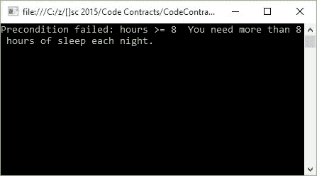
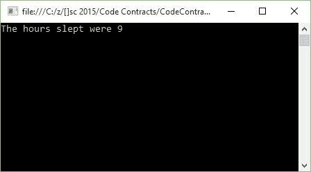

正如您所料，创建抽象类和接口的代码契约需要稍微有所不同。这是因为抽象类和接口不能包含方法体。许多开发人员仍然想知道抽象类和接口之间的区别。我听说过区分何时使用抽象类以及何时使用接口的最佳解释之一如下。

### 抽象类

如果您有许多可以组合在一起并由单个名词描述的类，那么您最有可能处理抽象类。然后将抽象类命名为此名词。另一个需要考虑的重要事项是，这些继承的类共享某种功能，并且您永远不会创建名词的实例（抽象类）。

想想下面的例子，你有一个 Human 类型的抽象类。你永远不会只实例化一个人类，而是一种人类，例如女性或男性。因此，男性和女性都继承自抽象类人类。然后抽象类将实现一个方法 void Sleep（），所有人都必须这样做（共享功能）。

要在抽象类上实现代码约定，您需要创建一个单独的 ContractClass 类，并通过使用属性将契约类与抽象类相关联。

```
using System.Diagnostics.Contracts;

/// <summary>
/// Human Abstract Class
/// </summary>
[ContractClass(typeof(HumanContract))]
public abstract class Human
{
    public abstract void Run(int distance);
    public abstract void Sleep(int hours);
}

/// <summary>
/// Human Contract Class
/// </summary>
[ContractClassFor(typeof(Human))]
public abstract class HumanContract : Human
{
    public override void Sleep(int hours)
    {
        Contract.Requires(hours >= 8,
            "You need more than 8 hours of sleep each night.");
    }
}

```

代码 49：抽象类和合同类

抽象类 Human 使用属性 [ContractClass（typeof（HumanContract））] ，契约类 HumanContract 使用属性 [ContractClassFor（typeof（人类））。

抽象类 Human 基本上指定所有人都会睡觉和奔跑。在睡眠（）方法（在 HumanContract 中定义）的合同中，我们定义所有人每晚必须至少睡 8 小时。

让我们创建一个继承自 Human 抽象类的 Male 类。

```
public class Male : Human
{
    public override void Run(int distance)
    {
        Console.Write("The distance run was " + distance);
        Console.ReadLine();
    }

    public override void Sleep(int hours)
    {
        Console.Write("The hours slept were " + hours);
        Console.ReadLine();
    }
}

```

代码 50：男性类继承人类

从 Male 类中我们可以看到它根本不包含代码合约。它所做的只是继承自 Human 抽象类。

```
namespace CodeContractsDemo
{
    class Program
    {
        static void Main(string[] args)
        {
            try
            {
                Male oMan = new Male();
                oMan.Sleep(5);
            }
            catch (Exception ex)
            {
                Console.Write(ex.Message);
                Console.ReadLine();
            }
        }
    }
}

```

代码 51：五小时睡眠男性类的实例化

如果我们必须实例化男性类并用 5 小时调用睡眠方法，我们的代码合同将启动并告诉我们人类每晚需要 8 小时的睡眠时间。



图 43：违反男性类睡眠方法的合同

修改我们的呼叫代码以指定一个不错的星期六早上小时 9 小时，描绘了不同的画面。

```
namespace CodeContractsDemo
{
    class Program
    {
        static void Main(string[] args)
        {
            try
            {
                Male oMan = new Male();
                oMan.Sleep(9);
            }
            catch (Exception ex)
            {
                Console.Write(ex.Message);
                Console.ReadLine();
            }
        }
    }
}

```

代码 52：9 小时睡眠男性类的实例化

验证代码合同， Sleep（）方法通过验证。



图 44：通过男性类睡眠方法合同

代码契约和抽象类协同工作，为开发人员团队创建真正稳定且强大的代码库。

### 接口

让我们使用前面的 Male 和 Female 类的例子。从现在开始快 20 年，我们在火星上发现了外星人。它们与我们惊人地相似，使它们成为人类，但它们既不是男性也不是女性。我们现在有一个新类型， Alien ，它继承自抽象类 Human 。

现在将接口视为动词。哪个动词一般可以应用于我的课程？所有人都需要学习新东西并且可以学习，所以现在我们可以创建一个名为 ITeachable 的界面。我们将在 Human 抽象类上实现 ITeachable 接口，因为所有人都是可教的。然而，外星人比男性或女性稍微先进，并且可以将他们的分子重新排列成不同的结构，使外星人能够变形。因此，我们可以创建一个名为 IShapeShiftable 的接口，该接口仅适用于 Alien 。

创建界面很像抽象类。它还需要包含一个契约类，接口和契约类都需要通过它们的属性相互指向。

```
using System.Diagnostics.Contracts;

[ContractClass(typeof(IShapeShiftableContract))]
public interface IShapeShiftable
{
    void Man(int shapeDuration);
    void Woman(int shapeDuration);
    void InanimateObject(int shapeDuration);
}

[ContractClassFor(typeof(IShapeShiftable))]
abstract class IShapeShiftableContract : IShapeShiftable
{
    void IShapeShiftable.InanimateObject(int shapeDuration)
    {
        Contract.Requires(shapeDuration <= 12);
    }

    void IShapeShiftable.Man(int shapeDuration)
    {
        Contract.Requires(shapeDuration <= 4);
    }

    void IShapeShiftable.Woman(int shapeDuration)
    {
        Contract.Requires(shapeDuration <= 4);
    }
}

```

代码 53：接口实现代码合同类

我们现在可以通过契约类 IShapeShiftableContract 为接口创建合同，就像我们之前为抽象类所做的那样。

### 抽象类与接口

总结抽象类和接口的示例，这一切都归结为您希望实现的位置。如果要在所有派生类之间共享实现，则将创建一个抽象类。如果您需要特定于单个类或多个类的实现，而不是所有类，请使用接口。

代码合同很容易满足两者。