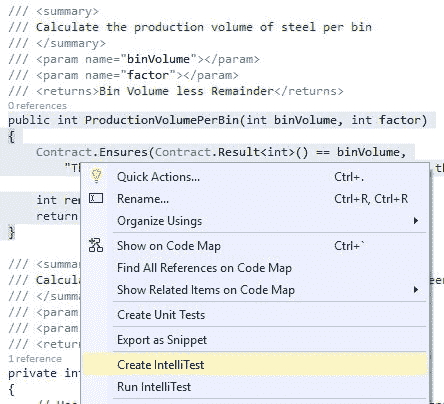
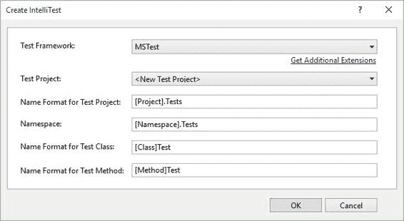
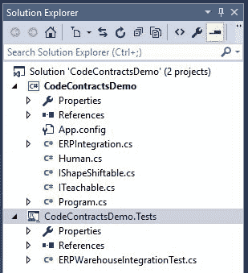
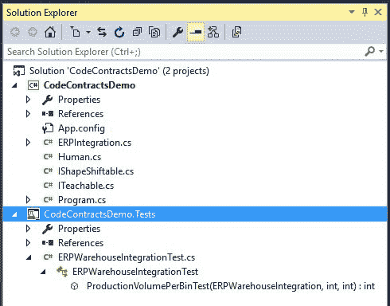

## 入门：创建 IntelliTest

如前所述，IntelliTest 已集成到 Visual Studio Enterprise 2015 中。如果您希望在其他版本的 Visual Studio 2015 中集成 IntelliTest，则可以在 Visual Studio 2015 [UserVoice 站点](https://visualstudio.uservoice.com/forums/121579-visual-studio-2015)上听到您的声音。微软在 Visual Studio 团队中的人确实密切关注这个网站 - 你的投票永远不会白白浪费。

IntelliTest 入门非常简单。让我们重新审视我们在前一章中使用过的方法之一。

```
/// <summary>
/// Calculate the production volume of steel per bin
/// </summary>
/// <param name="binVolume"></param>
/// <param name="factor"></param>
/// <returns>Bin Volume less Remainder</returns>
public int ProductionVolumePerBin(int binVolume, int factor)
{
    Contract.Ensures(Contract.Result<int>() == binVolume,
        "The factor used will result in scrap. Please modify the cutting factor.");

    int remainder = CutSteel(binVolume, factor);
    return binVolume - remainder;
}

/// <summary>
/// Calculate any remainder after the modulus operation between volume and factor
/// </summary>
/// <param name="volumeToCut"></param>
/// <param name="factor"></param>
/// <returns>Remainder after cutting</returns>
private int CutSteel(int volumeToCut, int factor)
{
    // Use modulus to determine if the factor produces any scrap
    return volumeToCut % factor;
}

```

代码清单 61：为方法创建 IntelliTest

和以前一样，前面的代码清单告诉调用方法，合同下的方法将导致切割量总是等于 bin 容量。这意味着所有钢材都经过完美切割，并且不会因使用特定因素而产生切口。

要为 ProductionVolumePerBin（）方法生成新的 IntelliTest，请右键单击该方法，然后从上下文菜单中选择 **Create IntelliTest** 。



图 45：创建 IntelliTest

Visual Studio 现在将显示 Create IntelliTest 窗口，您可以在其中为生成的 IntelliTest 配置其他设置。



图 46：创建 IntelliTest 设置

如果这是您第一次创建 IntelliTest，您将看到 **MSTest** 是**测试框架**中列出的唯一选项。但是，如果需要，您可以安装第三方单元测试框架（稍后将详细介绍）。完成后，单击**确定**。



图 47：添加到解决方案的测试项目

Visual Studio 现在将为您创建测试项目。完成该过程后，新项目将显示在 **Solution Explorer** 窗口中。



图 48：创建的 IntelliTest

扩展 **ERPWarehouseIntegrationTest.cs** 文件，您将看到已创建名为 **ProductionVolumePerBinTest** 的测试。

```
// <copyright file="ERPWarehouseIntegrationTest.cs">Copyright © 2015</copyright>
using System;
using Microsoft.Pex.Framework;
using Microsoft.Pex.Framework.Validation;
using Microsoft.VisualStudio.TestTools.UnitTesting;

namespace CodeContractsDemoProject.Tests
{
    /// <summary>This class contains parameterized unit tests for ERPWarehouseIntegration</summary>
    [PexClass(typeof(ERPWarehouseIntegration))]
    [PexAllowedExceptionFromTypeUnderTest(typeof(InvalidOperationException))]
    [PexAllowedExceptionFromTypeUnderTest(typeof(ArgumentException), AcceptExceptionSubtypes = true)]
    [TestClass]
    public partial class ERPWarehouseIntegrationTest
    {
        /// <summary>Test stub for ProductionVolumePerBin(Int32, Int32)</summary>
[PexMethod]
        public int ProductionVolumePerBinTest(
            [PexAssumeUnderTest]ERPWarehouseIntegration target,
            int binVolume,
            int factor
        )
        {
            int result = target.ProductionVolumePerBin(binVolume, factor);
            return result;
            // TODO: add assertions to method ERPWarehouseIntegrationTest.ProductionVolumePerBinTest(ERPWarehouseIntegration, Int32, Int32)
        }
    }
}

```

代码 62：ProductionVolumePerBinTest 创建

只需点击几下即可生成此测试所需的全部内容。 IntelliTest 的集成允许开发人员轻松地在其代码中创建关键逻辑的测试。