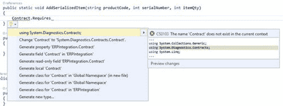
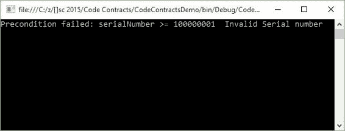
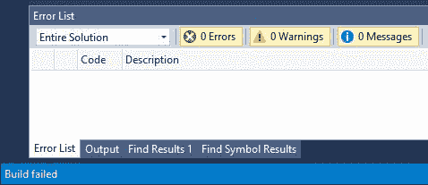
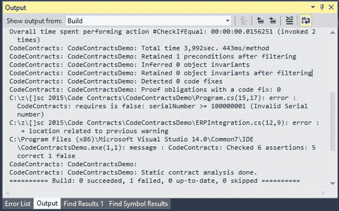
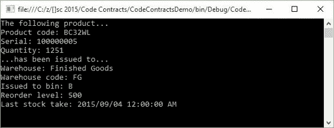

# 第 2 章使用代码合同

|  | 注意：本书中的代码示例可在 [bitbucket.org/syncfusiontech/c-code-contracts-succinctly](https://bitbucket.org/syncfusiontech/c-code-contracts-succinctly) 获得。 |

## 一个真实世界的例子

有很多例子说明了代码合同的使用。他们中的很多人似乎使用原始的非现实世界的例子来解释代码契约的使用。虽然我理解这样做的好处，但我觉得使用现实世界的例子更可取。那么什么才能被归类为一个合适的例子呢？好吧，几年前我正在研究一个正在实施的系统来取代现有的 ERP 系统。旧的和新的 ERP 系统都使用数字序列号，但我们为新 ERP 开发的集成只能使用新的序列号。

旧的 ERP 系统被保留用于历史目的，因此集成必须确保它仅使用对新 ERP 系统有效的序列号。我们决定启动超过一亿的所有序列号。这意味着创建的第一个序列号将是 100,000,001。低于此值的任何序列号（有效时）不应允许进入新的 ERP 系统。

在 Visual Studio 2015 中，首先使用语句将以下添加到您的类中。

```
using System.Diagnostics.Contracts;

```

代码清单 1：必需使用语句

如果您使用语句在没有的情况下开始编写代码约定的代码，Visual Studio 2015 将提示您通过新的灯泡生产力功能添加它，如图 7 所示。



图 7：Visual Studio 2015 灯泡功能

您会注意到 Visual Studio 2015 提出了一些更正。在图 7 中，您看到使用语句的是第一个建议，并且是我们需要在此实例中应用的修复。

### Visual Studio 2015 灯泡

此生产力功能是 Visual Studio 2015 中的新功能。灯泡会自动出现在 Visual Studio 编辑器中，并在当前键入的代码行上向开发人员提供错误修复和重构建议。也可以通过在一行代码上按 **Ctrl + Period** 手动调用灯泡，以查看潜在修复列表。

## 代码合同前提条件

请考虑以下代码清单，该代码清单检查传递给方法的序列号的值。此方法用于将序列化库存项目添加到新 ERP 系统的库存表中。

```
public static class ERPIntegration
{
    public static void AddSerializedItem(string productCode, int serialNumber, int qty)
    {
        Contract.Requires<SerialNumberException>
            (serialNumber >= 100000001, "Invalid Serial number");          
    }
}
public class SerialNumberException : Exception
{
    public SerialNumberException()
    {
    }

    public SerialNumberException(string message)
        : base(message)
    {
    }

    public SerialNumberException(string message, Exception inner)
        : base(message, inner)
    {
    }
}

```

代码清单 2：代码合同前提条件

Contract.Requires 语句表示前提条件。前提条件是方法体中的第一个语句。在前面的代码清单中，前提条件检查传递给方法的序列号的值，并确定它是否是有效的序列号。

现在让我们仔细看看实际的代码合同。代码契约汇总如下：`Contract.Requires<TException>(bool condition, string errorMessage)`其中 TException：Exception 。验证布尔条件，如果失败，代码契约将抛出提供的消息的异常。请注意，我在合同中添加了一个名为 SerialNumberException 的自定义异常。它源自异常类，但您可以在此处添加任何适用的异常以满足您的要求。

前面代码清单中的代码合同格式只是一种实现。以下列表说明了代码协定前提条件的有效语法：

*   `Contract.Requires(bool condition)`
*   `Contract.Requires(bool condition, string errorMessage)`
*   `Contract.Requires<TException>(bool condition)`
*   `Contract.Requires<TException>(bool condition, string errorMessage)`

就个人而言，如果代码合同中表达的条件失败，我更喜欢指定的异常类和抛出的用户定义的错误消息的组合。这为开发人员提供了一种非常强大的机制，可确保传递给方法的值有效。它还使开发人员不必为可能破坏系统的每个可能性进行防御性编码。知道合同中的方法总是符合您指定的预定规则，让您作为开发人员更加安心。

## 代码合同的前提条件

为了说明代码合同中定义的前提条件的失败，我在方法调用中硬编码了无效的序列号。作为控制台应用程序，对方法的调用包含在 try / catch 语句中，该语句将错误输出到控制台。请考虑以下代码清单。

```
static void Main(string[] args)
{
    try
    {
        ERPIntegration.AddSerializedItem("BC32WL", 70012, 1);
    }
    catch (Exception ex)
    {
        Console.Write(ex.Message);
        Console.ReadLine();
    }
}

```

代码 3：代码合同前提条件

运行控制台应用程序时，将抛出异常并显示在控制台窗口中。使用具有自定义异常的代码合同（例如代码清单 2 中所示的代码合约）时，必须将代码合同装配模式属性设置为**标准合同要求**。



图 8：前提条件失败

前面的示例是一种说明代码约定功能的简单方法。但是，在生产系统中，显然在方法调用中没有硬编码值。这些值来自数据库或来自用户输入的可能性非常高。众所周知，所有输入（用户或数据存储）都是我们无法控制的，我们应该这样对待它。代码契约减轻了不良数据的负面影响。

虽然前面的示例是有效的，但我想从代码合同中获得更多。我不想运行我的应用程序，然后意识到有一些代码段导致我的合同失败。就个人而言，我希望在构建项目时看到任何失败。这个项目足够小，所以我可以对“项目属性”窗口中指定的“代码合约”属性有点讽刺。

## 失败建立警告

返回 Code Contracts 属性页面，如果尚未执行此操作，请启用**执行静态合同检查**。接下来，您需要清除背景选项中的**检查。然后您将看到启用了 **Fail build on warnings** 选项。选择此选项。**


图 9：在警告上启用失败构建

继续构建您的项目。静态合同检查立即启动，并且由于您的代码合同未通过，您的构建将失败，如图 10 所示。但是，存在问题。即使您的构建失败，您的**错误列表**也为空。因为我们只有一个代码合同，所以我们知道在哪里看。但是，当我们有几个代码契约时，这是不可行的。



图 10：Visual Studio 2015 构建失败

出了什么问题？要找到导致构建失败的问题，请转到 **Output** 窗口。如果没有看到“输出”窗口，请按 **Ctrl + W，O** 使其进入视图。然后，您将看到构建的结果和失败的代码合同。



图 11：Visual Studio 输出窗口

使用代码约定的当前版本 1.9.10714.2，未输出到**错误列表**的构建错误已被识别为 Visual Studio 2015 发行版中的错误。此错误已得到修复，将包含在内在下一版代码合约中。有关与 Visual Studio 2015 代码约定相关的此问题的更多信息，请查看 GitHub 上的 [pull 请求 166](https://github.com/Microsoft/CodeContracts/pull/166) 和 [issue 137](https://github.com/Microsoft/CodeContracts/issues/137) 。如果您想查看有关代码合同的所有未解决问题，请查看代码合同 GitHub 页面上的[问题](https://github.com/Microsoft/CodeContracts/issues)。

代码契约是少数专职人士不断努力改进当前版本的结果。像我们这样的用户可以报告我们遇到的问题，并在此过程中建立一个健康的影响者社区和更稳定的产品。最后，由于它是开源的，您可以为代码契约做出贡献，并成为这个令人难以置信的 Visual Studio 扩展的一部分。

## 守则合同后置条件

代码合同后置条件是合同保证调用代码的方法，如果满足所有前提条件，它将返回特定结果。让我们回到一个银行和贷款的类比，为此制定合同。银行确保贷款具有固定利率，但仅限于按时还款和应付金额。您支付的款项可以等同于代码合同的前提条件。银行确保固定利率的事实可以等同于后置条件。

因此，代码合同后置条件的语法使用 Ensures 方法就不足为奇了。另一个需要注意的有趣点是，虽然后置条件验证了契约下方法的结果，但它必须在方法中的前置条件之后立即出现。请考虑以下代码示例：

```
public static Warehouse AddSerializedItem(string productCode, int serialNumber, int qty)
{        
    Contract.Requires<SerialNumberException>
        (serialNumber >= 100000001, "Invalid Serial number");
    Contract.Ensures(Contract.Result<Warehouse>() != null);

    ProductCode = productCode;
    SerialNumber = serialNumber;
    Quantity = qty;

    return CreateItem();
}

```

代码 4：合同后置条件

从前面的代码清单中可以看出，我稍微扩展了我们的方法。我添加了 postcondition，它告诉调用代码，此方法的返回值将是 Warehouse 类型，并且它不会为 null。因此，调用代码不需要检查返回给它的对象是否有效。合同规定它将向其返回 Warehouse 对象。

```
Contract.Ensures(Contract.Result<Warehouse>() != null);

```

代码清单 5：代码合同确保结果

在现实世界的例子中，这基本上意味着创建的库存项目将根据特定条件（产品代码）发布到特定仓库。产品代码将产品标识为快速推进器，原材料，成品等，并且必须在创建时发布到正确的仓库。我们在合同下的 AddSerializedItem 方法告诉调用代码它确保此仓库问题的结果将存储在 Warehouse 对象中。如果出现任何问题，产品代码将发布到默认仓库。 ERP 系统的用户可以检查存储在默认仓库中的项目，并在稍后阶段手动将产品代码发布到正确的仓库。



图 12：代码合同后置条件结果

我在下面的代码清单中包含了 CreateItem（）方法的代码。虽然此代码示例仅用于解释概念，但逻辑是合理的。 开关语句将检查一组固定的案例，如代码清单 5 所示。但是，它不会返回它返回的 Warehouse 对象的硬编码值。当代码与 ERP 交互以创建产品代码条目并将其发布到仓库时，将从数据库或其他对象读取这些内容。代码逻辑确保的是该方法将始终返回 Warehouse 对象，并且该对象将始终是系统中的有效仓库。

```
private static Warehouse CreateItem()
{
    // Add Stocked Item code goes here
    Warehouse IssuedToWarehouse = new Warehouse();
    switch (ProductCode.Substring(0,1))
    {
        case "A":
            IssuedToWarehouse.Code = "FM";
            IssuedToWarehouse.Name = "Fast movers";
            IssuedToWarehouse.Bin = "A";
            IssuedToWarehouse.BinReorderLevel = 10000;
            IssuedToWarehouse.LastStockTake = Convert.ToDateTime("2015-09-01");
            break;
        case "B":
            IssuedToWarehouse.Code = "FG";
            IssuedToWarehouse.Name = "Finished Goods";
            IssuedToWarehouse.Bin = "B";
            IssuedToWarehouse.BinReorderLevel = 500;
            IssuedToWarehouse.LastStockTake = Convert.ToDateTime("2015-09-04");
            break;
        case "C":
            IssuedToWarehouse.Code = "RM";
            IssuedToWarehouse.Name = "Raw Materials";
            IssuedToWarehouse.Bin = "AD";
            IssuedToWarehouse.BinReorderLevel = 7500;
            IssuedToWarehouse.LastStockTake = Convert.ToDateTime("2015-09-02");
            break;
        default:
            IssuedToWarehouse.Code = "GS";
            IssuedToWarehouse.Name = "General Stock";
            IssuedToWarehouse.Bin = "SS";
            IssuedToWarehouse.BinReorderLevel = 5000;
            IssuedToWarehouse.LastStockTake = Convert.ToDateTime("2015-09-09");
            break;
    }
    return IssuedToWarehouse;
}

```

代码 6：仓库问题逻辑

您可以看到如何在代码约定中使用后置条件来创建高度健壮的代码。想想在分布式团队中工作的开发人员。能够在世界任何地方工作有许多优点和缺点（取决于你的观点）。缺乏个人的一对一沟通可以被解释为明显的缺点。无法坐在开发人员可以共同解决问题的会议室中仍然是一个挑战。你的大脑可以根据我们倾向于给出的众多其他信号（例如肢体语言，眼球运动或呼吸）潜意识地推断出感觉，意义和观点。

沟通不仅仅是说话的行为。因此，作为开发者，我们需要变得更加敏锐，并提高我们在其他领域的效率。一个很好的起点是代码。通过代码合同，我们能够在防御上取代可能发生的某些条件。仅仅因为规范没有明确提到 null 条件会破坏集成，这并不意味着我们不需要为它辩护。

前面的示例显示了开发人员如何针对逻辑上可能对集成产生负面影响的某些问题进行防弹代码。

## 守则合同不变

代码合同允许验证类的内部状态。它通过使用代码契约不变量来实现。顾名思义，不变量是永远不会改变的东西。它将始终按照合同中的类别指定。

我们现在知道必须为我们的 AddSerializedItem 方法提供有效的序列号。有效序列号属于特定范围。

```
Contract.Requires<SerialNumberException>
        (serialNumber >= 100000001, "Invalid Serial number");

```

代码清单 7：合同要求条件

我们还知道合同下的方法保证调用代码在满足有效序列号前置条件时将返回非 null Warehouse 对象。

```
Contract.Ensures(Contract.Result<Warehouse>() != null);

```

代码清单 8：合同确保条件

现在让我们假设必须添加额外的逻辑，需要检查生产日期的有效性。此日期也可能在将来，因此需要由外部数据存储，用户输入或查找提供。

这很容易，并通过向应用了 [ContractInvariantMethod] 属性的类添加新的私有方法来实现。如果我们必须在 Warehouse 类上添加此检查，我们需要向其添加以下代码。

```
[ContractInvariantMethod]
private void Invariants()
{
    Contract.Invariant(this.ProductionYear >= 0);        
    Contract.Invariant(this.ProductionMonth >= 0);
    Contract.Invariant(this.ProductionMonth <= 12);
    Contract.Invariant(this.ProductionDay >= 0);
    Contract.Invariant(this.ProductionDay <= 30);
}

```

代码 9：合同不变方法

这告诉代码合同生产日期的以下属性必须落在以下范围内。它们都不能为零，月数不能大于 12 ，日期最大值可能为 30 （假设我们正在使用 30-一天的几个月）。

通常，您可以随意调用契约不变方法，但许多人更喜欢称之为 ObjectInvariant 。关于前面的代码清单的另一点需要注意的是，该方法必须具有 void 返回类型，并且范围为 private 或 protected 。

代码合约不变方法允许我们指定不允许更改的类的状态。代码简短易懂，易于实现。

## 其他守则合约方法

代码约定还包含在代码中使用的各种其他方法。我们将在以下部分中查看这些示例。

### 合同断言和假设

有些人可能想知道在代码中使用 Debug.Assert 和 Contract.Assert 之间有什么区别。 Debug.Assert 仅在代码在 **Debug** 模式下编译时执行。但是， Contract.Assert 方法是在 **Debug** 或 **Release** 模式下调试代码时执行的。

代码契约中的断言方法也很容易与 Contract.Requires 方法混淆。正如我们在之前的代码清单中看到的那样， Requires 方法是一个前提条件，必须始终在特定方法的开头调用。这是因为 Contract.Requires 包含有关其所在方法的信息。 Contract.Assert 和 Contract.Assume ，另一方面，特定于在合同下的方法中的某个时间点的某些代码。

那么我们何时使用哪种方法？使用 Assert ，静态检查器运行并将尝试证明该特定代码行的断言。 假设将让静态检查器简单地假设无论检查是否需要证明，都是如此。那为什么两者都有？考虑下一个代码清单。

```
public void CompleteBinPreparation(int quantityRequired)
{        
    QuantityRequired = quantityRequired;
    int available = BinQtyAvailable();
    Contract.Assert(QuantityRequired <= available, "Quantity required exceeds available bin quantity");        
}

public int BinQtyAvailable()
{
    MaxBinQuantity = 75;
    CurrentBinQuantity = 50;
    int QtyAvailable = MaxBinQuantity - CurrentBinQuantity;
    return QtyAvailable;
}

```

代码 10：断言静态检查

代码清单 10 中的代码检查包含零件的 Bin 是否有足够的空间来容纳所需的数量。使用 Assert 方法，我们让静态检查器检查 QuantityRequired 变量的值。如果我们必须为 QuantityRequired 传递 77 的值，我们会看到静态检查器发出警告并使构建失败（记住，我们打开了 **Fail build on 代码合同属性页面中的警告**）。


图 13：断言失败

如果我们必须修改代码清单 10 中的代码以包含假设，那么输出确实会完全不同。请考虑以下清单中的代码。

```
public void CompleteBinPreparation(int quantityRequired)
{        
    QuantityRequired = quantityRequired;
    int available = BinQtyAvailable();
    Contract.Assume(QuantityRequired <= available, "Quantity required exceeds available bin quantity");        
}

public int BinQtyAvailable()
{
    MaxBinQuantity = 75;
    CurrentBinQuantity = 50;
    int QtyAvailable = MaxBinQuantity - CurrentBinQuantity;
    return QtyAvailable;
}

```

代码 11：假设静态检查


图 14：假设通过

当我们使用 Contract.Assume 时，我们告诉静态检查器它需要假设合同条件为真。我们为什么要这样做？好吧，代码清单 11 中的前面代码调用了一个我们可以控制的方法。我们可以在逻辑上将 Contract.Ensures 添加到 BinQtyAvailable 方法，以保证它符合代码合同。但是，请考虑一下我们在另一个外部库中调用方法。我们无法控制该 DLL 中包含的代码，开发人员也没有实现代码合同。但是，它们确保返回的值始终考虑所需的数量并返回具有足够数量的箱。因此，我们可以告诉静态检查器假设此合同条件通过。

请注意，前面关于断言和假设的示例仅适用于静态检查器。因为我们有**执行运行时间合同检查**并设置为 **Full** ，如果检查的条件失败， Contract.Assume 在运行时仍会失败（外部库为可用的 bin 数量返回无效值。


图 15：假设在运行时失败

断言和假设在处理外部代码时确保了一个非常强大的组合，并确保以您需要的方式返回并有效。

最后，您可以在代码约定属性页面中更改**警告级别**。如果您希望在“输出”窗口中看到某些警告但不是，请务必将**警告级别**更改为高。

### Contract.ForAll

在继续解释 Contract.ForAll 逻辑之前，我必须指出它目前无法在 Visual Studio 2015 中静态验证。问题 177 已在 GitHub 上记录此问题，并且有一个解决方法在线程中提供。要了解更多信息，请转到 [github.com/Microsoft/CodeContracts/issues/177](https://github.com/Microsoft/CodeContracts/issues/177) 。

现在，我需要禁用静态检查来说明 Contract.ForAll 方法的使用。要禁用静态检查，请在 Visual Studio 的解决方案资源管理器中右键单击项目，然后选择**属性**。 Code Contracts 属性页面将打开。单击**代码合同**选项卡。

这是我们之前访问过的页面。在**静态检查**组下，清除**执行静态合同检查**选项。


图 16：禁用静态合同检查

完成此操作后，您应该能够让代码合同执行所需的操作并验证您指定的条件。

有了这个，让我们修改我们的 CompleteBinPreparation 方法。业务规则要求在处理 bin 之前，数量需要大于 5.让我们通过要求 binQuantities 数组永远不为空来构建此契约。如前所述，通过添加 Contract.Requires 方法可以轻松完成。

接下来，我们需要添加 Contract.Assert 以包含 Contract.ForAll 方法。然后，这将使用 lambda 表达式检查所有数量是否大于 5.实现显示在以下代码清单中。

```
public void CompleteBinPreparation(int[] binQuantities)
{
    Contract.Requires(binQuantities != null);
    Contract.Assert(Contract.ForAll(binQuantities, x => x > 5),
        "Some Bins contain invalid quantities");

    // Process bin quantities
    BinCount = binQuantities.Length;
}

```

代码 12：Contract.ForAll 示例

如果我们的合同下的方法通过验证，它将只返回数组中的 bin 计数。例如，如果数组包含无效的 bin 数量，则会显示异常。

在我们的调用代码中，我们现在将添加一个包含一些无效 bin 数量的数组。我们可以看到 4 和 3 的数量小于 5 ，因此无效。

```
static void Main(string[] args)
{
    try
    {
        int[] iBins = { 4, 3, 61, 51, 88, 55 };
        ERPWarehouseIntegration oWhi = new ERPWarehouseIntegration();
        oWhi.CompleteBinPreparation(iBins);

        Console.Write("Bin Count: " + oWhi.BinCount);
        Console.ReadLine();
    }
    catch (Exception ex)
    {
        Console.Write(ex.Message);
        Console.ReadLine();
    }
}

```

代码 13：调用 Contract.ForAll 方法

如果我们运行代码，控制台应用程序将抛出异​​常并向用户显示错误消息。


图 17：无效的 Bin 数量

现在让我们修改我们的调用代码，使其只包含 iBins 数组中的有效 bin 数量。您将看到我已将 4 和 3 的无效 bin 数量分别更改为 32 和 19 。

如果再次运行该应用程序，则会导致代码合同通过验证并在控制台应用程序中显示 bin 计数。

```
static void Main(string[] args)
{
    try
    {
        int[] iBins = { 32, 19, 61, 51, 88, 55 };
        ERPWarehouseIntegration oWhi = new ERPWarehouseIntegration();
        oWhi.CompleteBinPreparation(iBins);

        Console.Write("Bin Count: " + oWhi.BinCount);
        Console.ReadLine();
    }
    catch (Exception ex)
    {
        Console.Write(ex.Message);
        Console.ReadLine();
    }
}

```

代码 14：修改的调用代码

控制台应用程序现在显示有效容器的计数，这意味着代码合同通过了验证。


图 18：有效的 Bin 数量

正如您所看到的， Contract.ForAll 方法提供了一种很棒的方法来检查条目的值数组，如果这些条目违反业务规则，则可能导致执行路径中的问题。 Contract.ForAll 方法也可以与 List 集合或任何 IEnumerable 集合一起使用。

### Contract.Exists

暂时，让我们假设需要处理的箱号进入一批处理过的箱子 30 天。系统不知道 bin 何时进入处理阶段，因此需要在处理之前检查每个 bin 编号以确保它不存在于进程队列中。 Code Contracts 也提供了一个很好的解决方案。

创建一个名为 ProcessBin 的方法，并添加 Contract.Requires 方法以检查传递给该方法的参数是否为空。然后添加 Contract.Assert 方法以包含 Contract.Exists 方法。这将检查已处理的队列 ProcessedBins 是否包含我们要处理的 bin。以下代码清单说明了此实现。

```
public void ProcessBin(string bin)
{
    Contract.Requires(bin != null);
    Contract.Assert(!Contract.Exists(ProcessedBins(),
        x => string.Compare(x, bin, true) == 0),
        "Bin " + bin + " already processed");

    // Process bin and add to ProcessedBins collection
}

private List<string> ProcessedBins()
{
    List<string> oBinsProcessed = new List<string>();
    oBinsProcessed.Add("A12");
    oBinsProcessed.Add("CD25");
    oBinsProcessed.Add("ZX4R");
    oBinsProcessed.Add("A11");

    return oBinsProcessed;
}

```

代码 15：Contract.Exists 实现

在调用代码中，我们将使用硬编码值来检查 bin 编号。在合同下调用方法并将其传递给已在进程队列中的 bin。

```
static void Main(string[] args)
{
    try
    {
        string BinToProcess = "ZX4R";
        ERPWarehouseIntegration oWhi = new ERPWarehouseIntegration();
        oWhi.ProcessBin(BinToProcess);

        Console.Write("Bin " + BinToProcess + " processed");
        Console.ReadLine();
    }
    catch (Exception ex)
    {
        Console.Write(ex.Message);
        Console.ReadLine();
    }
}

```

代码 16：调用 Contract.Exists 方法

代码合约验证 bin 是否存在于进程队列中，并在控制台应用程序中向用户显示输出。


图 19：进程队列中存在的容器

回到我们的调用代码，让我们将 bin 编号更改为进程队列中不存在的 bin 编号。

```
static void Main(string[] args)
{
    try
    {
        string BinToProcess = "SSX4R";
        ERPWarehouseIntegration oWhi = new ERPWarehouseIntegration();
        oWhi.ProcessBin(BinToProcess);

        Console.Write("Bin " + BinToProcess + " processed");
        Console.ReadLine();
    }
    catch (Exception ex)
    {
        Console.Write(ex.Message);
        Console.ReadLine();
    }
}

```

代码 17：修改的调用代码

如果我们第二次运行应用程序，则将处理 bin，并在控制台应用程序中向用户显示确认消息。


图 20：进程队列中不存在 Bin

Contract.Exists 允许开发人员根据您设计的系统中的某些业务规则轻松验证项目是否存在。

### `Contract.OldValue<>`

几年前，我参与了一家钢铁制造商的项目。当通过将钢板切割成特定尺寸生产切口时，他们有一个非常具体的废料处理过程。我工作的另一个项目有一个特定的废料工作流程来处理。废料是许多公司非常重视的事情，他们需要仔细管理这个过程。

对于代码合同的下一个示例，我将使用废料流程来说明`Contract.OldValue<>`的使用。 方法。不过，我必须提到`Contract.OldValue<>`方法只能用于 Ensures 合同的条件表达式。

让我们假设钢铁制造商需要尽量减少切割过程产生的切割量。为此，他们使用计算来计算要切割的钢的体积，并根据切削系数计算可以使用的钢的数量。完美切割意味着如果钢的体积为 10 m^3，那么所得到的钢材切割量也将等于 10 m^3。因此，所有的钢都被消耗掉，导致零切。

不完美的切割将导致小于原始钢的体积，这意味着用户将需要改变切割系数，直到它们能够确保接近完美的切割。在没有详细说明阈值和限制的情况下，我们假设如果返回除完美切割之外的任何其他内容，则切割过程不会被批准。

请考虑以下代码清单。

```
public void CutSteelNoScrap(int volumeSteel, int factor)
{
    Contract.Ensures(volumeSteel != 0, "The volume of steel can't be zero");
    Contract.Ensures(Contract.OldValue<int>(volumeSteel)
        == CutSteel(volumeSteel, factor) + volumeSteel,
    "The factor used will result in scrap. Please modify the cutting factor.");
    // Process steel to cut
}

private int CutSteel(int volumeToCut, int factor)
{
    return volumeToCut % factor;
}

```

代码 18：`Contract.OldValue<>`履行

正如您所看到的，我只是使用模数运算符来模拟基于不正确因子的切割的存在。模数运算符只返回除法的余数，并由% 运算符表示。因此，以下情况属实：

19% 5 = 4

12% 4 = 0

这很粗糙，但它有效地说明了我需要做的事情。在调用代码中，我们调用 CutSteelNoScrap 方法来执行计算，并告诉我们使用的因子是否不正确并生成废品。

```
static void Main(string[] args)
{
    try
    {
        int steelVolume = 4;
        int cutFactor = 3;
        ERPWarehouseIntegration oWhi = new ERPWarehouseIntegration();
        oWhi.CutSteelNoScrap(steelVolume, cutFactor);

        Console.Write("Steel fully consumed by cutting process");
        Console.ReadLine();
    }
    catch (Exception ex)
    {
        Console.Write(ex.Message);
        Console.ReadLine();
    }
}

```

代码 19：调用代码

Contract.OldValue 方法将检查变量 volumeSteel 的值，并查看 CutSteel 方法返回的新值是否为零。如果它为零，则 volumeSteel 和 CutSteel 的总和将等于零。因此，我们知道这一因素导致没有减产。

但是，如果 volumeSteel 和 CutSteel 的总和不等于 volumeSteel ，则该因子导致切割过程产生切割。运行控制台应用程序，钢卷体积值为 4 m^3，因子为 3 会导致切割。


图 21：`Contract.OldValue<>`失败

继续并修改先前的代码清单，以便将因子更改为在模数计算中使用时不会产生余数的值。将其更改为 **2** 的值并再次运行控制台应用程序。

```
static void Main(string[] args)
{
    try
    {
        int steelVolume = 4;
        int cutFactor = 2;
        ERPWarehouseIntegration oWhi = new ERPWarehouseIntegration();
        oWhi.CutSteelNoScrap(steelVolume, cutFactor);

        Console.Write("Steel fully consumed by cutting process");
        Console.ReadLine();
    }
    catch (Exception ex)
    {
        Console.Write(ex.Message);
        Console.ReadLine();
    }
}

```

代码 20：修改的调用代码

控制台应用程序现在返回给定系数和钢量的完美切割。


图 22：`Contract.OldValue<>`通行证

虽然前面的代码清单是一种非常简单的方式来说明`Contract.OldValue<>`的使用。 方法，它可以扩展，以验证方法符合某些业务规则的更多好处。

### `Contract.Result<>`

谨慎地注意到`Contract.Result<>`方法不能用于具有 void 返回类型的方法。为了说明此合同的使用，我们可以重复使用以前的代码清单并稍微修改它们。

```
public int ProductionVolumePerBin(int binVolume, int factor)
{
    Contract.Ensures(Contract.Result<int>() == binVolume,
        "The factor used will result in scrap. Please modify the cutting factor.");

    int remainder = CutSteel(binVolume, factor);
    return binVolume - remainder;
}

private int CutSteel(int volumeToCut, int factor)
{
    return volumeToCut % factor;
}

```

代码 21：`Contract.Result<>`

我们可以看到前面的代码清单告诉调用方法合同下的方法将导致切割量总是等于 bin 容量。这意味着所有钢材都经过完美切割，并且没有使用特定因素进行切割。

调用代码也没有太大差别。

```
static void Main(string[] args)
{
    try
    {
        int binVolume = 4;
        int cutFactor = 2;
        ERPWarehouseIntegration oWhi = new ERPWarehouseIntegration();
        oWhi.ProductionVolumePerBin(binVolume, cutFactor);

        Console.Write("Steel fully consumed by cutting process");
        Console.ReadLine();
    }
    catch (Exception ex)
    {
        Console.Write(ex.Message);
        Console.ReadLine();
    }
}

```

代码 22：调用代码

如果我们运行前面的代码 2 因子和 4 的音量，我们将获得完美的切割。


图 23：完美切割中的合同结果

但是，如果我们不得不再次将调用代码修改为不满足`Contract.Result<>`的因素。 条件，以下内容将输出到控制台应用程序。

```
static void Main(string[] args)
{
    try
    {
        int binVolume = 9;
        int cutFactor = 2;
        ERPWarehouseIntegration oWhi = new ERPWarehouseIntegration();
        oWhi.ProductionVolumePerBin(binVolume, cutFactor);

        Console.Write("Steel fully consumed by cutting process");
        Console.ReadLine();
    }
    catch (Exception ex)
    {
        Console.Write(ex.Message);
        Console.ReadLine();
    }
}

```

代码 23：修改的调用代码


图 24：`Contract.Result<>`失败

代码合同允许我们准确定义需要验证的内容，以便特定方法传递合同条件。能够在单个方法中添加多个契约方法使您的代码更加健壮且无错误。

### `Contract.ValueAtReturn<>`

有时您可能需要在方法中使用 out 参数。代码合同也可以在这里轻松应用。让我们使用`Contract.Result<>`的略微修改的例子。 来说明这个概念。

与钢铁制造代码演示保持一致，假设我们需要确保在给定特定体积的钢材的情况下所有料箱都满载。我们的 out 参数是 bin over count。如果该值大于零，则表示钢材量超过了料箱可容纳的最大体积。为了实现这个逻辑，我将再次使用模数运算符。

```
public void EnsureAllBinsFilled(out int binOverCount, int binVol, int steelVol)
{
    Contract.Ensures(Contract.ValueAtReturn<int>(out binOverCount) == 0,
        "The steel volume exceeds the bin volume");

    binOverCount = steelVol % binVol;
}

```

代码 24：Contract.ValueAtReturn

合同下的方法需要指定 out 参数 binOverCount 永远不会大于零。为实现这一目标，我们需要使用 Contract.Ensures 方法以及`Contract.ValueAtReturn<>`方法。

在代码清单 24 中，您会注意到`Contract.ValueAtReturn<>`引用 out 参数 binOverCount 并指定它必须始终等于零。

要实现该方法，请参阅以下代码示例。

```
static void Main(string[] args)
{
    try
    {
        int steelVolume = 10;
        int binVolume = 3;
        int binWastedSpace = 0; // This must always equal zero
        ERPWarehouseIntegration oWhi = new ERPWarehouseIntegration();
        oWhi.EnsureAllBinsFilled(out binWastedSpace, binVolume, steelVolume);

        Console.Write("All bins filled");
        Console.ReadLine();
    }
    catch (Exception ex)
    {
        Console.Write(ex.Message);
        Console.ReadLine();
    }
}

```

代码 25：调用代码

对于通过验证的合同下的方法， binWastedSpace 的值必须保持等于零。如果我们运行此代码，我们会看到为 steelVolume 和 binVolume 提供的值会导致应用程序抛出异常。

该例外通知用户钢量超过为操作提供的箱的最大容积。


图 25：`Contract.ValueAtReturn<>`失败

如果我们必须修改调用代码以提供参数 steelVolume 和 binVolume 的有效值，我们的应用程序将通过验证。

```
static void Main(string[] args)
{
    try
    {
        int steelVolume = 10;
        int binVolume = 2;
        int binWastedSpace = 0; // This must always equal zero
        ERPWarehouseIntegration oWhi = new ERPWarehouseIntegration();
    oWhi.EnsureAllBinsFilled(out binWastedSpace, binVolume, steelVolume);

        Console.Write("All bins filled");
        Console.ReadLine();
    }
    catch (Exception ex)
    {
        Console.Write(ex.Message);
        Console.ReadLine();
    }
}

```

代码 26：修改的调用代码

我所做的就是将 bin volume 的值更改为 2 。运行应用程序可以成功验证 bin 逻辑。


图 26：`Contract.ValueAtReturn<>`成功

无需编写大量代码逻辑来验证传入和返回值，我们以代码契约的形式提供了大量验证代码。

