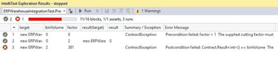
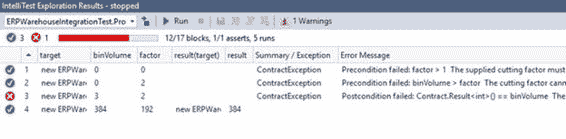
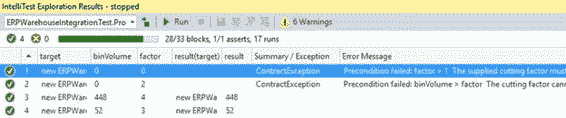

## 修复测试失败

我们可以从之前的 IntelliTests 中看到， ProductionVolumePerBin（）方法存在一些漏洞。这些需要修复，而最明显的修复是除零异常。让我们的方法添加 Contract.Requires（），只允许因子值大于 1 。

```
/// <summary>
/// Calculate the production volume of steel per bin
/// </summary>
/// <param name="binVolume"></param>
/// <param name="factor"></param>
/// <returns>Bin Volume less Remainder</returns>
public int ProductionVolumePerBin(int binVolume, int factor)
{
    Contract.Requires(factor > 1,
        "The supplied cutting factor must be more than the value 1.");
    Contract.Ensures(Contract.Result<int>() == binVolume,
    "The factor used will result in scrap. Please modify the cutting factor.");

    int remainder = CutSteel(binVolume, factor);
    return binVolume - remainder;
}

```

代码 64：修改代码以确保有效整数

添加 Contract.Requires（）前置条件后，该方法仅允许有效的切削系数值。通过右键单击 ProductionVolumePerBin（）方法并从上下文菜单中选择 **Run IntelliTest** ，再次运行 IntelliTest。



图 52：有效整数更改后的 IntelliTest 结果

测试结果完全不同。我们的合同前提条件正常工作，并限制错误的值传递给我们的方法。但是，我们可以看到 IntelliTest 传递的 binVolume 值明显小于因子值。让我们首先通过要求 binVolume 值永远不会小于因子值来解决这个问题。

```
/// <summary>
/// Calculate the production volume of steel per bin
/// </summary>
/// <param name="binVolume"></param>
/// <param name="factor"></param>
/// <returns>Bin Volume less Remainder</returns>
public int ProductionVolumePerBin(int binVolume, int factor)
{
    Contract.Requires(factor > 1,
        "The supplied cutting factor must be more than the value 1.");
    Contract.Requires(binVolume > factor,
        "The cutting factor cannot be greater than the bin volume");
    Contract.Ensures(Contract.Result<int>() == binVolume,
        "The factor used will result in scrap. Please modify the cutting factor.");

    int remainder = CutSteel(binVolume, factor);
    return binVolume - remainder;
}

```

代码 65：修改代码以确保有效切割因子

为实现这一目标，我们需要添加另一个 Contract.Requires（）前置条件，该前置条件将要求 binVolume 值始终大于因子值。从上下文菜单中再次运行 IntelliTest。



图 53：有效切割因子变化后的 IntelliTest 结果

从该测试返回的结果告诉我们， ProductionVolumePerBin（）方法遇到的唯一问题是它仍然无法返回值。我们的方法保证了调用代码每次都会返回一个完美的剪切，并且它失败了。我们可能要考虑通过让代码向用户提供有效的切割因子（例如，提供的切割因子无效）来为此方法添加更多智能。

```
/// <summary>
/// The new valid cutting factor calculated by ProductionVolumePerBin
/// </summary>
public int CalculatedCuttingFactor { get; private set; } = 0;

/// <summary>
/// Calculate the production volume of steel per bin
/// </summary>
/// <param name="binVolume"></param>
/// <param name="factor"></param>
/// <returns>Bin Volume less Remainder</returns>
public int ProductionVolumePerBin(int binVolume, int factor)
{
    Contract.Requires(IsEven(binVolume),
        "Invalid bin volume entered");
    Contract.Requires(factor > 1,
        "The supplied cutting factor must be more than the value 1.");
    Contract.Requires(binVolume > factor,
        "The cutting factor cannot be greater than the bin volume");
    Contract.Ensures(Contract.Result<int>() == binVolume,
        "The factor used will result in scrap. Please modify the cutting factor.");

    int remainder = CutSteel(binVolume, factor);
    while ((binVolume - remainder) != binVolume)
    {
        CalculatedCuttingFactor = CalculateNewCutFactor(binVolume);
        remainder = CutSteel(binVolume, CalculatedCuttingFactor);
    }

    return binVolume - remainder;
}

/// <summary>
/// Calculate any remainder after the modulus operation between volume and factor
/// </summary>
/// <param name="volumeToCut"></param>
/// <param name="factor"></param>
/// <returns>Remainder after cutting</returns>
private int CutSteel(int volumeToCut, int factor)
{
    // Use modulus to determine if the factor produces any scrap
    return volumeToCut % factor;
}

/// <summary>
/// Calculate a new cutting factor
/// r.Next(1, 7); returns a random number between 1 and 6
/// </summary>
/// <param name="binVol">Upper range value of random (bin volume + 1)</param>
/// <returns>
/// A new cutting factor greater than 1 and equal to the bin volume
/// </returns>
private int CalculateNewCutFactor(int binVol)
{
    Random r = new Random();
    return r.Next(2, binVol + 1);
}

/// <summary>
/// Ensure that the passed volume is even
/// </summary>
/// <param name="volume">The volume to verify</param>
/// <returns>boolean</returns>
public bool IsEven(int volume)
{
    return volume % 2 == 0;
}

```

代码 66：Intelligent ProductionVolumePerBin 方法

从前面修改过的代码清单中可以看出，我做了一些事情。业务规则声明 bin 卷将始终为偶数。因此，我添加了 Contract.Requires（）前置条件，以确保只将偶数整数传递给 ProductionVolumePerBin（）方法。

我们代码的另一个补充是 CalculatedCuttingFactor 属性，如果提供的因子无效，它将保存新计算的切割因子。为此，我添加了一个名为 CalculateNewCutFactor 的新方法，该方法将尝试切割因子的替代值，以产生完美切割。

ProductionVolumePerBin（）方法将确定切割因子是否有效。如果没有，它将在循环时运行，直到返回有效的切割系数并实现完美切割。但是，在生产环境中，您可能需要考虑使用完整性循环计数器变量来创建退出条件，或者在达到某个最大迭代次数时抛出异常。仍然可以对 ProductionVolumePerBin（）方法进行大量微调，我不会在这里讨论，因为我只是想说明一个概念。

修改代码后，再次运行 IntelliTest。



图 54：所有通过的 IntelliTest 测试

从测试结果我们可以看出 ProductionVolumePerBin（）方法已经符合我们的代码合同规定的要求。它还产生了六个警告，我将在稍后讨论。

调用代码现在可以实现 ProductionVolumePerBin（）方法，而无需满足返回的无效值。它知道该方法每次都会返回完美的切割。唯一需要检查的是检查是否已建议新因子或提供的因子是否有效。

```
int binVol = 20;
int factor = 3;
CodeContractsDemoProject.ERPWarehouseIntegration oWhi =
    new CodeContractsDemoProject.ERPWarehouseIntegration();
int result = oWhi.ProductionVolumePerBin(binVol, factor);
if (oWhi.CalculatedCuttingFactor != factor && oWhi.CalculatedCuttingFactor != 0)
{
    Console.Write($"The supplied cutting factor of {factor} resulted in "
        + "an imperfect cut. The system suggests using the following "
        + $"cutting factor: {oWhi.CalculatedCuttingFactor}");
}
else
    Console.Write($"The cutting factor of {factor} resulted in 0 scrap");
Console.ReadLine();

```

代码 67：代码调用 ProductionVolumePerBin

您会注意到我每次都在 Console.Write 中使用**字符串插值**。这是 C＃6 中的新功能之一。前面的代码只需要检查 CalculatedCuttingFactor 属性以查看切割因子是否已更改。它知道根据合同， ProductionVolumePerBin（）方法将始终产生完美的切割。

我们可以进一步改进前面的代码，但我想说明的概念很清楚。 Code Contracts 非常适合在 Visual Studio Enterprise 2015 中使用 IntelliTest 创建的测试。您可以结合这两种技术的强大功能来创建高度可靠的代码和高度强制的业务规则，从而使您的应用程序在生产环境中表现良好。