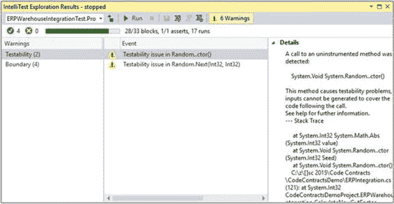

## IntelliTest 警告

如果不讨论警告输出屏幕，对 IntelliTest 的讨论就不完整。

图 55：IntelliTest 警告

您会注意到 **IntelliTest Exploration Results** 屏幕生成了六个警告。这些是大多数可能需要您注意的正常警告。为了安全起见，请查看这些问题以解决任何明显问题。虽然这有点超出了本书的范围，但我将简要提及 **Testability** 和 **Boundary** 中的两种警告类型。

### 可测性

我们看到的警告是在我们的代码中检测到了未经检测的方法。这特定于 CalculateNewCutFactor（）方法中使用的 Random（）方法。这只是意味着 IntelliTest 无法深入到我的代码中的所有路径，以便生成测试所需的所需输出。

### 边界

IntelliTest 对它执行的路径施加了某些限制，以防止它在应用程序进入无限循环时卡住。单击菜单栏上的 **Fix** 图标可以修改这些限制。

### 代码覆盖率

理想情况下，您希望看到 100％的代码覆盖率（33/33 块）。我们的测试仅涵盖 28/33 块。进一步阅读 IntelliTests 将使您了解如何确保良好的代码覆盖率以及可以安全地抑制哪些警告。