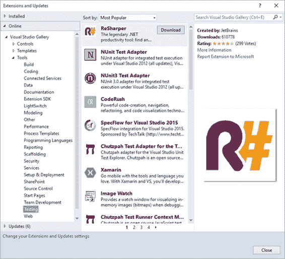

## 安装第三方框架

如前所述，您可以获得在创建 IntelliTests 时使用的测试框架的其他扩展。为此，您可以使用 Visual Studio Extension Manager 或转到 MSDN 网站上的 [Visual Studio 库](https://visualstudiogallery.msdn.microsoft.com/)。

以下是如何从 Visual Studio Extensions 安装第三方框架：

1.  导航到**工具**并选择**扩展和更新**。
2.  在线展开＆gt; **Visual Studio Gallery** ＆gt; **工具**，然后选择**测试**。
3.  浏览结果并选择所需的框架。
4.  单击**下载**。

图 56：从 Visual Studio 安装第三方框架

从 Visual Studio 库安装第三方框架：

1.  转到 [Visual Studio 库](https://visualstudiogallery.msdn.microsoft.com/)。
2.  在**查找**文本框中输入框架名称。
3.  从搜索结果中选择要下载的框架。

如果您不确定要使用哪个框架或者不知道要查找的框架的名称，可以在 Visual Studio 库中浏览框架列表：

1.  转到 [Visual Studio 库](https://visualstudiogallery.msdn.microsoft.com/)。
2.  单击**浏览**链接。
3.  在**类别**下，展开**工具**并选择**测试**。
4.  选择所需的框架并下载该工具。