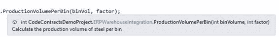
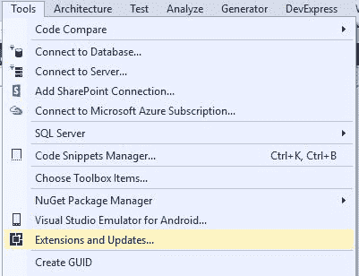
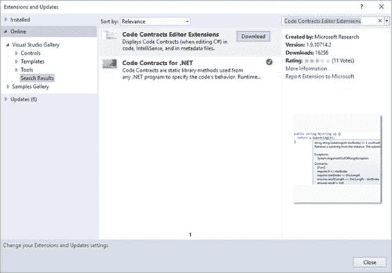
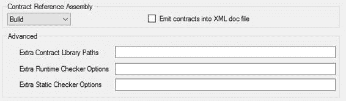
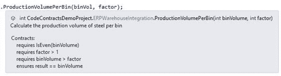
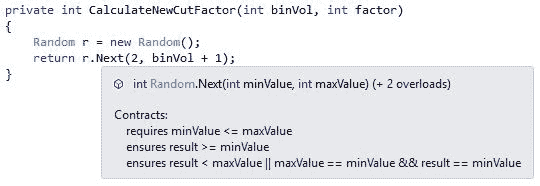

# 第 5 章代码合同编辑器扩展

## 使代码合同更有用

到目前为止，我们已经看到了许多代码合同可以做的事情。这里有一个关于如何使您创建的合同对使用您的类和方法的开发人员更有用的提示。使用代码约定编辑器扩展将允许您查看您调用的方法对于该方法中定义的合同的要求。它将执行此操作，而无需深入查看方法并查看它实现的代码约定。



图 57：ProductionVolumePerBin 快速信息

我们在第 4 章中使用的方法显示了当指针悬停在方法上时您在“快速信息”窗口中为该方法的 XML 注释中提供的注释。这是预期的行为，但我从“快速信息”窗口中不知道该方法实现的合同。 Code Contracts Editor Extensions 改变了这一点。要安装它，请转到 Visual Studio 中的**工具**菜单，然后单击**扩展和更新**。



图 58：扩展和更新

从**扩展和更新**窗口中，选择 **Online** 选项卡并搜索 **Code Contracts Editor Extensions** 。返回的结果应该相当有限。从这里，单击**下载**下载并安装扩展。



图 59：安装代码约定编辑器扩展

安装 Code Contracts Editor Extensions 后，您需要重新启动 Visual Studio。这个扩展的优点在于，您现在可以查看您创建的方法，这将显示该方法的合同。

在此之前，您需要确保在代码合同设置中将**合同参考装配**设置为 **Build** 。



图 60：合同参考汇编

现在，如果将鼠标悬停在 ProductionVolumePerBin（）方法上，您将看到“快速信息”窗口中包含有关其实现的合同的信息。



图 61：使用合同增强的方法工具提示

这使我能够使用该方法而无需查看方法内部，并传递将成功验证的有效参数。我现在有更多关于我正在调用的方法的信息。

使用 Code Contracts Editor Extensions 时的另一个宝石是能够查看基类实现的代码约定。再看一下我们的 CalculateNewCutFactor（）方法。

```
/// <summary>
/// Calculate a new cutting factor
/// r.Next(1, 7); returns a random number between 1 and 6
/// </summary>
/// <param name="binVol">Upper range value of random (bin volume + 1)</param>
/// <returns>
/// A new cutting factor greater than 1 and equal to the bin volume
/// </returns>
private int CalculateNewCutFactor(int binVol)
{
    Random r = new Random();
    return r.Next(2, binVol + 1);
}

```

代码 68：Random（）方法

将鼠标悬停在 Next（）方法上，我们可以查看它所需的合同。 Code Contracts Editor Extensions 通过挖掘基类并显示实现的合同来完成此任务。



图 62：随机下一个方法合同

我们可以看到 Next（）方法实现的一个代码契约是 minValue 必须小于或等于 maxValue 。根据我们的要求，我想确保 minValue 始终大于或等于 2 。使用我们能够收集的关于 Next（）方法实现的代码契约的信息，我们现在可以继续创建我们自己的 GetRandom（）方法，该方法将符合我们的要求。代码合同要求。

```
/// <summary>
/// Calculate a new cutting factor
/// r.Next(1, 7); returns a random number between 1 and 6
/// </summary>
/// <param name="binVol">Upper range value of random (bin volume + 1)</param>
/// <returns>
/// A new cutting factor greater than 1 and equal to the bin volume
/// </returns>
private int CalculateNewCutFactor(int binVol)
{
    return GetRandom(2, binVol + 1);
}

/// <summary>
/// Get a random number
/// </summary>
/// <param name="minValue">Value not less than 2</param>
/// <param name="maxValue">Upper range value of the random number to generate</param>
/// <returns>A random integer</returns>
static int GetRandom(int minValue, int maxValue)
{
    Contract.Requires(minValue >= 2,
        "minValue cannot be less than 2");
    Random r = new Random();
    return r.Next(minValue, maxValue);
}

```

代码 69：自定义 GetRandom（）方法

使用代码约定和代码约定编辑器扩展允许我们编写更强大的代码并对我们的代码进行微调，以便轻松地符合所需的业务规则。

|  | 提示：您需要记住 Random 类不是真正的随机数生成器。例如，当您调用 Next（） 时， Random 类使用某种内部状态返回看似随机的数字。然后它会更改其内部状态，以便下次调用 Next（） 时，它会返回另一个明显随机的数字。生成真正的随机数超出了本书的范围;如果你需要真正的随机性，你需要做更多的研究。 |