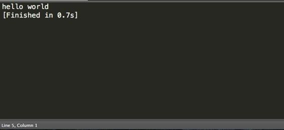

# 第 1 章简介

## ES6 简介

ECMAScript 6（ES6），也称为 ECMAScript 2015，为开发人员长期以来一直想要的表带来了新的功能和特性。等待已经结束，您现在可以开发所有这些功能。真正的好消息是，您还可以使用转换器来定位甚至不支持 ES6 的浏览器。编译器将一种语言翻译成另一种语言，例如 C# 到 MSIL，而转换器将一种语言版本转换为另一种语言，例如 ES6 到 ES5。

## 入门

为了跟随本书中的代码示例，您需要在开发机器上具有以下内容：

*   Sublime Text - 我们将设置一个自定义构建命令，以便您可以使用默认构建命令简单地转换和执行脚本。您可以从以下链接获取 Sublime Text： [http://www.sublimetext.com](http://www.sublimetext.com) 。
*   NodeJS - 请确保您的计算机上安装了 Node.js.您可以从以下链接获取 Node.js： [https://nodejs.org](https://nodejs.org/) 。
*   巴别塔 - 我们将使用巴别塔作为我们的转录器。 Babel 允许我们使用 ES6 语法编写代码并将其转换为 ES5 语法。如果你去他们的网站，你可以看到你的代码被实时转换。您可以通过以下链接获取 BabelJS： [https://babeljs.io](https://babeljs.io) 。在 Babel 网站上，您还可以单击“试用”链接并测试此处显示的大部分代码。

可以使用您喜欢的转换器在浏览器中运行大多数代码示例，但为了保持一致性，我们将使用先前声明的依赖项。我们的目标是为您提供快速简便的工具，帮助您充分了解 ES6 中的新功能。

|  | 注意：除非另有说明，否则我们将使用 Sublime Text 以及 Babel 和 Node.js. |

以下是让您的机器准备好使用本书中的代码示例的步骤：

1.  在您的计算机上安装最新版本的 Sublime Text。您可以使用您喜欢的任何编辑器，因为我们只是提供一个示例命令，允许您轻松地测试脚本。
2.  确保您的计算机上安装了最新版本的 Node.js.在撰写本文时，我们正在使用 v4.2.4。
3.  下载并将以下 Git 存储库解压缩到您选择的文件夹中： [https://github.com/mattduffield/es6-succinctly.git](https://github.com/mattduffield/es6-succinctly.git) 。
4.  打开命令 shell，从 Git 存储库导航到包含文件 package.json 的目录，然后输入命令`npm install`。
5.  在 Sublime 中，转到`Tools|Build System|New Build System`。

1.  您将看到一个新标签。保存选项卡并将其命名为“babel-node.sublime-build”。
2.  如果您使用的是 Mac 或 Linux，则应该能够使用以下代码：

代码清单 1

```
{
     "cmd": ["babel-node",
  "$file"],
     "path": "/usr/bin:/bin:/usr/sbin:/sbin:/usr/local/bin"
}

```

5.  如果您使用的是 Windows，则应该能够使用以下内容：

代码清单 2

```
{
     "shell_cmd": "babel-node $file",
     "path": "$PATH"
}

```

8.  对于任一环境，您都可以使用命令`which node`和`which babel`来获取路径。我正在使用 Git Bash 在 Windows 上执行这些命令。
9.  接下来，您需要让 Sublime Text 知道要使用哪个构建系统。在 Sublime Text 中，确保从菜单`Tools|Build System`中选中`babel-node`。这将执行我们创建的新构建脚本，并允许您转换和执行示例。

7.  你应该准备好使用 Sublime 来玩脚本了。请注意，Sublime 将根据活动的任何选项卡尝试构建。如果您正在处理配置文件，这可能是您想要的，也可能不是。
8.  如果您创建名为“test.js.”的文件，则可以对此进行测试。在此文件中添加以下代码：

代码 3

```
let greeting = "hello world";
console.log(greeting);

```

|  | 注意：您可能需要在文件 test.js 中放置一个'use strict'语句作为第一行，以便运行脚本。 |

12.  保存文件并构建。你应该在 Sublime 中看到如下内容：



图 1：Sublime Text 输出

如果您发现它没有识别`babel-node`命令，我建议全局安装以下内容，以便正确更新路径环境：

代码清单 4

```
npm
  install –g babel
npm
  install –g babel-cli

```

如果您不希望使用 Sublime Text 作为编辑器和构建系统，您只需使用任何文本编辑器（如记事本），使用.js 扩展名保存源代码，导航到包含脚本的目录，然后通过键入以下命令从命令行执行：

`&gt; babel-node myscript.js`

另一个测试 ES6 功能的好工具是 ScratchJS。它是 Chrome 的扩展程序，甚至允许您选择要使用的转录程序。同样，您可以使用自己选择的工具，但是当我们到达模块时，我们希望从文件系统加载模块，这使得在使用浏览器测试工具时很难。

## 制图人

以下是热门转发器的简短列表：

*   Babel - 这是迄今为止 ES6 最受欢迎的转发器。它带有 2015 年预设，您可以使用它支持 2015 规格的大部分内容。你可以在这里找到更多关于 Babel.js 的信息： [https://babeljs.io](https://babeljs.io) 。有一点需要注意的是 Babel 6 最近发布了，但 REPL 在线还没有更新。
*   Traceur - 这是 ES6 的另一个流行的转换器。它不完全符合 ES6 作为 Babel 的规范，但它仍然是一个不错的选择。您可以在此处找到有关 Traceur 的更多信息： [https://github.com/google/traceur-compiler](https://github.com/google/traceur-compiler) 。
*   TypeScript - 这可能是 Microsoft 堆栈开发人员最受欢迎的转换器。 TypeScript 不是严格的 ES6，因为它在混合中添加了键入和接口。就 ES6 合规而言，它落后于 Babel 和 Traceur。但是，它是一个很棒的工具，如果你想获得强类型编译时异常，这就是你的工具。你可以在这里找到更多关于 TypeScript 的信息： [http://www.typescriptlang.org/](http://www.typescriptlang.org/) 。

## 浏览器支持

桌面浏览器支持相当不错。您会惊讶地发现，Microsoft Edge 在 Firefox 方面处于领先地位，在标准合规方面处于领先地位。 Chrome 紧随其后但仍有一些方法可以实现。

在撰写本书时，建议使用像 Babel 这样的“transpiler”。

## 代码清单

本书中的所有代码清单都是使用 Sublime Text 3 生成的。大多数代码示例和屏幕截图都是使用 Chrome 中的 Scratch JS 创建的。 Scratch JS 是 Chrome 的扩展;它允许您选择您想要使用的转换器。对于本书的其余部分，除非另有说明，否则我们将使用 Babel 作为转换器。 Scratch JS 还允许您通过单击切换输出将 ES6 代码的输出切换为 ES5 代码。如果您对经典 ES5 代码中代码的语法有什么好奇，这可能是有益的。由于 ES6 仍处于开发阶段，因此您可能会遇到一些小问题，这些问题可以使一些示例正常工作，尤其是当您从命令行调用 babel-node 时。如果发生这种情况，您可以访问 Babel 网站，并将 ES6 代码粘贴到他们的交互式转发页面中。这将生成 ES5 代码。您可以获取此输出，将其另存为.js 文件，然后使用节点运行它。这种方法通常可以解决大多数问题。最后，您还可以通过单击“运行”从 Scratch JS 选项卡执行 ES6 代码。