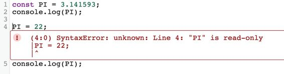

# 第 2 章常量和范围

## 常数

大多数现代语言提供了一些定义`constant`的方法。这可确保变量的值永远不会更改，并且对于您知道在应用程序中永远不会更改的值，这是一个很好的优化用法。

我们来看看`constants`的几个例子：

代码清单 5

```
const PI = 3.141593;
console.log(PI);

```

代码在 Sublime 中使用 Ctrl + B for Windows 或 Cmd + B for Mac 生成以下输出：

代码清单 6

```
3.141593

```

|  | 注意：除非另有说明，否则我们将使用 Sublime 作为代码片段的首选编辑器。在 Git 存储库中，您将在自己的章节中找到相应的片段。 |

现在，让我们尝试重新为`PI`变量赋值。我们可以通过在编辑器中添加以下行来完成此操作：

代码清单 7

```
PI =
22;
console.log(PI);

```

尝试运行上一个示例将产生语法错误。转换器很聪明，足以告诉我们原因。看一下下图：



图 2：常量只读

您可以在图 2 中看到，由于`PI`被声明为`constant`，因此它被认为是只读的。这很好，错误描述非常清楚。

|  | 注意：const 关键字只能在块范围区域中使用。我们将在下一节中讨论块范围。 |